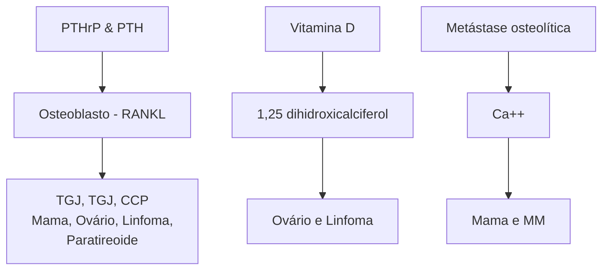
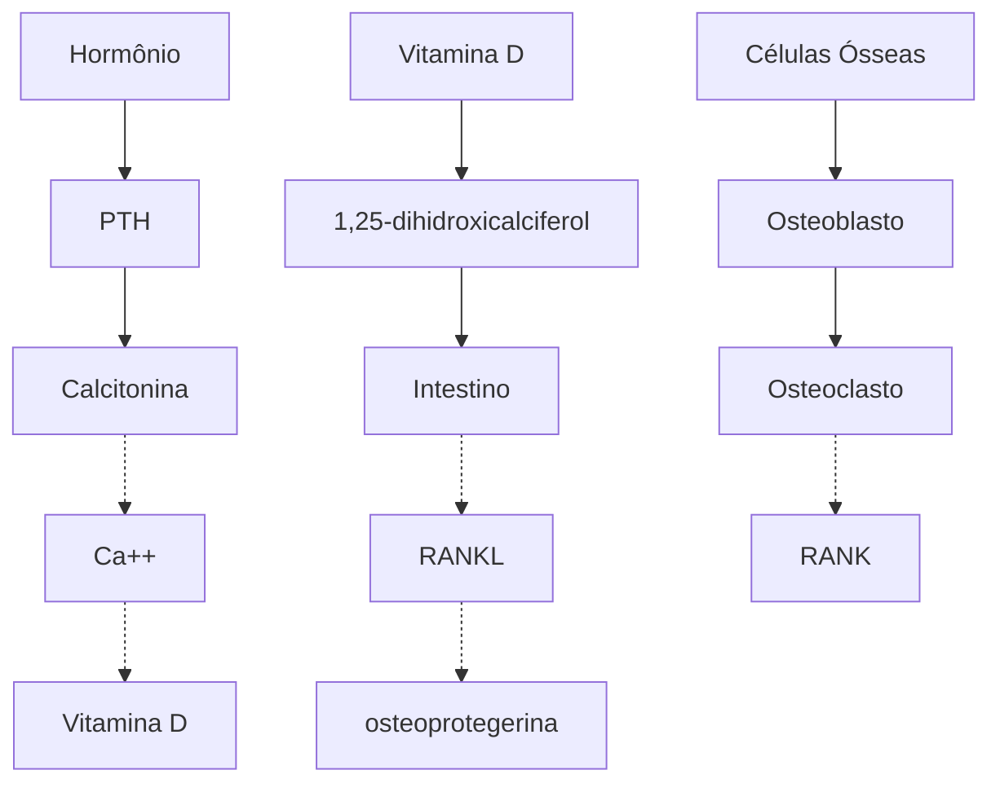
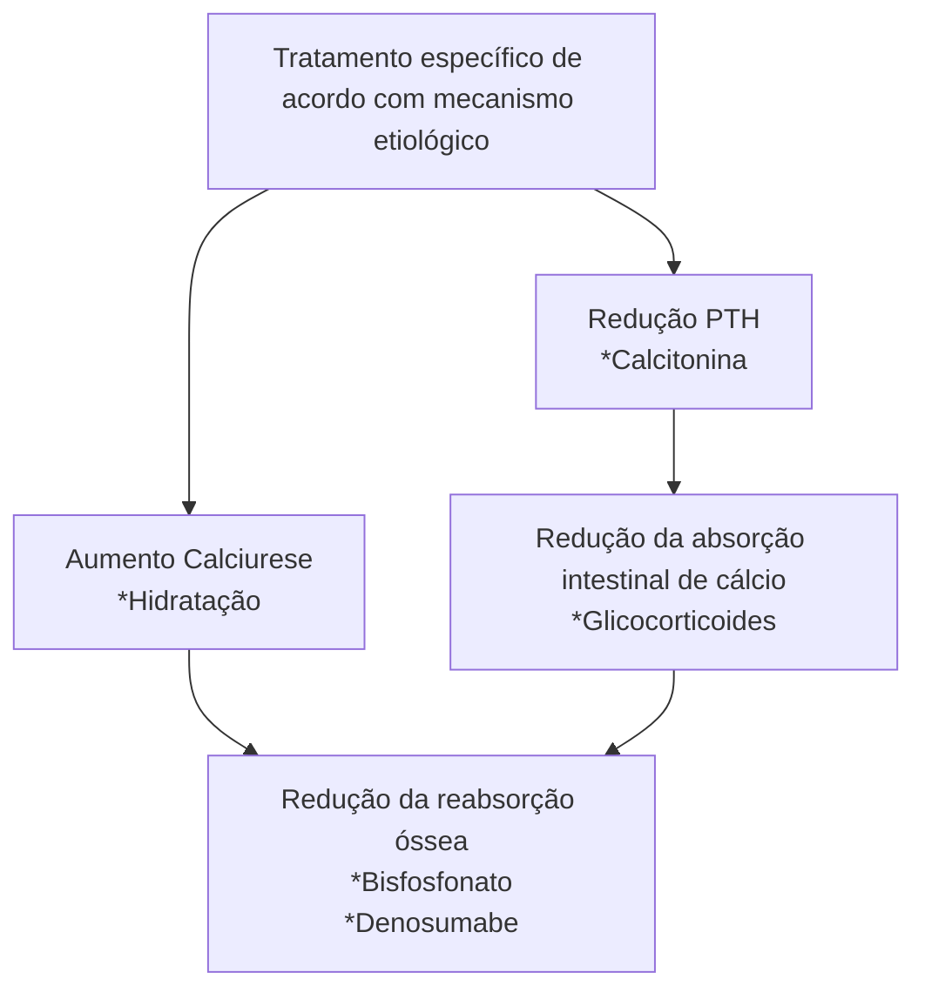

Oncologia (CM)

# EMERGÊNCIAS ONCOLÓGICAS

• Obstrução intestinal maligna: Ausência de fezes e flatos + dor + náuseas e vômitos. Conduta: Jejum + SNG aberta + terapia medicamentosa.
• Síndrome da Veia Cava Superior: Edema de MMSS e face + pletora facial. Conduta: Suporte + tratamento da neoplasia (Biópsia é fundamental)
• Hipercalcemia da malignidade: Condição associada a mau prognóstico. Conduta: hidratação vigorosa + bisfosfonatos + tratamento da neoplasia
• Síndrome de compressão medular: Dor + déficit motor/sensitivo. Diagnóstico: RM de coluna; Tratamento cirúrgico ou radioterapia.
• Neutropenia febril: Febre + neutropenia. Estratificar risco com escore MASCC (maior ou igual a 21 é baixo risco). Baixo risco: Ciprofloxacino + Amox-clav. Alto risco: Cefepime (ou Tazo) + avaliar critérios para Vancomicina.
• Síndrome de Lise Tumoral: Aumento de ácido úrico, potássio e fósforo e queda do cálcio. Conduta inicial: Hidratação vigorosa.

## 1. OBSTRUÇÃO INTESTINAL MALIGNA

• Obstrução intestinal em pacientes com comprometimento neoplásico intra-abdominal e/ou pélvico;

### 1.1 NEOPLASIAS MAIS ASSOCIADAS:

• 20 – 50%: trato ginecológico, principalmente ovário;
• 10 – 28%: trato gastrointestinal, principalmente colorretal e gástrico.
• Frequente em pacientes com carcinomatose peritoneal;

### 1.2 QUADRO CLÍNICO:

• Dor abdominal em cólica;
• Distensão abdominal;
• Náuseas e vômitos – principal;
• Parada da eliminação de flatos e fezes ou diarreia paradoxal.

### 1.3 EXAME FÍSICO:

• Ausência de RHA → considerar oclusão intestinal maligna;
• Presença de som metálico → considerar suboclusão intestinal maligna.

### 1.4 TIPOS DE OBSTRUÇÃO:

**Mecânica:**
• Extrínseca:
  • Compressão;
  • Radiação (fibrose actínica);
  • Aderências.

**Intrínseca:**
• Obstrução direta pelo tumor;
• Linite gástrica.

**Funcional:**
• Infiltração:
  • Mesentério;
  • Nervos envolvidos na motilidade.
• Neuropatia paraneoplásica;
• Íleo paralítico secundário.
• Infecções:
  • Ascite
  • Afecções intra ou retroperitoneais.
  • Medicamentos.

### 1.5 EXAMES COMPLEMENTARES:

• **Radiografia de abdome: em posição supina;**
  • Exame inicial de escolha – demonstra sensibilidade de 66%;
  • Obstrução de delgado: evidenciada com, ao menos, dois níveis hidroaéreos;
  • Obstrução de cólon: observa-se cólon proximal dilatado e o cólon distal sem ar.

• **TC de abdome com contraste IV;**
  • Exame de escolha: apresenta sensibilidade de 93% e especificidade de 99%;
  • Objetivos:
  • Diagnosticar carcinomatose;
  • Confirmar obstrução mecânica;
  • Identificar possíveis emergências cirúrgicas;
  • Estabelecer diagnóstico diferencial com bridas, principalmente.

• **Radiografia com contraste baritado VO;**
• **Ressonância magnética abdominopélvica.**

### 1.6 OBSERVE AS IMAGENS ABAIXO:

• Presença de nível hidroaéreo, indicando quadro obstrutivo. Figura 1
• Carcinomatose peritoneal Figura 2

**Figura 1 Nível hidroaéreo**

[CT scan image showing axial view of abdomen with hydroaeric level visible]

![TC de abdome com infiltração peritoneal difusa e ascite]

**Figura 2** TC de abdome com infiltração peritoneal difusa e ascite

### 1.7 TRATAMENTO: OPÇÕES MEDICAMENTOSAS:

• Corticosteroides – principalmente dexametasona;
  • Redução do edema peritumoral;
  • Apresenta efeito antiemético central;
  • Idealmente, deve ser utilizado por menos de 10 dias;
  • NNT = 6.
• Antieméticos;
  • Redução de náuseas e vômitos;
  • Haloperidol: 1ª linha;
  • Antagonista 5-HT3: 2ª linha;
  • Metoclopramida: usada somente nos casos de obstrução incompleta pelo efeito pró-cinético.
  • A olanzapina é um antipsicótico que também pode ser uma opção para controle de náuseas e vômitos.
• Inibidor de bomba de próton (exemplo: omeprazol);
  • Redução da secreção gástrica;
  • Redução do refluxo biliar;
  • Promove alívio da dor esofágica.
• Anticolinérgicos (Escopolamina);
  • Útil para o manejo de vômitos e dor em cólica;
  • Contraindicação: glaucoma, retenção urinária;
  • Efeitos colaterais: boca seca, taquicardia, agitação.
• Análogo de somatostatina (Octreotida);
  • Inibe a secreção de VIP e substância P;
  • Redução do fluxo esplâncnico e portal;
  • Redução da secreção do delgado e motilidade gastrointestinal;
  • Aumenta a reabsorção gastrointestinal de água e eletrólitos.

### 1.8 CONDUTAS:

• Jejum ou dieta líquida;
• Sonda nasogástrica aberta;
• Corticosteroide → dexametasona 8 mg, EV, 2x ao dia (na literatura, recomenda-se doses de 6-16mg/dia)
• Analgésicos;
  • Opioide → Morfina 2 mg, EV, de 4 em 4 horas;
  • Escopolamina, 20 mg, EV de 6 em 6 horas.
• Antieméticos;
  • Ondansetrona 8 mg, EV de 8 em 8 horas;
  • Haloperidol 1 mg, EV de 8 em 8 horas;
  • Evitar metoclopramida até que seja descartada obstrução total.

• Caso o paciente não apresente melhora após 3-5 dias → associar Octreotide (150 mcg, de 6 em 6 horas, SC ou EV);

### 1.9 OUTRAS OPÇÕES TERAPÊUTICAS:

• Cirurgia: apenas para os casos selecionados de obstrução localizada/ ponto único ou abdome agudo → avaliar a proporcionalidade;
• Tratamento oncológico específico – apenas em pacientes com boa performance e em neoplasias quimiossensíveis;
• Outras terapias de suporte: stents metálicos, auto expansivos, gastrostomia descompressiva.

## 2. SÍNDROME DA VEIA CAVA SUPERIOR

![Edema de face, circulação colateral, estase jugular]

**Figura 3** Edema de face, circulação colateral, estase jugular

### 2.1 ETIOLOGIA:

• 50% - câncer de pulmão não pequenas células;
• 25-35% - câncer de pulmão pequenas células;
• 10 - 15% - linfoma não Hodgkin;
• 20% - outras causas benignas.

OBS.: O diagnóstico etiológico é fundamental!

### 2.2 QUADRO CLÍNICO:

• O quadro clínico é exuberante, contudo raramente é emergência!
• Manifestações:
  • Edema de face (82%), pescoço e membros (46%);
  • Estase jugular (63%) e circulação colateral (53%);
  • Dispneia (54%) e tosse (54%);
  • Pletora facial, rouquidão;
  • Em quadros mais graves:
• Alteração do nível de consciência;
• Compressão traqueal;
• Edema laríngeo caracterizado por estridor.
• **Observe a imagem abaixo: Sinal de Pemberton.**
  • Ao elevar os membros superiores, ocorre aumento da pletora facial.

EMERGÊNCIAS ONCOLÓGICAS                                                                                                           3

**Figura 4** Imagem com ilustração do sinal de Pemberton, com pletora facial ao elevar os membros superiores

## 2.3 DIAGNÓSTICO:
- Angiotomografia de tórax;
- Biópsia – diagnóstico histopatológico para definição de etiologia.

## 2.4 TRATAMENTO:
- Estabilização clínica:
  - Protocolo ABC;
  - Cabeceira elevada;
  - Anticoagulação profilática;
  - Restrição hídrica;
  - Suporte de O2;
  - Evitar hipervolemia.
- **O tratamento principal consiste em tratar a neoplasia de base! Esse tratamento deve ser realizado após a definição etiológica pela biópsia.**
  - Deve ser direcionado para o diagnóstico oncológico: envolve uso de quimioterapia e radioterapia.
- Emergência:
  - Terapia endovascular (stent) – rápido alívio sintomático.

OBS.: Não há evidências, porém deve ser considerado o manejo com corticoide (evitar em neoplasias hematológicas ainda não biopsiadas) e diurético.

## 3. HIPERCALCEMIA DA MALIGNIDADE

## 3.1 DADOS EPIDEMIOLÓGICOS:
- Ocorre em até 30% dos pacientes oncológicos no curso da doença;
- Prevalência estimada em 2-3%;
- **Tumores mais associados;**
  - Câncer de pulmão não pequenas células;
  - Câncer de mama;
  - Mieloma múltiplo;
  - CEC de cabeça e pescoço;
  - Carcinoma urotelial e tumores renais;
  - Câncer de ovário.
- É 4x mais comum em pacientes estádio clínico IV;
- Demonstra pior prognóstico;
- Mortalidade em 30 dias → Até 50%.

## 3.2 ETIOLOGIAS:
- Secreção de PTH-like – maioria dos casos (80%);
- Osteólise local;
- Produção de vitamina D – linfomas.

## 3.3 QUADRO CLÍNICO:

**Tabela 1** Quadro clínico da hipercalcemia da malignidade, conforme tempo de instalação da hipercalcemia

|                   | Agudas                         | Crônicas              |
| ----------------- | ------------------------------ | --------------------- |
| Gastrointestinais | Anorexia, náusea, vômitos      | Dispepsia, obstipação |
| Renais            | Poliúria, polidipsia           | Nefrolitíase          |
| Neuromusculares   | Confusão mental, estupor, coma | Fraqueza              |
| Cardíacas         | Bradicardia, bloqueio AV       | HAS                   |

## 3.4 CLASSIFICAÇÃO:
- Hipercalcemia:
  - Leve: 10,5 – 11,9 mg/dL;
  - Moderado: 12 – 13,0 mg/dL;
  - Grave: > 14 mg/dL.

## 3.5 HOMEOSTASE DO CÁLCIO:

**Figura 5** Alteração da homeostase do cálcio na hipercalcemia da malignidade

## 3.6 DIAGNÓSTICO DIFERENCIAL:

**Hiperparatireoidismo primário;**
- PTH elevado/normal-alto;
- Hipercalcemia;
- Hipofosfatemia;
- Calciúria de 24h > 200;
- Fração de excreção de cálcio > 1%

**Figura 6** Homeostase óssea fisiológica

OBS.: Em 80% dos casos, há presença de adenoma solitário; enquanto que em 20%, há hiperplasia das parótidas.

• **Hipercalcemia hipocalciúrica familiar;**
  • Diferencia-se do hiperparatireoidismo pela calciúria reduzida;
  • Ao restante, mantém o mesmo perfil de alterações laboratoriais.
• **Hipercalcemia associada a doença granulomatosas;**
  • Por produção de vitamina D → doença de Wegener, sarcoidose, tuberculose, hanseníase.

## 3.7 ABORDAGEM TERAPÊUTICA:

• Investigação: solicitação do Cálcio iônico, PTH e vitamina D;
  • Corrigir o valor de cálcio total para albumina;
  • CaT corrigido = CaT (mg/dL) + 0,8 (4 – albumina (g/dL). Abordagem

**Figura 7** Esquema ilustrativo para tratamento da Hipercalcemia da Malignidade

• **Tratamento geral:**
  • Hidratação endovenosa: 200 – 300 mL/h de soro fisiológico;
  • Débito urinário: 100 – 150 mL/hora;
  • Furosemida: 20 – 40 mg, EV (em caso de hipervolemia).

**Tratamento específico:Inibidores da reabsorção óssea:**

• Pamidronato 60 - 90 mg, EV, em 2 – 24 horas;
  • ClCr < 30 ml/min - Não recomendado;
  • ClCr maior ou igual a 30 - Sem necessidade de ajuste.
• Ácido zoledrônico 4 mg, EV, em 15 – 30 minutos;
  • Cr > 4,5 - Uso não recomendado ;
  • No caso de hipercalcemia da malignidade, não é necessário o ajuste para a função renal (no uso em outros cenários, o ajuste para a função renal, é realizado de maneira diferente).

OBS.: Efeitos colaterais do ácido zoledrônico e do pamidronato: osteonecrose de mandíbula, olho vermelho, sintomas flu-like, disfunção renal.

• Denosumabe 120 mg, SC. Opção em pacientes com doença renal grave para os quais os bisfosfonatos estão contraindicados.

• **Tratamento específico: Calcitonina**
  • Esquema: 4 – 8 UI/kg, SC ou EV;
  • Pode ser utilizada em urgências!!
  • Contudo, apresenta efeito rápido e fugaz → pode cursar com taquifilaxia.

• **Tratamento específico: Corticoide:**
  • Útil para quadros hemorrágicos associados à produção de vitamina D.

OBS.: Suspender a administração de lítio, tiazídicos e a reposição de cálcio!

## 4. SÍNDROME DE COMPRESSÃO MEDULAR

• Ocasionada compressão, deslocamento ou encarceramento do saco dural que envolve a medula espinhal ou a cauda equina; Figura 8
• Até 50% dos pacientes têm acometimento em mais de uma área da coluna;
• Ocorre em até 5% dos pacientes com neoplasia avançada nos últimos 2 anos de vida.

**Figura 8** Frequência de Síndrome de Compressão Medular, conforme localização da compressão: < 10% cervical, 60-80% torácica e 15-30% lombossacra, além de imagem de ressonância magnética, mostrando uma Síndrome de Compressão Medular

### 4.1 TUMORES MAIS ASSOCIADOS;

• Próstata;
• Pulmão;
• Rim;
• Mieloma múltiplo;
• Linfoma não Hodgkin.

### 4.2 QUADRO CLÍNICO:

• **Dor;**
  • É o sintoma mais comum; ocorre em até 95% dos casos;
  • Precede os sintomas neurológicos.
• **Déficit motor;**
  • 2° sintoma mais comum.
• **Déficit sensorial;**
  • Auxilia a localizar o nível de compressão medular.
• **Déficit autonômico;**
  • Dismotilidade urinária e intestinal.

### 4.3 DIAGNÓSTICO E INVESTIGAÇÃO:

• O diagnóstico precoce e o rápido início terapêutico são essenciais para limitar a ocorrência de sequelas;
• Exames complementares:
  • 1° opção: RM de coluna cervical + torácica + lombar + sacral;
  • Alternativa: TC de coluna cervical + torácica + lombar + sacral.

EMERGÊNCIAS ONCOLÓGICAS                                                                                         5

## 4.4 Tratamento:
• Corticoide;
  • Dexametasona 10 mg, EV em bolus, seguido de 4- 6 mg de 6 em 6 horas;
  • Redução do edema vasogênico decorrente da isquemia medular.
  • LEMBRE-SE: Ivermectina 12 mg, em dose única, omeprazol e controle glicêmico.
• Analgesia;
• Profilaxia para TEV;
• Cirurgia: Deve ser escolhida, principalmente se:
  • Déficits com pouco tempo de instalação (< 72 horas);
  • Instabilidade de coluna;
  • Tumores pouco sensíveis à radioterapia
  • Radioterapia;
• Reabilitação; em muitos casos, o déficit se torna irreversível.

## 5. NEUTROPENIA FEBRIL

### 5.1 CRITÉRIOS DIAGNÓSTICOS:
• Febre:
  • Temperatura oral ≥ 38,3 °C em uma medida OU temperatura oral ≥ 38,0 °C, por 1 hora.
• Neutropenia: < 500 neutrófilos; < 1000 neutrófilos com previsão de queda em 48 horas, neutropenia funcional ou prolongada (> 7 dias)
• 10 – 50% dos pacientes com neoplasias sólidas em tratamento;
• É frequente em tumores hematológicos, alcançando 80% dos pacientes.

OBS.: Tempo de internação médio: 9,6 dias; mortalidade: 10%.

### 5.2 AVALIAÇÃO INICIAL:

**Exame físico completo**
• Incluindo avaliação de pele, orofaringe, genitália;
• Não realizar toque retal! Há risco associado de aumento da translocação bacteriana.

**Exames complementares:**
• Laboratoriais:
  • Hemograma;
  • Função renal;
  • Função hepática;
  • Eletrólitos;
  • Provas de atividade inflamatória;
  • Hemocultura: 2 pares com 10 mL por frasco – um par de cateter, se houver;
  • Urina tipo 1;
  • Urocultura;
  • Radiografia de tórax.
• Agentes bacterianos → depende do perfil do hospital!
• **Patógenos gram-positivos comuns;**

• *Coagulase-negative staphylococci;*
• *Staphylococcus aureus*, incluindo *meticilina-resistente;*
• *Enterococcus spp*, incluindo *vancomicina-resistente;*
• *Grupo viridans streptococci;*
• *Streptococcus pneumoniae;*
• *Streptococcus pyogenes.*
• **Patógenos gram-negativos comuns:**
  • *Escherichia coli;*
  • *Klebsiella spp;*
  • *Enterobacter spp;*
  • *Pseudomonas aeruginosa;*
  • *Citrobacter spp;*
  • *Acinetobacter spp;*
  • *Stenotrophomonas maltophilia.*

### 5.3 MASCC SCORE – PARA CLASSIFICAR O RISCO! → BAIXO RISCO PARA VALORES ≥ 21;
• Cofira Tabela 2

**Tabela 2 Critérios de MASCC**

| Características                                        | Pontuação |
| ------------------------------------------------------ | --------- |
| "Carga" de doença (considerando todas as comorbidades) |           |
| Sintomas leves ou ausentes                             | 5         |
| Sintomas moderados                                     | 3         |
| Sem hipotensão                                         | 5         |
| Sem DPOC                                               | 4         |
| Tumor sólido ou hematológico sem infecção fúngica      | 4         |
| Sem desidratação                                       | 3         |
| Paciente ambulatorial (não internado no início NF)     | 3         |
| Idade < 60 anos                                        | 3         |

### 5.4 TRATAMENTO:
• Baixo risco (≥ 21):
  • Antibioticoterapia VO: amoxicilina-clavulanato + ciprofloxacino;
  • A primeira aplicação deve ser realizada de modo endovenoso, em ambiente hospitalar;
  • Observação: de 4 – 24 horas → caso estável, manter tratamento ambulatorial, via oral.
• Alto risco: tratamento intra-hospitalar;
  • Antibioticoterapia de amplo espectro:
  • A escolha inicial depende do protocolo institucional;
  • Opções:
  • Piperacilina-tazobactam ou cefepime;
  • Carbapenêmico – menos frequente.

ONCOLOGIA

OBS.: Para os casos com presença de infecção recente por bactéria multidroga resistente, guiar a terapêutica pela última cultura.

• Adicionar vancomicina se:

**Tabela 3 Critérios para adição de vancomicina**

| Suspeita de infecções associadas à cateter
Instabilidade hemodinâmica | Pneumonia documentada
Hmc com cocos gram + |
| ------------------------------------------------------------------------- | ---------------------------------------------- |
| Infecção de pele                                                          | Mucosite grave                                 |
| ATB profilático com quinolona                                             | Colonização prévia                             |

• **Reavaliação a cada 48 – 72 horas, sem melhora:**
  • Reavaliar antibiótico (considerar ampliar a cobertura);
  • Considerar solicitar novo exame de imagem (TC de tórax, TC dos seios da face);
  • Considerar agentes fúngicos e virais;
  • Considerar adicionar antifúngico empírico;
  1. Equinocandinas;
  2. Anfotericina B;
  3. Voriconazol.
  • Outros exames guiados pelos sintomas
  1. Se diarreia → pesquisar Clostridium, coprocultura, protoparasitológico de fezes;
  2. TC de abdome → para avaliação de colite neutropênica.

• **Reavaliação em 96 horas, sem melhora;**
  • Hemograma completo a cada 2-3 dias;
  • TC de tórax – repetir a cada 2-3 dias;
  • TC dos seios da face;
  • Exames direcionados para os focos suspeitos;
  • Investir em diagnóstico etiológico: procedimentos invasivos, biópsias;
  • Hemocultura para fungo;
  • Considerar a terapia antifúngica empírica com anfotericina B, se:
  1. Neutropenia febril > 4 dias e padrão radiológico sugestivo OU neutropenia febril > 7 dias;
  2. Galactomanana positiva;
  3. Antecedente de infecção fúngica invasiva.

## 5.5 TEMPO PARA TRATAMENTO:

**Caso seja identificado o foco:**
• Guiar o antibiótico e o tempo de tratamento para o foco! (ex.: ICS, BCP, colite)

**Sem foco definido: Manter antibioticoterapia até:**
• Paciente afebril por 48 horas;
• Culturas negativas e neutrófilos > 500 céls/mm3 e em ascensão.

**Uso de fator estimulador de colônias granulocíticas (G-CSF)**
• Regra geral:
  • Sem indicação de profilaxia secundária para pacientes com neutropenia febril → apenas reduz o tempo de internação e não a sobrevida global.
  • Se houver risco de neutropenia da quimioterapia ≥ 20% → indicado!

## 6. SÍNDROME DE LISE TUMORAL

• Síndrome caracterizada por distúrbios hidroelétricos, causados a partir da liberação maciça de componentes intracelulares na corrente sanguínea por lise tumoral;

• É mais comum a ocorrência após o início do tratamento (Até 7 dias após);

• O risco é aumentado caso exista disfunção renal prévia, desidratação e em casos de tumores com proliferação elevada, grande volume de doença e uma alta sensibilidade à quimioterapia.

• Aumento da incidência nos últimos anos em tumores sólidos, apesar de manter maior frequência em tumores hematológicos.

• Maior mortalidade em tumores sólidos - atraso no diagnóstico?

• Confira Tabela 4 Tabela 5

**Tabela 4 Tumores sólidos mais associados a Síndrome de Lise Tumoral**

| Tumores Sólidos                      |
| ------------------------------------ |
| Câncer de pulmão de pequenas células |
| Tumores germinativos                 |
| Sarcomas e melanomas metastáticos    |
| Medublastoma e neuroblastoma         |
| Câncer de próstata metastático       |
| Câncer de mama metastático           |

**Tabela 5 Tumores Hematológicos mais associados a Síndrome de Lise Tumoral**

| Tumores hematológicos              |
| ---------------------------------- |
| Leucemia linfoblástica aguda (LLA) |
| Leucemia mieloide agura (LMA)      |
| Linfoma não-hodgkin (LNH)          |
| LLC, LMC, Linfoma de Hodgkin       |

## 6.1 DIAGNÓSTICO:

• **Critérios de Cairo-Bishop;**
  • Laboratoriais; 2 ou mais exames alterados OU;
  • Clínico-laboratoriais: síndrome de lise tumoral laboratorial + 1 dos critérios clínicos.

**Tabela 6 Critérios laboratoriais de Cairo-Bishop**

| SLT Laboratorial        |                                        |
| ----------------------- | -------------------------------------- |
| Anormalidade metabólica | Critério                               |
| Hiperfosfatemia         | Superior a 4.5 mg/dl aumento de 25%    |
| Hiperpotassemia         | Superior a 6 mmol/L ou aumento de 25%  |
| Hipocalcemia            | INferior a 7,0 mg/dL ou queda de 25%   |
| Hiperuricemia           | Superior a 8,0 mg/dL ou aumento de 25% |

EMERGÊNCIAS ONCOLÓGICAS                                                                                                               7

**Tabela 7 Critérios clínicos de Cairo-Bishop**

| SLT clínica
Critério                                                                          |
| ------------------------------------------------------------------------------------------------- |
| Arritmia/ morte súbita por hipercalcemia                                                          |
| Arritmia/morte súbita, convulsão e irritabilidade neuromuscular por hipercalcemia                 |
| IRA (aumento superior a 0,3 mg/dL na creatinina) ou oligúria (diurese < 0,5 ml/ kg/h por 6 horas) |

OBS.: O cálcio é reduzido!!! Cálcio cai!

## 6.2 FATORES DE RISCO:

**Relacionados ao tumor;**
- Volume de doença:
  - Bulky tumoral (> 10 cm) ou metástases extensas;
  - Infiltração de órgãos sólidos (fígado, esplenomegalia);
  - Envolvimento da medula óssea;
  - Infiltração renal ou obstrução pós-renal.
- Potencial de lise
  - Alta taxa de proliferação;
  - Sensibilidade ao tratamento oncológico;
  - Intensidade da terapia;
  - DHL elevado (> 2 LSN), leucocitose (> 25.000).
- Relacionados ao paciente:
  - DRC ou nefropatia incipiente;
  - Oligúria/anúria;
  - Desidratação;
  - Hipotensão e depleção de volume;
  - Acidez urinária (aumenta a precipitação de cristais);
  - Exposição a nefrotoxinas;
  - Hiperuricemia (> 7,5 mg/dL).

## 6.3 QUADRO CLÍNICO:

- Os sintomas são relacionados aos distúrbios eletrolíticos e uremia;

  Logo, é comum a ocorrência de nefropatia por urato e deposição de fosfato de cálcio.

- **Manifestações clínicas:**
  - Náuseas e vômitos;
  - Diarreia;
  - Oligúria;
  - Letargia;
  - Tetania;
  - Convulsões;
  - Arritmias;
  - Parada cardiorrespiratória.

- **Hipocalcemia:**
  - Prevenção – para pacientes de risco:
  - Hidratação com cristaloide, EV, 2-3 L/m2/dia → manter débito urinário em 2 ml/kg/hora.
  - Agentes hipouricemiantes:
  1. Alopurinol 100 mg/m2 de 8 em 8 horas → inibe a xantino- oxidase, prevenindo a formação do ácido úrico
  2. Rasburicase 0,2 mg/kg/dia por 5 dias → cataboliza o ácido úrico.

## 6.4 TRATAMENTO:

- Monitorização;
- Dosar eletrólitos, ácido úrico, função renal – a cada 4 – 6 horas;
- Hidratação endovenosa vigorosa;
- Agentes hipouricemiantes: alopurinol ou rasburicase;
- Controle do débito urinário (ideal: > 3 L/dia);
- Medidas direcionadas para correção dos distúrbios eletrolíticos;
- Avaliar diálise.

OBS.: Não fazer alcalinização da urina, em face da piora dos cristais de fosfato de cálcio.

OBS.: O alopurinol requer correção para a função renal.

## REFERÊNCIAS

**Figura 1 Nível hidroaereo**

Case courtesy of Dr Michael P Hartung, Radiopaedia.org, rID: 60910

**Figura 2 TC de abdome com infiltração peritoneal difusa e ascite**

Wang, KY., Lee, WJ. & Lin, HJ. Omental cake. Int J Emerg Med 3, 477–478 (2010).

**Figura 3 Edema de face, circulação colateral, estase jugular**

Arquivo Pessoal Medcof

**Figura 4 Imagem com ilustração do sinal de Pemberton, com pletora facial ao elevar os membros superiores**

Crispo, Michelle M et al. "A case of superior vena cava syndrome demonstrating pemberton sign." The Journal of emergency medicine 43 6 (2012): 1079-80

**Figura 5 Alteração da homeostase do cálcio na hipercalcemia da malignidade**

Arquivo Pessoal Medcof

**Figura 6 Homeostase óssea fisiológica**

Arquivo Pessoal Medcof

**Figura 7 Esquema ilustrativo para tratamento da Hipercalcemia da Malignidade**

Arquivo Pessoal Medcof

**Figura 8 Frequência de Síndrome de Compressão Medular, conforme localização da compressão: < 10% cervical, 60-80% torácica e 15-30% lombossacra, além de imagem de ressonância magnética, mostrando uma Síndrome de Compressão Medular**

Arquivo Pessoal Medcof
