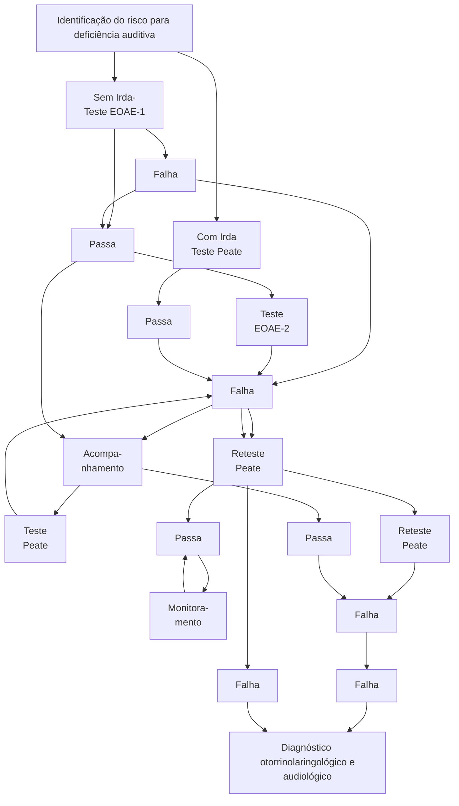

Otorrino (CM)

# OTOLOGIA - PARTE 1

• Os critérios que tornam obrigatória a antibioticoterapia na otite média aguda:
  • < 6 meses de idade; sepse; otorreia, otalgia persistente > 48h, febre > 39ºC, impossibilidade de reavaliar paciente em 48h
• Os critérios que tornam possível realizar o watchful waiting, na ausência de obrigatoriedade de antibioticoterapia:
• 6 a 24 meses de idade: OMA unilateral, sem otorreia;

• Acima de 24 meses: OMA uni ou bilateral, sem otorreia.
• Identificar os principais sinais de complicações de otites:
  • Queda do estado geral; sepse; cefaleia; abaulamento e/ou hiperemia retroauricular; sinais neurológicos e/ou alterações de pares cranianos.
• Recordar a tríade de condutas para suspeitas/ confirmações de complicações: internação; ATB EV de largo espectro; TC ossos temporais e crânio com contraste.

## 1. ANATOMIA

• A orelha pode ser dividida, de modo geral, em 3 grandes compartimentos:
• Orelha externa:
  • Pavilhão auricular;
  • Conduto auditivo externo.
• Orelha média:
  • Tuba auditiva – local de conexão com a rinofaringe;
  • Ossículos – responsáveis pela transmissão da vibração mecânica da membrana timpânica para a orelha interna.
  • Em respectiva ordem: martelo → bigorna → estribo.

• Orelha interna:
  • Cóclea – responsável por converter a energia mecânica da vibração do som, em um impulso elétrico que se direciona para o SNC através do nervo cocleovestibular/auditivo (VIII);
  • Canais semicirculares e vestíbulo – compõem o labirinto, que é responsável por parte do equilíbrio;
  • Conduto auditivo interno – contém o nervo facial (VII) e cocleovestibular/auditivo (VIII).
• As estruturas da orelha média e da orelha interna são envoltas pelo osso temporal, um dos ossos que compõem a base do crânio. Uma das porções do osso temporal é a mastoide, região que, nos adultos, apresenta pneumatização importante.

![Anatomical cross-section of the ear showing labeled structures: Lobo temporal, Martelo, bigorna e estribo, Canais semicirculares, Cóclea, Nervo facial, Canal auditivo interno, Nervo vestibular, Canal auricular, Membrana timpânica, Mastoide, Nervo facial, Veia jugular, Artéria carótida, Tuba de Eustáquio]

Figura 1

• A orelha média se comunica com as células da mastoide, fato que é relevante para compreender a disseminação de processos infecciosos para essa região.

## 1.2. MEMBRANA TIMPÂNICA

• Observe a imagem abaixo:
  • Membrana timpânica esquerda em aspecto normal, íntegra, translúcida;
  • É possível observar a impressão do cabo do martelo na membrana.

**Figura 2** Membrana timpânica

## 1.3. MECANISMO DE TRANSMISSÃO DO SOM

• Orelha externa → ressonância no conduto auditivo externo (CAE) até o tímpano;
• Orelha média → transmissão a partir do tímpano até cadeia ossicular cadeia ossicular;
• Orelha interna → articulação da cadeia ossicular com a cóclea;
  • Essa, por sua vez, atua na conversão da energia mecânica do som em impulsos elétricos.

**Figura 3** Mecanismo de transmissão do som

# 2. OTITES EXTERNAS

## 2.1. OTITE EXTERNA DIFUSA AGUDA

• Dermatite de parte, ou todo o conduto auditivo externo;
• **Agentes bacterianos:** Pseudomonas aeruginosa e Staphylococcus aureus.
• **História clínica:** associação com atividades aquáticas e trauma local (ex. uso de cotonete, prurido);

**Manifestações clínicas:**
• Dor;
• Hipoacusia;
• Prurido;
• Plenitude auricular;
• Geralmente ausentes sintomas sistêmicos.

**Exame físico:**
• Dor à palpação do tragus e à mobilização do pavilhão auricular;

**Otoscopia:**
• Eritema e edema de pele – incluindo espessamento da membrana timpânica;
• Secreção serosa ou purulenta;
• Restos epiteliais com obstrução total ou parcial do canal auditivo externo.

**Figura 4** Otites externas

**Tratamento:**
• Ciprofloxacino tópico;
• Limpeza do CAE, e proteção auricular.

## 2.2. OTITE EXTERNA MALIGNA (NECROTIZANTE)

• Infecção invasiva e necrotizante do CAE;
• Pouco frequente, acomete principalmente idosos, diabéticos e indivíduos imunossuprimidos;
• **Agentes bacterianos:** Pseudomonas aeruginosa.

**Manifestações clínicas:**
• Otalgia insidiosa e refratária a analgésicos à medida que o quadro persiste;
• Otorreia fétida e purulenta;
• Sinais sistêmicos geralmente ausentes, o que atrasa diagnóstico correto

**Exame físico:**
• Otorreia, formação de tecido de granulação em CAE;

OTOLOGIA - PARTE 1                                                        3

**Figura 5** Otorreia

- Alteração dos pares cranianos;
- Paralisia facial periférica – pelo acometimento do NC VII.

**Exames complementares:**

- Há vários exames complementares de imagem descritos para a avaliação da otite externa maligna. O exame essencial à admissão do paciente é a tomografia computadorizada de ossos temporais e crânio com contraste, de forma a descartar outras complicações e avaliar sinais de erosão e remodelamento ósseo das orelhas externa e média, achados bastante sugestivos de otite externa maligna;
- Outros exames podem ser utilizados em um segundo momento, como a ressonância magnética de encéfalo, para avaliação do acometimento de base do crânio/encéfalo, a cintilografia com tecnécio-Tc99, para a extensão do processo de osteomielite, e a cintilografia com gálio-Ga67, para controle de cura, uma vez que é um exame que normaliza após a erradicação do processo infeccioso.

**Tratamento:**

- Internação hospitalar com antibioticoterapia endovenosa;
- Antibiótico sistêmico antipseudomonas por 6 semanas em média (ciprofloxacino, ceftazidima, piperacilina-tazobactam);
- Antibioticoterapia tópica (ciprofloxacino gotas);
- Limpeza diária do CAE;
- Controle dos fatores de imunossupressão (no caso de diabéticos, controle glicêmico rigoroso).

## 2.3. MIRINGITE AGUDA

- Caracteriza-se pela formação de bolhas hemorrágicas cobrindo a pele da membrana timpânica e do CAE;
- Demonstra associação com IVAS prévia;
- É mais comum em crianças e adultos jovens.

**Agente etiológico incerto:**

- Classicamente associada ao *Mycoplasma pneumoniae*, porém, há evidência atual de infecção por outros agentes, tais quais:
  - *Staphylococcus aureus*;
  - Vírus respiratórios – Influenza, VSR, adenovírus.

**Manifestações clínicas:**

- Dor intensa e súbita, seguida por otorreia sanguinolenta;
- Apresenta curso autolimitado.

**Figura 6** Manifestação da otorreia

**Tratamento:**

- Analgesia;
- Paracentese das vesículas – alívio álgico;

**Figura 7** Otologia

- Antibioticoterapia: Macrolídeos (grau de evidência questionável).

# 3. OTITE MÉDIA AGUDA

- Processo inflamatório agudo (com evolução em < 12 semanas) da mucosa de revestimento da orelha média;
- Até 65% das crianças apresentarão, pelo menos, 1 episódio de OMA até os 2 anos de idade.

## 3.1. FATORES DE RISCO

- Ambientais:
  - IVAS – pico de incidência em meses frios;
  - Crianças que frequentem creches/escola;
  - Tabagismo passivo;
  - Uso de chupeta;
  - Curto período de aleitamento materno;
  - Posição supina durante o aleitamento.
- Hospedeiro:
  - Predisposição genética;
  - História familiar de OMA recorrente;
  - Primeiro episódio antes dos 6 meses;
  - Anormalidade craniofaciais – ex.: síndrome de Down;
  - Fenda palatina não corrigida;
  - Tuba auditiva na criança.

## 3.2. SOBRE A TUBA AUDITIVA

- Em crianças, é mais curta e horizontalizada, o que favorece a progressão do vírus e das bactérias da rinofaringe para a orelha média;
  - À esquerda – criança;
  - À direita – adulto.

**Tuba de Eustáquio**

**Figura 8** Tuba de Eustáquio

- Agentes etiológicos:
- Vírus: VSR, influenza, parainfluenza.
- **Bactérias:**
  - *Streptococcus pneumoniae* – 50% (em redução nos últimos anos);
  - *Haemophilus influenzae* não tipável – 30% (em ascensão nos últimos anos);
  - *Moraxella catarrhalis* – 12%.
  - Atenção a alguns pontos:
  - O uso da vacina conjugada antipneumocócica tem reduzido a infecção por S. pneumoniae;
  - A vacinação para Haemophilus tipo B não é eficaz na redução da incidência da OMA.
- Manifestações clínicas:
  - Quadro prévio de IVAS;
  - Febre alta > 38 °C;
  - Otalgia;

- Irritabilidade;
- Hipoacusia.
- Exame físico: otoscopia;
  - Abaulamento da membrana timpânica (E ~ 97%);
  - Membrana timpânica espessa, sem brilho, hiperemiada, hipervascularizada;
  - Otorreia em CAE;
  - Nível hidroaéreo.

**Figura 9** Exame físico: otoscopia

- Associação de OMA + conjuntivite → é mais comum em crianças, e é causada pelo H. influenzae;

**Figura 10** conjuntivite

## 3.3. TRATAMENTO

- A maioria das crianças apresenta uma evolução favorável durante o episódio de OMA, com tendência a resolução espontânea;
- Conduta: *antibioticoterapia x watchful waiting*;
- Watchful waiting → observação de sintomas por 48-72 horas, sem uso de antibioticoterapia;
- No entanto, para ser efetivo, é preciso garantir a reavaliação em tal período de tempo.
- Antibioticoterapia tem indicação nos seguintes casos:
  - 1. < 6 meses de idade;
  - 2. Otorreia;
  - 3. Sinais de alarme → sepse, otalgia > 48 horas, febre > 39 °C.

**Tabela 1** Tratamento de Otologia parte 1

| Idade            | Bilateral | Unilateral |
| ---------------- | --------- | ---------- |
| 6 meses a 2 anos | ATB       | ATB ou WW  |
| > 2 anos         | ATB ou WW | ATB ou WW  |

OTOLOGIA - PARTE 1                                                                                                  5

• Esquema antibiótico:
  • 1ª escolha: amoxicilina 50 mg/kg/dia, por 7-10 dias;
  • Lembrar que, em caso de falha do tratamento, devemos: (1) pesquisar complicações, e, caso estas estejam ausentes, (2) considerar escalonamento para amoxicilina + clavulanato.

## 3.4. OTITE MÉDIA AGUDA RECORRENTE (OMAR)

• Definição:
  • 4 ou mais episódios em OMA em 12 meses;
  • 3 ou mais episódios de OMA em 6 meses.
• Tratamento:
  • Tubo de ventilação:
  • É um tratamento cirúrgico que permite a aspiração do conteúdo líquido de retenção na orelha média e o posicionamento do tubo de ventilação, que, por sua vez, promove uma ventilação adequada da orelha média, evitando a estase de secreções na região;
  • Assim, reduz a ocorrência de episódios de OMA e da necessidade de antibioticoterapia;
  • Geralmente, os tubos de ventilação caem sozinhos após alguns meses. Na maioria dos casos, não há necessidade de novos procedimentos para inseri-los.

**Figura 11** Tratamento de tubo de ventilação

## 4. OTITE MÉDIA CRÔNICA

• Caracterizada por um processo inflamatório crônico (> 12 semanas) da mucosa de revestimento da orelha média.

### 4.1. PODE SER CLASSIFICADA EM:

• **OMC simples:** Perfuração crônica da membrana timpânica com episódios intermitentes de otorreia.

**Figura 12** Otite média crônica

• Causas:
  • OMAs recorrentes com supuração;
  • Trauma físico – agressão, barotrauma, corpo estranho.
• Quadro clínico:
  • Hipoacusia;
  • Otorreia intermitente.
• Investigação:
  • Audiometria: em boa parte dos casos, há perda auditiva condutiva.
• Tratamento:
  • Conservador: Proteção auricular e uso de aparelho auditivo, se necessário.
  • Cirúrgico: timpanoplastia. Em agudizações: manejar como OMA supurada. Em alguns casos, deve-se considerar a cobertura para pseudomonas, com ciprofloxacino VO.
• **OMC supurativa:**
  • As agudizações são frequentes, de otorreia com otalgia associada;

**Figura 13** Otite média crônica supurativa

• Manifestações clínicas:
  • Hipoacusia – pela perfuração timpânica e erosão da cadeia ossicular;
  • Otorreia recorrente, espessa.
• Exame físico:
  • Perfuração timpânica com edema de orelha média e otorreia.
• Investigação:
  • Audiometria + tomografia de ossos temporais.
  • Observa-se velamento difuso da orelha e das células da mastoide, sem sinais significativos de erosão óssea.
• Tratamento:
  • Limpeza frequente de orelha;
  • Antibioticoterapia tópica e via oral;
  • Cirurgia: timpanomastoidectomia;

**Afinal, o que são as tais cirurgias de orelha média, ou as mastoidectomias?**

• Nesta aula, falaremos apenas de duas delas, a timpanomastoidectomia e a mastoidectomia radical.

• A timpanomastoidectomia é recomendada para casos de OMC supurativa, e se caracteriza por ser uma cirurgia com o objetivo de máxima preservação da audição.
  • Nesta cirurgia, é realizado um broqueamento da mastoide através da região retroauricular, de forma a remover o máximo possível de tecido inflamatório das células da mastoide e da orelha média.
  • Depois deste passo, é o momento de reconstruir o tímpano para garantir o melhor desempenho auditivo possível. Os aspectos pré e pós-operatórios estão ilustrados na representação axial da orelha direita, abaixo.

![Figura 14 Pré e pós-operatório de representação axial da orelha direita]

• OMC colesteatomatosa;
  • É uma lesão benigna de comportamento destrutivo, caracterizada por tecido epidérmico escamoso e estratificado;
  • Em outras palavras, "pele crescendo onde não deveria...". E daí? Na orelha média, este tecido apresenta um comportamento de crescimento progressivo que, além de comprimir estruturas adjacentes, promove uma intensa reação inflamatória local. Desta forma, o crescimento da lesão envolve progressivamente os ossículos da audição, tímpano, nervo facial, estruturas da orelha interna e até mesmo, em casos extremos, a base do crânio - tornando-se aí um importante foco de meningites e coleções intracranianas!

![Figura 15 Otoscopia sugestiva de colesteatoma]

Na imagem acima: otoscopia sugestiva de colesteatoma, por conta da lesão esbranquiçada associada a erosão óssea na porção superior do conduto auditivo externo. Contudo, por ser uma lesão de lento crescimento, o colesteatoma pode se manifestar à otoscopia tanto com pequenas alterações que podem passar despercebidas pelo não especialista quanto com perfurações completas da membrana timpânica com otorreia abundante.

• Quadro clínico;
  • História insidiosa, de anos de evolução;
  • História prévia comum de OMAs de repetição nos primeiros anos.
  • Otorreia purulenta constante, fétida → "Ninho de rato";
  • Hipoacusia.
• Exame físico:
  • Perfurações parciais ou totais da membrana timpânica;
  • Massa esbranquiçada, compacta, com matriz lisa e brilhante, lamelas de queratina;
  • Otorreia esverdeada/amarelada, fétida.
• Investigação:
  • Audiometria. Perda auditiva de padrão condutivo/ misto importante.
• TC de ossos temporais:
  • Velamento difuso de orelha média e de células da mastoide, e osteíte e remodelamento ósseo importante.
  • RNM de ossos temporais: avaliação de recidivas.

![Figura 16 Olesteatoma adquirido]

Observe, na imagem acima, um TC de ossos temporais em corte coronal, a diferença entre os lados direito (afetado) e esquerdo (normal). Aliás, esta é uma dica importante para otorrino nas provas: na dúvida, sempre compare os lados do exame! No caso do colesteatoma, as alterações esperadas são o aparecimento de massa com atenuação de partes moles na região da orelha média, com destruição/rarefação das estruturas ósseas ao seu redor.

OTOLOGIA - PARTE 1                                                                                                  7

**Tratamento:**
• Casos iniciais – abordagens mais conservadoras, com second-look programado (exceção);
• Timpanomastoidectomia;
• Mastoidectomia simples.
• Demais casos: mastoidectomia radical.
• Na mastoidectomia radical, a preservação da audição está em segundo plano. O mais importante aqui é remover o máximo possível de lesão. Como o colesteatoma é uma lesão com alta chance de recidiva e seu sucesso cirúrgico depende de sua remoção completa, frequentemente precisamos sacrificar estruturas importantes para a audição.
  • Portanto, após o broqueamento da mastoide, removemos a membrana timpânica, a parede óssea que corresponde à parede posterior do conduto auditivo externo, e partes dos ossículos da audição. Toda a orelha média e o conduto auditivo externo ficam comunicados por uma grande cavidade, como no exemplo abaixo. E a audição? Como veremos na aula de exames de audição, ainda há alguma transmissão de som através do osso temporal diretamente para a orelha interna, de forma que, a menos que a cóclea já tenha sido afetada pelo colesteatoma, o paciente ainda vai ter algum grau de audição após a cirurgia. Não é infrequente, no entanto, que estes pacientes necessitem, no futuro, de prótese auditiva para reestabelecerem níveis auditivos que possibilitem o convívio social.

**Figura 16** [Diagram showing anatomical cross-section of the ear with mastoidectomy]

**Figura 17 Mastoidectomia radical** [Diagram showing anatomical cross-section of the ear after radical mastoidectomy]

## 5. OTITE MÉDIA DE EFUSÃO

• Caracterizada pela presença de fluido na orelha média, sem sinais ou sintomas de infecção otológica.
  • Sinônimos: tite média secretora, serosa, mucoide.

### 5.1. CLASSIFICAÇÃO
• Quanto à duração:
  • OME aguda: < 3 semanas;
  • OME subaguda: 3 – 12 semanas;
  • OME crônica: > 12 semanas.

### 5.2. ETIOLOGIA
• Mau funcionamento da tuba auditiva, com dificuldade na drenagem de secreções:
  • Obstrução → após quadro da OMA, hipertrofia de adenoide, neoplasia de nasofaringe;
  • Funcional → após IVAS, sequela de radioterapia de cabeça e pescoço.

### 5.3. QUADRO CLÍNICO
• Criança:
  • Falta de atenção;
  • Alterações comportamentais;
  • Atraso na linguagem e fala;
  • Aparelhos eletrônicos em volume excessivo.
• Crianças mais velhas e adultos:
  • Plenitude auricular;
  • Sensação de corpo estranho no ouvido;
  • Hipoacusia.

### 5.4. EXAME FÍSICO
• Membrana opaca;
• Bolhas retrotimpânicas;
• Nível hidroaéreo.

[Two otoscopic images showing middle ear effusion]

**Figura 18 Otite média de efusão**

### 5.5. INVESTIGAÇÃO
• Audiometria:
  • Indicação: OME persistente por mais de 12 semanas; suspeita de atraso na linguagem, problemas de aprendizado ou deficiência auditiva importante.
  • Perda auditiva condutiva;
  • Timpanometria tipo B.

**OBS.:** As timpanometrias serão abordadas em outro momento (aula de Otologia parte 2), mas, para efeito de provas de residência, uma "timpanometria tipo B" quase sempre sugere líquido retrotimpânico, achado compatível com a otite média serosa e especialmente útil na avaliação de crianças nas quais a otoscopia deixa dúvidas quanto ao diagnóstico.

## 5.6. TRATAMENTO
• Demonstra resolução espontânea em até 12 semanas, em 90% dos casos;
• Nos cenários de duração > 12 semanas ou na presença de fatores de risco: *considerar tubo de ventilação*;

**Fatores de risco:**
• Deficiência visual/auditiva;
• TEA;
• Déficit intelectual;
• Alterações craniofaciais.
• Em caso de hipertrofia adenoideana → considerar adenoidectomia.

**Figura 19** Otologia de otite média de efusão

## 6. COMPLICAÇÕES DE OTITES

### 6.1. CONSIDERAÇÕES INICIAIS
• Complicações de OMA → são mais frequentes em crianças;
• Complicações de OMC → são mais frequentes em crianças mais velhas e adultos.

### 6.2. EXTRACRANIANAS
• Abscesso retroauricular;
• Abscesso cervical;
• Paralisia facial periférica;
• Petrosite;
• Labirintite.

### 6.3. INTRACRANIANAS
• Meningite;
• Tromboflebite de seio sigmoide;
• Abscesso epidural;
• Empiema subdural;
• Abscesso cerebral.
• Na suspeita ou confirmação de complicação de otite, a conduta será:
  • Internação hospitalar;
  • Antibioticoterapia endovenosa → ceftriaxona + clindamicina;
  • Solicitar TC de ossos temporais e crânio com contraste.

## 6.4. CELULITE/ABSCESSO RETROAURICULAR
• Extensão do processo infeccioso e inflamatório da orelha média para o periósteo e/ou tecido subcutâneo retroauricular;
• Caracteristicamente, apresenta *edema e hiperemia retroauricular* com deslocamento anterior do pavilhão auditivo.

**Otoscopia esquerda**                    **Otoscopia direita:**

**Região retroauricular esquerda:**

**Figura 20** Celulite/abscesso retroauricular

• TC de ossos temporais:
  • À esquerda, em corte axial, observa-se velamento difuso das células da mastoide, e uma pequena falha da camada cortical óssea da mastoide;

**Figura 21** Exame de imagem de otologia

• Sob contraste, observa-se lesão hipoatenuante com halo periférico hiperatenuante, compatível com abscesso retroauricular.

OTOLOGIA - PARTE 1

**Figura 22** Exame de imagem de otologia

• Tratamento:
  • Na OMA → drenagem de abscesso por via percutânea / mastoidectomia + miringotomia;
  • Miringotomia: procedimento no qual fazemos uma pequena perfuração na membrana timpânica, de forma a drenar secreções; no caso de uma OMA, drenar secreção purulenta. Pode ser realizado com anestesia local em adultos e pacientes colaborativos;
  • Na OMC → drenagem via mastoidectomia.

## 6.5. ABSCESSO CERVICAL

• Complicação raramente secundária a otites;
• Mais frequente em adultos;
• O quadro clínico é tipicamente insidioso;
  • Disseminação do processo inflamatório para a ponta da mastoide (em contato íntimo com a musculatura cervical).
• Abscesso de Bezold:
  • Percorre o trajeto do músculo esternocleidomastoideo (ECM) e o músculo digástrico;
  • Quadro clínico:
  • Dor cervical;
  • Torcicolo;
  • Aumento do volume na inserção superior do ECM.
• Abscesso parafaríngeo:
  • Demonstra uma trajeto posterior ao músculo digástrico;
  • Quadro clínico:
  • Dor cervical;
  • Dor à deglutição;
  • Trismo;
  • Abaulamento da parede faríngea lateral.
• Tratamento:
  • Drenagem cirúrgica cervical + mastoidectomia.

**Figura 23** Abscesso cervical

## 6.6. PARALISIA FACIAL PERIFÉRICA

• Afinal, como uma otite pode provocar uma paralisia facial periférica? Parte do nervo facial tem como trajeto a orelha média, estando protegido por uma fina camada óssea. Desta forma, ele se torna suscetível a processos inflamatórios, infecciosos e traumáticos da orelha média;
• Na OMA:
  • Edema compressivo;
  • Neurite tóxica;
  • Deiscência espontânea do canal do facial.
• Na OMC por colesteatoma:
  • Erosão óssea do canal do facial e compressão do nervo pela lesão.
• Exame físico:
• Imagem:
  • Paralisia de andar inferior e superior da face;
  • Sinal de Bell (rotação superior do globo ocular quando paciente tentar fechar os olhos).

![Figura 24 - Two side-by-side facial photographs showing Bell's sign]

**Figura 24** Sinal de Bell

**Tratamento:**
• OMA:
  • Apresenta bom prognóstico;
  • Corticoterapia;
  • Miringotomia – para redução da compressão do nervo facial;
  • Se ausência de melhora em 2-3 semanas de evolução, mastoidectomia para drenagem.
• OMC:
  • Tem pior prognóstico;
  • Indicação de cirurgia precocemente! Sinal de que o colesteatoma que está crescendo há anos está comprimindo o nervo!

## 6.7. PETROSITE
• Extensão do processo infeccioso para o ápice petroso;
• O ápice petroso é uma das porções do osso temporal, que abriga estruturas como a cóclea, labirinto, nervos facial e cocleovestibular, e está próximo de estruturas como a artéria carótida interna e o nervo abducente (VI). Apesar de infecções desta região serem raras, podem sugerir achados semiológicos específicos, sendo que até metade dos pacientes com extensão do processo infeccioso para essa região se apresentam com a síndrome de Gradenigo.
• Síndrome de Gradenigo:
  • Otalgia;
  • Dor retro-orbitária;
  • Paralisia do abducente.

![Figura 25 - Three photographs showing eye movements demonstrating petrosite]

**Figura 25** Petrosite

## 6.8. LABIRINTITE
É muito utilizada como sinônimo para tontura ou vertigem; Contudo, a labirintite na verdade é definida como uma disseminação inflamatória da orelha média e mastoide para a orelha interna, dentro de um contexto infeccioso ou inflamatório agudo;
• Labirintite serosa:
  • Inflamação estéril;
  • Apresenta-se com vertigem, zumbido e perda auditiva;
  • Normalmente, não deixa sequelas.
• Labirintite supurativa:
  • Inflamação com exsudato;
  • Há um processo inflamatório intenso, com fibrose e ossificação em fase cicatricial;
• Quadro clínico:
  • Vertigem intensa;
  • Náuseas e vômitos;
  • Perda auditiva profunda.
  • Frequentemente, os pacientes evoluem para sequelas: perda auditiva completa e arreflexia vestibular.
• Tratamento:
  • Sintomáticos e resolução do foco infeccioso.

## 6.9. MENINGITE
• É a complicação intracraniana mais frequente;
• Representa 90% dos casos em crianças;
• Na OMA, os principais agentes etiológicos são: pneumococo, Haemophilus;
• Na OMC, geralmente o quadro é asséptico;
• Quadro clínico e exame físico:
  • Cefaleia intensa holocraniana;
  • Febre elevada;
  • Queda do estado geral e do nível de consciência;
  • Sinais meníngeos → rigidez nucal, sinais de Kernig e Brudzinski;
  • Em recém-nascidos e crianças pequenas: hipotonia cervical e abaulamento de fontanelas.
• Investigação inicial:
  • TC de crânio e ossos temporais com contraste + LCR.
• Tratamento:
  • Internação hospitalar;
  • Antibioticoterapia endovenosa;
  • Na OMA → miringotomia para coleta de secreção para cultura e antibiograma;
  • Na OMC → mastoidectomia.

## 6.10. TROMBOFLEBITE DE SEIO SIGMOIDE
• Extensão ao seio sigmoide com formação de trombos e oclusão parcial ou total;
• Mais frequente na OMC colesteatomatosa;
• Tromboflebite supurada → metástases sépticas extracranianas;
• O principal agente envolvido é o Pneumococo (até 50% dos casos).
• Quadro clínico:
  • Febre;
  • Dor;
  • Abaulamento retroauricular;
  • Sinais de hipertensão intracraniana.
• Tratamento:

OTOLOGIA - PARTE 1                                                                                         11

• Cirúrgico → mastoidectomia;
• O uso de anticoagulação é controverso.

## 6.11. FÍSTULA PERILINFÁTICA

• Complicação mais associada ao colesteatoma (7% do casos);
• Resulta de uma erosão do labirinto ósseo, com comunicação de canal semicircular com orelha média (mais frequente no CSC lateral);
• Quadro clínico:
  • Vertigem inespecífica;
  • Perda auditiva neurossensorial.
  • Fenômeno de Tulio → vertigem à exposição aos ruídos externos;
  • Sinal de Hennebert → nistagmo horizontal à compressão do CAE;
• Tratamento:
  • Exploração cirúrgica e correção da fístula.

## 6.12. COLEÇÕES INTRACRANIANAS

• São complicações de alta morbidade e mortalidade;
• Apresentam-se com cefaleia persistente, otalgia, persistência da febre;
• Ainda, é preciso atentar para:
  • Sepse;
  • Cefaleia intensa;
  • Hipertensão intracraniana;
  • Sinais neurológicos focais;
  • Convulsões.
• Quais são as coleções?
  • Abscesso epidural;
  • Empiema subdural;
  • Abscesso encefálico.
• Tratamento → drenagem cirúrgica.

# REFERÊNCIAS

**Figura 2 Membrana timpânica**
https://entokey.com/the-normal-tympanic-membrane/ (22/11/2023)

**Figura 3 Mecanismo de transmissão do som**
Aula de Otologia parte 1 (pdf do Livro 2024).

**Figura 4 Otites externas**
https://slideplayer.com/slide/6006847/ (22/11/2023)

**Figura 5 Manifestação da otorreia**
Bock K, Ovesen T. Optimised diagnosis and treatment of necrotizing external otitis is warranted. Dan Med Bull. 2011 Jul;58(7):A4292. PMID: 21722540.

**Figura 6 Manifestação da otorreia**
Arquivo pessoal do autor.

**Figura 7 Otologia**
Arquivo pessoal do autor. Imagens: arquivo pessoal do autor

**Figura 9 Exame físico: otoscopia**
https://emedicine.medscape.com/article/994656-overview (22/11/2023)

**Figura 10**
N, Shoji J, Yamagami S. Infantile Acute Conjunctivitis Induced by β-Lactamase-Positive Amoxicillin-Clavulanate-Resistant Strain of Haemophilus. Influenzae: A Report of Three Cases. Eye Contact Lens. 2019 May;45(3):e11-e14. doi: 10.1097/ICL.0000000000000556. PMID: 30489345; PMCID: PMC6493690.

**Figura 11 Tratamento de tubo de ventilação**
Aula de Otologia parte 1 (pdf do Livro 2024).

**Figura 12 Otite média crônica**
https://entokey.com/chronic-otitis-media-and-complications-of-otitis-media/ (22/11/2023)

**Figura 13 Otite média crônica supurativa**
https://medtube.net/otorhinolaryngology/medical-images/28875-chronic-suppurative-otitis-media, 21/03/2023

**Figura 14 Pré e pós-operatório de representação axial da orelha direita**
Aula de Otologia parte 1 (pdf do Livro 2024).

**Figura 15 Otoscopia sugestiva de colesteatoma**
https://emedicine.medscape.com/article/860080-overview?form=fpf (22/11/2023)

**Figura 16 Olesteatoma adquirido**
https://radiopaedia.org/articles/acquired-cholesteatoma?lang=us, acesso em 22/03/2023

**Figura 17 Mastoidectomia radical**
Aula de Otologia parte 1 (pdf do Livro 2024).

**Figura 18 Otite média de efusão**
https://otosurgeryatlas.stanford.edu/otologic-surgery-atlas/; https://www.ankitparakh.com/conditions-treated/adenoid-hyerptrophy/, acesso em 24/03/2023

**Figura 19 Otologia de otite média de efusão**
https://www.usatoday.com/story/news/nation/2013/07/01/ear-tubes-surgery-guidelines/2465303/, acesso em 24/03/2023

**Figura 20 Celulite/abscesso retroauricular**
Aula de Otologia parte 1 (pdf do Livro 2024).

**Figura 21 Exame de imagem de otologia**
https://radiopaedia.org/articles/subperiosteal-abscess-of-the-mastoid?lang=us, acesso em 18/03/2023

**Figura 22 Exame de imagem de otologia**
https://radiopaedia.org/articles/subperiosteal-abscess-of-the-mastoid?lang=us, acesso em 18/03/2023

**Figura 23 Abscesso cervical**
https://radiopaedia.org/cases/98889/studies/120075?lang=us, acesso em 18/03/2023; Al-Baharna, Hussain et al. "Bezold's abscess: A case report and review of cases over 14 years." Indian Journal of Otology 22 (2016): 148 - 151.

**Figura 24 Sinal de Bell**
https://www.ahdubai.com/blogs/bell-s-palsy (22/11/2023)

**Figura 25 Petrosite**
CURI, Renato Luiz Nahoum; COSTA, Ian Curi Bonotto de Oliveira; BARROSO, Tábatta Graciolli Moreira. VI nerve palsy (abducens palsy). Rev Bras Oftalmol., v. 72, n. 1, p. 59-69, Feb. 2013.

# OTOLOGIA PARTE 2

## O que é essencial saber para as provas?

- Neste bloco de Otologia (parte 2), é essencial dominar:
- Na paralisia facial periférica, temos acometimento dos andares superior e inferior da face, enquanto no AVC temos acometimentos apenas do andar inferior!
- No trauma de osso temporal, traumas longitudinais são mais comuns e tendem a provocar perdas auditivas condutivas; já traumas transversais podem acometer a cóclea e provocar perda auditiva completa.
- Paralisias faciais imediatas são sinais de secção, estiramento ou compressão do nervo e necessitam frequentemente de abordagem cirúrgica; já paralisias tardias tendem a melhorar espontaneamente;
- Na síndrome vestibular aguda - vertigem com náuseas e vômitos - é imperativo realizarmos a bateria HINTS

para diferenciar eventos centrais de periféricos. O principal evento central que devemos descartar é o AVC de fossa posterior!

- Apenas 1 dos itens sugestivos de alteração central no HINTS já deve levantar a hipótese de evento central;
- As perdas auditivas podem ser condutivas, neurossensoriais e mistas;
- Nas perdas condutivas, temos alterações na orelha externa e/ou média que impedem a propagação das ondas mecânicas do som até a orelha interna;
- Nas perdas neurossensoriais, temos alterações na cóclea e/ou nervo auditivo;
- Nas perdas mistas, temos alterações em ambos os compartimentos.

## 1. PARALISIA FACIAL E PERIFÉRICA

### 1.1. REVISANDO ALGUNS CONCEITOS

- A função mais conhecida do nervo facial é a sua função motora, mais especificamente da mímica facial. No entanto, se tratando de um par craniano de função mista, o nervo facial tem ainda algumas outras funções:
  - Aferência parassimpática de glândulas lacrimais;
  - Gustação dos ⅔ anteriores da língua;
  - Reflexo do músculo estapédio: esse pequeno músculo tem como função alterar a posição do estribo na orelha média, de forma a proteger a orelha interna de exposições a ruídos intensos.
- Desta forma, nas paralisias do nervo facial, além da clássica alteração motora podemos ainda ter alterações de lacrimejamento, gustação e sensação de hiperacusia (sensibilidade excessiva a sons mais intensos), a depender da topografia do acometimento do nervo.

### 1.2. PARALISIA CENTRAL

- Ramos superiores do nervo facial recebem eferências de ambos os hemisférios cerebrais;
- Ramos inferiores recebem apenas eferência de hemisfério contralateral;
- Paralisia apenas no andar inferior da face.

### 1.3. PARALISIA PERIFÉRICA

- Lesões a partir do tronco encefálico que levam ao acometimento completo unilateral;

**Etiologia:**

- Paralisia de Bell: casos idiopáticos (55-80%);
- Causas infecciosas;
- Otite média crônica colesteatomatosa;
- Trauma de osso temporal;
- Tumores;
- Causas congênitas/sindrômicas.

**Causas infecciosas;**

- Virais;
- Herpes simples tipo I (HSV1);
- Varicela-zoster;
- EBV;
- CMV;
- Paramyxovirus;
- HIV.

**Bacterianas:**

- OMA – Otite média aguda;
- Doença de Lyme;
- Otossífilis;
- Hanseníase;
- Tuberculose.

**Figura 1** Revisando conceitos de paralisia facial e periférica

## Paralisia de Bell:

• Sua causa provável é a reativação de vírus HSV1 latente nos gânglios sensitivos do nervo facial (gânglio geniculado);
• Desencadeada por:
  • Alterações metabólicas,
  • Procedimentos cirúrgicos;
  • Estresse;
  • Imunossupressão;
  • Gestação.
• Instalação entre 1-7 dias;

**Quadro clínico:**

• Sem outras alterações no exame físico além de paralisia facial periférica e eventuais alterações na gustação, lacrimejamento e sensação de hiperacusia;
• Sinal de Bell: em paralisias nas quais o paciente não consegue ocluir o olho completamente, há uma rotação superior do globo ocular de forma a deixar a esclera exposta. Esse dado é importante no tratamento para que seja introduzida a proteção ocular e para evitar complicações como a úlcera de córnea.

**Tratamento:**

• Corticoterapia:
  • Benefício de introdução em até 72 horas;
  • Prática no HCFMUSP: dexametasona 8 mg por 5 dias: → 4 mg 5 dias → 2 mg, por 5 dias.
• Antivirais: sem evidência de benefício na ausência de sinais de infecção por varicela-zoster (VZV);
• Proteção ocular:
  • Uso de colírios lubrificantes;
  • Pomada oftálmica e curativo oclusivo ao dormir.
• Fisioterapia motora;
• Em geral, a paralisia de Bell apresenta altas taxas de melhora espontânea.

**Síndrome de Ramsay-Hunt:**

• Reativação do varicela-zoster (VZV);
  • Paralisia facial periférica associada com lesões cutâneas em múltiplos estágios evolutivos (vesículas, bolhas).

**Figura 3** Síndrome de Ramsay-Hunt

• **Clínica:**
  • Sintomas cocleovestibulares: zumbido, vertigem, hipo/hiperacusia;
  • Infecções de pele secundárias.
• Pior prognóstico: maior chance de sequelas motoras;
• **Sinais de alerta:**
  • Alteração de nível de consciência / déficits focais / convulsões;
• **Encefalite herpética:**
  • Internação hospitalar + aciclovir, EV, por 14-21 dias;
  • TC/RNM crânio (sinal típico: T2 com hipersinal em região de lobo temporal);
  • Coleta do LCR.
• **Tratamento: Corticoterapia + cuidados oculares + antivirais:**
  • Aciclovir 800 mg 5x/dia (4/4h, pulando dose noturna), por 10 dias;
  • Valaciclovir 1000 mg 3x/dia, por 10 dias.

## 1.4. TRAUMA DE OSSO TEMPORAL

**Paralisia facial imediata;**

• Indica secção/compressão aguda do nervo facial;
• Pior prognóstico;
• Conduta: tratamento cirúrgico precoce quando há perda completa ou quase completa da motricidade facial (< 21 dias).

**Paralisia facial tardia;**

• Secundária a edema local;
• Melhor prognóstico;
• Conduta: observação e corticoterapia.

**Tratamento cirúrgico:**

• Descompressão do nervo facial;
• Anastomose término-terminal do nervo facial;
• Derivação neural;
  • Hipoglossofacial;
  • Técnica Cross-face (ramos do nervo facial da hemiface normal).

## 1.5. TUMORES

**Causas:**

• Schwannoma;
• Meningeoma.

OTOLOGIA - PARTE 2                                                                                               3

**Cursa com:**
- Paralisia facial unilateral;
- Quadro recorrente;
- Lenta instalação (> 3 semanas);
- Apresenta acometimento de múltiplos pares cranianos.

## 2. TRAUMA DO OSSO TEMPORAL

### 2.1. EPIDEMIOLOGIA
- Acidentes automobilísticos;
- Agressões;
- Quedas.

### 2.2. AVALIAÇÃO INICIAL
- ATLS.

### 2.3. AVALIAÇÃO OTORRINOLARINGOLÓGICA
- Inspeção: sinais de fratura de base de crânio;
  - Sinal de Battle;
  - Otorreia hialina contínua;
  - Rinorreia hialina contínua.

**Figura 4** Sinal de Battle

- Controle de sangramento otológico;
- Avaliação da integridade do conduto auditivo externo e membrana timpânica;
- Avaliação de pares cranianos.

### 2.4. AVALIAÇÃO COMPLEMENTAR
- TC de crânio e ossos temporais.

### 2.5. FRATURAS LONGITUDINAIS X FRATURAS TRANSVERSAIS

**Fraturas longitudinais:**
- Guarde o mnemônico: a fratura longitudinal passa longe das estruturas nobres: a cóclea, o labirinto e o nervo auditivo.
- Até 90% dos casos;
- Associadas aos traumas de menor energia;
- Perda auditiva condutiva;
  - Perfuração timpânica;
  - Desarticulação da cadeia ossicular.

**Fraturas transversas:**
- Cerca de 10% dos casos;
- Geralmente, causados por trauma de alta energia; por conta disso, acometem a cóclea e o labirinto;
- Perda auditiva neurossensorial (até mesmo com perda completa da audição);
- Vertigem importante.
- **Tanto nas fraturas longitudinais quanto transversais, pode haver paralisia facial periférica.**

## 3. VESTIBULOPATIAS PERIFÉRICAS

### 3.1. VERTIGEM DE ORIGEM CENTRAL X VERTIGEM DE ORIGEM PERIFÉRICA

**Contexto de pronto-atendimento;**
- Síndrome vestibular aguda;
  - Vertigem súbita com náuseas e vômitos intensos.
- Sugerem acometimento central:
  - Dor facial;
  - Diplopia;
  - Disfagia;
  - Disfonia;
  - Déficits neurológicos focais.

### 3.2. DIAGNÓSTICO DIFERENCIAL

**Acidente vascular cerebral (AVC) de fossa posterior;**
- Sensibilidade baixa a exames de imagem nas primeiras 48 horas;
- Avaliação clínica inicial é mais importante do que exames complementares!

### 3.3. DÉFICITS FOCAIS AO EXAME NEUROLÓGICO: ASSOCIADOS A VERTIGEM DE ORIGEM CENTRAL

**E quando a vertigem é o único sintoma?**
- Movimentação ocular extrínseca;
  - *Head-impulse* ou reflexo vestíbulo-ocular;
  - Nistagmo;
  - *Test of skew* ou desalinhamento vertical do olhar.
- Mnemônico HINTS:
  - Sensibilidade superior a exames de imagem nas primeiras 48 horas.

### 3.4. HEAD-IMPULSE OU REFLEXO VESTÍBULO-OCULAR
- Responsável por estabilização do campo visual durante a movimentação da cabeça;
- Alteração do reflexo leva a atraso do reposicionamento dos olhos;

**Figura 5** Reflexo vestíbulo ocular

- Interpretação;
  - *Head-impulse* normal: sugestivo de lesão central;
  - *Head-impulse* alterado: sugestivo de lesão periférica.

## 3.5. NISTAGMO
• Movimentos oculares involuntários, rítmicos e repetitivos;
• Ao orientar paciente a olhar em várias direções:
  • Nistagmo em várias direções: lesão central;
  • Nistagmo horizontal com fase rápida sempre na mesma direção: lesão periférica.

## 3.6. TEST-SKEW OU DESALINHAMENTO VERTICAL DO OLHAR
• Desalinhamento vertical espontâneo ou após cobrir-descobrir os olhos alternadamente;
• Sempre patológico: lesão central.

**Figura 6** Desalinhamento vertical do olhar

**Tabela 1** Vestibulopatias Periféricas

|                     | Head-impulse | Nis             | Test skew |
| ------------------- | ------------ | --------------- | --------- |
| Vertigem periférica | Alterado     | Unidirecional   | Ausente   |
| Vertigem central    | Norma        | Multidirecional | Presente  |

ATENÇÃO: qualquer um dos itens do HINTS indicando vertigem central em uma síndrome vestibular aguda: tratar como AVC.

## 3.7. NEURITE VESTIBULAR
• Etiologia desconhecida;
• Provável acometimento viral agudo do nervo vestibular e/ou gânglio de Scarpa;

**Quadro clínico: síndrome vestibular aguda;**
• Início súbito, geralmente pela manhã;
• Vertigem do tipo rotatória persistente;
• Duração de dias de forma ininterrupta;
• Náuseas e vômitos, sudorese, palidez;
• Ausência de sintomas auditivos;
• Melhora lenta e gradual.

**Tratamento: sintomático:**
• Sedativos labirínticos por até 5 dias:
  • Dimenidrinato (Dramin);
  • Meclizina;
  • Benzodiazepínicos.

## 3.8. VERTIGEM PAROXÍSTICA POSICIONAL BENIGNA (VPPB)
• Vestibulopatia periférica mais comum;
• Provocada pela movimentação de partículas (otocônias) nos canais semicirculares. As otocônias normalmente se localizam na região do vestíbulo, que corresponde à região entre os canais semicirculares e a cóclea. O desprendimento das otocônias para os canais semicirculares altera a percepção destes da aceleração angular da cabeça, desencadeando os sintomas da VPPB.

**Figura 7** Vertigem paroxística posicional benigna (VPPB)

**Etiologia;**
• Idiopática;
• Pós-traumática;
• Distúrbios metabólicos.

**Quadro clínico;**
• Vertigem do tipo rotatória;
• Desencadeada por movimentos cefálicos;
• Latência de segundos e duração de < 1 minuto.

**Diagnóstico;**
• Manobra de Dix-Hallpike: avalia o CSC posterior (mais comum);
• Nistagmo torcional (componente vertical com fase rápida para cima e torção para lado acometido).

**Tabela 2** Tratamento: manobra de Epley.

|               | Manobra diagnóstica                    | Manobra terapêutica        |
| ------------- | -------------------------------------- | -------------------------- |
| CSC posterior | Dix-Hallpike                           | Epley Semont               |
| CSC anterior  | Dix-Hallpike                           | Epley Semont Yacovino      |
| CSC lateral   | Head-roll Pagnini McClure Bow and Lean | Gufoni Lembert Zuma e Maia |

## 3.9. DOENÇA DE MENIÉRE/HIDROPSIA ENDOLINFÁTICA
• Doença multifatorial;
• Associação a distúrbios metabólicos;

**Quadro clínico:**
• Perda auditiva flutuante e progressiva;
• Zumbido;
• Plenitude auricular;
• Vertigem rotatória;
• Episódios com duração de 20 minutos a 24 horas de duração.

OTOLOGIA - PARTE 2                                                                                               5

**Tratamento:**
• Crises:
  • Sedativos labirínticos;
• Preventivo:
  • Betaistina;
  • Controle de comorbidades.

**Tabela 3** Quadro clínico de otologia

|                    | Duração           | Sintomas auditivos | Tratamento                                               |
| ------------------ | ----------------- | ------------------ | -------------------------------------------------------- |
| VPPB               | Segundos          | Não                | Manobra de reposicionamento                              |
| Neurite vestibular | Dias              | Não                | Sedativos labirínticos                                   |
| Doença de Menière  | 20 min – 24 horas | Sim                | Crise: Sedativos labirínticos
Preventivo: betaistina |

"<" Via óssea direita

">" Via óssea esquerda

"O" Via óssea direita

"X" Via óssea esquerda

**Figura 9** Triagem auditiva e perdas auditivas

| Intensidade (em dB ANSI-69 S3.6 2018) | Frequency - Hertz |     |     |                   |               |      |               |   |
| ------------------------------------- | ----------------- | --- | --- | ----------------- | ------------- | ---- | ------------- | - |
| -10                                   | 125               | 250 | 500 | 1000
750 1500 | 2000
3000 | 4000 | 8000
6000 |   |
| 0                                     |                   |     |     |                   |               |      |               |   |
| 10                                    | X                 | X   | X   | X                 | X             | X    | X             |   |
| 20                                    |                   |     |     |                   |               |      |               |   |
| 30                                    |                   |     |     |                   |               |      |               |   |
| 40                                    |                   |     |     |                   |               |      |               |   |
| 50                                    |                   |     |     |                   |               |      |               |   |
| 60                                    |                   |     |     |                   |               |      |               |   |
| 70                                    |                   |     |     |                   |               |      |               |   |
| 80                                    |                   |     |     |                   |               |      |               |   |
| 90                                    |                   |     |     |                   |               |      |               |   |
| 100                                   |                   |     |     |                   |               |      |               |   |
| 110                                   |                   |     |     |                   |               |      |               |   |
| 120                                   | audstudent.com    |     |     |                   |               |      |               |   |

## 4. AUDIOMETRIA, TRIAGEM AUDITIVA NEONATAL E PERDAS AUDITIVAS

### 4.1. AUDIOMETRIA TONAL

• Exame idealmente realizado em cabine isolada acusticamente com fone de ouvido e vibrador ósseo;
  • Gera um gráfico de intensidade do som em dB (y) e frequência do som em Hz (x).

**Figura 8** Gráfico de Audiometria tonal

| Intensidade (em dB ANSI-69 S3.6 2018) | Frequency - Hertz |     |     |              |               |               |               |   |
| ------------------------------------- | ----------------- | --- | --- | ------------ | ------------- | ------------- | ------------- | - |
| -10                                   | 125               | 250 | 500 | 1000
750 | 2000
1500 | 4000
3000 | 8000
6000 |   |
| 0                                     |                   |     |     |              |               |               |               |   |
| 10                                    |                   |     |     |              |               |               |               |   |
| 20                                    |                   |     |     |              |               |               |               |   |
| 30                                    |                   |     |     |              |               |               |               |   |
| 40                                    |                   |     |     |              |               |               |               |   |
| 50                                    |                   |     |     |              |               |               |               |   |
| 60                                    |                   |     |     |              |               |               |               |   |
| 70                                    |                   |     |     |              |               |               |               |   |
| 80                                    |                   |     |     |              |               |               |               |   |
| 90                                    |                   |     |     |              |               |               |               |   |
| 100                                   |                   |     |     |              |               |               |               |   |
| 110                                   |                   |     |     |              |               |               |               |   |
| 120                                   | audstudent.com    |     |     |              |               |               |               |   |

• Via aérea: estímulo é conduzido através das orelhas externa e média até a cóclea;
• Via óssea: estímulo é conduzido através da vibração óssea do crânio até a cóclea (independe da orelha externa e média);
• Limiar normal: até 20 dB;
• "Red, round, right".

**Figura 10** Gráfico de Audiometria tonal

• Imagem acima:
  • Orelha esquerda;
  • Via óssea normal em OE;
  • Via aérea normal em OE;
  • Audição normal à esquerda.

| Intensidade (em dB ANSI-69 S3.6 2018) | Frequency - Hertz |     |     |              |               |               |               |   |
| ------------------------------------- | ----------------- | --- | --- | ------------ | ------------- | ------------- | ------------- | - |
| -10                                   | 125               | 250 | 500 | 1000
750 | 2000
1500 | 4000
3000 | 8000
6000 |   |
| 0                                     |                   |     |     |              |               |               |               |   |
| 10                                    | <                 | <   | <   | <            | <             | <             |               |   |
| 20                                    |                   |     |     |              |               |               |               |   |
| 30                                    | ⊙                 |     |     |              |               |               |               |   |
| 40                                    |                   | ⊙   | ⊙   | ⊙            | ⊙             | ⊙             | ⊙             |   |
| 50                                    |                   |     |     |              |               |               |               |   |
| 60                                    |                   |     |     |              |               |               |               |   |
| 70                                    |                   |     |     |              |               |               |               |   |
| 80                                    |                   |     |     |              |               |               |               |   |
| 90                                    |                   |     |     |              |               |               |               |   |
| 100                                   |                   |     |     |              |               |               |               |   |
| 110                                   |                   |     |     |              |               |               |               |   |
| 120                                   | audstudent.com    |     |     |              |               |               |               |   |

**Figura 11** Gráfico de perda condutiva em OD

• Imagem acima: Perda condutiva em OD
  • Orelha direita;
  • Via óssea normal em OD;
  • Via aérea alterada em OD;
  • Gap aero-ósseo > 15 dB;

O que é o gap aero-ósseo, pessoal? Nada mais é do que a diferença, em dB, entre a via óssea e a via aérea. Quando temos uma diferença maior que 15 dB, podemos afirmar que temos um componente condutivo, ou seja, algum problema na condução do som na orelha externa e/ou média. Exemplos de casos com este tipo de audiometria:

• Otite média aguda, OM serosa, cerume;
• Perfurações do tímpano e alterações dos ossículos.

![Figura 12: Gráfico de perda auditiva neurossensorial em OD - Audiograma mostrando perda auditiva neurossensorial em orelha direita com marcadores X em azul, frequências de 125 a 8000 Hz no eixo horizontal e intensidade de -10 a 120 dB no eixo vertical]

**Figura 12** Gráfico de perda auditiva neurossensorial em OD

• Imagem acima:
  • Orelha esquerda;
  • Via óssea alterada em OE;
  • Via aérea alterada em OE;
  • Gap aero-ósseo < 15 dB;
  • Perda auditiva neurossensorial em OD: Presbiacusia (bilateral); Tumor de base de crânio (unilateral).

![Figura 13: Gráfico de perda auditiva mista em OD - Audiograma mostrando perda auditiva mista com marcadores em vermelho (círculos e colchetes), frequências de 125 a 8000 Hz no eixo horizontal e intensidade de -10 a 120 dB no eixo vertical]

**Figura 13** Gráfico de perda auditiva mista em OD

• Imagem acima:
  • Orelha direita;
  • Via óssea alterada em OD;
  • Via aérea alterada em OD;
  • Gap aero-ósseo > 15 dB;
  • Perda auditiva mista em OD: Associação de fatores condutivos e neurossensoriais.

## 5. TRIAGEM AUDITIVA NEONATAL

### 5.1. PERDAS AUDITIVAS NEONATAIS

• Incidência da deficiência auditiva bilateral;
  • RN de baixo risco: 1 a 3 em cada 1.000 nascidos vivos;
  • RN provenientes de UTI: 20 a 40 em cada 1.000 nascidos vivos.
• Intervenção na perda auditiva neonatal: o mais precoce possível!!!

### 5.2. TRIAGEM AUDITIVA NEONATAL UNIVERSAL (TANU)

• Emissões otoacústicas (EOA):
  • Atua pela estimulação da cóclea através de sonda no conduto auditivo externo.
• Potencial evocado auditivo de tronco encefálico (PEATE/BERA):
  • Avaliação de atividade elétrica do nervo auditivo e vias auditivas do tronco encefálico.
• Para TODOS os recém-nascidos!
  • Preferencialmente de 24 a 48 horas de vida (no máximo durante o primeiro mês de vida)
  • Estratégia de triagem muda na presença ou não de indicadores de risco para deficiência auditiva (IRDA).

**Tabela 4** Triagem Neonatal: Protocolo Ministério da Saúde

| Internação em UTI > 5 dias                                           | Infecções intra uterinas TORCH: toxoplasmose, rubéola, sífilis, CMV, herpes |
| -------------------------------------------------------------------- | --------------------------------------------------------------------------- |
| Exposição a drogas ototóxicas (aminoglicosídeos, diuréticos de alça) | Infecções neonatais (CMV, herpes, sarampo, varicela e meningite)            |
| Anóxia perinatal grave                                               | TCE                                                                         |
| Apgar 1' 0-4 ou 5' 0-6                                               | Malformações craniofaciais                                                  |
| Peso ao nascer < 1.500 g                                             | Diagnóstico de síndrome genéticas associadas a perda auditiva               |
| Icterícia neonatal com exsanguineotransfusão                         | História familiar de perda auditiva neonatal e preocupação dos pais         |

• Confira na página seguinte a Figura 14

### 5.3. TIMPANOMETRIA

• Útil para avaliar a mobilidade da membrana timpânica (MT) e dos ossículos da orelha média. Em outras palavras, precisamos lembrar que o bom funcionamento da membrana timpânica depende de sua complacência, ou seja, da sua capacidade de

OTOLOGIA - PARTE 2                                                                                           7

se deformar em função da pressão do ar. Uma MT saudável tem boa complacência, isto é, se deforma ao máximo em pressão atmosférica;

**Identificação do risco para deficiência auditiva**

**Figura 14** Fluxograma de identificação do risco para deficiência auditiva

**Tipo A;**
• Máxima complacência da membrana timpânica em pressão atmosférica;
• Mobilidade normal da membrana timpânica e da cadeia ossicular.

**Figura 15** Curva A

**Tipo B;**
• Neste caso, temos uma complacência muito reduzida da membrana timpânica, ou seja, temos algo atrás da membrana timpânica que impede a sua deformação com a variação da pressão;
• Isto pode ser encontrado em alterações de orelha média (ex.: otite média com efusão);
• Está associada a perda auditiva condutiva.

**Figura 16** Curva B

# 6. PERDAS AUDITIVAS

## 6.1. OBSERVE O CASO CLÍNICO ABAIXO

Idoso, de 70 anos de idade, com perda auditiva bilateral progressiva há 20 anos;

**Figura 17** Exame de audiometria tonal idoso de 70 anos
• Perda auditiva neurossensorial bilateral;
• Principal hipótese: presbiacusia:
  • Doença crônica associada ao envelhecimento;
  • Subdiagnosticada e desvalorizada por pacientes e familiares;
  • Afeta a comunicação;
  • Contribui para o isolamento, depressão e desenvolvimento da demência.

• Tratamento:
  • Educação do paciente e familiares;
  • Protetização auditiva (aparelho auditivo).

Homem, 35 anos, trabalhou por 10 anos em fábrica com uso irregular de EPI. Queixa-se de zumbido bilateral e sensação de ouvir menos sons mais agudos;

| Hearing Level dB - ANSI/ISO S3.6 2018 | 125 | 250 | 500 | 750 | 1000 | 1500 | 2000 | 3000 | 4000 | 6000 | 8000 |
|----------------------------------------|-----|-----|-----|-----|------|------|------|------|------|------|------|
| -10 | | | | | | | | | | | |
| 0 | | | | | | | | | | | |
| 10 | ⊙ | ⊙ | ⊙ | | | | | | | | |
| 20 | | | | ⊙ | ⊙ | | ⊙ | | | | ⊙ |
| 30 | | | | | | | | ⊙ | | | |
| 40 | | | | | | | | | ⊙ | | |
| 50 | | | | | | | | | | | |
| 60 | | | | | | | | | | | |
| 70 | | | | | | | | | | | |
| 80 | | | | | | | | | | | |
| 90 | | | | | | | | | | | |
| 100 | | | | | | | | | | | |
| 110 | | | | | | | | | | | |
| 120 | | | | | | | | | | | |

**Figura 18** Exame de audiometria tonal homem de 35 anos

• Perda auditiva neurossensorial isolada em 4.000 Hz;
• Principal hipótese: perda auditiva induzida por ruído (PAIR);
  • Alteração coclear irreversível;
  • Secundária a exposição prolongada a níveis sonoros elevados;
  • Suspensão da exposição: fator que determina a estabilização da perda auditiva.

Criança, 7 anos, com história de IVAS há 4 meses. Queixa-se aos pais de sensação de ouvido tampado à direita. Otoscopia esquerda normal, à direita membrana timpânica opaca;

| Hearing Level dB - ANSI/ISO S3.6 2018 | 125 | 250 | 500 | 750 | 1000 | 1500 | 2000 | 3000 | 4000 | 6000 | 8000 |
|----------------------------------------|-----|-----|-----|-----|------|------|------|------|------|------|------|
| -10 | | | | | | | | | | | |
| 0 | | | | | | | | | | | |
| 10 | | ⟨ | | ⟨ | | | | | | | |
| 20 | | | ⟨ | | ⟨ | | ⟨ | | ⟨ | | |
| 30 | ⊙ | | | | | | | | | | |
| 40 | | ⊙ | ⊙ | | ⊙ | | ⊙ | | | | ⊙ |
| 50 | | | | | | | | | | | |
| 60 | | | | | | | | | | | |
| 70 | | | | | | | | | | | |
| 80 | | | | | | | | | | | |
| 90 | | | | | | | | | | | |
| 100 | | | | | | | | | | | |
| 110 | | | | | | | | | | | |
| 120 | | | | | | | | | | | |

**Figura 19** Exame de audiometria tonal criança de 7 anos

• Perda auditiva condutiva em orelha direita;
• Timpanometria com curva B;

| | | | Curva B | | | |
|---|---|---|--------|---|---|---|
| | | | ▓▓▓▓▓▓▓ | | | 5 |
| | | | ▓▓▓▓▓▓▓ | | | 4 |
| | | | ▓▓▓▓▓▓▓ | | | 3 |
| | | | ▓▓▓▓▓▓▓ | | | 2 |
| | | | ▓▓▓▓▓▓▓ | | | 1 |
| | | | ▓▓▓▓▓▓▓ | | | 0 |
| -400 | -300 | -200 | -100 -50 | 0 | 50 100 | 200 |

**Figura 20** Curva B

• Principal hipótese: otite média com efusão crônica à direita.
• 12 semanas: considerar tubo de ventilação.

Jovem de 25 anos, sem comorbidades, apresenta perda súbita de audição à esquerda há 2 dias, sem fatores desencadeantes. Otoscopia sem alterações;

| Hearing Level dB - ANSI/ISO S3.6 2018 | 125 | 250 | 500 | 750 | 1000 | 1500 | 2000 | 3000 | 4000 | 6000 | 8000 |
|----------------------------------------|-----|-----|-----|-----|------|------|------|------|------|------|------|
| -10 | | | | | | | | | | | |
| 0 | | | | | | | | | | | |
| 10 | ⊙ | ⟨⊙ | ⟨⊙ | | ⟨⊙ | | ⟨⊙ | | ⟨⊙ | | ⟨⊙ |
| 20 | | | | | | | | | | | |
| 30 | | | | | | | | | | | |
| 40 | | | | | | | | | | | |
| 50 | | | | | | | | | | | X> |
| 60 | X⊙ | X⊙ | X⊙ | | X⊙ | | X⊙ | | X⊙ | | |
| 70 | | | | | | | | | | | |
| 80 | | | | | | | | | | | |
| 90 | | | | | | | | | | | |
| 100 | | | | | | | | | | | |
| 110 | | | | | | | | | | | |
| 120 | | | | | | | | | | | |

**Figura 21** Exame de audiometria tonal jovem de 25 anos

• Perda auditiva neurossensorial à esquerda;
• Principal hipótese: surdez súbita;
• Perda auditiva neurossensorial;
• 30 dB em 3 frequências consecutivas;
• Súbita ou rapidamente progressiva (em até 72 horas);
• Unilateral em até 90% dos casos;
• Maioria dos casos sem etiologia definida.
• Conduta:
  • Audiometria;
  • Corticoterapia (semelhante à paralisia facial periférica);
  • Ressonância magnética (ambulatorial) → Avaliação dos tumores de base de crânio.

Jovem de 25 anos, sem comorbidades, apresenta perda auditiva à esquerda progressiva há 6 meses, associada a vertigem. Otoscopia sem alterações;

OTOLOGIA - PARTE 2                                                                                                     9

## Audiometry Charts

|  |  |
| ---------------------------------------------------------------------------------------------------------------------------------------------------------------- | --------------------------------------------------------------------------------------------------------------------------------------------------------------------------------------------- |

**Figura 22** Exame de audiometria tonal jovem de 25 anos
- Perda auditiva neurossensorial à esquerda;
- Tumores de base de crânio;
  - Schwannoma;
  - Meningioma.
- Apresentação clínica variável;
  - Zumbido unilateral;
  - Surdez súbita;
  - Perda neurossensorial progressiva;
  - Vertigem;
  - Sinais de alarme: ataxia cerebelar (compressão do cerebelo).
- Conduta:
  - Ressonância magnética;
  - Avaliação cirúrgica pelas equipes de Otorrinolaringologia e Neurocirurgia.

Paciente do sexo feminino, 35 anos, com perda auditiva progressiva bilateral há 10 anos. Refere piora durante a gestação. Tem duas irmãs com quadro semelhante. Otoscopia normal.

**Figura 23** Exame de audiometria tonal mulher de 35 anos
- Perda auditiva condutiva esquerda;
- Perda auditiva mista direita;
- Otosclerose:
  - Distrofia óssea da cápsula ótica;
  - História familiar frequente;
  - Mais comum em mulheres de 20-40 anos;
  - Frequentemente bilateral;
  - Perda condutiva inicial;
  - Evolução após anos para perda mista;
  - Associada a vertigem e zumbido;
  - Investigação: TC de ossos temporais.

# REFERÊNCIAS

**Figura 2** Paralisia facial

https://www.enttoday.org/article/advances-in-facial-paralysis/?singlepage=1&theme=print-friendly (22/11/2023)

**Figura 3** Síndrome de Ramsay-Hunt

https://ar.inspiredpencil.com/pictures-2023/ramsay-hunt-syndrome-type-2 (22/11/2023)

**Figura 4** Sinal de Battle

https://healthjade.net/battle-sign//; acesso em 16/03/2023

**Figura 14** Fluxograma de identificação do risco para deficiência auditiva

https://bvsms.saude.gov.br/bvs/publicacoes/diretrizes_atencao_triagem_auditiva_neonatal.pdf
