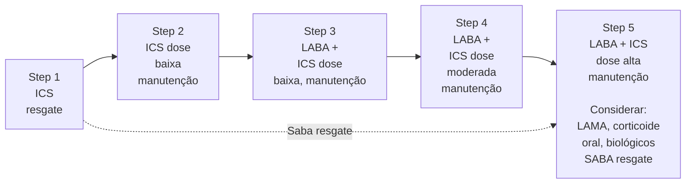

ASMA

• **Definição:** doença inflamatória crônica das vias aéreas com característica de sazonalidade; sintomas comuns: dispneia, tosse, opressão torácica e episódios de sibilos.

• **Diagnóstico:** sintomas compatíveis associado a comprovação da obstrução variável ao fluxo aéreo através de testes como espirometria com prova broncodilatadora positiva, pico de fluxo expiratório, teste de broncoprovocação, melhora da função pulmonar após 4 semanas de tratamento, variação excessiva na função entre consultas;

• **Critérios de Controle:** avaliar em todas as consultas, para que ajustes no tratamento possam ser realizados de forma adequada. Avaliar nas últimas 4 semanas (sintomas de asma > 2x na semana? / uso de SABA > 2x/semana? / despertar noturno por sintomas da asma? / limitação de atividades por causa da asma? | zero itens → bem controlada; 1-2 itens → parcialmente controlada; 3-4 itens → não controlada.

**Tratamento:**

• Principal: formoterol + CI é pilar do tratamento; etapas 1-2 (somente se necessário), etapa 3 (dose baixa manutenção), etapa 4 (dose moderada manutenção), etapa 5 (dose alta manutenção + considerar uso de LAMA, corticoide oral e/ou biológicos) - formoterol + CI é utilizado como resgate em todas as etapas.

• Alternativo: etapa 1 (SABA + CI somente resgate), etapa 2 (CI dose baixa manutenção), etapa 3 (LABA + CI dose baixa manutenção), etapa 4 (LABA + CI dose moderada manutenção), etapa 5 (LABA + CI dose alta manutenção + considerar uso de LAMA, corticoide oral e/ou biológicos) - uso obrigatório da associação SABA + CI no resgate.

• Broncodilatador isolado NUNCA é opção; avaliar diagnósticos diferenciais, comorbidades e adesão ao tratamento, bem como técnica inalatória nos casos de descontrole e não resposta ao tratamento.

## 1. DEFINIÇÃO

• **Doença inflamatória crônica** das vias aéreas inferiores, caracterizada por **aumento da responsividade das vias aéreas a estímulos** (alérgenos, frio, exercício físico), com consequente obstrução ao fluxo aéreo. Uma característica muito importante: **é de caráter recorrente e tipicamente reversível;**

• É uma doença complexa e heterogênea, caracterizada por diferentes fenótipos e endotipos:
  • Fenótipos: características observáveis nos indivíduos;
    • Asma eosinofílica: alérgica ou não alérgica;
    • Asma não eosinofílica: neutrofílica ou paucigranulocítica;
  • Endotipos: mecanismo inflamatório, ou seja, qual via fisiopatológica está envolvida;
    • Inflamação do tipo 2 (T2 alta): caracterizada pela participação de IL4, IL5, IL13. É responsável pela inflamação eosinofílica e, em pacientes com fenótipo alérgico, cursa com elevação de IgE;
    • Inflamação não tipo 2 (T2 baixa): aumento das alarminas como IL33 e TSLP, bem como IL5, IL6 e IL 17. Associada ao fenótipo não eosinofílico.

## 2. DIAGNÓSTICO

• Clínica: **sintomas recorrentes e variáveis, em intensidade e tempo;**
  • Quais sintomas? Dispneia, tosse, sibilos, dor torácica;
  • Podem ser espontâneos ou em resposta a um trigger como atividade física, temperatura e exposições;

• Frequentemente pioram à noite ou pela manhã;

• Para o diagnóstico, **os pacientes precisam de sintomas compatíveis associado a confirmação da obstrução variável ao fluxo aéreo;**
  • A obstrução ao fluxo aéreo pode ser demonstrada através dos seguintes exames:
    • **Espirometria com prova broncodilatadora positiva;**
    • **Pico de fluxo expiratório;**
    • **Teste de broncoprovocação;**
    • **Melhora da função pulmonar após 4 semanas de tratamento;**
    • **Variação excessiva na função entre consultas;**

• **Espirometria com prova broncodilatadora positiva:** necessária presença de distúrbio ventilatório obstrutivo (VEF1/CVF < LIN + redução do VEF1) e prova broncodilatadora positiva (aumento do VEF1 ou CVF ≥ 12% do basal E ≥ 200 ml);
  • Deve ser repetida após 3-6 meses do início do tratamento e, posteriormente, a cada 1-2 anos a depender do paciente;

• **Pico de fluxo expiratório:** a espirometria nem sempre é um método disponível então o GINA recomenda o pico de fluxo como alternativa. Pode ser usado em 3 cenários diferentes;
  • Uso isolado: aumento ≥ 25% em relação ao basal após uso de broncodilatador;
  • Variabilidade excessiva: média de variabilidade diurna > 10% quando o paciente realiza pico de fluxo expiratório 2x ao dia por 15 dias;
  • Variabilidade entre visitas médias ≥ 20%;

• **Teste de broncoprovocação:** pode ser por via farmacológica ou não, sendo que o fármaco mais usado é a metacolina;
  • Ocorre uma cascata complexa, que envolve

interleucinas e mediadores inflamatórios, e na qual ocorre a apresentação do antígeno, desencadeando toda a cascata pró-inflamatória que culmina com a inflamação da musculatura lisa;
* Positivo quando queda no VEF1 ≥ 20%;
* Melhora na função pulmonar após 4 semanas de tratamento com corticoide inalatório:
  * Aumento VEF1 ≥ 12% e 200 ml em relação à primeira consulta;
  * Aumento PFE ≥ 20% entre consultas;
* Variação excessiva entre consultas:
  * Aumento VEF1 ≥ 12% e 200 ml entre consultas;
  * Boa especificidade;
* Outros exames:
  * Imagem: não mandatório, principalmente para diagnóstico diferencial de quadros graves e avaliação de complicações;
  * Hemograma: importante para avaliar anemia como componente de dispneia e a contagem de eosinófilos para avaliação adequada do fenótipo;
  * Eosinófilos no escarro induzido: usado para avaliação do fenótipo em pacientes portadores de asma grave, com finalidade de seleção adequada de terapia específica;
  * IgE total e específica, testes cutâneos (alergia): para fenótipo alérgico;
  * FeNO (fração exalada do óxido nítrico: usado como medida não invasiva da inflamação eosinofílica das vias aéreas.

## 3. TRATAMENTO

* O objetivo do tratamento da asma é atingir e manter o controle da doença em dois domínios: controle de sintomas e controle de riscos futuros, como declínio da função pulmonar, efeitos colaterais das medicações e exacerbações;
* Os principais fatores associado a risco aumentado de exacerbações são:
  * Uso excessivo de SABA;
  * Corticoide inalatório inadequado;
  * Comorbidades não controladas;
  * Gestação;
  * Exposições ambientais;
  * Condições psicossociais associadas;
  * VEF1 ≤ 60%;
  * Marcadores inflamatórios elevados;
  * História prévia de exacerbações;
* Lembrando que a asma é uma doença inflamatória com hiperresponsividade brônquica. E é por isso que a base do tratamento medicamentoso consiste na associação de corticoide inalatório (ICS) +

formoterol (LABA);
* O tratamento medicamentoso no paciente asmático é composto de medicações de manutenção e medicações de resgate (que incluem os broncodilatadores de ação rápida). O formoterol é um beta2-agonista de longa ação, no entanto tem o início de ação rápido e, por isso, pode ser usado tanto no tratamento de manutenção quando resgate;
* ICS = Corticoide inalatório;
  * Budesonida, beclometasona, fluticasona, mometasona, ciclesonida.
* Broncodilatadores:
  * SABA = broncodilatador de curta;
    * Fenoterol – início de ação rápido;
    * Salbutamol – início de ação rápido.
  * LABA = broncodilatador de longa;
    * Formoterol – início de ação rápido;
    * Salmeterol;
    * Vilanterol, indacaterol → Ultra LABA (Ação por 24h).
  * SAMA = anticolinérgico de curta ação;
    * Ipratrópio – início de ação rápido.
  * LAMA = anticolinérgico de longa ação;
    * Tiotrópio;
    * Umeclidíneo;
    * Glicopirrónio.
* Outras medicações:
  * Antagonista de receptor de leucotrieno;
    * Montelucaste.
  * Corticoide oral: deve ser usado como exceção;
    * Prednisona/prednisolona.
* Biológicos;
  * Anti IgE: Omalizumabe;
  * Anti IL5/IL5R: Mepolizumabe/Benralizumabe;
  * Anti IL4R: Dupilumabe;
  * Anti TSLP: Tezepelumabe;

## 4. INÍCIO DE TRATAMENTO

* Avaliar frequência e intensidade dos sintomas
* Sintomas pouco frequentes (1-2x na semana) ou com função pulmonar normal ou pouco reduzia → CI + formoterol quando necessário;
* Sintomas 4-5x na semana, despertar noturno ou alteração da função pulmonar → CI em dose baixa + formoterol manutenção e resgate;
* Sintomas diários, despertar noturno, redução da função pulmonar → CI em dose moderada + formoterol manutenção e resgate;
* Lembrando que a dose dos corticoides inalatórios é dividida de acordo com a intensidade na tabela 1

ASMA                                                                                                                 3

## Tabela 1

| Adults and adolescents (12 years and older)
Inhaled corticosteroid | Adults and adolescents (12 years and older)
Inhaled corticosteroid | Total daily ICS dose (mcg) - see notes above
Low | Total daily ICS dose (mcg) - see notes above
Medium | Total daily ICS dose (mcg) - see notes above
High |
| ---------------------------------------------------------------------- | ---------------------------------------------------------------------- | ---------------------------------------------------- | ------------------------------------------------------- | ----------------------------------------------------- |
| Beclometasone dipropionate (pMDI, standard particle, HFA)              |                                                                        | 200-500                                              | >500-1000                                               | >1000                                                 |
| Beclometasone dipropionate (pMDI, extrafine particle\*, HFA)           |                                                                        | 100-200                                              | >200-400                                                | >400                                                  |
| Budesonide (DPI)                                                       |                                                                        | 200-400                                              | >400-800                                                | >800                                                  |
| Ciclesonide (pMDI, extrafine particle\*, HFA)                          |                                                                        | 80-160                                               | >160-320                                                | >320                                                  |
| Fluticasone furoate (DPI)                                              |                                                                        |                                                      | 100                                                     | 200                                                   |
| Fluticasone propionate (DPI)                                           |                                                                        | 100-250                                              | >250-500                                                | >500                                                  |
| Fluticasone propionate (pMDI, standard particle, HFA)                  |                                                                        | 100-250                                              | >250-500                                                | >500                                                  |
| Mometasone furoate (DPI)                                               |                                                                        |                                                      | 200                                                     | 400                                                   |
| Mometasone furoate (pMDI, standard particle, HFA)                      |                                                                        | 200-400                                              |                                                         | >400                                                  |

## 5. TRATAMENTO PREFERENCIAL

- Após o início do tratamento, reavaliar o paciente em 3 meses através do seguinte questionário:
- Levar em consideração as últimas 4 semanas:
- Sintomas de asma > 2x por semana? → Dispneia, tosse, chiado e opressão torácica.
- Uso de SABA > 2 vezes por semana?
- Despertar noturno por sintomas da asma?
- Limitação das atividades por causa da asma?

### Tabela 2

| Bem controlada
Zero itens | Parcialmente
controlada
1-2 itens | Não controlada
3-4 itens |
| ----------------------------- | ----------------------------------------- | ---------------------------- |

- Para entender os ajustes do tratamento, também é importante conhecer o tratamento preferencial e tratamento alternativo;
- Usar só o broncodilatador não é opção nunca!

### Tabela 3: Tratamento preferencial

| Step 1-2                                  |                                     |                                              |                                                                                                 | Step 5     |
| ----------------------------------------- | ----------------------------------- | -------------------------------------------- | ----------------------------------------------------------------------------------------------- | ---------- |
|                                           |                                     |                                              | Step 4                                                                                          | Formoterol |
|                                           |                                     | Step 3                                       | Formoterol                                                                                      | +          |
|                                           | Formoterol                          | +                                            | CS dose alta
(manutenção)
Considerar:
LAMA,
corticoide
oral,
biológicos |            |
|                                           | ICS dose
baixa
(manutenção) | +
ICS dose
moderada
(manutenção) |                                                                                                 |            |
| Formoterol + ICS dose baixa
(resgate) |                                     |                                              |                                                                                                 |            |

- O formoterol é um broncodilatador de início rápido, sendo possível utilizá-lo para resgate;
- Em pacientes nas etapas 1-2, a recomendação é utilizar o formoterol + ICS em dose baixa apenas no resgate.
- Se o paciente é um pouco mais grave, pode ter o despertar noturno, mas não tem alteração de função pulmonar, por exemplo. Ele estará na etapa 3 (formoterol + ICS em dose baixa, de manutenção). Fazendo resgates com formoterol + ICS nas crises;
- Se o paciente está na etapa 4, por exemplo, tem sintomas recorrentes, sintomas noturnos e alteração de função pulmonar. A recomendação é utilizar formoterol + ICS em dose moderada de manutenção + resgates, se necessários;
- Na etapa 5, pode ser feito formoterol + ICS em dose alta para manutenção + resgate. Pode-se considerar LAMA, corticoide oral, nos casos de exacerbação ou dificuldade de controle, e imunobiológicos.
- Paciente com asma controlada por mais de 3 meses tem recomendação de descer uma etapa, "step down".

## 6. TRATAMENTO ALTERNATIVO

- Usar só o broncodilatador não é uma opção nem mesmo no tratamento alternativo;
- Neste modo de tratamento existe uma divisão entre as etapas 1 e 2.

PNEUMOLOGIA

**Figura 1**

• Na etapa 1, o paciente vai usar um ICS de resgate + SABA de resgate. (O SABA de resgate está presente em todas as etapas.)

• Na etapa 2, o paciente é um pouco mais sintomático, apresentando sintomas > 2x por mês, sendo a dose de manutenção recomendada uma baixa dose de ICS + SABA de resgate;

• Na etapa 3, por exemplo, um paciente com despertar noturno, porém não tem alteração da função pulmonar, portanto estará utilizando LABA + ICS em dose baixa de manutenção + SABA de resgate;

• Na etapa 4 (quando o paciente já tem alteração de função pulmonar), o paciente deve usar manutenção LABA + ICS em dose moderada + SABA de resgate;

• Na etapa 5, casos mais graves e refratários, o paciente deve usar uma dose alta de LABA + ICS de manutenção + SABA de resgate, podendo considerar LAMA, corticoide oral e biológicos.

## 7. DESCONTROLE

• IMPORTANTE: antes de ajustar o tratamento medicamentoso do paciente, é importante investigar fatores que podem estar associados ao não controle da doença como:
  • Diagnóstico incorreto;
  • Má adesão;
  • Técnica inalatória incorreta (Curiosidade: estima-se que o paciente necessite de 3-4 visitas a um profissional médico para que consiga utilizar o dispositivo inalatório da forma correta);
  • Exposições ambientais (domiciliar e ocupacional);
  • Uso de medicações;
  • Comorbidades não controladas como DRGE, rinite, obesidade, AOS;

• Através da avaliação desses conceitos, é possível diferenciarmos asma grave de asma de difícil controle:
  • Asma de difícil controle: não controlada devido a um ou mais fatores que influenciam no controle da doença;
  • Asma grave: budesonida ≥ 1600 mcg ou equivalente + segunda droga ou corticoide oral ≥ 50% dos dias.

## 8. ASMA GRAVE

• Pacientes portadores de asma grave são candidatos a terapia alvo. Para que possam ser prescritas de forma adequada, é importante entender o fenótipo do paciente através de testes como eosinófilos séricos, FeNO e testes alérgicos;

• **Omalizumabe (anti-IgE) - disponível no SUS:** asma alérgica grave (IgE específico ou Prick test positivo). São preditores de resposta o valor elevado de eosinófilos séricos, FeNO elevado, sintomas com trigger alérgico e asma na infância;

• **Mepolizumabe (disponível no SUS) e Benralizumabe (anti-IL5/IL5R):** asma eosinofílica grave, em pacientes com eosinófilos ≥ 150 e exacerbações no último ano. São preditores de resposta o valor elevado de eosinófilos séricos, exacerbações prévias, polipose nasal e asma de início na vida adulta;

• **Dupilumabe (anti-IL4R):** asma eosinofílica / inflamação T2 alta, sendo indicado para pacientes com exacerbações, uso de corticoide oral e indicadores inflamatórios elevados;

• **Tezepelumabe (anti-TSLP):** asma grave, ainda não disponível no SUS.

## 9. CRISE DE ASMA

• Piora aguda ou subaguda dos **sintomas e da função pulmonar**, decorrente de diferentes fatores como infecções, poluição, alérgenos, adesão, clima;

• Comum, porém cuidado pois é uma condição potencialmente ameaçadora à vida, com maior risco de óbito em pacientes com IOT prévia, hospitalizações, má adesão, tratamento sem corticoide inalatório, uso excessivo de SABA, asma grave e presença de comorbidades;

• Classificação de gravidade:
  • Crise leve/moderada:
    • Frases completas;
    • Paciente sentado, calmo;
    • Sem uso de musculatura acessória;
    • Taquipneia;
    • FC 100-120 bpm;
    • SpO2 90-95% em AA;
    • PFE > 50% do predito;
  • Crise grave:
    • Palavras;
    • Agitado;
    • Uso de musculatura acessória;
    • FR > 30 irpm;
    • FC > 120 bpm;
    • SpO2 > 90% em AA;

ASMA

• PFE ≤ 50% do predito;
• Manejo:
  • Passo 1: broncodilatadores de ação rápida;
    • SABA: salbutamol 4-10 puffs a cada 20 minutos (3x);
    • Pode associar ipratrópio;
  • Passo 2: corticoide sistêmico;
    • Prednisona 40-50mg - eficácia EV semelhante;
    • Início rápido e manter 5-7 dias;
  • Passo 3: suporte ventilatório;
    • SpO2 alvo 93-95%;
    • VNI tem dados menos robustos em relação ao DPOC;
    • Se PaO2 < 60 mmHg + PCO2 normal → indicativo de insuficiência respiratória (paciente não consegue mais compensar a hipoxemia com frequência respiratória);
• Outros:
  • Antimicrobiano: se evidência robusta de infecção;
  • Manter e ajustar o tratamento de manutenção;
  • Iniciar tratamento para os pacientes que não estão usando a medicação;
  • Sulfato de magnésio para os refratários.
