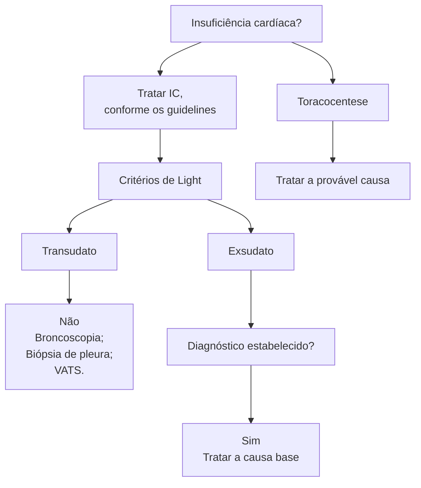

# DERRAME PLEURAL

• Quadro clínico → dispneia súbita ou progressiva; dor torácica ventilatório-dependente; tosse seca ou produtiva; expansibilidade torácica diminuída, macicez à percussão torácica, redução do murmúrio vesicular.
• Diagnóstico → história clínica + propedêutica armada + achados de exame físico; exames radiológicos úteis: RX de Tórax e TC de Tórax; USG de tórax tem grande valor para estimar o volume do líquido e demarcar sítio de punção ou auxiliar punção guiada.
• Condutas diagnósticas → toracocentese (alívio - etiologias conhecidas; redução dos sintomas; contraindicado em casos de pulmão não expansível ou hidrotórax hepático/diagnóstico - realizada em quadros novos ou em casos de complicações).
• O que investigar? → coleta pareada sangue/líquido pleural; avaliar sérico e pleural → proteínas totais, DHL, glicose, colesterol e triglicérides; avaliar somente pleural → pH, citologia oncótica e diferencial, bacterioscopia, micológico direto, pBAAR, culturas (BAAR, fungos, bactérias), ADA, PCR-TB.
• Critérios de Light → exsudato quando : PTpleura/PTsoro > 0,5 ou DHLpleura/DHLsoro > 0,6 ou DHLpleura > 200; atenção especial a pacientes em uso de diuréticos (pseudo-exsudato), nesse caso utilizar GASA do líquido pleural sendo albumina soro - albumina pleural < 1,2 indicativo de exsudato. | Caso não chegue no diagnóstico complementar com broncoscopia ou VATS com biópsia pleural se for o caso.
• Tratamento → varia conforme a etiologia do líquido.
• ATENÇÃO → critérios para DP complicado pH < 7,2; DHL > 1000; Glicose < 60; bacterioscopia positiva ou cultura positiva (mesmo que parcial); aspecto loculado ou septado; visualização direta de pus; citologia com predominância de neutrófilos e presença de bactérias.).

## 1. CONSIDERAÇÕES GERAIS

• Definição: é o acúmulo de líquido entre as pleuras visceral e parietal;

**Manifestações clínicas:**
• Dispneia → súbita ou progressiva?
• Dor torácica, do tipo ventilatório-dependente;
• Tosse seca ou produtiva.

**Exame físico:**
• Aparelho respiratório:
  • Taquipneia;
  • Expansibilidade torácica reduzida;
  • Macicez à percussão torácica;

## 2. DIAGNÓSTICO

• É dado pelo conjunto de fatores obtidos a partir de: história clínica + elementos do exame físico + propedêutica armada.

### 2.1 EXAMES COMPLEMENTARES

• Radiografia de tórax;
  • Imagem 1: sinal do menisco; derrame pleural à direita.
  • Imagem 2: radiografia de tórax – incidência de Laurell; presença de duas lâminas líquidas, determinando a mobilidade do fluido.
• Tomografia computadorizada.
  • Derrame pleural à direita.

### 2.2 CONDUTAS DIAGNÓSTICAS

• Toracocentese – sempre indicada (motivo de controvérsia);
  • Alívio: é utilizada em etiologias conhecidas; demonstra utilidade para a redução dos sintomas associados – por exemplo, dispneia; contraindicado nos casos de pulmão não expansível (por exemplo em caso de atelectasia por obstrução do brônquio fonte por neoplasia), e em hidrotórax hepático;
• Diagnóstica: realizada em quadros novos ou em casos de complicações.

**Figura 1** Radiografia de tórax em PA em ortostase à esquerda e em Laurell à direita, demonstrando derrame pleural

**Figura 2** TC de tórax evidenciando derrame pleural à direita

CLÍNICA MÉDICA

**Tabela 1** Etiologias de exsudato

| Etiologias de transudato          | Etiologias de transudato                                                                                                               |
| --------------------------------- | -------------------------------------------------------------------------------------------------------------------------------------- |
| Neoplasias                        | Metástase pleural
Neoplasia pulmonar primária
Neoplasia de mama
Mesotelioma                                                |
| Doenças infecciosas               | Parapneumônico (PAC)                                                                                                                   |
| TEP                               | Pode se manifestar como transudato                                                                                                     |
| Doenças do trato gastrointestinal | Pancreatite
Abscesso intra-abdominal
Perfuração esofágica                                                                      |
| Doenças reumatológicas            | Artrite reumatoide
LES
Síndrome de Sjögren
GPA – Granulomatose com poliangiite
ES – Esclerose sistêmica
Amiloidose |
| Outros                            | LAM
Reação a drogas
Histiocitose de células de Langerhans
Síndrome de Meigs
Hemotórax                                  |
| Quilotórax                        | --------------                                                                                                                         |

## 2.3 TORACOCENTESE, O QUE INVESTIGAR?

• Sempre deve ser realizada uma coleta pareada – líquido pleural e sangue;
• Pesquisar:
  • Sérico e pleural: proteínas totais; DHL; glicose; colesterol e triglicérides;
  • Líquido pleural: pH; celularidade total e diferencial; citologia oncótica; bacterioscopia / exame micológico direto / pBAAR; culturas – BAAR, fungos, bactérias; Adenosina deaminase (ADA), PCR-TB.

ATENÇÃO! Os critérios de Light demonstram algumas limitações, principalmente para os pacientes em uso de diuréticos → pseudo-exsudato! Nesses casos, é útil considerar o uso de uma ferramenta semelhante ao "GASA" ("gradiente albumina soro-ascite"), a fim de classificar a amostra como exsudato, caso: **albumina soro – albumina pleural ≤ 1,2**

## 2.4 CRITÉRIOS DE LIGHT

• É realizado pela avaliação dos seguintes parâmetros;
  • DHL;
  • Proteínas totais → pleural e soro.
• Critérios para exsudato:
  • Proteína pleural/proteína soro > 0,5;
  • DHL pleural/DHL soro > 0,6;
  • DHL pleural > 200.
• Classificação:
  • Exsudato – apenas um critério.

**Figura 3** fluxograma de manejo do derrame pleural

DERRAME PLEURAL

• Diagnóstico estabelecido?
  • Sim: tratar de acordo com a causa-base;
  • Não: proceder com broncoscopia; biópsia de pleura; VATS.

ATENÇÃO! No caso de diagnóstico de transudato, não é indicada a realização de demais exames, em virtude de que faz parte da própria etiologia da insuficiência cardíaca.

Observe as tabelas a seguir:

**Tabela 2 Etiologias de transudato**

| Etiologias de transudato          | Etiologias de transudato               |
| --------------------------------- | -------------------------------------- |
| Insuficiência cardíaca congestiva | Frequentemente bilateral, ou à direita |
| Cirrose hepática                  | Hidrotórax hepático                    |
| Síndrome nefrótica                | Hipoalbuminúria                        |
| TEP                               | Pode se manifestar como exsudato       |
| Mixedema e sarcoidose             | Eventos raros                          |

## 3. TRATAMENTO

Atente-se: a principal conduta deve ser tratar a causa-base;
• Hipervolemia? → diuréticos;
• Quadros infecciosos? → antimicrobianos;
• Neoplasias? → toracocentese de alívio, tratamento primário (tratar a causa base!).

# REFERÊNCIAS

**Figura 1** Radiografia de tórax em PA em ortostase à esquerda e em Laurell à direita, demonstrando derrame pleural

Arquivo pessoal

**Figura 2** TC de tórax evidenciando derrame pleural à direita

Arquivo pessoal
