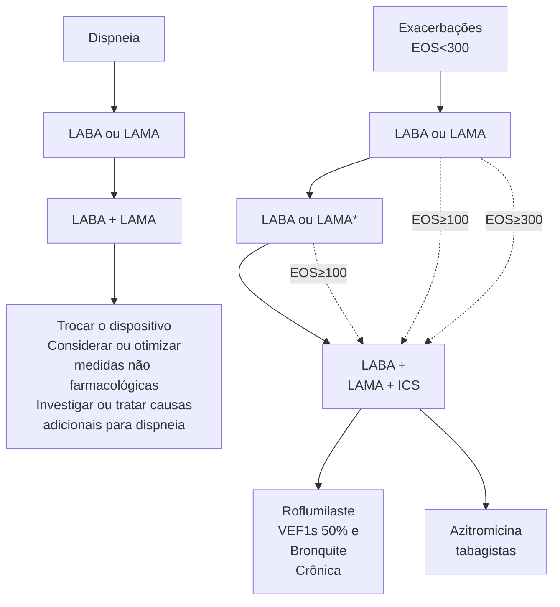

DPOC (CM)

# DPOC

• **Fatores de risco** → tabagismo (ativo/passivo); queima de biomassa; exposição ocupacional; poluição atmosférica; fatores genéticos; envelhecimento.
• **Nova classificação (2024)** → DPOC-G (deficiência de Alfa-1-Antitripsina); DPOC-D (desenvolvimento anormal); DPOC-C (clássica; exposição ao tabaco ativo/passivo incluindo DEF); DPOC-P (exposição ambiental); DPOC-I (quadros infecciosos na infância); DPOC-A (sobreposição a asma); DPOC-U (causas desconhecidas).
• **Quadro clínico** → dispneia, tosse crônica (produtiva ou seca), sibilância recorrente, infecções recorrentes VAI.
• **Diagnóstico** → combinação **OBRIGATÓRIA** de 3 fatores → fatores de risco + quadro clínico + **ALTERAÇÃO FUNCIONAL (DVO)**.
• **ATENÇÃO** → avaliar gravidade de obstrução do Fluxo Aéreo (%VEF1 - predito):
  • GOLD 1 → %VEF1 ≥ 80 → LEVE;
  • GOLD 2 → 50 ≤ %VEF1 < 80 → MODERADO;
  • GOLD 3 → 30 ≤ %VEF1 < 50 → GRAVE;
  • GOLD 4 → %VEF1 < 30 → MUITO GRAVE.

• **Tratamento**:
  • Inicial → rupo A (qualquer broncodilatador); Grupo B (LABA + LAMA); Grupo E (LABA + LAMA; considerar TRIPLA se EOS ≥ 300);
  • Seguimento → rever fluxograma abaixo.
• **Exacerbações**:
  • Piora aguda dos sintomas respiratórios; diagnóstico clínico;
  • Classificação: LEVE (manejado a domicílio com doses adicionais de SABA); MODERADO (uso de corticoide oral com ou sem ATB); GRAVE (procura serviço de urgência/emergência com ou sem internação hospitalar);
  • Tratamento medicamentoso → corticoide + ATB (sempre que houver purulência do escarro ou necessidade de VM; escolha depende de fatores de risco → sem fatores: macrolídeos, cefuroxima, doxiciclina ou sulfametoxazol/trimetropina; com fatores: amoxicilina + clavulanato ou quinolona respiratória).

## 1. DEFINIÇÃO

• **Doença comum, evitável e tratável;**
• **Caracterizada por sintomas respiratórios persistentes e limitação do fluxo aéreo;**
  • Anormalidades das vias aéreas e/ou alveolares, normalmente causadas por exposição significativa a partículas nocivas ou gases.
• **Alto impacto econômico (40bi/ano), sendo responsável por 4,72% das mortalidades em 2017;**
  • Alta morbimortalidade.
• **Pacientes relacionados a comorbidades (cardiovasculares, diabetes mellitus e psiquiátricas);**
• **Fatores de risco são:**
  • Tabagismo (ativo ou passivo);
  • Queima de biomassa;
  • Exposição ocupacional;
  • Poluição atmosférica;
  • Fatores genéticos;
  • Envelhecimento.
• **Ocorre lesão de pequena via aérea (região terminal próximo às trocas gasosas);**
  • A exposição dos fatores gera inflamação da VA;
  • Consequentemente, fibrose das vias;
  • Reação inflamatória crônica que leva a um remodelamento das VA.
• Plugs intraluminais;
• Aumento da resistência.
• **Ocorre também destruição do parênquima;**
  • Perda da arquitetura alveolar;
  • Diminuição do recolhimento elástico.
  • Aumento da complacência.

• Em conjunto, esses dois fatores promovem limitação ao fluxo aéreo.

## 2. FISIOPATOLOGIA

• Distúrbio ventilação/perfusão;
• Alteração da conformidade estrutural do pulmão.
• Comorbidades;
• Aprisionamento aéreo;
• Exacerbações.
  • Crônicas e ocorrem com frequência.

## 3. CLASSIFICAÇÃO

• DPOC geneticamente determinada (DPOC-G);
  • Deficiência de alfa-1-antitripsina;
  • Demais variantes genéticas pouco expressivas em combinação.
• DPOC determinada por desenvolvimento anormal dos pulmões (DPOC-D);
  • Eventos no início da vida, baixo peso ao nascer e prematuridade.
• DPOC secundária à exposição a tabaco (DPOC-C) – 80-90% dos casos;
  • Exposição ao tabaco (ativo e passivo, incluindo intraútero);
  • Uso de DEF, vaping ou e-cigarettes;
  • Cannabis.
• DPOC secundária à queima de biomassa e poluição atmosférica (DPOC-P);
  • Exposição à poluição doméstica, poluição do ar ambiente, fumaça de incêndio florestal e riscos ocupacionais.

• DPOC secundária a infecções (DPOC-I);
  • Quadros infecciosos na infância, DPOC associado a TBC ou HIV.
• DPOC sobreposta à asma (DPOC-A);
• DPOC por causas desconhecidas (DPOC-U).

## 4. QUADRO CLÍNICO

### 4.1 PRINCIPAIS SINAIS CLÍNICOS:

**Dispneia;**
• Persistente;
• Progressiva;
• Piora com exercícios.

**Tosse crônica;**
• Seca ou produtiva;
• Persistente ou intermitente.

**Exposição a fatores de risco;**
• Tabaco;
• Exposição ocupacional;
• Fatores pessoais (fatores genéticos, anormalidades no desenvolvimento e quadros infecciosos).

**Sibilância recorrente;**

**Infecções recorrentes de VAI.**

### 4.2 QUANTIFICAÇÃO DA DISPNEIA (ESCALA MMRC):

• 0: dispneia para exercícios intensos;
1. dispneia ao apressar o passo ou subir escadas/ ladeiras;
2. para caminhar algumas vezes andando no seu passo ou andando mais devagar que outras pessoas da minha idade;
3. para muitas vezes devido à dispneia, mesmo quando anda só 100m ou poucos minutos de caminhada;
4. dispneia para se vestir ou tomar banho ou deixar de sair de casa.

### 4.3 ACHADOS CLÍNICOS:

• Alterações em oximetria de pulso;
• Aumento do diâmetro anteroposterior do tórax;
• MV presente, bilateral e reduzido em ápices;
• Presença de sibilos e roncos na ausculta;
• Aumento do tempo expiratório;
• Expiração com lábios semicerrados;
• Hipofonese de bulhas cardíacas.
• Sinais de cor-pulmonale;
• Sarcopenia.

## 5. DIAGNÓSTICO

### 5.1 COMBINAÇÃO DE 3 FATORES:

**Fatores de risco:**
• Tabagismo - carga tabágica (maços/anos) = carteiras/ dia x anos de tabagismo;
• Outras fontes de queima de biomassa;
• Subdesenvolvimento pulmonar na infância;
• HMF de DPOC/enfisema;
• Gases, fumaça e produtos químicos ocupacionais.

**Sinais e sintomas:**
• Dispneia, tosse e sibilância;
• Infecções respiratórias (baixas) recorrentes.

**Confirmação funcional:**
• Espirometria com obstrução ao fluxo aéreo persistente;
• VEF1/CVF pós-broncodilatador < 0,70.

## 6. TRATAMENTO

### 6.1 LEVA EM CONSIDERAÇÃO:

• Gravidade de limitação ao fluxo aéreo;
• Avaliação dos sintomas;
• Avaliação das comorbidades;
• História de exacerbações.

### 6.2 GRAVIDADE DE OBSTRUÇÃO AO FLUXO AÉREO:

**Tabela 1 Gravidade de obstrução ao fluxo aéreo**

| Em pacientes portadores de DPOC – Espirometria VEF1/CVF < 0,7 | Em pacientes portadores de DPOC – Espirometria VEF1/CVF < 0,7 | Em pacientes portadores de DPOC – Espirometria VEF1/CVF < 0,7 |
| ------------------------------------------------------------- | ------------------------------------------------------------- | ------------------------------------------------------------- |
| **GOLD 1**                                                    | LEVE                                                          | VEF1 ≥ 80% (predito)                                          |
| **GOLD 2**                                                    | MODERADO                                                      | 50% ≤ VEF1 < 80% (predito)                                    |
| **GOLD 3**                                                    | GRAVE                                                         | 30% ≤ VEF1 < 50% (predito)                                    |
| **GOLD 4**                                                    | MUITO GRAVE                                                   | VEF1 < 30% (predito)                                          |

### 6.3 TERAPIAS NÃO FARMACOLÓGICAS:

• Cessação do tabagismo;
• Reabilitação;
• Vacinação: influenza, pneumococo, COVID-19 e *Haemophilus*;
• Controle de comorbidades;
• Investigação de diagnósticos diferenciais → Em especial com IC.

### 6.4 AVALIAÇÃO DOS SINTOMAS:

**Escala mMRC: classificação de 0 a 4;**
• 0 a 1 - pouco sintomático;
• Maior ou igual a 2: muito sintomático.

**CAT (COPD Assessment Test): classificação de 0 a 40 pontos;**
• Até 10: pouco sintomático;
• Maior que 10: muito sintomático;
• Se maior que 20: extremamente sintomático.

DPOC                                                                                          3

**Tabela 2** GOLD 2024 atualizado:

| ≥ 2 exacerbações moderadas
e/ou
1 exacerbação com hospitalização | **Grupo E**                                               |                           |
| ------------------------------------------------------------------------ | --------------------------------------------------------- | ------------------------- |
|                                                                          | LABA + LAMA\*
(considerar LABA+LAMA+ICS se EOS ≥ 300) |                           |
|                                                                          | **Grupo A**                                               | **Grupo B**               |
| Até 1 exacerbação moderada                                               | SABA, ou
SAMA, ou
LABA, ou
LAMA               | LABA + LAMA               |
|                                                                          | mMRC 0-1
CAT < 10                                     | mMRC 2, 3, 4
CAT ≥ 10 |

\* Dispositivo único: maior conveniência para o paciente

\* Dispositivo único - maior conveniência para o paciente
\*\* Descalonar tratamento em caso de pneumonia,
piora das exacerbações ou eventos adversos

**Figura 1** Gravidade de obstrução ao fluxo aéreo

OBS: SÓ desescalonar tratamento em caso de pneumonia, piora das exarcerbações ou eventos adversos → principal diferença da Asma

## 6.5 OUTRAS POSSIBILIDADES:

• Reposição de alfa-1-antitripsina;
• Bulectomia e cirurgias redutoras de volume;
• Válvulas endobrônquicas;
• Oxigenoterapia domiciliar prolongada (ODP):
  indicações de ODP no repouso:
  • PaO2 <= 55 mmHg ou SaO2 <= 88%;
  • PaO2 = 56-59 mmHg (ou SaO2 <= 89%), associado
    a HP, edema de 2º IC ou hematócrito > 55%;
  • Aumenta a sobrevida, melhora a hemodinâmica
    pulmonar, qualidade de vida, qualidade de sono e
    cognição;

• Não reduz a frequência das exacerbações.
• Transplante pulmonar.

## 7. COMPLICAÇÕES

### 7.1 EXACERBAÇÃO:

Um diagnóstico clínico.

• DPOC + piora aguda dos sintomas respiratórios, além
  da variação diária;
• Dispneia, tosse e expectoração;
• Sem alterações laboratoriais relevantes;
• Sem alterações em exames de imagem;
• Diagnósticos diferenciais: pneumonia, TEP,
  pneumotórax, infecções virais específicas e IC
  descompensada.

Prevalência de até 75% dos pacientes em 10 anos;
Risco de hospitalização:

• Tendo 5-20% de óbito.

**Fatores de risco:**
• Idade, tosse produtiva crônica, tempo de DPOC, exacerbações prévias (especialmente com uso de antibiótico recorrente), eosinofilia no hemograma (> 300) e presença de comorbidades.

**Até 20% nunca mais voltam ao seu status prévio.**

## 7.2 EXACERBAÇÃO DA DPOC – CLASSIFICAÇÃO DE GRAVIDADE:

**É retrospectivo:**
• Leve;
  • Manejada em domicílio com doses adicionais de SABA.
• Moderada;
  • Uso de corticoide oral com ou sem antibiótico.
• Grave.
  • Procura de serviço de urgência/emergência ou hospitalização.

## 7.3 EXACERBAÇÃO DA DPOC – TRATAMENTO:

• Medidas de suporte (ex.: O2, VNI/VMI) → VNI melhora mortalidade, diminui hospitalização e melhora desfecho em paciente DPOC;
• Manter medicações de uso contínuo para DPOC;

**Broncodilatador de curta duração (SAMA ou SABA):**
• Enquanto durar a exacerbação, para todos os pacientes.

**Corticoide oral:**
• Pred 40-60mg, 1x/d, 5-7 dias;
• Para todos os pacientes que buscam assistência médica por causas dos sintomas;
• Benefícios: melhor oxigenação, melhora mais rápida dos sintomas, melhora da função pulmonar, aumento do intervalo até a próxima exacerbação e menor tempo de hospitalização.

**Antibiótico:**
• Sempre que houver purulência do escarro ou necessidade de ventilação mecânica;
• Benefícios: igual corticoide oral, exceto melhora da função pulmonar;
• Escolha de ATB depende de fatores de risco (idade > 65 anos, FEV1 < 50%, maior ou igual a 2 exacerbações/ ano e doença cardíaca);
• Se nenhum fator de risco: macrolídeos **(azitromicina**, claritromicina), ou cefuroxima, ou doxiciclina, ou sulfametoxazol/trimetropina.
• Se algum fator de risco: **amoxicilina + clavulanato**, quinolona respiratória (**levofloxacino**, moxifloxacino).

## 7.4 DPOC – ATB

**Uso de ATB conforme perfil de resistência Opções iniciais:**
• Amoxicilina + Clavulanato
• Macrolídeo
• Tetraciclina

**Pacientes selecionados: Quinolona**
• **Levofloxacino:**
• Risco de pseudomonas
  • Colonização prévia nos últimos 12 meses
  • DPOC muito grave (VEF1 < 30%)
  • Bronquiectasias
  • Uso de ATB de largo espectro nos últimos 3 meses
  • Uso crônico de corticoide sistêmico
• Cobertura de outros agentes

## 7.5 VNI NO DPOC

• Reduz mortalidade
• Reduz taxa de IOT
• Suporte de escolha
• Necessita bom nível de consciência

**Indicações:**
• PaCO2 > 45 mmHg
• pH < 7,35
