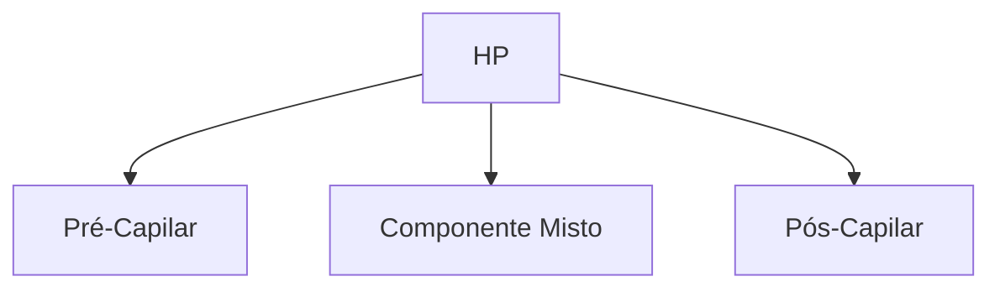

# HIPERTENSÃO PULMONAR

**Definição: PAPm > 20 mmHg (cateterismo direito)**

• Pré-capilar → PAPm > 20 mmHg / PoAP ≤ 15 mmHg / RVP > 2 Wood;

• Misto → PAPm > 20 mmHg / PoAP > 15 mmHg / RVP > 2 Wood;

• Pós-capilar → PAPm > 20 mmHg / PoAP > 15 mmHg / RVP ≤ 2 Wood.

**Quadro clínico:** sintomas de insuficiência cardíaca direita.

**Exames Complementares que auxiliam no diagnóstico:**
ECG, EcoTT, RX Tórax, cintilografia V/Q, TC Tórax, ergoespirometria, cateterismo direito.

**Classificação e tratamento:**

• Grupo 1 → hipertensão arterial pulmonar → vasodilatadores específicos;

• Grupo 2 → 2 à doença do coração esquerdo → tratar causa-base;

• Grupo 3 → 2 à doenças hipoxêmicas → tratar causa-base;

• Grupo 4 → 2 à doenças tromboembólicas → tromboendarterectomia (padrão-ouro); vasodilatadores específicos;

• Grupo 5 → miscelânea → vasodilatadores específicos;

**Drogas:**

• BCC (ex.: nifedipino) / antagonistas dos receptores da endotelina - ERA (ambrisentana, bosentana, macitentana) / inibidor da fosfodiesterase 5 - PDE-5i (tadalafila, sildenafila, riociguat) / análogos da prostaciclina (epoprostenol, iloprost, selexipag, treprostinil; útil em pacientes internados - descompensados);

• Preferir tratamento combinado (ERA + PDE-5i); em caso de 3a droga => + análogos da prostaciclina;

• Monoterapia → exceção em pacientes com baixo risco de evolução da doença;

• Cuidado especial com idosos > 75a + comorbidades.

## 1. DEFINIÇÃO

• Hipertensão pulmonar (HP) consiste na presença de uma pressão arterial pulmonar média (PAPm) > 20 mmHg em repouso, medida obtida pelo cateterismo direito. A HP é uma patologia complexa com grande variedade de sintomas e comorbidades associadas;

### 1.1 CLASSIFICAÇÃO DA HP:

• Pré-capilar:
  • PAPm > 20 mmHg;
  • PoAP (pressão de oclusão da artéria pulmonar) 15 mmHg;
  • RVP > 2 WU.

• Componente misto:
  • PAPm > 20 mmHg;
  • PoAP > 15 mmHg;
  • RVP > 2 WU.

• Pós-capilar:
  • PAPm > 20 mmHg;
  • PoAP > 15 mmHg;
  • RVP ≤ 2 WU.

## 2. CLASSIFICAÇÃO

### 2.1 GRUPO 1 - HIPERTENSÃO ARTERIAL PULMONAR (HAP)

• Classificação:
  • Idiopática;
  • Hereditária;
  • Associado a drogas/toxicidade;
  • Associado a DTC (Doença do Tecido Conjuntivo)/ HIV/hipertensão portal/cardiopatia congênita/ esquistossomose;

• Epidemiologia:
  • Doença rara (48-55 casos/milhão) que acomete principalmente > 65 anos; a forma de HAP idiopática é mais comum;
  • A forma hereditária é mais comum em mulheres jovens.

### 2.2 GRUPO 2 - DOENÇA CAUSADAS/ OCASIONADAS PELO CORAÇÃO ESQUERDO (ESSENCIALMENTE PÓS-CAPILAR)

• Perfil dos portadores:
  • ICFEP (FE preservada) ou ICFER (FE reduzida);
  • Doença valvar;
  • Condições cardiovasculares congênitas (HP pós-capilar);
  • Aproximadamente 50% dos pacientes tem IC;
  • Acomete cerca de 60-70% dos pacientes com insuficiência mitral grave;
  • Acomete > 50% dos pacientes com estenose aórtica sintomática.

• O achado de hipertensão pulmonar nestes pacientes está diretamente relacionado à gravidade da doença.

### 2.3 GRUPO 3 - RELAÇÃO COM DOENÇAS PULMONARES OU HIPÓXIA

• DPOC/enfisema;
• Doenças pulmonares intersticiais;
• Síndromes de hipoventilação;
• Hipóxia associada a altitude (sem patologia pulmonar);
• Doenças pulmonares congênitas;
• Epidemiologia:
  • Até 5% dos pacientes com DPOC desenvolvem HP;

• Acomete aproximadamente 50% dos pacientes com Fibrose Pulmonar Idiopática (FPI) avançada, e mais de 60% dos que estão em fase final da doença.

## 2.4 GRUPO 4 – RELACIONADO ÀS DOENÇAS TROMBOEMBÓLICAS

• Tromboembolismo pulmonar crônico (HPTEC);
• Outras obstruções de artéria pulmonar;
• Epidemiologia:
  • Prevalência de 38 casos/milhão;
  • A condição de TEP crônico sem HP existe, porém é rara.

## 2.5 GRUPO 5 – MISCELÂNEA

• Doenças:
  • Hematológicas;
  • Metabólicas;
  • Doença renal crônica com ou sem hemodiálise;
  • Mediastinite fibrosante.
• Epidemiologia:
  • Condição surge diante de causas raras, e apresenta prevalência desconhecida;
  • A sarcoidose, quando associada à HP, torna-se um marcador de gravidade em morbidade e mortalidade.

# 3. QUADRO CLÍNICO

• IC direita;
• Dispneia progressiva;
• Palpitações;
• Hemoptise;
• Congestão;
• Ganho de peso;
• Edema MMII (membros inferiores);
• Aumento do volume abdominal;
• Síncope;
• Cianose central, periférica;
• Terceira bulha;
• Pulso jugular;
• Hepatomegalia;
• Ascite, procurar sinais que possam sugerir a causa da HP: Raynaud, úlcera digital, estertores, telangiectasia.

# 4. DIAGNÓSTICO

## 4.1 EXAMES COMPLEMENTARES

• Auxiliam, mas não fecham diagnóstico isoladamente;
• Eletrocardiograma (ECG) – alterações sugestivas:
  • Onda P pulmonale;
  • BRD completo ou incompleto;
  • QT prolongado;
  • Sinais sugestivos de hipertrofia de VD.
• RX Tórax – alterações sugestivas:
  • Sinais de HP: aumento de VD (ventrículo direito), e alargamento mediastino;
  • Sinais de IC/congestão pulmonar: cefalização de trama, derrame pleural, ↑ AE (átrio esquerdo), ↑ VE (ventrículo esquerdo);
  • Sinais de doenças pulmonares: opacidades reticulares, hiperlucência e retificação de cúpulas diafragmáticas.
• Ecocardiograma:
  • Exame de triagem para fazer diagnóstico de HP;
  • Achados principais: PSAP; TAPSE; onda S; FAC.

## 4.2 EXAME INICIAL (TRIAGEM) – ECOCARDIOGRAMA TRANSTORÁCICO

**Tabela 1 Achados ao EcoTT e probabilidade de HP**

| Velocidade (máxima) de regurgitação da tricúspide (m/s) | Outros sinais de HP | Probabilidade de HP |
| ------------------------------------------------------- | ------------------- | ------------------- |
| ≤ 2,8 ou não mensurável                                 | Não                 | Baixa               |
| ≤ 2,8 ou não mensurável                                 | Sim                 | Moderada            |
| 2,9 – 3,4                                               | Não                 | Moderada            |
| 2,9 – 3,4                                               | Sim                 | Alta                |
| > 3,4                                                   | Sim/não             | Alta                |

• PSAP = estimativa da pressão sistólica da artéria pulmonar;
  • PSAP = 4 . VRT² + PAD.
• VRT = velocidade de regurgitação da tricúspide;
• PAD = pressão do átrio direito;
• Outras relações que também podem favorecer o diagnóstico de HP:
  • Relação VD/VE > 1,0;
  • Retificação do septo interventricular;
  • Tempo de aceleração do fluxo na válvula pulmonar < 100 msec;
  • Área do AD (átrio direito) > 18 cm²;
  • PAD > 15 mmHg.

## 4.3 CINTILOGRAFIA V/Q

• Indicações:
  • Suspeita ou diagnóstico recente HP;
  • Rastreamento para TEPCH;
  • Perfusão normal exclui TEPCH.

## 4.4 TOMOGRAFIA COMPUTADORIZADA DE TÓRAX

• Útil para a avaliação do parênquima e da circulação pulmonar, com achados indiretos/diretos de HP.

## 4.5 OUTROS

• RNM coração;
• Marcadores laboratoriais (troponina, BNP);
• USG abdominal (investigar hipertensão portal);
• TECP (ergoespirometria): útil para diagnóstico e seguimento;
• Cateterismo direito com avaliação de parâmetros + teste de vasorreatividade.

# 5. TRATAMENTO

• O tratamento é sempre individualizado, com base nos sintomas do paciente;
• Medidas gerais: O2, imunização, diuréticos, MEV (Mudança do Estilo de Vida) e anticoagulação quando necessário;
• Medidas conforme classificação:
  • Grupo 1: vasodilatadores específicos;

HIPERTENSÃO PULMONAR                                                                                              3

* Grupo 2: tratar causa base;
* Grupo 3: tratar causa base;
* Grupo 4: vasodilatadores em casos especiais, caso não seja candidato a cirurgia ou se operou e, mesmo assim, evoluiu com HP nessas condições;
* Grupo 5: vasodilatadores específicos.
* Tratamentos específicos:
  * Bloqueadores do Canal de Cálcio (BCC):
    * Exemplo: nifedipino;
    * Pacientes respondedores ao teste de vasorreatividade (< 10% dos pacientes respondem ao medicamento);
    * Principais eventos adversos: edema e hipotensão.
  * Antagonistas dos receptores da endotelina:
    * Atuam diretamente nos receptores da endotelina, favorecendo o mecanismo de ação diretamente na artéria pulmonar;
    * A vasodilatação ocorre principalmente pelo aumento da síntese das prostaciclinas e óxido nítrico, propiciando a vasodilatação;
    * Exemplos: ambrisentana; bosentana; macitentana;
    * Principais eventos adversos: edema e interação medicamentosa com ACO (anticoagulantes orais), varfarina e inibidores da PDE5 (inibidores da fosfodiesterase 5);
    * Inibidores da fosfodiesterase 5 → atuam como estimuladores da guanilatociclase solúvel:
    * Exemplo - sildenafila; tadalafila; riociguat;
    * Não devem ser usados em terapia combinada, pois aumenta o risco de hipotensão;
    * Principais eventos adversos: cefaleia; rubor facial; obstrução nasal; rinorreia; epistaxe.

* Análogos da prostaciclina:
* Também podem ter uso inalatório;
* Exemplos: epoprostenol /iloprost/treprostinil/selexipag;
* Boa alternativa para os casos de descompensação da HP em que existe a necessidade de internação hospitalar;
* Potente vasodilatação.
* Terapias alternativas:
* Especialmente para pacientes mais graves, como em UTI;
* Tratamento intervencional com "balão interatrial" ou transplante coração-pulmão (mais raro).
* Vasodilatadores pulmonares:
  * Em monoterapia são exceção. A associação medicamentosa normalmente obtém melhor resposta;
  * Cuidado especial com pacientes com > 75 anos com múltiplas comorbidades;
  * Podem ser utilizados sob monoterapia em pacientes com baixo risco de evolução da doença;
  * Considerar uso em: doença veno-oclusiva/ hemangiomatose; cardiopatias não corrigidas; doença muito leve; hipertensão portal; HIV;
  * A terapia combinada é prioridade, com preferência para ERA (Antagonista dos Receptores da Endotelina) + PDE-5i (inibidores da fosfodiesterase 5). Em casos de necessidade de 3ª medicação, os análogos das prostaciclinas podem ser associados.

## 6. PROGNÓSTICO

* Tabela de estratificação de risco para mortalidade em 1 ano na HP. Tabela 2

**Tabela 2 Risco de Mortalidade em 1 ano na HP.**

|                             | Baixo risco(< 5% mort/1 ano)                                          | Moderado risco(5-10% mort/1 ano)                                          | Alto risco(> 10% mort/1 ano)                                         |
| --------------------------- | --------------------------------------------------------------------- | ------------------------------------------------------------------------- | -------------------------------------------------------------------- |
| **CF-NYHA/WHO**             | 1-2                                                                   | 3                                                                         | 4                                                                    |
| **Síncope**                 | Não                                                                   | Eventuais                                                                 | Repetitivas                                                          |
| **Sinais de IC-D**          | Não                                                                   | Não                                                                       | Sim                                                                  |
| **Progressão dos sintomas** | Não                                                                   | Lenta                                                                     | Rápida                                                               |
| **BNP e NT-proBNP**         | BNP < 50 ng/L
NT-proBNP < 300 ng/L                                | BNP 50-300 ng/L NT-
proBNP 300-1400 ng/L                              | BNP > 300 ng/L
NT-proBNP > 1400 ng/L                             |
| **TC6'**                    | > 440 m                                                               | 165-440 m                                                                 | < 165 m                                                              |
| **TECP**                    | VO2 pico > 15 ml/min/kg (>
65% do predito) VE/VCO2
slope < 36 | VO2 pico 11-15 ml/min/kg
(35-65% do predito) VE/
VCO2 slope 36-45 | VO2 pico < 11 ml/min/kg (
35% do predito) VE/VCO2
slope > 45 |
| **Ecocardiograma TT**       | Área AD < 18 cm2 Sem
derrame                                      | Área AD 18-26 cm2
Sem derrame ou mínimo                               | Área AD > 26 cm2 Derrame
pericárdico                             |
| **Cateterismo direito**     | PAD < 8 mmHg IC ≥ 2,5 L/
min/m2 SvO2 > 65%                        | PAD 8-14 mmHg IC 2,0-2,4
L/min/m2 SvO2 60-65%                         | PAD > 14 mmHg IC < 2,0 L/
min/m2 SvO2 < 60%                      |

## REFERÊNCIAS

**Tabela 2 Risco de Mortalidade em 1 ano na HP.**
European Heart Journal (2022) 43, 3618–3731.
