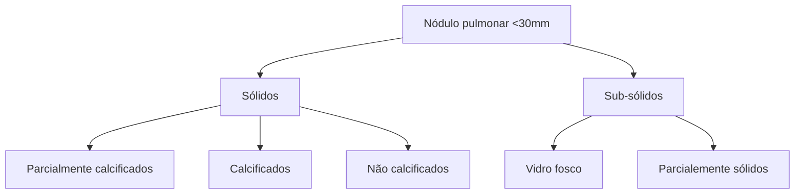

# NÓDULO PULMONAR

**95% dos nódulos são benignos; risco aumenta com a idade > 85 anos - risco 50x maior.**

- Tipos:
- Sólidos (parcialmente calcificados, calcificados, não calcificados);
- Subsólidos (vidro fosco, parcialmente sólidos).
- História Clínica → fatores de risco (idade e sexo); exposição ambiental (tabaco, cavernas, lavoura...); busca de sintomas (doenças inflamatórias x infecciosas x neoplasias).
- Avaliar características do nódulo → tamanho, margem, calcificação, crescimento, densidade e localização.;

- Estratificação de risco → Brock x Mayo.
- Seguimento
- Quanto maior a lesão, maior o risco para neoplasia;
- Até 2,9 cm (nódulo) > 3,0 cm (massa);
- Em nódulos subsólidos, quanto maior o componente sólido, maior o risco para neoplasia;
- Tomografia de tórax → exame de escolha para seguimento;
- Regras gerais: 5 a 6mm a depender do consenso (ACCP, Fleischner, Lung-RADS); ponto de corte para seguimento; verificar o "tipo" do nódulo; vidro fosco em geral → crescimento lento.

## 1. EPIDEMIOLOGIA

- Cerca de 95% dos nódulos são benignos, frequentemente achados incidentalmente devido ao maior acesso à tomografia de tórax, e favorecem o diagnóstico precoce de lesões malignas;
- Incidência:
  - 18 aos 24 anos: 0.4/1.000;
  - 85 aos 89 anos: 20/1.000 → risco 50x maior por idade;
  - Maior em mulheres até os 70 anos;
  - Diretamente proporcional à carga tabágica.
- Tipos dos nódulos:

**Nódulo pulmonar (<30mm)**

**Figura 1** Subtipos de nódulos pulmonares

- Obs: se maior que 30mm, é chamado de massa pulmonar. **Tabela 1**

## 2. AVALIAÇÃO DO PACIENTE

**Importante realizar uma anamnese dirigida:**

- Fatores de risco: idade e sexo;
- Exposição ambiental:
  - Tabaco;
  - Histoplasmose;
  - Paracoccidioidomicose.
- Busca de sintomas:
  - Sintomas infecciosos;
  - Sintomas sugestivos de doenças inflamatórias;
  - Sinais de malignidade: linfonodos palpáveis.

- Importante: buscar e avaliar imagens anteriores. Determinar características prévias e análise comparativa da imagem;
- Perspectiva de avaliação de biomarcadores plasmáticos, de via aérea, de expressão de mRNA, proteínas... Porém ainda em estudos preliminares.

**Tabela 1** Tipo do nódulo difere de acordo com etiologia

| Causa            | Condição                                                                                         |
| ---------------- | ------------------------------------------------------------------------------------------------ |
| Maligna          | **Neoplasia**                                                                                    |
|                  | Neoplasia primária de pulmão
Linfoma pulmonar
Tumor carcinóide
Metástase "solitária" |
| Benigna          | Hamartoma
Condroma                                                                           |
| **Inflamatória** |                                                                                                  |
| Infeccioso       | Granuloma
Nocardia
Pneumonia redonda                                                     |
| Não-infeccioso   | Nódulo reumatóide
Amiloidoma
Granulomatose com poliangeíte
Broncocele                |
| Vascular         | Malformação arteriovenosa
Infarto
Hematoma                                               |
| Congênito        | Cisto broncogênico
Sequestro                                                                 |
| Outros           | Pseudotumor
Linfonodo subpleural                                                             |

## 3. CARACTERÍSTICAS DO NÓDULO

### 3.1 TAMANHO

- Relação com risco de malignidade: quanto maior, maior o risco;
- Lesões acima de 3 cm de diâmetro: malignas até que se prove o contrário;

• > 10mm → até 15,2% de malignidade;
• 5 a 10 mm → 1,3% de malignidade;
• < 5mm → < 1,0% de malignidade, mesmo em pacientes de alto risco;
• Obs.: para nódulos > 5mm em pacientes tabagistas, a probabilidade é maior.

## 3.2 MARGEM
• Malignidade: bordas irregulares, lobuladas ou espiculadas;
• Benignidade: bordas lisas e arredondadas;
• Atentar que nem todo nódulo de bordas regulares é benigno.

## 3.3 CRESCIMENTO
• Volume Doubling Time – VDT: tempo necessário para duplicar ou aumentar o diâmetro em 26%;
  • Técnica útil em nódulos pequenos;
  • Estabilidade em 2 anos → benigno;
  • Atenção para nódulos sub-sólidos: adenocarcinoma in situ ou minimamente invasivo → crescimento lento.

## 3.4 CALCIFICAÇÃO
• Presente em nódulos benignos e malignos;
  • 6 a 10% em tumores primários;
  • Lesões metastáticas → sarcomas;
  • 8 a 35% em tumores carcinoides (dentre os malignos, têm melhor prognóstico).
• Padrão:
  • Central, laminar ou difusa → granulomas;
  • Pipoca → hamartoma;
  • Pontilhado ou excêntrico → maior risco de malignidade.

## 3.5 DENSIDADE
• Gordura ou partes moles → hamartomas;
  • Neoplasias benignas: atenuação de cartilagem, gordura, músculos e ossos;
  • Diferencial: pneumonia lipoídica ou metástases em lipossarcomas ou carcinoma de células renais → padrão multinodular.
• Cavitação:
  • Lesões benignas: abscessos, granulomas, vasculite, infarto (paredes finas e suaves);
  • Lesões malignas: primárias ou secundárias – carcinoma de células escamosas (paredes grossas e irregulares).

## 3.6 LOCALIZAÇÃO
• Malignos predominante em lobos superiores → OR 1,9;
  • Principalmente lobo superior direito (45%).
• Nódulos próximos à cisura ou septos com característica triangular/oval → atentar para linfonodos.
  • Benignos mesmo se > 6mm, na maioria das vezes;
  • Sem necessidade de seguimento, exceto se apresentar margem irregular, espiculada ou com distorção de estruturas adjacentes.

# 4. MÉTODOS DIAGNÓSTICOS

## 4.1 TOMOGRAFIA COMPUTADORIZADA
• Método de escolha para seguimento;
• Somente nódulo → sem contraste. Uso de contraste normalmente para estadiamento;
• Reconstrução axial < 1,5 mm + coronal/sagital;
• Melhor método para avaliar o volume do nódulo, se há crescimento ou invasão.
• Priorizar regimes em baixa dose, durante seguimento para diminuir a quantidade de radiação.

## 4.2 PET (TECNOLOGIA POR EMISSÃO DE PÓSITRONS)
• Utilizado FDG para avaliação da atividade metabólica em SUV (standardised uptake value);
• Lesões malignas: altas taxas metabólicas, aprisionamento e acúmulo de FDG;
  • Tecidos de maior demanda metabólica também têm alta captação, por exemplo, o miocárdio.
• Técnica de fusão: PET + TC (SUV > 2,5):
  • Sensibilidade 87 – 94,2%;
  • Especificidade 83%.
• Falso negativo → carcinoma bronquioloalveolar, tumores carcinóides e adenomas mucinosos, e ainda em doenças inflamatórias ou inflamatório-infecciosas.

# 5. ESTRATIFICAÇÃO DE RISCO

## 5.1 ESTRATIFICAÇÃO DE RISCO
• Leva-se em consideração os dois consensos, sendo o de Brock mais recente (2013).

**Tabela 2** Estratificação de risco do nódulo pulmonar

|                               | Brock University                                                                                                                                                    | Mayo Clinic                                                                                     |
| ----------------------------- | ------------------------------------------------------------------------------------------------------------------------------------------------------------------- | ----------------------------------------------------------------------------------------------- |
| **Critérios clínicos**        | Idade
Sexo feminino
História familiar de neoplasia de pulmão                                                                                                | Idade
Status tabágico
História de neoplasia nos últimos 5 anos                          |
| **Critérios radiológicos**    | Enfisema
Tamanho do nódulo
Localização em lobos superiores
Nódulos parcialmente sólidos
Número de nódulos
Irregularidade de margem (espiculado) | Tamanho do nódulo
Localização em lobos superiores
Irregularidade de margem (espiculado) |
| **Ano de publicação**         | 2013                                                                                                                                                                | 1997                                                                                            |
| **Características da coorte** | Dados de 12.000 nódulos evidenciados em TCBD; pacientes com alto risco e idade 50-75 anos e história tabágica atual ou prévia                                       | 419 nódulos radiologicamente indeterminados 7-30 mm                                             |
| **Critérios de exclusão**     | Passado de neoplasia pulmonar                                                                                                                                       | Qualquer neoplasia em até 5 anos do evento                                                      |
| **Limitações**                | Todos os pacientes foram fumantes; baixa taxa de malignidade global                                                                                                 | Coorte pequena; nódulos < 7 mm                                                                  |

NÓDULO PULMONAR

## 5.2 AVALIAÇÃO PERSONALIZADA

• Estabelecer a probabilidade de lesão maligna, e com base nesta, determinar o seguimento. Tabela 3

## 5.3 SEGUIMENTO

• Todos são mais recentes que os consensos já citados; Obs: quanto mais componente sólido, maior o risco de malignidade. Tabela 4

**Tabela 3** Manejo baseado em probabilidade de malignidade

| Manejo baseado em probabilidade de malignidade                                                                                                                                                                                                                                 | Manejo baseado em probabilidade de malignidade | Manejo baseado em probabilidade de malignidade |
| ------------------------------------------------------------------------------------------------------------------------------------------------------------------------------------------------------------------------------------------------------------------------------ | ---------------------------------------------- | ---------------------------------------------- |
| < 1% - sem necessidade de seguimento ou testes adicionais                                                                                                                                                                                                                      |                                                |                                                |
| 1% - 5%: seguimento por Tomografia de Tórax conforme *guidelines* e tamanho do nódulo                                                                                                                                                                                          |                                                |                                                |
| 5% - 30%: avaliação com TC de Tórax em 3 meses; considerar PET/CT ou biópsia não cirúrgica; monitorizar em pacientes com muitas comorbidades, baixa expectativa de vida, difícil acesso ao nódulo, taxa de crescimento lento, baixa atividade metabólica e decisão do paciente |                                                |                                                |
| 30% - 65%: considerar PET/CT ou biópsia não-cirúrgica; considerar broncoscopia em detrimento de punção por agulha fina em casos de acesso fácil por via aérea, enfisema grave, estratificação de mediastino, disponibilidade de *staff* treinado                               |                                                |                                                |
| 65% - 90%: considerar PET/CT ou biópsia não cirúrgica ou videotoracoscopia com ressecção; aspectos positivos para a ressecção – boa condição cardiopulmonar, difícil acesso ao nódulo por broncoscopia ou punção guiada, pacientes favoráveis ao tratamento invasivo           |                                                |                                                |
| > 90%: considerar videotoracoscopia com ressecção ou radioterapia estereotáxica baseado em comorbidades e preferências do paciente                                                                                                                                             |                                                |                                                |

**Tabela 4** Diretrizes de seguimento de nódulos pulmonares

| American College of Chest Physicians                                                                                                                                                                                                                                                                                                 | Fleischner Society                                                                                                                                | Lung-RADS                                                                                                                                                                                                                                                                                                                                                                                                                |
| ------------------------------------------------------------------------------------------------------------------------------------------------------------------------------------------------------------------------------------------------------------------------------------------------------------------------------------ | ------------------------------------------------------------------------------------------------------------------------------------------------- | ------------------------------------------------------------------------------------------------------------------------------------------------------------------------------------------------------------------------------------------------------------------------------------------------------------------------------------------------------------------------------------------------------------------------ |
| < 5 mm: sem indicação de seguimento                                                                                                                                                                                                                                                                                                  | < 6 mm
VVF: sem indicação de seguimento

Parcialmente sólido: sem indicação de seguimento                                             | VVF < 30 mm em avaliação inicial (ou qualquer tamanho estável): seguimento anual (categoria 2)

Parc. sólido < 6mm em avaliação inicial: seguimento anual (categoria 2)

Parc. sólido < 6mm (novo): estudo em 6 meses (categoria 3)                                                                                                                                                                      |
| > 5 mm
VVF: seguimento em 12 meses e controle anual por 3 anos

Parc. sólido:

- componente sólido ≤ 8 mm: seguimento em 3, 12 e 24 meses e, após, anual por 5 anos

- componente sólido > 8 mm: seguimento em 3 meses e considerar evolução com PET-CT, biópsia não cirúrgica ou ressecção se persistir | ≥ 6 mm
VVF: seguimento 6 – 12 meses e, então, a cada 2 – 5 anos

Parc. Sólido: seguimento 3 – 6 meses e, então, anualmente por 5 anos | VVF ≥ 30 mm em avaliação inicial ou novo em seguimento: seguimento em 6 meses (categoria 3)

Parc. sólido:

- componente sólido < 6mm: seguimento em 6 meses (categoria 3)

- componente sólido ≥ 6 a < 8 mm ou novo ou em crescimento e < 4 mm: seguimento em 3 meses (categoria 4A)

- componente sólido ≥ 8 mm ou novo ou em crescimento e ≥ 4 mm: avaliação adicional (categoria 4B) |
