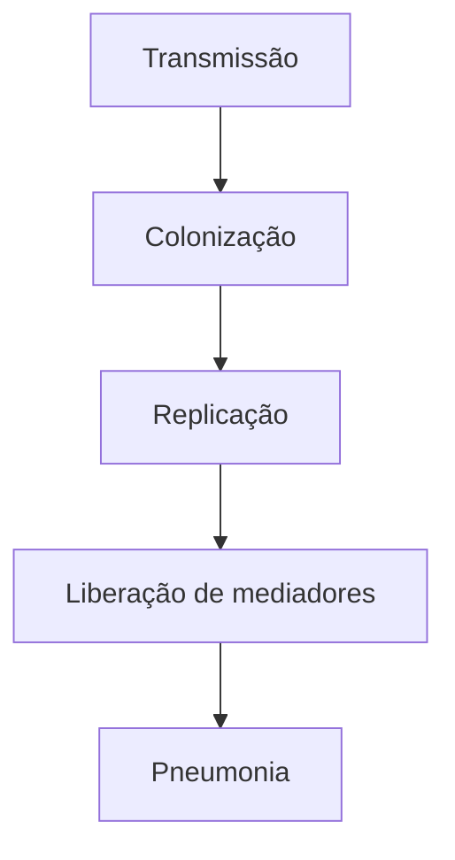
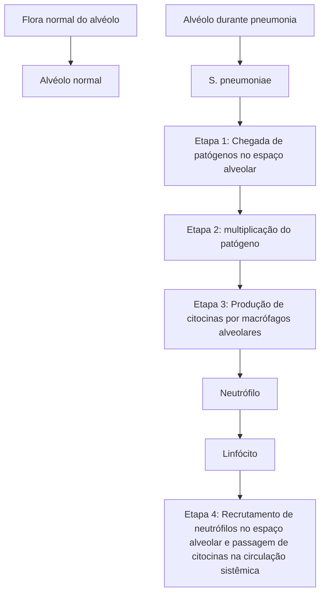
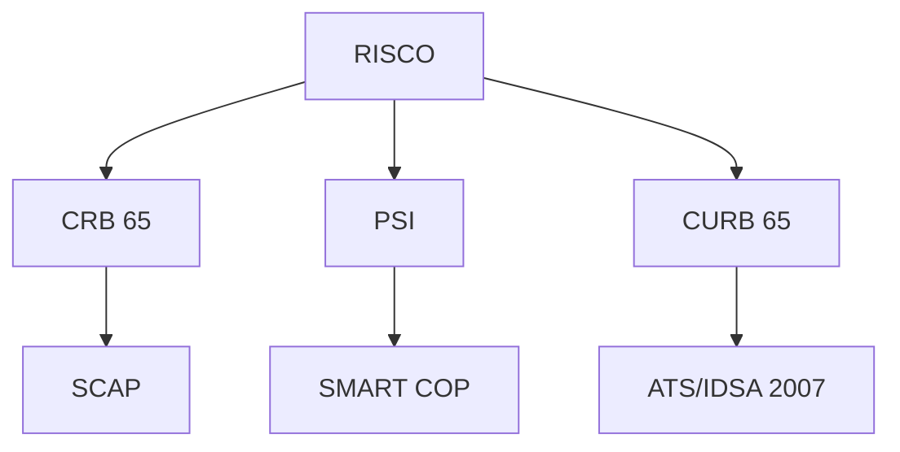
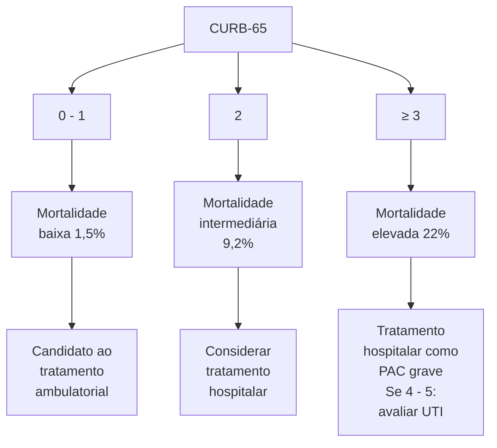
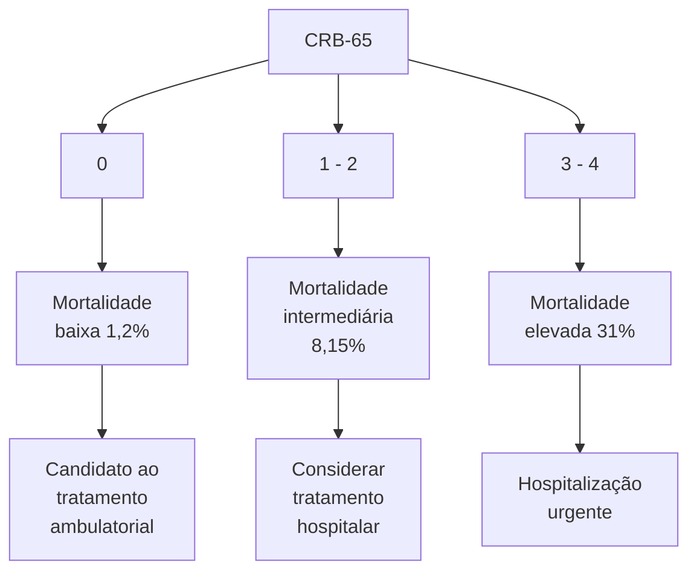
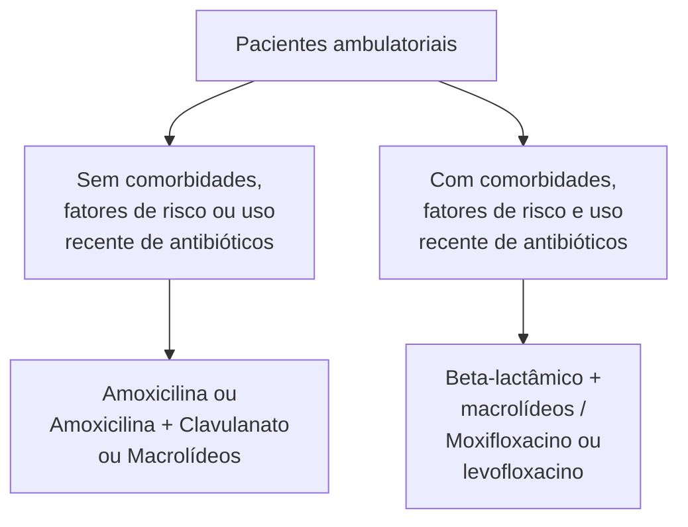
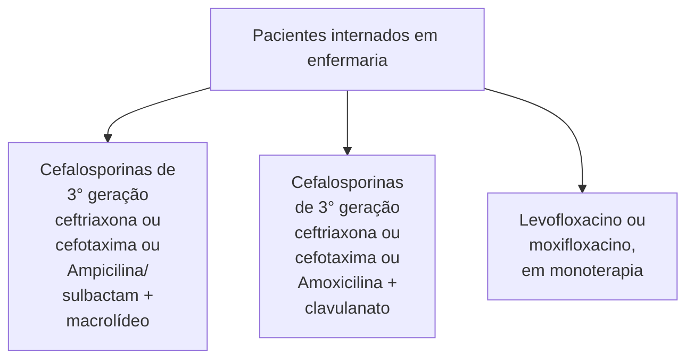
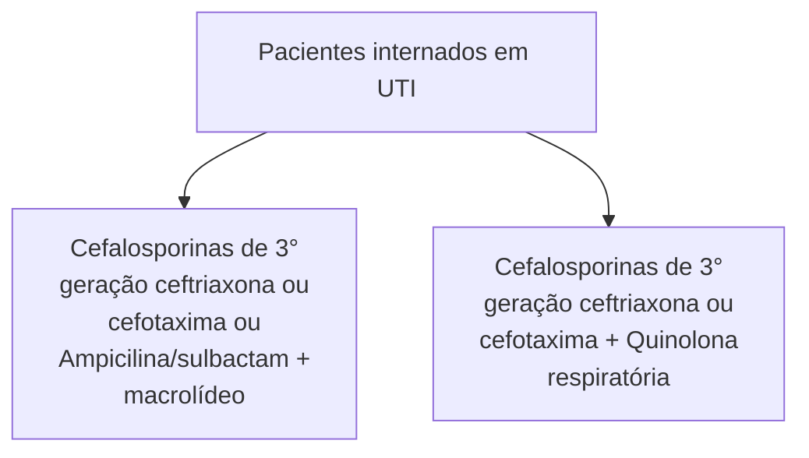
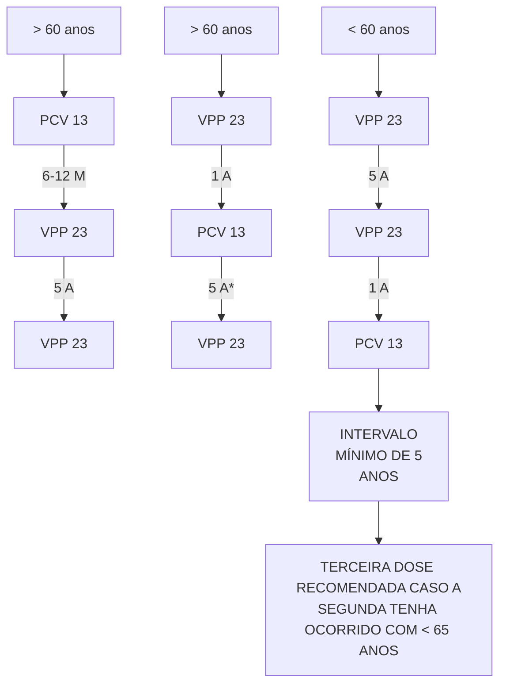
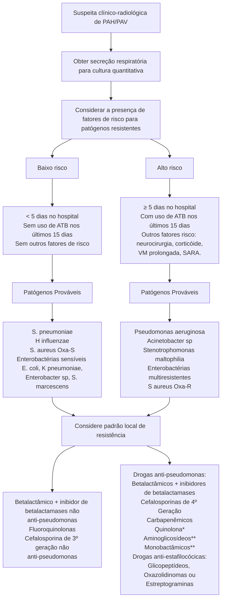

Pneumonia Adquirida na Comunidade PAC (CM)

# PNEUMONIA: PAC E HOSPITALAR

• Principal causa de morte no mundo; agente etiológico mais frequente → Streptococcus pneumoniae

**Fatores de Risco →**

• Episódios prévios de pneumonia, infecção viral do trato respiratório inferior, doenças cardio e neurovasculares, doenças respiratórias crônicas, disfagia, diabetes mellitus, neoplasias, doenças hepáticas ou renais, imunossupressao, abuso de álcool, baixo peso, tabagismo ativo, convivência com mais de 10 pessoas e/ou crianças

**Diagnóstico CLÍNICO**

• Sintomas → tosse produtiva/seca, dispneia, dor toracica, hipoxemia, estertores ou roncos; febre, adinamia, anorexia, taquicardia, hipotensão, alteração do nível de consciência ou lesões de órgãos alvo

• Propedêutica auxiliar → RX de Tórax, TC de Tórax, USG de Tórax, testes moleculares, antígenos urinários (Pneumococo ou Legionella), Lavado Broncoalveolar

• Estratificação de Risco → CRB-65 ou CURB-65; PSI

**Tratamento**

• Ambulatorial: Amoxicilina ou Amox-Clav ou Macrolídeos (sem fatores de risco) / B-lactâmico + Macrolídeos (com fatores de risco)

• Enfermaria: Cefalosporina 3a ou Ampi-Sulbactam + Macrolídeo ou Amox-Clav ou Levo/Moxifloxacino em monoterapia

• UTI: Cefalosporina 3a ou Ampi-Sulbactam + Macrolídeo ou Cefalosporina 3a + Quinolona Respiratória

• Casos Especiais: Pneumococo resistente à penicilina (não grave: B-lactâmico em altas doses + macrolídeo ou quinolona respiratória / grave: cefalosporinas 3a ou 4a); MRSA (Clindamicina - comunitário, Vancomicina ou Linezolida - hospitalar); Pseudomonas (fluoroquinolonas, pipetazo, meropenem, poliB); Quadros aspirativos (quinolonas ou cefalosporinas de 3a; aspiração documentada, dentição ruim, abscesso pulmonar, pneumonia necrotizante → Blactâmico + inibidor de B-lactamase, pipetazo, clindamicina ou moxifloxacino)

**Pneumonia Hospitalar / Nosocomial**

• Internação > 48 horas (precoce até 4 dias, tardia após 4 dias); sem relação com IOT/VM

**Pneumonia Associada a Ventilação Mecânica**

• Diagnóstico: fatores de risco maiores/menores + suspeita clínica + febre/hip

## 1. PNEUMONIA

### 1.1 EPIDEMIOLOGIA

• Constitui a principal causa de morte no mundo;
  • Streptococcus pneumoniae → principal agente etiológico.

• No Brasil;
  • Redução das taxas de morbimortalidade nos últimos anos, contudo ainda permanece como a terceira causa de morte.

### 1.2 FATORES DE RISCO

• Condições clínicas:
  • Outros episódios de pneumonia;
  • Infecções virais do TRI (trato respiratório inferior);
  • Doenças cardiovasculares/neurovasculares (AVE's e demência);
  • Doenças respiratórias crônicas (DPOC, asma...);
  • Disfagia – ou algum grau de microaspiração contínua;

• Diabetes mellitus;
• Neoplasias;
• Doenças hepáticas ou renais;
• Condições que levam à imunossupressão.

• Relacionados ao estilo de vida – modificáveis:
  • Abuso de álcool – maior propensão a aspiração?
  • Baixo peso;
  • Convivência com mais de 10 pessoas;
  • Tabagismo ativo;
  • Contato persistente com crianças.

### 1.3 MICROBIOLOGIA

• A suscetibilidade à infecção e a evolução do quadro dependem de alguns fatores externos, como:
  • Vacinação;
  • Geografia;
  • Agentes externos;
  • Fatores de risco;
  • Sazonalidade;
  • Gravidade do quadro.

| Bactérias "típicas"                                                                                                                                                                | Vírus                                                                                                                | Bactérias "atípicas"                                                                                            |
| ---------------------------------------------------------------------------------------------------------------------------------------------------------------------------------- | -------------------------------------------------------------------------------------------------------------------- | --------------------------------------------------------------------------------------------------------------- |
| Streptococcus pneumoniae
(pneumococo)
Haemophillus influenzae
Moraxella catarrhalis
Staphylococcus aureus
Estreptococo do grupo A
Bacterias gram negativas | Influenza A e B
SARS-CoV-2 + outros CoV
Rinovírus
Parainfluenza
Adenovirus
VSR / Metapneumovírus | Legionella spp.
Mycoplasma pneumoniae
Chlamydia pneumoniae
Chlamydia psittaci
Coxiella burnetii |

**Figura 1** Tipos de bactérias e vírus

## 1.4 FISIOPATOLOGIA

• Transmissão → colonização → replicação → liberação de mediadores inflamatórios → pneumonia;
• Os mediadores inflamatórios sinalizam para células do sistema imune que há um "problema", levando ao acúmulo dessas células no parênquima pulmonar e ao desenvolvimento da pneumonia;

**Figura 2** Etapas da fisiopatologia da pneumonia

Nova teoria para o desenvolvimento de pneumonia:
• Os patógenos competiriam com o microbioma local, levando a uma resposta inflamatória – que é decisiva para o desenvolvimento do quadro;
• Uma resposta efetiva → leva ao não desenvolvimento de pneumonia;
• Uma resposta não efetiva, devido aos fatores – como insulto local (tabagismo, infecção viral, disbiose alveolar) → desenvolvimento de pneumonia.

**Figura 3** Fisiopatologia da pneumonia

## 1.5 SINTOMAS

• Sintomas respiratórios:
  • Tosse produtiva – ou seca;
  • Dispneia – com ou sem taquipneia;
  • Dor torácica – do tipo pleurítica;
  • Aumento do trabalho respiratório;
  • Estertores ou roncos;
  • Hipoxemia.
• Sinais e sintomas sistêmicos:
  • Febre;
  • Prostração/fadiga;
  • Dor torácica;

• Anorexia; ou hiporexia;
• Taquicardia;
• Hipotensão;
• Alteração do nível de consciência;
• Lesão de órgão-alvo.

ATENÇÃO! Idosos e pacientes imunossuprimidos costumam evoluir com apresentação atípica, iniciar quadro clínico com rebaixamento de consciência!

## 1.6 DIAGNÓSTICOSINTOMAS RESPIRATÓRIOS:

• CLÍNICO! Anamnese + exame físico;
• Exames de imagem:
  • Radiografia de tórax → recomendado de rotina → solicitar as incidências PA e Perfil. Válido para avaliar a extensão das lesões, diagnóstico diferencial e complicações. Indisponível? Não atrase o tratamento;

**Figura 4** Radiografia de tórax exibindo consolidação em base do pulmão direito.

• USG de tórax → demonstra maior sensibilidade para identificar alterações de parênquima;
• Achados: consolidações; padrão intersticial focal; lesões subpleurais; anormalidades em linha de pleura;
• Em especialistas: 94% de sensibilidade; 96% de especificidade.

**Figura 5** USG pulmonar demonstrando consolidação.

• Tomografia de tórax → é um método mais sensível;
• Útil em imunossuprimidos, obesos e idosos. Imunossuprimidos e idosos, pelo fato de a apresentação da doença ser diferente e haver a necessidade de melhor diagnóstico. Obesos, pela

dificuldade de realizar um bom exame físico;
- Considerações: Possibilita a exclusão de diagnósticos diferenciais (neoplasias, doenças microbacterianas e fúngicas); avaliação de complicações; custo elevado e baixa disponibilidade; alta exposição radiológica – atenção!!!

![Figura 6 TC de tórax exibindo extensa consolidação pulmonar à direita.]

Outros exames:
- Avaliação de agente etiológico → feita em casos de PCT grave, não respondedores à terapia inicial, internados em UTI. Dificuldade: qualidade da amostra. Escarro → < 10 células e > 25 leucócitos por campo;
- Testes moleculares → influenza; M. tuberculosis; Painel viral – busca identificar diversos tipos de vírus respiratórios, incluindo o Sars-CoV 2 (Covid-19). Atípicos - M. pneumoniae, C. pneumoniae, Legionella spp, B. pertussis;
- Antígenos urinários (S. pneumoniae, Legionella spp.);
- Avaliação complementar – útil em casos com complicação associada. Lavado broncoalveolar (mais sensível que o escarro) ou toracocentese (pacientes com derrame pleural parapneumônico).
- Avaliação de biomarcadores:
  - Proteína C reativa – pouco específica;
  - Procalcitonina (PCT) - muito baixa → diminui a chance de ser infecção bacteriana; muito alta → desfecho de mortalidade.
  - Biomarcadores secundários → cortisol; dímero – D; lactato (guia o manejo do paciente com sepse); peptídeo atrial natriurético.

## 1.7 ESTRATIFICAÇÃO DE RISCO

**Figura 7** Escores de risco para pneumonia

- PSI:
  - Considerações gerais: escore complexo; agrupa características demográficas, comorbidades, alterações laboratoriais e achados de exame físico; classificação em 5 categorias;
  - Parâmetros: idade, sexo e procedência de asilos; achados laboratoriais e radiológicos; comorbidades; exame físico.
  - Atenção aos detalhes importantes: prediz a mortalidade em 30 dias; determina o local de tratamento; subestima a doença em pacientes jovens e sem comorbidades associadas; muitas variáveis – complexidade de cálculo.

**Tabela 1** Pneumonia Severity Index (PSI)

| Fatores Demográficos  | Escore | Achados laboratoriais e radiológicos | Escore |
| --------------------- | ------ | ------------------------------------ | ------ |
| Idade, anos           |        | pH < 7,35                            | +30    |
| Homens                | n      | Ureia > 65 mg/L                      | +20    |
| Mulheres              | n-10   | Sódio < 130 mEq/L                    | +20    |
| Procedência de asilos | +10    | Glicose > 250 mg/L                   | +10    |
|                       |        | Hematócrito < 30%                    | +10    |
|                       |        | PO2 < 60 mmHg                        | +10    |
|                       |        | Derrame Pleural                      | +10    |
| Comorbidades          |        | Exame físico                         |        |
|                       | +30    | Alteração do estado mental           | +20    |
|                       | +20    | FR > 30 ciclos/ min                  | +20    |
|                       | +10    | PAS < 90 mmHg                        | +20    |
|                       | +10    | Temperatura < 35 ºC ou > 40 ºC       | +15    |
|                       | +10    | FC ≥ 124 bpm                         | +10    |

| Classe | Pontos   | Mortalidade (%) | Local sugerido de tratamento     |
| ------ | -------- | --------------- | -------------------------------- |
| I      | -        | 0,1             | Ambulatório                      |
| II     | ≤ 70     | 0,6             | Ambulatório                      |
| III    | 71 - 90  | 2,8             | Ambulatório ou intervenção breve |
| IV     | 91 - 130 | 8,2             | Internação                       |
| V      | > 130    | 29,2            | Internação                       |

CURB 65/ CURB 65:
- Parâmetros: nível de Consciência; Ureia sérica; frequência Respiratória; pressão arterial – Blood pressure (B);
  - Idade > 65 anos.
- Escore simplificado – CRB-65: dispensa a dosagem de ureia:

PNEUMOLOGIA

• Ponto de atenção: fragilidade por dispensar as comorbidades;
• Como avaliar?

**Figura 8** CURB-65

**Figura 9** CRB - 65

• ATS/IDSA 2007:
  • Demonstra critérios de gravidade, avaliados em menores e maiores;
  • Usado quando o paciente está em internação, para avaliar direcionamento à UTI. Um critério maior OU três ou mais critérios menores.
  • Não é recomendado para avaliação de pacientes ambulatoriais;

**Tabela 2** ATS/IDSA (2007)

| Critérios maiores        |                                     |
| ------------------------ | ----------------------------------- |
| Choque séptico           | Necessidade de verificação mecânica |
| Critérios menores        |                                     |
| FR > 30 ciclos/min       | Confusão mental                     |
| PaO2/FiO2 < 250          | Ureia ≥ 50 mg/dL                    |
| Infiltrados multilobares | PAS < 90 mmHg                       |

• SCAPlk:
  • Considerações: é uma estratificação de risco para ponderar a indicação clínica à UTI. Útil para avaliação de pacientes em sepse, sob ventilação mecânica ou em risco de falência terapêutica;
  • Interpretação: maior risco de ventilação mecânica invasiva ou uso de DVA se ≥ 10 pontos.

**Tabela 3** SCAPlk

| Critérios                                            | Pontuação |
| ---------------------------------------------------- | --------- |
| Maiores                                              |           |
| pH < 7,0                                             | 13 pontos |
| PAS < 90 mmHg                                        | 11 pontos |
| Menores                                              |           |
| FR > 30 irpm                                         | 9 pontos  |
| PaO2/FiO2 < 250                                      | 6 pontos  |
| Alteração do nível de consciência                    | 5 pontos  |
| Idade ≥ 80 anos                                      | 5 pontos  |
| Infiltrado radiológico –
unilateral ou bilateral | 5 pontos  |

• SMART COP:
  • Prediz o maior risco de VMI (ventilação mecânica invasiva) e DVA (droga vasoativa). Ventilação mecânica. Pontuação > 3 pontos → risco de VMI e DVA

**Tabela 4** SMART COP

| Critérios menores                |          |
| -------------------------------- | -------- |
| PAS < 90 mmHg                    | 2 pontos |
| Multilobar                       | 1 ponto  |
| Infiltrados multilobares         | 1 ponto  |
| Albumina < 3,5 g/dL              | 1 ponto  |
| FR > 24 irpm                     | 1 ponto  |
| FC > 125 bpm                     | 1 ponto  |
| Confusão Mental                  | 1 ponto  |
| SpO2 < 93% ou
PaO2 < 70 mmHg | 2 pontos |
| pH < 7,30                        | 2 pontos |

## 1.8 TRATAMENTO
• Observe o fluxograma a seguir:

PNEUMONIA: PAC E HOSPITALAR                                                                                                           5

## Pacientes ambulatoriais

**Figura 10** Fluxograma de tratamento de pacientes em caráter ambulatorial

## Pacientes internados em enfermaria

**Figura 11** Fluxograma de tratamento de pacientes em caráter de enfermaria

## Pacientes internados em UTI

**Figura 12** Fluxograma de tratamento de pacientes em caráter de UTI

- Paciente internado em UTI;
- CASOS ESPECIAIS;
- Pneumococo resistente à penicilina
- Não grave:
  - B-lactâmico em altas doses + macrolídeo ou quinolona respiratória
- Grave:
  - Ceftriaxona, ceftarolina, cefotaxima ou cefepima

**MRSA (comunitário)**
- Clindamicina, vancomicina ou linezolida

**MRSA**
- Vancomicina ou linezolida

**Pseudomonas**
- Fluoroquinolonas antipseudomonas, piperacilina + tazobactam, meropenem, polimixina B (isolada ou combinada)

**Pneumonia Aspirativa**
- Quinolonas ou cefalosporina de 3ª geração
- Aspiração de conteúdo gástrico, pneumonia necrosante, abscesso pulmonar ou doença periodontal grave: B-lactâmico + inibidor de betalactamase, piperacilina-tazobactam, clindamicina ou moxifloxacina

## 1.9 CORTICOIDE E PNEUMONIA

- Em contexto de PAC grave:
- Diminui o tempo de internação;
- Promove estabilização clínica rápida;
- Menor taxa de ventilação mecânica;
- Menores índices de SARA.
- Considerações extras:
  - Não demonstra benefício para redução da mortalidade.

## 1.10 VACINAÇÃO

- Influenza – esquemas disponíveis:
  - Trivalente (A/H1N1, A/H3N3 e duas cepas de influenza B);
  - Indicações: indivíduos > 60 anos; doenças crônicas pulmonares ou cardiovasculares, renais, hepáticas, hematológicas ou metabólicas; imunossuprimidos; cuidadores; gestantes; profissionais de saúde.
- Antipneumocócica – Esquemas disponíveis:
  - Polissacarídica 23-V (VPP-23) e conjugadas 10-V e 13-V (PCV-10* e PCV-13);
  - Indicações - risco aumentado de PAC. Indivíduos > 60 anos; doenças crônicas pulmonares ou cardiovasculares; doenças falciformes; fístulas cérebro-espinhais ou implantes cocleares; indivíduos entre 2 e 59 anos com doença ou condição imunossupressora (medicamentosa ou adquirida); indivíduos entre 19 a 59 anos portadores de asma ou tabagistas.

**Figura 13** Esquema de vacinação

# 2. PNEUMONIAS ASSOCIADAS À ASSISTÊNCIA AO PACIENTE

## 2.1 CONSIDERAÇÕES GERAIS - DISTINÇÃO ENTRE OS GRUPOS

- PAH:
  - Ocorre após 48 horas da admissão hospitalar;
  - Deve ser tratada em uma unidade de internação;
  - Não demonstra relação com IOT/VM;
  - Precoce: se ocorre até o 4° dia de internação;
  - Tardia: ocorre após o 4° dia de internação.
- PAVM:
  - Ocorre em um período de 48=72 horas após a intubação orotraqueal (IOT);

• Precoce: se ocorre até o 4° dia de internação;
• Tardia: ocorre após o 4° dia de internação.

## 2.2 PAVM – PNEUMONIA ASSOCIADA À VENTILAÇÃO MECÂNICA

**Tabela 5 Fatores de risco**

| Maiores                        | Menores                    | Outros                                     |
| ------------------------------ | -------------------------- | ------------------------------------------ |
| Trauma                         | Doença cardiovascular      | Idade > 60 anos                            |
| Queimadura                     | Doença respiratória        | Sexo masculino                             |
| Doença neurológica             | Doença gastrointestinal    | Paciente proveniente da sala de emergência |
| Tempo de VM > 10 dias          | Cir. torácica ou abdominal | Piora do SOFA                              |
| Broncoaspiração presenciada    | Uso de BNM                 | Nutrição nasoenteral                       |
| Colonização TRI por BGN        | Tabagismo > 20 AM          | Nutrição enteral por qualquer via          |
| Ausência de antibioticoterapia | Alb ≤ 2,2g/dL na admissão  | SARA                                       |
| PEEP ≥ 7,5 cmH2O               |                            | Insuficiência renal                        |
|                                |                            | Bacteremia                                 |
|                                |                            | Dreno de tórax                             |

• Diagnóstico de PAVM:
  • Presença de fatores de risco e suspeita clínica;
  • Febre, leucocitose e leucopenia;
  • Secreção traqueal purulenta;

• Avaliação através de radiografia de tórax;
• Coleta de culturas: amostras do TRI (trato respiratório inferior);
• Toracocentese – se for o caso;
• Em casos suspeitos – avaliação do CPIS score clínico de infecção pulmonar (Quadro ao lado):

**Tabela 6 Critérios diagnósticos para PAVM**

| **Temperatura ºC**                                                                                                                                                           |   |
| ---------------------------------------------------------------------------------------------------------------------------------------------------------------------------- | - |
| pH < 7,0 = 13 pontos
PAS < 90 mmHg = 11 pontos                                                                                                                           |   |
| **Leucometria sanguínea (por mm3)**                                                                                                                                          |   |
| ≥ 4.000 e ≤ 11.000 = 0 ponto
< 4.000 e > 11.000 = 1 ponto
+ bastões ≥ 500 = +1 ponto                                                                                 |   |
| **Secreção traqueal (0-4+, cada aspiração, total/dia)**                                                                                                                      |   |
| < 14+ = 0 ponto
≥ 14+ = 1 ponto + secreção purulenta = +1 ponto                                                                                                          |   |
| **Índice de oxigenação: PaO2/FiO2, mmHg**                                                                                                                                    |   |
| > 240 ou SARA = 0 ponto
≤ 240 e ausência de SARA = 2 pontos                                                                                                              |   |
| **Radiografia do tórax**                                                                                                                                                     |   |
| Sem infiltrado = 0 ponto
Infiltrado difuso = 1 ponto
Infiltrado localizado = 2 pontos                                                                                |   |
| **Cultura semiquantitativa do aspirado traqueal (0 – 1 – 2 ou 3+)**                                                                                                          |   |
| Cultura de bactérias patogênicas ≤ 1 + ou sem crescimento = 0 pontos
Cultura de bactéria patogênica >1 + = 1 ponto + mesma bactéria identificada ao gram > 1+ = +1 ponto |   |

PNEUMONIA: PAC E HOSPITALAR

**ATENÇÃO!**

*Quinolona anti-pseudomonas: ciprofloxacina
**Aminoglicosídeos e monobactâmicos não devem ser usados isoladamente. Aminoglicosídeos devem ser evitados em idosos e disfunção renal.
ATB: antibióticos

Figura 14 Fluxograma de manejo de PAH/PAVM

# REFERÊNCIAS

**Figura 3** Fisiopatologia da pneumonia

Adaptado de 2022 UpToDate, Inc.

**Figura 4** Radiografia de tórax exibindo consolidação em base do pulmão direito.

J. Bras Pneumol., 2018; 44(5): 405-424/radiopaedia.org.

**Figura 5** USG pulmonar demonstrando consolidação.

J. Bras Pneumol., 2018; 44(5): 405-424/radiopaedia.org.

**Figura 6** TC de tórax exibindo extensa consolidação pulmonar à direita.

J. Bras Pneumol. 2018; 44(5): 405-424/radiopaedia.org.
