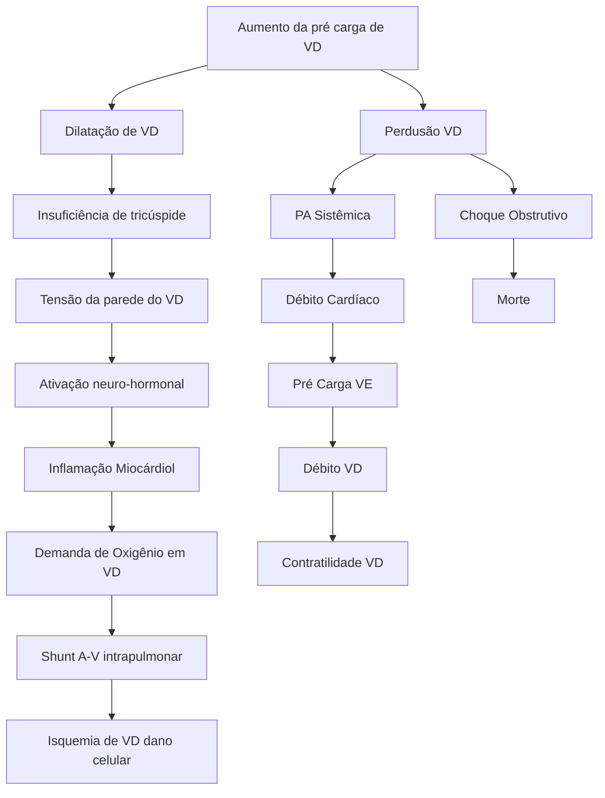
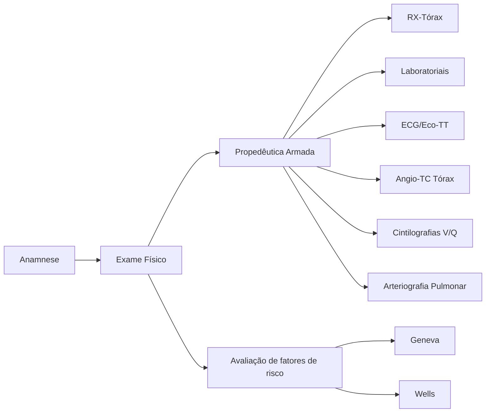
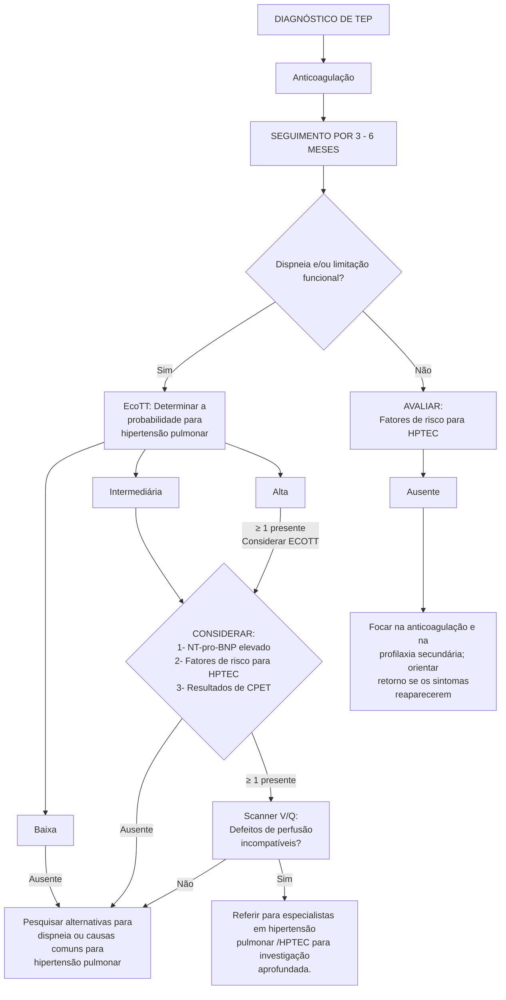

# TROMBOEMBOLISMO PULMONAR

**Estratificação de Risco (CHECAR ESCORES DE RISCO)**
- Pré-diagnóstico: Wells ou Genebra
- Pós-diagnóstico:
- PESI ou s-PESI
- Mortalidade precoce - Avaliar risco com base na avaliação clínica, exames complementares e status hemodinâmico

**Diagnóstico:**
- Dímero-D: Alto valor preditivo negativo / Atenção: neoplasias, doenças infecciosas, doenças inflamatórias
- Lembrete: AJUSTAR PARA IDADE
- Angiotomografia de tórax: alta sensibilidade; método de escolha

- Cintilografia ventilação/perfusão: método alternativo em pacientes jovens, alérgicos a iodo, gestantes; insuficiência renal
- Ecocardiograma transtorácico: útil em pacientes especialmente para estratificação de risco

**Tratamento:**
- Anticoagulação plena: Enoxaparina / Fondaparinux / Heparina / Cumarínicos / NoACS
- Terapia de Reperfusão: melhores resultados em até 48 horas do evento (útil em até 14 dias)
- Atentar para as contraindicações para terapia de reperfusão.

## 1. INTRODUÇÃO

- Definição: impactação de um trombo na artéria pulmonar
- Quadro pode ser de evolução aguda ou crônica.
  - Em geral, é diferenciado pelo tempo de anticoagulação (necessidade de pelo menos 6 meses de anticoagulação para ser considerado.

## 2. EPIDEMIOLOGIA

- TEV (tromboembolismo venoso) constitui a 3ª causa de morte cardiovascular mais comum encontrada na prática clínica;

- 1ª infarto do miocárdio; 2ª AVE´s.

Incidência anual estimada:
- TEP: 39-115/100.000 habitantes (mortalidade nos EUA é de aproximadamente 300.000/ano);
- TVP: 53-162/100.000 habitantes.
  - 8x maior em indivíduos acima de 80 anos de idade.
- Impacto econômico varia em cerca de UE € 8,5 bilhões/ano;
- Imagem abaixo: dados retirados do DATASUS.

## 3. FATORES DE RISCO

**Tabela 1 Fatores de risco**

| Risco Alto (Odds-ratio > 10)                                                                 |
| -------------------------------------------------------------------------------------------- |
| Fratura de membro inferior                                                                   |
| Hospitalização por insuficiência cardíaca ou fibrilação/flutter atrial (nos últimos 3 meses) |
| Prótese de joelho ou quadril                                                                 |
| Politrauma                                                                                   |
| Infarto do miocárdio (nos últimos 3 meses)                                                   |
| Episódio prévio de tromboembolismo venoso                                                    |
| Lesão de medula espinhal                                                                     |

PNEUMOLOGIA

**Tabela 2 Fatores de risco**

| Risco Moderado (Odds-ratio 2-9)   | Risco Moderado (Odds-ratio 2-9)                 | Risco Moderado (Odds-ratio 2-9)                   |
| --------------------------------- | ----------------------------------------------- | ------------------------------------------------- |
| Cirurgia de joelho (artroscopia)  | Insuficiência respiratória                      | Doença inflamatória intestinal                    |
| Doenças autoimunes                | Agentes estimulantes da eritropoiese            | Neoplasias (> doença metastática)                 |
| Transfusão de hemocomponentes     | Terapia de reposição hormonal (em alguns casos) | AVC isquêmico ou hemorrágico com sequelas motoras |
| Acesso venoso central             | Fertilização in vitro                           | Trombose de veias superficiais                    |
| Cateter e eletrodos intravenosos  | Terapia contraceptiva oral                      | Trombofilia                                       |
| Quimioterapia                     | Pós-parto                                       |                                                   |
| Insuficiência cardíaca congestiva | Quadros infecciosos (PNM, ITU, HIV)             |                                                   |

**Tabela 3 Fatores de risco**

| Risco Baixo (Odds-ratio < 2)                                                              |
| ----------------------------------------------------------------------------------------- |
| Repouso por mais de 3 dias                                                                |
| Diabetes mellitus                                                                         |
| Hipertensão arterial sistêmica                                                            |
| Imobilidade devido a estar sentado (p. ex.. viagem de carro prolongada ou viagens aéreas) |
| Envelhecimento                                                                            |
| Cirurgias videolaparoscópicas (p. ex.: colecistectomia)                                   |
| Obesidade                                                                                 |
| Gravidez                                                                                  |
| Veias varicosas                                                                           |

## 4. FISIOPATOLOGIA

**Figura 1** "Espiral da morte" do TEP.

## 5. DIAGNÓSTICO

• Sinais e sintomas são inespecíficos;
• Comuns:
  • Dispneia;
  • Dor torácica;
  • Pré-síncope;
  • Síncope;
  • Hemoptise.

Raros:
• Instabilidade hemodinâmica.
  • Em geral, associada à síncope e disfunção de ventrículo direito.
• Assintomáticos: diagnóstico incidental/exames de rotina.

TROMBOEMBOLISMO PULMONAR

**Figura 2** Fluxograma diagnóstico de TEP

## 6. ESTRATIFICAÇÃO DE RISCO – PRÉ-TESTE

**Tabela 4** Escore de Geneva

| Itens                                     | Decisão Clínica – Pontuação
Versão Original | Decisão Clínica – Pontuação
Versão Simplificada |
| ----------------------------------------- | ----------------------------------------------- | --------------------------------------------------- |
| TEP ou TVP prévios                        | 3                                               | 1                                                   |
| Frequência cardíaca                       | --------------                                  | --------------                                      |
| 75 – 94 bpm                               | 3                                               | 1                                                   |
| > 94 bpm                                  | 5                                               | 2                                                   |
| Cirurgia ou fratura no último mês         | 2                                               | 1                                                   |
| Hemoptise                                 | 2                                               | 1                                                   |
| Neoplasia ativa                           | 2                                               | 1                                                   |
| Dor unilateral em membro inferior         | 3                                               | 1                                                   |
| Dor à palpação profunda/edema assimétrico | 4                                               | 1                                                   |
| Idade > 65 anos                           | 1                                               | 1                                                   |

PNEUMOLOGIA

**Tabela 4** Escore de Geneva (continuação)

| Probabilidade Clínica | Probabilidade Clínica | Probabilidade Clínica |
| --------------------- | --------------------- | --------------------- |
| Três níveis           |                       |                       |
| Baixo                 | 0 – 3                 | 0 – 1                 |
| Intermediário         | 4 – 10                | 2 – 4                 |
| Alto                  | ≥ 11                  | ≥ 5                   |
| Dois níveis           |                       |                       |
| TEP improvável        | 0 – 5                 | 0 – 2                 |
| TEP provável          | ≥ 6                   | ≥ 3                   |

**Tabela 5** Escore de Wells:

| Itens                                             | Decisão Clínica – Pontuação
Versão Original | Decisão Clínica – Pontuação
Versão Simplificada |
| ------------------------------------------------- | ----------------------------------------------- | --------------------------------------------------- |
| TEP ou TVP prévios                                | 1,5                                             | 1                                                   |
| Frequência cardíaca > 100 bpm                     | 1,5                                             | 1                                                   |
| Cirurgia ou imobilização nas últimas 4 semanas    | 1,5                                             | 1                                                   |
| Hemoptise                                         | 1                                               | 1                                                   |
| Neoplasia ativa                                   | 1                                               | 1                                                   |
| Sinais clínicos de TVP                            | 3                                               | 1                                                   |
| Diagnóstico alternativo menos provável do que TEP | 3                                               | 1                                                   |

**Tabela 5** Escore de Wells: (continuação)

| Probabilidade Clínica | Probabilidade Clínica | Probabilidade Clínica |
| --------------------- | --------------------- | --------------------- |
| Três níveis           |                       |                       |
| Baixo                 | 0-1                   | N/D                   |
| Intermediário         | 2-6                   | N/D                   |
| Alto                  | ≥ 7                   |                       |
| Dois níveis           |                       |                       |
| TEP improvável        | 0-4                   | 0-1                   |
| TEP provável          | ≥ 5                   | ≥ 2                   |

TROMBOEMBOLISMO PULMONAR

# 7. MÉTODOS DIAGNÓSTICOS

• Achados mais comuns:
  • Corcova de Hampton: sugestivo para infarto pulmonar, apresentando-se com área em cunha na radiografia;
  • Sinal de Westermark: denota oligoemia ao exame de imagem (pela diferença da trama vascular entre os hemitórax);
  • Sinal de Fleischner: dilatação do tronco da artéria pulmonar.
• Tais achados não traduzem sinais específicos para o diagnóstico;
• Permite excluir outras causas para dor torácica e dispneia.

Eletrocardiograma;
• Casos mais graves:
  • Sinal de sobrecarga de VD;
  • Inversão de onda T nas derivações de V1-V4;
  • Padrão QR em V1;
  • Bloqueio de ramo direito completo ou incompleto;
  • S1Q3T3.

**Figura 3** ECG demonstrando padrão S1Q3T3

• Casos mais leves:
  • Taquicardia sinusal: presente em até 40% dos casos.

**ATENÇÃO!** Pacientes com taquiarritmia atrial apresentam maior chance de evoluírem com FA (fibrilação atrial).

Dímero-D:
• É um produto da degradação da fibrina;
• Apresenta:
  • Alto valor preditivo negativo (↑ VPN);
  • Baixo valor preditivo positivo (↓ VPP).
• É comumente elevado em pacientes com neoplasias, internados, com doenças inflamatórias ou infecciosas severas;

• Qual o cenário ideal?
  • Combinar o método com os fatores de risco (escores de probabilidade) - aumenta a sensibilidade em aproximadamente 30%.
• Ajuste por idade do índice de corte:
  • Padrão: 500 μg/L;
  • Especificidade do exame reduz com o avanço da idade do pacientes (> 80 anos – cerca de 10%);
  • Maior rendimento ao exame em idosos (taxa de exclusão (6,4% - 30%) em achados de falso-negativos.

**DD corrigido = idade x 10 μg/L (acima de 50 anos)**

Ajuste – probabilidade clínica (YEARS):
• Baixa probabilidade de TEP se: sem achados clínicos no escore de Wells + dímero-D < 1.000 μg/L. Um ou mais achados clínicos no escore de Wells + dímero-D < 500 μg/L;
• Algoritmo evitou a realização de angio-TC em 48% dos pacientes, quando comparado ao uso tradicional.

Angiotomografia de tórax:
• É o método de escolha em casos suspeitos;
• Sensibilidade = 83%; especificidade = 96%;
• Alto valor preditivo negativo (↑ VPN) em pacientes com baixo/intermediário risco para TEP.

**Figura 4** AngioTC de tórax demonstrando falha de enchimento em ramo pulmonar esquerdo

Cintilografia V/Q:
• Dá-se pela combinação perfusão com ventilação → aumenta a especificidade do exame;
• Perfil dos pacientes:
  • Baixo risco com radiografia de tórax sem alterações;
  • Pacientes jovens;
  • Gestantes;
  • Alergia ao contraste iodado;
  • Presença de insuficiência renal.

PNEUMOLOGIA

**LIMITAÇÃO! Trombos periféricos.**
• Planar X SPECT;
• Arteriografia pulmonar:
  • Antigamente era tida como padrão-ouro;
  • Risco de mortalidade de 0,5% em virtude do comprometimento hemodinâmico e respiratório;
  • Alta quantidade de contraste endovenoso, risco de complicações não fatais maiores (1%) e menores (5%).

Ecocardiografia:
• Valor preditivo negativo oscila entre 40 - 50%;

• Observa-se dilatação das câmaras direitas – ocorre em > 25% dos pacientes com TEP.
• Parâmetros que podem ser avaliados:
  • Diâmetro de VD;
  • Incursão do VD;
  • Distensão da veia cava inferior;
  • TAPSE: contratura do VD.

## 8. ESTRATIFICAÇÃO DE RISCO – MORTALIDADE PRECOCE

**Tabela 6** Estratificação de risco 1

| Parâmetros                        | Versão Original | Versão Simplificada       |
| --------------------------------- | --------------- | ------------------------- |
| Idade                             | Idade em anos   | 1 ponto (idade > 80 anos) |
| Sexo masculino                    | 10 pontos       | –                         |
| Neoplasia                         | 30 pontos       | 1 ponto                   |
| Insuficiência cardíaca crônica    | 10 pontos       | 1 ponto                   |
| Doença pulmonar crônica           | 10 pontos       |                           |
| Freq. cardíaca > 110 bpm          | 20 pontos       | 1 ponto                   |
| PAS < 100 mmHg                    | 30 pontos       | 1 ponto                   |
| Freq. respiratória > 30 irpm      | 20 pontos       | –                         |
| Temperatura < 36ºC                | 20 pontos       | –                         |
| Alteração do nível de consciência | 60 pontos       | –                         |
| Saturação O2                      | 20 pontos       | 1 ponto                   |

**Tabela 7** Estratificação de risco 2

| Estratificação de Risco
Versão Original                                                                                                                                                                                                      | Estratificação de Risco
Versão Simplificada              |
| ------------------------------------------------------------------------------------------------------------------------------------------------------------------------------------------------------------------------------------------------ | ------------------------------------------------------------ |
| Classe I: ≤ 65 pontos
\[0-1,6%]
(risco muito baixo de mortalidade)
Classe II: 66- 85 pontos
\[1,7-3,5%]
(baixo risco de mortalidade)                                                                                         | 0 pontos
(mortalidade em 30 dias - 1,0%)                 |
| Classe III: 86 – 105 pontos
\[3,2 -7,1%]
(moderado risco de mortalidade)
Classe IV: 106-125 pontos
\[4,0-11,4%]
(alto risco de mortalidade)
Classe V: > 125 pontos
\[10-24,5%]
(muito alto risco de mortalidade) | ≥ 1 ponto
\[0-1,6%]
(mortalidade em 30 dias - 10,9%) |

TROMBOEMBOLISMO PULMONAR

**Tabela 8 Estratificação de risco 3**

| Risco de mortalidade precoce | Risco de mortalidade precoce | Indicadores de risco
Instabilidade hemodinâmica | Indicadores de risco
Parâmetros clínicos de TEP | Indicadores de risco
Disfunção de VD em ECOTT ou AngioTC de tórax | Indicadores de risco
Níveis aumentados de troponina ou BNP |
| ---------------------------- | ---------------------------- | --------------------------------------------------- | --------------------------------------------------- | --------------------------------------------------------------------- | -------------------------------------------------------------- |
| Alto                         |                              | +                                                   | (+)                                                 | +                                                                     | (+)                                                            |
| Intermediário                | Intermediário-alto           | -                                                   | +                                                   | +                                                                     | +                                                              |
|                              | Intermediário.               | -                                                   | -                                                   | Um (ou nenhum) positivo                                               |                                                                |
| Baixo                        |                              | -                                                   | -                                                   | -                                                                     | Avaliação opcional; se avaliado, negativo                      |

## 9. TRATAMENTO

**Suporte ventilatório;**
- Suplementação de O2;
- Ventilação mecânica, conforme necessário.

**Suporte circulatório;**
- Reposição volêmica;
- Noradrenalina;
- Dobutamina;
- ECMO.

**Anticoagulação: manter por um período de 3-6 meses;**
- Início breve:
  - Indicado em pacientes com probabilidade pré-teste intermediária ou alta;
  - Opções: heparina não fracionada, heparina de baixo peso molecular, fondaparinux.

- Antagonistas da vitamina K:
  - Devem ser iniciados e mantidos por, no mínimo, 5 dias ou até atingir INR alto (48h) com anticoagulação parenteral. Caso contrário, há aumento no risco de eventos trombogênicos;
  - Dose inicial: 10 mg para pacientes < 60 anos; 5 mg para pacientes > 60 anos (visto o maior risco de sangramentos).

- DOACs:
  - Atuam por inibição direta da trombina (dabigatrana) ou Fator-Xa (apixabana, edoxabana e rivaroxabana).

**Terapia de reperfusão:**
- Maiores benefícios com janela de até 48 horas: utilidade se estende por até 14 dias;
- Critérios de insucesso: instabilidade clínica; disfunção de VD após 36 horas;

- Não é recomendada em pacientes com risco intermediário/alto, sem instabilidade hemodinâmica pelo risco de sangramento do SNC;
- Drogas: alteplase e estreptoquinase; tenecteplase não aprovada para uso em TEP;
- Tratamento dirigido: caráter percutâneo;
- Embolectomia cirúrgica;
- Contraindicações absolutas:
  - Sangramento ativo não menstrual;
  - Plaquetas < 100.000, RNI > 1,7, TTPA > 40 segundos;
  - Hemorragia intracraniana no passado, neoplasia maligna do SNC, lesão vascular estrutural do SNC, AVE isquêmico há menos de 3 meses, TCE há menos de 3 meses, trauma de face há menos de 3 meses;
  - Cirurgia há menos de 3 meses;
  - Suspeita de dissecção aguda de aorta.

- Contraindicações relativas:
  - AVE isquêmico há mais de 3 meses;
  - RCP traumática ou com duração maior de 10 minutos;
  - Gestação ou pós-parto há menos de 7 dias;
  - Cirurgia de grande porte há menos de 3 semanas;
  - Sangramento "interno" há menos de 2-4 semanas;
  - Sítios de punção não compressíveis – procedimento invasivo recente;
  - Doença ulcerosa péptica ativa;
  - Uso de varfarina com RNI > 1,7 ou uso de anticoagulação oral;
  - Idade > 75 anos;
  - Derrame pericárdico, endocardite infecciosa;
  - Retinopatia diabética.

PNEUMOLOGIA

**Tabela 9 DOACs**

| Características  | Apixabana                                                                                                      | Dabigatrana                                                                                                                            | Edoxabana                                                                                                                    | Rivaroxabana                                                                                                                                                  |
| ---------------- | -------------------------------------------------------------------------------------------------------------- | -------------------------------------------------------------------------------------------------------------------------------------- | ---------------------------------------------------------------------------------------------------------------------------- | ------------------------------------------------------------------------------------------------------------------------------------------------------------- |
| Alvo             | Fator-Xa                                                                                                       | Fator-IIa                                                                                                                              | Fator-Xa                                                                                                                     | Fator-Xa                                                                                                                                                      |
| Meia-Vida        | 8 – 14h                                                                                                        | 14 – 17h                                                                                                                               | 5 – 11h                                                                                                                      | 7 – 11h                                                                                                                                                       |
| Excreção Renal   | 27%                                                                                                            | 80%                                                                                                                                    | 50%                                                                                                                          | 33%                                                                                                                                                           |
| Contraindicações | ClCr < 15 mL/min
Insuficiência hepática grave (Child C) ou hepatopatia associada a distúrbio de coagulação | ClCr < 30 mL/min
Tratamento concomitante com inibidores da glicoproteína-P (IBPs, amiodarona...) em pacientes com ClCr < 50 ml/min | ClCr < 15 mL/min
Insuficiência hepática moderada/ grave (Child B e C) ou hepatopatia associada a distúrbio de coagulação | ClCr < 30 mL/min (FDA)
ClCr < 15 mL/min (EMA)
Insuficiência hepática moderada/ grave (Child B e C) ou hepatopatia associada a distúrbio de coagulação |

## 10. SINTOMAS PERSISTENTES

Dispneia persistente:
- Persistência do sintoma por período entre 6 meses e 3 anos, após o evento agudo;
- Fatores complicadores:
  - Idade avançada;
  - Comorbidades cardíacas ou pulmonares;
  - Obesidade;
  - Tabagismo;
  - Sinais de disfunção de VD ao diagnóstico.

Investigação da hipertensão pulmonar associada a tromboembolismo pulmonar crônico – HPTEC.
- Incidência gira em torno de 0,1-9,1%, nos 2 anos após o episódio agudo;
- Diagnóstico:
  - Presença de trombo após 6 meses de anticoagulação (tempo mínimo obrigatório);
  - Estratificação: ECOTT, Angio-TC, cintilografia V/Q, arteriografia pulmonar.

## 11. HPTEC

- Fatores de risco:

Tratamento:
- Preferencial - tromboendarterectomia;
  - Mortalidade aproximada: 4,7%.
- Angioplastia pulmonar:
  - Técnica recente (últimos 10 anos);
  - Complicações: sangramento intrapulmonar; hemoptise; lesão de reperfusão.

- Farmacológico:
  - Indicado para pacientes não candidatos a cirurgia ou para angioplastia pulmonar;
  - Terapia: anticoagulantes, diuréticos e oxigênio (se necessário);
  - Riociguate: estimulador da guanilato ciclase solúvel;
  - Possibilidades: bosentana (antagonistas de endotelina).

**Tabela 10 Fatores de risco:**

| Achados relacionados ao TEP agudo (diagnóstico) | Doenças crônicas concomitantes; condições predisponentes de HPTEC (diagnóstico - 3 a 6 meses após) |
| ----------------------------------------------- | -------------------------------------------------------------------------------------------------- |
| Episódios prévios (TEP ou TVP)                  | Shunts ventrículo-atriais                                                                          |
| Trombo extenso em Angio-TC Tórax                | Cateteres ou marca-passo infectado                                                                 |
| Disfunção de VD ou sinal de HP - EcoTT          | SAAF/níveis elevados de Fator VIII                                                                 |
| Angio-TC Tórax - sinais sugestivos TEP crônico  | Hipotireoidismo (tratado)                                                                          |
|                                                 | Neoplasia                                                                                          |
|                                                 | Doenças mieloproliferativas                                                                        |
|                                                 | Doença inflamatória intestinal                                                                     |
|                                                 | Osteomielite crônica                                                                               |

TROMBOEMBOLISMO PULMONAR

**Figura 5** Fluxograma de manejo do TEP

# REFERÊNCIAS

**Figura 1** "Espiral da morte" do TEP.

Arquivo pessoal

**Figura 2** Fluxograma diagnóstico de TEP

Arquivo pessoal

**Figura 3** ECG demonstrando padrão S1Q3T3P

Arquivo pessoal

**Figura 4** AngioTC de tórax demonstrando falha de enchimento em ramo pulmonar esquerdo

Arquivo pessoal
