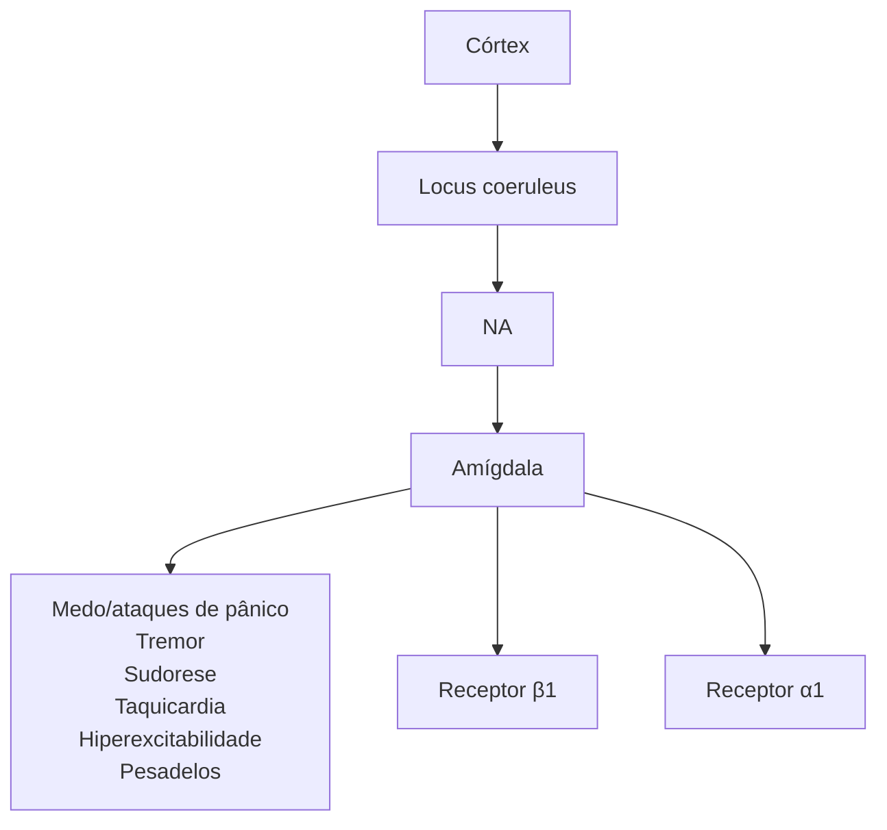

# TRANSTORNO DE ANSIEDADE

• **Transtorno do Pânico**: o indivíduo experimenta ataques de pânico inesperados (sem um fator desencadeante e começam abruptamente) recorrentes e está persistentemente apreensivo ou preocupado com a possibilidade de sofrer novos ataques de pânico

• **Transtorno de Ansiedade Social (fobia social)**: aqui o indivíduo é temeroso, ansioso ou se esquiva de interações e situações sociais que envolvem a possibilidade de ser avaliado.

• **Tratamento da Fobia Específica** não inclui psicofármacos.

## 1. INTRODUÇÃO

### 1.1 O que mais cai nas provas?

• Diagnóstico diferencial dos Transtornos de Ansiedade;
• Transtorno do Pânico;
• Fármacos ansiolíticos.

### 1.2 Medo:

• resposta emocional adaptativa aguda a situações adversas de forma fisiológica, não necessariamente patológica.
• Componente da reação de "luta ou fuga"
• Excitabilidade autonômica aumentada

### 1.3 Respostas autonômicas ao Medo

• Os reguladores neurobiológicos da amígdala são GABA, serotonina, noradrenalina e canais de cálcio regulados por voltagem.
• Medo: Circuito centrado na amígdala.
• Preocupação: Circuito córtico-estriado-talamocortical.

• Respostas autonômicas ao medo: envolve o sistema nervoso autônomo simpático (resposta de "luta e fuga"). Mediado pela noradrenalina/ adrenalina.
• A amígdala faz conexão com o locus coeruleus (região do tronco encefálico onde estão os neurônios noradrenérgicos). A ativação do locus coeruleus pela amígdala leva a uma descarga noradrenérgica = resposta do sistema nervoso simpático: medo/ ataques de pânico; tremor; sudorese; taquicardia; hiperexcitabilidade; pesadelos.
• A hiperativação do sistema nervoso simpático gera: ↑aterosclerose; ↑isquemia cardíaca; ↑ PA; ↓ variabilidade da FC; ↑ IM; morte súbita.
• Resposta endócrina ao medo: a amígdala também tem conexões com o hipotálamo, que, por sua vez, se conecta à hipófise, levando ao estímulo da glândula adrenal e suprarrenal e a um aumento do cortisol sérico. O aumento crônico do cortisol gera alterações metabólicas danosas ao organismo.

**Hiperatividade noradrenérgica na ansiedade, no medo e na hiperexcitabilidade autonômica**

## 1.4 Ataque de Pânico

• Tipo particular de resposta ao medo
• Ataques abruptos de medo intenso ou desconforto intenso
• Pico alcançado em poucos minutos
• **Sintomas físicos e/ou cognitivos → descarga adrenérgica**
  • Palpitações, coração acelerado, taquicardia
  • Sudorese, tremores ou abalos
  • Sensação de falta de ar ou sufocamento/ sensação de asfixia/ dor ou desconforto torácico
  • Náusea ou desconforto abdominal
  • Sensação de tontura, vertigem instabilidade ou desmaio

• Calafrios ou onda de calor, parestesias
• Desrealização ou despersonalização
• Medo de perder o controle ou enlouquecer, medo de morrer
• Não se limitam aos transtornos de ansiedade → pode acontecer em outras situações

## 1.5 Fobia

• Medo patológico é **desproporcional** ("desadaptativa")

## 1.6 Ansiedade

• Antecipação da ameaça futura (medo antecipatório)
• Tensão muscular e vigilância
• Comportamento de cautela/esquiva

# 2. SÍNDROMES ANSIOSAS

**Medo**
• Pânico
• Fobia

**Preocupação**
• Sofrimento
• Expectativa apreensiva
• Obsessões

**Desregulação da ação de alerta**
• Taquicardia
• dispneia
• Dor torácica
• Despersonalização

**Pensamentos e sentimentos**
• Algo está errado com meu corpo
• Preocupo-me com tudo
• Estou fora de controle

**Sintomas Físicos**
• Tensão muscular
• Respiração curta
• Palpitação
• Dor no peito
• Tontura
• Suor

**Comportamentos**
• Hipervigilância
• Evitação dos lugares e pessoas
• Limitação da vida e das relações

## 2.1 ANSIEDADE ADAPTATIVA x TRANSTORNO DE ANSIEDADE

• **Ansiedade:** é uma emoção normal em circunstâncias de ameaça. É parte da reação evolutiva de "luta ou fuga" para a sobrevivência.

• **Ansiedade não–adaptativa (Transtorno):** preocupação, sentimento de apreensão ou medo desproporcional às vivências do indivíduo.

## 2.2 Síndromes ansiosas de base orgânica / outra condição médica

| Condição médica:                                                                                                                    |
| ----------------------------------------------------------------------------------------------------------------------------------- |
| **Cardiovascular**: síndromes coronarianas agudas, insuficiência cardíaca, arritmias.                                               |
| **Pulmonar**: asma, doença pulmonar obstrutiva crônica.                                                                             |
| **Endócrina**: disfunção tireoidiana, hiperparatireoidismo, hipoglicemia, menopausa, doença de Cushing, insulinoma, feocromocitoma. |
| **Hematológica**: anemia.                                                                                                           |
| **Neurológica**: epilepsia, encefalopatia, tremor essencial.                                                                        |
| **Abuso e dependência de substâncias.**                                                                                             |

## 2.3 Síndromes Ansiosas por Fármacos / Substâncias

• Corticoides;
• Simpaticomiméticos: efedrina, adrenalina, pseudoefedrina;
• Tiroxinas;
• Antidepressivos (ISRS, ADT)* em fases iniciais;
• Estimulantes: cafeína, anfetamina, aminofilina, cocaína, teofilina, metilfenidato;
• Descontinuação de barbitúricos, benzodiazepínicos, narcóticos, álcool e sedativos (abstinência);
• Broncodilatadores;
• Dopaminérgicos: amantadina, bromocriptina, levodopa, metoclopramida, antipsicóticos;
• Insulina (associada à hipoglicemia).

TRANSTORNO DE ANSIEDADE

## 2.6 Transtorno de ansiedade social – Fobia social:

• Indivíduo é temeroso, ansioso ou se esquiva de interações e situações sociais que envolvem a possibilidade de ser avaliado.

• Estão incluídas situações sociais como encontrar-se com pessoas que não são familiares, situações em que o indivíduo pode ser observado comendo ou bebendo e situações de desempenho diante de outras pessoas.

• A ideação cognitiva associada é a de ser avaliado negativamente pelos demais, ficar embaraçado, ser humilhado ou rejeitado ou ofender os outros

• O medo ou ansiedade é desproporcional à ameaça real apresentada pela situação social e o contexto sociocultural.

## 2.7 Agorafobia

• Aqui os indivíduos são apreensivos e ansiosos acerca de duas ou mais das seguintes situações:
  • Usar transporte público;
  • Estar em espaços abertos;
  • Estar em lugares fechados;
  • Ficar em uma fila ou estar no meio de uma multidão;
  • Estar fora de casa sozinho em outras situações.

• O indivíduo teme essas situações devido aos pensamentos de que pode ser difícil escapar ou de que pode não haver auxílio disponível caso desenvolva sintomas do tipo pânico ou outros sintomas incapacitantes ou constrangedores.

• Essas situações quase sempre induzem medo ou ansiedade, e com frequência são evitadas ou requerem a presença de um acompanhante.

• O medo ou ansiedade é desproporcional ao perigo real apresentado pelas situações agorafóbicas e ao contexto sociocultural.

## 2.8 Fobia específica

• Aqui os indivíduos são apreensivos, ansiosos ou se esquivam de objetos ou situações circunscritos.

• Medo, ansiedade ou esquiva é quase sempre imediatamente induzido pela situação fóbica, até um ponto em que é persistente e fora de proporção em relação ao risco real que se apresenta.

• Existem vários tipos de fobias específicas:
  • Animais,
  • Ambiente natural,
  • Sangue-injeção-ferimentos,
  • Situacional
  • Outros.

• O medo ou ansiedade é desproporcional em relação ao perigo real imposto pelo objeto ou situação específica e ao contexto sociocultural.

• O tratamento farmacológico aqui **NÃO** é eficaz.

• **Terapia comportamental** baseada na exposição e na dessensibilização sistemática.

## 2.9 TEPT: transtorno de estresse pós-traumático

• TEPT: história de trauma + revivescência + evitação + sintomas de medo/ansiedade/ depressão;

• Duração de pelo menos 1 mês

• Consequência psicopatológica mais prevalente após a exposição (vivenciado, testemunhado, conhecimento de evento com familiar ou amigo próximo) a algum evento traumático (episódio concreto ou ameaça de morte, lesão grave ou violência sexual).

• TEPT difere de transtornos relacionados ao estresse:
  • **Transtorno de adaptação** → sofrimento similar, porém o estímulo não é uma situação estressora tão traumática → a diferença está no trauma (ex. doença ou incapacidade física, problemas financeiros e profissionais, separação ou mudança de emprego, escola ou cidade). Os sintomas ocorrem dentro de três meses do início do estressor ou estressores. Os sintomas não representam luto normal.

  • **Transtorno de estresse agudo** (sintomas semelhantes ao TEPT . Diferença está na duração: de 3 dias até 1 mês após o evento) → diferença apenas temporal.

## 2.10 Transtorno Obsessivo Compulsivo (TOC):

O TOC é caracterizado pela presença de obsessões e/ou compulsões.

| **Obsessões**                             | Pensamentos, imagens ou impulsos recorrentes e persistentes que são vivenciados como intrusivos e indesejados        |
| ----------------------------------------- | -------------------------------------------------------------------------------------------------------------------- |
| **Compulsões**                            | Comportamentos repetitivos ou atos mentais que um indivíduo se sente compelido a executar em resposta a uma obsessão |
| **Relação entre obsessões e compulsões.** | Compulsões "em resposta" a obsessões.                                                                                |

TRANSTORNO DE ANSIEDADE                                                                                          835

| Dimensões                           | Obsessões                                                                                                                                                                                                        | Compulsões                                                                                                                                                                                                                                                                                                                                                                            |
| ----------------------------------- | ---------------------------------------------------------------------------------------------------------------------------------------------------------------------------------------------------------------- | ------------------------------------------------------------------------------------------------------------------------------------------------------------------------------------------------------------------------------------------------------------------------------------------------------------------------------------------------------------------------------------- |
| Contaminação e limpeza              | Contaminar-se com micróbios/germes ao tocar determinada superfície; nojo ao menor contato com secreções, próprias ou de outros (urina, fezes, suor, cabelos, sêmen etc.).                                        | Banhos e lavagens das mãos repetitivos e prolongados; limpeza excessiva de objetos ou cômodos.                                                                                                                                                                                                                                                                                        |
| Ordem, simetria, contagem e arranjo | Sensação inquietante de que objetos não estão organizados corretamente, ou não estão simétricos ou na quantidade certa; impressão de que objetos, palavras, ou pensamentos não estão como deveriam estar ou ser. | Necessidade de arranjar de forma simétrica, ou outro jeito supostamente "certo", roupas, livros, móveis, etc.; reler ou reescrever algo durante horas, até que esteja "perfeito"; repetir atividades corriqueiras, como entrar e sair de cômodos, passar a mão no cabelo, ou olhar em determinada direção, até que tenha sido feita a quantidade certa de vezes, ou do jeito "certo". |

• Pessoas com TOC, de maneira geral, apresentam boa crítica (insight) do seu estado mórbido
• Outros transtornos relacionados ao TOC:
  • **Transtorno Dismórfico Corporal:** preocupação com defeitos na aparência e falhas leves ou imperceptíveis aos outros, com comportamentos ou atos mentais repetitivos em resposta.

• **Transtorno de Acumulação:** dificuldade persistente de se desfazer de objetos; a acumulação congestiona e compromete o uso dos cômodos.
• **Tricotilomania:** arrancar cabelos de forma recorrente, com dificuldade em reduzir ou cessar o comportamento.
• **Transtorno de Escoriação (skin-picking):** ferir a pele de forma recorrente, com dificuldade em reduzir ou cessar o comportamento.

## 3. TRATAMENTO - TRANSTORNOS ANSIOSOS

### 3.1 Psicoterapia
• TCC (maior evidência);
• POA (psicoterapia de orientação analítica) / Psicodinâmica;
• Mindfulness

### 3.2 Ansiolíticos
• Inibidores seletivos da recaptação de serotonina (ISRS): primeira escolha no tratamento de qualquer um dos transtornos de ansiedade. Fluoxetina (mais estimulante e mais ativador), Sertralina, Citalopram, Escitalopram (mais seguro em termos de eventos adversos), Paroxetina (não é uma boa indicação para idosos e gestantes), Fluvoxamina.
• Inibidores da recaptação de serotonina e norepinefrina (IRSN): Venlafaxina, Desvenlafaxina, Duloxetina.
• Antidepressivos Tricíclicos (ADT)
• Benzodiazepínicos (BZD): úteis nas reações agudas.
• Betabloqueador (propranolol): útil na situação previsível de transtorno de ansiedade social, fazendo uso antes do evento.
• Anticonvulsivantes

O ideal é o tratamento combinado (psicofármaco + psicoterapia), exceto no caso da fobia específica (apenas psicoterapia).

### 3.3 BENZODIAZEPÍNICOS
• Ansiolíticos ou sedativo-hipnóticos (droga depressora).
• O parâmetro para a escolha do BZD é baseado na meia vida de eliminação.
  • Curta (<5hs): midazolam, alprazolam.
  • Intermediária (5-24 hs): lorazepam (escolha para hepatopatas), bromazepam.
  • Longa (>24hs): clonazepam, diazepam.
• Uso como adjuvante de forma temporária para casos específicos, como insônia, agitação e ataque de pânico.
• Indicações de benzodiazepínicos na agitação psicomotora são: Síndrome de abstinência alcoólica com ou sem delirium tremens (principal); Intoxicação por estimulantes (como a cocaína).
• NÃO USAR BZD:
  • De forma isolada para o tratamento dos transtornos de ansiedade;
  • Por tempo indeterminado;
  • Após um trauma agudo;
  • **Na abordagem do delirium em idosos;**
  • **Na intoxicação por etanol.**
• Risco de dependência, tolerância, prejuízo do desempenho neuropsicomotor e cognitivo a longo prazo, amnésia e sintomas de abstinência.
• Retirada: evitar de forma abrupta / fazer de forma gradativa.
  • Exemplo: retirar 1/4 da dose a cada 2 semanas.

**OBS: Drogas Z são hipnóticos não BZD (ex. Zolpidem). Não confundir com BZD.**
