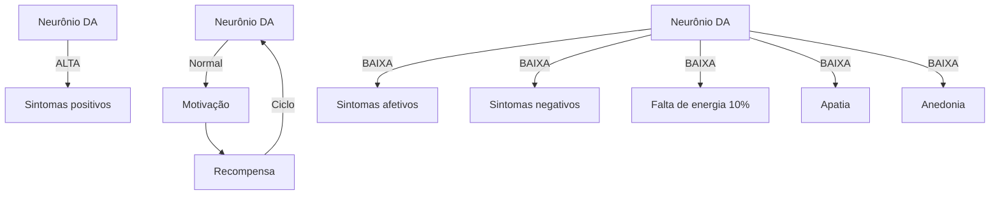
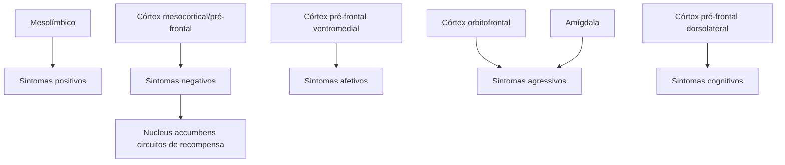
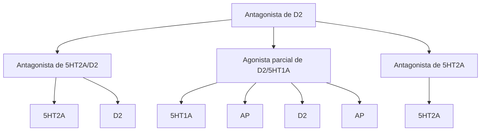

# TRANSTORNO PSICÓTICO

• Síndrome Psicótica: delírios (geralmente autorreferentes e persecutórios), alucinações (geralmente auditivas), pensamento desorganizado, comportamento desorganizado.
• Esquizofrenia: delírios, alucinações, discurso desorganizado e comportamento grosseiramente desorganizado ou catatônico. Esses sintomas e sinais contínuos de perturbação persistem durante, pelo menos, seis meses.
  • Duração até 01 mês (transtorno psicótico breve);
  • De 01 a 06 meses (transtorno esquizofreniforme)
• Antipsicóticos e Sintomas Extrapiramidais: típicos ou de primeira geração causam mais.
  • Distonia aguda, discinesia tardia, parkinsionismo e acatisia
• Antipsicóticos e Síndrome Metabólica: maior risco com os atípicos ou de segunda geração
• Clozapina: risco de agranulocitose

## 1. INFORMAÇÕES GERAIS

• **Psicose**: perda de contato com a realidade e/ou distorções muito marcantes na percepção e na relação com a realidade.
  • Alucinações → principalmente auditivas;
  • Delírios → o mais comum é o persecutório, mas também temos o de grandeza, crenças fixas, etc;
  • Pensamento desorganizado;
  • Comportamento desorganizado.
  • Estes acima são considerados sintomas POSITIVOS. Também há os sintomas negativos.
  • Insight na psicose → muito prejudicado;
  • Quase sempre o estado do indivíduo é muito grave.

### 1.1 Transtornos neuropsiquiátricos em que poder haver psicose associada:

• Transtorno bipolar → mania;
• Depressão psicótica;
• Transtorno de uso de substâncias;
• Transtornos neurocognitivos – demências;
• Doença de Parkinson.

### 1.2 Transtornos em que a Psicose é característica definidora:

• **Transtorno psicótico induzido por substância / medicamentos**
  • Presença de delírios e/ou alucinações durante ou logo após a exposição/intoxicação ou abstinência de substância ou medicamento sabidamente capaz de produzir tais sintomas.
• **Transtorno esquizoafetivo**
  • Episódios de humor (maníaco ou depressivo) na maior parte da duração total da doença (fase ativa ou residual), com dois períodos distintos de apresentação: um com ocorrência simultânea de episódio de humor e de critérios completos para esquizofrenia, e outro de pelo menos duas semanas de delírios ou alucinações na ausência de episódio de humor (diagnóstico diferencial com TAB – mania com sintomas psicóticos).
• **Transtorno delirante**
  • Presença de delírios com duração de um mês ou mais, sem prejuízo significativo no funcionamento (exceto pelos impactos dos delírios) ou comportamento desorganizado.
• **Transtorno psicótico breve**
  • Critérios de sintomas semelhantes aos da esquizofrenia, porém, com menos de um mês de duração de sintomas e retorno completo ao nível de funcionamento anterior ao do transtorno.
• **Transtorno esquizofreniforme**
  • Mesmos critérios de sintomas da esquizofrenia, porém, com duração entre um e seis meses de sintomas sem exigência de declínio funcional
• **Esquizofrenia**
  • Delírios, alucinações, discurso desorganizado e comportamento grosseiramente desorganizado ou catatônico. Esses sintomas e sinais contínuos de perturbação persistem durante, pelo menos, seis meses, com pelo menos 1 mês de sintomas da fase ativa.

## 2. ESQUIZOFRENIA

• A esquizofrenia com seus sintomas é o protótipo do transtorno psicótico;

### 2.1 Sintomas

**Podem ser divididos em:**

• Positivos (necessário pelo menos um):
  • Delírios – autorreferentes e persecutórios são os mais frequentes;
  • Alucinações – auditivas são as mais comuns.

• Negativos (exemplos):
  • Apatia;
  • Anedonia;
  • Embotamento cognitivo;
  • Disforia neuroléptica.

## 3. NEUROBIOLOGIA DA PSICOSE

• **Existem 3 vias de neurotransmissores, com suas respectivas teorias ligadas à psicose:**
  • Teoria dopaminérgica: dopamina hiperativa nos receptores D2 na via mesolímbica.
  • Teoria glutamatérgica: hipofunção do receptor NMDA.
  • Teoria serotoninérgica: hiperfunção do receptor de 5TH2a no córtex.

### 3.1 Teoria dopaminérgica

• Excesso de dopamina na via mesolímbica: Sintomas positivos e domínio da desorganização.
• Deficiência de dopamina nas áreas do córtex pré frontal – via mesocortical: Sintomas Negativos, afetivos e cognitivos da esquizofrenia.

**Via dopaminérgica mesolímbica: POSITIVOS**

TRANSTORNO PSICÓTICO                                                                                                                                839

Via mesocortical: NEGATIVOS

Sintomas cognitivos

Sintomas negativos

Sintomas afetivos

## 3.2 Sintomas positivos

• Tudo que vem 'a mais': delírios, alucinações.
• Via Dopaminérgica Mesolímbica: origem dos sintomas positivos.

• Via de maior importância no contexto das síndromes psicóticas → Desorganização da Esquizofrenia.
• Excesso de dopamina na Via Mesolímbica acarreta sintomas positivos.

Sintomas positivos

Hipertividade mesolímbica = Sintomas positivos da esquizofrenia

![Diagram showing brain and mesolimbic hyperactivity leading to positive symptoms of schizophrenia, with branches showing: impulsividade (impulsivity), Agitação (agitation), Violência/agressão (violence/aggression), Hostilidade (hostility), and Sintomas positivos (positive symptoms)]

Hiperatividade mesolímbica= sintomas positivos da esquizofrenia

## 3.3 Sintomas negativos

Diminuição do que espera-se que um indivíduo tenha.

• 5 A's dos sintomas negativos:
  • Alogia;
  • Aparência descuidada;
  • Afeto embotado;
  • Avolição;
  • Associabilidade.

• Outros sintomas negativos:
  • Contato visual limitado;
  • Discurso desorganizado.
  • Comportamento grosseiramente desorganizado ou catatônico

![Six icons showing various negative symptoms: person with limited expression, group of people, person appearing distressed, person running away, two faces showing flat affect, and group of people in formal attire]

TRANSTORNO PSICÓTICO                                                                                841

## 3.4 Esquizofrenia

• Sintomas positivos: Excesso de funções normais
  • Delírios (autorreferentes e persecutórios são os mais comuns)
  • Alucinações (auditivas mais comuns)
  • Discurso desorganizado
  • Comportamento desorganizado
  • Comportamento catatônico
  • Agitação

• Por pelo menos 6 meses com pelo menos 1 mês de fase ativa de sintomas
• Sintomas estão relacionados a regiões cerebrais, e seus respectivos domínios, são:
  • Sintomas positivos → Via mesolímbica
  • Sintomas Negativos → Córtex mesocortical/ pré-frontal
  • Desorganização/sintomas agressivos → Amígdala

## 4. ANTIPSICÓTICOS

• Tratamento farmacológico: realizado à base de antipsicóticos.
• **Mecanismo clássico de ação:**

Via mesolímbica - Antagonista de D₂

Normal → Redução dos sintomas positivos

### **Ação dos antipsicóticos**

Existem dois tipos de antipsicóticos: típicos e atípicos.

**OBS.: A diferença entre as gerações dos antipsicóticos está no perfil de tolerabilidade (efeitos adversos) → possuem atividade antipsicótica semelhante.**

## 4.1 Antipsicóticos típicos – primeira geração

• Convencionais: são antagonistas totais dos receptores D2.
• Também chamados de Neurolépticos.
• O efeito sedativo é útil na condução da agitação psicomotora.

**Típicos de baixa potência;**

• Clorpromazina;
• Levomepromazina.

**Típicos de alta potência:**

• Haloperidol;
• Droperidol.

## 4.2 Antipsicóticos atípicos – segunda geração

• Apresentam diferentes perfis de ligação – antagonistas da serotonina (5HT2A);
• Desencadeia menos sintomas extrapiramidais;
• São mais associados ao ganho ponderal e alterações metabólicas;
• Demonstram uso em outros transtornos psiquiátricos;

**Representantes:**

• Risperidona;
• Paliperidona;
• Lurasidona;
• Ziprasidona;
• Quetiapina;
• Olanzapina;
• Clozapina → casos mais refratários;
• Aripiprazol;
• Brexipiprazol;
• Amisulprida;
• Cariprazina.

**Efeitos adversos:**

• Síndrome metabólica: Olanzapina; Clozapina – maior risco
• Agranulocitose: clozapina;
• Hiperprolactinemia: mais proeminente com risperidona e amissulprida.

## 4.3 Antipsicóticos e Distúrbios do movimento

• Via nigroestriatal é responsável pelo controle dos movimentos;
• O antagonismo D2 na via nigroestriatal corresponde à produção de movimentos anormais → *sintomas extrapiramidais*.

**Agudos**

• Distonia
• Parkisonismo induzido por fármacos
• Acatisia

**Via nigroestriatal -antagonista/ agonista parcial de D2**

|  | 
Distonia                                           |
| ------------------------------------------------------------------- | -------------------------------------------------------------------------------------------- |
| 
Normal                    | 
PIF - Parksonismo induzido por fármacos |
| 
BAIXA                        | 
Acatisia                                           |

• O antagonismo D2 crônico na via nigroestriatal gera manifestação de *discinesia tardia*.

| 
a | 
Discinesia tardia |
| --------------------------------------- | -------------------------------------------------------------------- |
| ↓
Tratamento crônico
↓          |                                                                      |
| 
b |                                                                      |

TRANSTORNO PSICÓTICO                                                                                              843

|                       | Apresentação                                                                                                                                                                                                                                                                   | Manejo\*                                                                                                                                                              |
| --------------------- | ------------------------------------------------------------------------------------------------------------------------------------------------------------------------------------------------------------------------------------------------------------------------------ | --------------------------------------------------------------------------------------------------------------------------------------------------------------------- |
| **Distonia aguda**    | • Espasmos musculares dolorosos em qualquer parte do corpo
• Desvio prolongado dos olhos para cima
• Contração involuntária do pescoço                                                                                                                                 | Anticolinérgicos:
• Biperideno 2-4 mg, VO
• Biperideno 1 ampola (5 mg), IM
• Prometazina 25-50 mg, VO (casos leves)                                       |
| **Parkinsonismo**     | • Tremor e/ou rigidez, lentificação, redução da mímica facial, salivação excessiva
• Pode ser confundido com depressão ou sintomas negativos                                                                                                                               | Uso de anticolinérgico (curto período), reavaliando a cada 3 meses:
• Biperideno 2-4 mg, VO                                                                       |
| **Acatisia**          | • Estado subjetivo de desconforto e inquietação, provocando forte desejo de movimentar-se
• Bater os pés no chão
• Cruzar e descruzar as pernas
• Balançar o corpo trocando o apoio dos pés no chão
• Andar inquietante
• Pode ser confundido com agitação | Benzodiazepínicos e Propranolol podem ser úteis:
• Clonazepam ou diazepam em doses baixas
• Propranolol 40-80 mg/dia, VO
• Anticolinérgicos não são úteis |
| **Discinesia tardia** | • Movimentos involuntários, geralmente início tardio e crônicos;
• pioram com estresse
• Movimentos mastigatórios
• Protrusão da língua
• Movimentos coreiformes                                                                                               | • Interromper anticolinérgico
• Manejo complexo, comumente realizado pelo especialista focal
• Metade dos casos é irreversível                                |

• **Efeitos adversos Antipsicóticos típicos:**
  • Hiperprolactinemia;
  • Galactorreia;
  • Amenorreia;
  • Piora dos sintomas atípicos;
  • Anticolinérgicos.

**OBS: Os antipsicóticos atípicos, embora de forma menos frequente, também podem causar os efeitos adversos logo acima.**

## 4.4 Síndrome Neuroléptica Maligna

Efeito adverso dos Antipsicóticos: emergência

**Antagonismo D2 excessivo:**

• No hipotálamo: distúrbios da regulação da temperatura corporal;
• Nos núcleos da base: rigidez muscular.

**Quadro:**

• Alteração do estado mental;
• Rigidez/hipertonia muscular;
• Febre/hipertermia;
• Disautonomia (taquicardia, hipotensão postural, taquipneia e arritmias);
• Diaforese (sudorese profusa é comum).
• Achados laboratoriais : elevação importante da CPK e leucocitose.

**Diagnóstico diferencial com síndrome serotoninérgica**

• História de uso de antidepressivos
• Mioclonias

**Síndrome M E R D A**

• Mente alterada
• Elevação de temperatura
• Rigidez muscular
• Disautonomia
• Antipsicóticos causam

**Conduta:**

• Suspender a droga causadora;
• Introdução de relaxante muscular Dantrolene, bromocriptina – agonista D2 da dopamina;
• Medidas de suporte → resfriamento;
• Fármacos: bromocriptina, amantadina, lorazepam.
