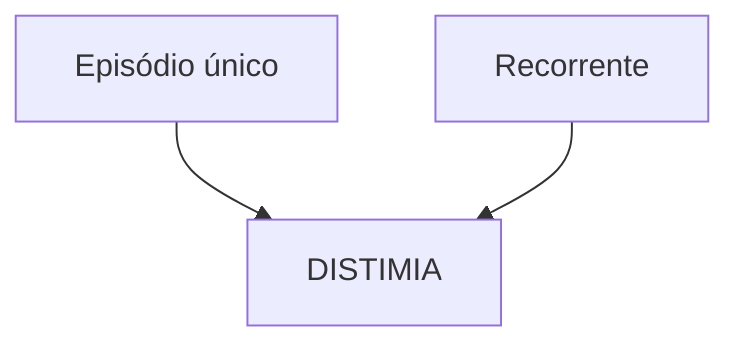
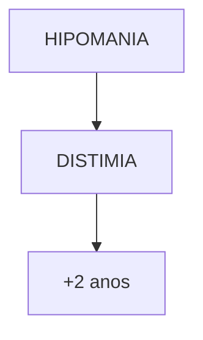
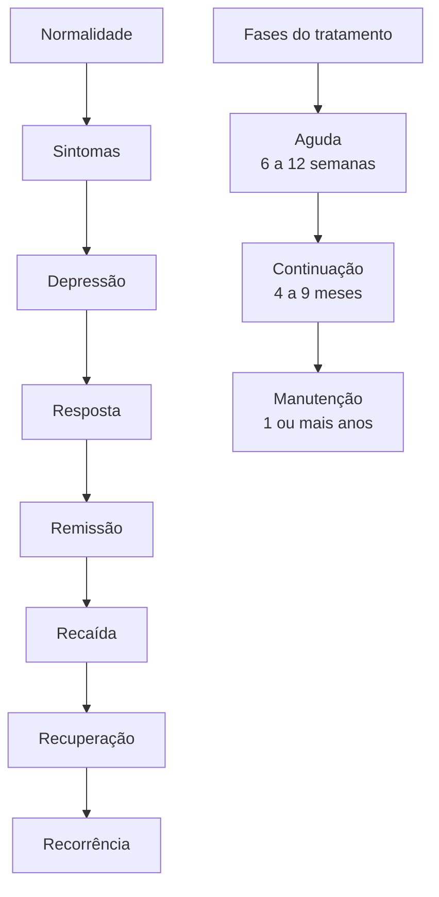
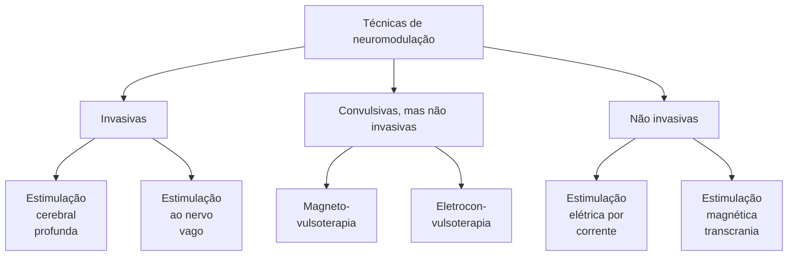
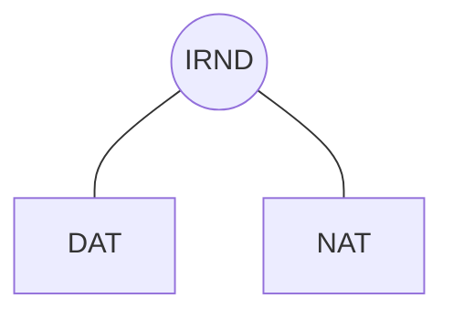
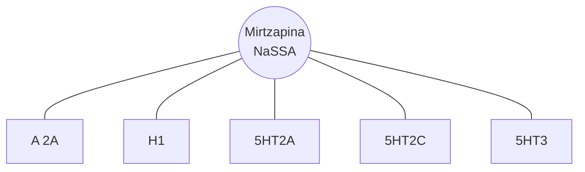
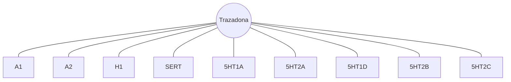

# TRANSTORNO DE HUMOR PARTE I

| **SÍNDROME DEPRESSIVA:**
• Sintomas de tristeza, desânimo ou perda de prazer, associados à diminuição de energia, cansaço, alterações de apetite, do sono e da libido, alterações psicomotoras (lentificação ou agitação), dificuldades de concentração, indecisão ou mudanças na capacidade de tomada de decisões e sintomas cognitivos e emocionais que incluem culpa, ideias de desvalia, e, por vezes, pensamentos de morte, ideação, planos e tentativas de suicídio |                                                                                                               |
| ----------------------------------------------------------------------------------------------------------------------------------------------------------------------------------------------------------------------------------------------------------------------------------------------------------------------------------------------------------------------------------------------------------------------------------------------------------------------------- | ------------------------------------------------------------------------------------------------------------- |
| **Transtorno Depressivo Maior (TDM):**
• Cinco ou mais sintomas presentes na maior parte do dia, quase todos os dias, por período mínimo de duas semanas
**Transtorno Depressivo Persistente (DISTIMIA):**
• Humor deprimido na maior parte do dia, na maioria dos dias, por período mínimo de dois anos..                                                                                                                                                        | **Tratamento:**
• MEV + psicoterapia (todos os casos) +/- Antidepressivos (depressões moderadas e graves) |

## 1. INTRODUÇÃO

### 1.1. SÍNDROMES PSICOPATOLÓGICAS

• Em cada síndrome, há sintomas nucleares e periféricos;
• Sugestão na avaliação de uma questão de residência:
  • Caracterização dos sinais e sintomas;
  • Ordenamento em síndromes clínicas;
  • Formulação de hipóteses diagnósticas relativas aos transtornos mentais específicos.
• Síndrome depressiva: transtorno depressivo / Transtorno Bipolar (TB);
• Síndrome ansiosa: TAS, Transtorno de Ansiedade Generalizada (TAG), TP;
• Síndrome maníaca ou hipomaníaca: TB;
• Síndrome psicótica: Esquizofrenia;

OBS: Importância de excluir uso de substâncias psicoativas e causas orgânicas (ex. função tireoidiana, infecções, hipovitaminoses).

## 2. TRANSTORNOS DO HUMOR

### 2.1 AFETIVIDADE

• Vida afetiva: dá cor, brilho e calor a todas as vivências humanas;
• Afetividade → várias modalidades de vivência afetiva: humor, emoções, sentimentos, paixão;
• Afeto: qualquer estado de uma vivência afetiva; expressão externa → Emoção + ideia .
• Emoções: reações afetivas momentâneas, agudas / estado afetivo intenso de curta duração, com forte efeito somático.
  • Tristeza;
  • Alegria;
  • Raiva;
  • Nojo;
  • Medo.
  • Contentamento
  • Prazer
• Sentimentos:
  • Configurações afetivas estáveis / menos intensos e reativos do que as emoções, menos somático:
  • Tristeza, culpa, desesperança, euforia, confiança, raiva, amor, amizade, medo, vaidade.

**Mais psíquico do que somático.**
• Humor (estado de ânimo): tônus afetivo / estado emocional basal e difuso → triste, ansioso, irritado, hipertímico, entre outros.

**Paixão:**
• Afeto extremamente intenso;
• Dirige atenção e interesse em uma só direção.

### 2.2 . ESPECTRO DO HUMOR

| Mania                                                                                                                                                                               |                                     |   |
| ----------------------------------------------------------------------------------------------------------------------------------------------------------------------------------- | ----------------------------------- | - |
| Hipomania                                                                                                                                                                           | Características
mistas de mania |   |
| *(Diagram showing mood spectrum with peaks for Mania and Hipomania above baseline, valleys for Depressão below baseline, and mixed characteristics indicated at transition points)* |                                     |   |
| Características
mistas de depressão                                                                                                                                             |                                     |   |
| Depressão                                                                                                                                                                           |                                     |   |

**Figura 1 Espectro de variações de humor**

• Mania: estado de humor intenso/ eufórico, expansivo, taquipsíquico.
• Hipomania: mais eufórico que o normal, mas não em mania.
• Eutimia: humor normal.
• Depressão: estado de humor aposto à mania, extrema tristeza.

### 2.3 . TRANSTORNOS DO HUMOR OU TRANSTORNOS AFETIVOS:

• Transtorno Depressivo (nunca apresentou episódio de mania ou hipomania);
  • Transtorno depressivo maior ou depressão unipolar;
• Transtorno Bipolar;
  • Mania unipolar ou mania pura (nunca teve depressão);
  • Mania + depressão (TAB tipo I);
  • Hipomania + depressão (TAB tipo II);
• Ciclotimia.
  • Oscilações entre hipomania e episódio depressivo mais leve.

PSIQUIATRIA

## 3. SÍNDROME DEPRESSIVA

Conjunto de sintomas afetivos, cognitivos, neurovegetativos, físicos, comportamentais e de ritmos biológicos.

**Um desses dois sintomas é necessário**

| Humor deprimido | Apatia/perda do interesse |
|-----------------|---------------------------|

**São necessários quatro ou mais desses sintomas**

Alterações do peso/apetite | Transtorno do sono | Psicomotora | Fadiga

| | | | |
|---|---|---|---|
| | | | |
| | | | |
| Culpa Inutilidade | Disfunção executiva | Ideação suicida | |

**Figura 2** Sintomas síndrome depressiva

• Sintomas: sintomas de tristeza, desânimo ou perda de prazer associados à diminuição de energia, cansaço, alterações de apetite, do sono e da libido, alterações psicomotoras (lentificação ou agitação), dificuldades de concentração, indecisão ou mudanças na capacidade de tomada de decisões e sintomas cognitivos e emocionais que incluem culpa, ideias de desvalia, e, por vezes, pensamentos de morte, ideação, planos e tentativas de suicídio → SIGA CAPS
• Suicida, ideia
• Interesse reduzido
• Guilt (culpa)
• Anergia (fadiga)
• Concentração
• Apetite
• Psicomotricidade
• Sono

Redução do afeto positivo e aumento do afeto negativo:
• Confira na página seguinte a Figura 3 e a Figura 4

> Vamos estudar o Transtorno Psiquiátrico que mais cai nas Provas: Transtorno Depressivo Maior

### 3.1 TRANSTORNO DEPRESSIVO MAIOR (TDM):

• Definição do episódio depressivo (DSM-V) → cinco ou mais sintomas presentes na maior parte do dia, na maioria dos dias, por período mínimo de duas semanas → ≥ 1 sintoma obrigatório + ≥ 4 sintomas necessários (imagem abaixo).
  • Para ser TDM: ≥ 1 episódio depressivo + ausência de história de episódio maníaco ou hipomaníaco.
  • Mais sintomas = maior gravidade.

**Um desses dois sintomas é necessário**

| Humor deprimido | Apatia/perda do interesse |
|-----------------|---------------------------|

**São necessários quatro ou mais desses sintomas**

Alterações do peso/apetite | Transtorno do sono | Psicomotora | Fadiga

| | | | |
|---|---|---|---|
| | | | |
| | | | |
| Culpa Inutilidade | Disfunção executiva | Ideação suicida | |

**HIPOMANIA**

**Figura 5** Depressão maior: único ou recorrente. Legenda: arco-íris (mania), céu ensolarado (eutimia) e trovão (depressão).

### 3.2 TRANSTORNO DEPRESSIVO RECORRENTE (CID-11):

• Pelo menos dois episódios depressivos separados por vários meses sem alterações significativas de humor
• Diagnóstico diferencial
  • Tristeza → Emoção, reação aguda, temporária e pode ser associada a sintomas negativos, em período inferior a duas semanas
  • Luto → Misto de sintomas negativos, esperados, em reação a uma perda ou fato, que pode vir associado com sintomas negativos. De acordo com a intensidade e duração desse luto, podemos ter um luto com transtorno depressivo sobreposto, sendo possível o diagnóstico segundo o DSM-V: existindo sintomas indicativos e não esperados em um processo de luto normal, como ideação suicida, sintomas graves, psicóticos, ou intensa perda de energia e prejuízos funcionais.
  • Antes do tratamento do TDM é importante excluir transtorno afetivo bipolar (mania/hipomania) → Diferencial entre depressão bipolar e unipolar.
  • Depressão Bipolar (necessidade de estabilizador do humor) x Depressão Unipolar: confira a Tabela 1

TRANSTORNO DE HUMOR PARTE I

**Figura 3** Neuromodulação em transtornos do humor

Humor normal

Redução do afeto negativo: ++ → +

Agudo 6 a 12 semanas

Continuação 4 a 9 meses

Manutenção 1 ano ou mais

Aumento do afeto negativo: - → --

Humor deprimido
- Perda da felicidade (alegria)
- Perda do interesse/prazer
- Perda de energia/entusiasmo
- Diminuição da vigilância
- Diminuição da autoconfiança

Humor deprimido
- Culpa/aversão
- Medo/ansiedade
- Hostilidade
- Irritabilidade
- Solidão

Disfunção o DA

Disfunção o NA

Disfunção o 5HT

----

**Figura 4** Classificação dos transtornos depressivos (segundo o DSM-5-TR)

Transtornos depressivos

- Transtorno disruptivo de desregulação do humor
- Transtorno depressivo maior (TDM)
- Transtorno depressivo persistente (distimia)
- Transtorno disfórico pré-menstrual
- Outros transtornos depressivos específicos

Subdivisões:
- Induzido por substâncias
- Devido a outras condições médicas gerais
- Transtorno depressivo não especificado

----

**Tabela 1** Diferenças entre depressão uni e bipolar

|                   | Bipolaridade                                                                                                                                                                                              | Unipolaridade                                                                                                         |
| ----------------- | --------------------------------------------------------------------------------------------------------------------------------------------------------------------------------------------------------- | --------------------------------------------------------------------------------------------------------------------- |
| Sintomatologia    | Hipersonia;
Hiperfagia ou aumento de peso;
Retardo ou agitação psicomotora;
Sintomas psicóticos;
Culpa patológica;
Labilidade do humor;
Irritabilidade;
Pensamento acelerado. | Insônia inicial/sono reduzido;
Perda do apetite ou de peso;
Nível de atividade normal;
Queixas somáticas. |
| Curso da doença   | Primeiro episódio depressivo com < 25 anos;
Múltiplos episódios.                                                                                                                                      | Primeiro episódio depressivo com > 25 anos;
Duração longa do episódio;
Atual.                                 |
| História familiar | História familiar positiva para bipolaridade.                                                                                                                                                             | História familiar negativa para bipolaridade.                                                                         |

**Gravidade:**
- Número e gravidade dos sintomas + grau de incapacidade funcional.
- Duncan, 2022: uso da escala PHQ-9;
  - Leve: poucos sintomas presentes - PHQ 9 (9-14);
  - Moderada: entre "leve" e "grave" - PHQ-9 (15-19);
  - Grave: PHQ-9 ≥ 20.

## 3.3 TRANSTORNO DEPRESSIVO PERSISTENTE:
- Também chamado de Distimia pela CID-11 ("mal humorado crônico");
- Depressão menos grave e de longa duração;
- Humor deprimido na maior parte do dia, na maioria dos dias, por período mínimo de dois anos.

**Figura 6** Distimia.

## 3.4 TRATAMENTO DA DEPRESSÃO (PRINCÍPIOS GERAIS):
- Avaliar contexto psicossocial;
- **Psicofármacos Antidepressivos** → Episódios moderados a graves
  - ISRS : fluoxetina, sertralina, citalopram, escitalopram paroxetina e fluvoxamina
  - IRSN (duais): venlafaxina, desvenlafaxina, duloxetina
  - IRND: bupropiona
  - ADT: amitriptilina, nortriptilina, clomipramina, imipramina
  - IMAO: tranilcipromina
  - Outros AD: mirtazapina, trazodona, agomelatina e vortioxetina
- Tratamentos combinados podem ter efeito complementar (ex. Psicofármacos AD + psicoterapia);
  - Psicoterapias eficazes nas fases aguda e de manutenção: Terapia Cognitivo Comportamental (TCC) e Terapia Interpessoal.
- Objetivo do tratamento: remissão completa de sintomas;
  - Escalas para avaliar remissão: Escala de Avaliação de Depressão de Hamilton de 17 itens (emissão como uma pontuação ≤7) e o PHQ-9 (remissão como uma pontuação <5)
- Modelo de doença crônica é útil na abordagem de muitos casos;
- Classificar o episódio depressivo em leve, moderado e grave;
  - Episódio depressivo leve: várias estratégias inespecíficas. Não tem indicação de antidepressivo (AD);

- Episódio depressivo moderado: AD (geralmente inicia com um Inibidor Seletivo da Recaptação de Serotonina - ISRS) + psicoterapia;
- Episódio depressivo grave: AD + Psicoterapia e Eletroconvulsoterapia (ECT) em casos selecionados;

**Dividir o tratamento em três fases:** aguda, de continuação e de manutenção.
- Fase aguda: 4-12 semanas do início do tratamento.
  - Volta dos sintomas nessa fase: recaída.
- Fase de continuação: 4-9 meses de tratamento.
  - Volta dos sintomas nessa fase: recaída.
- Fase de manutenção: ≥ 1 ano de tratamento.
  - Volta dos sintomas nessa fase: recorrência.
  - Confira na página seguinte a **Figura 7**

- **Depressão Resistente:**
  - Caracteriza depressões que não respondem adequadamente a uma sequência de intervenções (opções de primeira linha);
  - 30-50% dos pacientes têm resposta inadequada à terapia com AD;
  - Depressão resistente: resposta inadequada a pelo menos dois ensaios de AD;

- **Depressão Difícil De Tratar:**
  - Depressão que continua a causar problemas significativos, apesar de todos os esforços de tratamento;
  - A depressão é tratável e reconhece-se que ela está associada a desafios que podem requerer uma consideração especial;
  - Considerar os múltiplos fatores que podem impactar a resposta ao tratamento.

- Opções Terapêuticas para caso refratários e difíceis de tratar:
  - **Neuromodulação:** processo de regulação dos níveis de atividade de neurônios ou circuitos neuronais com objetivos específicos **Figura 8**.
  - **ECT** (eletroconvulsoterapia): útil em pacientes resistentes a várias tentativas com AD, pode ser primeira linha em depressão grave (psicótica ou catatônica), ou com risco de suicídio grave; deve ser feita com sedação.
  - **A estimulação magnética transcraniana repetitiva (EMTr):** aplicação de pulsos magnéticos sobre o couro cabeludo, com o propósito de modular a atividade elétrica em regiões cerebrais subjacentes ao local do estímulo. Diversos estudos demonstram sua eficácia em pacientes que não responderam a pelo menos um fármaco antidepressivo. Metanálises recentes mostram que o efeito antidepressivo da EMTr é pequeno, principalmente se comparado ao da ECT.
  - **Quetamina/Esquetamina:** anestésico que tem como principal mecanismo de ação o antagonismo de receptores de glutamato do tipo NMDA. A esquetamina, um isômero da quetamina, utilizada por via intranasal, no tratamento da depressão de pacientes que não responderam a fármacos antidepressivos. Essas pesquisas geraram evidência de um efeito antidepressivo significativo e o tratamento foi aprovado para uso clínico em diversos países, incluindo o Brasil.

TRANSTORNO DE HUMOR PARTE I

**Figura 7** Fases do tratamento depressivo

**Figura 8** Técnicas de neuromodulação

# TRANSTORNO DE HUMOR PARTE II: ANTIDEPRESSIVOS

• **ISRS**: Fluoxetina, Sertralina, Citalopram, Escitalopram, Paroxetina e Fluovoxamina; podem causar com efeitos adversos disfunção sexual e hiponatremia.
• **IRSN (Duais)**: venlafaxina, desvenlafaxina e duloxetina: podem causar aumento da pressão arterial como efeito adverso
• **IRND**: Bupropiona
• **AD atípicos e novos**: mirtazapina, trazodona, vortioxetine, agomelatina
• **AD Tricíclicos**: amitriptilina, nortriptilina, imipramina, clomipramina
• **IMAOs**: tranilcipromina (efeito Cheese Effect)
• Antidepressivos que não causam disfunção sexual: trazodona, bupropiona e mirtazapina
• Antidepressivos úteis em depressão associada a insônia: ADT, trazodona e mirtazapina
• AD principais a serem evitados em idosos: fluoxetina, paroxetina, tricíclicos, IMAOs

## 1. ANTIDEPRESSIVOS

• Tem variedade e são classificados de acordo com a estrutura química ou mecanismo de ação;
• Indicações de Antidepressivos: Apenas em casos de depressão moderada a grave.
• Diversos antidepressivos têm eficácia semelhante para a maioria dos pacientes deprimidos: - Varia em função do perfil de EA e interação com outros fármacos.

**Neurotransmissão disfuncionais na depressão – Hipótese monoaminérgica;**

**Figura 1** Cérebro normal:

**A** - Estado normal - ausência de depressão

Diagrama mostrando cérebro com marcações de DA (dopamina), NA (noradrenalina) e 5TH (serotonina) com setas indicando neurotransmissão normal.

**Figura 2** Depressão:

**C** - Ocorre suprarregulação dos receptores, devido à ausência de monoaminas

Diagrama mostrando cérebro com área destacada indicando suprarregulação de receptores.

### 1.1 Mecanismo de ação;

**Inibição da degradação de monoaminas;**
• Realizado pelos inibidores da degradação de monoaminas (IMAOs);

**Figura 3** Esquema de neutrotransmissão sináptica

Diagrama mostrando sinapse com neurotransmissores (representados como formas azuis) e enzimas MAO-A ou B (marcadas como E) sendo inibidas, impedindo a degradação dos neurotransmissores na fenda sináptica.

• Aumenta a concentração de serotonina, noradrenalina e dopamina na fenda sináptica;
• ISRS;
• IRSN;
• IRND.

**Antagonismo 5HT2c;**
• Aumenta noradrenalina e dopamina no córtex préfrontal;

### 1.2 ISRS – INIBIDORES SELETIVOS DA RECAPTAÇÃO DE SEROTONINA;

• Fluoxetina, Sertralina, Citalopram, Escitalopram, Paroxetina e Fluovoxamina
• Ação dos ISRS;
• Características;
  • Seletividade;
  • Baixo perfil de efeitos colaterais;
  • Ampla janela terapêutica;
  • Início de ação: 2 – 6 semanas;
  • São seguros para uso na gestação (com exceção da paroxetina) e lactação;

PSIQUIATRIA

**Figura 4** esquema de neurotransmissão sináptica

**Figura 5** ação dos ISRS

• Meia-vida curta – principalmente a paroxetina, sertralina e fluvoxamina: interrupção súbita do uso pode causar a síndrome da descontinuação.
• Podem piorar os sintomas ansiosos no início do tratamento

**Indicações;**
• Transtornos depressivos;
• Transtornos de ansiedade;
• TEPT;
• TOC.

**Fluoxetina;**
• É fortemente ligada às proteínas plasmáticas, o que aumenta o risco de efeitos adversos de outras drogas;
• Dentre todos os ISRS, é o que apresenta meia-vida mais longa;
• Além disso, é mais ativador e estimulante, causando mais episódios de insônia.
• Tem ação em 5HT2c por outros mecanismos
• Diminui apetite

**Sertralina;**
• É um dos ISRS preferíveis para uso na gestação e lactação, seguro em idosos.

**Citalopram;**
• ISRS com maior efeito cardiológico, com prolongamento do intervalo QTc.

**Escitalopram;**
• É o fármaco da classe mais bem tolerado, apresentando as menores taxas de interações medicamentosas mediadas pelo citocromo P450 (CYP450);
• Ainda, é preferível para uso em idosos.

**Paroxetina;**
• Demonstra ação anticolinérgica muscarínica, produzindo efeito tranquilizante, sedativo;
• Contudo, é o ISRS mais associado à:
  • Síndrome de descontinuação – pela meia-vida mais curta;

• Defeitos congênitos cardíacos no 1° trimestre de gestação;
• Ganho ponderal.

**Fluvoxamina;**
• Demonstra capacidade de ação nos receptores alfa1 – confere propriedades ansiolíticas importantes no TOC e TAS;
• Ainda, pode ser importante para uso na depressão psicótica;
• É o ISRS que mais inibe as enzimas CYP.

**Efeitos adversos dos ISRS;**
• Prolongamento do intervalo QTc – principalmente citalopram;
• Perda de apetite – fluoxetina;
• SIADH; → Hiponatremia .
• Disfunção sexual : diminuição da libido, anorgasmia. Uma provável explicação é o aumento de serotonina. Esse efeito também é provocado por outros psicofármacos (ADTs, IRSN, IMAOs, antipsicóticos)

**1.3 IRSN – Inibidores de recaptação de Serotonina e Noradrenalina ou Duais;**

**Figura 6** IRS(IRSN) em neurônio a

TRANSTORNO DE HUMOR PARTE II : ANTIDEPRESSIVOS<page_header>
TRANSTORNO DE HUMOR PARTE II : ANTIDEPRESSIVOS

**Figura 7** IRS(IRSN) em neurônio b

**Representantes:**
- Venlafaxina;
- Desvenlafaxina;

**Figura 8** Venlafaxina e Desenlafaxina

**Duloxetina;**
- Também alivia praticamente todos os tipos de dores;
- Parece apresentar eficácia nos sintomas cognitivos da depressão.

**Figura 9** Duloxetina

CUIDADO: os Duais, por aumentar os níveis de noradrenalina, podem aumentar a pressão arterial como efeito adverso.

## 1.4 IRND – INIBIDORES DE RECAPTAÇÃO DE NORADRENALINA E DOPAMINA;

**Bupropiona;**
- Apresenta ação ativadora, estimulante;
- É ideal os casos com sintomas da "síndrome de deficiência de dopamina" e "redução do afeto positivo";
- O uso de bupropiona + ISRS ou IRSN → há cobertura de todo o espectro de sintomas.

**Figura 10** IRN (IRND) em neurônio a

**Figura 11** IRN (IRND) em neurônio b

PSIQUIATRIA

• Não causa disfunção sexual, por não apresentar o componente SERT.

**Figura 12** IRND

• Uso no tabagismo:
  • Ação nos DATs no estriado e no *nucleus accumbens* de modo suficiente, de forma a reduzir o desejo insaciável de fumar.

**Outros efeitos:**
• Redução do limiar convulsivo → não prescrever em paciente com história de crise convulsiva/epilepsia;
• Contraindicado em caso de histórico de bulimia ou anorexia → diminui apetite.

## 1.5 OUTROS ANTIDEPRESSIVOS;

**Mirtazapina;**

**Figura 13** Mirtzapina (NaSSA)

• Demonstra ação diferente em relação aos ISRS, IRSN, IRND;
  • Antagonismo α2-adrenérgico: aumenta NA e 5HT;
  • Antagonismo histamina H1: sedação/ganho de peso;
  • Antagonismo 5HT2A: aumenta DA no CPF / sono;
  • Antagonismo 5HT2C: aumenta DA e NA no CPF;
  • Antagonismo 5HT3: aumenta NA, GT e Ach;
• Associação de mirtazapina + IRSN = "California rocket fuel" ("combustível de foguetes da Califórnia") = potente ação antidepressiva;
• Efeitos:
  • Ganho de peso – pelo aumento do apetite;
  • Sedação → melhora sono
  • Não cursa com disfunção sexual;
  • Eliminação renal – atenção aos pacientes com insuficiência renal.

**Trazodona;**
• É um antagonista/inibidor da recaptação de serotonina (AIRS);
  • Antagonistas 5HT2C e 5HT2A: aumenta NA, DA
  • Inibição do SERT: aumenta 5HT
  • Ação antidepressiva em doses altas
  • Modulador de serotonina: não causa disfunção sexual
  • Ação antagonista H1: sedação; útil em baixas doses como hipnótico.

**Figura 14** Trazadona

• Efeito adverso possível: priapismo.

## 1.6 ANTIDEPRESSIVOS QUE NÃO CAUSAM DISFUNÇÃO SEXUAL:

*trazodona, bupropiona e mirtazapina*

## 1.7 ANTIDEPRESSIVOS – NOVAS DROGAS E TERAPIAS;

**Agomelatina;**
• Possui ações agonistas MT1 e MT2, e antagonistas 5HT2c;
• Libera noradrenalina e dopamina no córtex frontal;
• Ressincroniza os ritmos circadianos.

**Vortioxetina;**
• Demonstra diversas ações farmacodinâmicas;
• Ainda, possui ação antidepressiva e procognitivas.
• Útil em depressão com sintomas congnitivos ou associada a síndrome demencial

## 1.8 ANTIDEPRESSIVOS TRICÍCLICOS;

• Tratamento de segunda linha utilizado para a depressão resistente ao tratamento;
• Aumenta noradrenalina e 5HT.
• São altamente efetivos:
  • Não tem taxa de resposta menor que os ISRS.
• Problema: diversos efeitos adversos e risco de virada maníaca do transtorno bipolar;

**Representantes:**
• Amitriptilina;
• Clomipramina: (5HT > NA);
• Imipramina;
• Nortriptilina: (NA > 5HT) → mais segura (mas ainda assim devemos evitar a prescrição) em idosos.

TRANSTORNO DE HUMOR PARTE II : ANTIDEPRESSIVOS    5

(a) neurônio colinérgico | (b) neurônio histaminérgico | (c) neurônio noradrenérgico

ACh | histamina | NA

(ADT) | (ADT) | (ADT)

receptor M1 | receptor H1 | receptor α 1

visão | ganho de peso | queda de pressão
sonolência | sonolência | sonolência
boca seca | | tontura
constipação intestinal | |

**Figura 15** Antidepressivos – novas drogas e terapias

• Doxepina

**Uso:**
• Depressão resistente (segunda linha como antidepressivo);
• Dor crônica / profilaxia da cefaléia;
• Cessação do tabagismo: nortriptilina;
• TOC: clomipramina (não é a primeira escolha);
• Transtorno de pânico: clomipramina / imipramina;
• Efeito anticolinérgico desejado → em casos de sialorréia, por exemplo.
• Intoxicação por tricíclicos;
• Observe a imagem abaixo:

Superdosagem

Canal de sódio → Coma

→ Crise convulsivas

Canal de sódio → Arritmia

→ Morte

**Figura 16** Intoxicação por tricíclicos;

• • Antidepressivos úteis em depressão associada a insônia;
• • ADT, trazodona e mirtazapina

**Inibidores da MAO (Monoaminoxidase);**

enzima MAO-A ou B

**Figura 17** Monoaminoxidase

• Monoterapia de segunda linha utilizadas para a depressão resistente ao tratamento;
• São altamente efetivos para determinados transtornos de ansiedade: TP / TAS;
• Inibição da MAO-A (ex: **tranilcipromina**);
• *Efeito Cheese Effect*: **tiramina** (queijos) + Inibição da MAO-A;
  • Há maior liberação de noradrenalina, e consequente aumento da pressão arterial → crise hipertensiva.

IB IMAO impede que a enzima degrade NA

MAO-A

(a)

(a)

MAO-A    MAO-B

receptores

crise hipertensiva

**Figura 18** Monoaminoxidase

• Interações medicamentosas:
    • Com ADT: risco de síndrome serotoninérgica;
    • Com simpaticomiméticos: risco de crise hipertensiva;
    • Paciente asmático: risco de crise hipertensiva.

**Depressão resistente – fármacos potencializadores;**

• Antagonistas/agonistas parciais da serotonina/dopamina: (adjuvantes);
    • Aripiprazol;
    • Brexpiprazol;
    • Quetiapina.
• Lítio ;
    • Hormônios tireoidianos;
• Cetamina;
    • Sem indicação terapêutica formal;
    • Potencial utilização na depressão resistente ao tratamento;
    • Ação antidepressiva: antagonista do receptor NMDA do glutamato → aumenta dopamina no núcleo accumbens
    • Melhora na plasticidade neuronal;
    • Uso em doses subanestésicas: evita o risco de psicose;
    • Escetamina: antidepressivo agudo / formulação intranasal.

**Síndrome Serotoninérgica;**

• Dá-se pelo excesso de atividade serotoninérgica no sistema nervoso central e periférico;
• É mais comum resultar da associação entre IMAO + antidepressivos que inibem a recaptação de serotonina; Também pode acontecer da interação do ISRS + trazodona
• Tríade clínica:
    • Distúrbios cognitivos-comportamentais, autonômicos e neuromusculares.
• Alterações do estado mental:
    • Ansiedade;
    • Inquietação;

• Desorientação;
• Delírio agitado.
• Manifestações autonômicas:
    • Diaforese;
    • Taquicardia;
    • Hipertermia;
    • Hipertensão;
    • Vômitos;
    • Diarreia.
• Manifestações neuromusculares:
    • Tremor;
    • Mioclonia → fala mais a favor de síndrome serotoninérgica quando em dúvida com síndrome neuroléptica malígna;
    • Rigidez;
    • Hiperreflexia;
    • Sinal de Babinski bilateral.
• Uma forma prática de diagnosticar a síndrome serotonérgica e diferenciar da Síndrome Neuroléptica Maligna e do *delirium* anticolinérgico é ter a história do uso de fármaco serotonérgico + preenchimento de um dos critérios listados a seguir (*Hunter Toxicity Criteria Decision Rules*):
    • clônus espontâneo
    • clônus induzido + agitação ou diaforese
    • clônus ocular + agitação ou diaforese
    • tremor + hiperreflexia
    • hipertonia + temperatura > 38 graus + clônus ocular ou clônus induzido
• Manejo:
    • Cuidados gerais; Levar paciente para serviço de emergência
    • Descontinuar uso do medicamento;
    • Sedativos: uso de BZD pode ser útil em alguns casos
    • Ciproeptadina (fármaco antisserotonérgico): 4 a 8 mg VO

# TRANSTORNO DE HUMOR PARTE III: SÍNDROME MANÍACA E TRANSTORNO BIPOLAR

• Síndrome Maníaca: período distinto de humor anormal e persistentemente elevado, expansivo ou irritável, aumento anormal e persistente da atividade dirigida a objetivos ou da energia + grandiosidade, redução da necessidade de sono. Loquacidade/pressão de fala, fuga de idéias, pensamento acelerado, distraibilidade, exposição aumentada a riscos;
• TAB tipo I: mania unipolar ou mania + depressão;

• TAB tipo II: hipomania + depressão;
• Estabilizadores de Humor clássicos:
• Lítio: requer monitoramento regular; risco de tremores, hipotireoidismo e doença renal;
• Ácido valpróico;
• Outros fármacos que podem ser usados no TAB: quetiapina, carbamazepina, lamotrigina..

## 1. SÍNDROME MANÍACA

• Síndrome maníaca: humor elevado/expansivo, euforia, alegria exacerbada, elação (expansão do "eu") ou ainda irritável e agressivo:
  • Além do humor elevado ou irritável (obrigatório um ou outro), na síndrome maníaca deve haver pelo menos 3 (se humor elevado) ou 4 (se humor irritável) outros sintomas associados durante um período ≥ 7 dias (ou período menor, se precisar de internação e/ou sintomas psicóticos):
• Sintomas desproporcionais aos fatos da vida e distintos do estado comum da pessoa sadia;
• Taquipsiquismo;
• Prejuízo acentuado no funcionamento social ou profissional.

**DSM - V:**
• MANIA:
  • Humor eufórico/expansivo + 03 sintomas;

• Humor irritável/disfórico + 04 sintomas;
• Mínimo de 07 dias (ou período menor se precisar internação e/ou sintomas psicóticos).
• HIPOMANIA: durante no mínimo 04 dias seguidos:
  • Menor intensidade dos sintomas;
  • Ausência de sintomas psicóticos;
  • Sem prejuízo acentuado ao funcionamento social ou ocupacional;
  • Não exige hospitalização do paciente.

**O paciente DISPARA**
• Distraibilidade → prejuízo da atenção
• Irritabilidade
• Sono Reduzido
• Pensamentos acelerados
• Alegria
• Riscos aumentados

Um episódio de mania é suficiente para fechar o diagnóstico de transtorno afetivo bipolar (TAB).

**Figura 1 Síndrome maníaca**

| **Humor elevado/ expansivo**          |                                                              | **Humor irritável**    |                                       | **Sintomas necessários para o diagnóstico** |
| ------------------------------------- | ------------------------------------------------------------ | ---------------------- | ------------------------------------- | ------------------------------------------- |
| **Autoestima inflada/ grandiosidade** | **Aumento da atividade dirigida para objetivos ou agitação** | **Correr riscos**      | **Diminuição da necessidade de sono** |                                             |
| **Distraibilidade/ concentração**     | **Mais loquaz**                                              | **Pressão para falar** | **Fuga de ideias**                    | **Pensamentos acelerados**                  |

## 2. TRANSTORNO BIPOLAR

• Conceitos:
• Sintomas de natureza episódica: mudança notável em relação ao comportamento habitual do indivíduo;
• Mania unipolar ou mania pura = TAB I;
• Mania + depressão = TAB I;
• Hipomania + depressão = TAB II.

**Transtorno bipolar tipo I:**
• Episódio maníaco ou misto +/- transtorno depressivo maior.

**Figura 2** Transtorno bipolar tipo I

**Transtorno bipolar tipo II:**
• EDM (episódio depressivo maior) + Hipomania;
• Não é mais considerada uma condição "mais leve" que o TB I. → tentativas de suicídio durante episódios depressivos

**Figura 3** Transtorno bipolar tipo II

**Ciclotimia:**
• Caráter crônico;
• Mínimo de 02 anos de oscilações entre sintomas depressivos (distimia) e hipomania;
• NÃO satisfaz critérios para diagnóstico de episódio hipomaníaco, maníaco ou depressivo.

**Figura 4** Ciclotimia

**Ciclagem rápida:**
• Pelo menos 04 episódios de humor distintos em um ano.

**Figura 5** Ciclagem rápida

## 3. ESTABILIZADORES DE HUMOR

**Tratamento do transtorno bipolar → Estabilizadores de humor: "Um estabilizador tanto da mania quanto da depressão no transtorno bipolar."**

**Figura 6** Estabilizadores de humor

TRANSTORNO DE HUMOR PARTE III: SÍNDROME MANÍACA E TRANSTORNO BIPOLAR                                              3

**Cuidados:**
• Relação entre Antidepressivos (AD) e Virada Maníaca → o AD aumenta o risco de virada maníaca (ir do polo de depressão para mania) → em especial os tricíclicos;
• Relação entre Estimulantes e Episódio Maníaco → sempre avaliar.
  • Metilfenidato, Lisdexanfetamina (Venvanse), cocaína, anfetaminas, etc

## 3.1 ESTABILIZADORES DE HUMOR – LÍTIO:
• "Antimaníaco" e "estabilizador do humor" clássico;
• Usado no episódio depressivo, maníaco e na manutenção do Transtorno Bipolar I e II;
• Apresenta excreção renal (cuidado com a função renal);
**Estreito índice terapêutico: requer monitoramento regular → Diuréticos podem aumentar os níveis séricos.**
• Potencializa antidepressivos e previne o suicídio.
**Efeitos Adversos:**
• Gastrointestinais: náuseas, diarreia;
• Cardíacos: bradicardia sinusal;
• Renais → Doença Renal Crônica:
  • Medicamentos que alteram a função renal aumentam a litemia.
• Neurológicos: tremores bilaterais;
• **Endócrinos: hipotireoidismo;**
• Ganho de peso.
  • Sempre monitorizar níveis séricos de lítio, função renal, TSH e T4 Livre

## 3.2 ESTABILIZADORES DE HUMOR – ANTICONVULSIVANTES:
• **Valproato** (Ácido Valpróico/Divalproato):
  • Primeira linha para mania e manutenção do TB I;
  • Segunda linha no episódio depressivo do TB;
  • Terceira linha para fase de manutenção no TB II;
  • Risco de amenorreia e de ovários policísticos em mulheres em idade fértil;
  • Melhor que o lítio para TB em pacientes que fazem uso de Substâncias Psicoativas ou ansiedade comórbidas;
  • Boa opção para mania disfórica ou humor predominantemente irritado.
• **Carbamazepina**: NÃO é de primeira linha / Muitas interações medicamentosas / risco de EA importantes;
• **Lamotrigina**: considerar quando há polaridade depressiva predominante / depressão cognitiva / opção na manutenção.

## 3.3 ESTABILIZADORES DE HUMOR – ANTIPSICÓTICOS:
• **AP atípicos (antagonista 5HT-DA):**
• **Quetiapina:** primeira linha em todos os polos (TB I e II) e manutenção;
• **Aripiprazol**: primeira linha na mania e manutenção;
• **Risperidona**: primeira linha na mania;
• **Lurasidona**: primeira linha depressão bipolar / depressão cognitiva;
• **Olanzapina**: NÃO é primeira linha;
• **Clozapina**: casos mais refratários.
