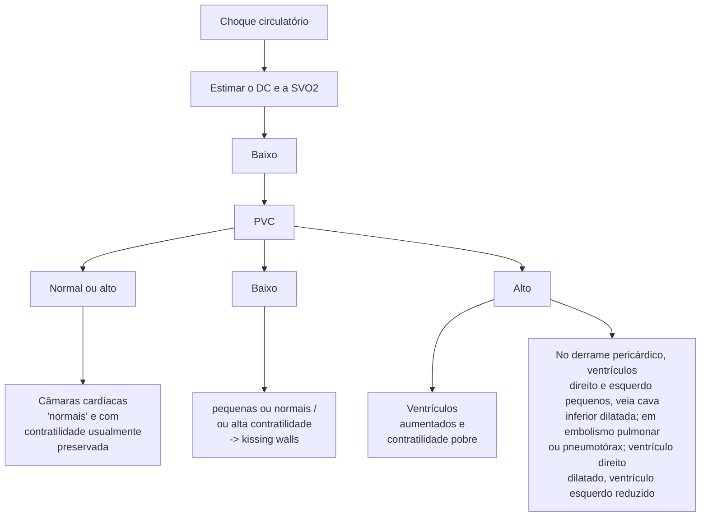

# CHOQUE: ABORDAGEM INICIAL

| **Choque**                                                                                                                                                                                                                                                                                                                                                                                                                                                                                                                                                                                                                                                                                                                                                                                                                                            |   | **SVc02 e SV02**                                                                                                                                                                                                                                                                                                                                                                                                                                                                                                                                                                                                                                                                                                              |   |
| ----------------------------------------------------------------------------------------------------------------------------------------------------------------------------------------------------------------------------------------------------------------------------------------------------------------------------------------------------------------------------------------------------------------------------------------------------------------------------------------------------------------------------------------------------------------------------------------------------------------------------------------------------------------------------------------------------------------------------------------------------------------------------------------------------------------------------------------------------- | - | ----------------------------------------------------------------------------------------------------------------------------------------------------------------------------------------------------------------------------------------------------------------------------------------------------------------------------------------------------------------------------------------------------------------------------------------------------------------------------------------------------------------------------------------------------------------------------------------------------------------------------------------------------------------------------------------------------------------------------- | - |
| • Estado de hipoperfusão sistêmica - alteração no DO2
=> DO₂ = DC x (1,39 x \[Hb] x SaO2 + (0,003 x PaO₂))
• Avaliação das janelas de perfusão: alteração estado mental, oligúria, IRpA, extremidades frias, mottling, hipotensão, etc.
**4 tipos de choque\*:**
• **Distributivo:** séptico e anafilático, neurogênico\*: DC aumentado, RVS diminuída, POAP diminuída, SVcO2 aumentada, PVC diminuída
• **Hipovolêmico:** perda de plasma/ hemorragias: DC diminuído, RVS aumentada, POAP diminuída, SVcO2 diminuída, PVC diminuída
• **Cardiogênico:** IAM, IC, Miocardite. DC diminuído, RVS aumentada, POAP aum. ou diminuída, SVc02 diminuída, PVC aumentada
• **Obstrutivo:** Pneumotórax hipertensivo, tamponamento pericárdico, TEP. DC diminuído, RVS aumentada, POAP aumentada, SVcO2 diminuída e PVC aumentada |   | • é uma medida de avaliação da perfusão sistêmica/ débito cardíaco. valores entre 65%-75%
• medidas que "aumentam" a SVc02: aumento do DC, hemoconcentração, hiperóxia, sedação e analgesia, paralisia, hipotermia
• medidas que "diminuem" a SVc02: diminuição do DC, anemia, hipoxemia, estresse, dor, hipertermia, tremores, agitação.
• **Gap-CO2:** valores acima de 5-6mmHg => pensar na utilização de inotrópicos!
• **Tratamento inicial:** Depende do tipo do choque. suporte clínico + fluidos (fluidorresponsividade + fluidotolerância) + vasopressores + inotrópicos + vasodilatadores + antibióticos + corticoterapia + toracostomia + pericardiocentese + anticoagulação + trombólise. ECMO\*. |   |

## 1. CHOQUE

Legendas: DC (débito cardíaco) | RVS (resistência vascular sistêmica)| POAP: pressão de oclusão da artéria pulmonar | SVcO2: saturação venosa central de O2

### 1.1 CONCEITO

• De modo simplificado, choque denota hipoperfusão;

• **Estado de choque**: quadro clínico na qual há falência circulatória que resulta em utilização inadequada de oxigênio pelas células;

• Manifestações – Hipotensão: pode estar presente, contudo não ocorre em todos os casos, principalmente nas fases iniciais;

• PA = DC x RVS: Má perfusão = Janelas da Perfusão; Alteração do estado mental; Oligúria; Desconforto respiratório, dessaturação; Extremidades frias, pegajosas; Cianose; TEC aumentado; Mottling (apresenta relação com mortalidade; Quanto maior, maior o grau de disfunção microvascular.

• Observe a imagem a seguir: Escore de Mottling para pacientes em choque séptico.

• Hiperlactatemia;

• Disfunções orgânicas.

### 1.2 DELIVERY DE OXIGÊNIO PARA OS TECIDOS

• Essa equação rege como irá ser feito o delivery de oxigênio para os tecidos;

• Contém todas as variáveis importantes para que aconteça uma entrega de oxigênio adequada para os tecidos;

• Qualquer alteração importante em alguma dessas variáveis compromete o delivery.

$$DO_2 = DC \times (1,34 \times [Hb] \times SaO2 + (0,003 \times PaO_2))$$

• Conteúdo arterial de O2 (CaO2);

$$CaO_2 = (1,34 \times Hb \times SpO_2) + (PaO_2 \times 0,003)$$

| SaO₂
%                                   | CaO₂
ml/dL                         |
| -------------------------------------------- | -------------------------------------- |
| 97
90                                    | CaO₂ = Hb x 1,36 x SaO₂ + PaO₂ x 0,003 |
| 55                                           | CaO₂                                   |
| O₂ dissolvido
PaO₂
45 60 80 100 mmHg |                                        |

**Figura 1** Oferta de oxigênio para os tecidos

| Estágio 1 | Estágio 3 | Estágio 5 | escore de livedo reticular |
| --------- | --------- | --------- | -------------------------- |

**Figura 2** Escore de livedo reticular em pacientes com choque séptico

EMERGÊNCIAS

**Tabela 1** escore de livedo reticular

| Score |               | Descrição                                            |
| ----- | ------------- | ---------------------------------------------------- |
| 0     | Ausente       | Sem mottling presente                                |
| 1     | Modesto       | Tamanho de uma moeda, localizado ao centro do joelho |
| 2     | Moderado      | Não excede a borda superior da rótula                |
| 3     | Intermediário | Não excede a metade da coxa                          |
| 4     | Severo        | Não excede a dobra da virilha                        |
| 5     | Grave         | Excede a dobra da virilha                            |

## 2. TIPOS DE CHOQUE

### 2.1 CHOQUE DISTRIBUTIVO
• Causas: Sepse; SIRS; Anafilaxia; Choque neurogênico (TRM).
• Diminuição da resistência vascular sistêmica.

**Figura 3** Fluxograma Choque circulatório

**Figura 4** Categorias de choque

| Choque Distributivo | Choque Hipovolêmico                             | Choque Cardiogênico   | Choque Obstrutivo          |
| ------------------- | ----------------------------------------------- | --------------------- | -------------------------- |
| Vasodilatação       | Perda de
plasma
ou volume
sanguíneo | Falha
Ventricular | Obstrução
Tamponamento |

### 2.2 CHOQUE HIPOVOLÊMICO
• Causas: Diarreias/vômitos; Hemorragia; Trauma.
• Diminuição do volume intravascular, com diminuição do DC.

### 2.3 CHOQUE CARDIOGÊNICO
• Causas: Pós-IAM; Insuficiência cardíaca avançada; Miocardite; Cardiomiopatias; Valvopatias.
• Diminuição do volume sistólico, diminuição ou elevação da FC, diminuição do DC.

### 2.4 CHOQUE OBSTRUTIVO
• Causas: Tamponamento cardíaco; Pneumotórax hipertensivo; TEP maciço. Sd. compartimental abdominal.
• Diminuição do retorno venoso para o VE pela obstrução, diminuição do volume sistólico e diminuição do DC.

### 2.5 PROTOCOLO RUSH
Podemos utilizar o mnemônico "HIMAP" para memorizar os itens analisados no protocolo RUSH para abordagem do choque indiferenciado com ultrassom à beira leito.

CHOQUE: ABORDAGEM INICIAL                                                                                       3

• H: coração.
• I: veia cava inferior.
• M: espaço de morrison (FAST).
• A: aorta (dissecção e aneurisma roto).
• P: pulmão (hemotórax e pneumotórax).

## 2.6 SVCO2 E SVO2 – SATURAÇÕES VENOSAS CENTRAIS

• SVcO2 → Saturação venosa mensurada em cateter central (65%-75%); Geralmente, mostra a aferição do tanto de extração de oxigênio da parte superior do nosso corpo (cabeça, MMSS).
• SVO2 → Saturação venosa mista mensurada em cateter de Swan-Ganz (65- 75%); Denota uma aferição de caráter sistêmico.
• **Como raciocinar?** Pergunte-se quanto sobra de oxigênio após os tecidos "pegarem" a parte deles! O metabolismo está aumentado ou diminuído? Quando em estado de hipoperfusão e, muitas vezes, com débito cardíaco diminuído → os tecidos tendem a extrair mais oxigênio do que o normal do vaso sanguíneo; Na captação da saturação venosa, observa um nível reduzido, em função da maior captação por parte dos tecidos; Mas há relação com o débito cardíaco/fluxo de sangue; No choque séptico, há um débito cardíaco aumentado, logo o sangue flui mais rapidamente pela vasodilatação; (1) Com isso, existe menos tempo para os tecidos extraírem o oxigênio do vaso, além de disfunção da microvasculatura; (2) Levando a uma saturação aumentada nesse tipo de choque. Nos outros tipos de choque, o débito cardíaco

se encontra diminuído, logo o sangue flui lentamente pela vasoconstrição. Assim, os tecidos têm mais tempo de extrair o oxigênio do vaso, além de estarem com má perfusão; levando a uma saturação diminuída.
• GAP-C02: Outra maneira de demonstrar o fluxo sanguíneo global do paciente; depuração VS produção de CO2; Valores aumentados a partir de 5-6 mmHg
  • Adequado => sem acúmulo de CO2 => depuração pelos pulmões => GAP baixo!
  • Inadequado => acúmulo de CO2 => pouca depuração pelos pulmões => GAP alto!
  • GAP CO2 elevado => utilizar inotrópicos!

## 3. TRATAMENTO DO CHOQUE

### 3.1 FLUIDOS

• Avaliação de fluidorresponsividade;
• Variação da pressão de pulso (DELTA PP); (1) A variação de 13% é bom prognóstico para fluidorresponsividade;
• Variação do diâmetro da CAVA inferior; Variação do diâmetro da CAVA superior; *Passive leg raising* – (Variação de 10%) no débito cardíaco; Teste de oclusão expiratória final; "Mini-challenge" de fluídos (100 mL); Challenge convencional de fluído (500 mL);
• Vasopressores;
• Antibiótico;
• Corticoides;
• Resolução do quadro de base.

**Tabela 2 Fatores que afetam a SVcO2**

| Fatores que afetam a SVcO2            | Fatores que afetam a SVcO2
Aumentam SVcO2                                                       | Fatores que afetam a SVcO2
Reduzem SVcO2                                                                 |
| ------------------------------------- | --------------------------------------------------------------------------------------------------- | ------------------------------------------------------------------------------------------------------------ |
| débito cardíaco                       | Alto débito cardíaco                                                                                | Baixo débito cardíaco                                                                                        |
| hemoglobina                           | Hemoconcentração                                                                                    | Anemia                                                                                                       |
| oxigenação                            | Hiperóxia                                                                                           | Hipóxia                                                                                                      |
| status mental                         | Sedação, analgesia                                                                                  | Estresse, ansiedade, dor                                                                                     |
| temperatura                           | Hipotermia                                                                                          | Hipertermia                                                                                                  |
| atividade muscular                    | Paralisia                                                                                           | Tremores, agitação, elevado trabalho respiratório                                                            |
| comportamento celular e microvascular | Células falham em usar o oxigênio (exemplo: disfunção mitocondrial na sepse ou isquemia—reperfusão) | Correspondência microvascular eficaz de fluxo com demanda de oxigênio, utilização celular eficaz de oxigênio |

EMERGÊNCIAS

**Tabela 3** Causas

| Tipos                   | Causas                                                                          | DC | RVS | POAP | S0 |
| ----------------------- | ------------------------------------------------------------------------------- | -- | --- | ---- | -- |
| Cardiogênico            | Insuficiência cardíaca congestiva
Infarto agudo do miocárdio
Valvopatia | ⬇  | ⬆   | ⬆    | ⬇  |
| Hipovolêmico            | Hemorragia traumática
Vômitos ou diarreia                                   | ⬇  | ⬆   | ⬇    | ⬇  |
| Obstrutivo              | Pneumotórax hipertensivo
Embolia pulmonar
Tamponamento cardíaco         | ⬇  | ⬆   | ⬆    | ⬇  |
| Séptico
Anafilático | Infecção de corrente sanguínea
Reação alérgica                              | ⬆  | ⬇   | ⬇    | ⬆  |
| Neurogênico             | Injúria ao SNC                                                                  | ⬇  | ⬇   | ⬇    | ⬆  |

# REFERÊNCIAS

**Figura 2** Escore mottling em pacientes com choque Séptico

Adaptado de Exploration of skin perfusion in cirrhotic patients with septic shock. Journal of Hepatology. 2015;62(3):549 - 55.

# CHOQUE: TIPOS DE CHOQUE

• **Séptico:** culturas, exames laboratoriais incluindo lactato, volume 30mL/kg, ATB de amplo espectro (1h). Objetivar melhora da perfusão e PAM > 65mmHg. se não, noradrenalina (1ª), seguido de vasopressina + hidrocortisona. 6hs => dobuta, outras medidas. SOFA > 2 (sepse).

• **Neurogênico:** TRM. perda do tônus simpático, hipotensão + bradicardia + extremidades quentes (vasodilatação). diferencial dos outros distributivos é DC diminuído! avaliação neurocirúrgica + suporte clínico

• **Distributivo:** séptico e anafilático, neurogênico*: DC aumentado, RVS diminuída, POAP diminuída, SVcO2 aumentada, PVC diminuída

• **Hipovolêmico:** perda de plasma. No USG Kissing walls, VCI colabada, mucosas secas. ressuscitação volêmica, sangue, transfusão maciça.

• **Hipovolêmico:** perda de plasma/ hemorragias: DC diminuído, RVS aumentada, POAP diminuída, SVcO2 diminuída, PVC diminuída

• **Cardiogênico:** Congestão (intra e extravascular), má perfusão. ventrículos hipocontráteis, disfunção segmentar. revascularização, inotrópicos, dispositivos de assistência ventricular, vasodilatadores, ECMO VA

• **Cardiogênico:** IAM, IC, Miocardite. DC diminuído, RVS aumentada, POAP aum. (VE) ou diminuída (VD), SVc02 diminuída, PVC aumentada

• **Obstrutivo:** de acordo com o quadro em questão. alterações USG (VD agudo, McConnell, derrame pericárdico, swinging heart, colapso diastólico de VD, VCI pletórica, lung-point, ausência de lung-sliding), alterações em ECG, tríade de Beck. Trombólise, pericardiocentese, toracostomia, ECMO

• **Obstrutivo:** Pneumotórax hipertensivo, tamponamento pericárdico, TEP. DC diminuído, RVS aumentada, POAP aumentada, SVcO2 diminuída e PVC aumentada).

## 1. TABELA DOS CHOQUES (REVER APÓS CADA CHOQUE)

**Tabela 1** Tipos de choque

| Tipos                   | Causas                                                                          | DC | RVS | POAP | Sv0₂ |
| ----------------------- | ------------------------------------------------------------------------------- | -- | --- | ---- | ---- |
| Cardiogênico            | Insuficiência cardíaca congestiva
Infarto agudo do miocárdio
Valvopatia | ↓  | ↑   | ↑    | ↓    |
| Hipovolêmico            | Hemorragia traumática
Vômitos ou diarreia                                   | ↓  | ↑   | ↓    | ↓    |
| Obstrutivo              | Pneumotórax hipertensivo
Embolia pulmonar
Tamponamento cardíaco         | ↓  | ↑   | ↑    | ↓    |
| Séptico
Anafilático | Infecção de corrente sanguínea
Reação alérgica                              | ↑  | ↓   | ↓    | ↑    |
| Neurogênico             | Injúria ao SNC                                                                  | ↓  | ↓   | ↓    | ↑    |

## 2. CHOQUE SÉPTICO

• De modo geral, o choque séptico se relaciona com um processo infeccioso, a partir do qual se inicia uma resposta inflamatória exacerbada, manifestando-se através de um estado de hipoperfusão;
• Conceitualmente Sepse:
  • Disfunção orgânica ameaçadora à vida causada por desregulação da resposta do hospedeiro à infecção;
  • Pode ser definida como variação do escore SOFA ≥ 2
• Ainda, pode ser entendida como uma disfunção circulatória, celular e metabólica graves a ponto de aumentar substancialmente a mortalidade;
  • É capaz de levar a múltiplas disfunções orgânicas;
  • Desse modo, a confirmação é dita mediante um quadro de hipotensão persistente com necessidade do **uso de vasopressores para manter a PAM ≥ 65**, a despeito de ressuscitação volêmica adequada (30mL/kg): A ressuscitação volêmica ainda não vai ser suficiente para manter uma pressão arterial média adequada.
  • Outro marcador é dado pelo **Lactato arterial ≥ 2 mmol/L (18 mg/dL)**.

### 2.1 SEPSE – TRATAMENTO

**Bundle de 1 hora – Surviving Sepsis Campaign:**
• Manejo em sala de emergência;
  • Mensuração de lactato arterial – nova medida se ≥ 2 mmol/L (18 mg/dL).
• Idealmente, depois da ressuscitação volêmica;
  • Coleta de hemoculturas – antes da administração de antibióticos;
• Administração de antibióticos de amplo adequado;
  • Rápida infusão de cristaloides 30 ml/kg, em caso de hipotensão ou lactato ≥ 4 mmol/L (36 mg/dL);
• Início de vasopressores visando PAM ≥ 65 mmHg, se hipotensão durante ou após a ressuscitação volêmica:

• Primeira escolha: Noradrenalina; (1)
  • Em caso de choque refratário, isto é, níveis progressivamente aumentados de noradrenalina > 0,5 mcg/kg/min → é viável introduzir drogas de segunda escolha.
  • Segunda escolha: Vasopressina + Hidrocortisona.

**Bundle de 6 horas – Surviving Sepsis Campaign:**
• considerar possibilidade de disfunção miocárdica associada;
• Manter vasopressores;
• Ainda, pode-se iniciar o uso de inotrópicos; (1)
• De escolha: dobutamina.
• Hipotensões refratárias → aferição de PVC e SVcO2;
• A fim de avaliar choque com componente misto.
• Lactato: útil no intuito de avaliar a efetividade da ressuscitação volêmica; Janela de perfusão.
• Antibioticoterapia:
• Escore SOFA: SOFA > 2 define o quadro de sepse;
• Forma diminuta do escore SOFA: qSOFA: Visto de forma isolada, não é um bom parâmetro; Baseia-se na análise de 3 variáveis: Alteração do estado mental → ECG < 15; Taquipneia → FR ≥ 22 irpm; Hipotensão → PAS ≤ 100 mmHg; Interpretação: 0-1 ponto: baixo risco; Continuar o manejo adequado; 2-3 pontos: alto risco;
• O qSOFA é uma ferramenta de triagem ruim, pois já mostra uma disfunção tardia: Pelo consenso de especialistas, não há uma ferramenta de triagem perfeita, por isso devem ser combinadas ao olhar clínico. Espera-se de uma ferramenta de triagem que seja muito sensível e pouco específica.

### 2.2 CAUSAS DE SIRS NÃO SEPSE

• Politraumatizados;
• Grande queimado;
• Pancreatite aguda grave;
• Pneumonite aspirativa;
• Síndrome pós-PCR;
• Síndrome pós-reperfusão (OAA);

**Tabela 2** Início da antibioticoterapia

|                                | Início da antibioticoterapia
Choque presente                                         | Início da antibioticoterapia
Choque ausente                                       |
| ------------------------------ | ---------------------------------------------------------------------------------------- | ------------------------------------------------------------------------------------- |
| **Sepse definida ou provável** | Administrar antimicrobianos imediatamente, idealmente na primeira hora de reconhecimento |                                                                                       |
|                                |                                                                                          |                                                                                       |
| **Sepse provável**             | Administrar antimicrobianos imediatamente, idealmente na primeira hora de reconhecimento | Rápida avaliação das causas infecciosas e não infecciosas para doença aguda           |
|                                |                                                                                          | Administrar antimicrobianos dentro de 3 horas, se a suspeita para infecção permanecer |

CHOQUE: TIPOS DE CHOQUE                                                                                 3

**Tabela 3** Escore de SOFA (variáveis avaliadas)

| Sistema                         | Escore
0  | Escore
1          | Escore
2                               | Escore
3                          | Escore
4                                             |
| ------------------------------- | ------------- | --------------------- | ------------------------------------------ | ------------------------------------- | -------------------------------------------------------- |
| **Respiração**                  |               |                       |                                            |                                       |                                                          |
| **PaO2/FiO2, mmHg (kPa)**       | ≥ 400 (53.3)  | < 400 (53,3)          | < 300 (40)                                 | < 200 (26,7) com suporte respiratório | < 100 (13,3) com suporte respiratório                    |
| **Coagulação**                  |               |                       |                                            |                                       |                                                          |
| **Plaquetas, x 10³/μL**         | ≥ 150         | < 150                 | < 100                                      | < 50                                  | < 20                                                     |
| **Fígado**                      |               |                       |                                            |                                       |                                                          |
| **Bilirrubina, mg/dL (μmol/L)** | < 1.2 (20)    | 1.2 – 1.9 (20 – 32)   | 2.0 – 5.9 (33 – 101)                       | 6.0 – 11,9 (102 – 204)                | > 12.0 (204)                                             |
| **Cardiovascular**              | PAM ≥ 70 mmHg | PAM < 70 mmHg         | Dopamina < 5 ou dobutamina (qualquer dose) | Dopamina 5.1 – 15 ou epinefrina ≤     | Dopamina > 15 ou epinefrina > 0,1 ou noradrenalina > 0,1 |
| **Sistema nervoso central**     |               |                       |                                            |                                       |                                                          |
| **Escala de Coma de Glasgow**   | 15            | 13 – 14               | 10 – 12                                    | 6 – 9                                 | < 6                                                      |
| **Renal**                       |               |                       |                                            |                                       |                                                          |
| **Creatinina, mg/dL (μmol/L)**  | < 1.2 (110)   | 1.2 – 1.9 (110 – 170) | 2.0 – 3.4 (171 – 299)                      | 3,5 – 4,9 (300 – 440)                 | > 5.0 (440)                                              |
| **Débito urinário, mL/d**       | -----         | -----                 | -----                                      | < 500                                 | < 200                                                    |

• PO Cirurgia Cardíaca;
• PO Cirurgias grande porte;
• Secundariamente em outras causas de choque.

## 3. CHOQUE NEUROGÊNICO

• Choque distributivo (choque quente);
• Etiologia mais comum é TRM;
  • Decorre em uma perda do tônus simpático.

### 3.1 QUADRO CLÍNICO
• Perda do tônus simpático;
• Extremidades quentes;
• **Bradicardia;**
• **Hipotensão.**

### 3.2 PERFIL HEMODINÂMICO
• Vasodilatação generalizada.

### 3.3 ECOCARDIOGRAMA
• Ventrículo esquerdo normal ou hipercontrátil.

### 3.4 CAP – CATETER DE ARTÉRIA PULMONAR
• Débito cardíaco – reduzido;
• Resistência vascular sistêmica – reduzida;
• Pressão de oclusão da artéria pulmonar (POAP) – reduzida;
• Saturação venosa central – aumentada.

## 4. CHOQUE HIPOVOLÊMICO

• Choque frio
  • Cursa com vasoconstrição e débito cardíaco diminuído.

### 4.1 QUADRO CLÍNICO
• Extremidades frias;
• TEC aumentado;
• Diminuição de diurese;
• Outros sinais de baixo débito cardíaco.

### 4.2 PERFIL HEMODINÂMICO
• DC diminuído
• RVP aumentada;

EMERGÊNCIAS

**Tabela 4** principais sinais e sintomas da IC direita, esquerda e sintomas em comum.

| Sugestivo de insuficiência cardíacadireita | Achados compartilhados          | Sugestivo de insuficiência cardíacaesquerda |
| ------------------------------------------ | ------------------------------- | ------------------------------------------- |
| Edema nos membros inferiores               | Periferia fria                  | Crepitações pulmonares                      |
| Edema sacral                               | Cianose                         | Sibilos respiratórios                       |
| Hepatomegalia                              | Ortopneia                       | Ápice cardíaco deslocado                    |
| Sopro regurgitante na área tricúspide      | Retardo no reenchimento capilar | Sopros cardíacos do lado esquerdo           |

- PVC diminuída.
- PVC baixa;
- POAP normal – baixa;
- IC baixo;
- RVS elevada.

**4.3 ECO**
- Ventrículo esquerdo de tamanho normal;
- Hipercontrátil;
- "Batida seca": Sinal ecocardiográfico "Kissing Walls".
- VCI colabada

## 5. CHOQUE CARDIOGÊNICO

- Causas:
  - Infarto;
  - IC grave;
  - Valvopatia grave.

**5.1 QUADRO CLÍNICO:**
- Depende da área afetada do coração;
- Sinais de baixo débito + Congestão pulmonar (VE);
- Ventrículo esquerdo/direito: ECO: ventrículos dilatados, hipocontrátil.

**5.2 CAP**
- PVC elevada;
- **PAPO elevada (VE)/ baixo (VD):** Quando o choque acomete a porção esquerda do coração → maior quantidade de sangue parada no átrio esquerdo; Quando o choque acomete a porção direita do coração → não há quantidade parada de sangue;
- IC baixo;
- DC diminuído
- RVS alta.

**Tratamento:**
- Revascularização do miocárdio (CATE precoce se isquêmico)
- Inotrópicos + vasodilatadors/vasopressores
- Suporte mecânico (BIA/ECMO-VA/DAVs)

## 6. CHOQUE OBSTRUTIVO – TEP

**6.1 QUADRO CLÍNICO**
- Dispneia aguda;
- Dor torácica anterior, ventilatório-dependente;
- Sinais de baixo débito;
- Hipotensão.

**6.2 ACHADOS DE ECG**
- ECG: Taquicardia sinusal; BRD completo ou incompleto; Padrão de Strain de VD; VD dilatado; Inversão da onda T de V1-V4 e/ou derivações inferiores (II, III, AVF). ATENÇÃO! Observe a imagem a seguir:
- Taquicardia sinusal;
- Bloqueio de ramo direito;
- Inversões de onda T, em V1 – V3.
- Desvio do eixo para direita;
- Onda R dominante em V1;
- Aumento do átrio direito (P pulmonale);
- Padrão de S1Q3T3 – não sensível ou específico;
- Rotação horária – alteração do padrão R/S;
- Taquicardia atrial – FA, Flutter;
- Alterações de repolarização;
- ECO: VD dilatado (relação VD/VE > 1); Sinal de McConnell.

CHOQUE: TIPOS DE CHOQUE    5

[ECG trace showing 12-lead electrocardiogram with leads I, II, III, aVR, aVL, aVF, V1, V2, V3, V4, V5, V6]

**Figura 1** achados eletrocardiográficos em um paciente com TEP (taquicardia sinusal + BRD + inversões de T em V1 a V3)

## 6.3 PERFIL HEMODINÂMICO
- PVC elevada;
- PAPO normal-baixa;
- IC baixo;
- RVS alta.

## 6.4 DIAGNÓSTICO
- Angio-TC ou ECO-TE (se instabilidade importante).

## 6.5 TRATAMENTO
- PAM < 65-70 mmHg – vasopressores e inotrópicos;
- **Trombólise** sistêmica se hipotensão persistente;
- ECMO-VA se choque refratário;
- Tratamento endovascular, se houver contraindicação a trombólise ou não resposta.

## 7. CHOQUE OBSTRUTIVO – TAMPONAMENTO CARDÍACO

### 7.1 TAMPONAMENTO
- Pelo colapso diastólico do VD, não há DC efetivo ou sangue direcionado para os pulmões, o que leva ao estado de choque.

### 7.2 QUADRO CLÍNICO
- Dispneia (mais comum);
- Hipotensão;
- Taquicardia;
- Pulso paradoxal;
- Turgência jugular (sinal de Kussmaul);
- Baixo débito;
- **Tríade de Beck.**

### 7.3 ACHADOS NO ECO
- ECO: Derrame pericárdico > 1 cm; Colabamento câmaras cardíacas; *Swinging heart*; Fluxo transmitral diminuído (doppler).
- Sinais do ECO

- Efusão pericárdica;
- Colapso diastólico do VD – bastante específico: Durante a diástole o VD colaba;
- Colapso sistólico do AD – mais sensível: 1º sinal que aparece;
- Veia cava pletórica: Quase nenhuma variabilidade durante a respiração.
- Alteração no pico de velocidade na valva tricúspide e na valva mitral.

### 7.4 PERFIL HEMODINÂMICO
- Equalização de pressões diastólicas (AD, VD, PAP, PAPO).

### 7.5 DIAGNÓSTICO
- Quadro clínico + ECO.

### 7.6 TRATAMENTO
- Vasopressores / Inotrópicos;
- **Pericardiocentese de alívio** – se iminência de PCR;
- Janela pericárdica (tratamento cirúrgico);

## 8. CHOQUE OBSTRUTIVO – PNEUMOTÓRAX HIPERTENSIVO

[Chest X-ray image showing large right-sided pneumothorax with mediastinal shift]

**Figura 2** radiografia de tórax evidenciando volumoso pneumotórax à direita, com desvio das estrutura mediastinais para o lado contralateral

• Conceito: dá-se pelo acúmulo de ar no espaço pleural;
  • Em geral, ocorre por um ferimento no parênquima pulmonar;
  • Assim, o ar se acumula na cavidade pleural, através da abertura da ferida no tórax.
• Evolui com deslocamento das estruturas mediastinais, evidenciando o quadro clínico.

## 8.1 QUADRO CLÍNICO
• Ausência de murmúrios ipsilateralmente à lesão;
• Hipotensão;
• Hipoperfusão;
• Turgência jugular;
• Hipertimpanismo à percussão.

## 8.2 CONDUTA
• Toracocentese de alívio;
• Drenagem torácica.

# REFERÊNCIAS

**Figura 1** achados eletrocardiográficos em um paciente com TEP (taquicardia sinusal + BRD + inversões de T em V1 a V3)
ECG changes in Pulmonary Embolism • LITFL • ECG Library

**Figura 2** radiografia de tórax evidenciando volumoso pneumotórax à direita, com desvio das estrutura mediastinais para o lado contralateral
Arquivo pessoal
