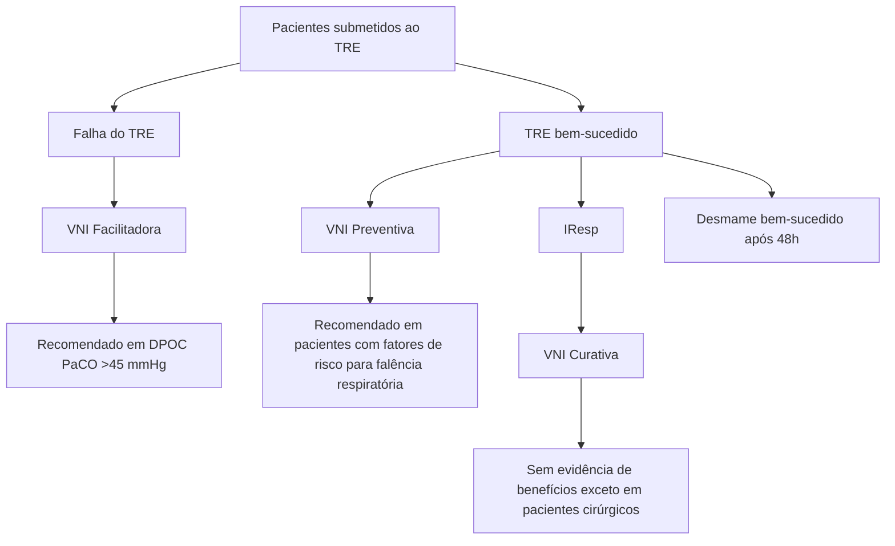
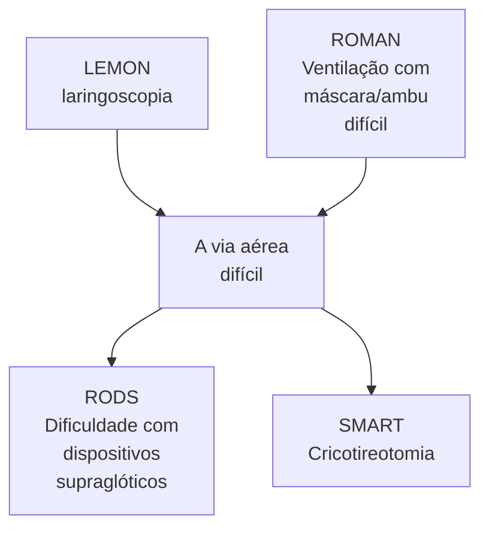

Via Aérea e intubação (CM)

# VIA AÉREA, INTUBAÇÃO E VNI

• **Múltiplas causas de IRpA**
• IRpA I: hipoxêmica / II: hipercápnica / III: peri-operatório/ IV: choque
• **Múltiplos modos de tratamento:** oxigenoterapia, VNI, CNAF, IOT, toracostomia, pericardiocentese.
• **critérios de Walls para IOT:**
  • perda da perviedade da via aérea;
  • falha na ventilação ou oxigenação;
  • impressão subjetiva de desfecho ruim no quadro clínico do paciente.
• **Conceitos:** via aérea difícil (anatômica e fisiológica), via aérea falha
• **Preditores de via aérea difícil:** LEMON, MOANS, RODS, SMART. *Upper lip bite test*, circunferência cervical.
• **Mallampati:** critério antes da intubação / Cormack-Lehane: critério na laringoscopia.
• **Uso do bougie:** Cormack 2b e 3 → bem utilizado

• 7 P's da intubação. especial atenção no preparo, nos sedativos e BNM. sedação Pós intubação.
• Confirmação da intubação: capnografia, visualização direta, USG.
• Pós intubação dando ruim? DOPES e DOTTS.
• **DOPES:** eslocamento do tubo, obstrução, pneumotórax, equipamento, auto-PEEP
• **DOTTS:** desconectar paciente do ventilador, utilizar BVM, O2 a 100%, corrigir auto-peep, utilizar USG.
• **VNI:** eficaz em DPOC e EAP cardiogênico. pode ser utilizado em: SDRA, asma, pós-extubação, pré-ox, pneumonia.
  • Cuidado com as contraindicações! RNC, vômitos, PCR, necessidade de IOT.
• **CNAF:** muito bom em insuficiência respiratória hipoxêmica aguda..

## 1. CAUSAS DE INSUFICIÊNCIA RESPIRATÓRIA AGUDA (IRPA)

Infecções, asma, DPOC, anafilaxia, choque, doenças neuromusculares, obstrução de vias aéreas, edema agudo de pulmão, alterações metabólicas, atelectasias e trauma.

**Múltiplos modos de tratamento (outros pontos para auxiliar no manejo):**
• Oxigenoterapia, VNI, CNAF, IOT, toracostomia, pericardiocentese, broncodilatadores, adrenalina, nitroglicerina.

### 1.1 DIVISÃO CLÁSSICA DA IRPA
**I.** hipoxêmica (PaO2 < 60)
**II.** hipercápnica (PaCO2 > 45)
**III.** peri-operatório
**IV.** choque.

### 1.2 ABORDAGEM PRÁTICA DA IRPA NA EMERGÊNCIA
• Tipo I: pacientes com aumento do trabalho respiratório (taquicardia, taquipneia, sudorese) → suporte com oxigenoterapia;
• Tipo II: alvéolos destruídos (SHUNT) → pressão positiva (VNI) favorece o manejo;
• Tipo III: não conseguem proteger a via aérea → necessitam de intubação imediata;
• Tipo IV: apneicos (não respiram) → necessitam de intubação imediata.

## 2. VNI E CNAF

### 2.1 VNI – VENTILAÇÃO NÃO INVASIVA
**Terapia de primeira linha - diminui a mortalidade**
• EAP (edema agudo de pulmão) cardiogênico;

• DPOC (especialmente em pacientes com hipercapnia e acidose).

**Considerar uso nas seguintes situações:**
• Pneumonia; asma; síndrome da hipoventilação da obesidade; imunossuprimido; doença neuromuscular; SDRA leve; extubação; pré-oxigenação.

**Preditores de falha de VNI:**
• APACHE II > 29;
• GCS < 11;
• Frequência respiratória (FR) > 30;
• pH < 7,25; Índice de Tobin (FR/Volume corrente) > 105.

**Utilização da VNI no processo de extubação:**
Confira a figura 1, presente na próxima página

**Contraindicações da VNI:**
• Necessidade de IOT ou VMI; PCR; não protege via aérea; secreção abundante; agitação ou recusa; rebaixamento do nível de consciência; falência orgânica não respiratória; trauma, deformidade facial; cirurgia facial ou neurocirurgia recente; obstrução de via aérea; anastomose esofágica recente.

### 2.2 CNAF – CATETER NASAL DE ALTO FLUXO
**Insuficiência respiratória hipoxêmica aguda:**
• Redução de IOT quando comparado com suporte convencional de O² (principalmente em relação PaO²/ FiO2 > 200).

**Insuficiência respiratória aguda em imunossuprimidos:**
• Redução de IOT quando comparado com suporte convencional de O².

**Pós-extubação: controverso.**

**Suporte de O² durante a intubação:**
• Superior ao suporte convencional de O²;
• Inferior a VNI;
• Não é custo efetivo → Opção quando paciente já está em uso.

EMERGÊNCIAS

## Pacientes submetidos ao TRE

**Figura 1** Utilização da VNI no processo de extubação

## 3. VIA AÉREA E INTUBAÇÃO OROTRAQUEAL

• Segundo o manual de via aérea na emergência do *Walls*, temos 3 indicações clássicas para indicar via aérea definitiva:
  • Há falha em manter a via aérea protegida/pérvia?
  • Há falha na ventilação ou oxigenação?
  • Há necessidade de se antecipar a um possível desfecho clínico desfavorável?

### 3.1 DEFINIÇÕES: VIA AÉREA DIFÍCIL

Aquela em que a avaliação pré-procedimento identifica atributos que predizem laringoscopia, intubação, ventilação com bolsa-válvula-máscara (BVM), uso de dispositivos supraglóticos ou via aérea cirúrgica mais difíceis do que em outros pacientes sem esses atributos.

• **Via aérea fisiologicamente vs mecanicamente difícil**
  • Fisiológica – paciente em estado de saúde onde o manejo pré-intubação e pós é difícil;
  • Mecânica – paciente com via aérea que apresentará dificuldades técnicas ao procedimento, paciente com preditores de via aérea difícil.

### 3.2 DEFINIÇÕES: VIA AÉREA FALHA

• Ocorre quando o plano principal para estabelecer a via aérea avançada falha e é necessário usar planos de resgate;

**Figura 2** Fluxograma de preditores de via aérea difícil

• Falha em manter a oxigenação adequada após uma ou mais laringoscopias;
• Falha de 3 tentativas de intubação por um médico experiente, mesmo saturação adequada;
• Diante de deterioração rápida do quadro clínico;
• Sempre tentar de formas diferentes após falha de intubação (não insistir na mesma estratégia após falha inicial da mesma).

## 4. PREDITORES DE VIA AÉREA DIFÍCIL

• Ver **Figura 2** e **Tabela 1**

**Tabela 1** Preditores de via aérea difícil

| MOANS (preditor de ventilação difícil)                                                                                                                                     | LEMON (Preditor de intubação difícil)                                                                                   |
| -------------------------------------------------------------------------------------------------------------------------------------------------------------------------- | ----------------------------------------------------------------------------------------------------------------------- |
| M – Selo da Máscara
O – Obstrução/Obesidade
A – Idade (Age) > 55 anos
N – Não tem dentes
S– Pulmão Stiff (rígido)
ou alteração de coluna
cervical. | L – Olhar (Look)
E – Avaliar 3-3-2 (Evaluate)
M – Mallampati
O – Obstrução/Obesidade
N – Pescoço (Neck) |
| RODS (dispositivos supraglóticos)                                                                                                                                          | SHORT (preditor de via aérea cirúrgica difícil)                                                                         |
| R – Movimentação restrita
da boca
O – Obstrução
D – Anatomia distorcida
S – Pulmão Stiff (rígido)
ou alteração de coluna
cervical.                 | S - Surgery
H – Hematoma
O – Obesidade
R – Radiação
T – Tumor                                           |

### 4.1 UPPER-LIP BITE TEST

| **Borda avermelhada** | **Classe 1** | **Classe 2** | **Classe 3** |
| --------------------- | ------------ | ------------ | ------------ |

**Figura 3** Upper-lip bite test

VIAS AÉREAS, INTUBAÇÃO E VNI

## 4.2 CIRCUNFERÊNCIA CERVICAL

• Considerado bom preditor de via aérea difícil quando maior que 40 cm.

![Figura 4 - Medição da circunferência cervical]

**Figura 4** Medição da circunferência cervical

## 4.3 MALLAMPATI

![Mallampati Classification Diagram showing four classes of airway visualization]

Classe I: palato mole, úvula, fauces, pilares visíveis, sem dificuldade

Classe II: Palato mole, úvula, fauces visíveis, sem dificuldade

Classe III: palato mole, base da úvula visíveis, dificuldade moderada

Classe IV: Palato duro, visível. Dificuldade Grande

**Figura 5** Mallampati

![Cormack-Lehane Classification Diagram]

| Grau 1 | Grau 2A | Grau 2B  | Grau 3A | Grau 3B | Grau 4 |
| ------ | ------- | -------- | ------- | ------- | ------ |
| Fácil  |         | Restrito |         | Difícil |        |

**Figura 6** Classificação de Cormack e Lehane

## 5. CLASSIFICAÇÃO DE *CORMACK* E *LEHANE* (AVALIAÇÃO DURANTE A LARINGOSCOPIA)

• Ver **Figura 6**
• *Cormack* e *Lehane* 2b e 3 → indicação do uso de bougie.
• *Cormack* e *Lehane* 4 → contraindicação ao uso de bougie.

## 6. O *BOUGIE*

• Dispositivo facilitador de IOT. **Figura 7**
• Uso com a extremidade curva na frente.
• Funciona como um guia colocado na via aérea, garantindo que está no lugar certo, e em seguida se insere o tubo no trajeto do Bougie, assegurando assim que estará na via aérea.

![Bougie usage diagram]

**Figura 7** *Bougie* - uso com a extremidade curva

## 7. OS SETE "P"S DA INTUBAÇÃO

### 7.1 PREPARAÇÃO
• Testar o laringoscópio, se tem luz e se responde à pressão;
• Escolher a lâmina;
• Testar o *cuff*.
• Preparar também outros planos caso a primeira tentativa de IOT falhe;

• Escolher as medicações;
• Já posicionar o paciente;
• Verificar aspirador, fisioterapeuta, enfermagem, drogas;
• Verificar TUDO! A melhor chance de intubar é a primeira!

## 7.2 PRÉ-OXIGENAÇÃO

• Oferecer oxigênio a 100%, independente da forma, por 3 a 5 minutos.
• MNR, VNI, CNAF, AMBU.
• O objetivo é a desnitrogenação pulmonar, aumentando a quantidade de O² no mesmo volume e garantindo um maior tempo de via aérea segura.

## 7.3 OTIMIZAÇÃO PRÉ-INTUBAÇÃO (PRÉ-TRATAMENTO)

• Ressuscitação volêmica, drogas vasoativas, entre outros aspectos a serem otimizados para melhora da condição clínica fisiológica do paciente.
• A pré-medicação em si é cada vez menos utilizada no cenário de emergência.
  • **Fentanil** – simpatolítico. Importante relembrar que pode causar tórax rígido, com necessidade de infusão de bloqueador neuromuscular.
  • **Lidocaína** – não utilizada!

## 7.4 PARALISIA / INDUÇÃO

**Drogas de sedação:**

• **Etomidato:** cardioestável, com o porém de talvez causar insuficiência adrenal em casos de sepse – embora já existam trabalhos mostrando que pode ser seguro mesmo em casos de choque séptico. Por vezes, o Etomidato pode vir a causar mioclonias; nesses casos nós iremos utilizar, para as mioclonias, o midazolam. Na maioria das vezes nenhum tratamento específico se faz necessário para as mioclonias;

• **Quetamina:** preserva o drive respiratório do paciente, faz broncodilatação e analgesia, pode fazer taquicardia, hipotensão ou hipertensão. Sempre que a questão abordar pacientes com problemas de broncoespasmo que vão ser submetidos à intubação orotraqueal, a quetamina vai ser a melhor escolha;

• **Propofol e midazolam** são menos utilizados pelo efeito de depressor do sistema cardiovascular, que pode gerar PCR.

*Há uma droga nova no mercado, o Ciprofol, com perfil parecido ao propofol. Atenção nela!

**Bloqueadores neuromusculares:**

• **Contraindicação** se houver a possibilidade de não conseguir ventilar o paciente: é uma decisão "subjetiva" atrelada à experiência médica;

• **Succinilcolina:** pode causar hipercalemia. Contraindicado se houver presença ou risco desse distúrbio eletrolítico. Evitar se houver distúrbio neuromuscular crônico, hipertermia maligna, hipercalemia, IRA/DRC ou em grandes queimados;

• **Rocurônio:** sem risco de hipercalemia. Bloqueio neuromuscular com duração mais prolongada.

## 7.5 POSICIONAMENTO

• Checar posição ideal → "sniff" position.
• Aqui o ajuste fino da posição é realizado.

[Two images showing patient positioning for intubation]

**Figura 8 Ilustração: Posicionamento do paciente para intubação**

## 7.6 PASSAR O TUBO E CONFIRMAR INTUBAÇÃO

• Inspeção, ausculta e ultrassonografia são métodos para confirmar intubação na traqueia.
• Método ouro para a confirmação da intubação é a capnografia em formato de onda.

## 7.7 CUIDADOS PÓS-INTUBAÇÃO

• Checar se o tubo está bem centrado, se houve pneumotórax entre outros. **Figura 10**

# 8. PACIENTE ESTÁ MAL, DESSATURANDO, MESMO JÁ INTUBADO: O QUE PENSAR?

**Descompensação secundária a DOPES?**

• **D** – *Displaced ET tube* (tubo fora do lugar);
• **O** – Obstrução do tubo;
• **P** – Pneumotórax;
• **E** – Equipamento não funcionante;
• **S** – *Stacking* (há ventilação, mas não há exalação).

**Consertar o problema com DOTTS!**

• **D** – Desconectar do ventilador;
• **O** – Oxigenar com BVM;
• **T** – Melhorar a posição do tubo;
• **T** – *Tweak the vent* (melhorar a ventilação no equipamento);
• **S** – *Sonogram* (USG para checar se a intubação está correta).

VIAS AÉREAS, INTUBAÇÃO E VNI

## Plano A – Estratégia de Intubação Inicial

| Intubação eletiva
Intubação de
sequência rápida | máx. 4 tentativas
máx. 3 tentativas | Otimizar posição
Use Bougie ou Estilo
Lâmina/Escopo
alternativos
Operador alternativo | Vela | Lâmina
alternativa | Aerotraq | Videolaringos-
cópio |
| ------------------------------------------------------- | --------------------------------------- | ----------------------------------------------------------------------------------------------------- | ---- | ---------------------- | -------- | ------------------------ |

## Plano B – Estratégia de Intubação Secundária

| Plano B não apropriado
em eletiva RSI | LMA Clássica (cLMA)
LMA de Intubação (iLMA)
por exemplo: Fast Trach
ou AirQ | + | cLMA
iLMA | Estilo de Fibreóptica ou
Escopo de Fibreóptica Flexível | =Intubação de fibreóptica
através de iLMA
=Estilo de fibra óptica maleável
através de cLMA
=Escopo de fibreóptica
(cg Ambu Ascof+c2) |
| ----------------------------------------- | --------------------------------------------------------------------------------------- | - | ------------- | ----------------------------------------------------------- | -------------------------------------------------------------------------------------------------------------------------------------------------------- |

## Plano C – Manter Oxigenação e Ventilação

| Tentativa de acordar o paciente
Considere Sugamadex se disponível | Máscara, NPO, Guedel | Máscara facial
Via aérea nasofaríngea
Guedel aérea
LMA clássica (cLMA)
LMA de intubação (iLMA), por
exemplo: Fast Trach ou AirQ | cLMA, iLMA |
| --------------------------------------------------------------------- | -------------------- | --------------------------------------------------------------------------------------------------------------------------------------------------- | ---------- |

## Plano D – Técnicas de Resgate para "Não Posso Intubar, Não Posso Ventilar"

| Saco la, b, c                                                            | Anatomia pediátrica ou fácil | - Cricotiroidotomia                              |            |               |                               |                        |
| ------------------------------------------------------------------------ | ---------------------------- | ------------------------------------------------ | ---------- | ------------- | ----------------------------- | ---------------------- |
| Saco 2                                                                   | Anatomia adulta ou fácil     | - Scalpel–Bougie–ETT
(maior sucesso no NAP4) |            |               |                               |                        |
| Saco 3                                                                   | Anatomia impossível          | - Agulha de dedo de bisturi                      | Kit Melker | Traque rápido | Dispositivo de
Oxigenação | Bisturi Bougie
ETT |
| Consulte o fluxograma CICV e cartões de
aviso de enfermagem no verso |                              |                                                  |            |               |                               |                        |

Figura 9 Estratégias de Intubação.
