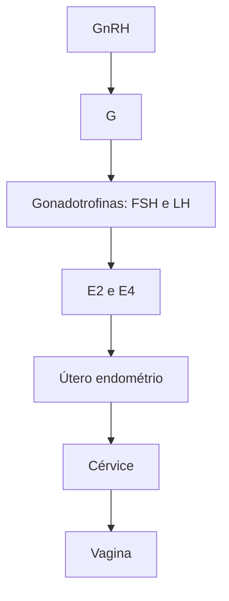
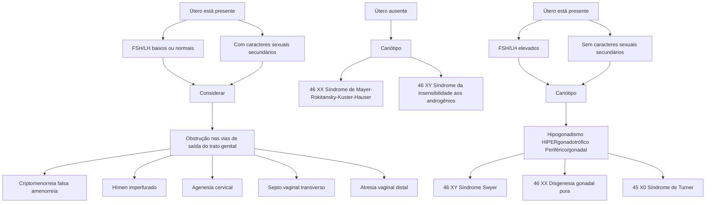

Amenorreia primária

# AMENORREIA PRIMÁRIA

• **Amenorreia primária:** ausência de menarca até os 13 anos sem caracteres sexuais secundários OU aos 15 anos com caracteres sexuais secundários (definição FEBRASGO).

**As etiologias são divididas didaticamente em 4 compartimentos, tendo como base a fisiologia do ciclo menstrual:**

I. Uterovaginal: malformações Müllerianas; hímen imperfurado;

II. Ovário: síndrome de Turner, disgenesia gonadal pura, síndrome de Swyter;

III. Hipófise: alterações nesse compartimento estão mais comumente associadas a causas de amenorreia secundária;

IV. Hipotálamo: atraso constitucional da puberdade,

síndrome de Kallmann.

**A investigação diagnóstica se inicia com as seguintes perguntas:**

• Útero presente com FSH e LH baixos (ou normais) na ausência de caracteres sexuais secundários → pensar em causas centrais (hipotálamo ou hipófise). Na presença de caracteres sexuais secundários, considerar obstrução nas vias de saída do trato genital;

• Útero presente com FSH e LH elevados → pensar em causas ovarianas (síndrome de Swyer, síndrome de Turner, disgenesia gonadal pura);

• Útero ausente → pensar em síndromes de Mayer Rokitansky-Kuster-Hauser (46 XX) e de Morris (46 XY).

## 1. AMENORREIA PRIMÁRIA

### 1.1 CONCEITOS E CONSIDERAÇÕES GERAIS

Amenorreia é um sintoma que caracteriza a ausência de menstruação. Nem sempre precisa ser investigada, visto que existem causas fisiológicas.

### 1.2 CAUSAS FISIOLÓGICAS DE AMENORREIA

Situações em que se espera ausência de menstruação: gestação; amamentação; menopausa.

### 1.3 DEFINIÇÃO

**De acordo com a FEBRASGO:**

• Aos 13 anos de idade, quando não há caracteres sexuais secundários visíveis OU;

• Aos 15 anos de idade, quando há caracteres sexuais secundários normais OU;

• Quando a menarca não ocorreu 5 anos após o início do desenvolvimento das mamas (se isso se deu antes dos 10 anos de idade);

**De acordo com outras referências em ginecologia:**

• Ausência de menarca até os 14 anos sem caracteres sexuais secundários;

• Ausência de menarca até os 16 anos com caracteres sexuais secundários.

**Criptomenorreia:** falta de exteriorização do fluxo menstrual → obstrução → pode ser causa de amenorreia primária ou secundária.

## 2. CICLO MENSTRUAL FISIOLÓGICO

• Para entendermos as causas da amenorreia, é importante relembrar acerca da Fisiologia do Ciclo Menstrual;

• No núcleo hipotalâmico é liberado o GnRH de maneira pulsátil. A depender do padrão de pulsatilidade do GnRH, vai atuar na hipófise anterior com a liberação de FSH e LH;

• Pulsos de GnRH com amplitude baixa e frequência elevada estimulam a liberação do FSH;

• Pulsos de GnRH com amplitude alta e redução da frequência estimulam a liberação de LH;

• A desaceleração da frequência de pulso do GnRH na fase lútea tardia é uma alteração importante que favorece a síntese de FSH.

• Um aumento na frequência e amplitude da secreção pulsátil de GnRH no meio do ciclo, por sua vez, favorece o aumento de LH que é necessário para ovulação e início da fase lútea.

• O FSH/LH atuam em nível ovariano com a liberação de hormônios esteroides (estrogênio e progesterona) a depender da fase do ciclo ovulatório;

• O estrogênio e a progesterona terão ação sistêmica e no útero, levando ao ciclo menstrual da forma como conhecemos.

**Figura 1** Eixo hipotálamo-hipófise-ovário-útero.

GINECOLOGIA GERAL

## 3. COMPARTIMENTOS

Alterações na função de cada compartimento deste eixo (hipotálamo-hipófise-ovário-útero/endométrio) resultam em diferentes etiologias de amenorreia.

### 3.1 IV- HIPOTALÂMICO
• O defeito na liberação de GnRH consequentemente leva à diminuição da produção das gonadotrofinas (LH e FSH);
• Culmina no **hipogonadismo hipogonadotrófico**, já que as gonadotrofinas — LH e FSH — estão baixas.

### 3.2 III - HIPOFISÁRIO
• Com o defeito no funcionamento da hipófise anterior, não ocorre a produção de LH e FSH. Com isso, não ocorre a estimulação gonadal e, consequentemente, não ocorre a produção de estrogênio e progesterona;
• Culmina no **hipogonadismo hipogonadotrófico**, já que as gonadotrofinas — LH e FSH — estão baixas.

### 3.3 II - OVARIANO
• Ocorre por defeito das gônadas, onde, apesar da produção das gonadotrofinas pela hipófise, ou seja, com a secreção adequada de LH e FSH, não ocorre a resposta ovariana esperada;
• É o que leva ao chamado **hipogonadismo hipergonadotrófico**, já que as gonadotrofinas – LH e FSH – estão aumentadas, como tentativa de estimular a produção ovariana.

### 3.4 I - UTEROVAGINAL
• Em geral, por alteração estrutural ou de via de saída não ocorre a menstruação.

## 4. ETIOLOGIAS

**Principais etiologias de amenorreia primária:**
• Atraso constitucional;
• Disgenesia gonadal;
• Agenesia Mulleriana;
• Deficiência de GnRH;
• Hipopituitarismo;
• Septo vaginal transverso.

### 4.1 COMPARTIMENTO ÚTERO-CANALICULAR

A. **Síndrome de Mayer-Rokitansky-Kuster-Hauser:**
• Possuem cariótipo 46 XX. Figura 2

**FISIOPATOLOGIA:**
• Ocorre agenesia dos ductos de Muller, resultando em ausência de útero (eventualmente um útero rudimentar sem atividade endometrial) e vagina em fundo cego.

**CLÍNICA:**
• Os ovários estão normais e funcionantes, não sendo necessária a realização de reposição hormonal nessas pacientes;
• Os caracteres sexuais secundários estão normais, visto que há produção e ação dos hormônios esteroides;
• É frequente a associação com anomalias renais e esqueléticas.

Figura 2 Corte sagital de exame de ressonância magnética de pelve, com destaque para círculo tracejado em vermelho evidenciando ausência de útero. A letra V representa a região vaginal.

**TRATAMENTO:**
• Um tratamento possível é a reconstrução da vagina (neovagina).

B. **Síndrome de Morris ou Síndrome da Insensibilidade aos Androgênios:**
• Pacientes possuem cariótipo 46 XY;
• Possui a forma completa e a parcial.

**FISIOPATOLOGIA:**
• É uma doença recessiva ligada ao cromossomo X em que há uma mutação no gene que codifica receptores, resultando em receptores androgênicos não funcionantes;
• As gônadas são os testículos, logo, há produção de hormônio antimulleriano, que promove a regressão dos ductos de Muller → vagina curta e ausência de útero;
• Também há produção de testosterona, mas que não tem ação por defeito em seus receptores.

**CLÍNICA:**
• A genitália externa é feminina (na insensibilidade parcial aos androgênios, a aparência genital é variável, podendo haver micropênis e escroto bífido);
• Os pelos estão escassos ou ausentes;
• As mamas podem estar presentes, sendo pequenas, devido à conversão periférica de androgênios em estrogênios (ação da enzima aromatase).

**DIAGNÓSTICO:**
• É feito a partir do exame físico e ultrassonografia (ausência de órgãos internos femininos).

**TRATAMENTO:**
• Envolve a realização de reposição hormonal. Pode ser proposta a construção de uma neovagina e, na presença do cromossomo Y, lembrar a realização de gonadectomia devido ao risco de malignização das gônadas masculinas.

AMENORREIA PRIMÁRIA                                                                                                                3

**Tabela 1** Tabela comparativa entre as características da Síndrome de Mayer-Rokitansky-Kuster-Hauser e Síndrome de Morris.

| Características | Síndrome Rokitansky           | Síndrome de Morris                 |
| --------------- | ----------------------------- | ---------------------------------- |
| Cariótipo       | 46 XX                         | 46 XY                              |
| Defeito         | Agenesia dos ductos de Muller | Defeito no receptor de androgênios |
| Mamas           | Sim                           | Sim (pequenas)                     |
| Pelos           | Sim                           | Escassos ou ausentes               |
| Gônadas         | Ovários                       | Testículos                         |
| Tratamento      | Neovagina                     | TH + neovagina + gonadectomia      |

C. **Hímen imperfurado / Septo vaginal transverso / Atresia vaginal**

• Possuem cariótipo 46 XX.

**Figura 3** Exame de genitália externa evidenciando abaulamento de região himenal, decorrente de hímen imperfurado e consequente ausência de exteriorização de fluxo menstrual.

**FISIOPATOLOGIA:**

• Há impedimento à exteriorização do sangramento por persistência da porção da membrana urogenital.

**CLÍNICA:**

• Os caracteres sexuais secundários são femininos.
• Ovários normais e funcionantes.
• Mulheres com atresia vaginal não apresentam o terço inferior da vagina, mas possuem genitália externa normal.
• Cursa com quadro de criptomenorreia.
• Em geral, o quadro é visualizado nas pacientes jovens, com idade próxima à ocorrência da menstruação. Contudo, evoluem com dor pélvica prolongada, muitas vezes progressiva, associada a mal-estar e sintomas sistêmicos.

**DIAGNÓSTICO:**

• Ao exame físico, percebe-se abaulamento da região himenal.
• Ao exame de imagem, nota-se acúmulo de sangue na cavidade intrauterina, podendo evoluir com hematossalpinge ou hemoperitônio.

**TRATAMENTO:**

• O tratamento é cirúrgico com a desobstrução ao fluxo.

## 4.2 COMPARTIMENTO OVARIANO

A. **Síndrome de Turner**

• Possuem cariótipo 45 X0, ou cariótipo "em mosaico"

(parte é 45, X e parte é 46, XX).
• É a disgenesia gonadal mais comum
• As gônadas não estão desenvolvidas (em fita).

**FISIOPATOLOGIA:**

• Como não há produção dos hormônios esteroides ovarianos, não há caracteres sexuais secundários.

**CLÍNICA:**

• Genitália externa e interna femininas e pré-púberes.
• É comum a presença de estigmas associados à síndrome (baixa estatura, micrognatia, implantação baixa das orelhas, pescoço alado), de distúrbios autoimunes (tireoidite, *Diabetes mellitus*, vitiligo), de anomalias cardíacas (constrição da aorta) e renais (rim pélvico, agenesia renal).

**DIAGNÓSTICO:**

• O diagnóstico é feito a partir da análise do cariótipo.

**TRATAMENTO:**

• O tratamento envolve a reposição hormonal (proteger a saúde óssea dessas pacientes e reduzir o risco cardiovascular).
• Considerar uso de GH exógeno até a puberdade para aumentar a estatura final.

B. **Disgenesia Gonadal Pura**

• A maioria das pacientes com gônadas não funcionantes possui cariótipo 46 XX.

**FISIOPATOLOGIA:**

• Na disgenesia gonadal pura, as gônadas não funcionam e, com isso, não ocorre a produção de esteroides sexuais.
• Sendo um defeito do compartimento II, leva ao quadro de hipogonadismo hipergonadotrófico.

**CLÍNICA:**

• Apresenta-se com amenorreia primária SEM caracteres sexuais secundários devido à ausência dos hormônios esteroides ovarianos.
• Logo, a genitália interna e externa são femininas e em estágio pré-púbere.

**DIAGNÓSTICO:**

• Anamnese + exame físico + exames complementares (FSH, cariótipo).

**TRATAMENTO:**

• Reposição hormonal.

Em cerca de 20% dos casos, no entanto, podemos ter o cariótipo 46 XY. Aqui, estamos falando da Síndrome de Swyer.

C. **Síndrome de Swyer:**

• Causa de disgenesia gonadal pura com cariótipo 46 XY.

**FISIOPATOLOGIA:**

• Como consequência de uma mutação ou deleção no gene SRY, os testículos são disgenéticos, logo, não produzem hormônio antimulleriano nem testosterona.

**CLÍNICA:**

• Na ausência do hormônio antimulleriano, ocorre desenvolvimento de útero, tubas e terço superior da vagina;
• Na ausência de testosterona, a genitália externa é feminina;
• Amenorreia primária sem caracteres sexuais secundários;
• Genitália interna e externa pré-púberes.

**TRATAMENTO:**

• Reposição hormonal.

GINECOLOGIA GERAL

Obs.: o que diferencia da Síndrome de Morris é que no caso de Síndrome de Swyer, o útero estará presente, enquanto na síndrome de Morris o útero é ausente.

Amenorreia primária

⊕

SEM caracteres sexuais secundários

⊕

FSH alto

**Síndrome de Turner** | **Disgenesia gonadal pura** | **Síndrome de Swyer**

**Figura 5** Causas de amenorreia primária com acometimento do compartimento ovariano

## 4.3 COMPARTIMENTO HIPOTALÂMICO

### A. Deficiência isolada de GnRH:

**FISIOPATOLOGIA:**

• Há defeito na produção ou secreção de GnRH ou resistência à sua ação na hipófise;

• É caracterizado por baixas concentrações de esteroides sexuais associadas a valores baixos de gonadotrofinas (hipogonadismo hipogonadotrófico);

• Durante a investigação, a secreção dos demais hormônios hipofisários se encontra normal, bem como a ressonância magnética de região hipotalâmica-hipofisária, demonstrando a ausência de uma causa anatômica.

**CLÍNICA:**

• Amenorreia primária sem caracteres sexuais secundários.

Em até 60% dos casos, estamos falando da Síndrome de Kallmann.

### B. Síndrome de Kallmann

• Cariótipo 46 XX ou 46 XY.

**FISIOPATOLOGIA:**

• Durante o desenvolvimento embriológico, ocorre uma falha na migração de células neuronais olfatórias e células produtoras de GnRH da placa cribiforme do nariz até a área pré-óptica e hipotalâmica;

• Sem a migração das células produtoras de GnRH, a sua produção não ocorre. Com isso, não há estímulo para produção de LH e FSH e, consequentemente, não há estímulo gonadal;

• Sendo assim, é caracterizada por um hipogonadismo hipogonadotrófico.

**CLÍNICA:**

• Infantilismo sexual → ausência de caracteres sexuais secundários;

• Hiposmia/anosmia;

• Pode estar associado a fenda palatina, ataxia cerebelar, surdez neurossensorial, agenesia renal unilateral (em até 40% dos casos).

**TRATAMENTO:**

• Administração pulsátil de GnRH exógeno.

Observação: a síndrome de Kallmann pode ocorrer em pacientes com cariótipo XY ou XX. Quando ocorre em pacientes do sexo masculino, manifesta-se com imaturidade testicular e células de Leydig atrofiadas. Quando ocorre em pacientes do sexo feminino, manifesta-se como amenorreia primária e imaturidade sexual.

### C. Atraso constitucional da puberdade

• Cariótipo 46 XX.

**FISIOPATOLOGIA:**

• É a causa mais comum de puberdade tardia e ocorre por um atraso constitucional na produção do GnRH pulsátil;

• Ocorre geralmente por um padrão autossômico dominante familiar.

**CLÍNICA:**

• Amenorreia primária com atraso no desenvolvimento dos caracteres sexuais secundários.

**DIAGNÓSTICO:**

• É um diagnóstico de exclusão;

• Nesses casos, a maturação sexual acompanha maturação óssea e não idade cronológica da paciente;

• Portanto, a idade óssea não é compatível com a idade cronológica;

• A dosagem das gonadotrofinas estão normais para a infância.

## 5. ROTEIRO DIAGNÓSTICO DE AMENORREIA PRIMÁRIA

Anamnese e exame físico detalhados

**Avaliação laboratorial básica (FSH, LH)** ⊕ **Ultrassonografia pélvica**

Útero está presente?

FSH e LH normal, alto ou baixo?

Há sinais de desenvolvimento de caracteres sexuais?

**Figura 6** Investigação inicial das causas de amenorreia primária.

Útero está presente

⊕

**FSH/LH baixos ou normais** | **Sem caracteres sexuais secundários**

↓

**RM crânio**

Hipogonadismo HIPOgonadotrófico (central)

**Síndrome Kallman** | **Atraso constitucional** | **Lesão hipotalâmica, hipofisária**

**Figura 7** Diagnóstico de causas de amenorreia primária com presença de útero e ausência de caracteres sexuais secundários.

AMENORREIA PRIMÁRIA

**Figura 8** Diagnóstico de causas de amenorreia primária com presença de útero e presença de caracteres sexuais secundários

**Figura 9** Diagnóstico de causas de amenorreia primária com presença de útero e gonadotrofinas elevadas.

**Figura 10** Diagnóstico de causas de amenorreia primária diante de ausência de útero.
