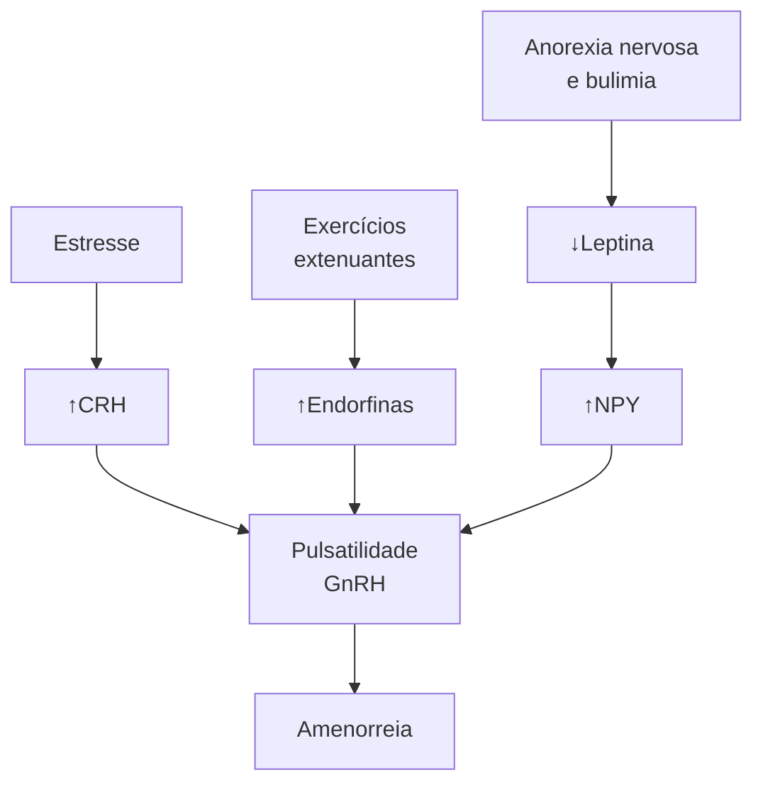

# AMENORREIA SECUNDÁRIA

**Amenorreia secundária:** ausência de menstruação por um período mínimo de 3 meses ou menos de 9 ciclos menstruais no período de um ano (definição FEBRASGO).

**As etiologias são divididas didaticamente em 4 compartimentos, tendo como base a fisiologia do ciclo menstrual:**

I. Uterovaginal: Síndrome de Asherman;
II. Ovário: SOP, IOP, Síndrome de Savage;
III. Hipófise: hiperprolactinemia, Síndrome de Sheehan;
IV. Hipotálamo: amenorreia funcional.

**A investigação diagnóstica pode ser iniciada da seguinte forma:**
- Afastar gestação;
- Dosar FSH: se diminuído, pensar em causas de SNC e solicitar neuroimagem. Se aumentado, pensar em causas ovarianas, mas antes, investigar possíveis alterações nos hormônios prolactina e função tireoidiana.

**O tratamento varia de acordo com a causa, mas sempre considerar evitar as consequências do hipoestrogenismo (saúde óssea, risco cardiovascular), potencial reprodutivo e risco de tumores gonadais.**

## 1. DEFINIÇÃO

### 1.1 CONCEITOS E CONSIDERAÇÕES GERAIS

Amenorreia é um sintoma que caracteriza a ausência de menstruação. Nem sempre precisa ser investigada, visto que existem causas fisiológicas.

### 1.2 CAUSAS FISIOLÓGICAS DE AMENORREIA

Situações em que se espera ausência de menstruação: gestação; amamentação; menopausa.

### 1.3 DEFINE-SE

**De acordo com a FEBRASGO:**
- Ausência de menstruação por um período mínimo de 3 meses OU;
- Menos de 9 ciclos menstruais no período de um ano.

**De acordo com outras referências em Ginecologia:**
- Ausência de menstruação por mais de seis meses (mulheres com ciclos irregulares);
- Ausência de menstruação por mais de três ciclos (mulheres com ciclos regulares);
- Criptomenorreia: falta de exteriorização do fluxo menstrual.

## 2. CICLO MENSTRUAL FISIOLÓGICO

- Para entendermos as causas da amenorreia, é importante relembrar acerca da Fisiologia do Ciclo Menstrual;
- No núcleo hipotalâmico é liberado o GnRH de maneira pulsátil. Á depender do padrão de pulsatilidade do GnRH, vai atuar na hipófise anterior com a liberação de FSH e LH;
- A desaceleração da frequência de pulso do GnRH na fase lútea tardia é uma alteração importante que favorece a síntese de FSH;
- Um aumento na frequência e amplitude da secreção pulsátil de GnRH no meio do ciclo, por sua vez, favorece o aumento de LH que é necessário para ovulação e início da fase lútea;
- O FSH/LH atuam em nível ovariano com a liberação de hormônios esteroides (estrogênio e progesterona) a depender da fase do ciclo ovulatório;
- O estrogênio e a progesterona terão ação sistêmica e no útero, levando ao ciclo menstrual da forma como conhecemos.

**Figura 1** Eixo hipotálamo-hipófise-ovário-útero

[Diagram showing the hormonal axis: GnRH from hypothalamus → Gonadotrofinas: FSH e LH from pituitary → E2 e E4 from ovaries → Útero (endométrio), with Cérvice and Vagina labeled below]

## 3. COMPARTIMENTOS

Alterações na função de cada compartimento deste eixo (hipotálamo-hipófise-ovário-útero/endométrio) resultam em diferentes etiologias de amenorreia.

### 3.1 IV - HIPOTALÂMICO

- O defeito na liberação de GnRH consequentemente leva à diminuição da produção das gonadotrofinas (LH e FSH);
- Culmina no hipogonadismo hipogonadotrófico, já que as gonadotrofinas — LH e FSH — estão baixas.

### 3.2 III - HIPOFISÁRIO

- Com o defeito no funcionamento da hipófise anterior, não ocorre a produção de LH e FSH. Com isso, não ocorre a estimulação gonadal e, consequentemente, não ocorre a produção de estrogênio e progesterona;
- Culmina no hipogonadismo hipogonadotrófico, já que as gonadotrofinas — LH e FSH — estão baixas.

GINECOLOGIA GERAL

## 3.3 II - OVARIANO

• Ocorre por defeito das gônadas, onde, apesar da produção das gonadotrofinas pela hipófise, ou seja, com a secreção adequada de LH e FSH, não ocorre a resposta ovariana esperada;

• É o que leva ao chamado hipogonadismo hipergonadotrófico, já que as gonadotrofinas — LH e FSH — estão aumentadas, como tentativa de estimular a produção ovariana.

## 3.4 I - UTEROVAGINAL

• Em geral, por alteração estrutural ou de via de saída não ocorre a menstruação.

# 4. PRINCIPAIS ETIOLOGIAS DE AMENORREIA SECUNDÁRIA

Gestacional; Lactacional; Menopausa; SOP; Hiperprolactinemia; IOP; Sinéquias intrauterinas; Hipotalâmica.

## 4.1 COMPARTIMENTO ÚTERO-CANALICULAR

### A. Síndrome de Asherman

**FISIOPATOLOGIA:**

• Ocorre a formação de sinéquias intrauterinas secundárias a procedimentos intrauterinos (ex.: curetagens, miomectomia histeroscópica) ou outros processos inflamatórios pélvicos;

• As aderências são compostas por faixas de tecido conjuntivo fibromuscular que podem ou não estar circundadas por epitélio superficial ou tecido glandular.

**CLÍNICA:**

• Dor pélvica, disfunção menstrual, infertilidade, abortos de repetição.

**DIAGNÓSTICO:**

• Definitivo: histeroscopia mostrando a localização e extensão das aderências intrauterinas;

• Todas as dosagens hormonais estão normais, visto que o problema não é gonadal (ovariano), mas canalicular.

**TRATAMENTO:**

• O tratamento envolve a lise de aderências através da realização de histeroscopia.

## 4.2 COMPARTIMENTO OVARIANO

### A. Síndrome dos ovários policísticos:

• Manifesta-se clinicamente com disfunção ovulatória (ciclos menstruais longos ou amenorreia com anovulação), sinais de hiperandrogenismo e presença de ovários com aspecto policístico à ultrassonografia;

• É frequente a associação com síndrome metabólica nessas pacientes;

• Na investigação hormonal, os níveis de LH encontram-se superiores aos de FSH;

• São utilizados os critérios de Rotterdam para diagnóstico;

• É a principal causa de amenorreia secundária anovulatória.

Obs.: a SOP é abordada em detalhes em aula específica à parte.

### B. Insuficiência Ovariana Prematura (IOP)

**DEFINIÇÃO:**

• Perda da função ovariana antes dos 40 anos de idade.

**FISIOPATOLOGIA:**

• Por causas variadas, que incluem defeitos cromossômicos e genéticos, deficiências enzimáticas, processos autoimunes, consequências de radio ou quimioterapia sobre os ovários, infecções ou cirurgias, ocorre a depleção e a disfunção folicular;

• A depleção folicular é a mais comum e pode ser consequência de redução do número inicial de folículos primordiais, aumento da apoptose (atresia folicular acelerada) ou destruição folicular. Na disfunção folicular, há falha na resposta do folículo às gonadotrofinas. Esse mecanismo é mais raro e está associado preferencialmente a deficiências enzimáticas (17α-hidroxilase, 17,20-desmolase, aromatase) e mutações em receptores (FSH, LH, proteína G);

• Pode ainda permanecer como causa idiopática na maioria das vezes.

**Perda de óvulos ao longo da vida (Dinâmica ovariana)**

**Figura 2** Decréscimo folicular ao longo da vida da mulher.

**CLÍNICA:**

• Alteração menstrual tipo oligo/amenorreia por pelo menos 4 meses, não sendo obrigatório apresentar sintomas de hipoestrogenismo, por exemplo fogachos.

Obs.: quando existem causas genéticas para IOP, em geral manifesta-se como amenorreia primária.

**DIAGNÓSTICO:**

• Histórico clínico + dosagem de FSH > 25 mUI/mL (ou > 40 mUI/ml), persistindo esse valor aumentado em duas dosagens com intervalo de 30 dias entre elas;

• A investigação diagnóstica é obrigatória no surgimento de amenorreia anteriormente aos 30 anos de idade, com a realização de:

1. Cariótipo (Síndrome de Turner; cromossomo Y);

2. Pesquisa do X frágil: resulta de uma mutação em determinada região do gene FMR1, que se localiza no cromossomo X. Essa mutação é bastante peculiar e se caracteriza por aumento no número de repetições de trincas de bases (citosina- guanina-guanina). Em meninas é uma causa importante de IOP;

AMENORREIA SECUNDÁRIA                                                                                               3

**3.** Pesquisa de autoanticorpos para investigar uma possível ooforite autoimune: em geral, é secundária a algumas doenças como adrenalite ou pós-caxumba. Nessas situações, há a produção de autoanticorpos contra os ovários.

**TRATAMENTO:**
- Os objetivos do tratamento da IOP são reverter os sintomas e reduzir as repercussões do hipoestrogenismo;
- Envolve principalmente a reposição hormonal para preservar a saúde óssea dessas pacientes e reduzir seu risco cardiovascular;

**C. Síndrome de Savage ou Síndrome de Resistência Ovariana**
- Cariótipo 46 XX.

**FISIOPATOLOGIA:**
- As gônadas são funcionantes, porém não há esteroidogênese por conta de uma mutação em nível de receptor ou pós-receptor das gonadotrofinas, não permitindo a ação destes hormônios.

**CLÍNICA:**
- Ausência de caracteres sexuais secundários;
- Em geral, o que ocorre é uma resistência parcial à manifestação das gonadotrofinas, mais frequentemente, como amenorreia secundária.

**DIAGNÓSTICO:**
- Elevados níveis de gonadotrofinas, sem depleção folicular;
- Avaliação histológica dos ovários: presença de folículos, ausência de infiltrado linfocitário.

**TRATAMENTO:**
- Reposição hormonal;

## 4.3 COMPARTIMENTO HIPOFISÁRIO;

**A. Hiperprolactinemia**

**FISIOPATOLOGIA:**
- Níveis elevados de prolactina alteram a secreção pulsátil do GnRH, interferindo na liberação de gonadotrofinas e na esteroidogênese gonadal. A dopamina é o principal regulador da biossíntese e secreção da prolactina. Diante de níveis elevados de prolactina, ocorre uma elevação reflexa nos níveis de dopamina, que, por sua vez contribui para alteração da função neuronal do GnRH;
- Leva a um hipogonadismo hipogonadotrófico.

**ETIOLOGIAS:**
- Medicamentos: antagonistas dopaminérgicos (metoclopramida, tricíclicos, haloperidol);
- Tumores produtores de prolactina (adenomas hipofisários);
- Hipotireoidismo: o hormônio liberador da tireotrofina (TRH) é um dos mais potentes estimuladores da síntese de prolactina. Sendo assim, quando há hipotireoidismo (com consequente elevação de TSH e TRH), poderá haver hiperprolactinemia;
- Insuficiência renal, levando à redução da depuração do hormônio prolactina e consequente aumento de seu nível circulante.

**CLÍNICA:**
- Galactorreia associada à oligomenorreia e amenorreia;
- É mais frequentemente observada como causa de amenorreia secundária.

**TRATAMENTO:**
- O tratamento é feito com agonistas dopaminérgicos.

**B. Síndrome de Sheehan**

**FISIOPATOLOGIA:**
- Ocorre um pan-hipopituitarismo por necrose hipofisária após hemorragia pós-parto;
- Isso porque, durante a gestação, é comum o ingurgitamento hipofisário. Em caso de sangramento exuberante no parto, ocorre consequentemente uma hipovolemia. A hipófise, que tinha um fluxo sanguíneo aumentado por conta do ingurgitamento gestacional, fica sem irrigação.

**CLÍNICA:**
- Amenorreia, agalactia, perda de pelos pubianos e axilares;
- Manifestações de hipotireoidismo;
- Insuficiência suprarrenal.

**TRATAMENTO:**
- As deficiências hormonais em pacientes com síndrome de Sheehan devem ser tratadas como em qualquer outro paciente com hipopituitarismo;
- Disfunção tireoidiana: levotiroxina;
- Deficiência de gonadotrofinas: reposição de estrogênio e progesterona;
- Déficit corticotrófico: corticoide oral.

## 4.4 COMPARTIMENTO HIPOTALÂMICO

**A. Amenorreia Funcional**

**FISIOPATOLOGIA:**
- Algumas situações como transtornos alimentares, exercícios físicos extenuantes e estresse podem levar à supressão da secreção pulsátil de GnRH, além de reversão da secreção pulsátil do LH para os padrões pré-púberes, com supressão da produção hipofisária de LH e do FSH.

**TRATAMENTO:**
- Guiado pela causa. Exemplo: na anorexia nervosa, a recuperação da nutrição e do peso favorece a resolução da amenorreia.

**Figura 3** Fisiopatologia da amenorreia funcional em esquema.

GINECOLOGIA GERAL

## 5. ROTEIRO DIAGNÓSTICO DE AMENORREIA SECUNDÁRIA

Anamnese e exame físico detalhados

Afastar gravidez

Dosagem de FSH

**Figura 4** Fisiopatologia da amenorreia secundária por alteração no compartimento ovariano em esquema.

FSH alto → Insuficiência ovariana

GnRH

Gonadotrofinas: FSH e LH ↑

E2 e IM ↓

Útero (endométrio)
Cérvice
Vagina

FSH baixo

↓

Disfunção hipotalâmica ou hipofisária

↓

Neuroimagem

↓

Estrutura SNC | Teste GnRH

**Figura 5** Fisiopatologia da amenorreia secundária por alteração em sistema nervoso central, em esquema.

FSH normal

↓

Dosagem de prolactina

↓

Prolactina ALTA

↓

Hiperprolactinemia

**Figura 6** Fisiopatologia da amenorreia secundária por alteração dos níveis de prolactina em esquema.

----

FSH normal

↓

Dosagem de prolactina

↓

Prolactina NORMAL

↓

Dosagem de TSH

↓

TSH alterado

Tireoidopatia

**Figura 7** Fisiopatologia da amenorreia secundária por alteração dos níveis de hormônios tireoidianos em esquema.

FSH Normal → Dosagem de prolactina

↓

Dosagem de TSH ← Prolactina normal

↓

TSH Normal

Teste da progesterona | ⊕ | Anovulação

⊖ | Teste do estrogênio | ⊕

⊖ | Uterovaginal

**Figura 8** Fisiopatologia da amenorreia secundária por alteração em compartimento uterino ou vaginal.

## 6. CONCEITOS GERAIS PARA TRATAMENTO

• O objetivo é o tratamento da causa! Lembre-se: a amenorreia é um sintoma!;
• Elucidação diagnóstica;
• É possível a reversão da causa?
• Evitar as consequências do hipoestrogenismo - pode afetar a saúde óssea e aumentar o risco cardiovascular;
• Avaliar o potencial reprodutivo;
• Avaliar o risco do desenvolvimento de tumores gonadais.
