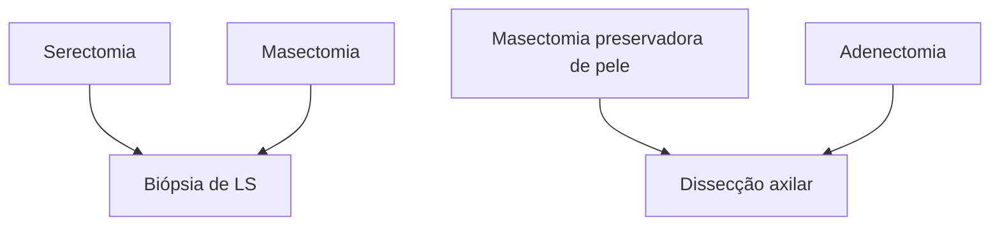
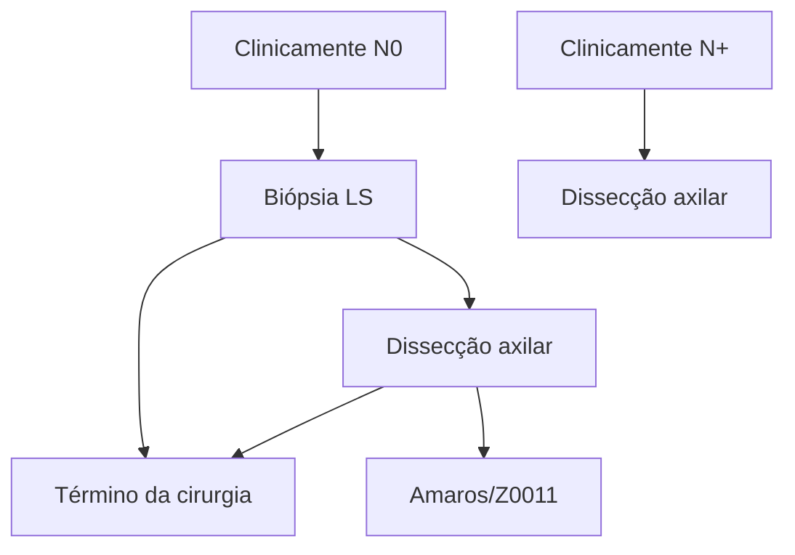

Screening população geral para câncer de mama

# CÂNCER DE MAMA - RASTREAMENTO

## Métodos de rastreamento:
• Autoexame: não é recomendado.
• Mamografia: método de escolha.

### Rastreamento na população geral
• MS e INCA: mamografia a cada 2 anos entre 50 e 69 anos.
• CBR, SBM e FEBRASGO: mamografia anual entre 40 e 74 anos.

### Rastreamento na população de alto risco
• Alto risco histológico:
  • HLA, CLIS ou HDA: risco < 20%: mamografia anual a partir dos 40 anos // risco ≥ 20%: MMG anual (não antes de 30 anos) + considerar RNM anual (não antes dos 25 anos) a partir do diagnóstico;
  • CDIS ou Carcinoma Invasor: MMG anual + RNM anual (se câncer de mama antes dos 50 anos ou com mamas densas).
• Alto risco familiar:
  • Mutação do gene BRCA 1 ou parentes de 1° grau não testadas de portadoras → MMG anual (não antes dos 35 anos) + RNM anual (não antes dos 25 anos) a partir do diagnóstico da mutação;
  • Mutação do gene TP53 ou parentes de 1° grau não testadas de portadoras → MMG anual (não antes dos 30 anos) + RNM anual (não antes dos 20 anos) a partir do diagnóstico da mutação;
• Mutação BRCA 2 ou outros genes de moderado ou alto risco ou parentes de 1° grau não testadas de portadoras → MMG anual (não antes dos 30 anos) + RNM anual (não antes dos 20 anos) a partir do diagnóstico da mutação;
• Mulheres com risco familiar ≥ 20% → MMG anual (não antes dos 30 anos) + RNM anual (não antes dos 30 anos) iniciando 10 anos antes da idade do diagnóstico do parente mais jovem.
• Antecedente de irradiação do tórax entre 10-30 anos: MMG anual (não antes dos 30 anos) + RNM anual (não antes dos 25 anos) a partir do 8° ano após o tratamento.
• Prevenção na população de alto risco:
  • Quimioprevenção: Tamoxifeno, Raloxifeno*, Anastrozol* ou Exemestano* → * somente na pós-menopausa;
  • Cirurgias redutoras de risco (indicadas para síndromes genéticas): mastectomia redutora de risco, salpingooforectomia bilateral (BRCA 1 e 2).

## 1. RASTREAMENTO

### 1.1 POR QUE RASTREAR O CÂNCER DE MAMA?
• Tumor que possui maior incidência e a maior mortalidade na população feminina em todo o mundo;
• O tamanho do tumor e as condições dos linfonodos regionais são fatores prognósticos de grande importância;
• O diagnóstico precoce aumenta as chances de cirurgia conservadora e reduz a necessidade de QT e dissecção axilar.

### 1.2 MÉTODOS DE RASTREAMENTO

**Autoexame**
• Não é recomendado como forma de rastreamento, pois não é capaz de promover o diagnóstico precoce e reduzir a mortalidade por câncer de mama.

**Mamografia**
• Método de escolha para rastreamento;
  • Associação com a tomossíntese, quando disponível;
  • Na tomossíntese a mama também fica comprimida entre as placas do aparelho, assim como na MMG. Porém, ao contrário da MMG em que obtemos apenas uma imagem para cada incidência, na tomossíntese múltiplas imagens em várias angulações são obtidas em uma única compressão da mama.

• A mortalidade por câncer de mama pode ser reduzida pela utilização de programas com rastreamento mamográfico.

### 1.3 QUANDO INICIAR O RASTREAMENTO NA POPULAÇÃO GERAL?
• No Brasil, temos 2 recomendações sobre quando devemos iniciar o rastreamento para o câncer de mama na população geral:
  • Início aos 40 anos (recomendação da SBM, FEBRASGO e CBR);
  • Início aos 50 anos (recomendação do ministério da saúde e INCA).

**Tabela 1** "Prós" e "contras" em se iniciar o rastreamento aos 40 anos"

| "Prós"                                                                                                  | "Contras"                                                    |
| ------------------------------------------------------------------------------------------------------- | ------------------------------------------------------------ |
| • O início do rastreamento aos 40 anos reduz em 25% a mortalidade em 10 anos por câncer de mama;        | • Falso Positivos (aumenta o falso-positivo de 4,8% para 7%) |
| • No Brasil, 41,1% das mulheres com diagnóstico de câncer da mama têm menos de 50 anos (Estudo AMAZONA) | • Sobrediagnóstico
• "Risco da radiação ionizante"       |

Tabela adaptada de: Simon SD, Bines J, Werutsky G, et al. Characteristics and prognosis of stage I-III breast cancer subtypes in Brazil: the AMAZONA retro- spective cohort study. Breast. 2019;44:113–9.

MASTOLOGIA

![Diagram showing how tomosynthesis imaging is obtained, with labels for "Ampola de Raios-X" (X-ray tube), "Raios-X" (X-rays), "Placa de Compressão" (Compression plate), "Mama" (Breast), and "Detector". The right side shows comparison images labeled a, b, and c showing mammography and tomosynthesis images.]

**FIGURA 1** Imagem mostrando como é obtida a imagem por tomossíntese Na imagem a direita temos a comparação entre a imagem obtida na mamografia (a) e na tomossíntese (b). À esquerda, mama com maio densidade glandular que à direita.

**Mulheres < 40 anos**
- Não é recomendado o rastreamento nesse grupo etário (exceto se alto risco);
- Incidência do câncer de mama em mulheres em < 40 anos → 7% dos casos, no Brasil 17% (AMAZONA III);
- Avaliação do risco de câncer de mama para todas as mulheres acima de 30 anos (modelos matemáticos) → estratificação do risco → rastreamento diferenciado para pacientes de alto risco.

## 1.4 RECOMENDAÇÕES PARA O RASTREAMENTO NO BRASIL

**Recomendações do Colégio Brasileiro de Radiologia e Diagnóstico por Imagem, da Sociedade Brasileira de Mastologia e da Febrasgo 2023**

- **Mulheres 40 – 74 anos**
  - MAMOGRAFIA – todas as mulheres, com periodicidade anual
  - USG – não recomendada para rastreamento;
  - RNM – Mulheres com alto risco para câncer de mama
- **Mulheres < 40 anos**
  - MAMOGRAFIA – não se recomenda a realização da mamografia, exceto em mulheres com alto risco
  - RNM – Mulheres com alto risco para câncer de mama
- **Quando parar o rastreamento?**
  - A partir dos 75 anos, recomenda-se continuar o rastreamento se não houver comorbidades que reduzam a expectativa de vida e que essa seja de pelo menos sete anos.
- **Ultrassonografia**
  - Não se recomenda a USG como rastreamento suplementar ou como método isolado para mulheres com risco habitual;
  - O uso da US é considerado em situações específicas de maior risco (mamas densas, risco intermediário e alto risco).

**• Ressonância magnética**
  - Não se recomenda a RNM como rastreamento suplementar ou como método isolado para mulheres com risco habitual;
  - O uso da RM é considerado em situações específicas de maior risco.

**Recomendações Ministério da Saúde e INCA**
- **Mulheres < 49 anos**
  - Não recomenda rastreamento
- **Mulheres 50-69 anos**
  - Mamografia a cada 2 anos
- **Mulheres > 70 anos**
  - Não recomenda rastreamento **Tabela 2**

## 2. POPULAÇÃO DE ALTO RISCO

- 75-80% dos cânceres de mama ocorrem em mulheres sem fator de risco;
- 10% dos tumores são hereditários;
- 10-15% possuem história familiar positiva (familial).

### 2.1 ALTO RISCO HISTOPATOLÓGICO

- Lesões precursoras do câncer de mama
  - Associadas com a transformação local para carcinoma
- Lesões marcadoras de alto risco
  - Associada à probabilidade aumentada de surgimento de câncer no mesmo órgão ou contralateral.

CÂNCER DE MAMA - RASTREAMENTO                                                                                             3

**Tabela 2** Recomendações para o rastreamento do câncer de mama de acordo com diferentes sociedades

| Entidade           | Início                                                            | Intervalo                                             | Término                                            |
| ------------------ | ----------------------------------------------------------------- | ----------------------------------------------------- | -------------------------------------------------- |
| CBR; SBM; FEBRASGO | 40 anos                                                           | Anual                                                 | Expectativa de vida de 7 anos                      |
| UPSTF              | 50 anos
Entre 40-49 anos decisão
deve ser individualizada | Bienal                                                | 74 anos                                            |
| ACR; SBI           | 40 anos                                                           | Anual                                                 | Sem data limite
Considerar expectativa de vida |
| ACOG               | 40 anos                                                           | Anual ou Bienal                                       | 75 anos; após decisão deve ser
compartilhada   |
| ACS                | 45 anos (pode começar
aos 40 anos)                            | < 54 anos - Anual
≥ 55 anos - Bienal ou
anual | Expectativa de vida de 10 anos                     |

**Siglas presentes na tabela**

CBR: Colégio Brasileiro de Radiologia e diagnóstico por imagem; SBM: Sociedade Brasileira de Mastologia; FEBRASGO: Federação Brasileira das Associações de Ginecologia e Obstetrícia; UPSTF: United States Preventive Services Task Force; ACR: American College of Radiology; SBI: Society of Breast Imaging; ACOG: American College of Obstetricians and Gynecologists e ACS: American Cancer society.

Tabela adaptada de: Frasson, AL et al. Doenças da mama: guia de bolso baseado em evidências 2 ed. Rio de Janeiro: Atheneu, 2018.

**Tabela 3** Aumento do risco relativo para câncer de mama para cada lesão precursora

|                                 | RR    |
| ------------------------------- | ----- |
| Hiperplasia ductal atípica      | 4-5x  |
| Hiperplasia lobular atípica     | 4-5x  |
| **Carcinoma lobular *in situ*** | 8-10x |

## 2.2 ALTO RISCO FAMILIAR

• Portadoras de mutação BRCA 1 ou 2 e suas parentes de primeiro grau não testadas;

• Risco de câncer de mama ≥ 20% (porcentagem obtida por meio de calculadoras/modelos matemáticos);
• Antecedente de irradiação do tórax entre 10-30 anos;
• Portadoras de síndromes genéticas **Tabela 4**

**Figura 2** Mutações genéticas que resultam em aumento do risco de câncer de mama

| BRCA | PTEN |
| ---- | ---- |
| p53  | CDHI |

...

**Tabela 4** Principais síndromes hereditárias associadas ao alto risco de câncer de mama

| SÍNDROME                                  | GENE       | RISCO AOS 70 ANOS | TUMORES ASSOCIADOS                                                         |
| ----------------------------------------- | ---------- | ----------------- | -------------------------------------------------------------------------- |
| HBOC                                      | BRCA1      | 55%               | Ovário e pâncreas                                                          |
| HBOC                                      | BRCA2      | 47%               | Ovário, próstata e pâncreas                                                |
| Li-Fraumeni                               | p53        | > 90%             | Sarcoma de partes moles, osteossarcoma, SNC,
adrenal, leucemia e cólon |
| Cowden                                    | PTEN       | 25-50%            | Tireóide, endométrio e genitourinário                                      |
| Peutz-Jeghers                             | STK11/LKB1 | 45-54%            | Intestino, útero, testículo, cordões sexuais                               |
| Carcinoma gástrico
difuso hereditário | CDH10      | 39%               | CLI e carcinoma gástrico difuso                                            |
| Ataxia-telengectasia                      | ATM        | RR: 3-4X          | não definido                                                               |
| Variante Li-Fraumeni                      | CHEK2      | RR: 2X            | não definido                                                               |

Tabela adaptado de: Frasson, AL et al. Doenças da mama: guia de bolso baseado em evidências 2 ed. Rio de Janeiro: Atheneu, 2018.

## 2.3 RASTREAMENTO NA POPULAÇÃO DE ALTO RISCO

### História pessoal de HLA, CLIS ou HDA

**• Calcular o risco para câncer de mama:**
  - Risco < 15% (risco habitual) – rastreamento com MMG a partir dos 40 anos;
  - Risco 15–20% (risco intermediário): MMG anual a partir dos 40 anos. Considerar USG como adjunta a MMG;
  - Risco > 20% (alto risco) –MMG anual a partir do diagnóstico (não antes dos 30 anos) + RNM anual (não antes dos 25 anos.

| Risco ≥ 20%: alto risco (MMG + RNM)
Risco 15–20%: risco intermediário
Risco < 15%: risco habitual |
| --------------------------------------------------------------------------------------------------------- |

### História pessoal de radioterapia torácica

**• Mamografia – anual**
  - Mulheres com história de irradiação no tórax antes dos 30 anos → MMG anual a partir do 8° ano após o tratamento (não antes dos 30 anos)

**• RNM – anual**
  - Mulheres com história de irradiação no tórax antes dos 30 anos → RNM anual a partir do 8° ano após o tratamento (não antes dos 25 anos)

### Mulheres portadoras de mutação genética ou com forte história familiar de câncer de mama (risco ≥ 20%)

**• Mamografia – anual**
  - Mutação do gene BRCA 1 ou não testadas mas com parentes de 1° grau portadoras → MMG a partir do diagnóstico da mutação (não antes dos 35 anos)
  - Mutação do gene TP53 ou não testadas mas com parentes de 1° grau portadoras, → MMG a partir do diagnóstico da mutação (não antes dos 30 anos)
  - Mutação BRCA 2 ou outros genes de moderado ou alto risco para câncer de mama, além das não testadas mas com parentes de 1° grau portadoras → MMG a partir do diagnóstico da mutação (não antes dos 30 anos)
  - Mulheres com risco ≥ 20% → MMG iniciando 10 anos antes da idade do diagnóstico do parente mais jovem (não antes dos 30 anos)

**• RNM – anual**
  - Mutação do gene BRCA 1 ou não testadas mas com parentes de 1° grau portadoras→ RNM a partir do diagnóstico da mutação (não antes dos 25 anos)
  - Mutação gene TP53 ou não testadas mas com parentes de 1° grau portadoras, →RNM a partir do diagnóstico da mutação (não antes dos 20 anos)
  - Mutação patogênica BRCA2 ou outros genes de moderado ou alto risco para câncer de mama, além das não testadas mas com parentes de 1° grau portadoras → RNM anual a partir do diagnóstico da mutação (não antes dos 30 anos)
  - Mulheres com risco ≥ 20% → RNM anual iniciando 10 anos antes da idade do diagnóstico do parente mais jovem (não antes dos 30 anos)

## 2.4 ESTRATÉGIAS DE PREVENÇÃO PARA A POPULAÇÃO DE ALTO RISCO

### Quimioprevenção
- Tamoxifeno
- Raloxifeno (pós-menopausa)
- Anastrozol ou Exemestano (pós-menopausa)

### Cirurgias redutoras de risco (indicadas para síndromes genéticas)
- Mastectomia redutora de risco
- Salpingooforectomia bilateral (BRCA 1 e 2)

# REFERÊNCIAS

**Figura 1 Imagem mostrando como é obtida a imagem por tomossíntese**

Na imagem a direita temos a comparação entre a imagem obtida na mamografia (a) e na tomossíntese (b). à esquerda, mama com maio densidade glandular que à direita

Vilaverde el al. Tomossintese Mamária: O que o radiologista deve saber. ACTA RADIOLÓGICA PORTUGUESA. 2016.

# CÂNCER DE MAMA - FATORES DE RISCO E CDIS

## FATORES DE RISCO

• Idade, sexo feminino
• Menarca precoce, Menopausa tardia, Nuliparidade ou 1° parto >35 anos, Ausência de lactação, TRH
• Familiar 1° grau câncer de mama, câncer de mama na pré-menopausa, casos no sexo masculino, câncer de ovário
• Origem judaica Asquenazi
• Lesões proliferativas de alto risco (HDA, HLA, CLIS, CDIS)
• Síndrome metabólica, obesidade, sedentarismo, ingestão de álcool

## CDIS

• Proliferação de células neoplásicas dentro dos ductos, SEM ruptura da membrana basal.

• TRATAMENTO → Cirurgia (setorectomia ou mastectomia) +/- Radioterapia (se setorectomia) +/- Hormonioterapia (se RH+)
• BLS só se mastectomia (considerar se lesão palpável, >4 cm, comedonecrose)

## PAGET

• QC: prurido, eczema e crosta no mamilo muito associado a CDIS/Carcinoma invasor
• TTO: exérese da lesão com margem + tratamento de acordo com lesão associada

## 1. FATORES DE RISCO

### 1.1 SEXO E IDADE:

• Sexo feminino é o principal fator de risco;
• Idade (o avançar da idade está associada a um aumento do risco).

### 1.2 FATORES HORMONAIS:

• Menarca precoce;
• Menopausa tardia;
• Nuliparidade ou primeiro parto > 35 anos;
• Ausência de lactação;
• TRH (terapia de reposição hormonal).

### 1.3 HEREDITARIEDADE:

• Mãe ou irmã com câncer de mama, isto é, principalmente parentes de primeiro grau;
• Câncer de mama na pré-menopausa;
• Casos no sexo masculino;
• Câncer de ovário.

### 1.4 OUTROS:

• Origem judaica Asquenazi.
• Lesões proliferativas de alto risco (lesões precursoras)

| Lesões proliferativas de alto risco | RR      |
| ----------------------------------- | ------- |
| Hiperplasia ductal atípica          | 4 - 5x  |
| Hiperplasia lobular atípica         | 4 - 5x  |
| Carcinoma lobular in situ           | 8 - 10x |

• Síndrome Metabólica e Obesidade;
• Ingestão alcoólica.
• A atividade física regular diminui o risco.

## 2. CARCINOMA DUCTAL IN SITU (CDIS)

### 2.1 CARCINOMA DUCTAL IN SITU (CDIS):

• Proliferação de células neoplásicas dentro dos ductos, SEM ruptura da membrana basal.
• Faz parte das lesões precursoras do câncer de mama;
• Alteração histológica semelhante a da hiperplasia ductal atípica, porém em maior extensão.
• Confira na página seguinte a Figura 1

### 2.2 PORQUE TRATAR?

• É uma lesão precursora → 14 - 46% evoluem para câncer de mama em 10 anos (se não tratados);
• Risco de subestimação 20% (Na biópsia era CDIS mas após retirada da lesão na realidade era um carcinoma invasivo);
• Recidiva local → 30-50% das recidivas são tumores invasores.

### 2.3 DIAGNÓSTICO:

• Grande maioria diagnosticada nos exames de rastreamento;
• Principal apresentação: microcalcificações irregulares

### 2.4 PREDITORES DE LESÃO INVASORA:

• Comedonecrose
• Lesão palpável
• Microcalcificações extensas (> 4cm)

### 2.5 TRATAMENTO:

**Cirurgia:**
• Setorectomia ou mastectomia;
  • Margem ≥ 2mm
  • Biópsia do linfonodo sentinela:
    • Não é recomendada de rotina;

• Considerar nas pacientes de alto risco de subestimação);
• Realizar nas pacientes submetidas a mastectomia.

**Radioterapia**
• Reduz em 50% as recidivas locais;
• Realizada após a cirurgia apenas nas pacientes

submetidas a setorectomia; não é necessário nas pacientes submetidas a mastectomia.

**Hormonioterapia (se receptor hormonal positivo)**
• Tamoxifeno ou inibidores de aromatase;
• Tratamento padrão de 5 anos;
• Reduz recidiva local e contralateral.

**Figura 1** Imagem mostrando a diferença em nível de arranjo arquitetural das células desde o ducto normal até o desenvolvimento do carcinoma invasor. Nota-se que a diferença entre o entre o CDIS e o carcinoma ductal invasivo é o rompimento da membrana basal. Da esquerda para a direita: ducto normal; hiperplasia ductal; hiperplasia ductal atípica; CDIS; carcinoma invasor

## 3. DOENÇA DE PAGET

• 1 a 3% das neoplasias malignas de mama

### 3.1 QUADRO CLÍNICO:
• Prurido e eczema no mamilo;
• Crosta → ulceração;

**Figura 2** Doença de Paget
• Associado a carcinoma invasor e CDIS em 82-94%;
• Maior tendência de ter grau histológico elevado, ser receptor hormonal negativo e HER2 positivo;
• Nódulo associado em > 50% dos casos.

### 3.2 DIAGNÓSTICO:
• Anatomopatológico (punch ou core);
• Mamografia + ultrassonografia de mamas.

### 3.3 TRATAMENTO:
• Retirada da lesão com margem (setor central ou mastectomia);
• Terapia adjuvante: depende da associação com CDI/CDIS.

# REFERÊNCIAS

**Figura 2** Doença de Paget

Cirqueira MB et al. Rev Bras Mastologia. 2015;25(3):90-6

# CÂNCER DE MAMA DOENÇA INVASIVA

**Ca invasivo sem outras especificações (=CDI)** - mais comum

**Ca lobular invasivo** - multicêntrico e bilateral (pedir RNM)

**Classificação IHQ→**
- **LUMINAL A** (RH +, HER2 -, Ki67 < 14%);
- **LUMINAL B** (RH +, HER2 -, Ki67 > 14%);
- **HER 2** (RH -, HER2 +);
- **LUMINAL HÍBRIDO** (RH +, HER2 +);
- **TRIPLO NEGATIVO** (RH -, HER2 -).

**Tratamento**
- CIRURGIA: Mama (setor X mastectomia) e Axila

(BLS x dissecção axilar)
- T. SISTÊMICO (neo ou adjuvante)
- Luminais: Hormonioterapia sempre (TMX ou Inib aromatase), QT pode ser necessária (Painéis multigênicos podem reduzir a indicação de QT em tumores de biologia favorável)
- HER 2: anti HER2+ sempre (ex: trastuzumabe/ pertuzumabe) + QT
- Triplo Negativo: QT
- RADIOTERAPIA: após cirurgia conservadora SEMPRE; após mastectomia se T3/T4 ou > Ln+

## 1. CLASSIFICAÇÃO

### 1.1 HISTOPATOLÓGICA:

**Carcinoma invasivo sem outras especificações (SOE) (antes chamado de carcinoma ductal invasivo).**
- Tipo histológico mais comum (até 75%);
- Na maioria das vezes se apresenta como nódulo espiculado;
- Prognóstico está relacionado com: Grau histológico; Tamanho; Linfonodos acometidos; Positividade para RH (receptor hormonal) e HER2.

**Carcinoma lobular invasivo:**
- 5 - 15% dos casos;
- Associado a multicentralidade e bilateralidade;
- Costuma ser uma massa tumoral mal delimitada, irregular;
- 70-95% → RH+ e HER2-;
- Clássico X Pleomórfico:
  - Clássico → menos metástase linfonodal e mais metástase à distância para locais não usuais, como TGI, ginecológico, leptomeninges e ossos.
  - Pleomórfico → pior prognóstico.

**Carcinoma tubular:**
- 2% dos casos;
- Grupo etário mais velho;
- Excelente prognóstico.

**Carcinoma com achados medulares:**
- 1% dos casos;
- Apresenta-se como nódulo circunscrito → pode confundir com tumor benigno;
- RH (receptor hormonal = RE e RP) negativo e HER2 negativo (triplo negativo);
- Melhor prognóstico que SOE.

**Carcinoma mucinoso:**
- 2% dos casos;
- Pacientes mais velhas;
- Maioria RE + ( receptor de estrogênio);
- Bom prognóstico.

**Carcinoma metaplásico:**
- < 1 % dos casos;
- Metástase normalmente via hematogênica;

### 1.2 IMUNO-HISTOQUÍMICA:

**LUMINAL A:**
- Muito sensível à hormonioterapia;
- Melhor prognóstico;
- Mais comum (40%).
- Positivo para RE (receptor de estrogênio) / RP (receptor de progesterona)
- Negativo para HER2;
- Ki67 baixo (< 14%) → usado para classificar o índice de proliferação do tumor. Ou seja, o luminal A prolifera pouco.

**LUMINAL B:**
- Positivo para RE e RP.
- HER2 negativo;
- A diferença para o luminal A é que o Ki67 é > 14%. Logo, o luminal B prolifera mais (= mais agressivo).

**LUMINAL HÍBRIDO (ou luminal HER):**
- RE e RP positivo.
- HER2: positivo.
- Ki67: qualquer (não utilizado para classificar esse grupo).

OBS: sempre que tem "luminal" no nome, é porque o tumor possui receptor hormonal positivo.

**TRIPLO NEGATIVO:**
- RE / RP - ; HER2 - ;
- Ki67 qualquer (não utilizado para classificar esse grupo).

**HER2 +:**
- RE / RP - ; HER2 + ;
- Ki67 qualquer (não utilizado para classificar esse grupo).

- RH- / HER2 - (triplo negativo);
- Prognóstico ruim.

## 2. ESTADIAMENTO

### 2.1 CLASSIFICAÇÃO TNM (CHAMADO DE ESTADIAMENTO ANATÔMICO):
- Tamanho (do tumor);
- Linfonodos (acometidos);

• Metástase.

**Tabela 1 Classificação por tamanho do tumor**

| Tis | Carcinoma ductal in situ                                                                                                                                      |
| --- | ------------------------------------------------------------------------------------------------------------------------------------------------------------- |
| T1  | Tumor ≤ 2 cm                                                                                                                                                  |
| T2  | Tumor 2-5 cm                                                                                                                                                  |
| T3  | Tumor > 5 cm                                                                                                                                                  |
| T4a | Extensão para parede torácica, independente do tamanho                                                                                                        |
| T4b | Edema, ulceração e/ou nódulos cutâneos da pele da mama
Pele em "casca de laranja" ("peau d'orange") que não preenche critério para carcinoma inflamatório |
| T4c | T4a + T4b                                                                                                                                                     |
| T4d | Carcinoma inflamatório ("casca de laranja"em > ¹/₃ da pele da mama)                                                                                           |

O **carcinoma lobular in situ** não entra no estadiamento, pois é considerado uma lesão precursora. O **carcinoma lobular invasivo** é câncer e entra no estadiamento assim como os demais tipos de câncer de mama.

**Tabela 2 Classificação por linfonodos**

| N  | Descrição                                                                                                                     |
| -- | ----------------------------------------------------------------------------------------------------------------------------- |
| N0 | Ausência de metástases em Ln axilar                                                                                           |
| N1 | Ln(s) axilar ipsilateral MÓVEL                                                                                                |
| N2 | Ln(s) axilar ipsilateral FIXO ou Lns COALESCENTES;
Ln(s) mamário interno ipsilateral (na ausência de acometimento axilar) |
| N3 | Ln(s) supra ou infraclavicular ipsilateral
Ln(s) mamário interno ipsilateral + Ln(s) axilar                               |

**Tabela 3 Classificação por metástase**

| M  | Descrição                          |
| -- | ---------------------------------- |
| M0 | Ausência de metástases a distância |
| M1 | Metástase a distância              |

Os sítios de acometimento mais comuns de metástases da mama são pulmão, ossos, fígado e SNC.

## 2.2 ESTADIAMENTO PROGNÓSTICO (LEVA EM CONSIDERAÇÃO O TNM E OUTROS FATORES:

• Grau histológico;
• TNM;
• Positividade ou não para: RE; RP; HER2;
• Resultados de painéis multigênicos.

## 2.3 PAINÉIS MULTIGÊNICOS:

• É pesquisado no tumor.
• Classifica o tumor como de biologia favorável ou desfavorável.

**Apenas para tumores luminais mais precoces, isto é:**
• T1-T2 N0 M0;
• RH positivo;

• Her2 negativo.

Os tumores podem ter um Downstaging quando são tumores de biologia favorável, ou seja, apenas pelo estadiamento anatômico, seriam considerados mais agressivos.

• Testes:
  • Oncotype Dx (nível I) → avalia 21 genes. Validado pelos estudos TAILORX e RxPONDER;
  • Outros: Mammaprint, BCI e EndoPredict. O MammaPrint avalia 70 genes e foi validado pelo estudo MINDACT.
• Qual o benefício desse teste? Os tumores luminais de biologia favorável mostram resposta similar entre o tratamento com QT + hormonioterapia e apenas hormonioterapia. Assim, é possível oferecer um tratamento menos agressivo (sem QT) com o desfecho similar.
• Assim, o impacto positivo dos painéis multigênicos é calcular o risco de recidiva e predizer o benefício da QT adjuvante → possibilitando reduzir indicação de QT para pacientes que não se beneficiaram dela.

## 3. TRATAMENTO

### 3.1 BASEADO EM 3 PILARES PRINCIPAIS:

• Cirurgia.
• Tratamento sistêmico.
• Radioterapia.

### 3.2 CIRURGIA:

**Tratamento locorregional:**

• Objetivo: Erradicar localmente as células-tronco iniciadoras do câncer; Fornecer informação complementar para o prognóstico, através da peça cirúrgica.

**A cirurgia se divide em abordagem na mama e abordagem na axila.**

• Abordagem da mama pode ser
  Conservadora → setorectomia.
  • Mastectomia clássica: retira tecido glandular, pele e complexo areolopapilar (CAP);
  • Mastectomia preservadora de pele: retira tecido glandular e CAP, porém preserva pele, ajudando nas reconstruções;
  • Adenectomia (cirurgia preservadora de CAP): retira apenas o tecido glandular - preserva a pele e o complexo areolopapilar.
• Abordagem axilar: Biópsia do linfonodo sentinela (BLS); Dissecção axilar.
• Confira Figura 1

**Cirurgia axilar:**

• Dissecção axilar x Linfonodo sentinela: Inicialmente o tratamento cirúrgico da axila sempre incluía a retirada de todos os Ln axilares, visando tratamento + avaliação prognóstica + guiar decisão terapêutica; Atualmente em muitos casos isso pode ser obtido somente com a BLS.
• Abordagem axilar: Linfonodo sentinela (LS) → primeiro linfonodo a drenar o fluxo linfático da região tumoral, determinado por radioisótopo (tecnécio) ou injeção

CÂNCER DE MAMA - DOENÇA INVASIVA                                                                                             3

de corante (azul patente). Se o LS estiver acometido, não há garantia de que os demais linfonodos não estejam, sendo necessária a dissecção axilar.

• Confira Figura 2
• O estudo Amaros/Z0011 advoga sobre não fazer a dissecção axilar em LS positivo em casos selecionados.

**Figura 1** Esquema ilustrativo sobre tratamento do câncer de mama: inclui tanto a abordagem mamária quanto a axilar.

**Figura 2** Abordagem axilar no câncer de mama.

## 3.3 TRATAMENTO SISTÊMICO:

**Pode ser realizado em dois regimes:**
• Neoadjuvante: antes da cirurgia.
• Adjuvante: após a cirurgia.

**Neoadjuvante:**

Sua vantagem está na possibilidade de:
• Diminuir volume tumoral.
• Avaliar a resposta tumoral in vivo;
• Aumentar a chance de cirurgia conservadora;
• Realizar o tratamento de micrometástases subclínicas;
• Guiar adjuvância.

**Adjuvante:**
• Sua vantagem está na possibilidade de controlar doença microscópica circulante e diminuir recidiva local e a distância.

**Modalidades de tratamento sistêmico disponíveis:**
• Quimioterapia;
• Hormonioterapia;
• Terapia anti HER2;
• Outros: ex. Imunoterapia.

**Existem tratamentos sistêmicos utilizados para cada tipo de tumor**

**Tumores Luminais → pode fazer:**
• Quimioterapia (QT): Painéis multigênicos podem reduzir indicação de QT.

• Hormonioterapia(HT): SEMPRE indicada no tratamento de tumores luminais. Pode ser realizado a partir de: Inibidor de aromatase (Anastrozol, Letrozol e Exemestano) → utilizados apenas na pós-menopausa. Tamoxifeno → utilizado na pré ou pós-menopausa.
• Opções mais recentes: Olaparib (estudo OlympiA) → mutação BRCA e alto risco. Abemaciclibe (estudo monarchE) → pacientes de alto risco.

**Tumores HER2+ (17% dos tumores);**
• Quimioterapia.
• Terapia anti-HER2 (todos recebem independente do estadiamento): TRASTUZUMABE; PERTUZUMABE; T-DM1; TDx; LAPATINIBE; TUCATINIBE.
• Nos tumores T1a/bN0 (iniciais) podem começar com a cirurgia upfront, seguida de terapia adjuvante (terapia anti-HER2 associada à QT);
• Nos tumores ≥ T2 e/ou N+: Começa com QT neo + anti-HER2 (o Trastuzumabe associado ou não ao Pertuzumabe). Quando Trastuzumabe e Pertuzumabe estão associados, chama-se duplo bloqueio. Posteriormente, realiza-se cirurgia e análise da peça cirúrgica. Se houver doença residual, relata-se que não foi obtida uma Resposta Patológica Completa (RPC). Na ausência de RPC, pode-se associar o TDM1 (14 ciclos), adjuvante.
• As drogas anti-HER2 mudam positivamente o desfecho, mas a desigualdade de acesso às opções terapêuticas ainda é um problema que impacta no prognóstico, infelizmente.

**Figura 3** Tumor HER 2 +

**Tumor Triplo negativo (15% dos casos):**
• Maior incidência em: < 40 anos; Pré-menopausa; Ascendência africana; BRCA 1 ou 2 positivo.
• Piores desfechos.
• Quimioterapia (basicamente a única opção terapêutica a oferecer):
  • < 1 cm → cirurgia seguida de QT adjuvante;
  • > 1 - 2 cm → começa com QT neoadjuvante (opção mais recente é associar pembrolizumabe à QT em regime neoadjuvante em tumores estádio II/III - não disponível no SUS) → em seguida, realiza-se a cirurgia. Ausência de RPC: Iniciar Capecitabina (estudo CREATE-X), quando disponível, em regime adjuvante; (costuma não estar disponível no SUS com essa finalidade). Se BRCA → iniciar Olaparibe (OlympiA) em regime adjuvante (não disponível no SUS).

## 3.4 RADIOTERAPIA (RT):

• A radioterapia pode ser realizada no cenário curativo (não metastático) ou metastático.

**No cenário curativo:**

• Indicações: Sempre indicada após cirurgia conservadora; Após mastectomia em casos mais avançados, como T3/T4 ou > Ln+;

• No cenário metastático –objetivos: Alívio de sintomas; Controle de progressão de doença local/ oligometastática.

**Figura 4** Ilustração da realização de radioterapia em mama.
