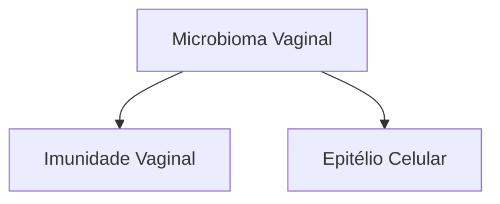

# CORRIMENTOS VAGINAIS

## Microbioma vaginal → pH ácido (3,8 - 4,5) + predomínio de Lactobacilos

• Fluxograma Corrimentos Vaginais

| Anamnese, exame físico, pH vaginal |                              |
| ---------------------------------- | ---------------------------- |
| pH < 4,5                           | pH > 4,5                     |
| ↓                                  | ↓                            |
| Mucoide → Corrimento fisiológico   | Odor fétido e Whiff positivo |
| ↓                                  | ↓                            |
| Prurido + corrimento grumoso       |                              |
| Microscopia                        |                              |
| ↓                                  | ↓                            |
| Hifas e Leveduras                  | Aumento de lactobacilos      |
| Candidíase                         |                              |
|                                    | Vaginose citolítica          |

| Anamnese, exame físico, pH vaginal |                         |                                                    |   |
| ---------------------------------- | ----------------------- | -------------------------------------------------- | - |
| pH > 4,5                           |                         |                                                    |   |
| ↓                                  |                         |                                                    |   |
| Odor fétido e Whiff positivo       |                         |                                                    |   |
| ↓                                  |                         |                                                    |   |
| Sim                                |                         | Não                                                |   |
| Exame a fresco                     |                         | Exame a fresco: células inflamatórias              |   |
| Clue Cells                         | Protozoários flagelados | Vaginite Aeróbia/Vaginite Inflamatória Descamativa |   |
| Vaginose Bacteriana                | Tricomoníase            |                                                    |   |

## 1. CONCEITOS GERAIS

### 1.1 EQUILÍBRIO VAGINAL

• Depende de 3 fatores:

**Figura 1** Fatores determinantes do equilíbrio vaginal.

### 1.2 MICROBIOMA VAGINAL

• Diz respeito ao conjunto de microrganismos que vivem em um ambiente, bem como às suas relações entre si e com outros patógenos e as influências em relação aos fatores ambientais;

• Conteúdo vaginal fisiológico:
  • É composto por: Água; Muco cervical; Células vaginais e cervicais foliadas.
  • O conteúdo é formado por um transudato dos vasos locais, contendo eletrólitos, proteínas e células de defesa.

• Observe a imagem a seguir:
  • Célula típica normal do epitélio vaginal;
  • Grande, poliédrica, com núcleo relativamente pequeno;
  • Formas de bastonetes roxos → lactobacilos gram positivos.

**Figura 2** Visualização de uma célula epitelial vaginal através do método de coloração de Gram.

### 1.3 MICROBIOTA VAGINAL

• A microbiota vaginal é uma comunidade dinâmica, com diferentes microrganismos, sendo, na grande maioria das vezes, dominado por uma ou duas espécies de Lactobacillus, sendo os mais frequentes Lactobacillus inner, Lactobacillus crispatus, Lactobacillus gasseri ou Lactobacillus jensenii.

**Tabela 1** Principais componentes da microbiota vaginal.

| Principais componentes | Principais componentes  | Principais componentes                                                                                            |
| ---------------------- | ----------------------- | ----------------------------------------------------------------------------------------------------------------- |
| **Bactérias**          | Aeróbias                | Lactobacillus spp;
Staphylococcus aureus
S. epidermidis
Streptococcus agalactiae
Escherichia coli |
|                        | Anaeróbias facultativas | Gardnerella vaginalis                                                                                             |
|                        | Anaeróbias estritas     | Prevotella
Bacteroides
Ureaplasma urealyticum
Mycoplasma hominis                                      |
|                        |                         |                                                                                                                   |
| **Fungos**             | Candida sp.             |                                                                                                                   |

• Toda a microbiota vive em um ambiente dinâmico, sofrendo influência de inúmeros fatores, sendo o status hormonal um importante fator:
• Status hormonal;
  • Em vida reprodutiva, há níveis elevados do hormônio estrogênio: Garante a espessura do epitélio vaginal. Dessa forma, garante o trofismo vaginal, com predomínio de células superficiais; Ainda, estimula o depósito de glicogênio nas células.

OBS.: O glicogênio é a matéria-prima de lactobacilos que o quebrarão, transformando-o em ácido láctico. O ácido láctico desempenha papel na imunidade vaginal e na manutenção dos níveis adequados de pH.

  • Na menopausa, em cenários de hipoestrogenismo, há menor trofismo vaginal, com predomínio de células basais.

## 1.4 OUTROS FATORES QUE INFLUENCIAM NA MICROBIOTA VAGINAL

• **Idade da paciente:** menacme (pH vaginal entre 3,8 – 4,5: Há maior riqueza e abundância de microbiota); infância e menopausa: há menor riqueza e abundância de microbiota; infância (pH ~7,0); menopausa (pH entre 5,0 – 7,5).
• Prática sexual;
• Medicamentos;
• Higiene íntima.

## 1.5 COMUNIDADES VAGINAIS

• O gênero Lactobacillus domina o microambiente vaginal;
• Contudo, a microbiota pode ser dividida em comunidades vaginais (CST = community state types), de 5 tipos;
• **Tipo I:** Lactobacillus crispatus;
• **Tipo II:** Lactobacillus gasseri;
• **Tipo III:** Lactobacillus iners (Estimula uma produção reduzida de ácido láctico; Logo, o pH vaginal não é tão ácido; Assim, predispõe ao surgimento de quadros de vulvovaginites ou vaginose bacteriana.);
• **Tipo IV:** Polimicrobiana → Gardnerella, Prevotella (Apresenta a maior associação com quadros de vaginose bacteriana.)
• **Tipo V:** Lactobacillus jensenii.

OBS.: As floras vaginais tipos I e II não estão associadas a disbioses importantes, sendo consideradas floras vaginais normais.

## 1.6 IMUNIDADE VAGINAL

• Um importante ator é o **Lactobacillus sp.**;
  • Bactéria gram +, anaeróbia facultativa;
  • Possui um metabolismo fermentativo (glicogênio);
• Ações dos Lactobacillus:
  • Produzem metabólitos que inibem a proliferação dos patógenos: Ácido láctico; H2O2 (Tóxico para as bactérias aeróbias); Bacteriocinas.
  • Impedem competitivamente a aderência de patógenos às células epiteliais: Produção de ácido láctico → torna o muco vaginal mais espesso; Exclusão competitiva; Aprisionamento de patógenos.

• Regulam a resposta imune, controlando a inflamação: Atuam por meio de: IL-1β, IL-6, INF-γ; Geram um estado de quiescência imunológica.

## 1.7 EPITÉLIO CELULAR

• Epitélio pluriestratificado (com cerca de 25 camadas);
• Promove um obstáculo mecânico. Além disso:
  • Descamação programada (a cada 4 horas);
  • Acúmulo de glicogênio;
  • Regula a produção de certas enzimas (MMP-8) – Tal enzima consegue degradar o tampão vaginal;
  • Favorece o reconhecimento de antígenos.

Gram negativos:
Gardnerella vaginalis, Megasphera sp., Atopobium sp., Sneathia sp., Mobiluncus spp,

# 2. ROTEIRO DIAGNÓSTICO

## 2.1 ANAMNESE

• Corrimento:
  • Duração;
  • Ciclicidade e número de episódios/ano;
  • Quantidade e consistência;
  • Cor, odor e sintomas associados.
• Práticas sexuais;
• Método contraceptivo;
• Hábitos pessoais.

## 2.2 EXAME FÍSICO E GINECOLÓGICO

• Avaliar macroscopia do corrimento;
• Exame especular;
• Pesquisa de lesões.

## 2.3 EXAMES COMPLEMENTARES

• Fita de pH vaginal;
  • Posicionada no terço superior da parede vaginal lateral.
• Coleta de amostra de conteúdo vaginal;
  • Exame a fresco;
  • Coloração de Gram: Roxo = gram +; Rosa = gram -.
  • Culturas.

# 3. VAGINOSE BACTERIANA

## 3.1 SURGE A PARTIR DE UMA ALTERAÇÃO DA MICROBIOTA VAGINAL;

• Há substituição de Lactobacillus por bactérias anaeróbias.

## 3.2 DISBIOSE

• Aumento de: anaeróbios e gram negativos;
• Redução de lactobacilos.

## 3.3 QUADRO CLÍNICO

• Até 75% dos casos podem ser assintomáticos;
• Manifestações:
  • Odor vaginal fétido – principal;
  • Corrimento vaginal – fluido, de cor acinzentada;
  • Piora após a menstruação – pH básico.

CORRIMENTOS VAGINAIS                                                                                                            3

## 3.4 COMPLICAÇÕES

• Ginecológicas
  • Bartolinite;
  • Doença inflamatória pélvica aguda;
  • Infertilidade;
  • ITU (recorrente);
  • Infecção pós-procedimento.
• Obstétricas;
  • Abortamento;
  • Prematuridade;
  • Infecção puerperal;
  • RPMO.

## 3.5 DIAGNÓSTICO

**Critérios de Amsel:**

• Presença de, pelo menos, 3 critérios:
  • pH vaginal ≥ 4,5;
  • Corrimento vaginal fino e homogêneo;
  • Teste de aminas positivo (KOH 10%, Whiff Test);
  • Clue cells na microscopia (imagens).

![Figura 3 Visualização das "clue cells" através da coloração de Gram.]

**Escore de Nugent:**

• Bacterioscopia + coloração de Gram;
• Interpretação
  • Escore 0 a 3: flora tipo I (normal);
  • Escore 4 a 6: flora tipo II (intermediária);
  • Escore 7 a 10: vaginose bacteriana.

## 3.6 TRATAMENTO

• FEBRASGO, CDC:
  • Metronidazol 500 mg VO 12/12h por 7 dias;
  • Metronidazol gel vaginal 0,75% - 1 aplicador (5 g) 1x/dia por 5 dias.

**Efeitos colaterais dos Imidazólicos**
- Náuseas e vômitos
- Cefaleia
- Insônia
- Tontura
- Boca seca
- Gosto metálico.

• Ministério da Saúde:
  • Metronidazol 500 mg VO 12/12h por 7 dias;
  • Metronidazol gel vaginal 10% - 1 aplicador 1x/dia por 5 dias.

**NÃO é IST!**
Sem recomendações de tratamento das parcerias sexuais

• Outras opções de tratamento:
  • Tinidazol 1g VO - 1x/dia por 5 dias;
  • Tinidazol 2g VO - 1x/dia por 2 dias;
  • Clindamicina 300mg VO - 12/12h por 7 dias.
• Uso em gestantes:
  • Metronidazol 500 mg VO - 12/12h por 7 dias;
  • Metronidazol gel vaginal a 0,75% (7,5 mg/g) - 5g 1x/ dia por 5 dias;
  • Clindamicina 300mg VO - 12/12h por 7 dias.

**ATENÇÃO! O Tinidazol está contraindicado em gestantes por apresentar potencial teratogênico ao feto.**

## 3.7 EFEITO DISSULFIRAM OU ANTABUSE

• É a reação adversa após a ingestão de álcool;
  • Sensibilidade aguda após inibição da enzima acetaldeído desidrogenase (que transforma o álcool → em acetaldeído).
• Consequências:
  • Cefaléia latejante;
  • Palpitações e sudorese;
  • Vertigem;
  • Confusão mental;
  • Dificuldade respiratória.
• FEBRASGO
  • Recomenda manter a abstinência de álcool durante e após 24 horas do tratamento com imidazólicos;
• CDC
  • Afirma que não há vinculação do efeito do uso do álcool com imidazólicos.

## 3.8 VAGINOSE BACTERIANA RECORRENTE

• Caracterizada por:
  • ≥ 3 episódios/ano;
  • Associada à formação de biofilme.
• Tratamento:
  • Metronidazol gel vaginal 0,75% 1x/dia por 10 dias → Metronidazol gel vaginal 0,75% 2x/semana por 16 semanas;
  • Metronidazol 500 mg VO 12/12h por 10-14 dias OU
  • Metronidazol gel vaginal 10% 1x/dia por 10 dias → Ácido bórico 600 mg VV 1x/dia por 21 dias + Metronidazol 10% VV 2x/semana, por 4 - 6 meses

**OBS: Probióticos:**

Opções terapêuticas atuais e em estudo:
• Restabelecem o meio vaginal
  • Probióticos (L. reuteri, L. crispatus, L. plantarum)
  • Agentes acidificantes (vitamina C, ácido lático)

# 4. CANDIDÍASE

## 4.1 CAUSADA PELO FUNGO DO GÊNERO CANDIDA

• Possui diferentes espécies:
  • Albicans;
  • Glabrata;
  • Krusei.

## 4.2 É UM FUNGO DIMÓRFICO – POSSUI 2 FASES FENOTÍPICAS DIFERENTES

• Leveduras: colonização;
• Pseudohifas e blastoconídios: invasão.

## 4.3 QUADRO CLÍNICO

• Corrimento vaginal esbranquiçado;
  • Em aspecto de "leite coalhado", grumoso;
  • Sem odor.
• Prurido vulvar (presente em 60 – 90% dos casos);
• Disúria e dispareunia;
• Piora dos sintomas antes da menstruação;
  • pH ácido.

## 4.4 EXAME GINECOLÓGICO

• Hiperemia vulvar, edema e fissuras;
• Exame especular;
  • Hiperemia da mucosa vaginal;
  • Conteúdo vaginal esbranquiçado.

**Figura 4** Exame especular com identificação de secreção grumosa e esbranquiçada, característica de candidíase.

**Figura 5** Exame físico de região genital externa com hiperemia intensa

## 4.5 FATORES PREDISPONENTES

• Gravidez;
• Antibioticoterapia;
• Endocrinopatias (diabetes mellitus);
• Alterações imunológicas;
• Uso de contraceptivos em alta dosagem.

## 4.6 COMPLICAÇÕES

• Não complicada:
  • Episódio isolado ou até 3 episódios/ano;
  • Sintomatologia leve ou moderada;
  • Candida albicans;
  • Imunocompetentes.
• Complicada:
  • 4 ou + episódios/ano;
  • Sintomatologia severa;
  • Candida não albicans;
  • Imunossupressão associada;
  • Gravidez.

## 4.7 DIAGNÓSTICO

• Anamnese + exame físico;
• pH vaginal < 4,5;
• Teste das aminas negativo;
• Exame microscópico do conteúdo vaginal;
• Cultura do conteúdo vaginal.

**Figura 6** Microscopia de conteúdo vaginal a fresco com identificação de hifas.

## 4.8 TRATAMENTO

• Esquema geral:
  • Via oral: Fluconazol 150 mg VO dose única; Itraconazol 100 mg 02 cps VO 12/12h 01 dia; Cetoconazol 200 mg 02 cps VO 1x/dia 05 dias.
  • Via tópica: Miconazol creme 2% (ou outros azólicos), 1 aplicador cheio ao se deitar por 7 dias; Nistatina creme vaginal 25.000 UI/g, 1 aplicador (4g) ao se deitar por 14 dias.

ATENÇÃO! O tratamento do parceiro sexual não é recomendado nos episódios simples.

## 4.9 QUADRO RECORRENTE

• Dá-se por 4 ou + episódios em 12 meses, confirmados laboratorialmente;

Tratamento:

• **Candida albicans**:
  • Fluconazol 150 a 200mg VO: 1o, 4o e 7o dias;
  • Antifúngicos tópicos por 10 a 14 dias;
  • Manutenção: Fluconazol 150 mg VO 1x/sem por 6 meses.
• **Candida não albicans**: Ácido bórico – óvulo 600 mg VV por 14 dias.

CORRIMENTOS VAGINAIS                                                                                                       5

OBS.: Não existem protocolos estabelecidos sobre o tratamento de parceiros.

## 4.10 SITUAÇÕES ESPECIAIS
• Tratamento em gestantes:
  • Realizar o tratamento por via intravaginal;
  • Não usar: Azólicos, por via oral; Ácido bórico intravaginal.

# 5. TRICOMONÍASE

## 5.1 INFORMAÇÕES GERAIS
• É uma infecção sexualmente transmissível;
• A maioria dos casos são oligo ou assintomáticos. Infecções não tratadas podem durar meses a anos.

## 5.2 AGENTE ETIOLÓGICO
• **Trichomonas vaginalis:**
  • É um protozoário anaeróbio facultativo;
  • Coloniza trato genital inferior, uretra, ectocérvice;
  • O ser humano é o único hospedeiro natural.
• Transmissão:
  • Contato com fluido ou fômites;
  • Período de incubação: 4 – 28 dias.

## 5.3 FATORES DE RISCO
• 2 ou mais parceiros sexuais/ano;
• Baixo nível socioeconômico;
• Disbiose vaginal (vaginose bacteriana).

ATENÇÃO! O CDC, para pacientes soropositivos, recomenda o rastreamento anual de T. vaginalis mesmo em indivíduos assintomáticos.

## 5.4 QUADRO CLÍNICO
• Corrimento vaginal: amarelo-esverdeado profuso, bolhoso, podendo ter odor desagradável;
• Prurido e ardor;
• Disúria e dispareunia;
• Colpite em framboesa;
• pH vaginal básico: piora na menstruação e em contato com sêmen.

**Figura 7** Achado de colpite no exame especular.

## 5.5 DIAGNÓSTICO
• Anamnese + exame físico;
• Microscopia do conteúdo vaginal;
• pH vaginal > 4,5;
• Teste das aminas: pode ser positivo.

## 5.6 TRATAMENTO
• CDC;
  • 2015 – Metronidazol 2 g, via oral, em dose única;
  • 2021 – Metronidazol, 500 mg, de 12/12h, via oral, por 7 dias.
• Ministério da Saúde:
  • Metronidazol 2 g, via oral, em dose única.
• Recomendações:
  • Tratar as parcerias sexuais;
  • Abstinência sexual;
  • Pesquisar outras IST's;
  • Retestagem em a partir de 3 meses após tratamento.

# 6. VAGINOSE CITOLÍTICA

## 6.1 DEFINIÇÃO
• Uma situação com proliferação excessiva de Lactobacillus;
• ↑ Lactobacilos: ↑ ácido lático.

## 6.2 MANIFESTA-SE POR
• Acidez excessiva – pH < 3,8;
• Lise celular – principalmente de células intermediárias;
• Sintomatologia semelhante à candidíase vulvovaginal.

## 6.3 QUADRO CLÍNICO
• Prurido;
• Ardor e queimação;
• Irritação;
• Dispareunia;
• Disúria;
• Piora cíclica dos sintomas (principalmente na fase lútea e pré-menstrual);
• Eritema vulvar;
• Corrimento vaginal esbranquiçado heterogêneo.
• Diagnóstico: pH vaginal ácido;

## 6.5 EXAME MICROSCÓPICO EVIDENCIANDO:
• Ausência de Trichomonas, Gardnerella e Candida;
• Número aumentado de lactobacilos (muitas vezes aderentes à célula epitelial intermediária vaginal);

**Figura 8** Exame de genitália externa com intensa hiperemia.

• Escassez de leucócitos;
• Citólise.

## 6.6 TRATAMENTO

• Objetivos:
  • Alívio dos sintomas;
  • Aumento parcial do pH;
  • Restaurar o equilíbrio vaginal através da redução do número de lactobacilos.
• Métodos:
  • Irrigação vaginal com solução de bicarbonato de sódio (pH 8,5 - 9,0);
  • Óvulos vaginais – via vaginal à noite na segunda fase do ciclo: Bicarbonato de sódio 10%; Borato de sódio 2%.

## 7. VAGINITE INFLAMATÓRIA DESCAMATIVA

• Dá-se por uma intensa inflamação vaginal de etiologia desconhecida;
• Acomete mulheres na perimenopausa e pós-menopausa.
• Quadro clínico:
  • Eritema;
  • Corrimento moderado ou profuso, com dispareunia.

**Figura 9** Exame de genitália externa com intensa hiperemia.

• Diagnóstico:
  • pH vaginal > 4,5;
  • Microscopia de conteúdo vaginal: aumento de polimorfonucleares e de células parabasais.

**Figura 10** Exame de microscopia de conteúdo vaginal a fresco com identificação de células parabasais (mais arredondadas) e numerosos polimorfonucleares.

• Excluir infecção por Chlamydia trachomatis, Neisseria gonorrhoeae e Trichomonas vaginalis.
• Tratamento:
  • Clindamicina creme vaginal 2%, 1x ao dia durante 14 dias;
  • Hidrocortisona 10% intravaginal durante duas a quatro semanas.

## 8. VAGINITE AERÓBIA

### 8.1 DISBIOSE

• Predomínio bactérias aeróbias entéricas;
  • Streptococcus sp.
  • Escherichia coli.

### 8.2 QUADRO CLÍNICO

• Corrimento vaginal com odor desagradável.
• Prurido e ardor vulvar.

### 8.3 DIAGNÓSTICO

• pH vaginal > 4,5.
• Exame microscópico do conteúdo vaginal.

**Figura 11** Exame de microscopia de conteúdo vaginal a fresco com identificação de proliferação bacteriana inespecífica.

### 8.4 TRATAMENTO

• Sem consenso;
  • Corticosteróides vaginais;
  • Antibioticoterapia vaginal.

CORRIMENTOS VAGINAIS                                                                                                          7

## 9. VAGINITE ATRÓFICA

• Faz parte da síndrome geniturinária da menopausa;
• Fisiopatologia
  • ↓ Estrogênio = ↓ depósito de glicogênio =
  • ↓ ácido lático
  • ↑ pH vaginal (4,5 - 5,0) = ↓ lactobacilos =
  • vaginite atrófica.
• Quadro clínico
  • Corrimento vaginal escasso;
  • Dispareunia, disúria;
  • Epitélio vaginal friável.
• Diagnóstico
  • Anamnese + exame físico;
  • pH alcalino;
  • Exame microscópico do conteúdo vaginal: redução de lactobacilos e aumento de células parabasais.
• Tratamento
  • Estrogenoterapia tópica.

## 10. FLUXOGRAMA DE INVESTIGAÇÃO DIAGNÓSTICA CORRIMENTOS VAGINAIS

| Anamnese, exame físico, pH vaginal |         |                         |
| ---------------------------------- | ------- | ----------------------- |
| pH < 4,5                           | Mucoide | Corrimento fisiológico  |
| ↓                                  |         |                         |
| Prurido + corrimento grumoso       |         |                         |
| Microscopia                        |         |                         |
| ↓                                  |         |                         |
| Hifas e Leveduras                  |         | Aumento de lactobacilos |
| Candidíase                         |         | Vaginose citolítica     |

| Anamnese, exame físico, pH vaginal                                                  |                                           |
| ----------------------------------------------------------------------------------- | ----------------------------------------- |
| pH > 4,5                                                                            |                                           |
| ↓                                                                                   |                                           |
| Odor fétido e Whiff positivo                                                        |                                           |
| ↓                                                                                   |                                           |
| Sim                                                                                 | Não                                       |
| Exame a fresco                                                                      | Exame a fresco:
células inflamatórias |
| Clue
Cells	Protozoários
flagelados
Vaginose
Bacteriana	Tricomoníase |                                           |

</td>
<td style="border: 2px solid #E91E63; text-align: center;">Vaginite Aeróbia/Vaginite
Inflamatória Descamativa</td>
</tr>
</table>

**Figura 12** Fluxograma de investigação diagnóstica de corrimentos vaginais.

## 11. CERVICITES

### 11.1 INFLAMAÇÃO DA MUCOSA ENDOCERVICAL (EPITÉLIO COLUNAR DO COLO UTERINO);

• Causa infecciosa (gonocócicas e ou não gonocócicas);
  • Chlamydia trachomatis;
  • Neisseria gonorrhoeae.
• Outros agentes:
  • Mycoplasma hominis, Ureaplasma urealiticum e infecção secundária (bactérias anaeróbias e Gram-negativas).

### 11.2 QUADRO CLÍNICO

• Maioria é assintomática;
• Quando sintomática
  • Corrimento vaginal, sangramento intermenstrual, dispareunia e disúria.

### 11.3 EXAME FÍSICO

• Dor à mobilização do colo uterino;
• Material mucopurulento no orifício externo do colo;
• Sangramento ao toque da espátula ou swab.

### 11.4 DIAGNÓSTICO

• Técnicas de biologia molecular (PCR);
• Cultura: em diferentes meios;
• Exame microscópico do conteúdo vaginal.

### 11.5 TRATAMENTO

**Chlamydia trachomatis:**
• Azitromicina 1 g via oral – dose única; OU
• Doxiciclina 100 mg, VO, duas vezes ao dia, por sete dias (exceto gestantes); OU
• Amoxicilina 500 mg, VO, três vezes ao dia, por sete dias.

**Neisseria gonorrhoeae:**
• Ciprofloxacino 500 mg, VO dose única; OU
• Ceftriaxona 500 mg, intramuscular, dose única.

### 11.6 TRATAMENTO EM GESTANTES

**Chlamydia trachomatis:**
• Azitromicina 1 g, via oral – dose única; OU
• Eritromicina, 500 mg, VO, de 6/6 horas, por 7 dias ou a cada 12 horas, por 14 dias; OU
• Amoxicilina 500 mg, VO, de 8/8 horas, por sete dias

**Neisseria gonorrhoeae:**
• Ciprofloxacino é contraindicado em gestantes e menores de 18 anos, sendo ceftriaxona o medicamento de escolha.

GINECOLOGIA GERAL

# REFERÊNCIAS

**Figura 2** Visualização de uma célula epitelial vaginal através do método de coloração de Gram.

Center for Disease Control and Prevention (2023); Public Health Image Library; Disponível em <https://phil.cdc.gov/details.aspx?pid=1048>. Acesso em 18 de novembro de 2023.

**Figura 3** Visualização das "clue cells" através da coloração de Gram.

Chen Xiaodi, Lu Yune, Chen Tao, Li Rongguo; The Female Vaginal Microbiome in Health and Bacterial Vaginosis; Frontiers in Cellular and Infection Microbiology (2021); Volume 11. Disponível em <https://www.frontiersin.org/articles/10.3389/fcimb.2021.631972>; DOI=10.3389/fcimb.2021.631972

**Figura 4** Exame especular com identificação de secreção grumosa e esbranquiçada, característica de candidíase.

Ehrstrom, S. Aspects on Chronic Stress and Glucose Metabolism in Women with Recurrent Vulvovaginal Candidiasis and in Women with Localized Provoked Vulvodynia. 2007. Tese de doutorado.

**Figura 5** Exame físico de região genital externa com hiperemia intensa

Ehrstrom, S. Aspects on Chronic Stress and Glucose Metabolism in Women with Recurrent Vulvovaginal Candidiasis and in Women with Localized Provoked Vulvodynia. 2007. Tese de doutorado. Karolinska Institutet. Estocolmo. David H. Spach, MD, Christina A. Muzny, MD, MSPH (2021). Disponível em <https://www.std.uw.edu/go/comprehensive-study/vaginitis/core-concept/all>; Acesso em 18 de novembro de 2023.

**Figura 6** Microscopia de conteúdo vaginal a fresco com identificação de hifas

David H. Spach, MD, Christina A. Muzny, MD, MSPH (2021). Disponível em <https://www.std.uw.edu/go/comprehensive-study/vaginitis/core-concept/all>; Acesso em 18 de novembro de 2023.

**Figura 7** Achado de colpite no exame especular.

David H. Spach, MD, Christina A. Muzny, MD, MSPH (2021). Disponível em <https://www.std.uw.edu/go/comprehensive-study/vaginitis/core-concept/all>; Acesso em 18 de novembro de 2023.

**Figura 8** Exame de genitália externa com intensa hiperemia.

Sanches, et al; Laboratorial Aspects of Cytolytic Vaginosis and Vulvovaginal Candidiasis as a Key for Accurate Diagnosis: A Pilot Study. Rev Bras Ginecol Obstet 2020; 42(10): 634-641. DOI: 10.1055/s-0040-1715139

**Figura 9** Exame de genitália externa com intensa hiperemia.

Nyirjesy P, Peyton C, Weitz MV, et al. Causes of chronic vaginitis Obstet Gynecol 2006; 108: 1185-91.7

**Figura 10** Exame de microscopia de conteúdo vaginal a fresco com identificação de células parabasais (mais arredondadas) e numerosos polimorfonucleares.

LIMA-SILVA, Joana et al. Desquamative inflammatory vaginitis – Vaginite inflamatória descamativa. Serviço de Ginecologia, Centro Hospitalar

**Figura 11** Exame de microscopia de conteúdo vaginal a fresco com identificação de proliferação bacteriana inespecífica.

Adaptado de: Donders, et al; Aerobic vaginitis: Abnormal vaginal flora entity that is distinct from bacterial vaginosis. 2005. Published by Elsevier B.V. doi:10.1016/j.ics.2005.02.064
