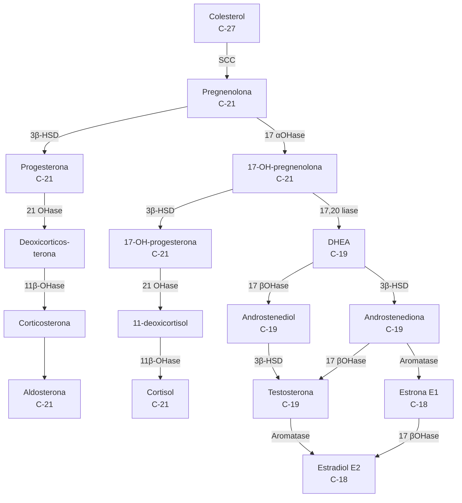
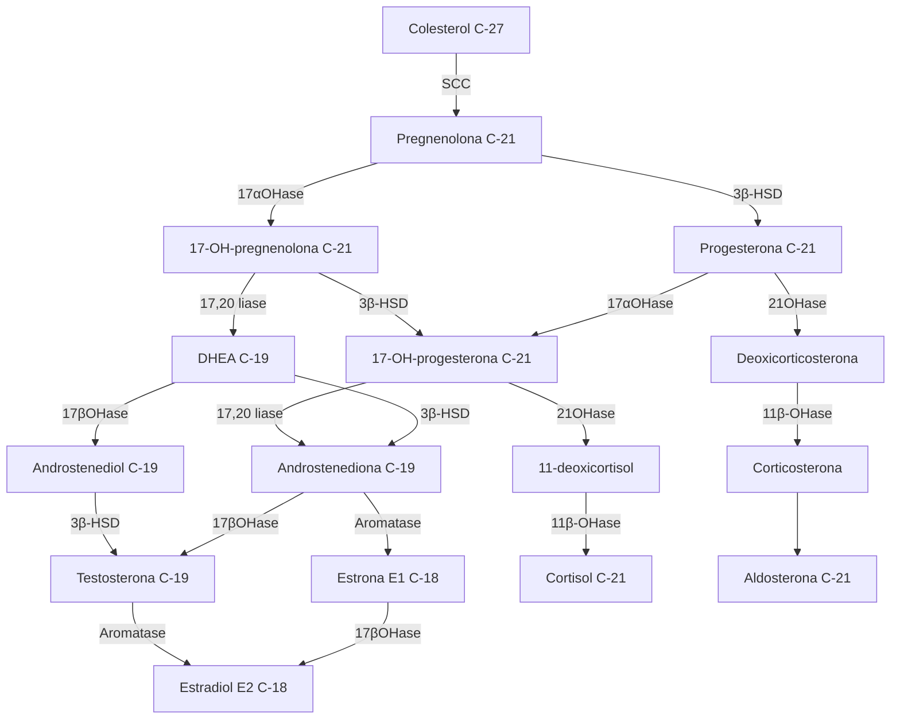

CE

# DIFERENÇAS NO DESENVOLVIMENTO SEXUAL

São condições que resultam na discordância entre o sexo cromossômico, gonadal e/ou anatômico.

**Classificado com base no cariótipo:**

- DDS associada ao cromossomo sexual (ex.: Síndrome de Turner, Síndrome de Klinefelter; disgenesia gonadal mista);
- DDS 46 XX (distúrbio do desenvolvimento ovariano; distúrbio por excesso de androgênios);
- Hiperplasia adrenal congênita é a causa mais comum de excesso de androgênios de origem adrenal; resulta da deficiência da enzima 21-hidroxilase;

- DDS 46 XY (distúrbio do desenvolvimento testicular; distúrbio da síntese ou ação de androgênios).

**Como princípios de tratamento: avaliar a idade de apresentação da diferença do desenvolvimento sexual; a identidade de gênero e as preferências do paciente.**

- Terapia de reposição hormonal para pacientes com déficits hormonais;
- Cirurgia reconstrutiva (ex.: genitoplastia feminizante).

## 1. EMBRIOLOGIA NORMAL

### 1.1 Diferenciação gonadal:

- Antes de 7 semanas do desenvolvimento, as gônadas ainda são indiferenciadas ou bipotentes (podendo dar origem ao sexo masculino ou feminino).
- O sexo é determinado pelo cariótipo (cromossomo Y com gene SRY).

**Sob ação da DHT**

- O tubérculo genital forma a glande do pênis;
- As pregas urogenitais formam o corpo do pênis;
- As pregas labioescrotais formam a bolsa testicular;
- O seio urogenital forma a próstata.

**Sem ação da DHT**

- O tubérculo genital forma o clitóris;
- As pregas urogenitais formam os pequenos lábios;
- As pregas labioescrotais formam os grandes lábios;
- O seio urogenital forma a vagina distal.

### 1.2 Definições:

As diferenças no desenvolvimento sexual formam um grupo heterogêneo que engloba condições que resultam na **discordância** entre o sexo **cromossômico, gonadal e/ou anatômico**.

### 1.3 Classificação:

- A sua classificação mais recente é baseada no cariótipo.
- A nomenclatura também foi atualizada.

| Denominação prévia            | Denominação proposta                |
| ----------------------------- | ----------------------------------- |
| Intersexo                     | Diferença do Desenvolvimento Sexual |
| Pseudo-hermafrodita masculino | 46 XY DDS                           |
| Pseudo-hermafrodita feminino  | 46 XX DDS                           |
| Hermafrodita verdadeiro       | Ovotesticular DDS                   |

| DDS associada ao cromossomo sexual | DDS 46 XX                             | DDS 46 XY                                        |
| ---------------------------------- | ------------------------------------- | ------------------------------------------------ |
|                                    | Distúrbio do desenvolvimento ovariano | Distúrbios desenvolvimento testicular            |
|                                    | Distúrbio por excesso androgênios     | Distúrbios da síntese e/ ou ação dos androgênios |
|                                    | Outros                                |                                                  |

GE

## 2 GINECOLOGIA ENDÓCRINA

**DDS associada ao cromossomo sexual:**

• 45 X: Síndrome de Turner;
• 47 XXY: Síndrome Klinefelter;
• 45 X / 46 XY: disgenesia gonadal mista e variantes;
• DDS ovotesticular cromossômica.

**DDS 46 XX**

• **Distúrbio do desenvolvimento ovariano:** DDS ovotesticular; DDS testicular; Disgenesia gonadal completa.
• **Distúrbio por excesso androgênios:** Hiperplasia adrenal congênita; Não hiperplasia adrenal congênita (deficiência de aromatase, tumores virilizantes maternos).

• **Outros:** Agenesias mullerianas.

**DDS 46 XY**

• **Distúrbios do desenvolvimento testicular:** Disgenesia gonadal 46 XY completa e parcial (Síndrome de Swyer); Regressão gonadal; DDS ovotesticular.
• **Distúrbios da síntese e/ou ação dos androgênios:** Síndrome insensibilidade aos androgênios; Deficiência 5 alfa-redutase; Defeito receptor de LH.

## 2. DDS ASSOCIADA AO CROMOSSOMO SEXUAL

### 2.1 Síndrome de Turner 45 X

• Cariótipo 45 X0, ou cariótipo "em mosaico" (parte é 45, X e parte é 46, XX);
• É a disgenesia gonadal mais comum – as gônadas não estão desenvolvidas (em fita);
• Como não há produção dos hormônios esteróides ovarianos, não há caracteres sexuais secundários, sendo a **genitália externa e interna femininas pré-púberes**;
• É comum a presença de estigmas associados à síndrome;
• Diagnóstico: cariótipo;
• Tratamento: reposição hormonal (proteger a saúde óssea dessas pacientes e reduzir o risco cardiovascular); considerar uso de GH exógeno até a puberdade para aumentar a estatura final.

### 2.2 Síndrome de Klinefelter

• Cariótipo 47 XXY
• **Características:** Deficiências de fala e outras habilidades linguísticas; Hipogonadismo hipergonadotrófico: atrofia testicular; Homens inférteis: azoospermia; Alta estatura, braços e pernas longos; Ginecomastia.
• **Diagnóstico**: cariótipo. Geralmente tardio, durante a avaliação de infertilidade, por exemplo.

## 3. DDS 46 XX

### 3.1 Distúrbio por excesso de androgênios

• Hiperplasia adrenal congênita;
• Não hiperplasia adrenal congênita (deficiência de aromatase, tumores virilizantes maternos);
• Cariótipo 46 XX + Genitália externa masculinizada;
• **Estão presentes**: ovários, útero, colo uterino e parte superior da vagina → **Férteis!**
• Genitália externa → virilizada em graus variados **(Escala de Prader)**

**Escala de Prader: serve para classificação da virilização da genitália externa:**

• **Estágio 0**: genitália feminina não virilizada.
• **Estágio I**: genitália feminina parece normal, mas com clitóris ligeiramente aumentado e introito vaginal reduzido que pode passar despercebido ou ser considerado dentro da variação normal.

CE

## DIFERENÇAS NO DESENVOLVIMENTO SEXUAL

• **Estágio II:** a genitália é claramente anormal aos olhos, com clitoromegalia, introito vaginal reduzido e meato uretral separado. Há fusão labial posterior parcial.

• **Estágio III:** clitóris/falo ainda mais aumentado, com seio urogenital único (vagina e uretra compartilham uma única abertura) e fusão labioescrotal quase completa.

• **Estágio IV:** falo grande do tamanho de um pênis normal. Fusão labioescrotal completa e lábios aparecem como um escroto vazio. A vagina e a uretra compartilham uma única abertura perto da base do corpo do falo.

• **Estágio V:** virilização masculina completa: pênis formado, uretra peniana e abertura uretral na ponta. Escroto de aparência normal, mas sem gônadas na bolsa escrotal. O excesso de androgênios pode ocorrer por anormalidades suprarrenais ou por fontes não suprarrenais. **Hiperplasia Adrenal Congênita** é a causa mais comum! – Deficiência da enzima 21-hidroxilase (CYP21)

**Para entender a origem do excesso de androgênios nesta situação, precisamos rever conceitos da aula de esteroidogênese. Em resumo, na esteroidogênese, a molécula de colesterol sofre um primeiro conjunto de reações enzimáticas.**

| Colesterol                |                        |             |
| ------------------------- | ---------------------- | ----------- |
| Progestagênios            | Androgênios            |             |
| Mineralo-
corticoides | Glicocorti-
cóides | Estrogênios |

• As etapas com suas diferentes reações enzimáticas são:

Hoffman, B., Schorge, J., Bradshaw, K., Halvorson, L., Schaffer, J. and Corton, M., 2016. *Williams Gynecology*. 3rd ed. New York: McGraw-Hill Education.

GE

• Diante da deficiência da enzima 21-hidroxilase (CYP21), como ocorre na hiperplasia adrenal congênita:

**Causas Não Suprarrenais (de excesso de exposição a androgênios em pacientes com cariótipo 46 XX):**

• Exposição materna a medicamentos: testosterona, danazol, noretindrona e outros derivados de androgênios.
• Tumores ovarianos virilizantes: luteoma da gravidez e o tumor da célula de Sertoli-Leydig

## 4. DDS 46 XY

### 4.1 Distúrbios desenvolvimento testicular

**Síndrome de Swyer:** Causa de disgenesia gonadal pura com cariótipo 46 XY. Os testículos são disgenéticos, logo não produzem hormônio anti-mulleriano nem testosterona. Na ausência do hormônio anti-mulleriano, ocorre desenvolvimento de útero, tubas e terço superior da vagina. Na ausência de testosterona, a genitália externa é feminina.

### 4.2 Distúrbios da ação dos androgênios

**Síndrome da Insensibilidade aos androgênios:** Cariótipo 46 XY. Doença recessiva ligada ao cromossomo X. As gônadas são os testículos, logo há produção de hormônio anti-mulleriano, que promove a regressão dos ductos de Muller. Também há produção de testosterona, mas que não tem ação por defeito em seus receptores. A genitália externa é feminina.

## 5. DDS Ovotesticular

• Pode ocorrer por: DDS associada ao cromossomo sexual; DDS 46 XX associada ao distúrbio do desenvolvimento ovariano; DDS 46 XY associada ao distúrbio do desenvolvimento testicular.
• Presença de ovários + testículos.
• Cariótipo mais encontrado → 46 XX, seguido por mosaicismo 46 XX/46 XY.

• Fenótipo: ovotéstis unilateral, com ovário ou testículo contralateral, ou ovotéstis bilateral.
• O grau de masculinização ou feminização depende da quantidade de AMH e de testosterona presentes.
• Genitália externa: ambígua e submasculinizada.

DIFERENÇAS NO DESENVOLVIMENTO SEXUAL                                                                      5

## 6. PRINCÍPIOS PARA AVALIAÇÃO DO EXAME FÍSICO

### 6.1 Exame genital

• Genitália ambígua pode ocorrer por: elevação de testosterona/DHT em indivíduos sem SRY (por exemplo, 46 XX) ou diminuição de testosterona em indivíduos com SRY (por exemplo, 46 XY).
• Avaliar o tamanho e a descida dos testículos.

### 6.2 Exame pélvico interno em mulheres fenotípicas:

• O colo do útero é visível?
• O útero é palpável?

### 6.3 Avaliação dos caracteres sexuais secundários em adolescentes/adultos

• Desenvolvimento mamário = estrogênio presente.
• Pelos pubianos e axilares = testosterona presente.
• Pelos faciais/corporais, voz mais grave = testosterona presente.

### 6.4 Procurar por achados associados a síndromes específicas (por exemplo, pescoço alado na síndrome de Turner).

## 7. EXAMES LABORATORIAIS

**Cariótipo para avaliar a presença ou ausência do gene SRY**

**Testosterona**
• Reduzida nas síndromes de Swyer e Klinefelter;
• Aumentada ou normal na síndrome de insensibilidade aos androgênios, deficiência de 5 alfa-redutase e hiperplasia adrenal congênita.

**DHT**
• Diminuída na deficiência de 5 alfa-redutase;
• Aumentada na síndrome de insensibilidade aos androgênios

**FSH e LH**
• Aumentado na disgenesia gonadal 46 XX.

**17-Hidroxiprogesterona que estará aumentado na hiperplasia adrenal congênita.**

## 8. PRINCÍPIOS DE TRATAMENTO

**Fatores que influenciam o tratamento**
• Idade de apresentação (bebê, adolescente ou adulto);
• Identidade de gênero e preferências do paciente;
• Status hormonal.

**Psicoterapia/aconselhamento:**
• Todos os pacientes (e potencialmente os membros da família) devem ser encaminhados para terapia.

**A terapia de reposição hormonal:**
• Pode ser indicada em pacientes com déficits hormonais (por exemplo, testosterona e/ou estrogênio).

**Cirurgia**
• Gônadas anormais, especialmente gonadoblastomas e disgerminomas, representam um alto risco de malignidade, estando a excisão cirúrgica recomendada.
• Cirurgia reconstrutiva ou de reatribuição: genitoplastia feminizante: diminuir o tamanho do clitóris, reduzir e feminizar as dobras labioescrotais, abordar o seio urogenital.

GE
