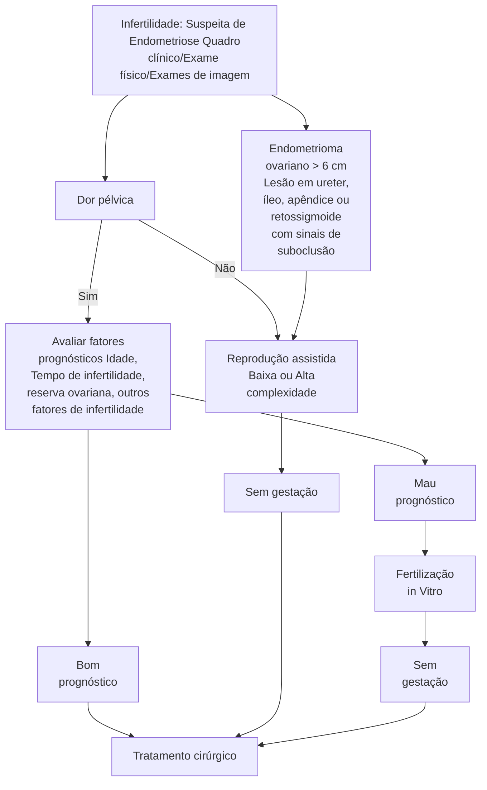

# ENDOMETRIOSE

| • ENDOMETRIOSE: doença crônica, estrogênio dependente, relacionada a menacme:
• Tecido endometrial fora da cavidade uterina.
• Sintomas: dismenorreia, dispareunia de profundidade, dor pélvica. Sintomas urinários ou intestinais a depender da localização dos focos de endometriose:
• Associação com infertilidade.
• Exames complementares: USG pélvico com preparo | intestinal ou ressonância magnética;
• Tratamento: visa amenorreia → progestagênios contínuos, SIU-LNG, anticoncepcional combinado;
• Casos refratários → cirurgia (ressecar todos os focos de endometriose);
• Quando indicar cirurgia direto? Risco de obstrução (comprometimento de delgado ou >50% de alça de cólon, acometimento de ureter ou apêndice cecal). |
| ---------------------------------------------------------------------------------------------------------------------------------------------------------------------------------------------------------------------------------------------------------------------------------------------------------------------------------------------------------------------------------------- | ------------------------------------------------------------------------------------------------------------------------------------------------------------------------------------------------------------------------------------------------------------------------------------------------------------------------------------------------------------------------------- |

## 1. CONSIDERAÇÕES GERAIS

• A endometriose é uma doença ginecológica crônica, estrogênio dependente e multifatorial. É mais prevalente em mulheres em idade reprodutiva, os sintomas tendem a melhorar após a menopausa;

• É a presença de tecido endometrial fora do útero. Mais comum na pelve — mas pode estar presente em qualquer ponto da superfície peritoneal.

### 1.1 PODE SER CLASSIFICADA EM PERITONEAL, OVARIANA E PROFUNDA (FEBRASGO)

• Profunda – penetra o espaço retroperitoneal ou parede dos órgãos pélvicos com profundidade de pelo menos 5 mm, formando o nódulo endometriótico;

• Peritoneal – é superficial, difícil de ser caracterizada em exames de imagem;

• Ovariana – principalmente representado pelo endometrioma.

### 1.2 CLASSIFICAÇÃO DE ACORDO COM ASSOCIAÇÃO AMERICANA DE GINECOLOGIA LAPAROSCÓPICA;

• Sociedade europeia de ginecologia endoscópica e Sociedade mundial de endometriose:

• Superficial/Peritoneal

• Profunda: sobre ou sob a superfície peritoneal; lesões nodulares, associadas a fibrose

• Endometrioma

• Endometriose intestinal: dentro da parede intestinal (retossigmoide

• Endometriose vesical: envolve músculo detrusor e/ou epitélio da bexiga

• Extra-abdominal

## 2. ETIOLOGIA

### 2.1 TEORIAS

• Diferentes teorias já foram propostas sobre a etiologia da endometriose;

• Sampson (menstruação retrógrada) – teoria mais aceita:
  • Teoria de que existe um refluxo tubário do conteúdo menstrual com implantação de células endometriais no peritônio e demais órgãos revestidos pelo peritônio, caso a paciente tenha ambiente hormonal e imunológico adequado.

• Metaplasia celômica:
  • As lesões se originam de tecidos normais através do processo de transformação metaplásica.

• Genética:
  • Predisposição genética ou alterações epigenéticas associadas a modificações no ambiente peritoneal poderiam iniciar a doença partindo de qualquer tipo celular.

### 2.2 FATORES DE RISCO

• Histórico familiar;

• Primiparidade tardia/Nuliparidade:
  • Há associação de endometriose com infertilidade: será que essas mulheres não engravidam por que têm infertilidade e por isso aparece como fator de risco? Ou seria o contrário?

• Ciclos menstruais curtos/Fluxo menstrual excessivo:
  • Associação da endometriose com adenomiose.

• IMC baixo;

• Consumo de álcool e cafeína;

• Malformações mullerianas – refluxo do sangue menstrual.

## 3. QUADRO CLÍNICO

### 3.1 SINTOMAS

• Dismenorreia, dor pélvica e dispareunia de profundidade:
  • Lembrar dos D's;
  • Disúria e disquezia se houver focos de endometriose na bexiga ou no TGI.

• Alterações intestinais cíclicas (distensão abdominal, sangramento nas fezes, constipação, disquezia, dor anal);

• Alterações urinárias cíclicas (disúria, hematúria, polaciúria, urgência miccional):
  • Infertilidade – quanto pelas aderências que se formam sobre as lesões endometrióticas, tanto por alterações da motilidade tubária e endometrioma.

### 3.2 EXAME FÍSICO

• Implantes endometrióticos, principalmente em fundo de saco vaginal;

• Nodulações dolorosas, principalmente em fundo de saco vaginal;

• Espessamento de ligamentos uterossacros;

GINECOLOGIA GERAL

• Útero pouco móvel e doloroso;
• Anexos fixos e dolorosos;
• Massas anexiais.

**Figura 1** Endometrioma umbilical.

## 3.3 EXAMES COMPLEMENTARES

• Exame físico: suspeita clínica;
• O USGTV pode ser útil, principalmente nos casos de endometriomas, mas não é suficiente para caracterizar as lesões de endometriose. Por isso que diante de quadros clínicos suspeitos devemos indicar dois exames mais específicos:
  • USG pélvico e transvaginal com preparo intestinal;
  • RNM pélvica com protocolo específico.

Obs.: os exames de imagem possuem boa sensibilidade para lesões profundas e endometriomas, mas não para lesões superficiais e aderências finas;

• Padrão ouro para fazer diagnóstico de endometriose é a laparoscopia com biópsia;
• CA 125 (marcador tumoral inespecífico) pode estar aumentado, **mas não tem valor no diagnóstico.**

**Figura 2** Endometrioma visto através da ultrassonografia.

**Figura 3** Endometriose peritoneal: lesões vermelhas (ativas), pretas (aspecto de queimadura por pólvora) ou brancas (cicatriciais).

**Figura 4** Endometriomas ovarianos: conteúdo espesso achocolatado.

**Figura 5** Endometriose profunda – componente posterior. Falemos de ressecção (excisão) da endometriose, e não de cauterização!

## 4. TRATAMENTO

### 4.1 TRATAMENTO CLÍNICO – PRIMEIRA LINHA

• Objetivo: controle de dor pélvica;
• Sempre primeira escolha, exceto se indicações absolutas para procedimento cirúrgico;
• Progestagênio contínuo – oral, injetável, SIU-LNG ou implante subdérmico;

ENDOMETRIOSE                                                                                                            3

• Anticoncepcional combinado – sem consenso sobre administração contínua ou cíclica, ou forma de administração (oral, injetável, adesivo ou anel vaginal);
• Danazol – inibe a liberação de LH e esteroidogênese, aumenta a testosterona livre; atualmente em desuso devido a efeitos colaterais
• Análogo de GnRH – muitos efeitos colaterais; não podendo ser usado a longo prazo uma vez que induz estado menopausal transitório
• AINES;
• Acupuntura, fisioterapia pélvica, psicoterapia, uso de Gabapentina e Amitriptilina.

## 4.2 TRATAMENTO CIRÚRGICO

• Indicações:
  • Endometrioma ovariano > 6 cm;
  • Lesão em ureter, íleo, apêndice e retossigmoide (se sinais de suboclusão);
  • Falha de tratamento clínico;
  • Objetivo: remoção completa de todos os focos de endometriose, tentando preservar função reprodutiva;
  • Via ideal: videolaparoscopia.
• Endometriose intestinal:
  • Shaving – lesões pequenas e superficiais;
  • Ressecção em disco: ressecção de nódulos até 3 cm incluindo todas as camadas da parede anterior do reto;

• Ressecção segmentar: ressecção de um segmento do retossigmoide. Lesões maiores que 3 cm ou duas ou mais lesões intestinais.
• Endometrioma ovariano:
  • Ooforoplastia – melhor chance de gestação, melhor controle de dor, menor taxa de recidiva; Figura 6
  • Drenagem do conteúdo e cauterização da cápsula.

## 4.3 TRATAMENTO DA INFERTILIDADE

• 25 a 50% das mulheres inférteis são portadoras de endometriose;
• 30 a 50% das mulheres com endometriose têm infertilidade;
• Estima-se que a cirurgia de endometriose aumenta a taxa de gravidez espontânea em cerca de 30 a 40%;
• A abordagem da infertilidade no contexto da endometriose é controversa: deve-se avaliar fatores prognósticos ao encaminhar para o tratamento cirúrgico ou para FIV. Mulheres jovens, com boa reserva ovariana e sem outros fatores de infertilidade podem ter melhores chances de gestação após o tratamento da endometriose.
• Tratamento medicamentoso hormonal – não melhora fertilidade;
• Análogo de GnRH melhora a taxa de gestação se administrado 3 meses pré-FIV.

**Figura 6** Fluxograma para condução dos casos de infertilidade de pacientes com diagnóstico de endometriose.

GINECOLOGIA GERAL

# REFERÊNCIAS

**Figura 1 Endometrioma umbilical.**

SANTOS FILHO, P. V. D. et al. Primary umbilical endometriosis. Revista do Colégio Brasileiro de Cirurgiões, v. 45, n. 3, 21 jun. 2018.

**Figura 2 Endometrioma visto através da ultrassonografia.**

USG. PATEL, M. S. Endometrioma | Radiology Case | Radiopaedia.org. Disponível em: <https://radiopaedia. org/cases/endometrioma>.

**Figura 3 Endometriose peritoneal: lesões vermelhas (ativas), pretas (aspecto de queimadura por pólvora) ou brancas (cicatriciais).**

<https://www. drfranciscogonzaga.com.br/site/endometriose/>.

**Figura 4 Endometriomas ovarianos: conteúdo espesso achocolatado.**

FRANCISCO, D. Endometriose. Disponível em: <https://www. drfranciscogonzaga.com.br/site/endometriose/>.

**Figura 5 Endometriose profunda – componente posterior. Falemos de ressecção (excisão) da endometriose, e não de cauterização!**

Disponível em: <https://aendometrioseeeu.com.br/falemos-deresseccao-excisao-da-endometriose-e-nao-de-cauterizacao/>.
