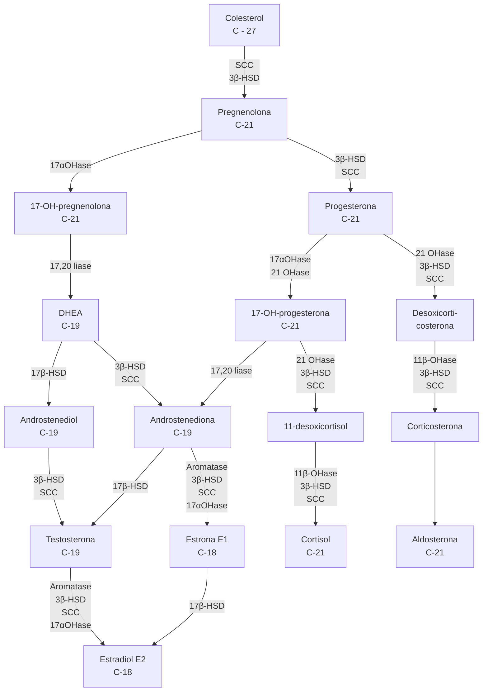
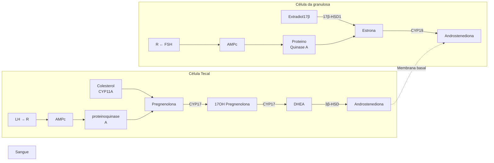
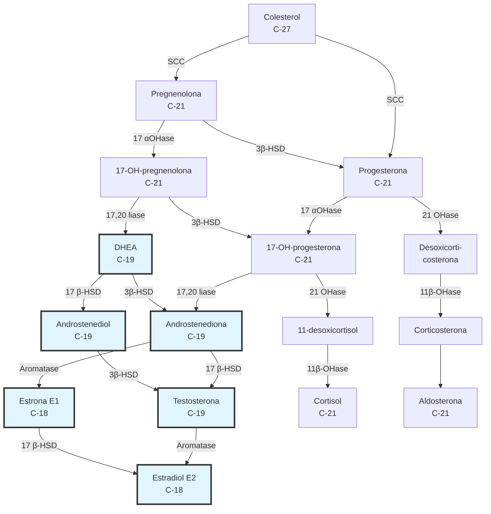
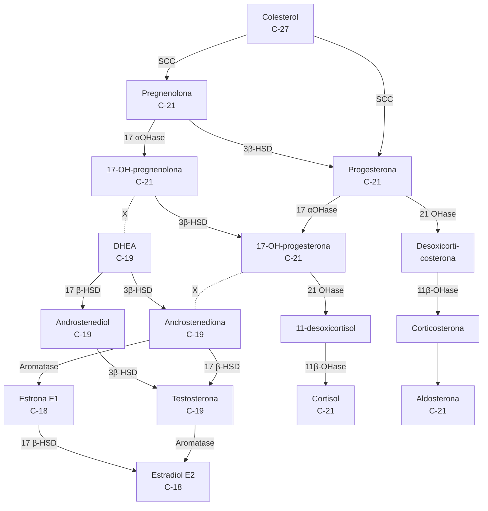

Esteroidogênese

# ESTEROIDOGÊNESE

**Os hormônios ESTEROIDES são aqueles derivados do colesterol (estrogênio, progesterona, testosterona, cortisol e aldosterona).**

São sintetizados nas gônadas, nas glândulas suprarrenais e na placenta.

• **Esteroidogênese na supra-renal:** cada uma destas zonas expressa um conjunto diferente de enzimas esteroidogênicas e, por isso, sintetiza produtos distintos;

• Contribui com toda a forma sulfatada de DHEA (SDHEA);

• **Esteroidogênese ovariana:** teoria das duas células-duas gonadotrofinas;

• A maior parte dos esteroides circula ligada a proteínas transportadoras;

• Somente a fração livre é biologicamente ativa;

• **Hiperplasia adrenal congênita:** doença metabólica autossômica recessiva com deficiência da enzima 21-hidroxilase.

## 1. HORMÔNIOS

• **Peptídeos:** derivados de aminoácidos (GnRH, FSH, LH, TSH);

• **Esteroides:** derivados do colesterol (estrogênio, progesterona, testosterona, cortisol e aldosterona);

• **Aminas:** derivados da tirosina (tiroxina, triiodotironina, noradrenalina).

## 2. HORMÔNIOS ESTEROIDES

### Derivados do colesterol

Os hormônios esteroides sexuais são divididos em 3 grupos, com base no número de átomos de carbono que contêm.

• Progestagênios, glicocorticoides e mineralocorticoides: 21 carbonos;

• Androgênios: 19 carbonos;

• Estrogênios: 18 carbonos.

**Metabolização:** principalmente em fígado, rins e mucosa intestinal.

• Contraindicação ao uso de hormônios esteroides em portadores de doença hepática ou renal ativa.

### 2.1 PRODUÇÃO DOS HORMÔNIOS ESTEROIDES SEXUAIS

• Os hormônios esteroides sexuais são sintetizados nas gônadas, nas glândulas supra-renais e na placenta;

• O colesterol é a matéria-prima;

• A via de biossíntese dos esteroides sexuais é idêntica em todos os tecidos esteroidogênicos, mas a distribuição dos produtos sintetizados por cada tecido varia de acordo com a presença e ausência de certas enzimas;

• O ovário é deficiente em 21-hidroxilase e em 11-beta-hidroxilase e, assim, é incapaz de produzir corticosteroides;

• Na adrenal não temos aromatase.

• Confira a **Figura 2** na próxima página

### 2.2 SÍNTESE DE ESTEROIDES NA GLÂNDULA SUPRA-RENAL

• A glândula supra-renal adulta é composta de 3 zonas;

• Cada uma expressa um conjunto diferente de enzimas esteroidogênicas e, por isso, sintetiza produtos distintos. **Figura 1**

**Figura 1:** Glândula supra-renal e suas zonas

| Córtex                                                  | Glomerular
Fascicular
Reticular |
| ------------------------------------------------------- | --------------------------------------- |
| Medula                                                  |                                         |
| Aldosterona \| Cortisol \| Androgênios \| Catecolaminas |                                         |

### 2.3 COMPOSTA DE 3 ZONAS:

• Zona GLOMERULAR: síntese de mineralocorticoides;

• Zona FASCICULAR: produção de glicocorticoides;

• Zona RETICULAR: produção de androgênios (ex: androstenediona);

• 50% da produção diária de androstenediona e dehidroepiandrosterona (DHEA), com praticamente toda a forma sulfatada de DHEA (SDHEA).

### 2.4 SÍNTESE DE ESTEROIDES NOS OVÁRIOS

**TEORIA DAS DUAS CÉLULAS-DUAS GONADOTROFINAS:**

• Confira a **Figura 3** na próxima página

**Os folículos possuem dois tipos de células: as da teca (camada mais externa) e as da granulosa (camada mais interna).**

As células da TECA possuem receptores de LH que, a partir da sua ação, produzem androgênios que migram para as células da granulosa e, sob a ação do FSH, são convertidos em estrogênios (com participação da enzima aromatase).

**Particularidades da síntese de esteroides pela placenta:**

• A placenta produz os hormônios esteroides progestagênios e estrogênios (estradiol, estrona e, principalmente, estriol).

GINECOLOGIA GERAL

**Figura 2** Fluxograma síntese de esteróides

**Figura 3** Teoria das Duas Células

• A ausência da enzima 11-hidroxilase impossibilita a produção placentária de corticosteroides; da mesma forma, a ausência de 17-hidroxilase e 17,20-liase no tecido trofoblástico impede a transformação dos progestagênios em andrógenos;

• A molécula de colesterol é obtida pela lipoproteína transportadora de colesterol de baixa densidade (LDL), que é fornecida principalmente pela mãe e, em menores quantidades, pelo feto. No sinciciotrofoblasto, esse substrato sofre hidrólise e libera o colesterol;

• A produção estrogênica pela placenta ocorre a partir de precursores androgênicos, especialmente o DHEA-S (precursor do estradiol e da estrona) e o sulfato de 16-alfa-hidroxi-hidro-epiandrosterona (precursor do estriol);

• Na gestação próxima do termo, 50% do DHEA-S é de origem materna e os 50% restantes têm origem fetal. Por sua vez, mais de 90% da 16-alfa-hidroxi-dehidroepiandrosterona utilizada pela placenta tem origem na adrenal do feto.

## 2.5 ORIGEM DOS ANDROGÊNIOS E ESTROGÊNIOS CIRCULANTES NO SEXO FEMININO

**Estrogênios circulantes no sexo feminino durante a vida reprodutiva: estradiol, estrona e pequena quantidade de estriol.**

• Estradiol: principal estrogênio produzido pelos ovários (síntese através dos folículos ovarianos). Deriva também a partir da conversão da estrona;

• Estrona: secretada diretamente pelos ovários e pode ser convertida a partir da androstenediona na periferia.

**Androgênios:**

• Os ovários produzem principalmente androstenediona e dehidroepiandrosterona (DHEA), além de pequena quantidade de testosterona;

• O córtex supra-renal contribui com aproximadamente 50% da produção diária de androstenediona e DHEA e, praticamente, com toda a forma sulfatada de DHEA (SDHEA);

• 25% da testosterona circulante é secretada pelos ovários, 25% pelas supra-renais e os 50% restantes são produzidos pela conversão periférica de androstenediona para testosterona (principalmente a partir da atividade da aromatase na pele e tecido subcutâneo).

• Confira a **Figura 4** na próxima página

ESTEROIDOGÊNESE

![Diagram showing steroid hormone production pathway between adrenal gland and ovary]

**Figura 4** Distribuição da produção androgênica entre ovário e glândula supra-renal

## 2.6 TRANSPORTE DOS HORMÔNIOS ESTEROIDES NA CIRCULAÇÃO

• A maior parte dos esteroides circula ligado a proteínas transportadoras, entre elas, globulina de ligação ao hormônio sexual (SHBG), ligadoras de tiroxina e de corticosteroides,ou a albumina.
• Apenas 1-2% dos androgênios e estrogênios circulam livres ou sem ligação;
• Somente a fração livre é biologicamente ativa.
• A quantidade de hormônio livre está em equilíbrio com a quantidade ligada;
• Pequenas alterações na expressão das proteínas transportadoras podem produzir modificações substanciais nos efeitos dos esteroides;
• **Aplicação prática:** os ACHO combinados podem aumentar os níveis de SHBG, o que reduz a fração ativa dos androgênios e a sua ação. Um dos efeitos é a redução da acne.

## 3. ESTEROIDOGÊNESE E DISTÚRBIOS CLÍNICOS

**Tabela 1** Esquema simplificado das etapas da esteroidogênese, com destaque para o principal produto formado em cada uma dessas etapas

| Colesterol                |                        |             |
| ------------------------- | ---------------------- | ----------- |
| Progestagênios            | Androgênios            |             |
| Mineralo-
corticoides | Glicocorti-
cóides | Estrogênios |

## 3.1 HIPERPLASIA ADRENAL CONGÊNITA

• Deficiência da enzima 21-hidroxilase;
• Fisiopatologia: pela deficiência enzimática, há níveis baixos de aldosterona e cortisol com acúmulo do precursor 17-hidroxiprogesterona (17-OHP) e desvio da cascata no sentido de produção aumentada de androgênios;
• Doença autossômica recessiva;
• Manifestações clínicas: hirsutismo, acne e ciclos anovulatórios;
• Pode ser confundida com a síndrome dos ovários policísticos;
• Diagnóstico: dosagem da 17-hidroxiprogesterona (17-OHP) é um exame de rastreamento sensível. A dosagem deve ser realizada durante a fase folicular do ciclo a fim de evitar resultados falso-positivos causados por secreção de 17-OHP pelo corpo lúteo.
• A Hiperplasia Adrenal Congênita pode se apresentar de duas formas: clássica (grave) e não clássica (leve):
• Hiperplasia adrenal congênita clássica: são dois os tipos, geralmente diagnosticada logo após o nascimento ou na primeira infância: depletora de sal e a virilizante simples.
• Hiperplasia adrenal congênita não clássica (ou também tardia): é causada por uma mutação no gene CYP21, que codifica a enzima 21-hidroxilase. Nos casos de mutação leve, essas mulheres são assintomáticas até a adrenarca.
• Confira a Figura 5 na próxima página.

## 3.2 DEFICIÊNCIA DA 17,20-LIASE

• Fisiopatologia: pela deficiência enzimática não há produção de androgênios nem estrogênios com desvio para a produção de mineralocorticoides e glicocorticoides que resultam numa elevação da aldosterona;
• Infantilismo genital + elevação pressórica;
• Sem desenvolvimento de caracteres sexuais secundários;
• Desvio da produção para mineralocorticoide e glicocorticoide.

GINECOLOGIA GERAL

**Figura 5** Hiperplasia Adrenal Congênita Não Clássica na produção de esteroides

**Figura 6** Deficiência da 17,20-Litase na produção de esteróides.
