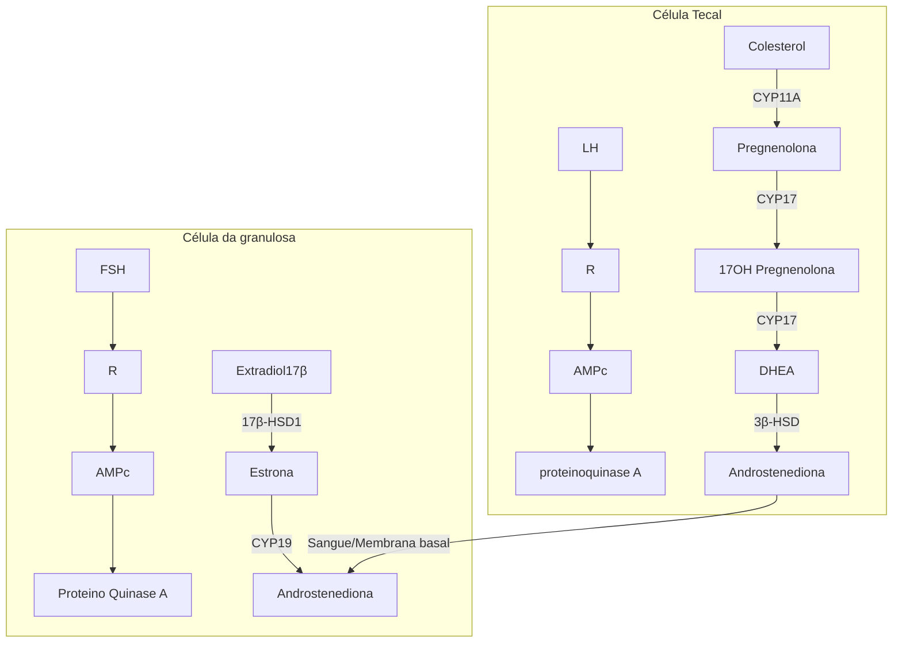

# FISIOLOGIA MENSTRUAL

**Regulação neuroendócrina do ciclo menstrual: eixo hipotálamo-hipófise-ovário**

• **Hipotálamo:** complexo de núcleos de neurônios; neurônio de GnRH (produção pulsátil e independente);

• **Hipófise:** a hipófise anterior (adeno-hipófise) produz as gonadotrofinas FSH e LH sob estímulo GnRH;

• **Ovários:** glândulas endócrinas que recebem o estímulo das gonadotrofinas para ocorrer a foliculogênese e a esteroidogênese.

**Esteroidogênese ovariana**

**Teoria das 2 células - 2 gonadotrofinas**

• Células da teca ovariana produzem androgênios (a partir da molécula de colesterol) sob ação do LH;

• Nas células da granulosa, os androgênios são convertidos em estrogênios sob estímulo do FSH e ação da enzima aromatase.

**Divisão do ciclo menstrual temporalmente (antes e após a ovulação) e espacialmente (alterações na função ovariana e endometrial).**

• Antes da ovulação, nos ovários ocorre a fase folicular e predomina o estrogênio;

• O endométrio, sob ação do estrogênio predominante, prolifera;

• Após a ovulação, nos ovários inicia-se a fase lútea com predomínio da progesterona;

• No endométrio, tem-se início a fase secretora.

## 1. CICLO MENSTRUAL

### 1.1 CARACTERÍSTICAS TÍPICAS DO CICLO MENSTRUAL:

• Frequência 24-38 dias;

• Duração: ≤ 8 dias;

• Regularidade: ≤ 7-9 dias; diferença entre o intervalo mais longo e o intervalo mais curto em um período de 1 ano; é variável conforme a idade da paciente: 18-25 anos: ≤ 9 dias; 26-41 anos: ≤ 7 dias; 42-45 anos: ≤ 9 dias;

• Volume: 5-80 mL.

Obs: atualmente recomenda-se a determinação subjetiva pela paciente: volume aumentado é aquele que interfere no estado físico, social, emocional ou na qualidade de vida da mulher.

**Guideline Internacional de SOP (2023):**

Irregularidade menstrual em adolescentes: é normal até 1 ano após a menarca;

• Entre 1-3 anos após a menarca, é considerada irregularidade menstrual quando os ciclos variam até < 21 dias e > 45 dias de duração.

### 1.2 OUTROS TERMOS PADRONIZADOS

**Sangramento intermenstrual:**

• Sangramento espontâneo que ocorre entre ciclos menstruais normais. Pode ser: aleatório – ex.: sinusorragia; cíclico (previsível) – ex.: sangramento periovulatório.

**Padrões de sangramento não programado em vigência de métodos hormonais**

• Sangramento: fluxo vaginal com sangue que requer proteção sanitária (ex.: absorvente);

• Escape (spotting): fluxo vaginal com sangue em pequena quantidade que não requer proteção sanitária.

## 2. EIXO HIPOTÁLAMO-HIPÓFISE-OVÁRIO

O hipotálamo possui "visão macro" dos eventos e comanda a hipófise. Essa, por sua vez, é "chefe" dos ovários, que realizam múltiplas tarefas. E o endométrio é um "trabalhador sem autonomia", apenas obedece comandos.

**Qual o objetivo da regulação do ciclo menstrual?**

Promover desenvolvimento de folículo e a partir dele ocorrer a liberação do óvulo (ovulação).

• Se o óvulo não for fecundado → menstruação.

• Se for fecundado → gestação.

### 2.1 HIPOTÁLAMO:

• Não é uma glândula → é um complexo de núcleos de neurônios com função neuroendócrina;

• Há comunicação com sistema límbico, córtex cerebral e promove: controle do metabolismo e regulação da temperatura corporal; controle do comportamento reprodutivo e sexual e da secreção de LH e FSH; comunicação com hipófise.

**Figura 1** Eixo hipotálamo-hipófise-ovário

GnRH

Gonadotrofinas: FSH e LH

E2 e E4

Útero (endométrio)

Cérvice

Vagina

GINECOLOGIA GERAL

• Alguns dos neurônios mais importantes são os progenitores de GnRH – de produção pulsátil e independente.
  • Menor frequência de pulsos → produção de FSH.
  • Maior frequência de pulsos → produção de LH.
  • A desaceleração da frequência de pulso do GnRH na fase lútea tardia é uma alteração importante que favorece a síntese de FSH.
• Um aumento na frequência e amplitude da secreção pulsátil de GnRH no meio do ciclo, por sua vez, favorece o aumento de LH que é necessário para ovulação e início da fase lútea.

## 2.2 HIPÓFISE:

• É uma glândula, também chamada de glândula pituitária.
• Localização na base do crânio, formada pela base do osso esfenoide.

**Hipófise anterior (adenohipófise):**
• Recebe sinais do hipotálamo pelo sistema portal-hipofisário;
• Comunicação direta com o hipotálamo;
• 5 grupos celulares: gonadotrofos, tireotrofos, somatotrofos, lactotrofos, corticotrofos (produção de FSH, LH, TSH, GH, prolactina, e ACTH respectivamente).

**Hipófise posterior (neurohipófise):**
• Prolongamento de neurônios;
• Responsável pela secreção de ocitocina e vasopressina.

## 2.3 OVÁRIO:

• Glândula endócrina na qual ocorrem esteroidogênese e desenvolvimento folicular;
• Os hormônios esteroides (estrogênio, progesterona, testosterona) produzidos possuem papel importante na preparação do útero para possível implantação de óvulo fecundado.

## 3. FASES DO CICLO MENSTRUAL

É dividido em duas metades (temporal e espacialmente) e o evento que as separa é a ocorrência da ovulação. Além disso, também pode ser dividido em ciclo ovariano e ciclo endometrial.

**Tabela 1** Divisão didática – temporal e espacialmente – do ciclo menstrual.

|            | 1ª metade          | 2ª metade      |
| ---------- | ------------------ | -------------- |
| OVÁRIO     | Fase folicular     | Fase lútea     |
| ENDOMÉTRIO | Fase proliferativa | Fase secretora |

## 4. 1ª METADE CICLO MENSTRUAL

### 4.1 OVÁRIO: FASE FOLICULAR

**Foliculogênese:**
• A foliculogênese (desenvolvimento do folículo ovariano) ocorre na região do córtex ovariano;
• Células progenitoras formam folículos primordiais (camada de células que contém o oócito primário), os quais ficam em estado de repouso (em prófase I da meiose I) até serem ativados no início do ciclo menstrual;

• Durante a puberdade, com o início dos ciclos menstruais, ocorre a retomada da meiose I até a metáfase II da meiose II;
• Vai acontecer a seleção e dominância de um folículo, o qual se tornará o folículo dominante do ciclo e prosseguirá seu desenvolvimento até o rompimento a partir do estímulo de LH, com liberação do oócito. Assim, durante cada ovulação, libera-se um oócito secundário que está estacionado na metáfase II da meiose II;
• Se ocorrer a fertilização, o oócito secundário vai terminar sua divisão meiótica;
• Ver esquema ao lado de foliculogênese e suas fases.

**Esteroidogênese ovariana:**
• É a produção de hormônios esteroides, que são derivados de uma molécula em comum (colesterol). Preparam o útero para caso ocorra a gestação.

**Foliculogênese**

| Recrutamento folicular  | Independente de Gonadotrofinas |
| ----------------------- | ------------------------------ |
| Seleção e Dominância    | Dependente de Gonadotrofinas   |
| Crescimento e maturação |                                |
| Ovulação                |                                |

**Figura 2** Foliculogênese e suas fases

**TEORIA DAS DUAS CÉLULAS-DUAS GONADOTROFINAS**
• Os folículos possuem dois tipos de células: as da teca (camada mais externa) e as da granulosa (camada mais interna);
• As células da teca possuem receptores de LH e, a partir da ação deste, produzem androgênios, que migram para as células da granulosa e sob ação do FSH são convertidos em estrogênios (com participação da enzima aromatase).
• Confira na página seguinte a Figura 3

### 4.2 ENDOMÉTRIO: FASE PROLIFERATIVA

• Endométrio é formado por duas camadas: a basal (reepiteliza o endométrio a cada ciclo) e a camada funcional (descama-se com a menstruação).
• Nessa fase proliferativa, endométrio sofre ação do estrogênio, responsável pelo efeito proliferativo nas células glandulares e estromais. Figura 4

FISIOLOGIA MENSTRUAL

## 5. 2ª METADE CICLO MENSTRUAL

### 5.1 OVÁRIO: FASE LÚTEA

Ocorreu rompimento folicular com liberação do óvulo (ovulação). Células remanescentes desse folículo formam o corpo lúteo, o qual produz o hormônio da progesterona e tem duração geralmente constante de 14 dias.

• Confira ao lado a Figura 6.

## 6. JUNTANDO TUDO: O CICLO MENSTRUAL

• Confira na página seguinte a Figura 7.

**Figura 3** Esquema da teoria das duas gonadotrofinas

**Figura 4** Representação histológica do endométrio na fase proliferativa

### Ovulação:

• Promovida pelo pico de LH (receptores LH) → que promove mudanças estruturais e enzimáticas para o rompimento folicular e liberação do óvulo;

• Rompimento folicular: enzimas proteolíticas; prostaglandinas (favorecem a contração do músculo liso do ovário); ativador plasminogênio;

• Então, as células da granulosa passam pelo processo de luteinização.

### 5.2 ENDOMÉTRIO: FASE SECRETORA

• Sob ação da progesterona, glândulas sofrem diferenciação e fazem secreção abundante de glicogênio e glicoproteínas.

• Confira na página seguinte a Figura 5.

**Figura 6** Representação histológica do endométrio na fase secretora

Nos primeiros dias do ciclo, o endométrio ainda está descamando e os ovários estão em repouso.

Na fase folicular inicial, os hormônios esteroides ainda estão em níveis muito baixos. Se uma USG for feita nessa fase, terá imagem com vários folículos recrutados

GINECOLOGIA GERAL

(pré-antrais) pequenos, que estão esperando o "sinal" do FSH para começarem a se desenvolver. O endométrio, nessa fase, pelo baixo nível do estrogênio, estará fino (habitualmente na USG está com espessura < 4mm). Esse estrogênio baixo, por sua vez, desencadeará uma elevação sutil do FSH, que selecionará um folículo (que será dominante). **Figura 8**

produção do FSH, ocasionando sua queda, que impedirá que outros folículos cresçam e garantirá que o ciclo tenha apenas um folículo dominante. Este tem receptores superexpressos de FSH em sua superfície, ou seja, é capaz de responder a esse, mesmo em quantidades pequenas do hormônio. Ocorre, assim, a produção de estrogênio, que ocasiona a proliferação do endométrio. Se for feita USG

**Figura 5** Foliculogênese: corpo lúteo e albicans (em destaque).

nessa fase, será observado aspecto trilaminar.

**Figura 7** Ciclo menstrual: representação das fases folicular e endometrial.

| Endométrio                    | Menstruação               | Endométrio
proliferativo | Endométrio
secretor |                           | Menstruação        |
| ----------------------------- | ------------------------- | ---------------------------- | ----------------------- | ------------------------- | ------------------ |
|                               | Crescimento
folicular | Ovócito
libertado        | Corpo
amarelo       | Corpo amarelo
regride |                    |
| Desenvolvimento
folicular |                           |                              |                         |                           |                    |
|                               | 1
Menstruação         | 5
Fase folicular         | 13
Ovulação         | Fase lútea                | 28
Menstruação |

**Figura 8** USG de ovário na fase folicular

O folículo dominante terá produção crescente de hormônios, como estradiol e inibina B. Isso será suficiente para inibir a

**Figura 9** USG com folículo pré-ovulatório.

FISIOLOGIA MENSTRUAL                                                                                                             5

• A elevação da produção do estrogênio muda o *feedback* do eixo: antes, a liberação de gonadotrofinas era inibida. Mas com aumento sustentado do estradiol, há *feedback* positivo, com estímulo para liberação de FSH e LH. Dessa forma, a ovulação ocorre em torno de 36 a 40 horas após o pico de LH.

• Após a ovulação, células foliculares remanescentes dão origem ao corpo lúteo. Nessa fase, há queda brusca na produção do estrogênio e o principal hormônio será a progesterona. A elevação da progesterona, cuja elevação lentifica os pulsos de GnRH de forma a promover bloqueio do eixo, mantendo FSH e LH em níveis baixos. Na USG, a imagem compatível com corpo lúteo será circular, com bordas irregulares e acentuação da ecogenicidade. Ocorre, ainda, a produção de inibina A, a qual concomitantemente com a progesterona bloqueia mais uma vez o eixo (suprime ainda mais a liberação de FSH E LH).

• O endométrio passa a assumir padrão secretor, com glândulas mais tortuosas. USG demonstra endométrio mais hiperecogênico.

• Quando a fecundação não acontece, o corpo lúteo não recebe HCG e começa processo de atresia. Com isso, caem os níveis de estradiol, progesterona e inibina A.

• A queda da progesterona leva a uma cascata de eventos que culminará na menstruação. Como a inibina A também cai, não há mais bloqueio do eixo e FSH volta a subir.

| Fase Folicular                                | Ovulação | Fase Lútea |
| --------------------------------------------- | -------- | ---------- |
| \[Ultrasound images showing different phases] |          |            |

**Figura 10** Exames de ultrassonografia evidenciando alterações ovarianas e endometriais nas diferentes fases do ciclo menstrual

[Diagram showing hormonal cycle with GnRH, RSH, LH, E2, P4 levels and follicle development stages]

**Figura 11** Fases do ciclo menstrual e os hormônios envolvidos.

## 6.1 PEPTÍDEOS GONADAIS E CICLO MENSTRUAL

• **INIBINAS:** hormônios glicoproteicos que regulam a liberação do FSH (inibem seletivamente). São produzidas nas células da granulosa;

• **INIBINA B** surge antes da ovulação;

• **INIBINA A** surge depois da ovulação;

• **ATIVINA:** produzida nas células da granulosa. Promove elevação de FSH, inibição de prolactina, ACTH e GH;

• **FOLISTATINA:** é produzida na hipófise. Inibe FSH através da modulação da ativina.

## 6.2 OUTRAS SUBSTÂNCIAS REGULADORAS

• **GABA:** ação inibitória sobre GnRH;

• **GLUTAMATO E ASPARTATO:** ação estimulatória sobre pulsatilidade do GnRH;

• **LEPTINA:** fornece sinal de permissividade de que existe reserva energética mínima e pode ocorrer a ovulação;

  • Todas essas substâncias agem sobre a KISSPEPTINA, que equilibra todos esses estímulos.

## 6.3 CASO OCORRA A FECUNDAÇÃO

• A partir do 5º ao 8º dia de fecundação, a gonadotrofina coriônica humana impede que o corpo lúteo da mãe involua;

• Continua a secretar progesterona e estrógenos até os 3 meses de gravidez, quando a função é substituída pela placenta.

# REFERÊNCIAS

**Figura 4** Representação histológica do endométrio na fase proliferativa

Livro - Ginecologia de Williams - 2ª Edição/2014 - Joseph I. Schaffer, Barbara L. Hoffman e John O. Schorge. Pág 433.

**Figura 6** Representação histológica do endométrio na fase secretora

Livro - Ginecologia de Williams - 2ª Edição/2014 - Joseph I. Schaffer, Barbara L. Hoffman e John O. Schorge. Pág 433

**Figura 8** USG de ovário na fase folicular

Fases do Ciclo Menstrual (Fase Folicular, Fase Lútea) e Ovulação. Disponível em: <https://www.saudebemestar.pt/pt/clinica/ginecologia/ fases-do-ciclo-menstrual/>.

**Figura 9** USG com folículo pré-ovulatório.

Fases do Ciclo Menstrual (Fase Folicular, Fase Lútea) e Ovulação. Disponível em: https://www.saudebemestar.pt/pt/clinica/ginecologia/ fases-do-ciclo-menstrual.

**Figura 10** Exames de ultrassonografia evidenciando alterações ovarianas e endometriais nas diferentes fases do ciclo menstrual

As fases do ciclo menstrual feminino Medicina Diagnóstica | Exames de Imagem - Porto Alegre/RS. Disponível em: <https://www. medicinadiagnostica.com.br/novidades-clinica-diagnostico-por-imagem/ as-fases-do-ciclo-menstrual-feminino>.
