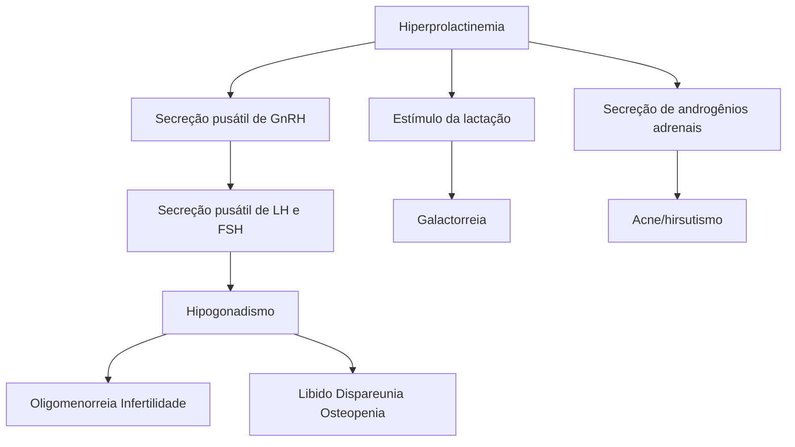

# HIPERPROLACTINEMIA

- **Definição**: é o Aumento das concentrações séricas de prolactina;
- **Fisiologia**: prolactina é secretada pela hipófise anterior e tem efeito lactogênico e de inibição do eixo gonadotrófico;
- **Causas**: fisiológicas (gestação, lactação, estresse, sono e estímulo mamilar), medicamentosas, tumores de SNC, doenças sistêmicas e idiopáticas;
- **Quadro clínico**: irregularidade menstrual, amenorreia, hipoestrogenismo, galactorreia, infertilidade e sintomas neurológicos;
- **Diagnóstico**: quadro clínico, exame físico e exames complementares laboratoriais (descartar gestação, dosar prolactina, TSH) e de imagem (RNM de sela túrcica e do crânio se suspeita de tumor de SNC);
- **Tratamento**: suspender o medicamento causador OU tratar a doença causadora. Lembre-se dos agonistas dopaminérgicos.

## 1. CONSIDERAÇÕES GERAIS

- Definição: é o Aumento das concentrações séricas de prolactina;
- Prevalência: 0,2% na população geral, 20-30% na população com amenorreia;
- O que é a prolactina? É um hormônio secretado pela hipófise anterior e inibido pela dopamina (hormônio hipotalâmico).

OBS.: como conclusão prática, observa-se que os medicamentos que atuam na inibição da dopamina podem induzir a quadros de hiperprolactinemia;

- A prolactina demonstra um efeito lactogênico pela inibição do eixo gonadotrófico (inibição do GnRH).

## 2. HIPÓFISE

- Inibida pela dopamina (hormônio hipotalâmico -> receptores dopaminérgicos tipo 2);
- Estimuladores: TRH, ocitocina, estrogênio, VIP (peptídeo intestinal vasoativo);
- Para fins didáticos, a hipófise pode ser dividida em duas porções.

### 2.1 ANTERIOR

- ACTH – atua no córtex renal;
- MSH – age na pele, estimulando os melanócitos;
- GH – atua nos ossos e nos músculos;
- TSH – tem ação na tireoide;
- FSH e LH – age nos testículos e nos ovários;
- Prolactina – atua nas glândulas mamárias para produção do leite, bem como em outros órgãos.

### 2.2 POSTERIOR OU NEUROHIPÓFISE

- Ocitocina – tem atuação nas glândulas mamárias para ejeção do leite;
- ADH – atuação nos rins.

## 3. ETIOLOGIA

### 3.1 FISIOLÓGICA

- O aumento dos níveis de prolactina é influenciado por fatores como: gestação, lactação, estresse, sono e estímulo mamilar;
- O uso de piercing no mamilo ou estímulos manuais podem causar hiperprolactinemia induzida.

**Fisiologia da lactação**
**\*PH: fator inibidor da prolactina**

Figura 1 Fisiologia da lactação - Acervo de imagens Medcof

### 3.2 MEDICAMENTOSA

- Antidepressivos: amitriptilina, clomipramina;
- Antagonistas dopaminérgicos: metoclopramida, domperidona;
- Antipsicóticos: haloperidol, clorpromazina, risperidona, sulpirida/tiaprida, quetiapina/olanzapina;
- Outros: metildopa, fluoxetina, verapamil, codeína, morfina.

### 3.3 PATOLÓGICAS

- Tumor produtor de prolactina:

• Microprolactinoma (< 1 cm);
• Macroprolactinoma (> 1 cm).
• Adenomas mistos:
  • Qualquer outro tumor que cause a compressão da haste hipofisária; pode ocasionar o aumento da prolactina sérica por diminuição da secreção de dopamina.
• Doenças sistêmicas:
  • Cirrose hepática; insuficiência renal; hipotireoidismo; doenças autoimunes.
• Lesões irritativas da parede torácica: herpes zoster;
• Mastectomia e os traumas de tórax também podem cursar com hiperprolactinemia;
• Idiopáticas:
  • Devem ser consideradas após a exclusão de outras causas;
  • Pequenos adenomas produtores de prolactina, que não são vistos em exames de imagem, podem ser a causa das idiopáticas.

## 4. QUADRO CLÍNICO

### 4.1 SINTOMAS
• Irregularidade menstrual;
• Amenorreia;
• Sintomas de hipoestrogenismo;
• Diminuição da libido;
• Galactorreia - quanto mais grave o hipogonadismo, menos galactorreia;
• Infertilidade;
• Acne, hirsutismo;
• Sintomas neurológicos (cefaleia, perda de campo visual); a presença de manifestações neurológicas demonstra associação com tumores.

**Figura 2** Resumo das manifestações clínicas da hiperprolactinemia.

OBS.: atente-se para o fato de que a hiperprolactinemia é um diagnóstico diferencial de SOP e de hiperplasia adrenal congênita de início tardio! Logo, também é uma causa de anovulação!

OBS.: em longo prazo, há perda de massa óssea em decorrência do hipoestrogenismo crônico.

## 5. DIAGNÓSTICO

### 5.1 QUADRO CLÍNICO
• Presença de galactorreia;
• Amenorreia/sangramento menstrual irregular;
• Diminuição da libido.

### 5.2 EXAME FÍSICO
• Clínico:
  • Galactorreia;
  • Bócio (tende a surgir quando existem alterações tireoidianas associadas);
  • Sinais de hiperandrogenismo;
  • Alterações de campo visual.
• Deve-se **descartar gestação**! É uma das causas fisiológicas;
• Considerar desejo reprodutivo;
• Investigar doenças sistêmicas;
• Avaliar os sintomas menstruais, sexuais e sintomas neurológicos (principalmente cefaleia e alteração de campo visual).

### 5.3 EXAMES COMPLEMENTARES
• Laboratório: dosagem de prolactina sérica.
  • Se pouco aumentada:
    1. Dosar TSH;
    2. Repetir dosagem, suspendendo as medicações que possam alterar seus níveis;
    3. Manter repouso de 20 min antes da coleta;
    4. Abstinência sexual de 1 dia;
    5. Atentar-se para possíveis fatores que podem alterar o exame, como estresse, estímulo mamilar e relações sexuais.
  • Se hiperprolactinemia assintomática:
    6. Dosar macroprolactinemia;
    7. É uma fração não metabolicamente ativa, sem efeito hormonal real, que surge no exame de sangue.
• Exame de imagem: RNM de sela túrcica e do crânio:
  • Deve ser realizada somente após descartar causa fisiológica, medicamentosa ou doença sistêmica que justifique o quadro.
  • Interpretação:
    8. Macroprolactinoma: > 1 cm – níveis séricos > 500 mcg/L;
    9. Microprolactinoma: < 1 cm – níveis séricos < 250 mcg/L.
• Considerar causas fisiológicas, medicamentosas em níveis séricos < 200 mcg/L;
• Normalmente, há sintomatologia com níveis de prolactina > 200 mcg/L;

## 6. TRATAMENTO

### 6.1 OBJETIVO
• Interromper a galactorreia;
• Reverter o hipogonadismo – restaurar função reprodutiva e evitar perda de massa óssea;
• Reduzir as dimensões do tumor (apenas para o caso da hiperprolactinemia causada por tumor).

### 6.2 INDUZIDA POR MEDICAMENTO
• Suspender o medicamento causador OU;
• Manejar associação com estrogênio + progesterona, objetivando corrigir hipoestrogenismo e evitar a perda

HIPERPROLACTINEMIA                                                                                                                                    3

de massa óssea;
* (Tal alternativa é válida nos casos em que a suspensão não é possível, por exemplo, em alguns transtornos psiquiátricos).

OBS.: pacientes assintomáticas não precisam de tratamento - indica que a hiperprolactinemia não tem efeito metabólico!

* Prolactinoma: agonistas dopaminérgicos:
  * Bromocriptina: dose usual 2,5 mg 12/12 horas, VO;
  * Cabergolina: dose usual 0,5 a 1 mg, 1 a 2 vezes por semana;
  * Demonstra menos efeitos colaterais, por ser mais seletiva, e é mais eficaz;
  * Efeitos colaterais: náuseas, vômitos e tontura (mais proeminentes na bromocriptina).
* Microprolactinoma:
  * Assintomático: não há a necessidade de tratar;
  * Sintomático: agonistas dopaminérgicos;
  * Opção: anticoncepcional oral combinado - útil aos casos sem crescimento tumoral.
* Macroprolactinoma:
  * O tratamento com agonista dopaminérgico é mandatório!;
  * Em virtude do risco de crescimento e compressão tumoral do sistema nervoso.
* Idiopática:
  * Optar pelo mesmo tratamento utilizado no caso dos microprolactinomas.

## 6.3 SEGUIMENTO
* Observar os níveis de prolactina e os efeitos adversos: mensalmente;
* Presença de macroprolactinoma: ressonância

magnética de sela túrcica e crânio em 12 meses;
* Na elevação dos níveis de prolactina ou na presença de sinais neurológicos de expansão tumoral, a ressonância deve ser realizada em tempo < 12 meses;
* Após a normalização dos níveis de prolactina por, pelo menos, 1 ano: reduzir a dose gradualmente;
* Após pelo menos 2 anos de tratamento associado à redução do tamanho tumoral: suspender o tratamento;
* Posteriormente à suspensão do tratamento:
  * No primeiro ano: dosar, a cada 3 meses, os níveis de prolactina;
  * Após o primeiro ano: dosar anualmente;
  * Proceder com a realização de ressonância magnética se houver aumentos dos níveis de prolactina ou retorno sintomático.

## 6.4 RESISTÊNCIA AOS AGONISTAS DOPAMINÉRGICOS
* É dada ao não atingir os níveis normais de prolactina, com a dose máxima, ou ao não reduzir o tumor em, pelo menos, 50% do tamanho prévio.
* Conduta:
  * Substituir agonista dopaminérgico; tal manejo deve ser feito anteriormente à indicação cirúrgica;
  * Se realmente resistente: ressecção transesfenoidal;
  * Se houver falha do tratamento cirúrgico: proceder com radioterapia.

OBS.: há risco da ocorrência de hipopituitarismo!
