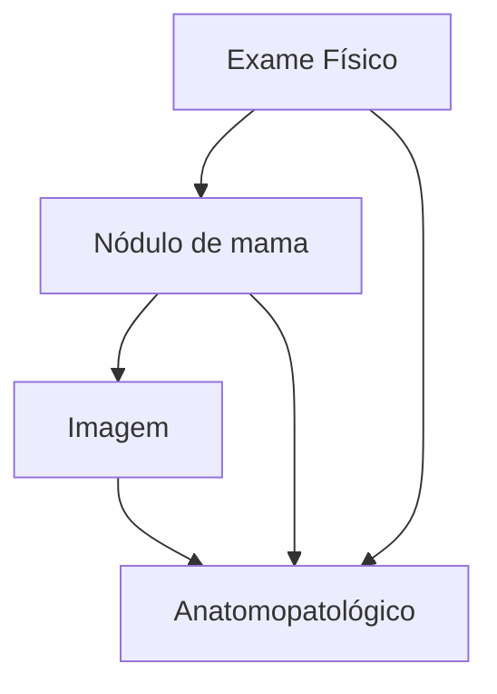
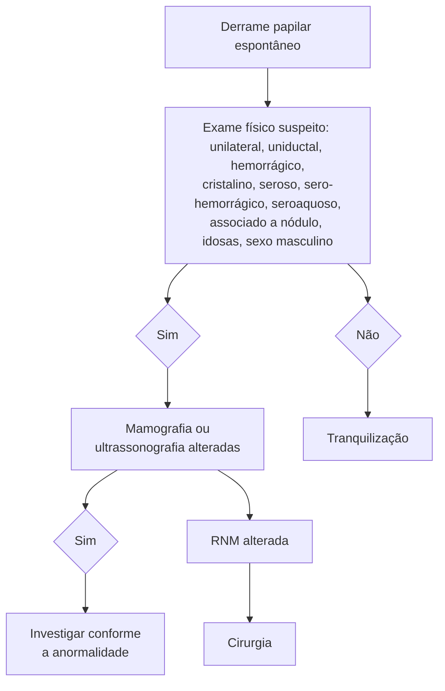

Afecções benignas das mamas

# PRINCIPAIS SINTOMAS EM MASTOLOGIA

| **NÓDULOS**
Cistos - simples x complexos
• Maioria dos cistos simples só é necessário tranquilizar a paciente. PAAF nas muito sintomáticas.
Fibroadenoma:
• Tratamento na maioria dos casos é apenas acompanhamento. Exérese se tamanho > 2-3 cm; sintomático; alterações suspeitas.
Tumor Phyllodes
• Diagnóstico diferencial do fibroadenoma. Pode ter crescimento contínuo e rápido. Tratamento: exérese cirúrgica com margem. | **FLUXO PAPILAR**
• Suspeito se unilateral, uniductal, espontâneo, hemorrágico, sero-hemorrágico ou cristalino, associado a nódulo, idosas ou no sexo masculino.
• Fluxo papilar suspeito = cirurgia está indicada. Ressecção do ducto acometido ou dos ductos principais.
• Lembrar dos papilomas intraductais
**MASTALGIA** - Clínica X Acíclica. Mamária X Extramamária. Baixa correlação com câncer de mama. |
| --------------------------------------------------------------------------------------------------------------------------------------------------------------------------------------------------------------------------------------------------------------------------------------------------------------------------------------------------------------------------------------------------------------------------------------------------------- | -------------------------------------------------------------------------------------------------------------------------------------------------------------------------------------------------------------------------------------------------------------------------------------------------------------------------------------------------------------------------------------------------------------------------------- |

## 1. OBJETIVOS DA AULA

Revisar as causas das principais queixas mamárias:
- Nódulo;
- Dor;
- Fluxo papilar.

## 2. NÓDULO

- A maioria dos nódulos mamários são **benignos**, porém é importante descartar malignidade.
- As causas mais comuns de nódulos palpáveis são cistos e fibroadenomas.

| Idade (anos) | Fibroadenoma (%) | Cistos (%) | Câncer (%) |
| ------------ | ---------------- | ---------- | ---------- |
| 5            | 0                | 0          | 0          |
| 10           | 5                | 0          | 0          |
| 15           | 20               | 0          | 0          |
| 20           | 30               | 0          | 0          |
| 25           | 10               | 0          | 0          |
| 30           | 0                | 0          | 0          |
| 35           | 0                | 5          | 0          |
| 40           | 0                | 10         | 0          |
| 45           | 0                | 15         | 5          |
| 50           | 0                | 15         | 10         |
| 55           | 0                | 10         | 12         |
| 60           | 0                | 5          | 15         |
| 65           | 0                | 0          | 15         |
| 70           | 0                | 0          | 15         |

**Figura 1** Causas mais comuns de nódulos mamários de acordo com a idade.

- Pacientes mais jovens (< 25-30 anos), há maior incidência de fibroadenoma. Entre 30-50 anos, são cistos em sua maioria. A partir dos 40 anos, no entanto, o risco de malignidade (câncer) aumenta progressivamente.

### 2.1 DIAGNÓSTICO DE NÓDULO DA MAMA:
- Baseado em exame físico, imagem e anatomopatológico.
- Dentre as principais causas de nodulações palpáveis temos:

### 2.2 CISTO:
- Podem ser **simples** (benignos) ou **complexos** (interior com vegetações ou debris);

**Tratamento:**
- Cistos simples não palpáveis: tranquilizar a paciente.
- Os cistos simples, quando muito grandes, podem causar incômodo à paciente, podendo-se lançar mão nesses casos da PAAF com objetivo de esvaziar o conteúdo do cisto e melhorar o sintoma da paciente. Nestes casos, só se encaminha para análise citológica o conteúdo retirado daqueles casos suspeitos, como quando há saída de conteúdo hemorrágico ou em caso de recidiva em curto espaço de tempo.
- Se durante a punção o cisto se esvazia completamente e há saída de conteúdo citrino, não há necessidade de citologia. **Figura 3**

**Figura 2** A avaliação diagnóstica completa do nódulo mamário envolve exame físico, de imagem e anatomopatológico

**Figura 3** Lesão anecóica, típica de cisto simples.

### 2.3 FIBROADENOMA:
- Tumor benigno mais comum da mama;

• Podem alterar de tamanho conforme a fase do ciclo menstrual;
• Pode aumentar na gestação e amamentação;
• Pode diminuir na menopausa;
• Não eleva o risco para câncer de mama.

**Características:**
• Circunscrito;
• Regular;
• Fibroelástico;
• Superfície lisa ou lobulada;
• Geralmente estabiliza em < 2-3 cm.

Quando as características do fibroadenoma diferem das citadas acima, é importante descartar a presença de tumor Phyllodes.

**O tratamento na maioria dos casos é apenas acompanhamento clínico. Porém, em alguns casos, pode-se optar pela exérese cirúrgica:**
• Tamanho > 2-3 cm (descartar tumor Phyllodes);
• Sintomático;
• Alterações radiológicas suspeitas;
• Considerar em casos de alto risco familiar e cancerofobia (medo de ser câncer).

**Figura 4** Fibroadenoma

**O fibroadenoma faz parte de um grupo de lesões, as lesões Fibroepiteliais:**
• O fibroadenoma apresenta menor número de mitoses e menor celularidade do estroma.
• Outra lesão fibroepitelial é o Tumor Phyllodes, que é mais proliferativo, com mais mitoses e celularidade do estroma, sendo parte dos diagnósticos diferenciais do fibroadenoma. O Tumor Phyllodes pode ser dividido entre Benigno, Borderline e Maligno;
• Ocorre mais em mulheres entre 40-50 anos;
• Raro. 0,3-0,9% dos tumores de mama;
• Pode ter crescimento contínuo e rápido.
• Tratamento: **exérese cirúrgica com margem.**
• Complicações: Recorrência local; Metástase → raro (disseminação hematogênica). **Figura 5**

## 2.4 ALTERAÇÕES FUNCIONAIS BENIGNAS DA MAMA (AFBM):

**Quadro clínico:**
• Dor, geralmente no QSL;
• Espessamento, nódulos palpáveis;
• Sintomas cíclicos, melhoram após a menstruação.

**Faixa etária:**
• 25-45 anos (menacme);
• USG: frequente o achado de cistos mamários;
• Conduta: seguimento, sintomáticos e uso de sutiã com boa sustentação da mama para controle de sintomas.

## 2.5 HAMARTOMA (OU FIBROADENOLIPOMA).
• Benigno, pouco frequente;
• Área de tecido mamário normal encapsulado (Breast in a breast);
• Conduta: seguimento. **Figura 6**

**Figura 5** Tumor Phyllodes.

**Figura 6** Fibroadenolipoma

## 3. FLUXO PAPILAR

### 3.1 CONCEITO:
• Exteriorização do fluxo pela papila fora do ciclo gravídico-puerperal;
• 90-95% de origem benigna;

PRINCIPAIS SINTOMAS EM MASTOLOGIA                                                                                   3

• Mais comum durante o menacme, porém, quando ocorre em idosas, o risco de malignidade aumenta;

**O fluxo papilar é subdividido em:**
• Secreção láctea (galactorreia);
• Secreção não láctea (telorreia).

## 3.2 FLUXO PAPILAR FISIOLÓGICO

• O fluxo papilar fisiológico pode ocorrer em até 2/3 das mulheres não lactantes, apresentando pequena quantidade de secreção, principalmente após estímulo excessivo do mamilo;
• Não está associado a patologias malignas;
• Não há terapêutica específica, além de orientações.
• O fluxo pode ser patológico, associado a lesões proliferativas ou carcinoma.

## 3.3 ANAMNESE DA PACIENTE COM FLUXO PAPILAR:

• Idade;
• Questionar manipulação excessiva do mamilo;
• Patologia mamária;
• Uso de anticoncepcionais ou TRH;
• Uso de medicamentos.

## 3.4 EXAME FÍSICO:

• Unilateral X Bilateral;
• Uniductal X Multiductal;
• Espontâneo X Provocado;
• Aspecto → lácteo, purulento, multicolorido, esverdeado, marrom, cristalino, seroso ou hemorrágico;
• Ponto de gatilho (local que ao ser comprimido causa saída do fluxo pela papila).

## 3.5 QUANDO INVESTIGAR UM FLUXO PAPILAR SUSPEITO?

• Unilateral;
• Uniductal;
• Espontâneo;
• Hemorrágico, sero-hemorrágico ou cristalino;
• Associado a nódulo;
• Pacientes idosas;
• Sexo masculino.

A presença de 1 característica acima já define o fluxo papilar como suspeito.

## 3.6 DIAGNÓSTICO:

• No diagnóstico de fluxo papilar não há benefício na coleta de citologia do fluxo papilar.

**Solicitar para afastar lesões concomitantes:**
• MMG → Se paciente com idade superior a 40 anos, sempre realizar MMG. Porém, a sensibilidade é baixa (26%).
• USG → Sensibilidade de 63%.
• RNM: Sensibilidade de 90%; Solicitar se MMG/USG não permitirem o diagnóstico. Figura 7

## 3.7 TRATAMENTO:

• Fluxo papilar suspeito = cirurgia está indicada.
• Exames de imagem identificaram causa → segue com tratamento específico.

• **Sem causa identificada:**
  • Desejo de amamentar → Ressecção do ducto acometido.
  • Sem desejo de amamentar e pós-menopausa → Ressecção dos ductos principais.

## 3.8 GALACTORREIA (SECREÇÃO LÁCTEA):

• Ocasionada por fatores não mamários, como o aumento da prolactina (PRL).
• Causa mais comum: medicamentos supressores da dopamina.

**Figura 7** Fluxograma na investigação do fluxo papilar.

**Tabela 1** Medicamentos que podem aumentar a prolactina.

| CLASSEFARMACOLÓGICA | MEDICAMENTO                                                                                                                                                                 |
| ------------------- | --------------------------------------------------------------------------------------------------------------------------------------------------------------------------- |
| Hormônios           | Estrogênios, anticoncepcionais orais, hormônios tireoidianos                                                                                                                |
| Psicotrópicos       | Risperidona, clomipramina, nortriptilina, inibidores da recaptação de serotonina, fenotiazina, antidepressivos tricíclicos, opioides, codeína, heroína, cocaína, sulpirida. |
| Antieméticos        | Metoclopramida, domperidona                                                                                                                                                 |
| Anti-hipertensivos  | Verapamil, metildopa, reserpina                                                                                                                                             |

• Confira na página seguinte a Tabela 2

## 3.9 PAPILOMA INTRADUCTAL:

**Lesão do epitélio do ducto mamário, podendo ser central (próximo à papila) ou periférico;**

• Central: Lesão no ducto principal, geralmente na RRA.
• Periférico: Ocorre nos ductos periféricos.

**Quadro clínico:**
• Fluxo papilar sanguinolento.
• Exames de Imagem podem evidenciar nódulo, cisto complexo, ducto com conteúdo sólido ou ducto dilatado.

• Quando apresenta **células atípicas**, está associado a uma elevação do risco de câncer de mama.

**Tratamento:**
• Com atipias: Excisão cirúrgica.
• Sem atipias: Controverso, porém geralmente recomenda excisão se houver lesão remanescente após a biópsia.

| ORIGEM                    | PATOLOGIA                                                                                                              |
| ------------------------- | ---------------------------------------------------------------------------------------------------------------------- |
| Lesões no SNC             | Prolactinomas, acromegalia, craniofaringioma, encefalite, tumor hipofisário, transecção cirúrgica, trauma hipofisário. |
| Lesões em parede torácica | Neurite por herpes-zóster, toracotomia, mastectomia, queimaduras, dermatites e traumatismos.                           |
| Doenças sistêmicas        | Insuficiência renal crônica, doença de Addison, doença de Cushing, hipotireoidismo primário, diabetes, hepatopatias.   |
| Produção ectópica         | Carcinoma broncogênico, hipernefroma.                                                                                  |
| Outros                    | Anovulação, coito, dilatação e curetagem, estimulação mamária, histerectomia, DIU, pseudociese, cirurgias de pescoço.  |

Tabela 2 Condições não medicamentosas que podem causar galactorreia

## 4. MASTALGIA

### 4.1 CONCEITOS:
• Comum: acomete 60-70% das mulheres;
• Principalmente em idade reprodutiva;
• Gera angústia e ansiedade, por medo do câncer de mama, porém a correlação entre mastalgia e câncer de mama é baixa, aproximadamente < 2%.
• A causa não é totalmente conhecida, porém, postula-se haver um fator hormonal, assim como um componente psicológico (stress).

### 4.2 PODE SER DIVIDIDA EM:
• Clínica (relação com ciclo menstrual) ou acíclica (sem relação com ciclo menstrual).
• Mamária ou extramamária.

### 4.3 DOR MAMÁRIA ACÍCLICA:
**Causas:**
• Ectasia Ductal;
• Hipertrofia mamária;
• Macrocistos;
• Trauma;
• Síndrome de Mondor (tromboflebite superficial das veias da parede torácica).

### 4.4 DOR EXTRA-MAMÁRIA.
**Causas:**
• Síndrome de Tietze (costocondrite esternal);
• Herpes-zóster;
• Angina;
• Relação ao TGI (ex: DRGE, colecistite);
• Musculoesqueléticas;
• Bursite escapular;
• Neurite intercostal.

| Medicamentos que podem causar mastalgia:                                                             |
| ---------------------------------------------------------------------------------------------------- |
| Medicamentos hormonais (estrogênio, progesterona, clomifeno, ciproterona).                           |
| Antidepressivos, ansiolíticos, antipsicóticos (sertralina, venlafaxina, amitriptilina, haloperidol). |
| Anti-hipertensivos/cardíacos (espironolactona, metildopa, digoxina).                                 |
| Antimicrobianos (cetoconazol, metronidazol).                                                         |
| Miscelânea (cimetidina, domperidona, ciclosporina)                                                   |

Tabela 3 Mastalgia de causa medicamentosa

Adaptado de Tratado de Ginecologia da Febrasgo)

### 4.5 TRATAMENTO DA MASTALGIA:
**Não medicamentoso:**
• Orientação da paciente;
• Uso de sutiã adequado (com alças largas, sem aro, com boa sustentação mamária).

**Medicamentoso:**
• Analgésico, como AINE, inclusive podendo ser tópico;
• Antidepressivos ou ansiolíticos se houver componente psicológico importante;
• Tamoxifeno, reservado para os casos mais extremos.

## 5. MASTITE

### 5.1 MASTITE PUERPERAL:
A principal forma de mastite é a puerperal.

**Ocorre pela transmissão pelo neonato de bactérias da flora oral durante a sucção, facilitada pelas fissuras na papila;**
• Pode ser associada a más condições de higiene local, porém não é obrigatório, podendo ocorrer em pacientes com higiene adequada;
• Principais agentes envolvidos: *Staphylococcus aureus, Staphylococcus epidermidis, Streptococcus sp.*

**Quadro Clínico:**
• Hiperemia da mama;
• Febre;
• Mama túrgida;
• Abscesso mamário.

**Tratamento:**
• Manter a amamentação se possível;
• Ordenha das mamas;
• Antibioticoterapia com Cefalexina 500mg VO de 6/6h por 7-14 dias.

PRINCIPAIS SINTOMAS EM MASTOLOGIA                                                                    5

• Se abscesso, realizar drenagem (cirúrgica ou percutânea com agulha) e internação para antibioticoterapia endovenosa.

**Outras causas de mastites infecciosas:**
• Abscesso subareolar crônico recidivante;
• Mastite tuberculosa;
• Mastite por micobactérias;

• Mastite viral – herpes simples ou herpes-zóster;
• Mastite luética.

## 5.2 MASTITES NÃO INFECCIOSAS
• Mastite periductal;
• Mastite granulomatosa idiopática;
• Sarcoidose mamária.

# REFERÊNCIAS

**Figura 1** Causas mais comuns de nódulos mamários de acordo com a idade.

Adaptado de: Doenças benignas da mama. Disponível em: <https://quizlet.com/br/710870075/doencas-benignas-das-mamas-flash-cards/>.

**Figura 3** Lesão anecóica, típica de cisto simples.

Atlas of breast cancer early detection. Disponível em: <https://screening.iarc.fr/atlasbreastdetail.php?Index=091&e=>.

**Figura 5** Tumor Phyllodes.

DE SOUZA, J. A. et al. Phyllodes tumor of the breast: case report. Revista da Associação Médica Brasileira, v. 57, n. 5, p. 495–497, set. 2011.

**Figura 6** Breast in a breast.

NIKNEJAD, M. T. Breast within a breast sign - hamartoma | Radiology Case | Radiopaedia.org. Disponível em: <https://radiopaedia.org/cases/breast-within-a-breast-sign-hamartoma?lang=us>.
