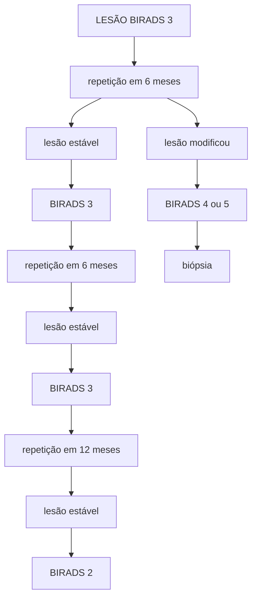

# PROPEDÊUTICA MAMÁRIA

| ## BIRADS • 0 (Incompleta) → realizar incidências adicionais ou complementar com outros exames • 1 (Negativa) → rotina • 2 (Achados benignos) → rotina • 3 (Provavelmente benigno) → repetição do exame em 6 meses • 4 (Achado suspeito) → biópsia • 5 (Altamente sugestivo de malignidade) → biópsia • 6 (Malignidade comprovada) → tratamento apropriado MMG - diagnóstica x rastreamento; melhor exame para microcalcificações. |   | ## USG • Caracterização de nódulos visto na MMG (diferenciar o nódulo do cisto); 1º exame em jovens, gestantes ou lactantes; método de escolha para guiar biópsia; pode complementar a MMG em mulheres com mama densa. • Nódulo - BENIGNO (oval, circunscrito, paralelo à pele, sem fluxo ao doppler) X SUSPEITO • RNM → rastreamento no alto risco. • BIÓPSIA PERCUTÂNEA → PAAF (punção de cistos, avaliação de linfonodos), CORE (Diagnóstico anatomopatológico -menor índice de falso-negativo), MAMOTOMIA (fragmentos maiores, melhor exame para microcalcificações.) |   |
| ---------------------------------------------------------------------------------------------------------------------------------------------------------------------------------------------------------------------------------------------------------------------------------------------------------------------------------------------------------------------------------------------------------------------------------- | - | ------------------------------------------------------------------------------------------------------------------------------------------------------------------------------------------------------------------------------------------------------------------------------------------------------------------------------------------------------------------------------------------------------------------------------------------------------------------------------------------------------------------------------------------------------------------------- | - |

## 1. EXAME FÍSICO DAS MAMAS

### 1.1 INSPEÇÃO:

• Inspeção estática: paciente sentada, com as mãos na cintura. Avaliar simetria, volume das mamas, presença de retração ou abaulamento.
• Inspeção dinâmica: boa para avaliar retração (lesões aderidas à pele ou à musculatura peitoral). Paciente sentada com as mãos na cintura, braços elevados acima da cabeça e com o tronco pendendo para a frente.

### 1.2 PALPAÇÃO:

• Paciente deitada e com membros superiores acima da cabeça. Palpação sistematizada de toda a mama (de cima para baixo ou como um relógio).
• Palpação de região axilar e fossas supra e infra claviculares, com a paciente sentada.
• Expressão mamilar (avaliar presença de fluxo mamilar, verificar se esse fluxo é uniductal ou multiductal e se possui ponto de gatilho).

## 2. EXAMES DE IMAGEM

### 2.1 LOCALIZAÇÃO DAS LESÕES:

• Convencionou-se localizar as lesões por meio de quadrantes (superolateral, superomedial, inferolateral e inferomedial) ou em horas (descrição baseada nos ponteiros de um relógio).

| M. peitoral
maior | Superior
Lateral | Superior
Medial |
| --------------------- | -------------------- | ------------------- |
|                       | Inferior
Lateral | Inferior
Medial |

Areola da mama
Papila mamária
Glândulas areolares

**Figura 1** Divisão da mama em quadrantes.

|    | 12h   |    |
| -- | ----- | -- |
| 9h | Lesão | 3h |
|    | 6h    |    |

**Figura 2** Localização por horas.

### 2 MAMOGRAFIA (MMG):

**Indicações:**

1. MMG diagnóstica:
   • Pacientes sintomáticas:
   • Evita-se realizar MMG em pacientes com idade inferior a 30 anos devido à alta densidade da mama nessa faixa etária. A presença de mamas densas pode dificultar a identificação de lesões mamárias pela MMG em pacientes jovens.

2. MMG de rastreamento realizada em pacientes assintomáticas com objetivo de diagnóstico precoce do câncer de mama.

OBS: A MMG é o exame de escolha para diagnóstico de lesões mamárias em homens.

**Duas incidências são realizadas na mamografia:**
- Mediolateral oblíqua
- Crânio caudal.

**Figura 3** Quadrantes superiores (1), inferiores (2), laterais (3) e medial (4).

**Figura 4** Realização de mamografia na incidência médio lateral oblíqua.
- Na incidência médio lateral oblíqua, traça-se uma linha imaginária entre a papila e o músculo peitoral maior (linha vermelha na imagem acima). O que estiver acima dessa linha representa os quadrantes superiores da mama. Abaixo dessa linha ficam os quadrantes inferiores da mama.

**Figura 5** Realização de mamografia na incidência craniocaudal.
- Na incidência crânio caudal também traça-se uma linha imaginária entre a papila e o músculo peitoral maior, sendo que o que estiver acima dessa linha representa os quadrantes laterais da mama e abaixo ficam os quadrantes mediais da mama (ver Figura 3).

## 3. BIRADS

**BIRADS**: é um sistema de classificação desenvolvido para padronizar a descrição e interpretação dos achados mamográficos, ultrassonográficos e de ressonância magnética.

**Tabela 1** Conduta recomendada a partir de cada classificação BIRADS

| BIRADS                                 | Probabilidade de câncer       | Conduta                                                  |
| -------------------------------------- | ----------------------------- | -------------------------------------------------------- |
| 0- Incompleta                          | -                             | Incidências adicionais ou complementar com outros exames |
| 1- Negativa                            | -                             | Seguir Rotina                                            |
| 2- Achados benignos                    | -                             | Seguir Rotina                                            |
| 3- Achado provavelmente benigno        | 0 - 2% chance de malignidade  | Repetição do exame em 6 meses                            |
| 4 - Achado suspeito                    | 3 - 95% chance de malignidade | Biópsia                                                  |
| 5 - Altamente sugestivo de malignidade | > 95% chance de malignidade   | Biópsia                                                  |
| 6 - Malignidade                        | -                             | Tratamento apropriado                                    |

### BIRADS 3:

**Figura 6** Fluxograma abordagem da lesão BIRADS 3

**Classificação das lesões mamárias identificadas na MMG segundo BIRADS**

Consultar Tabela 2 e Figura 7 na próxima página.
- Na mamografia: o parênquima mamário aparece como estrutura branca, assim como alguns tipos de nódulos e calcificações, desta maneira, a identificação dessas lesões pode ser mais difícil em mamas mais densas.
- Além disso, a densidade mamária elevada na pós-menopausa foi associada a um risco aumento do risco de câncer de mama.

PROPEDÊUTICA MAMÁRIA                                                                              3

**Tabela 2** Achados mamográficos característicos de cada classificação

**BIRADS**

| BIRADS                                 | Achados                                                                                                                                                                           |
| -------------------------------------- | --------------------------------------------------------------------------------------------------------------------------------------------------------------------------------- |
| 0- Incompleta                          | -                                                                                                                                                                                 |
| 1- Negativa                            | Exame normal                                                                                                                                                                      |
| 2- Achado benigno                      | MCC (microcalcificações) benignas (cutâneas, grosseiras, "em pipoca", vasculares, em "leite de cálcio"). Nódulo com conteúdo de gordura, distorção pós-cirúrgicas.                |
| 3- Achado provavelmente benigno        | Assimetria focal não palpável
MCC puntiformes                                                                                                                                 |
| 4 - Achado suspeito                    | MCC suspeitas (amorfas, heterogêneas, grosseiras, pleomórficas finas, lineares finas)
Assimetria em desenvolvimento;
Distorção de arquitetura não relacionada à cirurgia. |
| 5 - Altamente sugestivo de malignidade | Nódulo espiculado;
Nódulos associados MCC pleomórficas.                                                                                                                       |

**Figura 7** Classificação da densidade mamária: A - predomínio de tecido adiposo; B - densidades fibroglandulares esparsas; C- Heterogeneamente densas e D- Extremamente densas.

## 3.1 CLASSIFICAÇÃO DOS NÓDULOS NA MAMOGRAFIA:

• De acordo com a morfologia ou forma (shape): arredondado, oval ou irregular.

• De acordo com as margens (margin): circunscritas (> 75% circunscrita), obscurecidas, microlobuladas, indistinta ou espiculada (mais suspeita para malignidade).

• De acordo com a densidade (density) comparada com a densidade do parênquima mamário: baixa, igual ou alta densidade.

**Figura 8** Classificação dos nódulos mamários de acordo com a forma. Forma redonda, oval e irregular, respectivamente.

| Circunscrita | Obscurecida | Microlobulada |
| ------------ | ----------- | ------------- |
| Indistinta   | Espiculada  |               |

**Figura 9** Classificação de acordo com as margens. Margens circunscritas, obscurecidas, microlobuladas, indistintas ou espiculadas, respectivamente.

| Baixa densidade | Densidade igual | Alta densidade |
| --------------- | --------------- | -------------- |

**Figura 10** Classificação de acordo com a densidade. Densidade baixa, igual ou alta, respectivamente.

## 3.2 CLASSIFICAÇÃO DAS MICROCALCIFICAÇÕES:

• Tipicamente benignas:

| Calcificação cutânea | Leite de cálcio | Em bastonete |
| -------------------- | --------------- | ------------ |
| Distrófica           | Em pipoca       | Calcificação |
| Vascular             | Redonda         | Puntiformes  |

**Figura 11** Calcificações benignas na mamografia.

• Morfologia suspeita:

| Amorfas                 | Amorfas (CDIS) | Pleomórficas finas |
| ----------------------- | -------------- | ------------------ |
| Heterogêneas grosseiras | Finas lineares | Finas lineares     |

**Figura 12** Calcificações suspeitas na mamografia.

## 3.3 INCIDÊNCIAS ADICIONAIS NA MMG:

### Compressão localizada;

• Quando é feita uma compressão maior numa região específica da mama.

• Indicações:
  • Melhor visualização das margens de um nódulo;
  • Diferenciar nódulo de "somação de imagens".

![Figura 13. Compressão localizada da mama.]

### Ampliação/Magnificação;

• Quando você dá um "zoom" em determinada região da MMG.

• Indicações: Melhor avaliação de microcalcificações (consegue avaliar melhor a morfologia das calcificações).

![Figura 14. Ampliação e magnificação. Mamografia com microcalcificações - showing three images labeled CC, MLO, and Magnificação]

### Rolamento;

• Indicações: Desfazer imagens suspeitas que possam ter sido criadas pela somação de estruturas.

![Figura 15. Rolamento.]

### Eklund;

• "Empurra a prótese para dentro e puxa para o mamógrafo apenas o parênquima mamário".

![Diagrams showing implant positioning in two views]

• Indicações: mamas com prótese.

![Figura 16. Manobra de Eklund.]

![Figura 17. Manobra de Eklund.]

## 4. ULTRASSONOGRAFIA

• Útil na caracterização de **nódulos** visto na MMG (diferenciar o nódulo do cisto);

• Caracterização de lesão palpável;

• 1º exame a ser solicitado em jovens, gestantes ou lactantes;

• Método de escolha para guiar biópsia percutânea (mais barato e mais fácil);

• Indicada no rastreamento complementar em mulheres com mama densa e alto risco para câncer de mama; Atenção: USG não substitui a mamografia no rastreamento, apenas complementa.

• USG second look.

**Achados no BIRADS ultrassonográfico**

Consultar **Tabela 3** na próxima página.

### 4.1 CARACTERÍSTICAS PARA DIFERENCIAR

![Two ultrasound images showing benign and suspicious characteristics]

| Características benignas | Características suspeitas                           |
| ------------------------ | --------------------------------------------------- |
| Oval                     | Redondo, irregular                                  |
| Circunscrito             | Microlobuladas, indistintas, anguladas, espiculadas |
| Paralelo à pele          | Não paralelo à pele                                 |
| Sem fluxo ao doppler     | Sombra acústica posterior                           |

### NÓDULO BENIGNO OU SUSPEITO NA USG:

PROPEDÊUTICA MAMÁRIA                                                                                                    5

**Figura 18** Características benignas e suspeitas dos nódulos mamários na ultrassonografia

| BIRADS                                 | Achados                                                                                                                          |
| -------------------------------------- | -------------------------------------------------------------------------------------------------------------------------------- |
| 0- Incompleta                          | -                                                                                                                                |
| 1- Negativa                            | Exame normal                                                                                                                     |
| 2- Achado benigno                      | Cistos simples, múltiplos microcistos agrupados.
Nódulos sólidos estáveis >2 anos, alterações pós cirúrgicas.                |
| 3- Achado provavelmente benigno        | Nódulos sólido com critério de benignidade;
Cisto complicado único, microcistos agrupados únicos.                            |
| 4 - Achado suspeito                    | Nódulo sólido com 1 ou mais critério de suspeito;
Nódulo com aumento do diâmetro > 20% em 6 meses;
Ducto único dilatado. |
| 5 - Altamente sugestivo de malignidade | Nódulo sólido com forma irregular, margem espiculada ou angulada e sombra acústica posterior.                                    |

**Figura 21** Cisto simples.

## 5. RESSONÂNCIA MAGNÉTICA

### 5.1 INDICAÇÕES:
- Rastreamento do câncer de mama em pacientes de alto risco;
- Investigação de neoplasia oculta (neoplasia mamária diagnosticada através de biopsia axilar porém sem evidência de doença mamária em MMG e USG);
- Avaliação de implantes.

## 6. BIÓPSIA DE MAMA

### 6.1 OS MÉTODOS DE BIÓPSIA DA MAMA SÃO:

**Punção aspirativa por agulha fina (PAAF):**
- Faz diagnóstico citológico, útil na avaliação de linfonodos ou cistos simples sintomáticos (para o esvaziamento) **Figura 22**

**Figura 22** Punção de linfonodo axilar.

**Tabela 3** Achados ultrassonográficos característicos de cada classificação

**BIRADS**

**Figura 19** Nódulo no quadrante superolateral da mama esquerda.

**Figura 20** Nódulo oval, hipoecogênico, circunscrito, paralelo a pele.

**Figura 23** PAAF de cisto sintomático.

**Punção aspirativa por agulha grossa (core biopsy);**
• Diagnóstico anatomopatológico (menor índice de falso-negativo);
• Permite imunoistoquímica.

**Figura 24** Core biopsy.

**Biópsia assistida a vácuo (mamotomia).**
• Permite a retirada de fragmentos maiores (até 1 cm);
• Melhor exame para microcalcificações ou nódulos de até 1 cm.

**Figura 25** Mamotomia.

PROPEDÊUTICA MAMÁRIA

# REFERÊNCIAS

**Figura 1** Divisão da mama em quadrantes.

DE, D. CLASSIFICAÇÃO DAS MAMAS. [s.l: s.n.]. Disponível em: https://amacc.med.up.pt/docs/12%20Congresso%20-%20Apresentação%2012%20-%20Procedimentos%20na%20mama.pdf

**Figura 3** Quadrantes superiores (1), inferiores (2), laterais (3) e medial (4).

Posicionamento mamográfico. Dr.Pixel. Campinas: Dr Pixel, 2015. Disponível em: https://drpixel.fcm.unicamp.br/conteudo/posicionamento-mamografico.

**Figura 4** Realização de mamografia na incidência médio lateral oblíqua.

Fundamentos da propedêutica por imagem da mama. Dr.Pixel. Campinas: Dr Pixel, 2016. Disponível em: https://drpixel.fcm.unicamp.br/conteudo/fundamentos-da-propedeutica-por-imagem-da-mama

**Figura 5** Realização de mamografia na incidência craniocaudal.

Fundamentos da propedêutica por imagem da mama. Dr.Pixel. Campinas: Dr Pixel, 2016. Disponível em: https://drpixel.fcm.unicamp.br/conteudo/fundamentos-da-propedeutica-por-imagem-da-mama

**Figura 7** Classificação da densidade mamária: A - predomínio de tecido adiposo; B - densidades fibroglandulares esparsas; C- Heterogeneamente densas e D- Extremamente densas.

BARRA, D. R. Mamas Densas: o que é e como tratar? Disponível em: <https://imeb.com.br/o-que-significa-ter-as-mamas-densas/>.

**Figura 8** Classificação dos nódulos mamários de acordo com a forma. Forma redonda, oval e irregular, respectivamente.

The Radiology Assistant : Bi-RADS for Mammography and Ultrasound 2013. Disponível em: <https://radiologyassistant.nl/breast/bi-rads/bi-rads-for-mammography-and-ultrasound-2013>.

**Figura 9** Classificação de acordo com as margens. Margens circunscritas, obscurecidas, microlobuladas, indistintas ou espiculadas, respectivamente.

The Radiology Assistant : Bi-RADS for Mammography and Ultrasound 2013. Disponível em: <https://radiologyassistant.nl/breast/bi-rads/bi-rads-for-mammography-and-ultrasound-2013>.

**Figura 10** Classificação de acordo com a densidade. Densidade baixa, igual ou alta, respectivamente.

The Radiology Assistant : Bi-RADS for Mammography and Ultrasound 2013. Disponível em: <https://radiologyassistant.nl/breast/bi-rads/bi-rads-for-mammography-and-ultrasound-2013>.

**Figura 11** Calcificações benignas na mamografia.

The Radiology Assistant : Bi-RADS for Mammography and Ultrasound 2013. Disponível em: <https://radiologyassistant.nl/breast/bi-rads/bi-rads-for-mammography-and-ultrasound-2013>.

**Figura 12** Calcificações suspeitas na mamografia.

The Radiology Assistant : Bi-RADS for Mammography and Ultrasound 2013. Disponível em: <https://radiologyassistant.nl/breast/bi-rads/bi-rads-for-mammography-and-ultrasound-2013>.

**Figura 13** Compressão localizada da mama.

Posicionamento em Mamografia. Disponível em: <http://www.radioinmama.com.br/posicionamentomama.html>.

**Figura 14** Ampliação e magnificação. Mamografia com microcalcificações.

Disponível em: <https://www.youtube.com/watch?app=desktop&v=84GXhpSpa14>.

**Figura 15** Rolamento.

Posicionamento em Mamografia. Disponível em: <http://www.radioinmama.com.br/posicionamentomama.html>.

**Figura 16** Manobra de Eklund.

DALKE, Acervo da UFPR, Departamento de Anatomia, 2012.

**Figura 17** Manobra de Eklund.

DALKE, Acervo da UFPR, Departamento de Anatomia, 2012.

**Figura 18** Características benignas e suspeitas dos nódulos mamários na ultrassonografia

CA De Mama Flashcards by Guilherme Lopes | Brainscape. Disponível em: <https://www.brainscape.com/flashcards/ca-de-mama-11779728/packs/19478195>.

**Figura 19** Nódulo no quadrante superolateral da mama esquerda.

https://drpixel.fcm.unicamp.br/conteudo/fundamentos-da-propedeutica-por-imagem-da-mama>. Acesso em: 15 ago. 2021.

**Figura 20** Nódulo oval, hipoecogênico, circunscrito, paralelo a pele.

BI-RADS: entenda por que o histórico do paciente é importante. <https://educa.cetrus.com.br/bi-rads-por-que-historico-do-paciente-e-importante/>.

**Figura 21** Cisto simples.

Atlas of breast cancer early detection. Disponível em: <https://screening.iarc.fr/atlasbreastdetail.php?Index=091&e=>.

**Figura 22** Punção de linfonodo axilar.

Breast and Axilla | 5.6 Axilla : Case 5.6.1 Axilla | Ultrasound Cases. Disponível em: <https://www.ultrasoundcases.info/metastases-of-non-breast-tumors-3912/>.

**Figura 23** PAAF de cisto sintomático.

Punção de cisto. Disponível em: <https://themehill.com/puncao-de-cisto-flv/>.

**Figura 24** Core biopsy.

Breast Biopsy: Preparation, Procedure & What to Expect. Adaptado de: <https://my.clevelandclinic.org/health/diagnostics/24204-breast-biopsy-overview>.

**Figura 25** Mamotomia.

INTERATIVA, HOOM. Climego. Disponível em: <https://climego.com.br/artigo-inter/-core-biopsy>.
