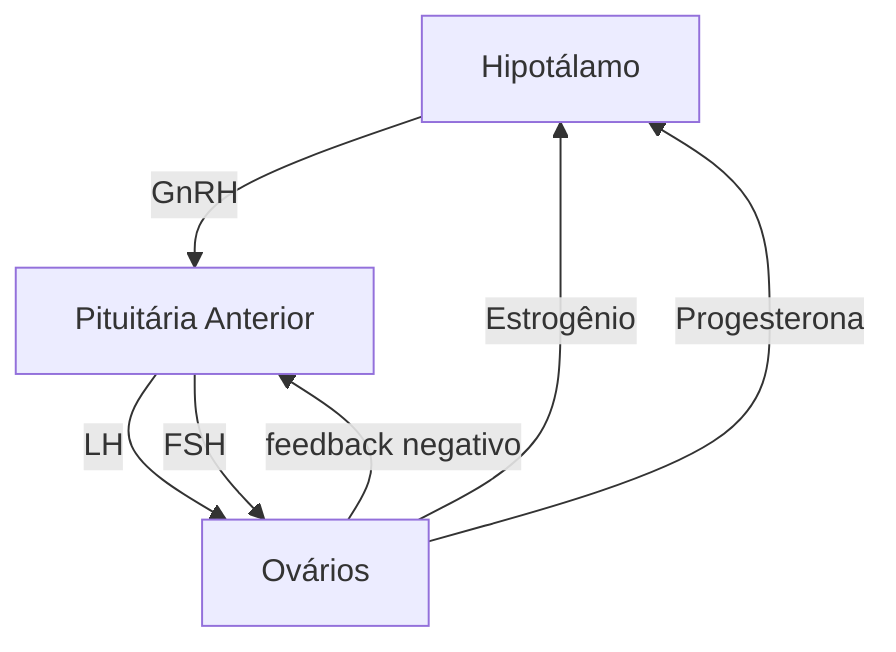

Climatério | Síndrome geniturinária da pós menopausa

# SÍNDROME CLIMATÉRICA

• Sintomas climatéricos: Sintomas vasomotores (fogachos), síndrome urogenital e disfunção sexual.
• TH sistêmica: indicada para paciente com sintomas vasomotores.
• Sempre associar progesterona em mulheres com útero.

• Contraindicações: lembrar das contraindicações aos contraceptivos combinados!
• Síndrome urogenital isolada responde bem ao estriol tópico, que não tem absorção sistêmica.

## 1. CONSIDERAÇÕES GERAIS

### 1.1 TRANSIÇÃO MENOPÁUSICA:
• Período no qual a mulher pode apresentar sintomas climatéricos;
• A duração é variável: pode durar anos;
• Caracterizado por ciclos anovulatórios e disfunção hormonal.

**Menopausa: Idade da última menstruação.**
• Diagnóstico retrógrado: um ano sem menstruar.
• Idade média no Brasil: 48 anos
• Fisiológica a partir dos 40 anos.
• Antes dos 40 anos = usar o termo insuficiência ovariana prematura (IOP).

## 2. FISIOLOGIA

• A menopausa é uma situação de hipogonadismo hipergonadotrófico;
• FSH alto
• Estradiol baixo

### 2.1 FONTES DE ESTROGÊNIO NA MULHER
• Ovários – estradiol (mais potente)
• Tecido adiposo – estrona (moderado)
• obs: Obesas costumam ter menos sintomas climatéricos devido a produção de estrona pelo tecido adiposo.
• Placenta – estriol

### 2.2 BALANÇO HORMONAL

**Eixo hipotalâmico-hipofisário-gonodal**

• Os folículos ovarianos começam a ser produzidos a partir de 8 semanas de idade gestacional (IG), atingindo um número máximo (~ 7 milhões) em torno da 20ª semana de gestação.
• As mulheres têm um número predefinido de folículos que ovulam ou sofrem atresia ao longo da vida, ininterruptamente e independentemente de qualquer coisa. A velocidade com que isso acontece não pode ser atenuada por nenhum fator, mas pode ser acelerada por consumo de álcool, tabagismo, cirurgias, medicações, radioterapia.

### 2.3 TRANSIÇÃO MENOPAUSAL
• Irregularidade menstrual devido a variabilidade hormonal, ovulação inconstante.
• Diminuição de folículos → queda do estradiol → níveis de E2 → insuficiência para gerar pico de LH → anovulação.
• Sem formação de corpo lúteo, sem progesterona.
• Proliferação endometrial sem contrabalanço de progesterona: risco aumentado de CA de endométrio no período de transição menopausal.

## 3. QUADRO CLÍNICO

### 3.1 SINTOMAS VASOMOTORES
• Fogachos
• Irregularidade menstrual: ciclos infrequentes → amenorreia
• Na fase de transição menopausal já podem estar presentes

### 3.2 SÍNDROME UROGENITAL
• Secura vaginal, dispareunia, disúria, prurido, urgência miccional, infecção recorrente do trato urinário
• Uretra e bexiga também têm receptores de estrogênio, urotélio também fica atrófico
• Responde bem ao estriol tópico.

### 3.3 DISFUNÇÃO SEXUAL
• Diminuição de libido, irritabilidade, insônia
• Os sintomas vasomotores e urogenitais são decorrentes do déficit de estrogênios. A diminuição de libido decorre principalmente do déficit de androgênios.

### 3.4 ÍNDICE DE KUPPERMAN
• Quantifica o impacto dos sintomas climatéricos

**Tabela 1** Intensidade dos sintomas climatéricos através do Índice de Kupperman

| SINTOMAS                                                            | LEVES | MODERADOS | INTENSOS |
| ------------------------------------------------------------------- | ----- | --------- | -------- |
| Ondas de Calor                                                      | 4     | 8         | 12       |
| Parestesia                                                          | 2     | 4         | 6        |
| Insônia                                                             | 2     | 4         | 6        |
| Nervosismo                                                          | 2     | 4         | 6        |
| Depressão                                                           | 1     | 2         | 3        |
| Fadiga                                                              | 1     | 2         | 3        |
| Artralgia/Mialgia                                                   | 1     | 2         | 3        |
| Cefaléia                                                            | 1     | 2         | 3        |
| Palpitação                                                          | 1     | 2         | 3        |
| Zumbido no ouvido                                                   | 1     | 2         | 3        |
| LEVES – ATÉ 19
MODERADOS – DE 20 A 35
INTENSOS – MAIS DE 35 |       |           |          |

## 3.5 REPERCUSSÕES DO HIPOESTROGENISMO:

• Alterações em fâneros e pele;
• Sintomas vasomotores;
• Alterações corporais e metabólicas
• Alterações atróficas, urogenitais e sexuais;
• Alterações cognitivas do humor e do sono;
• Alterações cardiovasculares;
• Alterações articulares;
• Alterações ósseas.

# 4. DIAGNÓSTICO

## 4.1 CLÍNICO

• 01 ano após a data da última menstruação se > 40 anos
• Sintomas + idade >40 anos, amenorreia > 1 ano.

## 4.2 LABORATORIAL

• FSH > 40 mUI/mL
• Estradiol < 20 pg/mL

# 5. TRATAMENTO

## 5.1 OBJETIVOS DO TRATAMENTO

• Melhorar a qualidade de vida
• Atividade física reduz a frequência e intensidade dos sintomas vasomotores, melhora qualidade de vida, não é superior à terapia de reposição hormonal (TRH ou TH).
• Estimular dieta saudável
• Diminuir o estresse
• Roupas frescas e arejadas

• Prevenir riscos
  • Osteoporose
  • Neoplasias
  • Risco cardiovascular

## 5.2 SISTÊMICO

• Terapia hormonal: estrogênio + progesterona (proteção endometrial em pacientes com útero)
• A principal indicação são sintomas vasomotores com impacto na qualidade de vida;
• Se HAS, tabagista ou dislipidêmica = preferir via transdérmica
• ISRS melhoram os fogachos (em caso de contraindicação para terapia hormonal)
• Isoflavona, cranberry, vitamina E, cinarizina: sem evidência, podem ser usados como alternativa em pacientes com contraindicação a TH.

## 5.3 TÓPICO

• Se queixa apenas da síndrome geniturinária, administrar estrogênio tópico, que não tem absorção sistêmica significativa.
• A substância usada é o promestrieno ou estriol.

**Tabela 2** Diferentes tipos de estrogênios utilizados para terapia de reposição hormonal, e suas dosagens.

| Tipos                      | Doses                    | Via de administração   |
| -------------------------- | ------------------------ | ---------------------- |
| 17-β-estradiol micronizado | 1 e 2 mg/dia             | Oral                   |
| Estradiol                  | 25, 50 e 100 p/dia       | Transdérmica (adesivo) |
|                            | 0,5; 1,0; 1,5 e 3 mg/dia | Percutânea (gel)       |
| Valerato de estradiol      | 1 e 2 mg/dia             | Oral                   |
| Estrogênios conjugados     | 0,3; 0,45; 0,625         | Oral                   |
|                            | 1,25 mg/dia              | Oral                   |
|                            | 0,625 μ/dia              | Vaginal                |
| Estriol                    | 2 a 6 mg/dia             | Oral                   |
|                            | 0,5 mg/dia               | Vaginal                |
| Promestrieno               | 10 mg/dia                | Vaginal                |

# 6. TERAPIA HORMONAL - RISCOS E BENEFÍCIOS

## 6.1 BENEFÍCIOS

• Redução do risco cardiovascular (aumenta HDL e diminui LDL).
  • Em pacientes com mais de 60 anos ou que estão há mais de 10 anos na menopausa e também em pacientes que já possuem risco cardiovascular elevado, o risco é aumentado
• Redução do risco de CA colorretal

SÍNDROME CLIMATÉRICA                                                                                                  3

• Melhora os sintomas vasomotores e síndrome urogenital
• Prevenção de osteoporose e fraturas
• Melhora dos sintomas depressivos e insônia

## 6.2 RISCOS
• Aumenta o risco de CA de mama (menos de 1% ao ano)
• Pequeno aumento do risco para TEV
• Sem aumento no risco de hiperplasia/neoplasia endometrial se associar com progesterona

## 6.3 CONTRAINDICAÇÕES A TH COM ESTROGÊNIO
• Câncer de mama
• Câncer de endométrio
• Evento tromboembólico prévio
• Doença sistêmica descompensada
• LES/SAAF
• Doença cardiovascular estabelecida
• Sangramento genital ou nódulo mamário não investigados
• Meningioma (apenas progesterona)

## 6.4 JANELA DE OPORTUNIDADE PARA TERAPIA HORMONAL:
• Iniciar em até 5-10 anos da menopausa. Esse conceito surgiu após análises de estudos como o WHI.
• WHI (estudo): introdução de TH em mulheres de qualquer idade, muitas com doença cardiovascular já estabelecida: aumento significativo no número de óbitos do grupo da TH.
• Precisou ser interrompido: foi realizado em mulheres menopausadas de todas as idades. Quando se introduz TH fora da janela de oportunidade, aumenta-se muito o risco cardiovascular.

## 6.5 TIBOLONA
• Derivado da 19-nortestosterona, possui propriedades progestagênica, estrogênica e androgênica.
• Ajuda no alívio dos sintomas climatéricos e síndrome geniturinária, prevenção da perda de massa óssea e efeitos positivos sobre a sexualidade e humor.
• Pode piorar a dislipidemia.

## 7. TRANSTORNO DO DESEJO SEXUAL HIPOATIVO (DSH)

• Distúrbio sexual caracterizado pelo desinteresse pelas relações sexuais durante um período maior que 6 meses;
• A aplicação de testosterona transdérmica é efetiva no tratamento da diminuição de desejo sexual de mulheres pós-menopausa (grau de evidência A), bem como para mulheres nos últimos anos do menacme (grau de evidência B).

• O uso de testosterona transdérmica por período curto (até 3 anos) é seguro. Há necessidade de estudos bem conduzidos sobre reposição de testosterona em pacientes com falência ovariana prematura.

## 8. INSUFICIÊNCIA OVARIANA PREMATURA

• Perda de atividade ovariana antes dos 40 anos
• Cursa com hipoestrogenismo
• Ciclos com intervalos longos e irregulares → amenorréia secundária
• Amenorreia primária: IOP antes do processo puberal
• Causa de hipogonadismo hipergonadotrófico

## 8.1 CAUSAS
• Autoimunes: 30% dos casos
• Genéticas: 15% dos casos
  • Síndrome de Turner, disgenesia gonadal pura, trissomia do X, deleções, translocações ou mutações no cromossomo X, Síndrome do X frágil, ou defeitos genéticos autossômicos.
• Iatrogênicas: dano causado por RT, QT ou cirurgias
• Infecciosa: parotidite, rubéola, varicela, herpes-zoster, CMV, tuberculose, malária e Shigella.
• Tabagismo (aumento do risco)
• Idiopática

## 8.2 DIAGNÓSTICO
• Dosagem hormonal é mais relevante
• Dosagem de FSH > 25 mUI/mL em duas dosagens com intervalo de 4 semanas.

## 8.3 REPERCUSSÕES
• Hipoestrogenismo prolongado – sintomas vasomotores, atrofia urogenital
• Infertilidade
• Aumento do risco de Osteoporose
• Aumento do risco de doenças cardiovasculares
• Aumento do risco doenças neurodegenerativas

## 8.4 TRATAMENTO
• Reposição estrogênica – preferencialmente estrogênio natural (verificar contraindicações) e manter até 50 anos (idade fisiológica da menopausa).
• Via oral ou transdérmica.
• Iniciar progestagênio 2 anos após o estrogênio se pré-púbere;
• Sempre realizar oposição com progestagênio;
• Se desejo reprodutivo – ovodoação (somente 10-15% engravidam espontaneamente).

# TERAPIA DE REPOSIÇÃO HORMONAL

• A principal indicação da terapia de reposição hormonal é o tratamento dos sintomas vasomotores da pós menopausa.
• O principal objetivo da terapia de reposição hormonal é repor estrogênio.
• **JANELA DE OPORTUNIDADE** para início da terapia hormonal → iniciar em até 5-10 anos da menopausa.
• Contra indicações a TH com estrogênio
  - Doença hepática descompensada
  - Câncer de mama ou lesão precursora para câncer de mama

• Câncer de endométrio
• Sangramento vaginal de causa desconhecida
• Porfiria
• Doença coronariana
• Doença cerebrovascular
• Doença trombótica ou tromboembólica venosa
• Lúpus eritematoso sistêmico
• Meningioma – apenas para progestagênio

## 1. CONTEXTO

• Aumento na expectativa de vida
• 80% das pacientes na menopausa relatam algum sintoma
• A idade média da menopausa é de 45 anos
  - Normal a partir dos 40 anos
  - IOP: antes dos 40 anos
• A TH é eficaz principalmente na redução dos sintomas vasomotores (redução de 75% na ocorrência e 87% na intensidade)
• Janela de oportunidade: até 10 anos da menopausa ou antes dos 60 anos de idade
  - Se TH iniciada após esse período, há aumento do risco cardiovascular

## 2. EFEITOS DA TERAPIA HORMONAL

• Melhora da atrofia vulvovaginal
• Prevenção de perda de massa óssea e redução do risco de fraturas
• Melhora da incontinência urinária (terapia tópica)
• Melhora da função sexual (preferir via transdérmica)
  - Aumenta menos a SHBG, aumentando a biodisponibilidade do hormônio)
• Diminuição do risco cardiovascular
  - Se realizada na janela de oportunidade
  - Aumenta HDL e diminui LDL
  - Estudo WHI: introdução de TH em mulheres de qualquer idade: aumento significativo do risco de TEV, doenças cardiovasculares e AVC e no número de óbitos do grupo da TH. Quando se introduz TH fora da janela de oportunidade, aumenta-se muito o risco cardiovascular
• Redução do risco de câncer de cólon
• Melhora do controle glicêmico
• Melhora do padrão de sono, humor e qualidade de vida

**Indicação:**
sintomas vasomotores

## 3. RISCOS DA TERAPIA HORMONAL

### Câncer de mama (TH combinada)
• Aumenta do risco de 0,1% ao ano → 1 caso a cada 1000 mulheres por ano de uso (o risco é maior com a inatividade física, consumo de álcool e obesidade)
• Estudo WHI: EC 0,626 isolado → redução no risco de câncer de mama

### TEV e TEP
• Aumento do risco de TEV de 7/1000 para 25/1000 na TH combinada oral, maior nos primeiros 2 anos
• Varia com o tipo de progesterona
• Considerar risco pessoal e familiar
• Preferir via transdérmica nas pacientes obesas

### Colecistopatias
• Aumento do risco tanto na terapia combinada como na isolada

### Em resumo:
• Indicada para pacientes saudáveis sem doença cardiovascular, na janela de oportunidade, COM sintomas vasomotores;
• NÃO indicada apenas para REDUZIR DISCO CV...
• Importante variação com regimes disponíveis;
• Poucos estudos sobre terapia androgênica e tibolona.
• Deve ser uma decisão individualizada.

## 4. REGIMES TERAPÊUTICOS

• Mulheres histerectomizadas → estrogênio isolado
• Mulheres com útero → terapia combinada (estroprogestagênica)

### 4.1 VIAS DE ADMINISTRAÇÃO E DOSES DE ESTROGÊNIOS EMPREGADOS
• Confira na página seguinte a tabela
• Via oral: passagem hepática
  - Aumento de SHBG, triglicerídeos e HDL
  - Reduz LDL
  - Ativa fatores de coagulação e o sistema renina-angiotensina-aldosterona

GINECOLOGIA ENDÓCRINA

**Tabela 1** Diferentes tipos de regimes terapêuticos para terapia de reposição hormonal

| Tipos                     | Doses                                 | Via de administração   |
| ------------------------- | ------------------------------------- | ---------------------- |
| 17β-estradiol micronizado | 1 mg/dia                              | Oral                   |
| Estradiol                 | 25, 50 e 100 μg/dia                   | Transdérmica (adesivo) |
|                           | 0,5, 0,6 e 1,0 mg/dia (sachê ou puff) | Percutânea (gel)       |
| Valerato de estradiol     | 1 e 2 mg/dia                          | Oral                   |
| Estrogênios conjugados    | 0,3 e 0,625 mg/dia                    | Oral                   |
| Estriol                   | 1 mg/dia                              | Oral                   |
|                           | 0,5 mg/dia                            | Vaginal                |
| Promestrieno              | 10 mg/dia (creme ou cápsula)          | Vaginal                |

## 4.2 VIAS DE ADMINISTRAÇÃO E DOSES DE PROGESTAGÊNIOS EMPREGADOS

**Tabela 2** Tipos de progestagênios para terapia de reposição hormonal combinada

| Progestagênio             | Doses         | Via de Administração |
| ------------------------- | ------------- | -------------------- |
| Acetato de ciproterona    | 1 mg/dia      | Oral                 |
| AMP (medroxiprogesterona) | 1,5-10 mg/d   | Oral                 |
| Acetato de nomegestrol    | 2,5-5 mg/d    | Oral                 |
| Noretisterona             | 0,35-5 mg/d   | Oral e transdérmica  |
| Didrogesterona            | 5-10 mg/d     | Oral                 |
| Drospirenona              | 2 mg/d        | Oral                 |
| Gestodeno                 | 0,025 mg/d    | Oral                 |
| Levonorgestrel            | 0,25 mg/d     | Oral ou SIU          |
| Progesterona micronizada  | 100, 200 mg/d | Oral ou vaginal      |

## 4.3 TERAPIA ANDROGÊNICA

• Considerar associar se transtorno do desejo sexual hipoativo se não houver melhora com terapia combinada padrão
