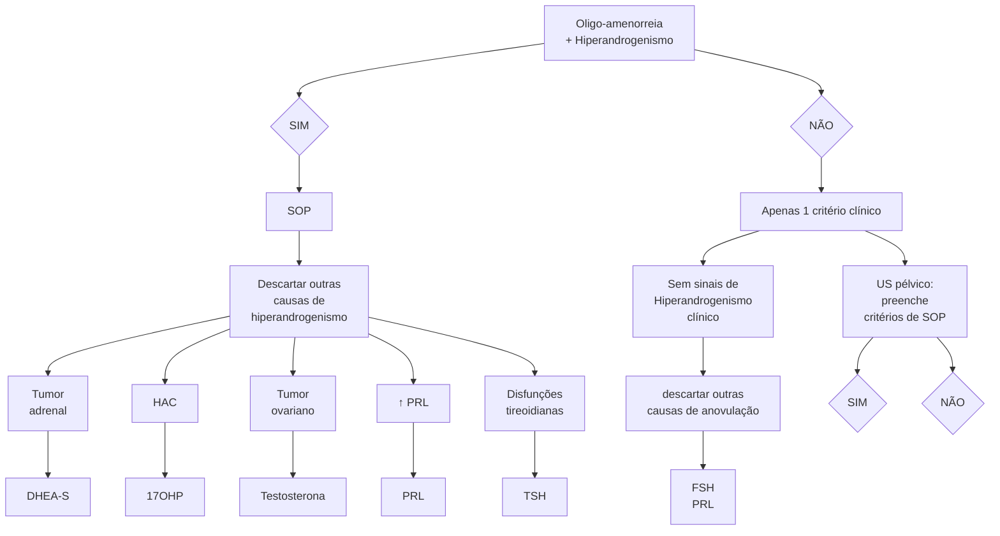

# SÍNDROME DOS OVÁRIOS POLICÍSTICOS

* Endocrinopatia mais comum no menacme - 6-20% das mulheres;
* Principais disfunções endócrinas: resistência insulínica, hiperinsulinemia, hiperandrogenismo, aumento dos níveis de LH, redução de SHBG;
* Tríade: hiperandrogenismo, irregularidade menstrual, ovários micropolicísticos;
* Diagnóstico é de **EXCLUSÃO:**
  * Afastar: hiperplasia adrenal congênita, tumor virilizante, tireoidopatias, hiperprolactinemia ou iatrogenias.

* Pilares do tratamento:
  * Mudanças de estilo de vida (Primeiro tratamento);
  * Antidiabéticos: metformina, análogo de GLP1;
  * Tratamento da obesidade (medicamentoso ou cirúrgico);
  * Proteção endometrial +/- contracepção (ACHO ou progestagênio);
  * Tratamento da infertilidade (letrozol para induzir ovulação);
  * Investigação e tratamento de distúrbios metabólicos associados.

## 1. CONSIDERAÇÕES GERAIS

* A síndrome dos ovários policísticos é a endocrinopatia mais comum em mulheres no período reprodutivo;
* Não apresenta etiologia totalmente conhecida - teorias apontam para a correlação de origem genética, multifatorial e poligênica;
* Demonstra heterogeneidade das manifestações clínicas - em virtude de tal fato, o estabelecimento do diagnóstico é difícil;
* Em cerca de 80% dos casos, o quadro de SOP decorre em hiperandrogenismo (seja clínico ou laboratorial):
  * Aproximadamente 30-40% das pacientes apresentam associação com infertilidade;
  * Até ¼ da população jovem pode apresentar USG com ovários semelhantes ao de pacientes com SOP.

## 2. FISIOPATOLOGIA

Dois pontos principais em relação aos mecanismos que envolvem a SOP.

### 2.1 HIPERINSULINEMIA

* A insulina tem ação sinérgica ao LH nas células da TECA, aumentando a produção de androgênios;
* A redução de síntese SHBG causa aumento de androgênios livres;
* O aumento de IGF-1 causa a inibição de FSH;
* Aumento da resistência insulínica e hiperglicemia.

### 2.2 HIPERANDROGENISMO

* Há alteração na pulsatilidade do GnRH. Nesse sentido, observa-se:
  * FSH normal, eventualmente baixo;
  * LH elevado (geralmente há esse desbalanço);

* Por fim, ocorre um aumento da produção de androgênio pelas células da teca.
* A conversão de androgênios em estrona ocasiona uma proliferação endometrial;
* A elevada produção de androgênios e estrona cursam com *feedback* anormal no hipotálamo e da hipófise;
* Ausência de ovulação leva à ausência de progesterona, atuando no endométrio;
* A longo prazo, o indivíduo apresenta alteração do perfil lipídico;
* O desbalanço LH/FSH causa alteração do crescimento folicular (atresia) e produção ainda maior de androgênios;
* Ou seja, a produção hormonal deixa de ser cíclica, desencadeando uma repercussão sistêmica, com irregularidade menstrual e anovulação.

### 2.3 FATORES GENÉTICOS

* Prevalência em mães e irmãs é maior que o dobro da população geral;
* Padrão de herança poligênico;
* Diferentes graus de penetrância, fatores ambientais e epigenéticos dificultam a identificação precisa;
* Diferentes genes e reguladores já foram descritos, o que pode justificar os diferentes fenótipos.

### 2.4 OBESIDADE X SOP

* Pacientes com SOP sem obesidade:
  * Alteração na expressão dos receptores de LH nos ovários;
  * Hiperandrogenismo clássico.
* Pacientes com SOP e obesidade:
  * Redução dos receptores de insulina periféricos → resistência insulínica + hiperinsulinemia;
  * Aumento dos receptores de insulina ovarianos → hiperandrogenismo.

GINECOLOGIA ENDÓCRINA

**Figura 1** Fluxograma diagnóstico para SOP.

## 3. QUADRO CLÍNICO:

### 3.1 HIPERANDROGENISMO

* A forma clínica é definida pela presença de hirsutismo;
* A quantificação é dada pelo índice de Ferriman-Gallwey > 6 (orientais > 4);
* Referências mais antigas usam o valor de corte > 8;
* Acne, seborreia: não existe definição precisa para o estabelecimento diagnóstico;
* Alopecia hiperandrogênica - frontal e central;
* Sintomas de virilização: clitoromegalia, aumento da massa muscular, alopecia, voz grossa. É incomum no contexto de SOP.

### 3.2 ANOVULAÇÃO

* Presença de ciclos menstruais longos: > 35 dias ou < 8 ciclos/ano;
* Amenorreia - ausência da menstruação por período maior que 3 meses;
* Sangramento uterino anormal, não estrutural, de causa ovulatória.

### 3.3 INFERTILIDADE

* Anovulação crônica;
* Aumento da frequência de abortamento precoce; (Por mecanismo de insuficiência lútea? Resistência insulínica associada?)

### 3.4 SÍNDROME METABÓLICA

* Obesidade: pode cursar com SAOS;
* Sinais de hiperinsulinemia:
  * *Acantose nigricans*;
  * Intolerância à glicose;
  * DM tipo II.
* Dislipidemia;

## 4. DIAGNÓSTICO

* É um diagnóstico de exclusão, mas precisa preencher critérios;
* Ainda, a solicitação dos exames complementares se dá para descartar as demais causas de anovulação e de hiperandrogenismo;
* Os critérios da SOP são clínicos;
* Excluídas as demais causas, era possível estabelecer o diagnóstico através dos critérios de Rotterdam (2018);
* Critérios de Rotterdam: **Figura 1**
  * Dá-se pela presença pelo menos de 2 dos 3 critérios:
  * Hiperandrogenismo clínico ou laboratorial;
  * Ciclos anovulatórios;
  * USG com imagem sugestiva: 1. Presença de 20 ou mais folículos com tamanho entre 2-9 mm (pelo menos um ovário) e/ou; 2. Volume ovariano ≥ 10 cc (pelo menos um ovário).
* OBS: comumente, as adolescentes demonstram um padrão policístico nos ovários, principalmente nos primeiros anos após a menarca. Nesse sentido, o diagnóstico torna-se mais difícil pela perda do critério ultrassonográfico e pela frequente irregularidade menstrual. Acne e sinais de hiperandrogenismo não são confiáveis nessa faixa etária e os níveis de testosterona são variáveis e mais frequentemente elevados.
  * Inicialmente classificadas como "Em risco de SOP". Diagnóstico no mínimo após 2 anos da menarca ou após 18 anos de idade, se os sintomas forem persistentes.

* HAS – hipertensão arterial sistêmica;
* É interessante lembrar os critérios diagnósticos de síndrome metabólica! (Circunferência abdominal > 102 cm em homens ou 88 cm em mulheres; triglicerídeos > 150; HDL < 40 em homens e < 50 em mulheres; PAS > 130 e/ou PAD > 85 mmHg; Glicemia de jejum > 110).

SÍNDROME DOS OVÁRIOS POLICÍSTICOS                                                                                          3

• Descartar outras causas de anovulação e hiperandrogenismo:

**Tabela 1 Diagnósticos diferenciais das causas de anovulação.**

| Condição a excluir                                            | Exames\*                                                                      |
| ------------------------------------------------------------- | ----------------------------------------------------------------------------- |
| Hiperprolactinemia                                            | Prolactina                                                                    |
| Hiperplasia adrenal congênita forma tardia (21 - hidroxilase) | 17-OH-progesterona                                                            |
| Alteração na tireoide                                         | TSH e T4 livre                                                                |
| Tumores secretores de androgênio ou uso exógeno               | Testosterona total e livre, SDHEA                                             |
| Síndrome de Cushing                                           | Cortisol salivar noturno às 23h ou teste de supressão com 1mg de Dexametasona |

*Os exames hormonais devem ser realizados entre o primeiro e o quinto dia do ciclo ou em qualquer época nas pacientes com amenorreia.

• Hormônio anti-mulleriano:
  • Algumas sociedades já passaram a aceitar;
  • Usado em substituição ao critério ultrassonográfico (das informações acerca da reserva ovariana);
  • Se a paciente preencher critério com anovulação e hiperandrogenismo, não precisa de AMH ou USG;
  • Não tem um valor de corte único;
  • Idealmente, o valor do exame deve ser colocado numa curva conforme a idade da paciente (percentis);
  • Não usar em adolescentes.

## 5. FENÓTIPOS

### 5.1 FENÓTIPO A; ("ALL")
• Critérios diagnósticos: hiperandrogenismo + anovulação + ovários policísticos.
• Distúrbios reprodutivos e metabólicos: +++.

### 5.2 FENÓTIPO B; ("BARBA")
• Critérios diagnósticos: hiperandrogenismo + anovulação.
• Distúrbios reprodutivos e metabólicos: +++.

### 5.3 FENÓTIPO C; (CICLA NORMALMENTE)
• Critérios diagnósticos: hiperandrogenismo + ovários policísticos.
• Distúrbios reprodutivos e metabólicos: ++.

### 5.4 FENÓTIPO D; (DEPILADA)
• Critérios diagnósticos: anovulação + ovários policísticos.
• Distúrbios reprodutivos e metabólicos: +/-.

OBS.: os fenótipos A e B apresentam quadros com repercussões endocrinológicas, reprodutivas e metabólicas mais graves.

OBS: o fenótipo D demonstra repercussões menos graves, do ponto de vista endocrinológico.

## 6. AVALIAÇÃO COMPLEMENTAR

### 6.1 EXAMES DIAGNÓSTICOS:
• Androgênios, USG TV;
• Alterações frequentes - sem necessidade de solicitar:
  • LH/FSH > 1 (inversão na relação LH/FSH);
  • AMH elevado.

**Avaliação metabólica obrigatória:**
• Glicemia de jejum e HbA1c;
• Curva glicêmica;
• Síndrome metabólica:
  • Circunferência abdominal;
  • Perfil lipídico;
  • Glicemia de jejum (> 100).

## 7. TRATAMENTO

### 7.1 MUDANÇA DO ESTILO DE VIDA
• Introduzir atividade física e alimentação saudável.

### 7.2 MEDICAMENTOSO
• Metformina (> 1500 mg por dia) ou Análogos do GLP1 (liraglutida, semaglutida);
• Indicado nos casos de intolerância à glicose, Acantose nigricans ou em pacientes obesas com antecedente familiar de DM2.

### 7.3 CIRÚRGICO
• Considerar cirurgia bariátrica se obesidade > grau II e refratário;
• Na vigência de obesidade mórbida associada à falha do tratamento clínico.

### 7.4 DISFUNÇÃO MENSTRUAL SEM HIPERANDROGENISMO CLÍNICO
Objetivar a proteção endometrial:
• Progestagênio intermitente por 10 dias - progesterona micronizada ou medroxiprogesterona;
• Contínuo - desogestrel (efeito contraceptivo);
• Anticoncepcional combinado oral:
  • Se hiperandrogenismo: preferir ciproterona ou gestodeno.

OBS: uso de estrogênio exógeno aumenta a SHBG, o que reduz os níveis de androgênios (e estrogênios) livres circulantes.

### 7.5 TRATAMENTO DA INFERTILIDADE ASSOCIADA
• Inicial: MEV + Metformina:
  • Não utilizar antiandrogênicos ou contraceptivos.
• Avaliação completa do casal infértil;
• Indução de ovulação (coito programado ou IIU):
  • Letrozol (primeira escolha);
  • Clomifeno ou gonadotrofinas (2a linha).
• Se for necessário realizar FIV, a paciente é de alto risco para hiperestímulo ovariano.
