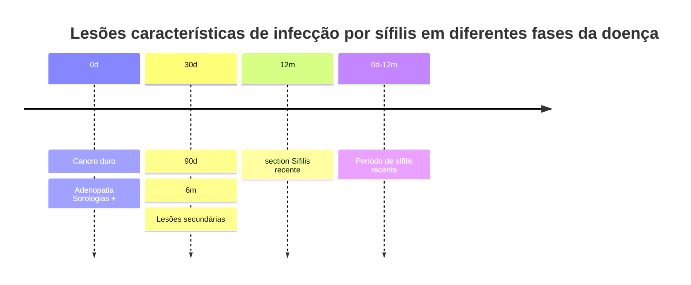
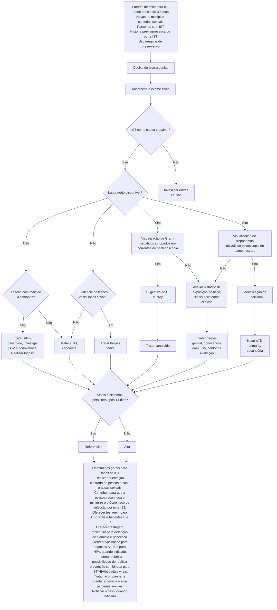

# ÚLCERAS GENITAIS

|                      | Doença         | Cancro Mole  | Sífilis (Cancro Duro) | Linfogranuloma venéreo        | Herpes Simples        | Donovanose |
| -------------------- | -------------- | ------------ | --------------------- | ----------------------------- | --------------------- | ---------- |
| Número de lesões     | Múltiplas      | Única        | Única, não percebida  | Múltiplas vesículas agrupadas | Múltiplas             |            |
| Período de incubação | 2 a 5 dias     | 21 a 30 dias | 1 a 2 semanas         | 7 dias                        | 3 dias a 6 meses      |            |
| Hiperestesia         | Dolorosa       | Indolor      | Indolor               | Dolorosa                      | Indolor               |            |
| Bordas               | Irregular      | Lisa         | Regular               | Regular                       | Irregular             |            |
| Base / Fundo         | Mole; profunda | Dura         | Superficial e limpo   | Exulcerações                  | Fundo limpo e friável |            |
| Adenopatia           | Presente       | Presente     | Presente              | Presente                      | Ausente               |            |

**Úlceras genitais infecciosas: principais causas estão relacionadas a infecções sexualmente transmissíveis**

**Úlceras genitais não infecciosas**
- Úlcera de Lipschutz;
- Doença de Behçet:

## 1. CONSIDERAÇÕES GERAIS

### 1.1 DEFINIÇÃO

- Úlcera genital é definida como uma lesão caracterizada por uma perda da solução de continuidade no trato genital inferior, sendo acompanhada de processo inflamatório, com ou sem dor associada.

### 1.2 ETIOLOGIAS

**Úlceras infecciosas:**
- Relacionadas a ISTs;
- Não relacionadas a ISTs: Em geral, são causadas por reações imunológicas desencadeadas por antígenos virais ou bacterianos à distância.

**Úlceras não infecciosas:**
- Dermatoses bolhosas, não bolhosas;
- Autoimunes – Doença de Crohn;
- Farmacodermias;
- Traumáticas;
- Neoplasias;
- Hidradenite supurativa.

OBS.: Em um cenário com visualização de úlceras genitais, sempre deve ser considerada a possibilidade de ISTs, em virtude de representar mais da metade dos casos.

### 1.3 REVISANDO

- Confira ao lado a Figura 1

### 1.4 LESÕES DERMATOLÓGICAS

**Erosão:**
- Manifesta-se pela perda parcial ou total da epiderme;
- Logo, a derme se mantém intacta.

**Fissura:**
- Dá-se pela perda linear e fina da epiderme, usualmente superficial; Contudo, pode ser profunda, com capacidade para formar uma úlcera linear.

**Escoriação:**
- É uma solução de continuidade do epitélio, secundária por coçadura ou atrito, usualmente superficial.

**Crosta:**
- Exsudato ressecado de origem serosa, hemática ou purulenta.

**Úlcera:**
- É a perda de toda a espessura epitelial (epiderme, derme e eventualmente hipoderme);
- Ainda, em geral, é secundária à destruição, necrose ou inflamação.

**Figura 1: Camadas da pele**

| Epiderme, camada córnea                                |
| ------------------------------------------------------ |
| Derme, papilar e reticular                             |
| Tecido celular subcutâneo ou hipoderme, mais gorduroso |

GINECOLOGIA GERAL

## 2. ÚLCERAS INFECCIOSAS

### 2.1 HERPES GENITAL

**Agente etiológico:**
- HSV tipos 1 e 2;
  - Família *Herpesviridae*;
  - Também faz parte desta família: CMV (citomegalovírus); Vírus da varicela zoster; Vírus Epstein-Barr; Vírus do herpes humano.
- É um vírus de DNA;
- Predomínio:
  - Tipo 1: lesões periorais;
  - Tipo 2: lesões genitais.

**Transmissão:**
- Contágio: Contato íntimo com o vírus, a partir da superfície mucosa ou de lesão infectante.
- Período de incubação: 3 – 30 dias;
- Replicação: Ocorre replicação do HSV em células da derme e epiderme; a permanência na epiderme e derme causa necrose e ulceração. Posteriormente, há migração para os gânglios nervosos sensitivos → **período de latência**; HSV tipo 1 – nervo trigêmeo; HSV tipo 2 – raízes dorso-sacrais.

OBS.: Na ocorrência de alteração imunológica do indivíduo, há reativação do vírus com saída do estado de latência e aparecimento das manifestações clínicas.

**Quadro clínico:**
- **Primoinfecção**: Sintomas sistêmicos – febre; Edema, ardor, prurido; Pápulas eritematosas, **vesículas**; Úlceras e crostas; Adenopatia inguinal dolorosa, bilateral.

**Figura 2** Acometimento por herpes genital com aparecimento de pápulas eritematosas.

**Diagnóstico:**
- Clínico;
- Laboratorial: PCR – do material da lesão; cultura da secreção (raramente utilizada; não demonstra boa sensibilidade.); citologia (célula de Tzanck – apresenta baixa sensibilidade.)

**Figura 3** Exame citológico evidenciando as células de Tzanck, isto é, células multinucleadas de cromatina perinuclear.

**Tratamento:**

**Tabela 1** Ministério da Saúde;

|               | ACICLOVIR                                                                            |
| ------------- | ------------------------------------------------------------------------------------ |
| Primoinfecção | 400 mg, VO, de 8/8h, por 7 – 10 dias OU
200 mg, VO, 5x/dia, por 7 – 10 dias      |
| Recorrência   | 400 mg, VO, de 8/8h, por 5 dias OU
800 mg, VO, de 12/12h, por 5 dias             |
| Supressão     | 400 mg, VO, de 12/12h, por até 6 meses
O esquema pode se estender por até 2 anos |

- CDC; FEBRASGO; **Tabela 2**

ATENÇÃO! Ainda não existe um tratamento eficaz para promover a cura do Herpes genital, mas apenas um controle sintomático ou para aumentar o intervalo intercrise.

**Situações especiais - Gestantes:**
- Na presença de lesões ativas no momento do parto, em quadro de primo-infecção no 3° trimestre ou com intervalo menor que 6 semanas entre as lesões e o momento do parto → cesárea;
- Se Parto vaginal inevitável ou bolsa rota por período prolongado = aciclovir EV (mãe e considerar uso no recém-nascido).
- Infecção primária ou recorrente: tratamento com aciclovir (mesmo regime); Supressão: Esquema – 400 mg, 3x/dia, a partir de 36 semanas até o início do trabalho de parto; Quando? Indicada para **todas as gestantes** que apresentaram **qualquer tipo de episódio de herpes genital, em qualquer momento da gestação**. Esse esquema reduz tanto a eliminação genital de HSV quanto episódios recorrentes no momento do trabalho de parto, diminuindo, assim, a indicação de cesarianas.

ÚLCERAS GENITAIS    3

**Tabela 2** CDC; FEBRASGO;

|               | ACICLOVIR                                                                    | FAMCICLOVIR                                               | VALACICLOVIR                                                                 |
| ------------- | ---------------------------------------------------------------------------- | --------------------------------------------------------- | ---------------------------------------------------------------------------- |
| Primoinfecção | 400 mg, VO, de 8/8h, por 7 – 10 dias                                         | 250 mg, VO, de 8/8h, por 7 – 10 dias                      | 1000 mg, VO, de 12/12h, por 7 – 10 dias                                      |
| Recorrência   | 800 mg, VO, de 12/12h, por 5 dias
OU
800 mg, VO, de 8/8h, por 2 dias | 500 mg, em dose única + 250 mg, VO, de 12/12h, por 2 dias | 500 mg, VO, de 12/12h, por 3 dias
OU
1000 mg, VO, 1x/dia, por 5 dias |
| Supressão     | 400 mg, VO, de 12/12h                                                        | 250 mg, VO, de 12/12h                                     | 1000 mg, 1x/dia                                                              |

**Situações especiais - Imunossuprimidos:**
- É proposta de hospitalização;
- Grupo: Usuários crônicos de corticoide; Usuários de imunomoduladores; Transplantados de órgãos sólidos; PVHIV.
- Esquema: Aciclovir – 5 – 10 mg/kg, EV, de 8/8h, por 5 – 7 dias ou até a resolução clínica.

**Considerações importantes;**
- Pode ser proposto o tratamento local - compressas com solução fisiológica ou degermante em solução aquosa, para higienização das lesões.
- Analgésicos orais;
- Não há associação entre Herpes genital e câncer.

## 2.2 SÍFILIS

**Agente etiológico:** *Treponema pallidum;*

**Manifesta-se a partir do surgimento do cancro duro:**
- Como forma de sífilis primária: Úlcera única, indolor, com bordos endurecidos, não purulenta (fundo limpo);
- Tende a desaparecer (30 dias iniciais).

[Image showing: Cancro duro - manifestação de sífilis primária]

**Sífilis recente:**
- Abrange todas as manifestações que ocorrem dentro dos primeiros 12 meses, a partir do momento do contágio.
- Confira na página seguinte a Figura 5

| Estágios da Sífilis | Manifestações clínicas                                                                                                                      |
| ------------------- | ------------------------------------------------------------------------------------------------------------------------------------------- |
| Sífilis primária    | Cancro duro – úlcera genital
Linfonodos regionais                                                                                       |
| Sífilis secundária  | Lesões cutaneomucosas (roséola, placas mucosas, condiloma plano, alopecia em clareira, madarose), rouquidão
Linfadenopatia generalizada |

**Condiloma plano;**
- Faz parte do espectro de Sífilis secundária;
- Surge em regiões de dobras, especialmente em área anogenital;
- Manifesta-se pela formação de lesões úmidas e vegetantes;

[Image showing: Lesões vegetantes típicas de acometimento por sífilis secundária]

GINECOLOGIA GERAL

**Figura 5** Lesões características de infecção por sífilis em diferentes fases da doença.

![Image showing typical lesion of secondary syphilis involvement]

**Figura 7** Destaque para a lesão típica de acometimento por sífilis secundária.

• Ainda, tendem a ser frequentemente confundidas com verrugas anogenitais causadas pelo HPV.

**Diagnóstico:**
• Lembre-se, nas fases iniciais, as sorologias podem ainda não ser positivas;
• Pesquisa do *T. pallidum*; Técnica com material corado; Visualização direta em campo escuro.
• Sorologia treponêmica – tende a positivar 10 – 14 dias após o surgimento do cancro duro: FTA-Abs; Teste rápido.
• Sorologia não treponêmica (VDRL e RPR) – tende a positivar em cerca de 21 dias após o surgimento do cancro duro; Iniciar tratamento → VDRL ≥ 1/8.

> OBS.: Bactérias espiraladas não são visualizadas pela coloração de Gram.

**Conduta:** Tabela 4

> OBS.: Para gestantes, em caso de alergia a penicilinas, procede-se com dessensibilização.

> ATENÇÃO: Para gestantes, espera-se uma queda da titulação da sorologia não-treponêmica, de 2 diluições, em até 3 meses (ex.: 1:64 → 1:16), ou 4 diluições em 6 meses (ex.: 1:64 → 1:4).

## 2.3 CANCRO MOLE

Também denominado de **cancroide;**

**Agente etiológico:** *Haemophilus ducreyi* **– cocobacilo gram negativo;**

• Período de incubação: 2 – 5 dias (até 2 semanas).

**Manifestações clínicas – Lesões dolorosas e múltiplas**
• Bordos irregulares e eritematosos;
• Demonstra "fundo sujo" : exsudato necrótico e fétido.

![Image showing ulcers with irregular borders and dirty base, suggestive of chancroid]

**Figura 8** Úlceras de bordos irregulares e fundo sujo, sugestivas de cancro mole.

• Bubão: adenopatia unilateral, supurativa, orifício único.

**Diagnóstico:**
• Avaliação clínica
• Exame bacterioscópico – Gram: Aspecto enfileirado de bacilos Gram negativos.
• PCR.

**Tratamento:**

ÚLCERAS GENITAIS                                    5

• Ministério de Saúde:
  • Esquema de 1° opção: Azitromicina, 1g, via oral, dose única.
  • Alternativa: Ceftriaxone 250 mg, IM, dose única OU Ciprofloxacino 500 mg, VO, de 12/12h, por 3 dias.

**Figura 9** Exemplo de adenopatia supurativa com orifício único

OBS.: O uso de azitromicina e ceftriaxona é aprovado em gestantes. Contudo, o uso de ciprofloxacino deve ser evitado em gestantes.

ATENÇÃO: O tratamento sistêmico deve ser acompanhado de medidas locais de higiene. O tratamento das parcerias sexuais é recomendado, mesmo quando essas forem assintomáticas.

## 2.4 LINFOGRANULOMA VENÉREO

**Outras nomenclaturas:**
• Doença de Nicolas-Favre;
• Doença de Frei;
• Linfadenopatia venérea.

**Agente etiológico:** *Chlamydia trachomatis;*
• Sorotipos: L1, L2 e L3;
• Período de incubação: 3 – 30 dias.

**Manifestação clínica:**
• Fase primária: Vesícula ou pápula. Apresenta evolução para úlcera indolor – acomete colo de útero, vulva, vagina.

**Figura 10** Exemplo de úlcera sugestiva de linfogranuloma venéreo.

**Figura 11** Acometimento ganglionar no linfogranuloma venéreo.

• Fase secundária: Ocorre **acometimento ganglionar** – surge cerca de 2 – 6 semanas após a resolução da lesão inicial.
  • Adenopatia unilateral, com formação de fístula em múltiplos orifícios;
  • Lesão em "bico de regador".
• Diagnóstico:
  • Avaliação clínica;
  • Exames laboratoriais:
    • PCR do aspirado linfonodal;
    • Cultura;
    • Imunofluorescência direta.

ATENÇÃO! O Linfogranuloma venéreo é uma IST crônica. De tal modo, pode evoluir com sequelas, como: estenose retal, elefantíase genital.

**Tratamento:**

**Ministério da Saúde:** Doxiciclina 100 mg, VO, de 12/12h, por 21 dias OU Azitromicina 1g, VO, 1x/sem, por 3 semanas (é o esquema preferencial para gestantes).

**Outras considerações:** As parcerias sexuais devem ser tratadas. Sintomáticas: igual ao caso índice. Assintomáticas: Azitromicina 1g, VO, em dose única ou Doxiciclina 100 mg, VO, de 12/12h, por 7 dias.

OBS: Os bubões que se tornarem flutuantes não devem ser incisados cirurgicamente, pelo risco de formação de fístulas. A conduta ideal é a aspiração do conteúdo com agulha grossa.

## 2.5 DONOVANOSE

• Agente etiológico: *Klebsiella granulomatis;*
• É um coco gram negativo;
• Período de incubação: 3 dias – 6 meses;
• É uma IST crônica.

**Manifestação clínica:**
• **Apresentação inicial:** Granuloma inguinal ou úlcera serpiginosa;
• **Quadro clínico:**
  • Úlceras de bordas planas ou hipertróficas bem delimitadas, friáveis, indolores;
  • Evolução progressiva para a lesão vegetante;

• Lesões múltiplas "em espelho";
• Não há adenite;
• Observam-se pseudobubões (granulações subcutâneas e região inguinal).

![Figura 12: Lesões múltiplas "em espelho" da donovanose.]

**Diagnóstico:**
• Métodos: Citologia; Biópsia; PCR.
• Observe a imagem abaixo: Em microscopia — visualização de Corpúsculos de Donovan.

![Figura 13: Destaque para os Corpúsculos de Donovan, que correspondem às bactérias no interior dos macrófagos.]

**Tratamento Ministério da Saúde:**
• Preferencial: Azitromicina, 1g, VO, 1x/sem, por 3 semanas, ou até a cicatrização das lesões;
• Alternativa: Doxiciclina 100 mg, VO, de 12/12h, por pelo menos 21 dias ou até o desaparecimento completo das lesões OU; Ciprofloxacino 500 mg, 1 comprimido e meio, VO, de 12/12h, por pelo menos 21 dias, ou até a cicatrização das lesões OU; Sulfametoxazol-trimetoprima (400/80 mg), 2 comprimidos, VO, de 12/12h, por, no mínimo, 21 dias ou até a cicatrização das lesões.

> OBS.: Em virtude da baixa infectividade, não é necessário tratar as parcerias sexuais.

**Outras recomendações de Tratamento:**
• Não havendo resposta nos primeiros dias do tratamento com ciprofloxacino: Adicionar um aminoglicosídeo, como

a gentamicina (1 mg/kg/dia, EV, 3x/dia, por pelo menos 3 semanas, ou até a cicatrização das lesões).
• Para PVHIV: seguir os mesmos esquemas terapêuticos;
• **Critério de cura: desaparecimento da lesão;**
• As sequelas da destruição tecidual ou obstrução linfática podem exigir correção cirúrgica.

## 2.6 FLUXOGRAMA:
**Proposto pelo Ministério da Saúde, em 2022;**
• Confira na página seguinte a Figura 14

## 2.8 RESUMINDO
• Confira na página seguinte a Tabela 3

# 3. ÚLCERAS GENITAIS NÃO INFECCIOSAS

## 3.1 ÚLCERA DE LIPSCHUTZ
**Decorre de uma vasculite local;**
**Quem é mais suscetível?**
• Crianças e adolescentes – imunocompetentes e sexualmente inativas;
• Nos indivíduos sexualmente ativos, deve-se excluir IST concomitante.

**Quando?**
• Após instalação de quadro viral (Síndrome Flu-like) e/ ou bacteriano sistêmico (principalmente em quadros com acometimento de vias aéreas superiores);

**Como?**
• Decorre de manifestações reativas dos processos infecciosos extra-vulvares
• Instalação abrupta;
• Manifesta-se através de úlceras genitais intensamente dolorosas, associadas a febre e linfadenopatia;
• Ainda, podem ser observadas crostas necróticas sob a lesão.

![Figura 15: Exemplo de úlcera de Lipschutz]

**Tratamento:**
• Sintomáticos: A lesão demonstra cicatrização espontânea em cerca de 4 – 6 semanas.

## 3.2 DOENÇA DE BEHÇET:
**Caracteriza-se por um distúrbio inflamatório autoimune;**
• Acomete adultos jovens, entre 20 – 35 anos;
• Apresenta predisposição para pequenos vasos sanguíneos.

ÚLCERAS GENITAIS                                                                                                 7

## Biópsia;
• Observa-se: Vasculite; Infiltrado por neutrófilos e linfócitos T e B.

## MANIFESTAÇÕES:
• Úlceras aftosas dolorosas OU;

**Figura 16** Úlcera oral na Doença de Behçet

• Úlceras genitais dolorosas – tamanho > 1 cm, com formação de cicatrizes.

**Figura 17** Úlceras genitais da doença e Behçet

• **Manifestações sistêmicas:** Oculares - Uveíte; Dermatológicas - Pseudofoliculite, eritema nodoso; Renal; Gastrointestinal; Sistema nervoso central.

**Tratamento:**
• Medidas de suporte;
  • Analgesia;
  • Orientação de medidas de higiene.

**Corticóide;**
• Tópico ultrapotente;
• Via oral – prednisona, 0,5 – 1,0 mg/kg.

**Outras drogas – útil em casos refratários;**
• Colchicina, VO, 0,5 mg, de 8/8h.

## 3.3 DOENÇA DE CROHN:

**Manifesta-se como uma doença de caráter inflamatório, transmural e segmentar;**

**Epidemiologia:**
• Apresenta distribuição bimodal: 1° pico: 20 – 30 anos; 2° pico: 60 – 80 anos.

**Acometimento:**
• Todo o trato gastrointestinal – da boca ao ânus;
• Dano à região vulvar e períneo é pouco frequente; Contudo, caso exista, visualiza-se úlcera "em facada".

**Figura 18** Úlcera característica da manifestação vulvar da Doença de Crohn

**Diagnóstico**
• Biópsia:

**Tratamento:**
• Depende do seguimento da doença de base;
• Manter interconsulta com a Gastroenterologia.

**Tabela 3** Resumos das principais características das úlceras genitais.

| Doença               | Cancro Mole    | Sífilis (Cancro Duro) | Linfogranuloma venéreo | Herpes Simples                | Donovanose            |
| -------------------- | -------------- | --------------------- | ---------------------- | ----------------------------- | --------------------- |
| Número de lesões     | Múltiplas      | Única                 | Única, não percebida   | Múltiplas vesículas agrupadas | Múltiplas             |
| Período de incubação | 2 a 5 dias     | 21 a 30 dias          | 1 a 2 semanas          | 7 dias                        | 3 dias a 6 meses      |
| Hiperestesia         | Dolorosa       | Indolor               | Indolor                | Dolorosa                      | Indolor               |
| Bordas               | Irregular      | Lisa                  | Regular                | Regular                       | Irregular             |
| Base / Fundo         | Mole; profunda | Dura                  | Superficial e limpo    | Exulcerações                  | Fundo limpo e friável |
| Adenopatia           | Presente       | Presente              | Presente               | Presente                      | Ausente               |

GINECOLOGIA GERAL

**História clínica:** avaliar práticas sexuais e fatores de risco para IST.

**Lesões:** ulcerativas erosivas, precedidas ou não por pústulas e/ou vesículas, acompanhadas ou de dor, ardor, prurido, drenagem de material mucopurulento, sangramento e linfadenopatia regional.

**Figura 14** Fluxograma para diagnóstico e tratamento das úlceras genitais.

**Tabela 4** Tratamento da sífilis recente.

| Estadiamento                                                                                                                   | Esquema terapêutico                                                                         | Alternativa(exceto para gestantes)                                                                     | Seguimento(Teste nãotreponêmico)                                                                  |
| ------------------------------------------------------------------------------------------------------------------------------ | ------------------------------------------------------------------------------------------- | ------------------------------------------------------------------------------------------------------ | ------------------------------------------------------------------------------------------------- |
| **Sífilis recente:**
• Sífilis primária
• Sífilis secundária
e latente recente
(com até 1 ano de
evolução) | Penicilina benzatina 2,4
milhões UI, IM, em dose única –
1,2 milhões em cada glúteo | Doxiciclina 100 mg, de 12/12h,
VO, por 15 dias

Não pode ser administrada em
gestantes | Trimestral (3, 6 e
12 meses após o
tratamento)

Gestantes – seguimento
mensal |

ÚLCERAS GENITAIS# REFERÊNCIAS

**Figura 2** Acometimento por herpes genital com aparecimento de pápulas eritematosas.

Manuel Parra-Sánchez. Genital ulcers caused by herpes simplex virus. 2019. Molecular Diagnostics Department, Vircell Microbiologists, Parque Tecnológico de la Salud, Granada, Spain. DOI 10.1016/j.eimce.2019.01.001

**Figura 3** Exame citológico evidenciando as células de Tzanck, isto é, células multinucleadas de cromatina perinuclear.

Durdu, M., Baba, M., & Seçkin, D. (2008). The value of Tzanck smear test in diagnosis of erosive, vesicular, bullous, and pustular skin lesions. Journal of the American Academy of Dermatology, 59(6), 958–964. doi:10.1016/j.jaad.2008.07.059

**Figura 4** Cancro duro - manifestação de sífilis primária

EMJ. 2021; DOI/10.33590/emj/20-00221.. https://doi.org/10.33590/emj/20-00221.

**Figura 6** Lesões vegetantes típicas de acometimento por sífilis secundária.

De Sica, A. C. A. R., Campaner, A. B., Veasey, J. V., Lellis, R. F., "Secondary syphilis of the vulva: the great imitator." American Journal of Obstetrics and Gynecology, vol. XX, n. XX, p. XX, nov. 2022. DOI: https://doi.org/10.1016/j.ajog.2022.10.042

**Figura 7** Destaque para a lesão típica de acometimento por sífilis secundária.

De Sica, A. C. A. R., Campaner, A. B., Veasey, J. V., Lellis, R. F., "Secondary syphilis of the vulva: the great imitator." American Journal of Obstetrics and Gynecology, vol. XX, n. XX, p. XX, nov. 2022. DOI: https://doi.org/10.1016/j.ajog.2022.10.042

**Figura 8** Úlceras de bordos irregulares e fundo sujo, sugestivas de cancro mole.

"Stamford Skin Centre. Úlcera Genital - Cancroide. Disponível em: https://stamfordskin.com/en/dermatology/genital-ulcer-chancroid/. Acesso em: 20/11/2023.

**Figura 9** Exemplo de adenopatia supurativa com orifício único

"Best Practice. Sífilis - Resumo | BMJ Best Practice." Best Practice, https://bestpractice.bmj.com/topics/en-gb/932. Acessado em 20/11/2023.

**Figura 10** Exemplo de úlcera sugestiva de linfogranuloma venéreo.

Stewart, D. B. (1964). The Gynecological Lesions of Lymphogranuloma Venereum and Granuloma Inguinale. Medical Clinics of North America, 48(3), 773–786. doi:10.1016/s0025-7125(16)33458-7.

**Figura 11** Acometimento ganglionar no linfogranuloma venéreo.

HubPages. Linfogranuloma Venéreo: Relevância para a Saúde, Apresentações Clínicas, Diagnóstico e Tratamento. Disponível em: https://discover.hubpages.com/health/Lymphogranuloma-Venereum-Health-Relevance-Clinical-Presentations-Diagnosis-And-Treatment. Acessado em 20/11/2023.

**Figura 12** Lesões múltiplas "em espelho" da donovanose.

Women 's Health Section. Saúde da Mulher: [Benign Vulvar Skin Disorders: part 2]. Disponível em: http://www.womenshealthsection.com/content/gyn/gyn038.php3. Acessado em 20/11/2023.

**Figura 13** Destaque para os Corpúsculos de Donovan, que correspondem às bactérias no interior dos macrófagos.

Women 's Health Section. Saúde da Mulher: [Benign Vulvar Skin Disorders: part 2]. Disponível em: http://www.womenshealthsection.com/content/gyn/gyn038.php3. Acessado em 20/11/2023.

**Figura 14** Fluxograma para diagnóstico e tratamento das úlceras genitais.

PCDT-IST-2022. Protocolo Clínico e Diretrizes Terapêuticas para Infecções Sexualmente Transmissíveis: Sífilis. Brasília: Ministério da Saúde, 2022. ISBN 978-65-89749-24-3

**Figura 15** Exemplo de úlcera de Lipschutz

Women 's Health Section. Saúde da Mulher: [Benign Vulvar Skin Disorders: part 2]. Disponível em: http://www.womenshealthsection.com/content/gyn/gyn038.php3. Acessado em 20/11/2023.

**Figura 16** Úlcera oral na Doença de Behçet

Women 's Health Section. Saúde da Mulher: [Benign Vulvar Skin Disorders: part 2]. Disponível em: http://www.womenshealthsection.com/content/gyn/gyn038.php3. Acessado em 20/11/2023.

**Figura 17** Úlceras genitais da doença e Behçet

Women 's Health Section. Saúde da Mulher: [Benign Vulvar Skin Disorders: part 2]. Disponível em: http://www.womenshealthsection.com/content/gyn/gyn038.php3. Acessado em 20/11/2023.

**Figura 18** Úlcera característica da manifestação vulvar da Doença de Crohn

Women 's Health Section. Saúde da Mulher: [Benign Vulvar Skin Disorders: part 2]. Disponível em: http://www.womenshealthsection.com/content/gyn/gyn038.php3. Acessado em 20/11/2023.
