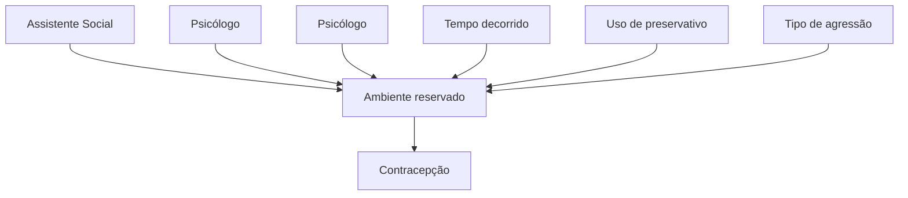

Anticoncepção – situações especiais

# VIOLÊNCIA SEXUAL

| • Notificação compulsória todo caso de suspeita ou confirmação de violência contra a mulher.
• O atendimento inicial às vítimas de violência sexual é uma emergência! Realizar em até 72 horas da agressão para garantir a eficácia das medidas contraceptivas e das profilaxias.
**Etapas do atendimento:**
• Acolhimento;
• Notificação;
• Anamnese, exame físico, coleta de vestígios; | • Exames Complementares;
• Profilaxias;
• Contracepção de emergência;
• Seguimento ambulatorial.
• Situações de abuso sexual crônico contraindicam profilaxia pós exposição contra hepatite B e HIV
• O tempo limite para a introdução da profilaxia para infecção pelo HIV e da contracepção de emergência é de 72 horas. |
| ------------------------------------------------------------------------------------------------------------------------------------------------------------------------------------------------------------------------------------------------------------------------------------------------------------------------------------------------------------------------------------------------------------- | ---------------------------------------------------------------------------------------------------------------------------------------------------------------------------------------------------------------------------------------------------------------------------------------------------------------------------------------------- |

## 1. INTRODUÇÃO

### 1.1 VIOLÊNCIA CONTRA A MULHER

• De acordo com dados publicados pela Organização Mundial da Saúde em 2017, 1 em cada 3 mulheres sofrem violência (física ou sexual) no mundo;
• Definimos violência contra mulher qualquer ato ou conduta baseada no gênero, que causa dano, morte, sofrimento físico, psicológico ou sexual à mulher, em esfera pública ou privada;
• O ambiente da violência é geralmente o doméstico;
• Fatores econômicos, sociais e culturais muitas vezes estão envolvidos, o que perpetua a impunidade e a invisibilidade dos casos;
• Em cerca de 70% dos casos de violência, os agressores são pessoas com quem a vítima mantém ou manteve vínculo afetivo.

### 1.2 CENTRAL DE ATENDIMENTO À MULHER: DISQUE 180.

## 2. ASPECTOS ÉTICOS E LEGAIS

### 2.1 LEI NÚMERO 11.340 (2006) – LEI MARIA DA PENHA

• Configurou a violência doméstica como crime.
• Garante acesso à assistência social, saúde, suporte jurídico, perícia e proteção à vítima – contra violência sexual, física, patrimonial, moral e psicológica.

### 2.2 LEI NÚMERO 12.015 (2009)

• Define estupro como: ato de "Constranger alguém, mediante violência ou grave ameaça, a ter conjunção carnal ou a praticar ou permitir que com ele se pratique outro ato libidinoso".
• Conjunção carnal: penetração pênis-vagina;
• Ato libidinoso: penetração oral ou anal;
• Estupro de Vulnerável: "Ter conjunção carnal ou praticar outro ato libidinoso com menor de 14 anos".
• É de Notificação compulsória todo caso de suspeita ou confirmação de violência contra a mulher (Lei número 10.778 – 2003 – e Lei número 13.931 – 2019).
• Em todo território nacional (Lei número 10.778);
• Qualquer caso de suspeita ou confirmação de violência contra a mulher;

• Crianças e adolescentes <18 anos de idade: comunicar Conselho Tutelar ou a Vara da Infância e da Juventude;
• Idosas: comunicar autoridade policial, Ministério Público, Conselho Municipal ou Estadual ou Nacional do Idoso.

## 3. ATENDIMENTO INICIAL

• É uma emergência! Realizar em até 72 horas da agressão para garantir a eficácia das medidas contraceptivas e das profilaxias.

### 3.1 ETAPAS DO ATENDIMENTO

• Acolhimento;
• Notificação;
• Anamnese, exame físico, coleta de vestígios;
• Exames Complementares;
• Profilaxias;
• Contracepção de emergência;
• Seguimento ambulatorial.

### 3.2 ACOLHIMENTO

• Fundamental garantir a ética e comunicar que é um ambiente de privacidade, confidencialidade e sigilo.
• O atendimento é multiprofissional, com participação do enfermeiro, assistente social e psicólogo.

**Figura 1** Acolhimento às vítimas de violência sexual

GINECOLOGIA GERAL

• Antes mesmo do atendimento médico, na etapa de acolhimento podem ser obtidas algumas informações preliminares, como:
  • Tempo decorrido da violência.
  • Se teve uso de preservativo ou não no momento da violência.
  • O tipo de agressão sofrida.
  • Se a paciente realiza ou não método contraceptivo eficaz.
• Atentar para o registro completo e detalhado dessas informações preliminares em prontuário médico, para que o paciente não necessite repetir várias vezes os fatos ocorridos.
• É feita a comunicação do caso para a delegacia de referência, para que sejam realizados os exames periciais.
• Para a realização da perícia, faz-se necessária a nomeação de um médico específico para isso, que pode ser o próprio médico legista do Instituto Médico Legal (IML) do município ou mesmo um perito ad hoc, isto é, um perito não oficial, cidadão comum, que presta o compromisso de desempenhar este cargo, tendo sido nomeado pelo juiz criminal, promotor da justiça ou delegado de polícia para tal.
• No Brasil, formalmente o médico que irá realizar os exames periciais não pode ser o médico assistente da paciente no pronto atendimento. No entanto, em diversas situações, é desejável que o serviço de saúde proceda com o recolhimento de elementos que, eventualmente, colaborem com necessidades das autoridades ou que auxiliem na confecção de laudo indireto de Exame de Corpo de Delito e Conjunção Carnal.

## 3.3 NOTIFICAÇÃO

• Notificação compulsória de todo caso suspeito ou confirmado;
• Notificação imediata (em até 24 horas) para a Secretaria Municipal de Saúde;
• Preenchimento: realizado pela equipe de saúde envolvida no atendimento de emergência. Figura 2

## 3.4 ANAMNESE

**Como detalhar melhor a história?**

• Ouvir, evitar fazer muitas perguntas ou interromper a fala da paciente.
• Transmitir segurança e garantir a confidencialidade da consulta.
• Questionar sobre seus sentimentos no momento (medo, angústia, tristeza).
• Perguntar ativamente sobre a existência da violência.
• Atenção aos detalhes.
• Criar vínculo.

**Tópicos que devem ser idealmente abordados no primeiro atendimento:**

• Local, dia e hora da violência sexual e do atendimento médico;
• História clínica detalhada;
• Tipo(s) de violência sexual sofrida(s);
• Forma(s) de constrangimento empregada(s);
• Tipificação e número de agressores;
• Exame físico completo – descrição minuciosa das lesões;
• Descrição minuciosa de vestígios e de outros achados no exame;
• Identificação dos profissionais que atenderam a vítima, com letra legível e assinatura;
• Preenchimento da Ficha de Notificação Compulsória.

| **República Federativa do Brasil
Ministério da Saúde**                                                                                                                                                                                                                                                                                                                                                                                                         |                                                                                                                                                                                                                                                                                                                                                                                                                                                                                                 |                                |                                                             | **SINAN
SISTEMA DE INFORMAÇÃO DE AGRAVOS DE NOTIFICAÇÃO
FICHA DE NOTIFICAÇÃO INDIVIDUAL** |                                                                                                                                                                                              |                            | **N°**                                                                            |               |
| ------------------------------------------------------------------------------------------------------------------------------------------------------------------------------------------------------------------------------------------------------------------------------------------------------------------------------------------------------------------------------------------------------------------------------------------------------------------ | ----------------------------------------------------------------------------------------------------------------------------------------------------------------------------------------------------------------------------------------------------------------------------------------------------------------------------------------------------------------------------------------------------------------------------------------------------------------------------------------------- | ------------------------------ | ----------------------------------------------------------- | ------------------------------------------------------------------------------------------------- | -------------------------------------------------------------------------------------------------------------------------------------------------------------------------------------------- | -------------------------- | --------------------------------------------------------------------------------- | ------------- |
| Caso suspeito ou confirmado de violência doméstica/intrafamiliar, sexual, autoprovocada, tráfico de pessoas, trabalho escravo, trabalho infantil, tortura, intervenção legal e violências homofóbicas contra mulheres e homens em todas as idades. No caso de violência extrafamiliar/comunitária, somente serão objetos de notificação as violências contra crianças, adolescentes, mulheres, pessoas idosas, pessoa com deficiência, indígenas e população LGBT. |                                                                                                                                                                                                                                                                                                                                                                                                                                                                                                 |                                |                                                             |                                                                                                   |                                                                                                                                                                                              |                            |                                                                                   |               |
| **Dados Gerais**                                                                                                                                                                                                                                                                                                                                                                                                                                                   | **1** Tipo de Notificação                                                                                                                                                                                                                                                                                                                                                                                                                                                                       |                                |                                                             | 2 - Individual                                                                                    |                                                                                                                                                                                              |                            |                                                                                   |               |
|                                                                                                                                                                                                                                                                                                                                                                                                                                                                    | **2** Agravo/doença                                                                                                                                                                                                                                                                                                                                                                                                                                                                             |                                | **VIOLÊNCIA INTERPESSOAL/AUTOPROVOCADA**                    |                                                                                                   |                                                                                                                                                                                              | Código (CID10)
**Y09** | **3** Data da notificação                                                         |               |
|                                                                                                                                                                                                                                                                                                                                                                                                                                                                    | **4** UF                                                                                                                                                                                                                                                                                                                                                                                                                                                                                        | **5** Município de notificação |                                                             |                                                                                                   |                                                                                                                                                                                              |                            |                                                                                   | Código (IBGE) |
|                                                                                                                                                                                                                                                                                                                                                                                                                                                                    | **6** Unidade Notificadora                                                                                                                                                                                                                                                                                                                                                                                                                                                                      |                                |                                                             |                                                                                                   | 1- Unidade de Saúde 2- Unidade de Assistência Social 3- Estabelecimento de Ensino 4- Conselho Tutelar 5- Unidade de Saúde Indígena 6- Centro Especializado de Atendimento à Mulher 7- Outros |                            |                                                                                   |               |
|                                                                                                                                                                                                                                                                                                                                                                                                                                                                    | **7** Nome da Unidade Notificadora                                                                                                                                                                                                                                                                                                                                                                                                                                                              |                                |                                                             |                                                                                                   | Código Unidade                                                                                                                                                                               |                            | **9** Data da ocorrência da violência                                             |               |
|                                                                                                                                                                                                                                                                                                                                                                                                                                                                    | **8** Unidade de Saúde                                                                                                                                                                                                                                                                                                                                                                                                                                                                          |                                |                                                             |                                                                                                   | Código (CNES)                                                                                                                                                                                |                            |                                                                                   |               |
|                                                                                                                                                                                                                                                                                                                                                                                                                                                                    | **10** Nome do paciente                                                                                                                                                                                                                                                                                                                                                                                                                                                                         |                                |                                                             |                                                                                                   |                                                                                                                                                                                              |                            | **11** Data de nascimento                                                         |               |
|                                                                                                                                                                                                                                                                                                                                                                                                                                                                    | **12** (ou) Idade
1 - Hora
2 - Dia
3 - Mês
4 - Ano                                                                                                                                                                                                                                                                                                                                                                                                                              |                                | **13** Sexo M - Masculino
F - Feminino
I - Ignorado |                                                                                                   | **14** Gestante
1-1°Trimestre 2-2°Trimestre 3-3°Trimestre
4- Idade gestacional ignorada 5-Não 6- Não se aplica
9-Ignorado                                                        |                            | **15** Raça/Cor
1-Branca 2-Preta 3-Amarela
4-Parda 5-Indígena 9- Ignorado |               |
|                                                                                                                                                                                                                                                                                                                                                                                                                                                                    | **16** Escolaridade
0-Analfabeto 1-1ª a 4ª série incompleta do EF (antigo primário ou 1° grau) 2-4ª série completa do EF (antigo primário ou 1° grau)
3-5ª à 8ª série incompleta do EF (antigo ginásio ou 1º grau) 4-Ensino fundamental completo (antigo ginásio ou 1º grau) 5-Ensino médio incompleto (antigo colegial ou 2º grau )
6-Ensino médio completo (antigo colegial ou 2° grau ) 7-Educação superior incompleta 8-Educação superior completa 9-Ignorado 10- Não se aplica |                                |                                                             |                                                                                                   |                                                                                                                                                                                              |                            |                                                                                   |               |
|                                                                                                                                                                                                                                                                                                                                                                                                                                                                    | **17** Número do Cartão SUS                                                                                                                                                                                                                                                                                                                                                                                                                                                                     |                                |                                                             |                                                                                                   | **18** Nome da mãe                                                                                                                                                                           |                            |                                                                                   |               |
|                                                                                                                                                                                                                                                                                                                                                                                                                                                                    | **19** UF **20** Município de Residência                                                                                                                                                                                                                                                                                                                                                                                                                                                        |                                |                                                             | Código (IBGE)                                                                                     |                                                                                                                                                                                              |                            | **21** Distrito                                                                   |               |
| **Dados de Residência**                                                                                                                                                                                                                                                                                                                                                                                                                                            | **22** Bairro                                                                                                                                                                                                                                                                                                                                                                                                                                                                                   |                                |                                                             | **23** Logradouro (rua, avenida....)                                                              |                                                                                                                                                                                              |                            | Código                                                                            |               |
|                                                                                                                                                                                                                                                                                                                                                                                                                                                                    | **24** Número                                                                                                                                                                                                                                                                                                                                                                                                                                                                                   |                                |                                                             | **25** Complemento (apto., casa, ...)                                                             |                                                                                                                                                                                              |                            | **26** Geo campo 1                                                                |               |
|                                                                                                                                                                                                                                                                                                                                                                                                                                                                    | **27** Geo campo 2                                                                                                                                                                                                                                                                                                                                                                                                                                                                              |                                |                                                             | **28** Ponto de Referência                                                                        |                                                                                                                                                                                              |                            | **29** CEP                                                                        |               |
|                                                                                                                                                                                                                                                                                                                                                                                                                                                                    | **30** (DDD) Telefone                                                                                                                                                                                                                                                                                                                                                                                                                                                                           |                                |                                                             | **31** Zona 1 - Urbana 2 - Rural
3 - Periurbana 9 - Ignorado                                  |                                                                                                                                                                                              |                            | **32** País (se residente fora do Brasil)                                         |               |

**Figura 2** Exemplo de ficha de notificação compulsória para preenchimento diante de todo caso suspeito ou confirmado de violência contra a mulher.

VIOLÊNCIA SEXUAL                                                                                                   3

## 3.5 EXAME FÍSICO **Tabela 1**

- Registro do exame físico completo;
- Pedir autorização e explicar ao paciente sobre o que será realizado, quais locais do corpo serão tocados, quais exames serão coletados;
- Descrever as lesões (sentido craniocaudal): localização, tamanho, número e forma (lesões genitais e extragenitais).

## 3.6 COLETA DE VESTÍGIOS (EXAMES FORENSES)

- Sobre quem realiza – existe divergência: formalmente não pode ser realizada pelo médico assistente da paciente no pronto atendimento, e, sim, pelo perito do Instituto Médico Legal (profissional nomeado para tal). No entanto, em algumas situações como em atendimentos de emergência em que se indique o exame ginecológico, mas que ainda não tenha sido realizado o exame pericial; é desejável que o serviço proceda com o recolhimento destes exames forenses;
- A paciente deve assinar o termo de autorização de coleta e utilização de material biológico;
- Coletar o material biológico dentro de 72 horas após a agressão;
- Se a pessoa em situação de violência decidir pelo registro policial, as informações e os materiais serão encaminhados à autoridade policial.

**Exames forenses (realizados geralmente pelo médico perito** *ad hoc***).**

- Sangue da pessoa agredida;
- Urina para análise toxicológica;

- Swabs para pesquisa de sangue, espermatozóide e PSA (antígeno prostático específico) em: vagina, boca, vulva, ânus e pênis;
- Outros materiais: absorvente, papel higiênico, vestes íntimas e roupas em geral.

## 3.7 EXAMES COMPLEMENTARES

- A coleta de exames não deve retardar o início da profilaxia;

**Conteúdo vaginal:**

- Exame bacterioscópico (pesquisa de Clamídia, Gonococo e Trichomonas);
- Cultura para gonococo e PCR para Chlamydia.

**Figura 3** À esquerda: gonococo.     À direita: tricomonas.

**Sangue:**

- Anti HIV;
- Hepatite B (HbsAG e anti Hbs);
- Hepatite C (anti HCV);
- Sífilis;
- ß-HCG (para mulheres em idade fértil);
- Hemograma, ureia, creatinina, TGO, TGP, glicose, bilirrubinas total e frações.

**Tabela 1** Diferentes regiões do corpo para avaliação durante o exame físico, e as possíveis lesões encontradas.

| Região               | Possível lesão                                                                             |
| -------------------- | ------------------------------------------------------------------------------------------ |
| Couro cabeludo       | Equimose, escoriação, edema traumático.                                                    |
| Face                 | Fratura (malar, nasal), marcas de mordida, escoriação, equimose facial e edema traumático. |
| Olhos e orelhas      | Equimose periorbitária, escoriação.                                                        |
| Boca                 | Equimose labial, escoriação, marca de mordida.                                             |
| Torácica e abdominal | Equimose, corpos estranhos presentes na pele.                                              |
| Mamária              | Marcas de mordida ou sucção.                                                               |
| Membros superiores   | Equimose, escoriação.                                                                      |
| Mãos                 | Fratura, edema traumático                                                                  |
| Membros inferiores   | Equimose especialmente em faces mediais das coxas; lesões de defesa; escoriação.           |
| Genital              | Edema traumático, rotura himenal.                                                          |
| Anal                 | Equimose, laceração, dilatação.                                                            |

GINECOLOGIA GERAL

## 3.8 EXAMES LABORATORIAIS

**Tabela 2** Seguimento dos exames laboratoriais – Ministério da Saúde

|                                                                                                | Admissão                                                | 2 semanas                                                                                | 6semanas | 3meses | 6meses |
| ---------------------------------------------------------------------------------------------- | ------------------------------------------------------- | ---------------------------------------------------------------------------------------- | -------- | ------ | ------ |
| Conteúdo vaginal                                                                               |                                                         |                                                                                          |          |        |        |
| Sífilis                                                                                        |                                                         |                                                                                          |          |        |        |
| Anti-HIV                                                                                       |                                                         |                                                                                          |          |        |        |
| Hepatite B (HbsAg)                                                                             |                                                         |                                                                                          |          |        |        |
| Hepatite C                                                                                     |                                                         |                                                                                          |          |        |        |
| Hemograma, glicose,
uréia, creatinina, TGO,
TGP, bilirrubinas diretas e
indiretas. | Se uso profilático
de medicação
antirretroviral | Se uso profilático de
medicação antirretroviral                                      |          |        |        |
| beta-HCG                                                                                       |                                                         | Repetir
OBS.: poderá ser realizado
nas unidades de atenção
primária de saúde |          |        |        |

Baseado em: MINISTÉRIO DA SAÚDE: Prevenção e Tratamento dos Agravos Resultantes da Violência Sexual contra Mulheres e Adolescentes: Norma Técnica; 2012.

## 3.9 PROFILAXIAS

**Tétano:**
- Quando realizar? Traumas físicos; contaminação com poeira/terra;
- Como decidir pela vacinação contra tétano? → Avaliar status vacinal da paciente → Avaliar o tipo de ferimento sofrido.

**Tabela 3** Orientação para vacinação contra tétano

| História vacinal                                     | Ferimentolimpo ousuperficial | Outrotipo deferimento |
| ---------------------------------------------------- | ---------------------------- | --------------------- |
| Incerta ou menos de 3
doses                      | ✔= vacinar                   | ✔                     |
| 3 doses completas,
última há < 5 anos            | 🚫= não
vacinar          | 🚫                    |
| 3 doses completas,
última entre 5 e 10
anos  | 🚫                           | ✔                     |
| 3 doses completas,
última há mais de 10
anos | ✔                            | ✔                     |

- E quando usar o soro antitetânico ou a imunoglobulina humana? Se vacinação incerta ou com menos de 3 doses diante de ferimento não leve/não superficial.

**IST's não virais:**

Avaliar o risco de infecção:
- Tipo de material biológico envolvido;
- Tipo de prática sofrida;
- Número de agressores;
- Tempo de exposição;
- Condição himenal: hímen íntegro ou com rotura (cicatrizada ou recente, única ou múltiplas);

- Presença de traumatismos genitais;
- Idade;
- Suscetibilidade;
- Lesões prévias em mucosas;
- Presença de ISTs.
- Quando desconsiderar esta profilaxia? Situações de:
  - Abuso crônico.
  - Uso de preservativo durante todo crime sexual. **Tabela 4**

* Se for necessário escolher uma profilaxia para adiar, prefira o metronidazol.

**Alternativas:**
- Sífilis: eritromicina 500 mg 6/6 horas por 15 dias.
- Gonorreia: ciprofloxacino (contraindicado para crianças e gestantes).

**Hepatite B:**
- Quando realizar? Contato com sêmen, sangue ou fluidos corporais; Não imunizadas ou esquema vacinal incompleto: administrar vacina para HBV + imunoglobulina hiperimune para hepatite B.
- Quando não realizar? Imunizadas, agressor sabidamente vacinado ou abuso crônico; Ausência de contato com fluidos ou uso de preservativo durante todo o ato de violência sexual.
- Como realizar? Vacina anti-Hep B: IM em deltóide – 0, 1 e 6 meses após a violência sexual; IGHAHB em até, no máximo, 14 dias após a violência sexual, mas idealmente nas primeiras 48 horas;
- Gestantes podem receber vacina ou IG independente da semana gestacional + lembrar de realizar profilaxia contra hepatite B para o RN nas primeiras 12-24h de vida com vacina e Imunoglobulina!

VIOLÊNCIA SEXUAL                                                                                                           5

**Tabela 4** Profilaxia das IST's não virais

| IST          | Medicação              | Posologia Adultos > 45 kg                                      | Posologia Crianças < 45 kg                                                |
| ------------ | ---------------------- | -------------------------------------------------------------- | ------------------------------------------------------------------------- |
| Sífilis      | Penicilina G benzatina | 2,4 milhões UI, IM, (1,2 milhão UI em cada glúteo), dose única | 50 mil UI/kg, IM, dose única (dose máxima total: 2,4 milhões UI)          |
| Gonorreia    | Ceftriaxona            | 500 mg, 1 ampola, IM, dose única                               | 20mg/kg peso, VO, dose única (máximo total 1 g)                           |
| Clamídia     | Azitromicina           | 500 mg, 2 comprimidos, VO, dose única - 1g                     | 20mg/kg peso, VO, dose única (máximo total 1 g)                           |
| Tricomoníase | Metronidazol \*        | 500 mg, 4 comprimidos VO, dose única (dose total 2g)           | 15mg/kg/dia, divididos em 3 doses/dia, por 7 dias (dose diária máxima 2g) |

**HIV:**
- Critérios para profilaxia pós-exposição (TARV):
  - **Contato com Material biológico**: Sangue, sêmen, fluidos vaginais;
  - **O tipo de exposição**: Mucosa, pele não íntegra;
  - **Tempo entre a exposição e o atendimento de até 72h**.
- Esquema: Tenofovir/lamivudina (TDF/3TC) + Dolutegravir DTG por 28 dias.
- Critérios que não recomendam a profilaxia pós-exposição (TARV):
  - Penetração oral sem ejaculação;
  - Uso de preservativo durante toda agressão sexual;
  - Agressor sabidamente HIV negativo;
  - Abuso sexual sofrido há mais de 72 horas;
  - Abuso crônico pelo mesmo agressor.

## 3.10 CONTRACEPÇÃO DE EMERGÊNCIA

O mais precocemente possível, idealmente nas primeiras 72h após o abuso. Pode considerar realizar até 05 dias após.

**Indicações:**
- Mulheres na menacme com contato certo ou duvidoso com sêmen;
- Independente do período do ciclo menstrual em que se encontrem.

**Contraindicações:**
- Uso prévio de método contraceptivo de elevada eficácia (mas, na prática, sempre é oferecido).

**E DIU de Cobre?**
- Inserir até 5 dias após a relação sexual desprotegida (Febrasgo).
- O DIU de cobre não é recomendado como contraceptivo de emergência após violência sexual (CDC); A inserção do DIU pode ser dolorosa, o que pode ser traumatizante para a vítima.

## 3.11. SEGUIMENTO

- 1º retorno: em 7 a 14 dias:
- Checar os exames colhidos e o uso das medicações antirretrovirais;
- Avaliar efeitos colaterais e adesão às medicações.
- Retornos sequenciais para avaliação sorológica em 3 e 6 meses.

**Tabela 5** Opções para contracepção de emergência

| Método                            | Dose                                                                            | Via  | Observação                             |
| --------------------------------- | ------------------------------------------------------------------------------- | ---- | -------------------------------------- |
| LEVONORGESTREL (Primeira Escolha) | 0,75 mg de levonorgestrel por comprimido; 1,5 mg levonorgestrel por comprimido  | Oral | 2 cp → dose única; 1 cp → dose única   |
| MÉTODO DE YUZPE (Segunda Escolha) | AHOC com 0,05 mg de etinilestradiol e 0,25 mg de levonorgestrel por comprimido; | Oral | 2 cp a cada 12 horas → total de 4 cps; |
|                                   | AHOC com 0,03 mg de etinilestradiol e 0,15 mg de levonorgestrel por comprimido  |      | 4 cp a cada 12 horas → total de 8 cps. |

## 4. ATUALIZAÇÕES

### 4.1 VACINA HPV E VIOLÊNCIA SEXUAL

**NOTA TÉCNICA Nº 63/2023 do Ministério da Saúde**
- Inclusão das vítimas de violência sexual, mulheres e homens, de nove a 45 anos de idade, que ainda não tomaram a vacina, como grupo alvo da vacina HPV;
- A oferta da vacina será incluída no protocolo de atendimento existente às vítimas de violência sexual;
- Ressalta-se que as pessoas previamente vacinadas (esquema completo) não necessitarão de doses suplementares;
- Aquelas com esquema incompleto deverão receber as doses necessárias para completar seu esquema vacinal.

GINECOLOGIA GERAL

# REFERÊNCIAS

**Figura 2** Exemplo de ficha de notificação compulsória para preenchimento diante de todo caso suspeito ou confirmado de violência contra a mulher. Ministério da Saúde. (2016). Violência Interpessoal Autoprovocada. Disponível em: <https://portalsinan.saude.gov.br/violencia-interpessoal-autoprovocada>; Acesso em 3 de abril de 2023.

**Figura 3** À esquerda: gonococo. À direita: tricomonas.

CDC/ Dr. Norman Jacobs. "Neisseria gonorrhoeae" .Identificação #3693. De Centers for Disease Control and Prevention's Public Health Image Library (PHIL). Disponível em <https://phil.cdc.gov/Details.aspx?pid=3693>. Acesso em 3 de abril de 2023.

**Tabela 2** Seguimento dos exames laboratoriais – Ministério da Saúde

Baseado em: MINISTÉRIO DA SAÚDE: Prevenção e Tratamento dos Agravos Resultantes da Violência Sexual contra Mulheres e Adolescentes: Norma Técnica; 2012. Fonte: MINISTÉRIO DA SAÚDE: Protocolo Clínico e Diretrizes Terapêuticas para Profilaxia Antirretroviral Pós-Exposição de Risco à Infecção pelo HIV: Versão para divulgação; 2015.
