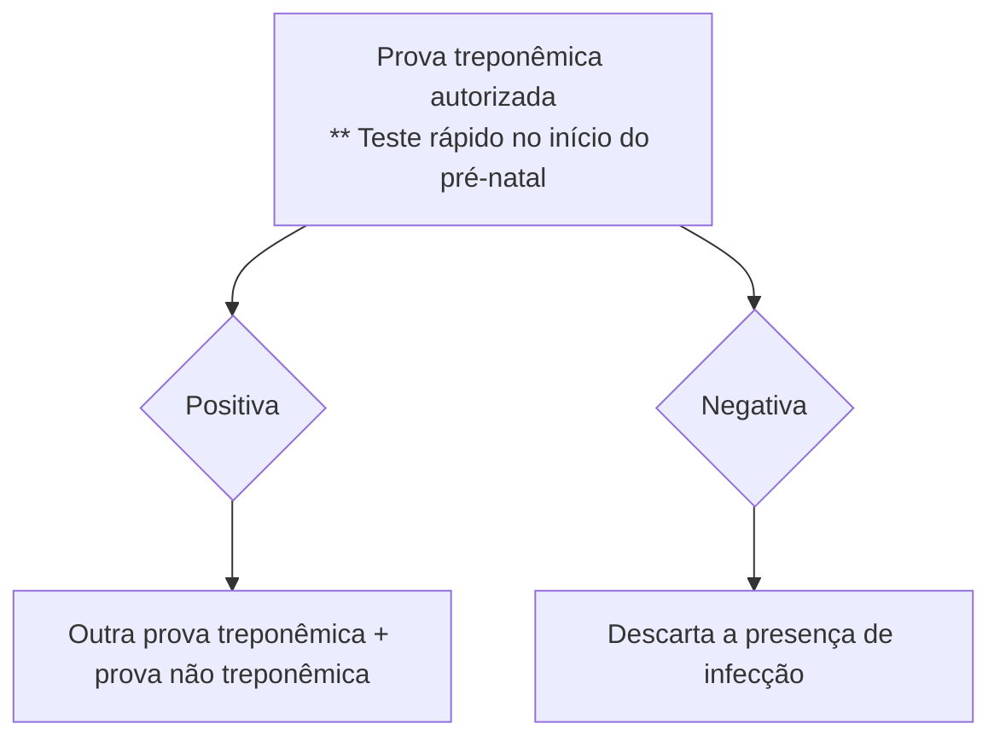

# INFECÇÕES E GRAVIDEZ

| Sífilis                                                                                                                                                                                                                                                                                                                                                                                                                                                                                                                                                                                                                                                                               | Toxoplasmose                                                                                                                                                                                                                                                                                                                                                                                                                                                                                                                                                                                                                                                                                                       |
| ------------------------------------------------------------------------------------------------------------------------------------------------------------------------------------------------------------------------------------------------------------------------------------------------------------------------------------------------------------------------------------------------------------------------------------------------------------------------------------------------------------------------------------------------------------------------------------------------------------------------------------------------------------------------------------- | ------------------------------------------------------------------------------------------------------------------------------------------------------------------------------------------------------------------------------------------------------------------------------------------------------------------------------------------------------------------------------------------------------------------------------------------------------------------------------------------------------------------------------------------------------------------------------------------------------------------------------------------------------------------------------------------------------------------ |
| **Tratamento:**
• Infecção recente (até um ano de duração): Penicilina benzatina 2.400.000 UI, divididas em duas injeções de 1.200.000 UI em cada um dos glúteos, em uma única tomada
• Infecção tardia: Penicilina benzatina 7.200.000 UI divididas em três aplicações semanais de 2.400.000 UI.
• Neurossífilis: Penicilina G cristalina 4.000.000 UI, por via endovenosa, a cada 4 horas, por 10 a 14 dias.
**HIV**
Manejo obstétrico:
• CV > 1000 cópias/mL na 34ª semana ou não fez uso de TARV = cesárea eletiva com 38 semanas.
• Em uso de TARV e CV < 1000 cópias = via obstétrica.
• Se CV indetectável = sem necessidade de AZT intraparto | IgG - / IgM + → infecção aguda ou falso positivo. Inicia-se espiramicina (para diminuir o risco de transmissão vertical). Após, repete-se a sorologia em 2 semanas para observar se houve soroconversão dos anticorpos:
• IgG - / IgM - → não ocorreu soroconversão (falso positivo). Mantém-se a conduta do rastreamento pré-natal para toxoplasmose.
• IgG + / IgM + → infecção aguda ou antiga:
• < 16 semanas: Mantém Espiramicina + Teste de Avidez.
• Avidez alta = infecção antiga; Avidez baixa = infecção aguda logo se encaminha ao pré-natal de alto risco.
• >= 16 semanas: inicia-se pirimetamina + sulfadiazina + ácido folínico, além de encaminhar ao pré-natal de alto risco. |

## 1. SÍFILIS

### 1.1 INTRODUÇÃO:
É uma infecção sistêmica crônica causada por uma bactéria espiroqueta *Treponema pallidum*.

### 1.2 TRANSMISSÃO:
• A transmissão dá-se primordialmente por contato sexual;
• A transmissão vertical pode ocorrer em todas as fases clínicas de manifestação da sífilis por passagem transplacentária.

### 1.3 TRANSMISSÃO VERTICAL:
• A principal via de transmissão é a transplacentária, apesar da transmissão intraparto, por meio da região genital contaminada, também ser possível;
• A transmissão mais facilmente ocorre nas lesões primárias, secundária e a fase latente recente, devido à intensa replicação e disseminação do agente;
• Quanto mais avançada a gestação, maior a probabilidade de infecção congênita decorrente da maior permeabilidade da barreira placentária.

### 1.4 MANIFESTAÇÕES CLÍNICAS:

**Sífilis primária:**
• Ocorre em torno de duas a seis semana após o contágio;
• Cancro duro: úlcera de bordas elevadas, fundo limpo e não dolorosa, geralmente na área de inoculação do agente.

**Sífilis secundária:**
• Geralmente surge de 45 a 60 dias após o desaparecimento do cancro duro;
• Múltiplas manifestações clínicas podem estar presentes: rash máculo-papular com lesões generalizadas (inclusive em palma da mão e planta do pé), febre baixa, cefaleia, linfadenopatia generalizada, condiloma plano e alopécia são alguns exemplos.

**Fase latente:**

• É o período que corresponde aos desaparecimentos das lesões da sífilis secundária, até o surgimento de lesões da fase terciária;
• Pode se dividir em latente recente (até 1 ano de infecção) e tardia (doença com mais de 1 ano de duração).

**Sífilis terciária:**
• É o último estágio de desenvolvimento da sífilis e apresenta diversos sintomas;
• Dentre a apresentação clínica pode-se ter:
• Lesões cutâneas: lesões gomosas e nodulares, de caráter destrutivo;
• Lesões Ósseas: periostite, osteíte gomosa ou esclerosane, artrites, sinovites;
• Lesões Cardiovasculares: Estenose de coronárias, aortite e aneurisma de aorta;
• Lesões neurológicas: meningite, gomas do cérebro ou da medula, atrofia de nervo óptico, lesão do sétimo par craniano, manifestações psiquiátricas, tabes dorsalis e quadros de demência.

### 1.5 MANIFESTAÇÕES FETAIS:
• Alteração hepática, hepatomegalia, trombocitopenia, anemia, ascite;
• Acometimento neonatal inclui: pneumonia, cirrose hipertrófica, osteocondrite em ossos longos, exantema bolhoso, hepatoesplenomegalia, anemia hemolítica, icterícia, tíbia em sabre e dentes de Hutchinson.

### 1.6 EXAMES DIAGNÓSTICOS:
Identificação do treponema em microscopia em campo escuro: é o padrão ouro. Realizado principalmente na sífilis primária.

**Testes treponêmicos: FTA abs e testes rápidos**
• Detectam anticorpos específicos produzidos contra antígenos de *T. pallidum*.
• São os primeiros a se tornarem reagentes.
• Possuem menos resultados falso positivos.

OBSTETRÍCIA ALTO RISCO

• Mesmo após o tratamento adequado, não ocorre a negativação, persistindo como marca sorológica da infecção.

**Testes não treponêmicos: VDRL.**

• Estes testes detectam anticorpos anticardiolipina não específicos para os antígenos do T. pallidum.
• Podem apresentar resultados falso positivos: infecções por outros tipos de treponemas, doenças do colágeno, neoplasias, uso de drogas e a própria gestação.
• Reatividade ao redor da 4a semana de infecção.
• Utilizado para acompanhamento do paciente com sífilis.

## 1.7 RASTREAMENTO E DIAGNÓSTICO DA SÍFILIS NA GESTANTE:

Recomenda-se o rastreamento na primeira consulta de pré-natal, no início do terceiro trimestre e na admissão para parto ou aborto. **Figura 1**

## 1.8 TRATAMENTO:

• Droga de escolha = Penicilina. Não existe evidência que nenhuma outra droga seja efetiva para o feto;

**Infecção recente (até um ano de duração): Fases primária, secundária e latência recente**

• Dose: Penicilina benzatina 2.400.000 UI, divididas em duas injeções de 1.200.000 UI em cada um dos glúteos, em uma única tomada.

**Infecção tardia**

• Dose: Penicilina benzatina 7.200.000 UI, divididas em três aplicações semanais de 2.400.000 UI.

**Neurossífilis:**

• Penicilina G cristalina 4.000.000 UI, por via endovenosa, a cada 4 horas, por 10 a 14 dias.
• Algumas referências citam que, após o tratamento com penicilina cristalina, deve-se prosseguir o tratamento com penicilina G benzatina 2.400.000 UI, semanalmente, por 3 semanas (ZUGAIB).
• Reação de Jarisch Herxheimer:
  • Resulta da morte rápida das espiroquetas → intensa resposta inflamatória aguda;
  • **Sintomas:** febre, taquicardia, artralgia, faringite, cefaleia e piora das lesões cutâneas;
  • **Fatores de risco:** tratamento em doença recente;
  • **Complicações:** trabalho de parto prematuro, anormalidades na cardiotocografia e óbito fetal.

**Figura 1** Fluxograma de rastreamento pré-natal de sífilis na gestação

## 1.9 NOTA TÉCNICA Nº 14/2023-.DATHI/SVSA/MS

• Para gestantes, o intervalo entre as doses de benzilpenicilina benzatina é de 7 (sete) dias.
• Em gestantes que apresentarem atraso entre as doses

superior a 9 (nove) dias, em qualquer esquema de tratamento prescrito, é necessário repetir o esquema terapêutico completo.

• Considera-se tratamento adequado da gestante quando o intervalo entre as doses estiver entre sete a nove dias. Qualquer esquema com intervalos superiores a nove dias ou inferiores a sete dias entre as doses deve ser considerado tratamento inadequado.
• Em caso de alergia à penicilina, a recomendação clássica é dessensibilização e tratamento com penicilina em ambiente hospitalar.

## 1.10 ACOMPANHAMENTO APÓS TRATAMENTO:

• A realização do VDRL deve ser mensal após tratamento.
• Resposta adequada;
  • Queda de duas diluições em 3 meses após conclusão do tratamento;
  • Queda de quatro diluições em 6 meses após conclusão do tratamento.
• Persistência de resultados reagentes em testes não treponêmicos com títulos baixos (1:1 a 1:4) durante um ano após o tratamento, quando descartada nova exposição de risco, é chamada de cicatriz sorológica.

## 1.11 CRITÉRIO PARA RETRATAMENTO:

• Não redução da titulação em duas diluições no intervalo de 6 meses (sífilis recente) ou 12 meses (sífilis tardia) após o tratamento adequado;
• Aumento da titulação em duas diluições (1:16 para 1:64) em qualquer momento do seguimento;
• Persistência ou recorrência de sinais e sintomas em qualquer momento do seguimento.

## 1.12 DEFINIÇÃO DE TRATAMENTO ADEQUADO:

• Administração de penicilina benzatina;
• Início do tratamento até 30 dias antes do parto;
• Esquema terapêutico de acordo com o estágio clínico;
• Respeito ao intervalo entre as doses;
• Avaliação quanto ao risco de reinfecção;
• Documentação de queda do título do teste não treponêmico em pelo menos duas diluições em três meses, ou de quatro diluições em seis meses após a conclusão do tratamento.

# 2. TOXOPLASMOSE

## 2.1 DEFINIÇÃO:

É uma infecção causada pelo Toxoplasma gondii, cujo hospedeiro definitivo é o gato.

INFECÇÕES E GRAVIDEZ                                                                                               3

## 2.2 TRANSMISSÃO:

• Ocorre através do contato com terra, areia e ingestão de alimentos que tenham sido contaminados pelos oocistos depositados no meio ambiente, como frutas ou vegetais mal lavados, carnes cruas (incluindo peixes e crustáceos).
• A contaminação também pode ocorrer por consumo de água contaminada, contato íntimo com gatos contaminados.

## 2.3 TRANSMISSÃO VERTICAL:

• Pode ocorrer por via transplacentária.
• A transmissão é mais fácil de ocorrer no terceiro trimestre quando comparada ao primeiro. No entanto, o risco de comprometimento fetal é menor quanto mais avançada for a gestação.

**Figura 2** Transmissão vertical da Toxoplasmose.

## 2.4 MANIFESTAÇÕES FETAIS E NEONATAIS:

• Lesões oculares: retinocoroidite, atrofia do nervo óptico, catarata e estrabismo;
• Alterações neurológicas: ventriculomegalia, encefalomalácia, surdez neurossensorial e calcificações cerebrais;
• Alterações sistêmicas: hepatoesplenomegalia, trombocitopenia ou insuficiência cardíaca;
• Abortamento, natimortalidade e prematuridade.

## 2.5 DIAGNÓSTICO:

• Baseia-se na sorologia com detecção de anticorpos específicos das classes IgM e IgG;

**Dessa forma:**

• IgG - / IgM - → gestante suscetível à infecção. A conduta é repetição de sorologia para toxoplasmose mensalmente ou, no máximo, a cada 2 meses.
• IgG + / IgM - → gestante imune (infecção prévia). A conduta é seguir o pré-natal de baixo risco.

**IgG - / IgM + → infecção aguda ou falso positivo. Iniciamos tratamento com espiramicina (para diminuir o risco de transmissão vertical). Após, repete-se a sorologia em 2 semanas para observar se houve soroconversão dos anticorpos:**

• IgG - / IgM - → não ocorreu soroconversão (falso positivo). Mantém-se a conduta do rastreamento pré-natal para toxoplasmose.

**IgG + / IgM + → infecção aguda ou antiga:**

• < 16 semanas: manter a espiramicina e fazer o teste de avidez do IgG. **Se a avidez é alta, a infecção é antiga e, se a avidez é baixa, a infecção pode ter ocorrido no primeiro trimestre da gestação,** com alto risco de transmissão vertical, logo se encaminha a paciente ao pré-natal de alto risco.
• >= 16 semanas: inicia-se pirimetamina + sulfadiazina + ácido folínico + encaminhar ao pré-natal de alto risco. Nesse caso, já tem risco de acometimento fetal e, por isso, **já se inicia o esquema tríplice,** por se tratar da mãe e do feto + PCR do líquido amniótico por amniocentese (> 18 semanas E após 4 semanas de infecção materna):
  • PCR positivo: esquema tríplice até o parto.
  • PCR negativo: retorno à espiramicina.
• A partir de 18 semanas de idade gestacional = ultrassonografia seriada e amniocentese para pesquisa de infecção no líquido amniótico.
• Infecção aguda no terceiro trimestre: manter esquema tríplice sem a realização de Amniocentese.
• **Teste de avidez:** realizado até 16 semanas de gestação;
  • Alta avidez: exclui infecção aguda na gestação, já que indica que os anticorpos foram produzidos há mais de 12 a 16 semanas;
  • Baixa avidez: indica infecção adquirida na gestação.
  • **Após 16 semanas não se pede teste de avidez!!**

## 2.6 ATUALIZAÇÃO EM 2022 MINISTÉRIO DA SAÚDE

• Na suspeita de infecção materna, já se inicia a espiramicina.
• Além disso, inicia-se, ainda, o esquema tríplice mesmo antes da confirmação do acometimento fetal, nos casos de IgM e IgG +, em gestações com 16 semanas ou mais.

## 2.7 ORIENTAÇÕES À GESTANTE:

• Não comer carne crua ou mal passada;
• Não comer ovos crus ou mal cozidos;
• Beber água filtrada ou fervida;
• Lavar bem frutas, verduras e legumes (não se recomenda a ingesta de verduras cruas);
• Evitar contato com gatos e com tudo que possa estar contaminado com suas fezes;
• Usar luvas e máscara se manusear terra.

## 3. HIV

• O principal fator determinante da transmissão vertical é a carga viral.
• Outros fatores associados são ausência de tratamento com terapia antirretroviral, vaginose, sífilis, uso de drogas ilícitas, relações sexuais sem preservativo, bolsa rota por mais de 4 horas, trabalho de parto prolongado e parto vaginal operatório.

## 3.1 ROTINA PRÉ-NATAL:

• Recomenda-se o rastreamento na primeira consulta de pré natal, no início do terceiro trimestre e na admissão para parto ou aborto.

OBSTETRÍCIA ALTO RISCO

**Para as gestantes que diagnosticam HIV na gestação ou para aquelas que já sabem ser portadoras do vírus, deve-se solicitar na primeira consulta:**

• Se CV detectável: Carga viral, Genotipagem e CD4
• Se CV indetectável: Carga viral e CD4
• Em ambos os casos a CV deve se repetir a cada 4 semanas até negativação e, depois disso, próximo ao parto.

**Além da rotina pré-natal habitual, para as portadoras de HIV acrescenta-se**

• Provas de função renal e hepática
• Repetir trimestralmente: hemograma, provas de função renal e hepática, toxoplasmose, U1 e urocultura
• Sorologia para hepatite A
• Checar calendário vacinal, devendo acrescentar as vacinas para pneumococo, meningococo e Haemophilus, para as mulheres menores de 19 anos não vacinadas previamente
• Pesquisa de tuberculose para pacientes sintomáticas respiratórias e em situação de risco.

## 3.2 TRATAMENTO DURANTE A GESTAÇÃO:

• A TARV está recomendada para toda gestante vivendo com HIV;
• Para a escolha de tratamento:

**Pacientes com início da TARV durante a gestação, sem exposição prévia à TARV:**

• Tenofovir + Lamivudina (TDF + 3TC) + Dolutegravir (DTG);
• Deve-se iniciar o DTG após 12 semanas de gestação;
• Com idade gestacional < 12 semanas: atazanavir/ ritonavir OU efavirenz (este último se genotipagem sem resistência viral);
• Em caso de contraindicação ao tenofovir: AZT;
• Contraindicação ao TDF e AZT: Abacavir.
• Contraindicação ao Dolutegravir se uso concomitante de: Oxicarbamazepina, dofetilda e pilsicainida.

**Pacientes que engravidam em uso de TARV:**

Pacientes estáveis, com boa tolerância ao esquema e bons controles virológicos, avaliadas pelas dosagens de

CV e CD4 devem manter, preferencialmente, o esquema já iniciado antes da gestação.

## 3.3 PROFILAXIA DE INFECÇÕES OPORTUNISTAS NA GESTANTE:

• Sulfametoxazol-trimetoprim: profilaxia de Pneumocistose e Toxoplasmose Se CD4 < 200 células/mm3
• Isoniazida + Piridoxina: tratamento para TB latente, desde que excluída TBa ativa Se CD4 < 350 células/mm3
• Azitromicina: Mycobacterium avium Se CD4 < 50 células/mm3

## 3.4 MANEJO OBSTÉTRICO:

• Carga viral:

**CV > 1000 cópias/mL na 34ª semana ou não fez uso adequado de TARV = cesárea eletiva com 38 semanas.**

• AZT EV administrado, pelo menos, por 3 horas antes da cesárea

**Em uso de TARV e CV < 1000 cópias = via obstétrica.**

• CV < 1.000 cópial/mL, porém identificável = AZT EV 2mg/kg no início do trabalho de parto e, depois, 1 mg/kg de hora em hora, em infusão contínua, até o clampeamento do cordão.
• CV indetectável: não necessita de AZT.

Obs: Se houve histórico de má adesão à TARV, a equipe de assistência pode eleger ou não o uso do AZT intraparto EV.

• Situações especiais:
  • Se previsão de parto demorado ou distócico, mesmo que CV menor que 1000 cópias/mL, considerar a resolução por cesariana;
  • Trabalho de parto pré-termo: tocólise antes das 34 semanas com atenção ao uso de Zidovudina EV concomitante à inibição se CV > 1000 cópias/mL.
