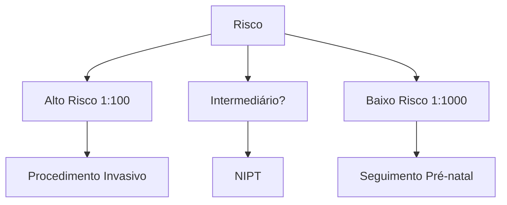

# RASTREAMENTO DE ANEUPLOIDIAS

| **Morfológico 1º Trimestre (11sem a 13 sem6d - CCN de 45 a 84mm)**
**Risco Basal**- Idade materna + antecedente gestacional**Risco Corrigido**- Translucência Nucal (TN)
- Osso Nasal
- Ducto Venoso
- Fluxo Tricúspide**Rastreamento Combinado**- USG Morfológico 1º trimestre
- BHCG livre
- PAPP-A
- PLGF |   | **Principais Aneuploidias**- Trissomia do 21 (Down): ↑ TN, ON hipoplásico, ↑ BHCG e ↓PAPP-A
- Trissomia do 18 (Edwards): ↓BHCG e ↓PAPP-A
- Trissomia do 13 (Patau): ↑ FC, ↓BHCG e ↓PAPP-A**N e Osso Nasal /Ducto Venoso /Fluxo Tricúspide e FC**
\[Three ultrasound images showing nasal bone, venous duct, and tricuspid flow measurements] |
| ---------------------------------------------------------------------------------------------------------------------------------------------------------------------------------------------------------------------------------------------------------------------------------------------------------------- | - | ------------------------------------------------------------------------------------------------------------------------------------------------------------------------------------------------------------------------------------------------------------------------------------------------------------------------------------------------ |

## 1. CONSIDERAÇÕES INICIAIS

**Útil para o rastreamento de:**

• Os métodos de rastreamento são exames não invasivos que fornecem um risco (para aneuploidias, malformações, síndromes gênicas etc), cujos valores indicarão se é necessária alguma complementação da investigação;

• A confirmação diagnóstica depende do estudo direto de material do concepto;
  • Deve ser obtido por procedimentos invasivos (BVC, amniocentese, cordocentese).

• Aneuploidias cromossômicas → é o mais amplamente difundido;

• Algumas síndromes gênicas → Noonan, displasia tanatofórica (DT), erros inatos do metabolismo;

• Cardiopatias congênitas.

**Observe a imagem abaixo:**

• Corte sagital mediano;

• Observa-se a ponta do nariz, osso nasal, palato (imagem retangular), feto em posição neutra.

[Ultrasound image showing sagittal view of fetal profile with nasal bone visible, labeled GA=13w5d]

## 2. RASTREAMENTO ULTRASSONOGRÁFICO DE 1º TRIMESTRE

### 2.1 HISTÓRIA;

• Publicado artigo no British Medical Journal, 1992: Prof Kypros Nicolaides (UK);

• Medida da espessura do espaço anecoico sob a pele na região nucal de fetos entre 10 – 14 semanas x prevalência de aneuploidias cromossômicas em diferentes grupos;

• > 3 mm: 35% dos fetos eram aneuploides;

• < 3 mm: menos de 2% eram aneuploides;

• Entre 1 e 2 mm: nenhum feto aneuploide.

• Cunhou o termo translucência nucal (TN);
  • Estabeleceu o papel da TN no rastreamento de aneuploidias;
  • Abriu caminho para trazer o rastreamento para o 1º trimestre.

### 2.2 TRANSLUCÊNCIA NUCAL (TN):

**Definição:**

• É a medida da espessura do espaço anecoico sob a pele da região nucal, no 1° trimestre* de gestação.

• < ou igual a 2mm -> sempre normal

• > ou igual a 3mm -> sempre alterado

**Quando realizar:**

• CCN 45 a 84mm (11 semanas e 3 dias e 13 semanas e 6 dias).

[Ultrasound image showing nuchal translucency measurement, labeled GA=11w0d, NT 1.27mm]

**Figura 1** Medida da translucência nucal

[Ultrasound image showing normal nuchal translucency measurement, labeled GA=12w3d, NT 1.52mm]

**Figura 2** Translucência nucal normal

MEDICINA FETAL

**Figura 3** Translucência nucal espessada

**Figura 5** Avaliação do ducto venoso (onda "a" positiva)

## Marcadores adicionais

### 2.3. FREQUÊNCIA CARDÍACA FETAL:
• Taquicardia fetal → presente em cerca de 2/3 dos fetos portadores da síndrome de Patau (FCF > p95 em 67% dos casos).

### 2.4 OSSO NASAL:
• No primeiro trimestre, o procedimento ideal é avaliar a presença ou ausência/hipoplasia do osso nasal → atentar para risco de trissomia do cromossomo 21 e outras;
• Observe a imagem abaixo: Feto de 11 semanas, com face em perfil, evidenciando 3 linhas ecogênicas (ponta do nariz, superfície da pele e osso nasal).

**Figura 6** Avaliação do ducto venoso. (onda "a" reversa)

**Figura 4** Avaliação do osso nasal

**Figura 7** Fluxo tricúspide normal

### 2.5 DUCTO VENOSO:
• O adequado é que a onda "a" seja positiva, ou seja, demonstre fluxo anterógrado (mesmo durante a sístole atrial); Confira **Figura 5**
• Onda "a" reversa; Confira **Figura 6**
  • Condição preditora de risco para aneuploidias e cardiopatias congênitas.

### 2.6 FLUXO TRICÚSPIDE:
• Regurgitação patológica; Confira **Figura 7** e **Figura 8**
• Fluxo tricúspide: Anterógrado, bifásico, sem grandes regurgitações.
• Regurgitação tricúspide patológica; Marcador de risco para aneuploidias e cardiopatias congênitas.

**Figura 8** Regurgitação tricúspide patológica

RASTREAMENTO DE ANEUPLOIDIAS                                                                                                    3

## 2.7 COMO AVALIAR OS RISCOS:

• Risco basal (fatores maternos):
  • Idade;
  • Idade gestacional;
  • Antecedentes gestacionais.
• Risco corrigido (marcadores ultrassonográficos):
  • Translucência nucal;
  • Frequência cardíaca;
  • Osso nasal;
  • Ducto venoso;
  • Fluxo tricúspide. bn
• A existência de malformação com alta associação a aneuploidias supera o cálculo de risco com os marcadores.

**Tabela 1** Impacto dos parâmetros clínicos e ultrassonográficos na determinação do risco de aneuploidias fetais

|                                    | Paciente 1                          | Paciente 2                   | Paciente 3                      | Paciente 4                         |
| ---------------------------------- | ----------------------------------- | ---------------------------- | ------------------------------- | ---------------------------------- |
| Idade Materna (anos)               | 20                                  | 45                           | 20                              | 35                                 |
| Idade Gestacional (semanas + dias) | 12 + 0                              | 12 + 0                       | 12 + 0                          | 12 + 0                             |
| CCN (mm)                           | 52                                  | 52                           | 52                              | 52                                 |
| FCF (ppm)                          | 150                                 | 150                          | 150                             | 150                                |
| TN (mm)                            | 1,5                                 | 1,5                          | 3,2                             | 1,5                                |
| Riscos Basais                      | 1: 1051
1: 2417
1: 7623     | 1: 16
1: 36
1: 112   | 1: 1051
1: 2417
1: 7623 | 1: 220
1: 506
1: 1596      |
| Riscos Corrigidos                  | 1: 5256
1: 7326
< 1: 20.000 | 1: 78
1: 106
1: 1899 | 1: 66
1: 434
1: 2308    | 1: 1101
1: 1534
< 1: 20000 |

## 3. MALFORMAÇÕES CONGÊNITAS

• Algumas estão fortemente associadas a certas aneuploidias cromossômicas, dispensando o cálculo de risco;
• DSAVT (defeito de septo atrioventricular total): síndrome de Down;
• Onfalocele: síndrome de Edwards (trissomia do 18) / Patau (trissomia do 13)
• Holoprosencefalia alobar: síndrome de Patau;
• Hérnia diafragmática: Síndrome de Edwards (trissomia do 18) / Patau (trissomia do 13);
• Megabexiga: Síndrome de Edwards (trissomia do 18) / Patau (trissomia do 13).

## 4. RASTREAMENTO COMBINADO DE 1º TRIMESTRE

É dado por: USG + marcadores bioquímicos;
• b-HCG livre (ou HCG total);
• PAPP-A;

• PIGF*.

*O comportamento do marcador, nas aneuploidias e na população normal, é semelhante ao do PAPP-A.

• O uso de tais marcadores aumentam a taxa de detecção e reduzem a taxa de falso-positivos;
• Podem ser coletados entre 9 semanas 0 dias até 13 semanas e 6/7 dias;

**Considerações importantes:**
• b-HCG livre: desempenho aumenta com a idade gestacional;
• PAPP-A: O desempenho diminui com a idade gestacional.

**Perfil na trissomia do 21;**
• b-HCG livre 2,0 MoM → muito aumentado;
• PAPP-A 0,5 MoM → reduzido.

**Perfil na trissomia do 18 e 13:**
• Ambos estão reduzidos

**Trissomia do cromossomo 21 – síndrome de Down;**

**Tabela 2** Impacto dos parâmetros clínicos, ultrassonográficos e bioquímicos na taxa de detecção de aneuplodias fetais no primeiro trimestre

|                                         | Taxa de Detecção (%) | Taxa de FP (%) |
| --------------------------------------- | -------------------- | -------------- |
| Idade materna (IM)                      | 30                   | 5              |
| IM + TN                                 | 75-80                | 5              |
| IM + BQ                                 | 60-70                | 5              |
| IM + BQ                                 | 85-95                | 5              |
| IM + TN + BQ
+outros marcadores USG | 93-96                | 2,5            |

## 5. NIPT

• NIPT - "Non-Invasive Prenatal Testing"
• Pesquisa de aneuploidias fetais em sangue materno.
• É um teste de rastreamento de aneuploidias cromossômicas em DNA fetal livre circulante no sangue materno;

**Motivação racional para o teste;**
• Durante a progressão da gestação, as células do trofoblasto sofrem apoptose → liberam fragmento de DNA "livre" (i.e., fora de células) na circulação materna;
• Logo, o NIPT se baseia na identificação do DNA fetal livre circulante na corrente sanguínea materna e na pesquisa de certas alterações para o rastreamento de aneuploidias.

### 5.1 PONTOS IMPORTANTES:

• Fração fetal (FF): refere-se à porcentagem do DNA livre, na circulação materna, que tem origem "fetal"; Interfere, proporcionalmente, na sensibilidade do exame. Quanto maior a IG, maior a fração fetal.
• Demonstra taxa de detecção altíssima e taxa de falso-positivo baixíssima, para trissomias mais comuns;
  • T21: detecção: 99,5% / falso-positivo: 0,05%.

**Causas de falso-positivo;**
• Mosaicismo confinado à placenta;
• Câncer ou alterações genéticas maternas;
• Transplante de medula óssea ou transplante de órgãos sólidos;

MEDICINA FETAL

## Rastreamento

**Figura 9** Conduta frente ao risco avaliado à ultrassonografia morfológica do primeiro trimestre

• "Vanishing twin" aneuploide.

**Causas de falso-negativo;**
- Obesidade materna;
- Idade gestacional muito precoce;
- Uso de enoxaparina;
- Mosaicismo confinado à placenta.

É um **teste de rastreamento** → o resultado positivo requer confirmação com procedimento invasivo que estude diretamente o material genético do feto.

• Confira Figura 9

• Risco corrigido > 1:100* = alto risco = procedimento invasivo para confirmar ou descartar o diagnóstico;

*Ou risco > 1:150 – de acordo com algumas referências.

• Risco < 1:1.000 = baixo risco = seguimento habitual;

• Risco entre 1:100 e 1: 1.000 = intermediário = NIPT ou individualizar. Via de regra: seguimento habitual.

## 6. RASTREAMENTO DE 2º TRIMESTRE

• Bioquímica
  - Teste triplo: beta-hCG livre + AFP + Inibida A;
  - Teste quadruplo: triplo + estradiol.
- Trissomia do cromossomo 21 – síndrome de Down;

**Tabela 3** Impacto dos parâmetros clínicos, ultrassonográficos e bioquímicos na taxa de detecção de aneuplodias fetais no segundo trimestre

|                                      | Taxa de Detecção (%) | Taxa de FP (%) |
| ------------------------------------ | -------------------- | -------------- |
| Idade materna (IM)                   | 30                   | 5              |
| IM + TN + BQ + outros marcadores USG | 93-96                | 2,5            |
| IM + Teste Duplo                     | 55-65                | 5              |
| IM + Teste Triplo                    | 60-70                | 5              |
| IM + Teste Quádruplo                 | 65-75                | 5              |

# REFERÊNCIAS

**Figura 1** Medida da translucência nucal
Arquivo Medcof

**Figura 2** Translucência nucal normal
Arquivo Medcof

**Figura 3** Translucência nucal espessada
Arquivo Medcof

**Figura 4** Avaliação do osso nasal
Arquivo Medcof

**Figura 5** Avaliação do ducto venoso (onda "a" positiva)
Arquivo Medcof

**Figura 6** Avaliação do ducto venoso. (onda "a" reversa)
Arquivo Medcof

**Figura 7** Fluxo tricúspide normal
Arquivo Medcof

**Figura 8** Regurgitação tricúspide patológica
Arquivo Medcof
