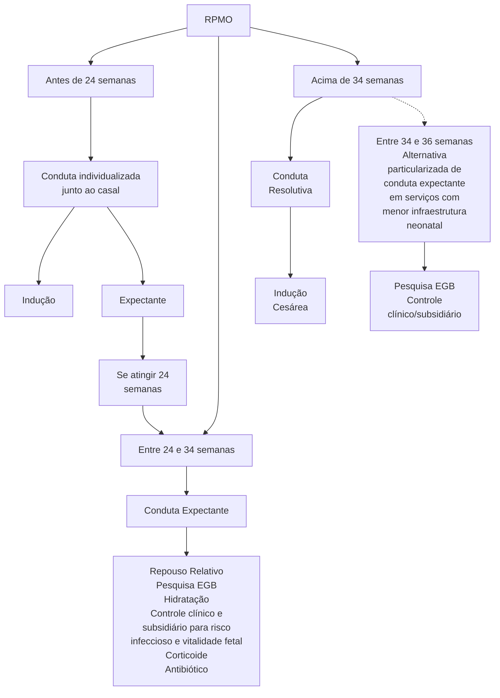

# RUPTURA PREMATURA DAS MEMBRANAS OVULARES

• **Definição:** Rotura prematura das membranas ovulares após 20-22 semanas e antes do início do trabalho de parto.
• **Diagnóstico:**
  • Exame especular evidenciando saída de líquido pelo orifício externo do colo do útero → padrão ouro;
  • Exames adicionais: Cristalização do muco cervical (aspecto folha de samambaia); pH por fita (acima de 6,5 / fenol vermelho); Ultrassonografia – redução

de quantidade de líquido amniótico em relação a outro exame recente e Testes imunocromáticos.
• Conduta irá depender da idade gestacional, porém com indicação de resolução a partir de 34 semanas de idade gestacional ou antes se infecção materna e/ ou fetal, alteração de vitalidade fetal ou trabalho de parto espontâneo.

## 1. RPMO

### 1.1 DEFINIÇÃO
• Rotura prematura das membranas ovulares após 20-22 semanas e antes do início do trabalho de parto.
• Pré-temo: antes das 37 semanas.
• Termo: após 37 semanas.

### 1.2 FATORES DE RISCO
• Sobredistensão uterina – polidrâmnio, macrossomia, gemelaridade;
• Incompetência istmocervical;
• **Inflamação/infecção local:**
  • Principal causa.
  • Infecção vaginal ascendente: Enfraquecimento das membranas → Rotura. Ex.: vaginose bacteriana e infecção por Strepto B e gonococo;
• Tabagismo;
• Placenta inserção baixa;
• ITU (Infecção do Trato Urinário).

### 1.3 DIAGNÓSTICO
Exame especular evidenciando saída de líquido pelo orifício externo do colo do útero – que pode ou não ser precipitado por Valsalva. Este é o exame padrão ouro para o diagnóstico;

**Exames complementares:**
• Cristalização do muco cervical (aspecto folha de samambaia);
• pH por fita (acima de 6,5 / fenol vermelho);
• Ultrassonografia – redução de quantidade de líquido amniótico em relação a outro exame recente (A principal hipótese de líquido reduzido no USG é RPMO, por ser mais frequente.)
• **Testes imunocromáticos:** Detectam proteínas do líquido amniótico. Mais caros e mais específicos.

### 1.4 CONDUTA
Depende da idade gestacional;

**Todos os casos:**
• Internação clínica;
• Evitar toque vaginal;
• Avaliação clínica: pulso, temperatura, frequência cardíaca, tônus uterino e fisometria;

• Laboratorial: Urina 1; Urocultura; HMG; PCR; SGB.

**Antes da viabilidade (<24 semanas):**
• Prognóstico desfavorável;
• Oferecer ao casal opção de interrupção (Alto risco infeccioso para a paciente e prognóstico reservadíssimo para o bebê).
• Opção por manutenção? Assinatura em prontuário pelo casal.

**Viabilidade (24 até 34 semanas):**
• Internação;
• Repouso relativo;
• Hidratação oral abundante (mínimo 2,5L ao dia);
• **Controle clínico:** Sinais vitais; Tônus uterino; BCF;
• USG obstétrico com doppler + PBF (perfil biofísico fetal) 2x/semana.
• Cardiotocografia diária;
• Controle de hemograma e proteína C reativa a cada dois a três dias;
• **Contraindicar tocólise;**
• **Corticoterapia:** 1 ciclo de Betametasona 12mg IM 24/24h (2 doses) ou Dexametasona 6mg IM 12/12h (4 doses) – até 34 semanas. O corticoide pode promover leucocitose, especialmente nas primeiras 48 horas.
• **Antibioticoterapia:**
  • Profilaxia SGB (Ampicilina 2g 6/6h por 48hrs);
  • Aumentar latência: (Amoxicilina 500mg 8/8h por 5 dias + Azitromicina 1g dose única) - conduta discutível de acordo com o serviço.
• **Quando interromper antes de 34 semanas?**
  • Infecção materna e/ou fetal;
  • Alteração de vitalidade fetal;
  • Trabalho de Parto.
• **Neuroproteção fetal:**
  • Sulfato de magnésio endovenoso; Até 31 semanas e 6 dias, se houver risco de parto iminente (dilatação a partir de 4 cm).

**RPMO a partir de 34 semanas:**
• Resolução da gestação;
• Postura ativa;
  • Algumas referências indicam conduta particularizada e expectante até 36 semanas.

OBSTETRÍCIA ALTO RISCO

**Figura 1** Fluxograma com resumo das condutas em RPMO com base na idade gestacional.

Adaptado de Protocolo de Gestação de Alto Risco. Ministério da Saúde, 2022

## 1.5 COMPLICAÇÕES

• **Infecção:**
  • Corioamnionite;
• DPP (descolamento prematuro de placenta);
• Prolapso de cordão;
• **Oligoidrâmnio severo e precoce:**
  • Compromete desenvolvimento fetal, hipoplasia pulmonar, deformidades de extremidades;
  • Compressão funicular, sofrimento fetal.

## 1.6 CORIOAMNIONITE

• **Sinais e sintomas:**
  • Febre materna → quando isolado e sem demais focos de infecção, já faz o diagnóstico;
  • Taquicardia materna;
  • Taquicardia fetal;
  • Leucócitos >20.000 mm³ ou desvio ou aumento de 20% dos leucócitos em relação ao inicial (cuidado com o corticoide);
  • Movimentos respiratórios ausentes no PBF.
  • Via de parto preferencial na corioamnionite é **via vaginal**.
  • Se indicação de via de parto por cesárea, proteção das goteiras parietocólicas com compressas úmidas e lavagem peritoneal, se necessário.
