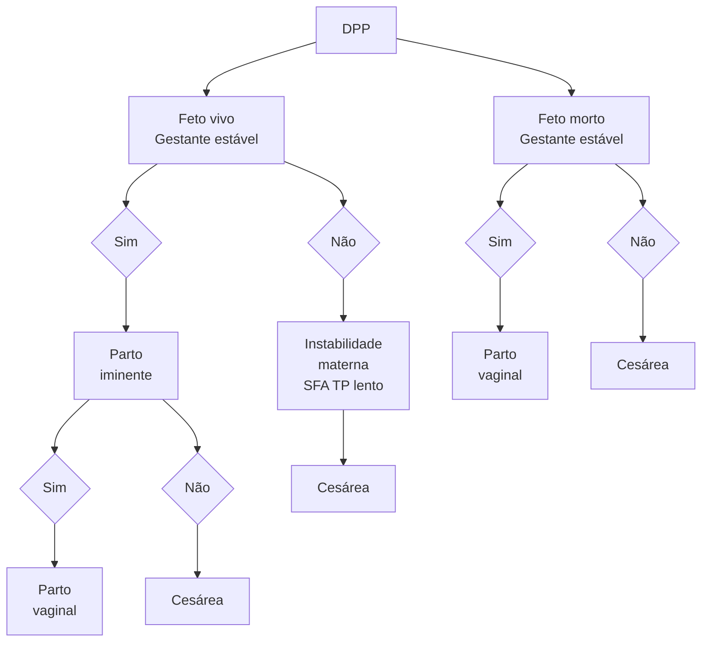

Sangramento de Segunda Metade Gestação

# SANGRAMENTOS DE SEGUNDA METADE

| **Descolamento prematuro de placenta:**
• Clínica: sangramento vaginal, dor abdominal, hipertonia, taquissistolia, sofrimento fetal, hemoâmnio;
• Diagnóstico: clínico;
• Conduta: parto pela via mais rápida. Exceto se paciente estável e feto morto.
**Placenta prévia:**
• Clínica: sangramento vaginal indolor, progressivo, recorrente, de aspecto vermelho-vivo, sem sofrimento fetal e tônus uterino normal; | • Diagnóstico: USG. Não fazer toque vaginal.
**Rotura uterina:**
• Clínica: subida da apresentação fetal ao toque vaginal, alívio da dor por interrupção das contrações, choque hemorrágico, Ausência de batimentos cardiofetais (BCF).
**Rotura de vasa prévia:**
• Clínica: sangramento pós-amniotomia, indolor, de início súbito e com sofrimento fetal sustentado e grave;
• É o único sangramento de origem fetal. |
| ---------------------------------------------------------------------------------------------------------------------------------------------------------------------------------------------------------------------------------------------------------------------------------------------------------------------------------------------------------------------------------------------------------------------------------------- | ------------------------------------------------------------------------------------------------------------------------------------------------------------------------------------------------------------------------------------------------------------------------------------------------------------------------------------------------------------------------------------------------------------------------------------------- |

## 1. DESCOLAMENTO PREMATURO DA PLACENTA

### 1.1 DEFINIÇÃO

É definido pelo descolamento parcial ou completo da placenta, intempestiva e prematura no corpo do útero, após a 20ª semana de gestação.

### 1.2 QUADRO CLÍNICO

• O diagnóstico é clínico;
• Sangramento vaginal – moderado a intenso;
• Coloração vermelho-escuro;
• Dor abdominal;
• Hipertonia;
• Contrações aumentadas – podem demonstrar taquissistolia;
• Altura uterina (AU) aumentada:
  • Nos casos com sangramento oculto.
• Sofrimento fetal;
• Hemoâmnio.

OBS.: lembrar que o sangramento pode estar ausente!

### 1.3 FATORES DE RISCO

• Síndromes hipertensivas;
• Uso de cocaína, crack;
• Tabagismo;
• Anemia, desnutrição;
• Idade > 35 anos;
• Alteração anatômica uterina;
• Versão cefálica externa;
• Trauma abdominal.

### 1.4 CONDUTA

**1° passo - Amniotomia:**
• Favorece a redução do hematoma retroplacentário e da passagem de tromboplastina para a circulação materna. Sendo assim, melhora a perfusão fetal e auxilia na redução da reatividade uterina.

**2° passo - Manter a estabilidade hemodinâmica e avaliação se o feto está vivo:**
• Paciente instável? Feto vivo? Parto pela via mais rápida;

• Normalmente, é por meio da cesárea, contudo é preciso analisar caso a caso. **Figura 1**

• Paciente estável? Óbito fetal? Preferir parto por via vaginal.

**Figura 1** Protocolo de conduta na assistência ao descolamento prematuro de placenta

### 1.5 COMPLICAÇÕES

• Choque hipovolêmico, sofrimento fetal; **Figura 2**
• Útero de couvelaire;
• Infiltração de sangue no miométrio;
• Acontece tardiamente;
• Dificulta a contratilidade uterina, evoluindo com atonia uterina.

**Figura 2** Ao lado: Útero de Couvelaire

# 2. PLACENTA PRÉVIA

## 2.1 DEFINIÇÃO
É dada pela placenta que se encontra no segmento inferior do útero após o período de **28 semanas de gestação**.

## 2.2 CLASSIFICAÇÃO:
• Placenta prévia: recobre total ou parcialmente o orifício interno do colo (OIC);
• Placenta de inserção baixa: atinge um raio de até 2 cm do OIC.

## 2.3 QUADRO CLÍNICO

O diagnóstico é clínico e ultrassonográfico

• Sangramento vaginal progressivo, recorrente, de aspecto vermelho-vivo;
  • Tende a ser indolor, mas podem haver contrações associadas.
• Ausência de sofrimento fetal;
• Tônus uterino normal.

OBS.: o sangramento pode ser intenso e provocar instabilidade materna. Ainda, nesses casos, é possível observar sofrimento fetal associado.

## 2.4 FATORES DE RISCO
• Multiparidade;
• Número de cesáreas prévias;
• Curetagens uterinas prévias;
• Idade > 35 anos;
• Antecedente de placenta prévia;
• Gemelaridade;
• Malformações uterinas;
• Tabagismo.

OBS.: as pacientes com diagnóstico de placenta prévia demonstram alto risco de hemorragia ante, intra e pós-parto.

ATENÇÃO: dentro da sala de parto, diante da suspeita ou do diagnóstico de placenta prévia, não proceder com toque vaginal! Há risco associado para desencadear sangramentos!

## 2.5 DIAGNÓSTICO
Ultrassonografia: realizada no intuito de observar a migração placentária.

## 2.6 ORIENTAÇÕES:
• Em caso de sangramento, procurar atendimento médico imediatamente;
• Evitar atividades físicas intensas;
• Manter abstinência sexual.

## 2.7 MANEJO:
**Internação hospitalar:**
• A presença de sangramento é indicação para internação;

• Acesso vascular periférico;
• Monitorização contínua;
• Solicitar tipagem sanguínea, hemoglobina, hematócrito, função renal, coagulograma – se necessário;
• Reserva de hemocomponentes;
• Programar uso do corticoide, se possível – útil para favorecer a maturação pulmonar.

ATENÇÃO: na presença de sangramento, caso a mãe seja Rh – e o pai seja Rh + → administrar imunoglobulina anti-D.

**Conduta obstétrica:**
• Programação da cesárea entre 36 e 36+6 semanas de gestação;
• Caso haja inserção baixa, pode-se tentar o parto por via vaginal;
• Deve-se evitar a incisão placentária.

OBS.: tais quadros podem ser associados à ocorrência de acretismo placentário.

## 2.8 ACRETISMO PLACENTÁRIO
**Definição:**
• Dá-se pela aderência anormal da placenta ao miométrio parede uterina, com ausência parcial ou total da decídua basal e desenvolvimento imperfeito da camada fibrinoide. Figura 3

**Figura 3 Acretismo Placentário**

**Incidência:**
• 1/500-600 partos;
• A taxa tem crescido com o aumento do número de cesarianas.

**Fatores de risco:**
• Cesárea anterior;
• Curetagem uterina;
• Miomectomia;
• Videohisteroscopia;
• Idade > 35 anos;
• Multiparidade.

SANGRAMENTOS DE SEGUNDA METADE                                                                                               3

**Manifestações clínicas:**
• "Placenta prévia que não sangra".

**Diagnóstico:**
• Ultrassonografia transvaginal;
• Ressonância magnética – especialmente nos casos de placenta posterior (Pela dificuldade na realização do ultrassom).

**Conduta**
• Planejamento do parto: 36 semanas.
• Demais condutas:
  • Estimar o risco de infiltração de outras estruturas;
  • Reserva de sangue;
  • Preparar equipe para protocolo de transfusão maciça;
  • Diálogo com o paciente e familiares.
• Perda estimada de sangue em média de 2,5L;
• Ainda, não é infrequente que tais casos requeiram a realização de histerectomia, bem como cursem com lesão de bexiga e/ou ureter.

**Tabela 1** Resumo com as principais condutas diante do diagnóstico de acretismo placentário

| Reserva de hemocomponentes           | SVD Foley 18                 | Reserva UTI                                 |
| ------------------------------------ | ---------------------------- | ------------------------------------------- |
| Histerectomia com placenta *in situ* | Histerotomia fúndica         | AVP calibroso                               |
| TCLE                                 | Não tentar descolar placenta | Radiologia intervencionista em alguns casos |

## 3. ROTURA UTERINA

### 3.1 DEFINIÇÃO
É dada pela abrupta solução de continuidade de todas as camadas da parede uterina, incluindo a camada serosa superficial.

### 3.2 FATORES DE RISCO
• Rotura em gestação anterior;
• Incisão miometrial prévia, especialmente nos casos com miomectomia;
• Uso de ocitocina, com fase ativa prolongada;
• Trauma abdominal (automobilístico, versão cefálica externa);
• Fraqueza intrínseca (Ehlers-Danlos tipo IV; malformação mulleriana);
• Parto obstruído (desproporção céfalo-pélvica), taquissistolia;
• Iatrogenia (Kristeller).

### 3.3 ANTES DO ROMPIMENTO UTERINO
• Sinal de Bandl: refere-se à presença de anel de constrição patológico -> gera o "sinal da ampulheta";
• Sinal de Frommel: observado pela palpação do ligamento redondo retesado;
• Dor intensa em segmento inferior;
• Bradicardia fetal;
• Confira Figura 4 e Figura 5.

**Figura 4** Rotura uterina: Sinal de bandl

### 3.4 APÓS O ROMPIMENTO UTERINO
• Desaparecimento da apresentação fetal ao toque vaginal;
• Alívio da dor por interrupção das contrações → choque hemorrágico;
• Ausência de batimento cardiofetal (BCF);
• Sinal de Laffont: dor escapular (por irritação do nervo frênico);
• Sinal de Cullen: hematoma periumbilical.

### 3.5 CONDUTA
• À cessação das contrações uterinas → parto pela via mais rápida;
• Há grande necessidade de histerectomia;
• Prover suporte hemodinâmico.

## 4. ROTURA DE VASA PRÉVIA

### 4.1 DEFINIÇÃO
• Vasos prévios (ficam à frente) à apresentação;
• Acontece principalmente quando há:
  • Inserção marginal de cordão;
  • Placenta bilobada ou suscenturiada;
  • Inserção velamentosa de cordão. Figura 6

**Figura 5** Tipos de placenta

Bilobulada, Circunmarginada, Em raquete, Inserção velamentosa, Circunvalada, Sucenturiada

### 4.2 MANIFESTAÇÕES CLÍNICAS
• Sangramento de início súbito;
• Em geral, é indolor;
• Normalmente, pode ocorrer após a amniotomia;
• Sofrimento fetal sustentado e grave.

A origem do sangramento é fetal!

### 4.3 DIAGNÓSTICO
• Inspeção da placenta;
• Ultrassom com dopplerfluxometria. Figura 7

![Figura 7 Rotura de vasa prévia: ultrassom com dopplerfluxometria.]

**Figura 7** Rotura de vasa prévia: ultrassom com dopplerfluxometria.

## 4.5 CONDUTA

**Cesárea eletiva com 36 semanas:**
• Quando houver diagnóstico precoce.

**Cesárea de emergência:**
• Caso o diagnóstico seja dado durante o trabalho de parto, com sofrimento fetal;
• A via vaginal não é ideal, nesses casos.

## 5. ROTURA DE SEIO MARGINAL

### 5.1 DEFINIÇÃO
• É a rotura da periferia do espaço interviloso (seio marginal).

### 5.2 QUADRO CLÍNICO
• Sangramento súbito periparto sem outros sintomas associados.

A origem do sangramento é maternal

### 5.3 DIAGNÓSTICO
• É dado através da histopatologia.

### 5.4 CONDUTA
• Vigilância clínica;
• Monitorização materno-fetal.

SANGRAMENTOS DE SEGUNDA METADE                                                                                                                                     5

# SANGRAMENTOS DE SEGUNDA METADE

**Figura 1** Protocolo de conduta na assistência ao descolamento prematuro de placenta

Adaptado de Tratado de Obstetrícia - Febrasgo, 2019

**Figura 2** Útero de Couvelaire

Deshpande PS, Honavar PU, Gupta AS. Couvelaire Uterus Due To Chronic Abruption With a Successful Pregnancy Outcome. JPGO 2018. Volume 5 No.1. <http://www.jpgo.org/2018/01/couvelaire-uterus-due-to-chronic. html> Acesso em: 13 nov. 2023

**Figura 7** Ultrassom com dopplerfluxometria.

BRUNS, D. R. O que é Vasa Prévia? Disponível em: <https://www.fetalmed. net/o-que-e-vasa-previa/>. Acesso em: 13 nov. 2023.
