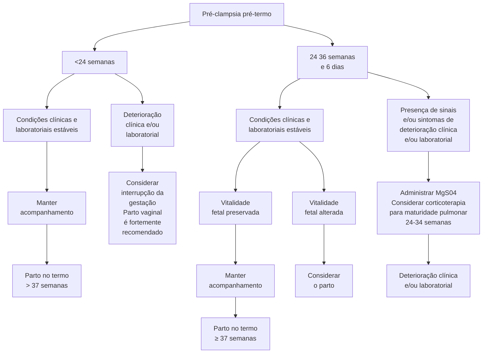

Síndromes hipertensivas na gestação

# SÍNDROMES HIPERTENSIVAS

• **Hipertensão crônica:** relatada ou aferida antes de 20 semanas. Pode desenvolver pré-eclâmpsia sobreposta a partir de 20 semanas.
• **Hipertensão gestacional:** pressão elevada a partir de 20 semanas sem outros critérios para pré-eclâmpsia.
• **Pré-eclâmpsia (PE):** Pressão arterial elevada (140x90mmHg) a partir de 20 semanas com proteinúria significativa ou alterações em exames laboratoriais, restrição de crescimento fetal, alteração de dopplervelocimetria, insuficiência renal aguda, edema pulmonar, eclâmpsia.
• **HELLP:** BT > 1,2 | DHL > 600 | TGO ou TGP > 70 | Plaquetas < 100.000
• **Eclâmpsia:** convulsões tônico-clônicas generalizadas autolimitadas associadas à pré-eclâmpsia.
• **Sulfato de Mg2+** se piora clínica e/ou laboratorial, iminência ou eclâmpsia, HELLP, HAC de difícil controle ou pico pressórico. Antídoto: gluconato de cálcio.
• **AAS + cálcio:** iniciar 12-16 semanas se 1 fator de alto risco ou 2 fatores de risco moderados de pré eclâmpsia

## 1. INTRODUÇÃO

**As síndromes hipertensivas são as intercorrências clínicas mais comuns da gestação e representam a principal causa de morbimortalidade materna no mundo.**
• Associada à eclâmpsia, risco aumentado para AVC, ICC, EAP, IRA, insuficiência hepática, CIVD, síndrome HELLP, prematuridade, oligoâmnio, RCF, óbito fetal.

### 1.1 DEFINIÇÕES

**Hipertensão arterial crônica (HAC)**
• Hipertensão relatada pela gestante ou identificada antes da 20ª semana de gestação.
• Pacientes com gestação molar podem fazer pré-eclâmpsia antes de 20 semanas de IG.

**Hipertensão gestacional**
• Hipertensão arterial na segunda metade da gestação, em gestante previamente normotensa, porém sem proteinúria ou manifestação de outros sinais/sintomas relacionados à pré-eclâmpsia.
• Diagnóstico temporário, 15-50% evoluem com pré-eclâmpsia.
• Para ser chamada de hipertensão gestacional deve até 12 semanas após o parto.

**Metas:**
• Manter o controle pressórico, pressão arterial sistólica entre 110-140 mmHg, no máximo, e pressão arterial diastólica de 85 mmHg.
• Monitorar o surgimento de pré-eclâmpsia – estas pacientes são seguidas tal qual pré-eclâmpsia, devido ao risco de desenvolvimento de pré-eclâmpsia.
• Postergar parto até 39+6.

**Pré-eclâmpsia**
• Hipertensão arterial, em gestante previamente normotensa, a partir da 20ª semana de gestação, associada à proteinúria significativa ou na presença de comprometimento sistêmico ou disfunção de órgãos-alvo.
• **Precoce** = <34 semanas
• **Tardia** = > ou igual a 34 semanas
• **Pré-termo** = <37 semanas
• **Pós-termo** = > ou igual a 37 semanas
• **Pré-eclâmpsia sobreposta** (HAC + abre pré-eclâmpsia na gestação), seja com proteinúria, piora do controle pressórico ou disfunção de órgão-alvo.

USP SP não reconhece a entidade hipertensão gestacional

**FISIOPATOLOGIA DA PRÉ-ECLÂMPSIA**

- FALHA NO REMODELAMENTO DAS ARTÉRIAS ESPIRALADAS → NÃO CONSIGO RESPIRAR!
- CADÊ MEU OXIGÊNIO?! → INSUFICIÊNCIA PLACENTÁRIA
- PLACENTA COM FORMAÇÃO INADEQUADA LIBERA CITOCINA INFLAMATÓRIA NA CIRCULAÇÃO MATERNA
- TRATAMENTO DEFINITIVO É REALIZAR PARTO
- VASOCONSTRIÇÃO SISTÊMICA E DISFUNÇÃO ENDOTELIAL
- HELLP! → HIPERTENSÃO E LESÕES EM ÓRGÃOS ALVO
- HEMÓLISE ENZIMAS HEPÁTICAS ELEVADAS BAIXAS PLAQUETAS
- PROTEINÚRIA

**Figura 1** Fisiopatologia da pré-eclâmpsia

OBSTETRÍCIA ALTO RISCO

## 2. PRÉ-ECLÂMPSIA

### 2.1 FISIOPATOLOGIA **Figura 1**

• Associada à segunda onda de invasão trofoblástica, levando as artérias espiraladas a um sistema de menor pressão. Quando não ocorre de forma adequada, ocorre um regime de alta pressão nessa localização.
• Alteração da permeabilidade vascular, perdendo volume para o 3º espaço, associada à EAP, IRA + proteinúria, necrose hepática.
• Além da placentação deficiente, há uma teoria de quebra de tolerância imunológica, bem como de outros fatores como: predisposição genética, resposta inflamatória sistêmica, desequilíbrio angiogênico, deficiência nutricional.

### 2.2 DEFINIÇÃO

• São pacientes com níveis pressóricos elevados (acima de 140 de PAS e/ou 90 mmHg de PAD) em consequência da própria gestação, após 20 semanas; + Proteinúria significativa (PTU 24 horas > 300mg – padrão ouro; outras formas: relação proteína/creatinina urinária > 0,3mg/dL; PTU fita 1+ ou mais) e/ou comprometimento sistêmico ou disfunção de órgão-alvo;

**O que é disfunção de órgão-alvo ?**

OBS: Na USP-SP os únicos critérios para definir pré-eclâmpsia são elevação de pressão e algum sinal de proteinúria ou edema de mãos e face, ou ganho 1kg/ semana, apenas!)

• Trombocitopenia
• Disfunção hepática
• Insuficiência renal
• Edema pulmonar
• Iminência de eclâmpsia
• Eclâmpsia
• Restrição de Crescimento Fetal (RCF)
• Alteração de Dopplervelocimetria
• Os dois últimos não são unanimidade (MS coloca que elevação de PA e restrição de crescimento fetal são classificadas como pré-eclâmpsia).

### 2.3 PRÉ-ECLÂMPSIA SEM SINAIS DE GRAVIDADE

**Internação para excluir gravidade:**

• Critérios de gravidade: PAS >= 160 mmHg; PAD >= 110 mmHg; Síndrome HELLP; Iminência de eclâmpsia; eclâmpsia; EAP; Dor torácica; IRA (diurese < 500ml em 24h, creatinina > 1,2).
• A USP-SP classifica as pacientes em dois subgrupos:
  • Leve → acompanhamento ambulatorial;
  • Grave (preenche qualquer um dos seguintes critérios de gravidade: PAS >= 160; PAD > =110; Iminência de eclâmpsia; Proteinúria de 24h > 2g; Eclâmpsia; EAP; dor torácica; IRA - diurese < 400ml em 24h, creatinina > 1,2).
• Confira na página seguinte a **Figura 2**

**Ambulatorial somente se:**

• Informada;

• Acesso ao hospital;
• Auxílio em casa;
• Aferição domiciliar de pressão;
• Redução de atividade física ou estressante;
• Retorno semanal.

**Mesmo sem sinal de gravidade**

• Parto: 37 semanas via obstétrica (via obstétrica pode ser parto normal ou cesárea);

**Dieta habitual:**

• Restrição de sal se necessária redução do volume intravascular;

**Não orientar repouso absoluto;**

**Exames:**

• Hemograma, DHL, BT, Creatinina, TGO;

**Ácido úrico:**

• Tem valor prognóstico;
• Associado a resultados desfavoráveis, não indica conduta.

**Tabela 1 Hipotensores de manutenção via oral:**

| Classe                                          | Drogas                                                 | Doses                                                |
| ----------------------------------------------- | ------------------------------------------------------ | ---------------------------------------------------- |
| Alfa2 agonistas (simpatolítico de ação central) | Metildopa
Clonidina                                | 750 – 2000 mg/dia
0,2 – 0,6 mg/dia               |
| Bloqueadores de canal de cálcio                 | Nifedipino retart
Nifedipino rápido
Anlodipino | 20 – 120 mg/dia
20 – 60 mg/dia
5 – 20 mg/dia |
| Vasodilatador periférico                        | Hidralazina                                            | 50 – 150 mg/dia                                      |
| Beta bloqueador                                 | Metoprolol
Carverdilol                             | 100 – 200 mg/dia
12,5 – 50 mg/dia                |

**Fetotóxicos - anomalias renais se usados após primeiro trimestre:**

• IECA: Inibidores da enzima conversora de angiotensina.
• BRA: Bloqueadores dos receptores de angiotensina II.

**Tiazídicos:**

• Não é contraindicado, mas pode levar à alteração do líquido amniótico.

### 2.4 PRÉ-ECLÂMPSIA LEVE USP SP:

• Seguimento ambulatorial;
• Afastamento do trabalho, repouso ao longo do dia, dieta hipossódica;
• Parto: 40 semanas, via obstétrica.

### 2.5 PRÉ-ECLÂMPSIA COM SINAIS DE GRAVIDADE

**Inviável (24 – 26 semanas):**

• Conduta individualizada

**Viabilidade até 34 semanas:**

• Ciclo de corticoide;
• Vigilância materno e fetal;
• Tentar prolongar a gestação até 34 semanas;
• Condições necessárias: Clínica estável, êxito no controle; Farmacológico da hipertensão arterial; Exames laboratoriais adequados; Vitalidade fetal preservada.

**34 até 37 semanas:**

• Se melhora clínico-laboratorial, considerar prolongar gestação até 37 semanas;
• Manter internação sempre;

SÍNDROMES HIPERTENSIVAS

**Figura 2** Fluxograma de manejo da pré-eclâmpsia pré-termo

• Condições necessárias: Clínica estável, êxito no controle farmacológico da hipertensão arterial, exames laboratoriais adequados e vitalidade fetal preservada.

**Interromper a gestação independentemente da idade gestacional:**
• Síndrome HELLP;
• Eclâmpsia;
• EAP/descompensação cardíaca;
• Piora laboratorial;
• IRA;
• DPP;
• Hipertensão refratária com 3 drogas;
• Alteração na vitalidade fetal.

**Via de parto:**
• Preferência pela via vaginal, ou seja, via de parto é obstétrica;
• Lembrar que cesárea aumenta riscos, uma vez que é uma cirurgia em uma paciente que muito provavelmente tem insuficiência renal, alteração de plaquetas, com mais riscos de hematoma e hemorragia pós-parto.

## 2.6 PRÉ-ECLÂMPSIA GRAVE USP-SP

**Internação clínica;**

**Meta de parto**
• 37 semanas;
• Iniciar sulfato de magnésio no trabalho de parto.

**Via obstétrica;**

**Síndrome HELLP**
• A meta é atingir 34 semanas se exames laboratoriais estiverem em melhora.

**OBS: Modelo fullPIERS**
• Calculadora que pode auxiliar na identificação de pacientes com maior risco de complicação em 48h até 7 dias.
• Ajuda se há dúvida:
  • Resolução ou não da gravidez;
  • Necessidade de UTI.
• Valor de corte: a partir de 30%.

## 2.7 PUERPÉRIO NA PRÉ-ECLÂMPSIA COM SINAIS DE GRAVIDADE

• Há risco de evoluir com eclâmpsia e síndrome HELLP;
• Se eclampsia puerperal, conduta igual na gestação, de sulfatação e suporte clínico;
• Há tendência de piora na PA entre 3º e 6º dias após o parto pela reabsorção de volume do terceiro espaço;
• Manter/ajustar anti-hipertensivos;
• Evitar AINEs;
• Cautela na hidratação endovenosa, pois a paciente está extravasando para o terceiro espaço, pode causar edema agudo de pulmão.

# 3. ECLÂMPSIA

## 3.1 CONSIDERAÇÕES GERAIS

• Convulsões tônico-clônica generalizadas e/ou coma associados à pré-eclâmpsia;
• Casos atípicos merecem investigação;

## 3.2 CONDUTAS

**Objetivo primário: preservar via aérea e garantir oxigenação:**

1. Aspirar secreções + protetor bucal (Guedel);
2. Garantir saturação de oxigênio O2 + O2 a 8 – 10 L/min – usa-se corte de 95% em vez de 92%;
3. Instalar soro glicosado 5% IV;
4. Coleta sangue + urina;
5. Decúbito lateral ou semi-sentada para melhorar perfusão do útero e melhorar a preservação da via aérea;
6. Sulfato de magnésio;
7. Nifedipina VO ou hidralazina EV se PA ≥ 160/110 mmHg;
8. Sonda vesical de demora;
9. Aguardar recuperação;
10. Programar interrupção.
• Evitar indicar resolução da gestação de maneira intempestiva;
• Controle clínico materno melhora a oxigenação fetal (e reduz a acidose);
• Cirurgia pode agravar quadro materno;
• Aguardar de 4 a 6 horas – via obstétrica (se vitalidade fetal permitir e houver estabilização do quadro clínico materno).

# 4. SULFATO DE MAGNÉSIO

## 4.1 SULFATO DE MAGNÉSIO:
- Sulfato de magnésio é um estabilizador de membrana e atua como profilaxia
- de convulsões:
- Se sinais de deterioração clínica e/ou laboratorial;
- Iminência de eclâmpsia;
- Eclâmpsia;
- HELLP;
- Hipertensão de difícil controle/pico pressórico;
- Seu uso **não** indica parto.

## 4.2 SULFATO DE MAGNÉSIO – USP-SP:

**Apenas 3 indicações:**
- Iminência de eclâmpsia (tríade): Pico pressórico, cefaleia ou algum outro sintoma neurológico como alteração de visão e dor epigástrica, ou náusea e/ou vômito;
- Eclâmpsia;
- Trabalho de parto com P.E. grave ou sobreposta (Ou seja, na USP-SP acaba estando indicado junto ao parto na viabilidade).

## 4.3 ESQUEMAS DE TRATAMENTO

**Esquema de Zuspan:**
- Ataque: 4 g IV lentamente;
- Manutenção: 1 a 2 g/h IV

**Esquema de Pritchard:**
- Ataque: 4 g IV lentamente + 10 g IM;
- Manutenção: 5 g IM 4/4h;
- Esquema preferencial para transporte, pois não depende de bomba de infusão;
- Não usar se plaquetopenia (<50.000), por risco de hematoma.
- Se nova convulsão, nova dose de ataque de 2 g EV;
- Não usar se miastenia gravis;
- Estado de mal: neuroimagem;
- Dois "ataques" sem controle: benzodiazepínico; pode usar fenitoína também.

**Esquema de Sibai**
- Ataque: 6g EV
- Manutenção: 2 a 3g/h IV

## 4.4 CUIDADOS COM O SULFATO DE MAGNÉSIO

**Insuficiência renal – a depuração da medicação é via renal:**
- Creatinina > 1,3 mg/dL;
- Aplicar metade da dose;
- Seguir nível sérico Mg.

**Critérios para manutenção:**
- Reflexos patelares presentes;
- FR > 12 irpm (ou 14 ou 16);
- Diurese > 25 mL/h;
- Dosar magnésio sérico somente se insuficiência renal ou redução de reflexos patelares;
- Níveis acima de 7 mEq/L podem gerar sinais de toxicidade: Depressão do sistema respiratório e até parada cardiorrespiratória.

**Terapêutica:**
- 4 – 7 mEq/L;

**Abolição de reflexo patelar.**
- 8 – 10 mEq/L.

**Risco PCR:**
- 12 mEq/L.

**Critérios de suspensão:**
- Depressão respiratória;
- Diurese insuficiente;
- Abolição de reflexos patelares: Reavaliar 1/1h até conseguir retornar; Até 2h: reiniciar; Passou de 2h: novo ataque, mas de 2g.

**Intoxicação:**
- Depressão respiratória → antídoto: Gluconato de cálcio 10% (1g) EV; Dar suporte respiratório O2 5 L/min por máscara.

Mesmo fazendo o sulfato de magnésio, a paciente pode continuar hipertensa. Nesse caso, podemos lançar mão dos hipotensores de ação rápida, cuja meta é a redução de 15 – 25% na primeira hora:

**Tabela 2 Hipotensores de ação rápida**

| Medicação               | Via | Dose                |
| ----------------------- | --- | ------------------- |
| Hidralazina             | EV  | 5 mg (máx 30 mg)    |
| Nifedipino              | VO  | 10 mg (máx 30 mg)   |
| Nitroprussiato de sódio | EV  | 0,5 – 10 mcg/kg/min |

Lembrando que o Nitroprussiato pode causar repercussão fetal, então não é primeira escolha.

# 5. SÍNDROME HELLP

## 5.1 DIAGNÓSTICO LABORATORIAL – HEMÓLISE MICROANGIOPÁTICA

**Hemólise:**
- BT > 1,2 mg/dL, DHL > 600, presença de esquizócitos em sangue periférico.

**Necrose hepática:**
- TGO ou TGP > 70 UI.

**Plaquetopenia:**
- Plaquetas < 100.000/mm³.

## 5.2 DIAGNÓSTICO DIFERENCIAL

**Esteatose hepática da gravidez:**
- Cursa com insuficiência hepática aguda, com **hipoglicemia**.
- PTT;
- Síndrome Hemolítica Urêmica;
- Hepatite aguda;
- Colecistite;
- Pancreatite;
- Lúpus;
- Choque séptico.

## 5.3 CLASSIFICAÇÃO DE MARTIN (1983)
- Classe I: < 50.000 plaquetas = maior risco de CIVD;
- Classe II: > 50.000 e < 100.000;
- Classe III: > 100.000 e < 150.000.

SÍNDROMES HIPERTENSIVAS                                                                                          5

## 5.4 CONDUTAS
• USG hepático;
• Fazer controle de pressão arterial;
• Meta de parto: 34 semanas, mas plaquetas têm que estar acima de 100.000/mm³;
• **Plaquetas:**
  • Alvo 50.000/mm³ cesárea e 20.000/mm³ para parto normal. Acima de 70.000/mm³ para punção de neuroeixo;
  • Dexametasona se estiver abaixo de 50.000.
• Indicação de sulfato de magnésio de acordo com o MS;
• USP-SP, se for Sd HELLP isolada, não indica.

## 6. PREVENÇÃO E PREDIÇÃO DE PRÉ-ECLÂMPSIA

### 6.1 PREVENÇÃO
• AAS 100 mg 1x à noite por 16 – 36 semanas;
+
• Cálcio 1 – 2 g/dia;
• 1 alto risco ou 2 moderados da tabela a seguir;
• Objetivo não é evitar pré-eclâmpsia, mas evitar formas graves e precoces da doença.

**Tabela 3 Fatores de risco para pré-eclâmpsia**

| Risco    | Apresentação clínica e/ou obstétrica                                                                                                                                                                                                                                            |
| -------- | ------------------------------------------------------------------------------------------------------------------------------------------------------------------------------------------------------------------------------------------------------------------------------- |
| Alto     | História de pré-eclâmpsia, principalmente acompanhada de desfechos adversos
Gemelaridade
Obesidade (IMC > 30)
HAC DM1 ou DM2 DRC Doenças autoimunes (ex.: Lúpus, Síndrome antifosfolípide)                                                                          |
| Moderado | Nuliparidade História familiar de pré-eclâmpsia (mãe e/ou irmãs)
Baixo nível socioeconômico
Etnia afrodescendente
Idade ≥ 35 anos História pessoal de baixo peso ao nascer
Gravidez prévia com desfecho adverso
Intervalo > 10 anos desde a última gestação |
| Baixo    | Gravidez prévia de termo e sem intercorrências                                                                                                                                                                                                                                  |

### 6.2 PREDIÇÃO
**Fatores angiogênicos:**
• PLGF (placental growth factor).

**Fatore antiangiogênicos:**
• sFLT-1 (soluble fms-like tyrosine kinase-1).

**Alto VPN;**

**sFLT-1/PLGF ≤ 38:**
• Exclusão do diagnóstico na próxima semana.

## 7. HIPERTENSÃO ARTERIAL CRÔNICA

### 7.1 CONSIDERAÇÕES GERAIS
**HAC:**
• Pressão arterial sistólica ≥ 140 mmHg e/ou
• Pressão arterial diastólica ≥ 90 mmHg.

**Aferida pelo menos 2x com intervalo de 4 horas, antes das 20 semanas;**

**Maior risco de Síndrome HELLP, EAP, encefalopatia hipertensiva, cardiopatia, hemorragia cerebral, IRA, RCF, DPP, óbito fetal;**

**Ajuste de anti-hipertensivos:**
• Lembrar que IECA e BRA são fetotóxicos;
• Ajuste dieta hipossódica + atividade física;

**Avaliar sempre:**
• Função renal: Creatinina e proteinúria.

**Avaliar às vezes:**
• Fundo de olho, ECG, ECOTT, radiografia tórax, USG renal.

**USG obstétrico mensal a partir da 24ª semana;**

**Vitalidade fetal inclui dopplervelocimetria;**

**Pela ACOG:**
• Meta PAS > 120 e < 160 mmHg;
• Meta PAD > 80 e < 110 mmHg. (Cautela maior em paciente que já tem lesão de órgão-alvo)

### 7.2 INTERNAÇÃO
• PAD a partir de 110 mmHg;
• P.E. sobreposta;
• Emergência hipertensiva;
• HAC secundária descompensada;
• Controle inadequado de PA;
• Vitalidade fetal comprometida.

### 7.3 CLASSIFICAÇÃO E CONDUTA:
**HAC leve (PAD 90 – 100 mmHg):**
• Parto com 40 semanas.

**HAC moderada (PAD 100 – 110 mmHg):**
• Parto com 38 semanas.

**HAC grave (PAD ≥ 110 mmHg);**
• Parto com 37 semanas.

## 8. PRÉ-ECLÂMPSIA SOBREPOSTA

• **Elevações de PA com ganho de peso acima de 1 kg por semana, edema em mãos e face ou outros sintomas, como cefaleia persistente = investigar.**
• **HAC associada com pelo menos um:**
  • Surgimento ou piora da proteinúria após 20 semanas;
  • Aumento de dose ou associação de drogas após 20 semanas;
  • Disfunção de órgãos-alvo após 20 semanas.
