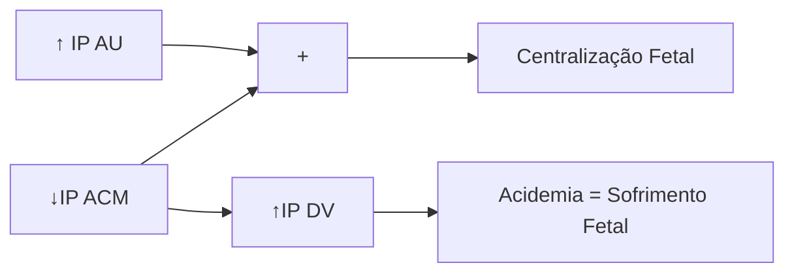
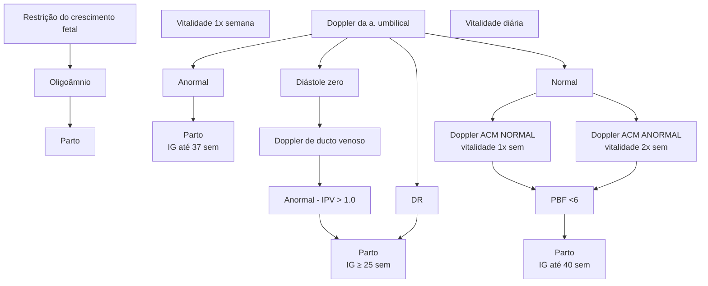

# SOFRIMENTO FETAL CRÔNICO + RCIU

## Perfil Biofísico Fetal (0 ou 2 pontos cada)

- Cardiotocografia: 2 acelerações transitórias
- Movimentação respiratória: >1 episódio de 30seg, em 30 minutos
- Movimentação corpórea: > 3 movimentos corporais ou de membros

- Tônus fetal: flexão/extensão de membros ou abertura/fechamento de mãos
- Líquido amniótico: 1 bolsão >2cm

### Hemodinâmica Fetal

- Artéria umbilical → resistência periférica
- Artéria Cerebral Média → órgãos-nobres
- Dueto Venoso → acidose fetal

| Artéria umbilical      | Normal | Anormal             | Diástole Zero     | Diástole Reversa   |
| ---------------------- | ------ | ------------------- | ----------------- | ------------------ |
| Artéria cerebral média | Normal | Centralização       |                   |                    |
| Ducto venoso           | Normal | ↑ PIV DV            | Onda 'a' ausente  | Onda 'a' reversa   |
| Veia umbilical         | Normal | Pulsação monofásica | Pulsação bifásica | Pulsação trifásica |

Figura 1 - Padrões dos sonogramas na dopplervelocimetria da artéria umbilical, artéria cerebral média, ducto venoso e veia umbilical.

## 1. SOFRIMENTO FETAL ANTEPARTO

### 1.1 VITALIDADE FETAL

- Tem por objetivo proteger o feto dos potenciais efeitos da hipoxemia (aguda ou crônica) no decorrer da gestação;

**Indicações:**

- Morbidades prévias:
  - Síndromes hipertensivas;
  - DM 1 e 2
  - LES
  - SAF
  - Tireoidopatias
  - Hemoglobinopatias
  - Cardiopatias
  - Pneumopatias
  - Neoplasias
- Morbidades gestacionais:
  - Síndromes hipertensivas;
  - DMG;
  - Restrição do crescimento fetal;
  - Malformações fetais;
  - Aloimunização;
  - Colestase gravídica;
  - Gestação prolongada;
  - Ruptura prematura de membranas ovulares.

**Como avaliar**

- Cardiotocografia;
- Perfil biofísico fetal – inclui cardiotocografia;

- Perfil hemodinâmico fetal; Em geral, versa sobre avaliação de fetos restritos, ou que estejam sofrendo insuficiência placentária por condições maternas.

OBS.: O Ministérios da Saúde, em 2022, orienta a paciente, através do Mobilograma, sobre a percepção da movimentação fetal. Idealmente, deve-se perceber 10 movimentos fetais em menos de 1 hora. Caso alcance valores menores, é necessária uma avaliação em ambiente de pronto-socorro com cardiotocografia e/ou perfil biofísico fetal.

### 1.2 CARDIOTOCOGRAFIA

- Feto ativo ou reativo:

**Quais são os fetos reativos?!**

- Feto reativo = pelo menos 2 acelerações transitórias, em 20 minutos;

**Parâmetros:**

- FC fetal (110 - 160 bpm);
- Variabilidade (6 - 25 bpm);
- Acelerações transitórias;
  - Para > 32 semanas: 15 bpm por 15s;
  - Para 28 – 32 semanas: 10 bpm por 10s.
- Ausência de desacelerações.

ATENÇÃO! Não se desespere! Nem tudo que parece bradicardia, realmente é! Lembre-se das arritmias fetais. Se tem uma cara bonita, variabilidade bonita, aceleração etc, mas a FCF basal é baixa, desconfie

OBSTETRÍCIA ALTO RISCO

## 1.3 PERFIL BIOFÍSICO FETAL:

**Parâmetros:**
- Cardiotocografia: Somente a partir de 28 semanas;
- Movimentos respiratórios;
- Movimentos fetais;
- Tônus fetal;
- Índice de líquido amniótico – ILA;

**Tabela 1** Escore do Perfil Biofísico Fetal

|                                                   | Parâmetro                | Critérios                                | Pontuação |                                                                     |
| ------------------------------------------------- | ------------------------ | ---------------------------------------- | --------- | ------------------------------------------------------------------- |
| A
L
T
E
R
A
Ç
Ã
O | Cardiotocografia         | 2 acelerações transitórias               | 2 ou 0    | ↑                                                                   |
|                                                   | Movimentos respiratórios | Pelo menos 1 de 30s, em 30 minutos       | 2 ou 0    | A
P
A
R
E
C
I
M
E
N
T
O |
|                                                   | Movimentos fetais        | 3 discretos ou 1 amplo, em 30 minutos    | 2 ou 0    |                                                                     |
|                                                   | Tônus fetal              | Rápida flexão/ extensão ou mãos fechadas | 2 ou 0    |                                                                     |
| ↓                                                 | ILA                      | Marcador crônico ILA > 5 ou ILA < 5      | 2 ou 0    |                                                                     |

OBS: Dá-se 2 pontos para cada um desses itens, ou 0 pontos nos casos de alterações de parâmetro:

**Líquido amniótico:**
- A partir de 20 semanas é composto por líquido pulmonar e urina fetal;
- Deglutição x urina:
  - Deglutição > urina = LA reduzido -> oligoâmnio
  - Urina > deglutição = LA aumentado -> polidrâmnio.

OBS.: Cálculo do ILA: avaliação de 4 quadrantes do abdome materno. Procede-se com traçado vertical, e mensuração da distância.

**Tabela 2** Classificação do volume de líquido amniótico por meio das técnicas de Maior Bolsão Vertical e Índice de Líquido Amniótico

| Maior bolsão | Índice de líquido amniótico | Classificação    |
| ------------ | --------------------------- | ---------------- |
| 0            | 0                           | Anidrâmnio       |
| < 1 cm       | < 3 cm                      | Oligoâmnio grave |
| < 2 cm       | < 5 cm                      | Oligoâmnio       |
| 2 – 3 cm     | 5 – 8 cm                    | Reduzido         |
| 3 – 8 cm     | 8 - 18 cm                   | Normal           |
| -            | 18 – 25 cm                  | Aumentado        |
| > 8 cm       | > 25 cm                     | Polidrâmnio      |

**Figura 1** Cálculo do índice de líquido amniótico pelo USG.

**Oligoâmnio:**
- Causas fetais: RCF, malformações congênitas (ex: doenças renais), gestação prolongada, pós-datismo
- Causas maternas: insuficiência uteroplacentária (síndromes hipertensivas, diabetes com vasculopatia, trombofilias, nefropatias, colagenoses, etc.), desidratação, infecção, medicações (betabloqueadores, IECA, diuréticos, etc.)
- Membranas ou placentárias: síndrome de transfusão feto-fetal, RPMO.

**Pontuação e risco:**
- **10/10 ou 8/10:** baixo risco de hipóxia ou asfixia fetal;
- **8/10 com oligoâmnio:** provável hipóxia fetal crônica;
- **6/10 com líquido normal:** possível asfixia fetal ou resultado falso positivo;
- **6/10 com oligoâmnio:** provável asfixia fetal;
- **4/10:** alta probabilidade de asfixia fetal;
- **2/10 ou 0/10:** asfixia fetal.

**Condutas:**
- **10/10 ou 8/10 com LA normal, ou 8/8 (sem CTG):** conduta conservadora
- **8/10 com oligoâmnio:** depende do oligoâmnio;
  - Oligoâmnio, em geral, traduz parto no termo (37 semanas);
  - Oligoâmnio grave (ILA < 3) = parto a partir de 34 semanas;
  - RCF + oligoâmnio = parto
  - Oligoâmnio antes de 34 semanas: lembrar do uso de corticoide;
  - *Expectante se: malformações fetais, etiologias transitórias (hidratar, compensar doença, etc.).
- **6/10 com líquido normal:** repetir em 6 – 24 horas. Se mantido, ou com piora, resolver a gestação.
- **6/10 com oligoâmnio:** interrupção na viabilidade;
- **4/10:** interrupção na viabilidade;
- **2/10 ou 0/10:** interrupção na viabilidade.

## 2. DOPPLERVELOCIMETRIA E RESTRIÇÃO DO CRESCIMENTO FETAL

### 2.1 PERFIL HEMODINÂMICO FETAL – DOPPLERVELOCIMETRIA
- Reservado aos casos de suspeita de insuficiência placentária, principalmente se restrição de crescimento fetal ou comorbidade materna associada;

SOFRIMENTO FETAL CRÔNICO + RCIU                                                                                                       3

• 4 leitos principais avaliados:
  • Artérias uterinas: circulação uteroplacentária (materna);
  • Artéria cerebral média: circulação fetal placentária;
  • Artéria umbilical: circulação fetal;
  • Ducto venoso: circulação fetal;

## 2.2 ARTÉRIA UTERINA:

• Aplicações:
  • Risco de pré-eclâmpsia;
  • Risco de RCF;
  • Diagnóstico de RCF x PIG

*Combinada com outros critérios

• Incisura protodiastólica – risco de pré-eclâmpsia (veja o segundo pico menor, ali é a incisura)
• Avaliação quantitativa → IP médio entre direita e esquerda
  • IP médio > percentil 95 para IG
• Avaliação qualitativa:
  • Incisura protodiastólica (cuidado!)

**Figura 2** Índices de resistência e pulsatilidade das artérias uterinas no primeiro e segundo trimestres de gestações normais.

• Observe a imagem abaixo:
  • Doppler de artéria uterina normal.

**Figura 3** Índices de resistência e pulsatilidade das artérias uterinas no primeiro e segundo trimestres de gestações normais.

## 2.3 ARTÉRIA UMBILICAL

**Figura 4** Ultrassonografia Doppler em Obstetrícia. Prontuário Web. Saúde e Variedades. 2020.

• Aplicações
  • Diagnóstico de RCF
  • Estratificação de gravidade da RCF
• Avaliação quantitativa → IP
  • IP > percentil 95 para IG = aumento da resistência
• Avaliação qualitativa → fluxo diastólico final:
  • Diástole zero;
  • Diástole reversa.
• Tabela de Doppler:

**Tabela 3** Índices de Dopller

| Idade gestacional (semanas) | Índices de Dopller
A Umb (PII) (p95)¹ | Índices de Dopller
ACM (PI) (p5)² | Índices de Dopller
RCP (PI) (p5)³ | Índices de Dopller
A Ut (PI) (p95)4 | Índices de Dopller
DV (IPV)5 |
| --------------------------- | ----------------------------------------- | ------------------------------------- | ------------------------------------- | --------------------------------------- | -------------------------------- |
| 20                          | 2,03                                      | 1,37                                  | 0,65                                  | 1,61                                    | >1.0                             |
| 21                          | 1,96                                      | 1,4                                   | 0,75                                  | 1,54                                    | >1.0                             |
| 22                          | 1,9                                       | 1,45                                  | 0,85                                  | 1,47                                    | >1.0                             |
| 23                          | 1,85                                      | 1,47                                  | 0,92                                  | 1,41                                    | >1.0                             |
| 24                          | 1,79                                      | 1,5                                   | 1                                     | 1,35                                    | >1.0                             |
| 25                          | 1,74                                      | 1,51                                  | 1,05                                  | 1,3                                     | >1.0                             |
| 26                          | 1,69                                      | 1,52                                  | 1,1                                   | 1,25                                    | >1.0                             |
| 27                          | 1,65                                      | 1,53                                  | 1,15                                  | 1,21                                    | >1.0                             |
| 29                          | 1,57                                      | 1,53                                  | 1,2                                   | 1,17                                    | >1.0                             |
| 28                          | 1,61                                      | 1,53                                  | 1,23                                  | 1,13                                    | >1.0                             |
| 30                          | 1,54                                      | 1,52                                  | 1,25                                  | 1,1                                     | >1.0                             |
| 31                          | 1,51                                      | 1,51                                  | 1,27                                  | 1,06                                    | >1.0                             |
| 32                          | 1,48                                      | 1,5                                   | 1,28                                  | 1,04                                    | >1.0                             |
| 33                          | 1,46                                      | 1,47                                  | 1,27                                  | 1,01                                    | >1.0                             |
| 34                          | 1,44                                      | 1,43                                  | 1,27                                  | 0,99                                    | >1.0                             |
| 35                          | 1,43                                      | 1,4                                   | 1,25                                  | 0,97                                    | >1.0                             |
| 36                          | 1,42                                      | 1,37                                  | 1,22                                  | 0,95                                    | >1.0                             |
| 37                          | 1,41                                      | 1,32                                  | 1,17                                  | 0,94                                    | >1.0                             |
| 38                          | 1,4                                       | 1,28                                  | 1,23                                  | 0,92                                    | >1.0                             |
| 39                          | 1,4                                       | 1,21                                  | 1,08                                  | 0,91                                    | >1.0                             |
| 40                          | 1,4                                       | 1,18                                  | 1                                     | 0,9                                     | >1.0                             |

1 Arduini e Rizzo, 1990 / Índice de pulsatilidade da artéria umbilical (anormal > p95)

2 Arduini e Rizzo, 1990 / Índice de pulsatilidade da artéria cerebral (anormal > p5)

3 Baschat, 2003 / Relação cérebro-placentário - PI ACM / PI A umb (anormal > p95)

5 Clínica Obstétrica HC - FMUSP / Ducto venoso - Índice de pulsatilidade venosa (anormal > 1,0)

P - percentil

• Observe as imagens abaixo:
• Padrão normal:

**Figura 5** Doppler ultrasound of the umbilical artery for fetal surveillance in singleton pregnancies. Dev Maulik, MD, PhD. UpToDate, 2022.

• Padrão alterado;

![Doppler ultrasound images showing normal and altered patterns]

**Figura 6** Doppler ultrasound of the umbilical artery for fetal surveillance in singleton pregnancies. Dev Maulik, MD, PhD. UpToDate, 2022.

## 2.4 ARTÉRIA CEREBRAL MÉDIA:

• Aplicações:
  • Diagnóstico de RCF;
  • Estratificação de gravidade da RCF;
  • Predição de anemia fetal (ex: aloimunização).
• Avaliação quantitativa -> IP
  • IP < percentil 5 para IG = vasodilatação cerebral
  • Relação cérebro-placentária (IP ACM/IP umbilical)
  • PVS-ACM *anemia) -> avaliado em MoM
• Tendência à priorização dos órgãos nobres - SNC, adrenais e coração - resulta em vasodilatação.

![Ultrasound image showing middle cerebral artery]

**Figura 7** Artéria cerebral média

• Observe a imagem:
  • Porção superior: normal (alta resistência);
  • Porção inferior: redução da resistência.

![Doppler waveform patterns showing normal and reduced resistance]

**Figura 8** Doppler ultrasound of the umbilical artery for fetal surveillance in singleton pregnancies.

## 2.5 DUCTO VENOSO:

• Aplicações:
  • Avaliação dos casos mais graves de RCF precoce;
  • Insuficiência cardíaca fetal (ex: hidropsia);
  • Rastreamento de aneuploidias e cardiopatias (1º trimestre).
• Avaliação quantitativa -> IPV:
  • IPV > percentil 95 (ou > 1,0) = aumento da resistência
• Avaliação qualitativa -> onda "a":
  • Onda "a" ausente;
  • Onda "a" reversa.
• Indicativo de acidose fetal – representa a sobrecarga do coração direito;
• O ducto venoso é um shunt que joga sangue oxigenado para a veia cava inferior.

![Diagram showing fetal circulation with labeled vessels and oxygen saturation levels]

**Figura 9** Circulação fetal.

SOFRIMENTO FETAL CRÔNICO + RCIU                                                    5

**Imagem abaixo:**

[Ultrasound images showing venous duct waveforms]

**Figura 10** Onda de ducto venoso normal

[Two ultrasound images labeled A and B showing Doppler waveforms with S, D, and a markers]

**Figura 11** Dopplervelocimetria de ducto venoso.

A. Fluxo normal B. Fluxo alterado (onda "a" reversa).

## 2.6 ADAPTAÇÃO HEMODINÂMICA

Centralização Fetal
- Priorização de órgãos nobres
- NÃO É sofrimento fetal

**Figura 12** Adaptação hemodinâmica

## 2.7 RESTRIÇÃO DO CRESCIMENTO FETAL (RCF)

• Causas:
  • Fetais: síndromes genéticas, defeitos do tubo neural, gastrosquise, infecções congênitas (TORCHS);
  • Placentários: placenta prévia, corioangioma, inserção velamentosa de cordão;
  • Maternos: síndromes hipertensivas, cardiopatias, anemia, doenças autoimunes, desnutrição, estresse, ansiedade, álcool, tabagismo, medicações.
• Quando suspeitar:
  • Altura uterina < p10 esperado para IG.
• A suspeita dá-se pela altura uterina e é confirmada com auxílio do USG;
• De acordo com algumas entidades:
  • OMS: < p3;
  • FEBRASGO: <p10;
  • ACOG: < p10.

• Ainda, é necessário diferenciar entre: pequeno constitucional e RCIU.
• **Diagnóstico - Ministério da Saúde:**

| RCF Precoce (<32 semanas)                        |   |
| ------------------------------------------------ | - |
| CA/PFE \<p3 ou Doppler de AUmb com diástole zero |   |
| OU                                               |   |
| CA/PFE \<plO + IP Aut > p95 ou IP da Aumb >p95   |   |

| RCF Tardia (≥32 semanas)                                                                                                   |   |
| -------------------------------------------------------------------------------------------------------------------------- | - |
| CA/PFE \<p3                                                                                                                |   |
| OU 2 das 3 características:                                                                                                |   |
| CA/PFE < plO
CA/PFE queda de 2 quartis na curva de crescimento
Relação cérebro-placentária \<p5 ou IP da Aumb >p95 |   |

• Pequeno para idade gestacional (PIG):
  • PFE entre p3 e p10 E doppler normal;
  • Segue sua curva de crescimento com tranquilidade;
  • Filho de pais pequenos;
  • Confirmação é do pediatra.

## 3. CONDUTA

### 3.1 MS 2022
• Confira na página seguinte a Tabela 4

### 3.2 FEBRASGO 2018
• Confira na página seguinte a Figura 13

### 3.3 USP – SP 2023:
• RCF (< p 10) – avaliar vitalidade 1x/semana
• **USG doppler AU e ACM normais:**
  • Sem doença materna – meta de 40 semanas;
  • Com doença materna – meta de 37 semanas.
• **USG doppler AUmb IP > p95**
  • Meta de 37 semanas.
• **USG doppler AUmb com diástole zero**
  • Internação hospitalar;
  • Vitalidade diárias com DV;
  • Meta de 34 semanas.
• **DV – avaliar IP DV:**
  • < 1.0: seguir
  • Entre 1.0 – 1.5: corticoide + parto;
  • > 1.5: parto imediato.
• **USG Doppler AUmb, com diástole reversa:**
  • A meta é viabilidade;
  • 25 semanas.

ATENÇÃO! Doppler ACM: não indica parto. Se acompanhados de AUmb alterada, o alvo se mantém 37 semanas.

ATENÇÃO! RCP (relação cérebro-placentária) apenas modificam frequência da vigilância (2x/semana, se normal ou diária, se alterados).

OBSTETRÍCIA ALTO RISCO

**Tabela 4 Classificação de Restrição do Crescimento Intrauterino**

| Classificação | Achados                                      | Vitalidade                          | Parto                    | Via        |
| ------------- | -------------------------------------------- | ----------------------------------- | ------------------------ | ---------- |
| PIG           | PFE p3-p10 com doppler normal                | 14 dias                             | 40 semanas               | Obstétrica |
| ESTÁGIO 1     | PFE < p3 ou p3-p10 com alterações uterinas   | 14 dias até 34s
7 dias após 34s | 38 semanas               | Obstétrica |
| ESTÁGIO 2     | IP AU >p95 ou
IP ACM < p5 ou
RCP < 1 | 7 dias (até 2-3x/semana)            | 37 semanas               | Obstétrica |
| ESTÁGIO 3     | AU DZ                                        | Diária                              | 34 semanas               | Cesárea    |
| ESTÁGIO 4     | AU DR ou
IP DV > p95                     | Diária                              | Viabilidade / 30 semanas | Cesárea    |
| ESTÁGIO 5     | Onda a reversa DV ou CTR alterada            | Diária                              | Viabilidade              | Cesárea    |

**Figura 13 Fluxograma de conduta diante de fetos com restrição de crescimento**

# REFERÊNCIAS

**Figura 1 Cálculo do índice de líquido amniótico pelo USG.**

https://www.prontuarioweb.net/notas-medicas/doppler-obstetricia/

**Figura 2 Índices de resistência e pulsatilidade das artérias uterinas no primeiro e segundo trimestres de gestações normais.**

Antonio Gadelha da Costa, Patricia Spara, Thiago de Oliveira Costa, William Ramos Tejo Neto. Radiologia Basileira, Vol. 43 no 3 – Maio/Jun of 2010.

**Figura 3 Índices de resistência e pulsatilidade das artérias uterinas no primeiro e segundo trimestres de gestações normais.**

Antonio Gadelha da Costa, Patricia Spara, Thiago de Oliveira Costa, William Ramos Tejo Neto. Radiologia Basileira, Vol. 43 no 3 – Maio/Jun of 2010.

**Figura 4 Ultrassonografia Doppler em Obstetrícia. Prontuário Web. Saúde e Variedades. 2020.**

https://drpixel.fcm.unicamp.br/conteudo/fundamentos-daultrassonografia-em-ginecologia-e-obstetricia

**Figura 7 Sofrimento fetal crônico + RCIU**

Disponível em: https://drpixel.fcm.unicamp.br/conteudo/fundamentos-da-ultrassonografia-em-ginecologia-e-obstetricia

**Figura 8 Doppler ultrasound of the umbilical artery for fetal surveillance in singleton pregnancies.**

Dev Maulik, MD, PhD. UpToDate, 2022.

**Figura 10 Onda de ducto venoso normal**

https://drpixel.fcm.unicamp.br/conteudo/fundamentos-da-ultrassonografia-em-ginecologia-e-obstetricia

**Figura 11 Dopplervelocimetria de ducto venoso. A. Fluxo normal B. Fluxo alterado (onda "a" reversa).**

Fetal growth restriction: Evaluation. Giancarlo Mari, MD, MBA. UpToDate, 2023.
