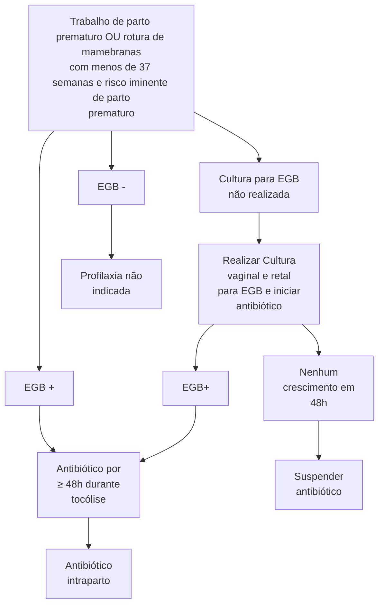

Prematuridade

# TRABALHO DE PARTO PREMATURO

**Definição:** Contrações uterinas regulares, que causem modificações do colo uterino antes de 37 semanas completas, mas após 20-22 semanas.

**Tocólise:**
- Objetivo: Para dar tempo do corticoide fazer efeito.
- Contraindicações: Óbito fetal, Malformação fetal incompatível com a vida, Alteração de vitalidade fetal, Quadros hipertensivos graves, Hemorragia materna com instabilidade, Corioamnionite, Doenças cardíacas graves, Maturidade fetal comprovada.

**Corticoterapia:**
- Objetivo: Maturação pulmonar.
- Quando fazer? Entre 24 e 34 semanas de gestação.

**Neuroproteção fetal:**
- Quando fazer? Até 31 semanas e 6 dias, trabalho de parto iminente.

**Profilaxia SBG:**
- Esquema: Ampicilina 2g EV + 1g 4/4h ou Penicilina Cristalina 5mi UI EV + 2,5mi UI 4/4h.

## 1. PREMATURIDADE

### 1.1 TERMOS
- Prematuridade → Nascimento antes de 37 semanas completas, mas após 20-22 semanas.

### 1.2 FATORES DE RISCO PARA PREMATURIDADE NO GERAL:
- Antecedente TPP;
- Condições socioeconômicas;
- Drogadição;
- Tabagismo;
- Etilismo;
- Depressão;
- Ansiedade;
- Infecções;
- Gemelaridade;
- Polidrâmnio;
- Incompetência Istmo Cervical (IIC);
- Colo curto;
- Malformação uterina;
- RPMO;
- Estresse físico ou mental.

## 2. TRABALHO DE PARTO PREMATURO

### 2.1 DIAGNÓSTICO
- Contrações uterinas regulares;

**Modificação do colo:**
- Esvaecimento, amolecimento e/ou dilatação.

### 2.2 PREDIÇÃO
- Dosagem de fibronectina → VPN de 90-95% tornando-se pouco provável parturição em até 15 dias;
- Medida do comprimento cervical (< 25mm) em pacientes com fatores de risco ou sintomáticas.

### 2.3 CONDUTA
- Anamnese;
- **Exame clínico completo:**
  - Buscar causas (quadro infeccioso, uso de drogas, estressores etc);
- Cardiotocografia;

- Ultrassonografia;
- **Laboratorial:**
  - Urina 1 + Urocultura;
  - Pesquisa SGB.

### 2.4 CONDUTA TERAPÊUTICA

**Corticoide**
- Objetivo:
  - Maturação pulmonar
  - Diminui risco de **hemorragia periventricular e enterocolite necrosante**.
- Quando fazer:
  - Indicada entre 24 e 34 semanas de gestação.
  - Efeito de 24h até 7 dias.
- Como fazer

| Dexametasona  | Betametasona  |
| ------------- | ------------- |
| 6mg           | 12mg          |
| 12/12h        | 24/24h        |
| 4 doses total | 2 doses total |

**Tocólise**
- Quando:
  - Membranas íntegras;
  - Até 4 a 5cm de dilatação;
  - Entre 24 e 34 semanas.
- Contraindicações: Óbito fetal; Malformação fetal incompatível com a vida; Alteração de vitalidade fetal; Quadros hipertensivos graves; Hemorragia materna com instabilidade; Corioamnionite; Doenças cardíacas graves; Maturidade fetal comprovada;
- Contraindicações Relativas: placenta prévia; colo com dilatação superior à 4 - 5 cm; rotura prematura de membranas ovulares;
- Objetivo: Para dar tempo do corticoide fazer efeito.

**Medicações**
- **Agonistas beta-adrenérgicos. Exemplo: Terbutalina IV**
  - **Efeitos colaterais:** Palpitação; Mal-estar; Tremores; Hiperglicemia; Hipocalemia; Taquiarritmias; Edema Agudo de Pulmão (EAP).
  - **Contraindicações:** suspeita de infecção, cardiopatias, hipertensas e diabéticas.
- **Bloqueadores de canais de cálcio. Exemplo:**

OBSTETRÍCIA ALTO RISCO

**Nifedipina VO.**
- **Efeitos colaterais:** Rubor; Cefaleia; Náuseas; Hipotensão.
- **Contraindicações:** Disfunção hepática; Hipotensão; Insuficiência cardíaca congestiva e disfunção ventricular esquerda;

> **OBS:** Cuidado em associar com sulfato de magnésio (risco de hipotensão grave e bloqueio neuromuscular).

- **Inibidores da prostaglandina sintetase** (Pouco utilizado → risco de fechamento do canal arterial). **Exemplo: Indometacina.**
  - **Efeitos colaterais:** Náusea; Vômito; Gastrite; DRGE; Oligodrâmnio; Fechamento prematuro do ducto arterioso.
  - **Contraindicação:** Acima de 32 semanas de gestação.
- **Antagonista específico do receptor de ocitocina** (Droga-sítio específica, porém de alto custo) **Exemplo: Atosiban IV.**
- **Contraindicações:** não há contraindicações específicas.

**Neuroproteção fetal:**
- Até 31 semanas e 6 dias;
- Indicação: Se alta probabilidade de parto em 24 horas;
- Sulfato de Magnésio → 4g EV + 1g EV 1h/1h; Se eletivo, iniciar 4 horas antes do parto, pelo menos;
- Contraindicado se paciente tiver miastenia gravis.

**Antibioticoterapia:**
- Exames: Coletar cultura vaginal + anal SGB (Estreptococo do Grupo B);
- Esquema: Ampicilina 2g EV + 1g 4/4h ou Penicilina Cristalina 5mi UI EV + 2,5mi UI 4/4h.

> Trabalho de parto prematuro OU rotura de mamebranas com menos de 37 semanas e risco iminente de parto prematuro

**Figura 1** Profilaxia SGB

Quando não for possível realizar a cultura, mantenha o antibiótico por pelo menos 72 horas até a inibição do trabalho de parto ou até o parto (tempo suficiente para erradicação EGB no trato genital).

## 2.5 QUANDO FAZER PROFILAXIA PARA SGB? (VIDE FLUXOGRAMA)
- Urocultura POSITIVA para SGB;
- Rastreio POSITIVO entre 35s e 37s;
- RN anterior com sepse de início precoce por SGB

**Gestantes com fatores de risco para infecção neonatal que não realizaram cultura:**
- < 37 SEMANAS;
- RPMO ≥ 18 horas;
- Temperatura ≥ 38ºC.

## 2.6 QUANDO NÃO REALIZAR A PROFILAXIA PARA GBS?
- Gestantes submetidas à cesariana eletiva (sem trabalho de parto ou RPMO);
- Parturientes com cultura negativa realizada há menos de 5 semanas (exceto de RN anterior com sepse neonatal por SGB).

## 2.7 CONDUTA APÓS INIBIÇÃO DO TPP
- Não recomendar repouso;
- Não fazer uso de tocolítico de manutenção;
- Progesterona 200mg via vaginal → controverso, porém possível realizar até 36 semanas;

**Dose de resgate de corticoide**
- Possível fazer 2 ciclos de corticóide na gravidez;
- Realizar resgate se: Novo TTP com menos de 34 semanas de idade gestacional + primeiro ciclo há mais de 7 - 14 dias.

## 2.8 INIBIÇÃO DO TPP SEM SUCESSO = ASSISTÊNCIA AO TRABALHO DE PARTO
- Cefálica fletida → sem restrições quanto ao peso para realizar parto vaginal;
- Vigilância bem-estar fetal;
- Evitar amniotomia;
- Não fazer EMLD (episiotomia médio lateral direita) de rotina;
- Fórcipe → ideal utilizar em bebês acima de **34 semanas**;
- Cesárea pode ser indicada, mas está relacionada com grandes dificuldades técnicas durante sua realização.
