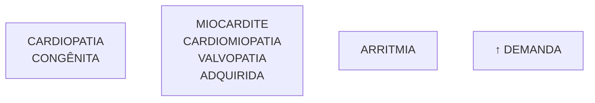
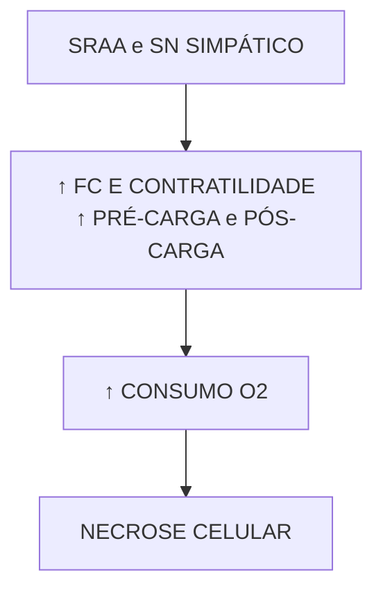
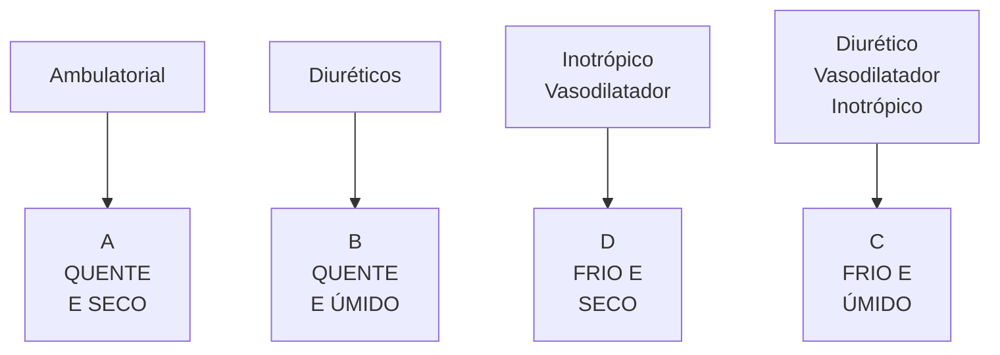
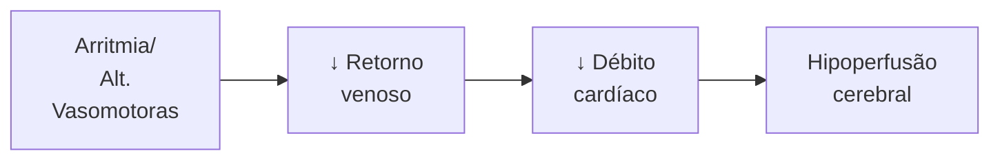
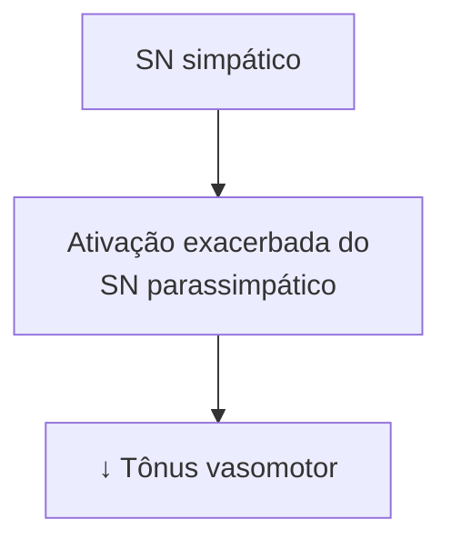

Cardiopatias Congênitas (PED)

# CARDIOPATIAS CONGÊNITAS

**Cardiopatias congênitas críticas: em geral, cursam com sintomas ao fechamento do canal arterial. Subtipos:**

• **Circulação pulmonar dependente do canal arterial:** clínica de hipoxemia/cianose refratário a oxigênio com sinais de baixo fluxo pulmonar no RX. Ex: tetralogia de Fallot, atresia pulmonar.

• **Circulação pulmonar e sistêmica em paralelo:** hipoxemia/cianose refratário a oxigênio com normo ou hiperfluxo pulmonar no RX. Ex: TGA.

• **Circulação sistêmica dependente do canal arterial:** baixo débito sistêmico. Ex: Coarctação da aorta crítica, Síndrome da hipoplasia do coração esquerdo.

• Tratamento inicial: prostaglandina + suporte + solicitar ecocardiograma.

**Cardiopatias congênitas não críticas: cursam com hiperfluxo pulmonar - PCA, CIV, CIA, DSAV. Podem evoluir para Síndrome de Eisenmenger (hipertensão pulmonar irreversível, levando a shunt D-E = cianose).**

## 1. CARDIOPATIAS CONGÊNITAS

### 1.1 CONSIDERAÇÕES INICIAIS:

• As cardiopatias congênitas (CC) compõem o grupo de defeitos congênitos mais comuns ao nascimento;

• 20% das CC estão associadas a alguma cromossomopatia → a mais importante é a síndrome de Down;

• Rastreio → ecografia morfológica no 1° e 2° trimestre;

• Junho/2023: incluído ecocardiografia fetal no protocolo de pré-natal para pesquisa de cardiopatia.

### 1.2 FATORES DE RISCO:

**Maternos;**

• Diabetes mellitus;

• Antecedentes;
  • História familiar;
  • Idade materna avançada;
  • Perdas fetais.

• Uso de álcool e tabaco;

• Medicações;
  1. Indometacina;
  2. AAS;
  3. Carbamazepina;
  4. Fenitoína;
  5. Ácido valpróico.

• Infecções;
  1. Virais e parasitárias.

• Artrite reumatoide e LES.

### 1.3 QUADRO CLÍNICO:

**Cianose:**

• Mecanismos possíveis: Obstrução à direita ou circulação em paralelo.

**Taquipneia:**

• Sobrecarga pulmonar (Shunt E-D); hiperfluxo pulmonar.

**Baixo débito sistêmico:**

• Obstrução do lado esquerdo.

**Sopro cardíaco:**

• De modo isolado, a probabilidade de ser uma cardiopatia grave é pequena.

### 1.4 CLASSIFICAÇÃO:

**Quanto à gravidade:**

• Críticas → se apresenta no período neonatal e requer intervenção cirúrgica em até 30 dias de vida do recém-nascido;

• Graves → requer intervenção cirúrgica ao longo do primeiro ano de vida do recém-nascido.

### 1.5 CONCEITOS INICIAIS IMPORTANTES:

**Em azul** – circulação venosa → circulação pulmonar;

**Em vermelho** – circulação arterial → circulação sistêmica;

• Principais estruturas:
  • Veia cava superior (VCS);
  • Veia cava inferior (VCI);
  • Átrio direito → recebe o sangue venoso, advindo da circulação sistêmica, através da VCS e da VCI
  • Valva tricúspide;
  • Ventrículo direito
  • Valva pulmonar;
  • Tronco pulmonar → artérias pulmonares;
  • Veias pulmonares;
  • Átrio esquerdo;
  • Valva mitral;
  • Ventrículo esquerdo;
  • Valva aórtica;
  • Artéria aorta.

• Fisicamente, o fluxo sempre se direciona passivamente da área de maior pressão para a área de menor pressão e/ou das áreas de maior resistência para as áreas de menor resistência;

• Nos primeiros dias de vida do recém-nascido, ocorre a transição da circulação fetal para a circulação pós-natal;

### 1.6 CIRCULAÇÃO FETAL:

• Baixa resistência da placenta, alta resistência pulmonar → pressão D > pressão E;

• Ocorre fluxo da direita para esquerda;

• Trocas gasosas no RN são feitas na placenta;

• Estruturas especiais: forame oval (comunica átrio direito e esquerdo) e canal arterial (comunica o tronco pulmonar e a artéria aorta).

**Caminho do sangue na circulação fetal:**

• Sangue oxigenado vem da placenta pela veia umbilical, vai para VCI e atinge o átrio direito, é o sangue mais oxigenado. Vai para o átrio esquerdo pelo forame oval que permite ir sangue oxigenado para VE e aorta.

• O sangue não oxigenado vai da VCS para AD, VD e tronco

pulmonar. Como pulmão com alta resistência o sangue vai para a aorta pelo Canal Arterial. A artéria umbilical volta o sangue não oxigenado para a placenta.

[Diagram showing fetal circulation with labeled parts: CANAL ARTERIAL, Tronco pulmonar, FORAME OVAL, Átrio direito, Átrio esquerdo, Veia cava inferior]

**Figura 1** Circulação na presença de PCA.

## 1.7 TRANSIÇÃO DA CIRCULAÇÃO FETAL:

**Ao nascimento:**
- O clampeamento do cordão e primeiras incursões respiratórias levam ao aumento da resistência vascular sistêmica e queda da resistência vascular pulmonar → fechamento do forame oval;
- Ainda, há aumento da PaO₂ e queda do nível das prostaglandinas → o sangue flui da aorta para o tronco pulmonar via canal arterial, levando ao hiperfluxo pulmonar

OBS.: O fechamento funcional (por vasoconstrição) ocorre com cerca de 10 – 15 horas de vida. É dado de modo permanente a partir da 2ª – 3ª semana de vida!

**Persistência do canal arterial (PCA):** Figura 1

**Recém-nascido pré-termo:**
- Camada média muscular incompetente;
- Insensibilidade do canal arterial ao O2;
- Resposta inflamatória (vasodilatadora) → pelas próprias complicações da prematuridade, como: sepse, síndrome do desconforto respiratório do recém-nascido e outros.
- No período pós-natal → pressão E > pressão D → o sangue flui da aorta para o tronco pulmonar via canal arterial, levando ao hiperfluxo pulmonar;
- Manifestação clássica → Sopro (2° EIC/infraclavicular E) contínuo ou em maquinaria;
- Descrição de pulso amplo pois vai fluxo da aorta para artéria pulmonar (distanciamento PAS/PAD);
- PCA aumenta o risco de: Hemorragia intraperiventricular; Displasia broncopulmonar; Enterocolite necrosante;
- O sopro pode ter predomínio sistólico e irradiar para o dorso.

## 1.8 TRATAMENTO (SOMENTE SE COMPROMETIMENTO HEMODINÂMICO);
- Inibidores da COX – ibuprofeno ou indometacina (enteral ou EV); Contraindicações → Mnemônico CHOPE;
  1. Hemorragia nas últimas 24 horas
  2. Oligúria ou aumento de creatinina/ureia;
  3. Plaquetas < 100.000/mm3;
  4. Enterocolite necrosante.

- Paracetamol: opção mais recente de tratamento;
  - Contraindicação: alteração das enzimas hepáticas.
- Fechamento percutâneo do canal: se falha medicamentosa ou contraindicação medicamentosa.

# 2. CARDIOPATIAS CONGÊNITAS GRAVES

## 2.1 COMUNICAÇÃO INTERVENTRICULAR (CIV);

[Diagram showing heart with labeled chambers: APP, VCS, PCA, AD, VA, VMfS, VT, VE, VD, VCS]

**Figura 2** Comunicação Interventricular e possíveis localizações do defeito

- É o principal exemplo de cardiopatia com presença de shunt E – D;
- Dá-se pela presença de um defeito no septo interventricular;
  - Assim, respeitando o mecanismo, o sangue se direciona do lado esquerdo (maior pressão) para o lado direito (menor pressão);
- Gera congestão pulmonar → principal sintoma é a taquipneia. Ocorre principalmente após a segunda semana de vida devido à diminuição da resistência vascular sistêmica pulmonar.
- CC mais comum
- 70% dos casos é perimembranosa (ocorre na área 2, na figura 2 acima);
- Quanto menor o orifício, maior o turbilhonamento = mais amplo o sopro;
  - Em orifícios muito grandes, a tendência é que ocorra o nivelamento das pressões em cada lado;
  - O igualamento das pressões cessa o processo de turbilhonamento do fluxo, responsável pela presença do sopro;
  - Sopro sistólico em platô na borda esternal esquerda baixa que irradia para esquerda e um pouco para lado direito.

## 2.2 COMUNICAÇÃO INTERATRIAL (CIA);

**Segue o mesmo raciocínio da CIV → ocorre pela presença de um defeito no septo interatrial;**
- Assim, respeitando o mecanismo, o sangue se direciona do lado esquerdo (maior pressão) para o lado direito (menor pressão);

**Ainda, há um achado característico no exame físico**
- Há desdobramento fixo e amplo da segunda bulha;
  - A sobrecarga de volume leva à um prolongamento do tempo de esvaziamento do ventrículo direito,

CARDIOPATIAS CONGÊNITAS                                                                                  3

com consequente atraso no fechamento da valva pulmonar. Isso ocorre de forma fixa (independe da respiração, diferente do que ocorre no desdobramento fisiológico).

• Sopro sistólico mais audível em foco pulmonar → pelo hiperfluxo sanguíneo (estenose relativada valva pulmonar).

**Figura 3.** Comunicação interatrial (CIA)

## 2.3 DEFEITO DO SEPTO AV TOTAL (DSAV);

**Figura 4.** Defeito do septo atrioventricular total

• É um defeito que acomete o septo atrioventricular → tem repercussões importantes!
  • CIA + CIV + Valva AV comum.
• Frequente associação com síndrome de Down;
• Pressões equilibradas nos átrios e nos ventrículos → sopro discreto ou ausente;
• ECG: no DSAV total pode ter hemibloqueio anterior esquerdo = bloqueio ântero-superior esquerdo (BDAS).
  • Desvio do eixo para esquerda + Onda S em D3 > Onda S em D2.

## 2.4 RADIOGRAFIAS E EXAMES COMPLEMENTARES NAS CARDIOPATIAS DE HIPERFLUXO PULMONAR (CIA, CIV, DSAV):

• Radiografia de tórax: aumento da trama vascular

pulmonar, pode ter cardiomegalia;

• ECG:
  • Inicialmente a sobrecarga é de câmaras esquerdas;
  • Onda P alargada e ondas R amplas nas derivações esquerdas.

**Figura 5.** Congestão pulmonar e cardiomegalia

## 2.5 SÍNDROME DE EISENMENGER: COMPLICAÇÃO DAS CARDIOPATIAS DE HIPERFLUXO PULMONAR NÃO CORRIGIDAS:

• Shunt E - D → Hiperfluxo pulmonar → hipertensão pulmonar → inversão do shunt (D - E) → cianose;
• Demonstra alto risco de morte súbita!
• Sobrecarga de câmaras direitas no eletrocardiograma.

## 2.6 TRATAMENTO:

• Transplante de coração e pulmão, combinadamente.

# 3. CARDIOPATIAS CONGÊNITAS CRÍTICAS

• As cardiopatias críticas são aquelas nas quais o recém-nascido necessita de intervenção cirúrgica em até 30 dias de vida:
  • Circulação pulmonar dependente do canal arterial;
  • Circulação pulmonar e sistêmica em paralelo;
  • Circulação sistêmica dependente do CA.

## 3.1 CIRCULAÇÃO SISTÊMICA DEPENDENTE DO CANAL ARTERIAL

Decorrem de obstrução à circulação sistêmica (lado esquerdo);

• Evoluem com baixo fluxo direcionado à artéria aorta → baixo débito sistêmico;
• Logo, a circulação torna-se dependente da persistência do canal arterial!!! O fechamento do canal é o marco para o início dos sintomas!
• Sinais e sintomas:
  1. Perfusão periférica ruim;
  2. Palidez cutânea;
  3. Redução da amplitude dos pulsos centrais e periféricos;
  4. Hipotensão arterial sistêmica.

**Síndrome do coração esquerdo hipoplásico:**

• Diferentes combinações de estenose/atresia aórtica + estenose/atresia mitral, levando à hipoplasia do ventrículo esquerdo.

**Figura 6** Síndrome do coração esquerdo hipoplásico

**Coarctação da aorta;**

• Presença de estreitamento da região do arco aórtico → redução do fluxo sanguíneo após a área coarctada.

**Figura 7** Coarctação da aorta

• Diferença na pressão arterial e nos pulsos dos membros superiores para os inferiores;
  1. Em geral, a coarctação ocorre após a via de saída das artérias subclávias (irrigam os membros superiores);
  2. Os membros superiores têm boa irrigação, enquanto que os membros inferiores têm má irrigação;
  3. Pode haver cianose diferencial nos casos mais graves.
• Associação frequente com síndrome de Turner.

## 3.2 CIRCULAÇÃO PULMONAR DEPENDENTE DO CANAL ARTERIAL;

• São cardiopatias que cursam com obstrução do lado direito. Dessa forma, o sangue não alcança, adequadamente, o tronco pulmonar; **Figura 8**
• De tal modo, o fluxo se torna dependente do canal arterial → o fechamento do canal tem como principal evolução o quadro de cianose!
• É refratária à administração de O2 → cianose cardíaca!
  • Radiografia de tórax → redução da trama vascular pulmonar (oligoemia);

**Atresia pulmonar com septo íntegro:**

• Situação destacada pela malformação da valva pulmonar = fluxo obstruído!
• O sangue não passa do VD para a artéria pulmonar, ele vai do AD para o AE pelo forame oval e então VE e aorta, e da aorta pelo canal arterial o sangue chegará aos pulmões
• Ao exame físico: Sopro sistólico em foco tricúspide → insuficiência tricúspide; B2 única.

**Figura 8** Em cardiopatias em que há obstrução crítica à direita, o fluxo pulmonar fica dependente do canal arterial.

**Tetralogia de Fallot:**

• Gerado pela malformação do septo aortopulmonar:
  1. Obstrução da saída do VD (estenose infundíbulo-valvar pulmonar);
  2. Dextroposição da aorta;
  3. CIV;
  4. Hipertrofia do VD.
• O grau da estenose dita a gravidade clínica;
• É a cardiopatia congênita cianótica mais comum em crianças.
• Radiografia de tórax; Redução da trama vascular pulmonar; Coração com "aspecto em bota" **Figura 9** → a hipertrofia de VD faz elevar a "ponta" do coração.

**Figura 9** Oligoemia e coração em bota (ou em tamanco holandês)"

• **Crises hipercianóticas ou crises de hipóxia: Figura 10**
  • Ocorrem nos primeiros 2 anos de vida;
  • O desencadeamento de algum quadro de hiperpneia, agitação, choro cursa com agravamento (ou surgimento) da cianose;
  • Decorre do espasmo da musculatura infundibular que piora a obstrução do VD;
  • Em geral, ocorre pela manhã ou após o choro

**Tratamento:**

1. Manter volemia;
2. Posição genupeitoral → gera aumento da resistência vascular sistêmica, aumentado o shunt E-D.
3. Oxigênio → melhora das trocas gasosas e estimular a vasodilatação pulmonar;

CARDIOPATIAS CONGÊNITAS                                                                                                5

4. Morfina – postula-se que tal medicamento tenha ação na redução do espasmo do infundíbulo;
5. Sedativos;
6. Betabloqueadores – para redução da frequência cardíaca, com concomitante aumento do tempo de enchimento ventricular.
7. Atuar na causa da agitação, estresse e choro do paciente.

**Figura 10** Cianose central

## 3.3 CIRCULAÇÃO PULMONAR E SISTÊMICA EM PARALELO;

**Figura 11** Transposição de grandes artérias

• Cardiopatia cianogênica que mais comumente se manifesta no período neonatal.
• Atenção: a Tetralogia de Fallot é mais frequente que a TGA, porém parte dos acometidos manifestam sintomas após o período neonatal.
• Manifesta-se pela presença de 2 sistemas de circulação sanguínea separados!
• VD: Aorta – circulação sistêmica – veias cavas – AD – VD;
• VE: tronco pulmonar – pulmão – veias pulmonares – AE – VE
• Só é compatível com a vida na presença de algum shunt entre as duas circulações
  1. Ocorre pelo forame oval (principal), e pelo canal arterial;
  2. Sangue oxigenado: pulmões – veias pulmonares – AE – forame oval – AD – VD – aorta; sangue venoso: veias cavas – AD – VD – aorta – canal arterial – tronco pulmonar.

• Exame físico: hiperfonese da 2ª bulha na área pulmonar, segunda bulha única.
• Atriosseptostomia com balão pode ser necessária, se o tratamento clínico for refratário (ampliação de FOP ou CIA restritiva).

**Radiografia:**
• Coração em "ovo deitado";
• Mediastino estreito;
• Trama vascular pulmonar normal ou aumentada.

**Figura 12** Coração em "ovo deitado".

## 3.4 CONDUTA FRENTE À SUSPEITA DE CC CRÍTICA (POR BAIXO DÉBITO SISTÊMICO OU POR CIANOSE):

• TRATAMENTO IMEDIATO:
  • Prostaglandina E1 em infusão contínua (0,01 mcg/kg/min até 0,9 mcg/kg/min); para manter canal arterial aberto;
  • Ventilação e oxigenação adequadas:
    O₂ – vasodilatador pulmonar: pode piorar o quadro nas cardiopatias com fluxo sistêmico dependente do CA. Alvo de saturação 85-95%;
  • Ecocardiograma com doppler: diagnóstico definitivo.

| **RN COM SUSPEITA
DE CC CRÍTICA**                          |                                                  |                                                           |
| -------------------------------------------------------------- | ------------------------------------------------ | --------------------------------------------------------- |
| **CIANOSE OU HIPOXEMIA
RESISTENTE A O2**                   |                                                  | **BAIXO DÉBITO SISTÊMICO**                                |
| Rx: ↓ trauma
vascular pulmonar                             | Rx: ↑ trauma
vascular pulmonar
ou normal | FLUXO SISTÊMICO
DEPENDENTE DO
CA: CoA, atresia Ao |
| FLUXO PULMONAR
DEPENDENTE DO CA:
Atresia pulmonar, 4TF |                                                  | CIRCULAÇÃO EM
PARALELO: TGA                           |

**Figura 13** Raciocínio frente à suspeita de cardiopatia congênita crítica.

## 4. FLUXOGRAMA GERAL

| **CRÍTICAS
CX ATÉ 30 DIAS DE VIDA**                           | **CIRC. PULMONAR
DEPENDENTE DO CA**
- ATRESIA PULMONAR
- TETRALOGIA DE FALLOT | **CIANOSE** |
| ----------------------------------------------------------------- | ----------------------------------------------------------------------------------------- | ----------- |
|                                                                   |                                                                                           |             |
|                                                                   | **CIRC. PULMONAR E
SISTÊMICA EM PARALELO**
- TRANSPOSIÇÃO DE
GRANDES ARTÉRIAS |             |
| **GRAVES
CX. PRIMEIRO ANO DE VIDA**
(CIA, CIV, DSAV, PCA) |                                                                                           |             |
|                                                                   | **CIRC. SISTÊMICA
DEPENDENTE DO CA**
- COARTAÇÃO AORTA
CRÍTICA ATRESIA        |             |
|                                                                   |                                                                                           |             |
| **TAQUIPNEIA**                                                    | **BAIXO DÉBITO
SISTÊMICO**                                                            |             |

**Figura 14** Resumo das principais cardiopatias congênitas.

CARDIOLOGIA

# REFERÊNCIAS

**Figura 5.** Congestão pulmonar e cardiomegalia

Dr Tomas Jurevicius, Radiopaedia.org, rID: 48089

**Figura 9.** oligoemia e coração em bota (ou em tamanco holandês)"

Dr Vincent Tatco, Radiopaedia.org, rID: 43059

**Figura 10.** Crises hipercianóticas ou crises de hipóxia

Case Reports 2016;2016:bcr2016216805.

**Figura 12.** Coração em "ovo deitado".

Dr Vincent Tatco, Radiopaedia.org, rID: 43062.

Hipertensão Arterial (PED)

# HAS

• **Aferir** a PA de rotina anualmente a partir de 3 anos de idade. Iniciar antes em situações de risco para hipertensão.
• **Classificação da PA:** normal se < p90; elevada se ≥ p90; hipertensão estágio 1 se ≥ p95; estágio 2 se ≥ p95 + 12.
• **Fluxograma de PA elevada:** mudança de estilo de vida e retornos a cada 6 meses → 2ª consulta:

aferir PA em MMSS e MMII → 3ª consulta: exames laboratoriais + MAPA.

**Indicações de tratamento medicamentoso:** falha do tratamento não medicamentoso; sintomas; hipertrofia de ventrículo esquerdo; estágio 2 sem fator modificável identificado; doença renal crônica ou diabetes mellitus.

## 1. HIPERTENSÃO ARTERIAL

### 1.1 QUANDO AFERIR A PRESSÃO ARTERIAL (PA) EM CRIANÇAS?

• Rotineiramente para ≥ 3 anos, pelo menos uma vez ao ano;
• Em todas as consultas se: Obesidade; Uso de medicamento que elevem a PA; Doença renal; Diabetes mellitus; Obstrução do arco aórtico.

### 1.2 INICIAR ANTES DOS 3 ANOS NOS SEGUINTES CASOS;

**Antecedente neonatal;**
• Nascimento < 32 semanas;
• Peso < 1500 g;
• Cateterismo umbilical;
• Internação em UTI neonatal.

**Cardiopatia congênita;**

**Doenças renais;**
• Infecção do trato urinário;
• Hematúria;
• Proteinúria;
• Doença renal;
• Malformação urológica;
• HF de doença renal crônica congênita.

**Transplantados;**
• De órgãos sólidos ou medula.

**Outros:**
• Neoplasia;
• Medicações que aumentam a PA;
• Doenças associadas a hipertensão arterial (HA);
• Aumento de PIC.

### 1.3 COMO AFERIR?

• Método preferencial: membro superior direito, com criança deitada ou sentada, por método auscultatório;
• Escolha do manguito;
  • Distância do acrômio e olécrano;
  • Ponto médio da distância;
  • Circunferência do braço no ponto médio – medida entre o acrômio e o olécrano.

ATENÇÃO: Para escolha do manguito adequado, a câmara interna deve medir 40% da circunferência do braço (CB) em altura/largura e o comprimento deve medir entre 80 – 100% da CB.

### 1.4 DEFINIÇÃO:

• Valores de PAS e/ou diastólica ≥ p95 para: sexo, idade e percentil da altura;
  • O peso não é considerado um parâmetro.
• Em caso de uma medida alterada, devem ser realizadas outras duas (totalizando três) e utilizada a média para o estadiamento.

**Tabela 1 Classificação da pressão arterial**

| Classificação         | 1 a 13 anos     | ≥ 13 anos                 |
| --------------------- | --------------- | ------------------------- |
| Normotenso            | < P90           | < 120 x 80 mmHg           |
| Pa elevada            | P90-P95         | 120 a 129 / <80 mmHg      |
| Hipertensão estágio 1 | ≥ P95           | 130 x 180 - 139 x 89 mmHg |
| Hipertensão estágio 2 | ≥ P95 + 12 mmHg | ≥ 140/90 mmHg             |

• Se paciente sintomático ou PA > 30 mmHg acima do p95 ou > 180 x 120 mmHg, no adolescente → **encaminhar para emergência**.

### 1.5 CAUSAS;

**Primária:** ≥ 6 anos com sobrepeso, obesidade ou HF de HA (pais ou avós)

**Secundária:** < 6 anos, aumento da PA diastólica (PAD). Alterações sugestivas:
• Coarctação de Aorta: diminuição de pulso, gradiente de PA entre MMSS e MMII (diferença ≥ 20mmg), sopro
• Distúrbios do sono: roncos, hipertrofia adenoamigdaliana, sonolência diurna
• Doença Renal Crônica: atraso no crescimento
• Síndromes genéticas (Turner, Williams): sinais dismórficos
• Estenose de AR: sopro abdominal

**Tabela 2 Principais causas de hipertensão arterial por faixa etária**

| Recém-nascidos          | Trombose/estenose da artéria renal
Malformações congênitas renais
Coartação de aorta
Displasia broncopulmonar |
| ----------------------- | ------------------------------------------------------------------------------------------------------------------------- |
| Lactentes - 6 anos      | Doenças do parênquima renal
Coartação da aorta Estenose de artéria renal                                              |
| > 6 anos e adolescentes | Estenose de artéria renal Doenças do parênquima renal
Hipertensão primária                                            |

## 1.6 Investigação;

**Tabela 3 Exames complementares no contexto de hipertensão arterial**

| EXAMES COMPLEMENTARES     | EXAMES COMPLEMENTARES                                                                                                                                                      |
| ------------------------- | -------------------------------------------------------------------------------------------------------------------------------------------------------------------------- |
| Todos os pacientes        | Urina tipo 1 e urocultura
Sangue: eletrólitos, ureia e creatinina, perfil lipídico, ácido úrico, hemograma                                                             |
| US renal                  | < 6 anos ou se urina 1 ou função renal alteradas                                                                                                                           |
| Obesos                    | Hemoglobina glicada, transaminase, perfil lipídico em jejum                                                                                                                |
| Conforme suspeita clínica | TSH, screening para drogas
Polissonografia
US com Doppler de artérias renais
Ecocardiograma com Doppler                                                        |
| MAPA                      | Confirmação diagnóstica e avaliação da eficácia terapêutica
Priorizar condições de alto risco: HA de estágio 2, comorbidades (DRC, doenças renais, DM, CoAo corrigida) |

## 1.7 Avaliação de órgãos-alvo;.

- Ecocardiograma com Doppler é o único com consenso;
  - Deve ser realizado anteriormente à implementação do tratamento farmacológico.
- Microalbuminúria → se alteração da função renal;
- Fundoscopia → na suspeita de encefalopatia hipertensiva ou hipertensão maligna.

## 1.8 TRATAMENTO;

- Inicial: mudanças de estilo de vida (MEV) - exercício físico e dieta DASH;
- Estimular o consumo de:
  - Frutas, legumes e verduras;
  - Grãos;
  - Peixes e aves;
  - Castanhas.
- Reduzir o consumo de:
  - Sódio;
  - Gorduras;
  - Carne vermelha;
  - Açúcar.
- Indicações de tratamento medicamentoso;
  - Falta de resposta ao tratamento não medicamentoso;
  - Hipertensão sintomática;
  - Hipertrofia de ventrículo esquerdo;
  - HAS estágio 2, sem fator modificável identificado;
  - HAS em paciente com DRC ou DM 1 ou 2.

**Medicações**

- Primeira escolha: IECA ou BRA, BCC ou tiazídico;
- 2ª linha: Beta Bloqueador, alfa-agonista, espironolactona, hidralazina.
- Manejo ideal das drogas → primeiramente aumentar a dose (até dose máxima tolerável) caso não haja controle;
  - Em caso de manutenção do estado descompensado, optar por associar drogas.
- Conduta em algumas comorbidades específicas:
  - Obesidade → preferir IECA, BRA;
  - Coarctação de Aorta → preferir betabloqueadores;
  - DRC → preferir IECA ou BRA;
  - Doença renovascular → preferir IECA, BRA, BCC ou vasodilatador;
- Alvo terapêutico: < p90 ou < 130/80 mmHg;
  - Se DRC, a meta é p50.

## 2. FLUXOGRAMAS DE ATENDIMENTO:

### 2.1 FLUXOGRAMA DO PACIENTE COM PA ELEVADA

**1° consulta:**
- MEV;
- Retorno em 6 meses.

**2° consulta: se mantiver com PA elevada, proceder com:**
- MEV;
- Medir PA em membros superiores e inferiores;
- Retorno em 6 meses.

**3° consulta: se mantiver com PA elevada, proceder com:**
- MEV;
- MAPA + investigação;
- Considerar interconsulta com especialista.

ATENÇÃO: O fluxograma acima é o mais solicitado pelas bancas de residência médica!

### 2.1 FLUXOGRAMA DO PACIENTE COM HAS ESTÁGIO 1;

**1° consulta:**
- MEV;
- Retorno em 1 - 2 semanas.

**2° consulta: se mantiver com HA estágio 1, proceder com:**
- MEV;
- Medir PA em membros superiores e inferiores;
- Retorno em 3 meses.

**3° consulta: se mantiver com HA estágio 1, proceder com:**
- MEV;
- MAPA + investigação;
- Iniciar terapia medicamentosa e considerar interconsulta com especialista.

OBS.: Após o início da medicação, a rotina de consulta deve ser feita a cada 4 - 6 semanas, e posteriormente, a cada 3 meses.

### 2.2 FLUXOGRAMA DO PACIENTE COM HAS ESTÁGIO 2;

**1° consulta:**
- MEV;
- Medir PA em membros superiores e inferiores;
- Retorno em 1 semana.

**2° consulta: se mantiver com HA estágio 2, proceder com:**
- MEV;
- MAPA + investigação;

CARDIO: HAS                                                                                                        3

• Iniciar terapia medicamentosa;
• Interconsulta com especialista em 1 semana.

OBS.: Após o início da medicação, a rotina de consulta deve ser feita a cada 4 - 6 semanas até controle, e posteriormente, a cada 3 meses.

**Tratamento no pronto atendimento:** se paciente sintomático ou PA > 30 mmHg acima do p95 ou > 180 x 120 mmHg, no adolescente → **encaminhar para**

**emergência.**

**Urgência hipertensiva:** aumento agudo sem lesão de órgão alvo. Tratamento via oral (clonidina, hidralazina).

**Emergência hipertensiva:** presença de lesão de órgão-alvo (encefalopatia hipertensiva, lesão renal aguda, ICC). Tratamento via endovenosa, reduzir no máximo 25% da PA em 8 horas (esmolol, nitroprussiato de sódio, hidralazina).

Miocardite, Síncope, Insuficiência Cardíaca (PED)

# MIOCARDITE, SÍNCOPE, IC

**Miocardite aguda:**
- Pródromos virais + clínica de insuficiência cardíaca ou choque cardiogênico
- Diagnóstico clínico: ECG, RX, troponinas, ecocardiograma
- Padrão-ouro: biópsia, RNM
- Tratamento: da IC/choque. Imunoglobulina nos casos graves/fulminante.

**Insuficiência cardíaca:**
- Tratamento agudo: diuréticos se congestão (úmido), suporte inotrópico se baixo débito (frio).

- Tratamento crônico: IECA, betabloqueadores, antagonista da aldosterona.

**Síncope:** solicitar ECG para todos. Diferenciar:
- Autonômica (mais comum, benigna): vasovagal, ortostática, reflexa (perda de fôlego do lactente).
- Cardiogênica (potencialmente fatal): sinais de alerta: síncope ao exercício ou em posição supina; ausência de pré-síncope; história familiar, outros sinais ou sintomas cardíacos.

## 1. MIOCARDITE AGUDA

### 1.1 Definições:
- Inflamação → inicialmente há degeneração/necrose miócitos → posterior formação de autoanticorpos (mimetismo molecular), perpetuando a inflamação do miocárdio;
- Sexo masculino.
- Bimodal: Menores de um ano e adolescentes.
- Causa mais comum: Viral (Parvovírus B19, Coxsackie e adenovírus).

### 1.2 QUADRO CLÍNICO:
- Pródromos virais (respiratórios ou gastrointestinais) nas últimas 2 semanas;
- Desconforto respiratório, palpitações, taquicardia desproporcional à febre, dor torácica.
- Possível evolução para insuficiência cardíaca, arritmias, choque cardiogênico, síndrome coronariana aguda e morte súbita.
- 20-30% dos casos tornam-se crônicos → miocardiopatia dilatada.

### 1.3 EXAMES COMPLEMENTARES:
- Troponinas: Normal não exclui diagnóstico. Sem correlação com gravidade.
- NT- pró-BNP → aumentado → relação com estiramento do ventrículo.
- Hemograma e sorologias.
- Radiografia de tórax: cardiomegalia, congestão aumento da trama vascular pulmonar. **Figura 1**
- ECG: taquiarritmias; QRS alargado; alterações ST e T.
- Ecocardiograma: ↓ função sistólica VE; maioria global, mas pode ser segmentar.
- RNM: Achado → realce tardio com gadolínio, geralmente subepicárdico.
- Biópsia endomiocárdica: padrão ouro. Exame invasivo não realizado na maioria dos casos. Vem sendo substituída pela RNM.

**Figura 1** Cardiomegalia e vasculatura pulmonar proeminente.

### 1.4 TRATAMENTO DE SUPORTE:
- Reposição volêmica cuidadosa.
- Tratamento da insuficiência cardíaca (IC).
- Antiarrítmicos, se arritmia.
- Anticoagulação se FE (fração de ejeção) < 30%.
- Imunoglobulinas: pouca evidência, pode ser utilizada em casos graves/ fulminantes.

## 2. INSUFICIÊNCIA CARDÍACA

### 2.1 DEFINIÇÕES:
- Síndrome clínica: Inadequado retorno venoso e/ou débito cardíaco para as necessidades metabólicas.
- Principais causas **Figura 2**
- Mecanismos compensatórios: **Figura 3**

• *New York Heart Association* modificada por Ross (NYHA)

**Figura 2** Causas de insuficiência cardíaca.

**Figura 3** Mecanismos compensatórios.

## 2.2 QUADRO CLÍNICO:
• Congestão pulmonar: taquipneia, dispneia, sibilância;
• Congestão sistêmica: hepatomegalia, edema
  (↑ peso), dor abdominal e náuseas;
• Baixo débito sistêmico: déficit de crescimento, fadiga
  e choque.

## 2.3 CLASSIFICAÇÃO:
• American Heart Association (AHA): Classificação
  prognóstica.

**Tabela 1** Classificação e interpretação.

| Classes | Interpretação                           |
| ------- | --------------------------------------- |
| A       | Risco de desenvolver IC                 |
| B       | Morfologia ou função anormal            |
| C       | Sintomas (passado ou presente)          |
| D       | Estágio final (inotrópicos/transplante) |

**Tabela 2** Classificação e interpretação.

| Classes | Lactentes                                                                            | Crianças                                  |
| ------- | ------------------------------------------------------------------------------------ | ----------------------------------------- |
| I       | Assintomáticos                                                                       | Assintomáticos                            |
| II      | Sudorese/
taquipneia leve às
mamadas                                         | Dispneia leve aos
exercícios          |
| III     | Sudorese/
taquipneia
acentuada às
mamadas
Redução do
crescimento | Dispneia
acentuada aos
exercícios |
| IV      | Em repouso                                                                           | Em repouso                                |

## 2.4 EXAMES COMPLEMENTARES:
• Diagnóstico é clínico
• RX de tórax: cardiomegalia; sinais de congestão
  pulmonar.
• Eletrocardiograma: arritmias; isquemia; sobrecarga.
• Ecocardiograma: sobrecarga, dilatação de câmaras e
  estimar FE.
• Específicos voltados para a causa.

**Figura 4** Ecocardiograma

The echocardiogram image shows labeled cardiac structures:
- RV (Right Ventricle)
- IVS (Interventricular Septum)
- LV (Left Ventricle)
- TVSL
- TVAL
- MVAL
- MVPL
- RA (Right Atrium)
- IAS
- LA (Left Atrium)
- LIPV
- RSPV

**Figura 5** Cardiomegalia e aumento da vasculatura pulmonar.

The chest X-ray (AP ERECT view) shows cardiomegaly and increased pulmonary vasculature.

## 2.5 TRATAMENTO IC AGUDA:

• Observar se paciente está ou não congesto e se tem ou não sinais de baixo débito (Tempo de Enchimento Capilar prolongado, hipotensão, pulsos finos).
  - Paciente com congestão = úmido.
  - Paciente sem congestão = seco.
  - Paciente com sinais de baixo débito = frio.
  - Paciente sem sinais de baixo débito = quente.

**Classificação para tratamento:**

• **A** → quente e seco: Tratamento ambulatorial.
• **B** → quente e úmido: Diuréticos.
• **C** → frio e úmido: diuréticos + vasodilatadores e inotrópicos.
• **D** → frio e seco: inotrópicos e vasodilatadores.

**Figura 6** Classificação da Insuficiência Cardíaca e tratamento específico.

• Tratamento crônico ambulatorial:
  • Medicamentos:
    - Bloqueio do SRAA → IECA/BRA e espironolactona;
    - Ação no SNS (simpático): betabloqueadores
    - Correção da hipervolemia → diuréticos
    - Tratamento da causa: antiarrítmicos, cirurgia.
  • Como fazer a progressão dos medicamentos:
    • Descompensação: Ciclos de diuréticos. Suporte inotrópico ou suporte ventilatório mecânico.
      - Classe funcional I: Todos → IECA.
      - Classe funcional II-III: Todos → IECA + betabloqueadores. Antagonistas da Aldosterona.

## 3. SÍNCOPE

### 3.1 DEFINIÇÕES:

• Perda súbita e transitória da consciência e do tônus postural devido à Hipoperfusão cerebral.

• Mais comum em adolescentes do sexo feminino.
• Causas: autonômica, cardiogênica ou não cardiogênica (neuropsiquiátrica, metabólica - hipoglicemia).

**Figura 7** Sequência de eventos do mecanismo de síncope.

### 3.2 SÍNCOPE AUTONÔMICA

• Causa: Perda repentina do tônus vasomotor (↑ parassimpático).
• Mecanismo: Ativação do SN simpático → resposta compensatória de ativação exacerbada do SN parassimpático → redução do tônus vasomotor → reduz perfusão cerebral.
• Duração curta (< 2 min), recuperação completa.
• Subtipos:

**Figura 8** Mecanismo da síncope autonômica.

Vasovagal → mais comum → dor, medo, ansiedade
↑ tônus vagal → atletas e adolescentes
Ortostática → resposta exagerada a desidratação leve
Reflexa → exemplo: perda de fôlego do lactente.

**Tabela 3** Tratamento da insuficiência cardíaca conforme classe funcional

|          | Classefuncional I        | Classefuncional II      | Classefuncional III | Classefuncional IV | Sintomasintratáveis |
| -------- | ------------------------ | ----------------------- | ------------------- | ------------------ | ------------------- |
| 4ª linha |                          | Antagonista Aldosterona |                     |                    |                     |
| 3ª linha |                          | Betabloqueador          |                     |                    |                     |
| 2ª linha | Inibidor de ECA          |                         |                     |                    |                     |
| 1ª linha | Ciclos de
diuréticos |                         |                     |                    |                     |

## 3.3 PERDA DO FÔLEGO DO LACTENTE

• Início entre 6-18 meses
• Causa: síncope reflexa desencadeada durante apneia pelo choro → não são crises epilépticas.
• Surgimento de cianose/ palidez → perda de consciência.

**Figura 9 Mecanismo da perda do fôlego do lactente .**

• Conduta:
  • Tranquilização e orientações aos pais (desencorajar evento, evitando ganho secundário para a criança).
  • Resolução em idade escolar
  • Não aumentam risco de PCR, convulsões ou ADNPM (atraso no desenvolvimento neuropsicomotor).

## 3.4 SÍNCOPE CARDIOGÊNICA

• Causas:
  • Lesões obstrutivas: estenose aórtica; cardiomiopatia hipertrófica.
  • Arritmias: TSV (taquicardia supraventricular); Síndrome de Wolf–Parkinson–White; Síndrome de QT longo.
  • Miocardite.
  • IAM (Infarto Agudo do Miocárdio).
  • Crise de cianose na 4TF (tetralogia de Fallot).
• Diagnóstico: ECG para todos os casos de síncope.
• Possíveis Diagnósticos:
  • Síndrome de wolf–parkinson–white: via acessória congênita (feixe de Kent). Pré-excitação ventricular: Intervalo PR curto (<0,12 segundos ou 3 mm); onda delta.

![Diagram showing ECG waveform with labeled "Onda Delta" and "PR < 0,12s"]

**Figura 10 Intervalo PR curto e onda delta.**

• Síndrome do QT longo: QT > 0,44 segundos.
• Classificação: adquirida (medicamentosa ou distúrbios eletrolíticos); congênita. Maior risco de degeneração em taquicardia ventricular polimórfica (torsades de pointes).
• Exames complementares, além do ECG, devem ser solicitados diante de sinais de alerta. Com isso, é realizada a investigação cardiológica adicional.

**Sinais de alerta:**

• Síncope ao exercício ou em posição supina; ausência de Pré–síncope história familiar de síncope, afogamento, morte súbita ou síndromes familiares de arritmia ventricular; outros sintomas cardíacos ou cirurgia/ doença cardíaca ou marcapasso; exame físico anormal.
• Exames complementares:
  • Tilt–test: pacientes com síncope recorrente → confirma vasovagal. Manobras vagais + posição em 70 graus. Sugestivo de síncope autonômica se sintomas ou ↓ PA ≥ 30%.

**Tratamento:**

• Cardiogênica: específica para a causa.
• Autonômica:
  • Evitar possíveis desencadeantes (físicos e emocionais); ingesta água e sal; exercício físico; suspender diuréticos e vasodilatadores; usar técnicas para prevenir acúmulo venoso (manter os joelhos levemente flexionados quando em pé por longo período, contração isométrica dos músculos das extremidades, elevação dos dedos dos pés, dobramento dos braços e cruzamento das pernas). Farmacológico se falha: Fludrocortisona; Alfa-agonistas (ex. midodrine).

CARDIO: MIOCARDITE, SÍNCOPE, IC

# REFERÊNCIAS

**Figura 1** Cardiomegalia e vasculatura pulmonar proeminente.

Frank Gaillard, Radiopaedia.org, rID: 29092

**Figura 4** Ecocardiograma

Dr David Carroll, Radiopaedia.org, rID: 62756

**Figura 5** Cardiomegalia e aumento da vasculatura pulmonar.

Dr Derek Smith, Radiopaedia.org, rID: 37004
