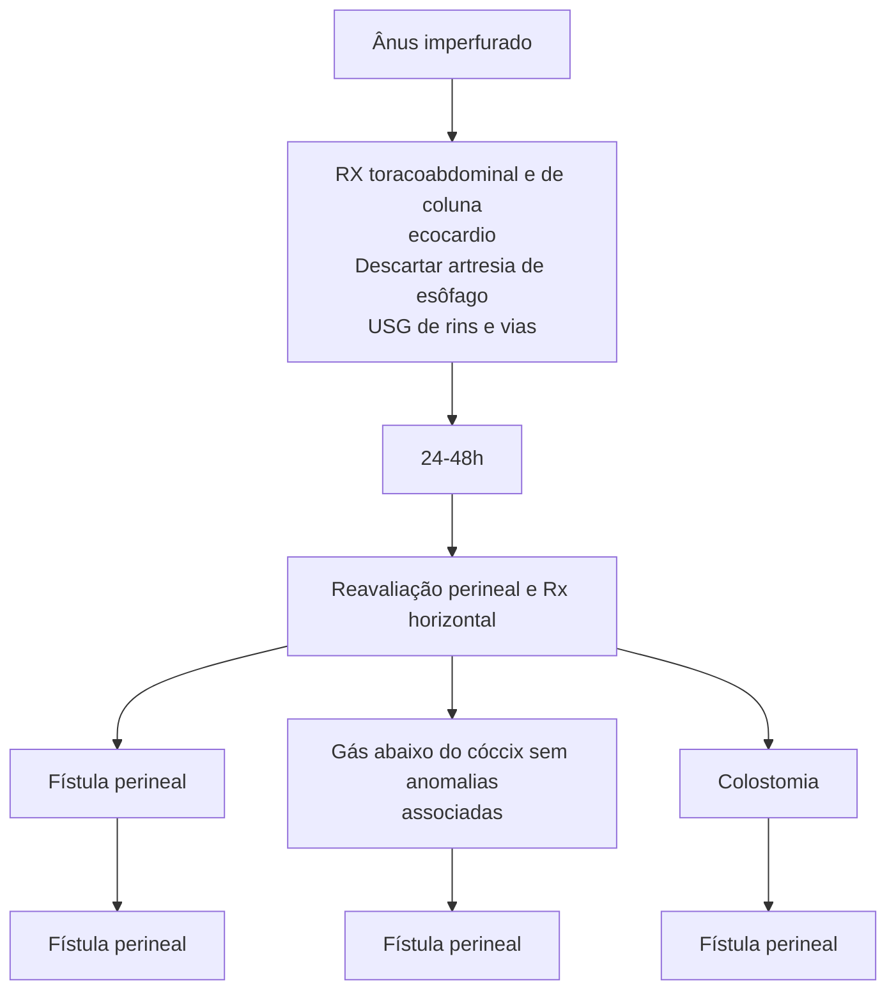
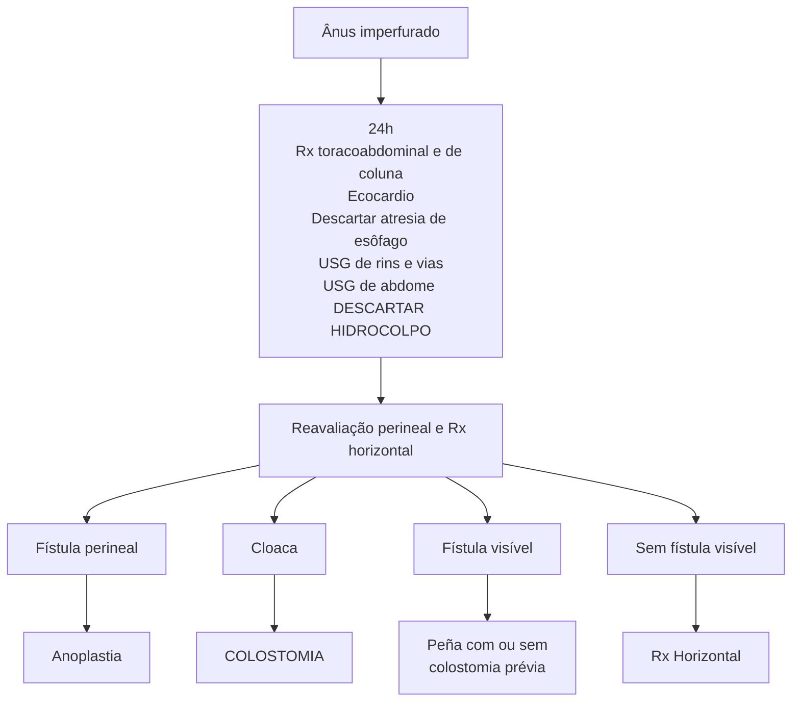
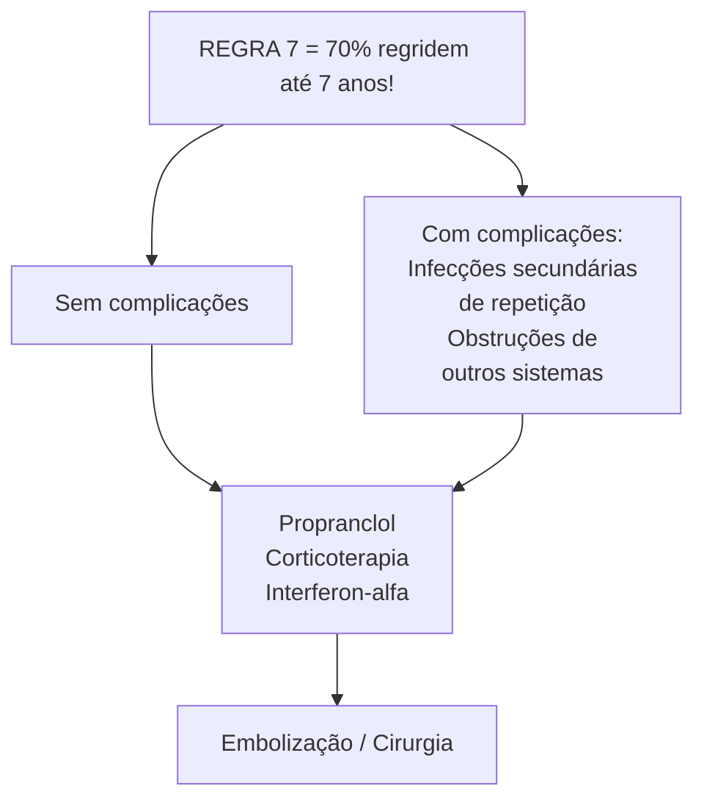

# O QUE UM PEDIATRA PRECISA SABER DE CIRURGIA PEDIÁTRICA? MALFORMAÇÕES CONGÊNITAS I

## Atresia de esôfago

• Incapacidade de retrair o prepúcio, impedindo higiene adequada da glande.
• Parafimose = urgência!
• Balanopostite = ATB e operar eletivo

### Vômitos biliosos no RN

**Duodeno:**
• **Pré natal:** Polidrâmnio + Bolha gástrica ausente
• **Pós natal:** Salivação aerada, cianose às mamadas, não passa SOG
• Rx Toracoabdominal (contrastado é melhor) + Investigar VACTERL
• Tipo C de Gross – FTE distal (mais comum!)
• Anastomose primária (esofagoplastia) é a melhor solução!
• Se LONG GAP: Alongamento ou substituição

**Jejuno Ileal:**
• Tripla bolha ou Mais
• Risco de intestino curto

**Má Rotação:**
• Volvulou? Mal estado geral
• Rx distensão/ obstrução + Contrastado com saca rolhas

• Tratamento: Cirurgia de Ladd

### Megacólon (Hirschsprung)

• **Atraso** na eliminação de mecônio
• Toque retal com **fezes explosivas**
• Enema opaco com **zona de transição**, diferente do constipado funcional
• Biópsia com **ausência de células ganglionares** e hipertrofia nervosa
• **Cirurgia de abaixamento** = Soave, Swenson, Duhamel ou Endoanal (De la torre ou Swenson)

### Anomalia anorretal

• **Meninos**: Uretral bulbar, uretral prostática, vesical
• **Meninas**: Vestibular e Cloaca
• Perineal e sem fístula são dos dois!
• **Manejo inicial:**
  • Aguardar 24h (VACTERL)
  • Nas cloacas – Drenar hidrocolpo!
  • Na dúvida? Colostomia
• **Manejo posterior:**
  • Perineal = anoplastia
  • Todos os outros = Peña (ARPSP)

## 1. ATRESIA DE ESÔFAGO

### 1.1. CASO CLÍNICO:

• nasceu um bebê no seu hospital e já com 24h de vida apresentava salivação bolhosa e cianose nas mamadas. Tentada passar sonda gástrica, sem sucesso. **Quais os próximos passos?**

### 1.2. EMBRIOLOGIA

• Esôfago e traqueia vêm da mesma estrutura embrionária e se separam durante o desenvolvimento do feto;
• Na falha dessa separação, temos a fístula traqueoesofágica, que pode ou não estar relacionada à atresia de esôfago.

**Figura 1** Embriologia do septo traqueoesofágico

[Diagram showing three stages of tracheoesophageal development with labels: Intestino anterior, Septo traqueoesofágico, Faringe, Traqueia, Divertículo respiratório, Brotos pulmonares, Esôfago]

### 1.3. CLASSIFICAÇÃO DE GROSS

• Abaixo **Figura 2**

[Diagram showing 5 types (A, B, C, D, E) of esophageal atresia with tracheoesophageal fistula variations, with corresponding percentages:]

| A    | B    | C     | D  | E    |
| ---- | ---- | ----- | -- | ---- |
| 7,5% | 1,1% | 86,6% | 1% | 3,8% |

**Figura 2** Classificação de Gross

## 1.4. DIAGNÓSTICO PRÉ-NATAL:
- Polidrâmnio;
- Estômago ausente ou pequeno;
- Coto esofágico superior dilatado (achado raro).

**Ultrasound image showing:** GA = 20 wks 2 days, displaying Polyhydramnios and Microgastria

**Figura 3** Polidrâmnio com microgastria revelando forte suspeita pré-natal de atresia de esôfago

## 1.5. DIAGNÓSTICO PÓS-NATAL:
- Salivação aerada;
- Cianose e regurgitação às mamadas;
- Impossibilidade de passar SNG.

**Clinical photograph showing:** Newborn with excessive salivation

**Figura 4** Salivação aerada

## 1.6. ANOMALIAS ASSOCIADAS (VACTERL):
- (V) Anomalias Vertebrais: 23% dos casos;
- (A) Ânus imperfurado: 10% dos casos;
- (C) Cardiopatias: 35% dos casos;
- (TE) Fístula TraqueoEsofágica;
- (R) Agenesia Renal: 10% dos casos;
- (L) Anomalias de extremidades (Limbs): 7% dos casos.

## 1.7. MEDIDAS TERAPÊUTICAS NAS PRIMEIRAS 24 HORAS DE VIDA:
- SNG sob aspiração contínua (sistema de Venturi);
- Prevenção de hipotermia;
- Considerar intubação orotraqueal.

## 1.8. MEDIDAS DIAGNÓSTICAS NAS PRIMEIRAS 24 HORAS DE VIDA:
- Rx toracoabdominal;
  - Sem contraste: sonda enrolada no coto esofágico;
  - Com contraste: coto esofágico preenchido por contraste (bom para avaliar extensão do coto com mais precisão);
  - Sem ar no aparelho digestivo: sugestivo de atresia sem fístula ou apenas com fístula traqueoesofágica proximal.

**Chest and abdominal X-ray image showing:** No air in the abdomen

**Figura 5** Rx sem ar abdominal

O QUE UM PEDIATRA PRECISA SABER DE CIRURGIA PEDIÁTRICA? - MALFORMAÇÕES CONGÊNITAS (PARTE 1)     3

**Figura 6** Tipos de atresia de esôfago que cursam com essa imagem (sem fístula distal)

![Diagram showing two types of esophageal atresia labeled A (7.5%) and B (1.1%), with illustrations of esophagus and trachea]

• Com ar no aparelho digestivo: sugestivo de fístula traqueoesofágica distal ou ausência de atresia.

**Figura 7** RX revelando ar para o abdome

![X-ray image showing air in the abdomen with an arrow pointing to relevant area]

**Figura 8** Tipos de atresia de esôgago que evoluem com esta imagem (com fístula distal)

![Diagram showing three types of esophageal atresia labeled B (1.1%), C (86.6%), and D (1%), with illustrations of esophagus and trachea]

• Ecocardiograma;
• USG de aparelho urinário;
• Rx de coluna lombossacra;
• Considerar broncoscopia.

**Figura 9** Sonda contrastada e exame contrastado revelando coto esofágico sem continuidade luminal até estômago

![Two X-ray images showing contrast studies of esophageal atresia with arrows pointing to relevant areas]

## 1.9. TRATAMENTO: CIRÚRGICO!

• **Esofagoplastia por anastomose primária**
• Primeira escolha de tratamento;
• Não pode ser feita quando os cotos esofágicos estão muito distantes ("long gap").

![Anatomical diagram showing surgical approach with labeled structures: Serrátil anterior, Trapézio, Escápula, Latíssimo do dorso]

**Figura 10** Imagens de técnicas operatórias de escolha para esofagoplastia primária

![Detailed anatomical illustration showing surgical technique for primary esophagoplasty with cross-sectional view of chest cavity]

• Má rotação intestinal;
• Enterocolite necrotizante.

## 2.3. ATRESIA DUODENAL

### • Conceitos
• Associada a outras malformações congênitas;
• Forte associação com síndrome de Down;
• Geralmente pós papilar.

**Figura 11** Imagens de técnicas operatórias de escolha para esofagoplastia primária

### • Alongamento/substituição/levantamento gástrico
• Feita quando os cotos esofágicos estão muito distantes ("long gap").

**Figura 12** Para casos Long Gap, técnicas de substituição esofágica: (acima) esofagocólonplastia e (abaixo) levantamento /tubulização gástrica

## 1.10. FAST TRACK
• Pré natal: Polidrâmnio + Bolha gástrica ausente
• Pós natal: Salivação aerada, cianose às mamadas, não passa SOG
• Rx Toracoabdominal + VACTERL
• Se LONG GAP: Alongamento ou substituição

# 2. VÔMITOS BILIOSOS NO RN

## 2.1. CASO CLÍNICO:
• RN 2 dia de vida, vômitos biliosos desde o nascimento, de difícil compensação hidroeletrolítica e com RX evidenciando dupla bolha. **O que esse RX nos diz?**

## 2.2. DIAGNÓSTICOS DIFERENCIAIS:
• Atresia duodenal;
• Atresia jejuno-ileal;

**Figura 13** Tipos de atresia duodenal

### • Clínica
• Abdome escavado
• Vômitos biliosos desde o nascimento;
• Não há distensão abdominal!

**Figura 14** Abdome escavado de menor com suspeita de atresia duodenal. Sitio de atresia duodenal (tipo I) com alças vazias à jusante e dilatação duodenal à montante.

O QUE UM PEDIATRA PRECISA SABER DE CIRURGIA PEDIÁTRICA? - MALFORMAÇÕES CONGÊNITAS (PARTE 1)     5

## Diagnóstico
- Rx de abdome com sinal da dupla bolha;
  - É possível ver a dupla bolha no USG pré-natal;
  - USG pré-natal com polidrâmnio.

**Figura 15** Dupla bolha ultrassonográfico e dupla bolha no RX

## Tratamento
- Duodenoduodenoanastomose à *Diamond-shaped*

**Figura 16** Duodenoduodenoanastomose a Diamond shaped

## 2.4. ATRESIA JEJUNO-ILEAL
### Conceitos
- Podem haver múltiplas áreas de atresia em um mesmo paciente;
- É rara a ocorrência de perfuração nesses casos.

**Figura 17** Atresia jejuno-ileal

**Figura 18** Tipos de atresia jejuno-ileal

### Clínica
- Vômitos biliosos desde o nascimento;
- Pode ou não haver distensão abdominal.

### Diagnóstico
- Imagem varia de acordo com a altura da atresia;
- Rx com sinal da "tripla" bolha;
- USG pré-natal com polidrâmnio.

**Figura 19** Sinal de obstrução intestinal de delgado, porém, não duodenal e sinal da tripla bolha

### Tratamento
- Ressecções → anastomoses/ostomias;
- Risco de síndrome do intestino curto!

**Figura 20** Cirurgia de ressecção do sítio atresico e confecção de entero-enteroanastomose

6<page_header>
CIRURGIA

## 2.5. MÁ ROTAÇÃO INTESTINAL

**Clínica**
- Maioria dos pacientes assintomáticos;
- Risco de volvo intestinal!
- Vômitos biliosos;
  - **Distensão abdominal.**

**Figura 21** Embriologia da rotação intestinal

**Diagnóstico**
- Rx abdominal sem contraste: cólon de um lado, delgado do outro;
- Rx abdominal com contraste: "saca rolha".

**Figura 22** Alças dilatadas apenas em um dos lados (esquerdo). Sinal de volvo intestinal mais conhecido por sinal do saca-rolha

**Tratamento**
- Procedimento de Ladd:
  - Secção das Bridas de Ladd
  - Liberação do ceco e do duodeno
  - Expor a artéria mesentérica superior;
  - Apendicectomia;
  - Cólon à esquerda e delgado a direita.

**Figura 23** Correção cirúrgica do volvo intestinal

## 2.6. FAST TRACK

- **Duodeno:**
  - Dupla Bolha
  - Síndrome de Down
  - Diamond Shape
- **Jejuno Ileal:**
  - Tripla bolha ou Mais
  - Risco de intestino curto
- **Má Rotação:**
  - Volvulou? Mal estado geral
  - Rx distensão/ obstrução + Contrastado com saca rolhas
  - Tratamento: Cirurgia de Ladd

# 3. DOENÇA DE HIRCHSPRUNG (MEGACÓLON CONGÊNITO)

## 3.1. CASO CLÍNICO:

- Criança de 1 ano chega no PS hipoativa, febril e com abdome distendido. Historia de evacuações mínimas e semi-líquidas em todas as fraldas. Mãe lembra que seu filho só evacuou 96h após o nascimento, após lavagens. **Chamo o cirurgião agora ou tenho algo a fazer antes?**

## 3.2. DEFINIÇÃO:

- Defeito da inervação da região sigmóide/colônica resultando em zona de transição e dilatação importante do cólon.

O QUE UM PEDIATRA PRECISA SABER DE CIRURGIA PEDIÁTRICA? - MALFORMAÇÕES CONGÊNITAS (PARTE 1)     7

**Figura 24** Imagem esquemática de zona de transição típica de megacólon congênito

## 3.3. SINAIS CLÍNICOS E HISTÓRIA TÍPICA:
- Atraso na eliminação de mecônio;
- Constipação grave;
- *Soiling* – perda fecal involuntária, com fezes líquidas em pequena quantidade e grande frequência;
- Fezes palpáveis no exame abdominal;
- Toque retal com eliminação de fezes explosivas;
- Enema opaco: presença de zona de transição!

## 3.4. DIAGNÓSTICO DEFINITIVO:
- Anatomia patológica com biópsia retal.

## 3.5. ENTEROCOLITE DO MEGACÓLON
- Paciente com suspeita/confirmação de megacólon congênito;
- Pela estase fecal, há predisposição à translocação bacteriana;
- Rapidamente evolui para sepse;
- Manejo:
  - Lavagens seriadas (instilação);
  - Jejum + SMB + antibióticos.

**Figura 25** Instilação retal com soro usada para lavagem copiosa de colon na suspeita de enterocolite do megacólon

## 3.6. TRATAMENTO: CIRURGIA DE ABAIXAMENTO!
- Correção de curvatura + tornar o meato uretral mais tópico possível + jato único e calibroso.

**Figura 26** Técnicas operatórias usadas no abaixamento de colon para correção de megacólon congênito

## 3.7. DIAGNÓSTICO DIFERENCIAL: CONSTIPAÇÃO FUNCIONAL
- Iniciada com a introdução alimentar;
- Varia com a alimentação;
- Enema opaco pode evidenciar megarreto;
- Melhora com laxativos e dieta.

## 3.8. FAST TRACK
- **Atraso na eliminação de mecônio**
- Toque retal com **fezes explosivas**
- Enema opaco com **zona de transição**, diferente do constipado funcional
- Biópsia com **ausência de células ganglionares** e hipertrofia nervosa
- **Cirurgia de abaixamento** = Soave, Swenson, Duhamel ou Endoanal (De la torre ou Swenson)

# 4. ANOMALIA ANORRETAL

## 4.1. CASO CLÍNICO:
- Acaba de nascer um menino que elimina urina muito escurecida e tem o bumbum muito plano...
- **O que seria essa anomalia?**
- **E essa urina muito escura?**

## 4.2. EMBRIOLOGIA:

**Figura 27** Embriologia do trato digestório final

## 4.3. ANOMALIAS ASSOCIADAS (VACTERL):
- (V) Vertebrais;
- (A) Anorretal;
- (C) Cardíaca;

CIRURGIA

• (TE) TraqueoEsofágica;
• (R) Renal;
• (L) Membros (Limbs)s.

![Esquema ilustrativo do mnemônico VACTERL mostrando um bebê com indicações das áreas afetadas: TE (traqueoesofágica), C (cardíaca), R (renal), A (anal), e L (membros)]

**Figura 28** Esquema ilustrativo do mnemônico VACTERL

**• Os meninos podem ter…**

![Diagrama mostrando cinco tipos de anomalias anorretais em meninos: Fístula Perineal, Fístula Reto-Uretral Bulbar, Fístula Reto-Uret Prostática, Fístula Reto-Vesical, e Ânus Imperfurado sem Fístula]

**Figura 29** Tipos de anomalias anorretais (AAR) possíveis nos meninos

**• As meninas podem ter…**

![Diagrama mostrando quatro tipos de anomalias anorretais em meninas: Fístula Perineal, Fístula Reto-Vestibu, Ânus Imperfurado sem Fístula, e Cloaca]

**Figura 30** Tipos de anomalias anorretais (AAR) possíveis nas meninas

## 4.4. DIAGNÓSTICO: EXAME CLÍNICO + IMAGEM

![Duas imagens clínicas mostrando fístula retovestibular - uma imagem endoscópica mostrando vagina e fístula, e uma imagem externa do períneo]

**Figura 31** Fístula retovestibular e AAR sem fístula

![Quatro imagens radiológicas mostrando diferentes tipos de anomalias anorretais]

**Figura 32** Tipos de anomalias anorretais (AAR) possíveis nos meninos - retouretrais

## 4.5. MANEJO: MENINO

**Figura 33** Algoritmo para manejo da AAR masculina

## 4.6. MANEJO: MENINAS

**Figura 34** Algoritmo para manejo da AAR feminina

## 4.7. ANORRETOPLASTIA SAGITAL POSTERIOR (PEÑA)

![Quatro imagens cirúrgicas mostrando diferentes etapas da anorretoplastia sagital posterior]

**Figura 35** ARPSP (anorretoplastia sagital posterior à Peña)

O QUE UM PEDIATRA PRECISA SABER DE CIRURGIA PEDIÁTRICA? - MALFORMAÇÕES CONGÊNITAS (PARTE 1)     9

## 4.8. COMPLICAÇÕES:
• Incontinência fecal;
• Incontinência urinária;
• Constipação crônica;
• Estenose anal;
• Prolapso retal.

## 4.9. FAST TRACK:
• **Meninos**: Uretral bulbar, uretral prostática, vesical
• **Meninas**: Vestibular e Cloaca

• Perineal e sem fístula **são dos dois**!
• **Manejo inicial**:
  • **Aguardar 24h** (VACTERL)
  • **Nas cloacas** - Drenar hidrocolpo!
  • **Na dúvida**? Colostomia
• **Manejo posterior**:
  • **Perineal** = anoplastia
  • **Todos os outros** = Peña (ARPSP)

CIRURGIA

# REFERÊNCIAS

**Figura 3 Polidrâmnio com microgastria revelando forte suspeita pré-natal de atresia de esôfago**

http://www.fetalultrasound.com/online/text/8-011.htm

**Figura 4 Salivação aerada**

http://dynamic.psu.ac.th/kidsurgery.psu.ac.th/Pediatric%20surgery/KID/Atlas/ATA.HTML

**Figura 5 Rx sem ar abdominal**

https://drpixel.fcm.unicamp.br/conteudo/atresia-de-esofago-em-recem-nascido-diagnostico-radiologico

**Figura 7 RX revelando ar para o abdome**

https://drpixel.fcm.unicamp.br/conteudo/atresia-de-esofago-em-recem-nascido-diagnostico-radiologico

**Figura 9 Sonda contrastada e exame contrastado revelando coto esofágico sem continuidade luminal até estômago**

https://drpixel.fcm.unicamp.br/conteudo/atresia-de-esofago-em-recem-nascido-diagnostico-radiologico

**Figura 11 Imagens de técnicas operatórias de escolha para esofagoplastia primária**

Esophageal Replacement Surgery in Children Chapter First Online: 28 December 2016 pp 277-299

**Figura 14 Abdome escavado de menor com suspeita de atresia duodenal. Sitio de atresia duodenal (tipo I) com alças vazias à jusante e dilatação duodenal à montante.**

S. Sabbatini et al. Intestinal atresia and necrotizing enterocolitis: Embryology and anatomy, Seminars in Pediatric Surgery, Volume 31, Issue 6, 2022

**Figura 15 Dupla bolha ultrassonográfico e dupla bolha no RX**

https://www.fetalmed.net/atresia-duodenal/

Kirby A, Duodenal atresia. Case study, Radiopaedia.org (Acesso em 27 Jun 2024) https://doi.org/10.53347/rID-93141

**Figura 17 Tipos de atresia jejuno-ileal**

Louw and Barnard (1955) illustrated classification of jejunal atresia

**Figura 18 Tipos de atresia jejuno-ileal**

Louw and Barnard (1955) illustrated classification of jejunal atresia

**Figura 19 Sinal de obstrução intestinal de delgado, porém, não duodenal e sinal da tripla bolha**

Figueiredo et al, ATRESIA DO TRATO GASTROINTESTINAL: AVALIAÇÃO POR METODOS DE IMAGEM. Radiol Bras 2005

**Figura 20 Cirurgia de ressecção do sitio atresico e confecção de entero-enteroanastomose**

https://www.pedsurglibrary.com/apsa/view/Pediatric-Surgery-NaT/829039/all/Jejunoileal_and_Colonic_Atresia

**Figura 22 Alças dilatadas apenas em um dos lados (esquerdo). Sinal de volvo intestinal mais conhecido por sinal do saca-rolha**

https://www.fetalmed.net/atresia-duodenal/

**Figura 25 Instilação retal com soro usada para lavagem copiosa de colon na suspeita de enterocolite do megacólon**

https://radiopaedia.org/cases/meckel-diverticulum-4

**Figura 31 Fistula retovestibular e AAR sem fistula**

Kawahara, insu et al. "Importance and difculty of correctly diagnosing covered cloacalexstrophy for adequate reconstruction: A case report." (2015)

**Figura 32 Tipos de anomalias anorretais (AAR) possíveis nos meninos - retouretrais**

Westgarth-Taylor Christopher, Westgarth-Taylor Tracy, Wood Richard, Levitt Marc. Imaging in anorectal malformations: What does the surgeon need to know?. S. Afr. J. radiol.. 2015

**Figura 35 ARPSP (anorretoplastia sagital posterior à Peña)**

Bayoumi, M.M.M., Allam, A.M. & AbouZeid, A.A. Role of sagittal anorectoplasty in treating constipation in patients with recto-perineal fistula. Ann Pediatr Surg 16,7 (2020)

# O QUE UM PEDIATRA PRECISA SABER DE CIRURGIA PEDIÁTRICA? MALFORMAÇÕES CONGÊNITAS II

## Hérnia diafragmática congênita

- **Bochdalek** – posterolateral esquerda (85%)
- **Suporte ventilatório e hemodinâmico**:
  - IOT
  - SOG
  - ECMO
  - DVA
- Índice pulmão–cabeça < 1,0 = **PLUG**
- **Hipoplasia pulmonar é o mais letal!**
- **Cirurgia só após estabilidade**
- **Se possível, correção sem tela.**

### Malformações broncopulmonares

- **TIPOS DE MALF.BRONCOPULMONARES:**
  - CPAM(MAC) – mais comum (A)
  - Sequestro (B)
  - Cisto Broncogênico (C)
  - Enfisema Lobar Congênito (D)
- **TC 4 – 12 semanas de vida (assintomáticos suspeitados em RX/clínica);**
- **Lobectomia resolve todos – 6 meses.**

### Cisto tireoglosso

- **+ comum (linha média)** do pescoço na infância
- Diagnóstico é clínico **(sinal de Sistrunk)** – USG para diagnósticos diferenciais
- Cirurgia! **(Sistrunk)**

## Hemangioma X Linfangioma

|                  | Hemangioma                                                   | Linfangioma                             |
| ---------------- | ------------------------------------------------------------ | --------------------------------------- |
| **Constituição** | Vasos sanguíneos (Vermelho)                                  | Vasos sanguíneos e linfáticos (Azulado) |
| **Sítio comum**  | Variável                                                     | Cabeça e pescoço                        |
| **Distribuição** | Únicas                                                       | Múltiplas                               |
| **Diagnóstico**  | USG / TC / RNM                                               | USG / TC / RNM                          |
| **Tratamento**   | Propranolol, Corticóide, Interferon, Embolização ou Cirurgia | Bleomicina, OK-42 ou Cirurgia           |

## Fístula dos arcos branquiais

- Tumores congênitos **laterais** no pescoço - 1°, 2°, 3° ou 4° arcos **(2° = 95% casos)**
- Diagnóstico é clínico – **USG** para diagnósticos diferenciais
- **Tratamento das infecções** = clínico
- **Tratamento cirúrgico** = definitivo

----

# 1. HÉRNIA DIAFRAGMÁTICA CONGÊNITA

## 1.1. CASO CLÍNICO:

- Nasceu um bebê no seu hospital em insuficiência respiratória sendo possível auscultarmos algo parecido com ruído abdominal no tórax! Estranho que ele tem o abdome escavado...
- **Será que ele já é uma emergência cirúrgica?**

## 1.2. DEFINIÇÃO:

- Malformação final do diafragma fetal que pode levar a herniação do conteúdo abdominal ao tórax;
- 4-8% de todas as anomalias congênitas – 1:4000 nasc. vivos:

## 1.3. TIPOS

- Parede abdominal;
- Mesentério esofagiano;
- Pregas pleuroperitoneais;
- Septo transverso.

**Figura 1** Tipo de hérnia diafragmática congênita (HDC) mais prevalentes.

- **Defeito Bochdalek:** posterolateral esquerdo;
- **Defeito Morgani:** anterior

## 1.4. DIAGNÓSTICO E TRATAMENTO PRÉ-NATAL:

CIRURGIA

## 1.5. QUAL O PROBLEMA DA HÉRNIA DIAFRAGMÁTICA CONGÊNITA?

• Alta pressão intratorácica na formação → malformação vascular da árvore respiratória → hipoplasia pulmonar.

[Diagram showing fetal positioning and lung development with labels: Brônquio direito, Pulmão esquerdo, Pulmão direito, Pequeno intestino se desloca para cavidade torácica, Diafragma, Brônquio esquerdo]

**Figura 4** Alças intestinais em hemitórax esquerdo típicas de HDC de Bochdalek.

## 1.6. MANEJO INICIAL:

**Suporte ventilatório:**
• IOT é quase sempre necessária;
• VPP por máscara e VNI jogam ar no trato digestório, aumentando a insuflação intestinal e elevando ainda mais a pressão intratorácica.
• Considerar necessidade de ECMO.

**Suporte hemodinâmico:**
• É muito comum a associação com hipertensão pulmonar.

**Sondagem gástrica:**
• Melhor momento para cirurgia?

## 1.7. CIRURGIA:
• Só deve ser realizada após a estabilização do paciente;
• Se possível, preferir correção sem tela;
• Pode ser feita por técnica aberta ou videolaparoscópica.

## 1.8. FAST TRACK
• Suporte ventilatório e hemodinâmico:
  • IOT
  • SOG
  • ECMO
  • DVA
• Índice pulmão-cabeça < 1,0 = **PLUG**
• **Hipoplasia pulmonar** é o mais letal!
• **Cirurgia só após estabilidade**
• Se possível, correção **sem tela**.

# 2. MALFORMAÇÕES BRONCOPULMONARES

## 2.1. CASO CLÍNICO:
• "Meu filho tem 6 meses e tem muita pneumonia, doutora! Já internou 4x e, da última vez, o médico falou que pareciam cachos de uva no pulmão!"

**Figura 2** Pocedimento de inserção fetal de plug.

**Índice pulmão-cabeça (IPC)**
• Diâmetro do pulmão/diâmetro da cabeça
• Definidor de prognóstico no USG antenatal
  • IPC > 1,35 → 100% de sobrevida;
  • IPC < 0,6 → 100% de letalidade.
  • IPC < 1 (de risco): indicação de plug traqueal:
  • Balão no interior da traquéia, impedindo saída de líquido pulmonar e reduzindo a hipoplasia pulmonar.

**Figura 3** Intervenção fetal para HDC - Plug

O QUE UM PEDIATRA PRECISA SABER DE CIRURGIA PEDIÁTRICA? MALFORMAÇÕES CONGÊNITAS (PARTE 2)                3

• **Será uma emergência cirúrgica? O que devemos investigar?**

## 2.2. PRINCIPAIS MALFORMAÇÕES BRONCOPULMONARES:
• Malformação adenomatóide cística;
• Cisto broncogênico;
• Sequestro pulmonar;
• Enfisema lobar congênito.

## 2.3. MALFORMAÇÃO ADENOMATÓIDE CÍSTICA
• **Normalmente é unilateral** oriunda de uma anomalia do suprimento sangüíneo via aorta;
• Massa torácica cheia de líquido, provocando desvio mediastinal e compressão pulmonar. Se comunicam com as vias aéreas, então o ar acaba substituindo o líquido (bolhas);
• Diagnóstico por RX, USG ou TC **(definitivo histopatológico)**;

## 2.4. SEQUESTRO PULMONAR
• O, 5 - 5% dos casos de malformação pulmonar;
• Massa de parênquima pulmonar não funcionante (perfundida, não ventilada);
• **Intralobar** = COM envoltório pleural próprio (75%)
• **Extralobar** = SEM envoltório pleural próprio (25%)

![Figura 5 Desenho esquemático do sequestro lobar - Diagram showing lungs with labeled regions: Intralobar, Extralobar, and Extralobar Extratorácica]

**Figura 5 Desenho esquemático do sequestro lobar**

## 2.5. CISTO BRONCOGÊNICO
• Massa **para-mediastinal** que pode aumentar e causar compressão local (5-10% na faixa pediátrica);
• Podem ser assintomáticos ("incidentalomas"), resultar em obstrução brônquica, levando a insuf. respiratória ou acarretam infecções intracísticas;
• No RX e TC = **estrutura cística cheia de ar +/- um nível de ar-líquido**

## 2.6. ENFISEMA LOBAR CONGÊNITO
• Deficiência no desenvolvimento das cartilagens brônquicas;

• Hiperinsuflação lobar progressiva, por aprisionamento aéreo de uma via aérea colapsada, resultando em distensão do lobo e provocando efeito de massa;
• **Não há destruição dos alvéolos**;
• Insuficiência respiratória cuja radiografia revela um lobo pulmonar hiperinsuflado;

## 2.7. RESUMO: QUADRO CLÍNICO GERAL + DIAGNÓSTICO
• Maioria dos casos é ASSINTOMÁTICO no período pré e perinatal.
• Ao longo da infância, evoluem com pneumonias de repetição.
• Em casos de MAC pode haver evolução para blastoma pleuropulmonar em 1-2% dos casos;
• O diagnóstico, via de regra, requer imagens:
• RX → TC/AngioTC.

## 2.8. RESUMO: TRATAMENTO
• **Assintomático**
  • TC 4-12 semanas de vida
  • Cirurgia aos 6 meses
• **INFECÇÕES DE REPETIÇÃO!**
  • Tratar infecções, não operar na vigência de pneumonia
• **Podem ser observadas quando assintomáticos**
  • Lesões pequenas
  • Sequestro extra lobar
  • Enfisema congênito pequeno

## 2.9. FAST TRACK
• **TIPOS DE MALF.BRONCOPULMONARES:**
  • CPAM(MAC)
  • Sequestro
  • Cisto Broncogênico
  • Enfisema Lobar Congênito
• **TC 4 – 12 semanas de vida (assintomáticos suspeitados em RX/clínica);**
• **Lobectomia resolve todos - 6 meses.**

# 3. LINFANGIOMA X HEMANGIOMA

## 3.1. CASO CLÍNICO:
• Lesão grande e avermelhada em pescoço com USG revelando múltiplos cistos sem fluxo ao doppler...
• **Será sempre cirúrgico? O que devemos investigar?**

## 3.2. HEMANGIOMAS:
• Malformação vascular congênita = Proliferação de vasos anômalos e normais (neoplasia benigna);
• Lesão vascular mais comum da infância (F 3x > M);
• 80% lesões únicas (50% na cabeça e pescoço);
• Muito associado a síndromes genéticas com quadro clínico exuberantes:
  • Sturge-Weber
  • Rendu-Osler-Weber
  • Hippel-Lindau
  • Klippel-Trenaunay-Weber

## 3.3. DIAGNÓSTICO CLÍNICO E...

- 1. USG = massa hipoecóica mal definida e heterogênea com múltiplos espaços císticos em seu interior. Doppler pode não haver sinal detectável ou apenas sinal fraco;
- 2. TC = massa mal definida de atenuação semelhante à do músculo. Presença de flebólitos associados;
- 3. RNM = Os hemangiomas são tipicamente bem definidos, lobulados e heterogêneos, sem características de invasão local

## 3.4. TRATAMENTO DOS HEMANGIOMAS:

**Figura 6** Regra dos 7 para melhor compreensão do manejo dos hemangiomas infantis

## 3.5. LINFANGIOMAS:

- Tumores benignos formados a partir de tec. vascular e linfático;
- Acomete frequentemente o pescoço;
- Presentes ao nascimento com crescimento lento;
- **Tipos mais comuns**:
  - **Simples** = microvesículas na cav. oral + macroglossia
  - **Cavernoso** = cav. oral e lábios
  - **HIGROMA CÍSTICO** = único com MACROcistos

## 3.6. HIGROMA CÍSTICO

- Tumorações com consistência amolecida e multiloculada de comportamento imprevisível;
- Geralmente na face lateral do pescoço;
- Pouca tendência regressão espontânea;
- Recidiva não é rara;
- **Diagnóstico** = USG / TC / RNM;
- **Tratamento** = Bleomicina / OK-42 / Cirurgia

## 3.7. FAST TRACK

**Tabela 1** Diferenciação Hemangioma X Linfangioma

|                  | Hemangioma                                                   | Linfangioma                             |
| ---------------- | ------------------------------------------------------------ | --------------------------------------- |
| **Constituição** | Vasos sanguíneos (Vermelho)                                  | Vasos sanguíneos e linfáticos (Azulado) |
| **Sítio comum**  | Variável                                                     | Cabeça e pescoço                        |
| **Distribuição** | Únicas                                                       | Múltiplas                               |
| **Diagnóstico**  | USG / TC / RNM                                               | USG / TC / RNM                          |
| **Tratamento**   | Propranolol, Corticóide, Interferon, Embolização ou Cirurgia | Bleomicina, OK-42 ou Cirurgia           |

# 4. ANOMALIA DOS ARCOS BRANQUIAIS

- **Caso clínico:** Meu filho tem um abscesso do lado do pescoço que todas hora drena pus e reaparece... Quando não sai pus sempre sai um líquido claro...
- **Será que ele já é uma emergência cirúrgica?**
- **O que seria esse líquido claro?**

## 4.1. ANOMALIAS DOS ARCOS BRANQUIAIS:

- Tumores congênitos laterais no pescoço, resultantes de defeitos de desenvolvimento embrionário que afetam os arcos branquiais.
- **Clínica** = cistos / fístulas congênitas.
  - Os cistos podem se manifestar tardiamente;
  - As fístulas são, quase sempre, diagnosticadas ao nascimento;
- A presença de infecção nestas anomalias torna seu quadro clínico mais evidente;
- **Diagnóstico** = clínico, mas a USG pode auxiliar no diagnóstico diferencial;
- Originários do 1°, 2°, 3° ou 4° arcos
- **Fístulas/cistos branquiais do 2° arco são os mais comuns (95%)**
- Tratamento das infecções = clínico (drenagem) e o **tratamento cirúrgico** é definitivo (possíveis recidivas)

**Figura 7** Cisto branquial e seus possíveis sítios anatômicos segundo esquema embriológico

## 4.2. FAST TRACK:

- Tumores congênitos laterais no pescoço
- Diagnóstico clínico (USG ddx);
- Originários do 1°, 2°, 3° ou 4° arcos
- 2° arco são os mais comuns (95%)
- Tratamento das infecções = clínico
- Tratamento cirúrgico = definitivo

# 5. CISTO TIREOGLOSSO

## 5.1. CASO CLÍNICO:

- "Tem uma bolinha no pescoço da minha filha que sobe e desce toda vez que ela engole"
- **Como diferenciar de lesões dérmicas?**
- **Que exames e tratamentos são mais efetivos?**

O QUE UM PEDIATRA PRECISA SABER DE CIRURGIA PEDIÁTRICA? MALFORMAÇÕES CONGÊNITAS (PARTE 2)                           5

## 5.2. O QUE É O CISTO TIREOGLOSSO?

• Pré-escolar (+comum linha média do pescoço);
• Defeito durante a invaginação endodérmica do intestino anterior;
• Cisto na linha média, na altura da membrana tireóidea com comunicação com osso hióide e assoalho da língua;

**Figura 8** Cisto tireoglosso em anatomia esquemática

Anatomical diagram showing:
- Base da língua
- Ducto tireoglosso
- Osso hióide
- Cisto tireoglosso
- Glândula tireóide

## 5.3. DIAGNÓSTICO:

• **Clínica** = consistência cística, firme, indolor e é móvel à deglutição e à extrusão da língua (Sinal de Sistrunk)
• **USG** = útil na diferenciação entre cisto e uma massa sólida (sinais de fistulização e infecções podem aparecer)
• **Cintilografia de tireóide** = verificar a presença de tireóide ectópica associada ao cisto.

## 5.4. TRATAMENTO - CIRÚRGICO!

• **Cirurgia de Sistrunk:** Remoção do cisto e de todo o trajeto até a porção central do corpo do osso hióide. Sem esta medida o índice de recorrência é de cerca de 85%

**Figura 9** Cirurgia de Sistrunk

Surgical diagrams showing the Sistrunk procedure from frontal and superior views.

## 5.5. FAST TRACK:

• Alteração mais comum da linha média do pescoço na infância
• Diagnóstico é clínico (sinal de Sistrunk)
• Cirurgia! (Cirurgia de Sistrunk)
