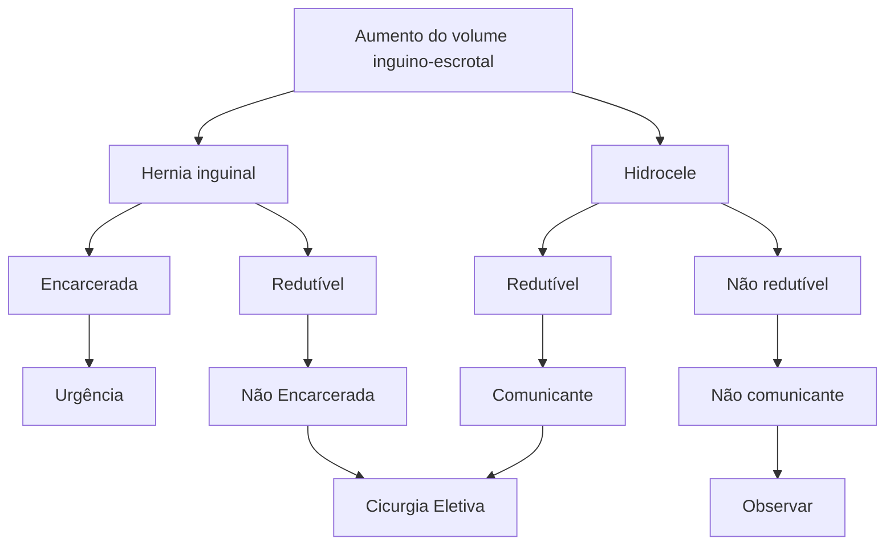

Urologia Pediátria (PED)

# O QUE UM PEDIATRA PRECISA SABER SOBRE CIRURGIA - UROPEDIATRIA E HÉRNIAS

| \*\*Fimose\*\* - Incapacidade de retrair o prepúcio, impedindo higiene adequada da glande. - Parafimose = urgência! - Balanopostite = ATB e operar eletivo \*\*Hipospádia\*\* - Meato uretral ectópico ventralmente. - Investigar outros diagnósticos - Cirurgia = correção de curvatura + tornar o meato uretral mais tópico possível + jato único e calibroso \*\*Criptorquidia\*\* - Diagnóstico CLÍNICO!!! - Não palpável bilateral = investigar DDS - Testículo palpável = orquidopexia - Não palpável = VLP | \*\*Hérnia X hidrocele\*\* - Hérnia umbilical - aguardar até os 4 anos; - Hérnia X Hidrocele → Transiluminar; - Hidrocele comunicante = Hérnia; - Não usar tela; - Em RN operar antes da alta. \*\*VUP\*\* - Obstrução infra-vesical mais comum do RN masculino - \*\*Palavras-chave:\*\* Bexiga em noz (rígida e trabeculada), jato miccional fraco, ureterohidronefrose e oligodrâmnio. - URETEROhidronefrose normalmente BILATERAL (UCM e USG); - Evidência de uretra posterior dilatada (UCM) - Bexiga muito trabeculada e rígida (USG e UCM); |
| ----------------------------------------------------------------------------------------------------------------------------------------------------------------------------------------------------------------------------------------------------------------------------------------------------------------------------------------------------------------------------------------------------------------------------------------------------------------------------------------------------------------- | -------------------------------------------------------------------------------------------------------------------------------------------------------------------------------------------------------------------------------------------------------------------------------------------------------------------------------------------------------------------------------------------------------------------------------------------------------------------------------------------------------------------------------------------------- |

## 1. FIMOSE

- **Caso clínico:** "Meu filho não consegue mostrar o pinto para eu lavar e a tal da massagem dói muito porque minha vizinha disse que ele tem FIMOSE.".
- **Definição:**
  - Incapacidade de retrair o prepúcio, impedindo a higiene adequada da glande.
  - É esperado que haja um acolamento balanoprepucial fisiológico ao nascimento e nos primeiros meses de vida.
  - **Tratamento clínico:** corticoide tópico.

| ABP se formando ao redor embrionário | Reabsorção e ABP se desconectam | ABP e prepúcio conectados | ABP se dissolve gradualmente | Prepúcio totalmente "descolado" |
| :----------------------------------: | :-----------------------------: | :-----------------------: | :--------------------------: | :-----------------------------: |
|               1° trim.               |             2° trim.            |         Nascimento        |           Infância           |           Adolescência          |

**Figura 1** Fimose Formação embriológica do prepúcio

### 1.1 QUANDO OPERAR:

- Balanite xerótica obliterante; pode ter origem autoimune!
- Parafimose;
- Balanopostite de repetição: lembrar da antibioticoterapia nos episódios agudos, correção cirúrgica só após resolução do quadro infeccioso.
- Circuncisão cultural;
- Retenção urinária entre a glande e prepúcio formando "balão de urina";
- ITU de repetição sem anormalidade do TGU.

**Figura 2** Indicações de tratamento na fimose

### 1.2 COMO É A CIRURGIA?

- **Postectomia clássica**
  - Incisão na zona de prepúcio ao nível do sulco balanoprepucial;
  - Sutura cutaneomucosa.

• **Plastibell**
  • Colocação de anel no interior do prepúcio após a ressecção;
  • Gera isquemia que a cicatrização após.

**Figura 3** Técnica cirúrgica para tratamento de fimose

• **Parafimose:**
  • **Caso clínico:** "Doutor, meu filho não faz xixi igual aos outros. Ele molha tudo e o pinto dele é bem encurvado para baixo.".
  • **Definição:** incapacidade de fazer a retração da glande para o interior do prepúcio.
• **Emergência!**
  • **Primeiro passo:** corticoide tópico + tentar redução manual!
  • **Se falha (raro):** considerar redução cirúrgica.
  • A postectomia está indicada independentemente do sucesso da redução manual.

**Figura 4** Manobra de redução manual da parafimose

## 2. HIPOSPÁDIAS

• **Definição:** anomalia do desenvolvimento peniano caracterizado por meato uretral se abrindo na superfície ventral do pênis.
• **Características gerais:**
  • Capuchão exuberante;
  • Glande pouco sulcada;
  • Curvatura ventral;
  • Meato uretral abaixo do ápice glandar;
  • **Consequência: micção disfuncional!**

Glanular
Coronal
Pênis distal
Eixo intermediário
Pênis proximal
Penoescrotal
Escrotal
Perineal

Desenho demonstrando como o prepúcio pode estar formado incompletamente, um tipo de alteração comum na hipospádia, denominada de capuchão

Pênis sem curvatura | Curvatura leve | Curvatura moderada | Curvatura severa

**Figura 5** Classificações de hipospádia, com as curvaturas possíveis

O QUE UM PEDIATRA PRECISA SABER DE CIRURGIA PEDIÁTRICA? - UROPEDIATRIA E HÉRNIAS                3

• **Tratamento: cirurgia!**
  • Correção de curvatura + tornar o meato uretral mais tópico possível + jato único e calibroso.
• **Objetivos da cirurgia:**
  • Proporcionar micção em jato único, grosso e pra frente;
  • Ereção funcional;
  • Posicionar o meato uretral o mais próximo possível do ápice glandar (uretroplastia com tecido peniano ou com uso de enxertos);
  • Corrigir a curvatura peniana;
  • Plástica total do pênis com possível escrotoplastia.

[Images showing surgical steps numbered 1-6]

**Figura 6** Hipospádia distal. Hipospádias distais são menos complexas que as proximais.

[Images showing clinical examples of hypospadias]

**Figura 7** Hipospádia proximal
• Na correção das hipospádias proximais, pode ser necessária a realização de enxerto oral, vesical ou do próprio pênis.

## 3. TESTÍCULOS NÃO DESCIDOS

• **Caso clínico:** Criança, 2 meses, sexo masculino, escroto plano e vazio, vem junto aos pais à emergência assim que perceberam as alterações
• **Distopia testicular (testículo fora da bolsa escrotal):**
  • Criptorquidia (testículo não encontrado);
  • Ectopia testicular: testículo fora da bolsa e fora do trajeto embrionário;
  • Agenesia.
• **Como os testículos descem?**
  • Na formação embriológica, o testículo inicialmente é intra-abdominal;
  • O aumento das vísceras abdominais e o crescimento da criança levam a aumento da pressão abdominal e tendência do testículo a descer pelo canal inguinal.
  • Fatores endógenos, como interleucinas e testosterona, ajudam nesse processo;
• **É esperado:**
  • 22 semanas: testículos no canal inguinal;
  • 27 semanas: testículos no saco escrotal.

[Anatomical diagrams showing testicular anatomy with labels including: Testículo, Gubernáculo, Prepúcio vaginal, Púbis, Pênis, Gubernáculo, Veriga transversal, Ducto deferente, Testículo livre, Gubernáculo, Pênis transversal, Gubernáculo, Escroto, Prepúcio vaginal, Processo vaginal, Oblíqua externa, Fáscia e músculo do cremaster, Túnica vaginal, Oblíqua interna e externa, Espermática externa]

**Figura 8** Testículos não descidos

Pressão abdominal

Crescimento

ILF-3 e Testosterona

22°- Canal inguinal

27 Bolsa testicular

[Clinical image showing testicular positions with labels: Intra-abdominal, Inguinal canal, Superficial inguinal pouch, High scrotal, Scrotal and retractile]

[Anatomical diagram showing: Púbis, Períneo]

**Figura 9** Formação embriológica e descida testicular

### 3.1 PROBLEMAS ASSOCIADOS:
**Pré-púbere:**
• Risco de neoplasia testicular (gonadoblastoma) 2x maior.

**Pós puberdade:**
• Risco de neoplasia testicular aumentado (sem dados sobre o quanto).

**Unilateral:**
• Fertilidade similar a adultos saudáveis.

**Bilateral:**
• **Não tratados:** 100% oligospermia e 75% azoospermia;
• **Tratados:** 75% oligospermia e 42% azoospermia.

## 3.2 CONDUTA: CIRURGIA!
• Maximizar o potencial de fertilidade;
• Reduzir o risco de câncer testicular;
• Corrigir a hérnia inguinal associada; permanência do conduto peritônio-vaginal aumenta o risco de hérnias!
• Diminuir o risco de torção;
• Fator psicológico;
• Quanto mais cedo melhor (> 3-6m)!
• **Testículos retráteis?**
  • Não têm risco aumentado de torção;
  • Não têm risco aumentado de malignidade;
  • Risco de infertilidade com evidência baixa;
  • 20-30% ASCENDEM (descida espontânea?);
  • Tratamento pode ser conservador: indicação cirúrgica controversa. **Figura 11**
• **Manejo - testículos não palpáveis**
  • Videolaparoscopia para encontrar, posicionar e fixar o testículo adequadamente (quando existentes).

![A B C - Three laparoscopic images showing testicular evaluation]

**Figura 12** Videolaparoscopia para avaliação de testículos não palpáveis

![Surgical diagrams showing incision locations and testicular correction procedure with labels: Incisão abdominal, Incisão escrotal, Testículo, Eletrocauterizador, Retrator, Testículo descendente e excretado]

**Figura 11** Correção cirúrgica se testículos palpáveis

• **Diagnóstico: clínico!**
  • Feito pela ausência de testículos em bolsa escrotal durante o exame físico;
  • Manobra bimanual: palpar bolsa testicular vazia; pressionar levemente o canal inguinal para avaliar descida.

![A B C D E F - Six images showing bimanual palpation technique for testicular examination]

**Figura 10** Avaliação bimanual para palpação testicular

• **Manejo - testículos palpáveis**
  • Inguinotomia para avaliar as estruturas do canal inguinal + orquidopexia convencional por via inguinal.

• **Em resumo:**
  • Diagnóstico CLÍNICO
  • Não palpável bilateral = investigar distúrbios de diferenciação sexual!
  • Testículo palpável = orquidopexia
  • Não palpável = VLP

![Three surgical photographs showing testicular correction procedure]

O QUE UM PEDIATRA PRECISA SABER DE CIRURGIA PEDIÁTRICA? - UROPEDIATRIA E HÉRNIAS                                5

## 4. HÉRNIA X HIDROCELE

**Caso clínico:** solicitada avaliação de RNPT 8 dias na UTI neonatal por abaulamento em região escrotal.

**Ao exame:**
- Aumento do volume escrotal a direita, transiluminação positiva, conteúdo não redutível para a cavidade abdominal

### 4.1 HÉRNIA UMBILICAL
- Acomete até 58% dos nascidos vivos;
- Apresenta mínima taxa de encarceramento;
- Período seguro de observação: até os 4 anos;
- Correção não necessita de tela.

**Conduto peritoniovaginal**
- Quando há persistência do conduto peritoniovaginal, pode haver passagem de líquidos e vísceras do abdome para a região inguinal e/ou escrotal.
- Conduto fino: hidrocele comunicante;
- Conduto largo: hérnia inguino-escrotal;
- Contudo parcial: hérnia inguinal;
- Conduto fechado com líquido na bolsa escrotal: hidrocele não comunicante;
- Líquido preso no meio de um conduto fechado: cisto de cordão.

| 
**Normal** | 
**Hérnia
Inguino-escrotal** | 
**Hidrocele
comunicante** |
| :---------------------------------------------------------------------------------: | :-----------------------------------------------------------------------------------------: | :------------------------------------------------------------------------: |
|                
**Hérnia Inguinal**               |                
**Hidrocele
não comunicante**               |        
**Cisto de cordão**        |

**Figura 13** Diagnósticos diferenciais de patologias inguino-escrotais

**Como diferenciar hérnia de hidrocele:**
• **Transluminescência!**
  • Colocar fonte de luz sobre o testículo: iluminação de toda a bolsa → hidrocele; ausência de iluminação → hérnia inguinoescrotal.

**Figura 14** Fluxograma de manejo de Hérnia inguinal e Hidrocele

• **Em resumo:**
  • Hérnia umbilical - aguardar até os 4 anos;
  • Hérnia X Hidrocele → Transiluminar;
  • Hidrocele comunicante = Hérnia;
  • Não usar tela em crianças;
  • Em RN operar antes da alta.

## 5. VÁLVULA DE URETRA POSTERIOR (VUP)

• **Caso clínico:** RN 2 dias de vida, masculino, pré-natal revelando Hidronefrose bilateral é possível palpar bexiga rígida após 24h de vida com ausência de jato miccional forte.

• **Por que a enfermagem relata sondagem vesical muito difícil?**
  • Definição: folhetos valvulares anômalos na uretra posterior provocando obstrução ao fluxo da urina.
  • Causa mais comum de obstrução do trato urinário inferior em meninos.
  • 30-50% desses evoluem para DRC, podendo inclusive necessitar de transplante renal.

• **Palavras-chave:**
  • Bexiga em noz (rígida e trabeculada);
  • Jato miccional fraco;
  • Ureterohidronefrose;
  • Oligoidrâmnio.

**Figura 15** Representação das alterações anatômicas na Válvula de Uretra Posterior

• **Diagnóstico: imagem!**
  • Ureterohidronefrose bilateral (USG e UCM);
  • Bexiga trabeculada e rígida (USG e UCM);
  • Evidência de uretra posterior dilatada (UCM).

**Figura 16** Hipodensidade linear definindo válvula de uretra posterior com dilatação a montante.

O QUE UM PEDIATRA PRECISA SABER DE CIRURGIA PEDIÁTRICA? - UROPEDIATRIA E HÉRNIAS

• **Tratamento:**
  • Primeira opção: ablação por cistoscopia.
  • Casos graves: derivação vesical com, por exemplo, cistostomia

• **O que diferencia VUP das outras causas de hidronefrose?**
  • Jato miccional fraco (CLÍNICO)
  • URETEROhidronefrose normalmente BILATERAL (UCM e USG);
  • Evidência de uretra posterior dilatada (UCM)
  • Bexiga muito trabeculada e rígida (USG e UCM).

**Figura 17** Uretra posterior muito dilatada com bexiga trabeculada e ureterohidronefrose bilateral evidenciando VUP

CIRURGIA

# REFERÊNCIAS

**Figura 1** Fimose Formação embriológica do prepúcio

https://www.portalped.com.br/outras-especialidades/cirurgia-pediatrica/patologias-cirurgicas-ambulatoriais-quando-encaminhar-ao-cirurgiao/

**Figura 2** Indicações de tratamento na fimose

https://www.msdmanuals.com/pt/profissional/multimedia/image/parafimose

**Figura 6** Hipospádia distal. Hipospádias distais são menos complexas que as proximais.

https://www.urologistapediatrico.com/galeria-de-fotos-de-hiposp

**Figura 7** Hipospádia proximal

https://www.urologistapediatrico.com/galeria-de-fotos-de-hiposp

**Figura 9** Formação embriológica e descida testicular

https://embriomedufpr.wordpress.com/category/uncategorized/

**Figura 10** Avaliação bimanual para palpação testicular

https://www1.racgp.org.au/ajgp/2019/january%E2%80%93february/undescended-testes

**Figura 11** Correção cirúrgica se testículos palpáveis

https://www1.racgp.org.au/ajgp/2019/january%E2%80%93february/undescended-testes

**Figura 12** Videolaparoscopia para avaliação de testículos não palpáveis

https://www1.racgp.org.au/ajgp/2019/january%E2%80%93february/undescended-testes

**Figura 15** Representação das alterações anatômicas na Válvula de Uretra Posterior

Adaptado de The Children's Hospital of Philadelphia

**Figura 16** Hipodensidade linear definindo válvula de uretra posterior com dilatação a montante.

Acervo pessoal

**Figura 17** Uretra posterior muito dilatada com bexiga trabeculada e ureterohidronefrose bilateral evidenciando VUP

Acervo pessoal
