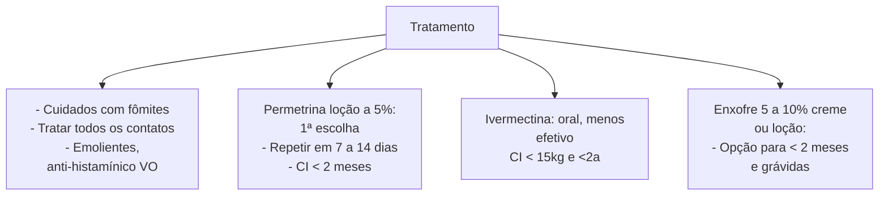

# DERMATITE ATÓPICA, LESÕES BENIGNAS DO RN

| **DERMATITE ATÓPICA:**                                                                                                                                                                                                                                                                                                                                                                                                                                                                                                                                                                                                                                                                                                                                                                               |                                                                                                                                                                                                                                                                                                                                                                                                                                                                                                                                                                                                                                                                                                                                                                                                        |
| ---------------------------------------------------------------------------------------------------------------------------------------------------------------------------------------------------------------------------------------------------------------------------------------------------------------------------------------------------------------------------------------------------------------------------------------------------------------------------------------------------------------------------------------------------------------------------------------------------------------------------------------------------------------------------------------------------------------------------------------------------------------------------------------------------- | ------------------------------------------------------------------------------------------------------------------------------------------------------------------------------------------------------------------------------------------------------------------------------------------------------------------------------------------------------------------------------------------------------------------------------------------------------------------------------------------------------------------------------------------------------------------------------------------------------------------------------------------------------------------------------------------------------------------------------------------------------------------------------------------------------ |
| • Diagnóstico clínico: Prurido nos últimos 12 meses + ≥3:
• → Pele seca ou xerose no último ano\| Histórico pessoal de RA/ asma ou familiar de RA/asma/ DA em < 4a\| Idade precoce de início do quadro\| Eczema em locais característicos (Lactentes: face/ superfície extensora\| demais: flexuras).
• Manejo: educação/ evitar gatilhos + hidratação + anti-inflamatório tópico (corticoide\| inibidores calcineurina).
**LESÕES BENIGNAS RN:**
• **Eritema tóxico:** 1-4d de vida; pápulas/ pústulas com halo eritematoso; poupa palmas e plantas.
• **Melanose pustulosa:** ao nascimento; lesões vesicopustulosas → descamação em colarete → mancha hipercrômica; distribuição universal, incluindo palmas e plantas.
• **Hiperplasia sebácea:** ao nascimento; pápulas | amareladas; dorso do nariz e região malar.
• **Milia:** aparece nas primeiras semanas; pápulas peroladas, endurecidas; região frontal e mento.
• **Mancha salmão:** ao nascimento, mancha eritematosa que intensifica ao choro e sucção; occipício, glabela e pálpebras.
• **Mancha em vinho do porto:** ao nascimento; permanente; local mais característico: face → atentar Sturge-Weber e Klippel-Trenaunay (geralmente unilateral, respeitando linha média).
• **Melanocitose dérmica (mancha mongólica):** ao nascimento; manchas marrom-azuladas ou arroxeadas; mais em região lombossacra.
• **Hemangioma:** nem sempre presente ao nascimento; lesão vascular de crescimento rápido até 4-6m; forma regressiva posterior, até desaparecimento; avaliar uso do propranolol. |

## 1. DERMATITE ATÓPICA

### 1.1 INTRODUÇÃO:
- Dermatose INFLAMATÓRIA;
- Curso CRÔNICO/ RECIDIVANTE;
- Início PRECOCE: primeiros 2 anos de vida
- Marcha atópica:
- DA: primeira manifestação de um quadro atópico;

Dermatite atópica → RA, asma, alergia alimentar...

### 1.2 EPIDEMIOLOGIA:
- Dermatose mais comum na criança;
- Prevalência aumentando → poluição, infecções, exposição a alérgenos;
- Acomete qualquer idade, mas ocorre tipicamente na infância: **60% inicia no primeiro ano de vida; 80%** manifesta forma leve; 70% apresenta melhora gradual até o final da infância.
- Histórico familiar positivo → importante fator de risco.

### 1.3 ETIOFISIOPATOGENIA:
- **Doença multifatorial:** fatores genéticos, ambientais, psicossomáticos;

**Ocorre por:**
- **Barreira epidérmica disfuncional:** mutação da proteína filagrina (proteína estrutural da epiderme) + alteração lipídica;
- **Anormalidades microbioma cutâneo:** disbiose (S. aureus e M. furfur);
- **Desregulação imunológica:**
  - Respostas imunes inatas reduzidas na pele;
  - Respostas mediadas por Linfócitos T exacerbadas;
  - Fase aguda: predomínio resposta Th2 na fase aguda → Aumento de IgE;
  - Fase crônica: resposta Th1.

- **Fatores ambientais| psicossomáticos:** atuam como gatilhos de exacerbações.

### 1.4 CLÍNICA:
- Características clássicas, comuns a todas as fases: **PRURIDO E XERODERMIA!**
- Classificação de lesões cutâneas se dá por fases (aguda, subaguda e crônica) que podem coexistir.
  - **AGUDAS:** Pápulas eritematosas.
  - **SUBAGUDAS:** Pápulas eritematosas + escoriações
  - **CRÔNICAS:** Liquenificação, aumento da espessura da pele, pápulas fibróticas.

**Figura 1** Lesão de caráter crônico.

**Apresentação varia de acordo com idade.**
- **LACTENTES:**
  - **Local:** face, geralmente poupa trígono nasolabial e superfícies extensoras.
  - **Lesão:** eczematosa → pápulas/ placas pruriginosas com ou sem crostas hemáticas/ exsudato.
- **PRÉ-PUBERAL (2-10 anos):**
  - **Local:** áreas de flexura, a destacar regiões antecubital e poplítea;
  - **Lesão:** características subagudas/ crônicas;
  - Alta ocorrência de **infecção secundária** (S. aureus!) → crostas tornam-se melicéricas.

![Two medical images showing: A - acute lesion in infant sparing central trigone area, B - subacute lesion in pre-pubertal child in flexural region]

**Figura 2** A - DA no lactente: lesão aguda, poupando trígono central.
B - DA no pré-pubere: lesão subaguda em região de flexura.

**PUBERAL:**
- **Local:** áreas de flexura;
- **Lesões:** características crônicas;
- Nesta faixa etária, pode haver manifestação isolada em face (perioral e periocular), dorso das mãos e dos pés, punhos e/ou tornozelos.

## 1.5 DIAGNÓSTICO

**CLÍNICO!**

**Critérios:**
- **Obrigatório:** Prurido nos últimos 12 meses + ≥3:
  - Pele seca ou histórico de xerose no último ano;
  - Histórico pessoal de RA/asma; ou
  - Histórico familiar de RA/asma/DA em < 4a;
  - Idade de início do quadro: precoce (geralmente < 2 anos);
  - Eczema em locais característicos: malar/frontal/ superfície extensora em < 4 anos e em flexuras nos > 4 anos;

**Características clínicas e laboratoriais que corroboram:**
- Pregas de Dennie- Morgan: duplas linhas infraorbitárias;
- Hiperpigmentação periorbitária;
- Ceratose pilar;
- Ceratocone;
- Ictiose vulgar;
- Hiperlinearidade palmar;
- Aumento níveis de IgE;
- Eosinofilia;
- Testes cutâneos de puntura positivo: os testes de sensibilidade tem alto valor preditivo negativo. Se positivos, demonstram apenas sensibilização, não necessariamente alergia.

**Classificação de gravidade: SCORAD (Scoring Atopic Dermatitis);**

**Desencadeantes:**
- Aeroalérgenos - ácaros;
- Clima - extremos de temperatura;
- Fatores psicossociais;
- Antígenos alimentares: ~30% pacientes: ovo, leite de vaca, trigo, soja, amendoim.

**Complicações: destaque para infecções secundárias**
- *S. aureus;*
- Erupção variceliforme de Kaposi (eczema herpético).

## 1.6 TRATAMENTO:

- **Pilares:** educação em saúde; hidratação; tratamento anti-inflamatório; identificação e eliminação dos fatores desencadeantes.
- **Educação em saúde:** elucidar o curso crônico da doença, importância das medidas de profilaxia ambiental e assiduidade de manutenção da hidratação.
- **Higiene da pele:** evitar banhos quentes e prolongados, preferência por sabonete líquido, com pH levemente ácido, evitar buchas.
- **Hidratação:** deixar pele levemente úmida e aplicar hidratante 3 minutos após banho.
  - Uso de emolientes: base da terapia de manutenção, também realizado nas exacerbações; desejável aplicação diária, disciplinada, preferível com pele úmida.

## 1.7 TERAPÊUTICA ANTI-INFLAMATÓRIA:

- **1ª linha:** corticosteróides tópicos;
- **2ª linha:** inibidores tópicos da calcineurina. Preferível em topografias de face / intertriginosas.
- **Modo de uso:**
  - Reativa: quadros leves;
  - Pró-ativa: quadros moderado-graves → 2 dias/ semana; Com uso de corticoides tópicos por até 3 meses e os inibidores tópicos da calcineurina: até 12 meses.
- **CORTICOSTERÓIDES:** 7 classes de potência (avaliação vasoconstrição). A indicação de escolha do corticoide depende da região acometida, idade do paciente e gravidade da lesão. Tabela 1
  - **Baixa potência:** hidrocortisona. Indicações: face, períneo, dermatite leve.
  - **Média | alta potência:** pacientes mais velhos, dermatite moderada - grave, regiões para além de face/ períneo.

Atenção: ao uso prolongado do corticoide de baixa potência ou uso de corticoide de média - alta potência, ambos em áreas de maior chance de absorção sistêmica (face e períneo), existe risco de desregulação do eixo hipotálamo - hipófise - adrenal, podendo desencadear insuficiência adrenal após suspensão do corticoide tópico.

- **INIBIDORES TÓPICOS DA CALCINEURINA:** > 2 anos. Indicado em pacientes não responsivos ou intolerantes à corticoterapia, em áreas de face / intertriginosas e pacientes impossibilitados de uso da corticoterapia.
  - Pimecrolimus creme 1%: DA leve - moderada e maiores de 3 meses;
  - Tacrolimus pomada 0,03%: DA moderada - grave em maiores de 2 anos;

DERMATITE ATÓPICA, LESÕES BENIGNAS DO RN                                                                             3

**Tabela 1** Corticosteróides

| POTÊNCIA:     | EXEMPLO:                                                                                                                                                                                                                                                                                                                                                              |                                                                                                                                                                                                                                                                                                                                                                                      |                                                                                                              |
| ------------- | --------------------------------------------------------------------------------------------------------------------------------------------------------------------------------------------------------------------------------------------------------------------------------------------------------------------------------------------------------------------- | ------------------------------------------------------------------------------------------------------------------------------------------------------------------------------------------------------------------------------------------------------------------------------------------------------------------------------------------------------------------------------------ | ------------------------------------------------------------------------------------------------------------ |
| Superpotente: | Propionato de clobetasol 0,05% (creme e pomada)                                                                                                                                                                                                                                                                                                                       |                                                                                                                                                                                                                                                                                                                                                                                      |                                                                                                              |
| Potentes:     | Dipropionato de betametasona 0,05% (pomada→ geralmente pomada é mais POTENTE);
Valerato de betametasona 0,1% (pomada)
Halcinonida 0,1% (pomada)
Valerato de Diflucortolona (creme e pomada)
Dipropionato de betametasona 0,05% (creme)
Valerato de betametasona 0,1% (creme)
Halcinonida 0,1% (creme)
Acetonido de triancinolona (pomada) |                                                                                                                                                                                                                                                                                                                                                                                      |                                                                                                              |
|               | Potência média:                                                                                                                                                                                                                                                                                                                                                       | Furoato de mometasona 0,1% (pomada)
Acetonido de fluocinolona (pomada)
Prednicarbato (pomada)
Acetonido de triamcinolona (creme)
Desonida (pomada)
Aceponato de metilprednisolona (creme)
Furoato de mometasona 0,1% (creme)
Acetonido de fluocinolona (creme)
Prednicarbato (creme)
Desonida (creme)
Aceponato de metilprednisolona (creme) |                                                                                                              |
|               |                                                                                                                                                                                                                                                                                                                                                                       | Potência leve:                                                                                                                                                                                                                                                                                                                                                                       | Fluorandrenolide (creme ou pomada)
Hidrocortisona (pomada)
Pivalato de flumetasona (creme ou pomada) |
|               |                                                                                                                                                                                                                                                                                                                                                                       | Leve:                                                                                                                                                                                                                                                                                                                                                                                | Hidrocortisona (creme)
Dexametasona
Prednisolona
Metilprednisolona                               |

• **Tratamento sistêmico:** opções são corticoide VO, ciclosporina, metotrexato. Evitar corticoide sistêmico → Rebote após suspensão e efeitos adversos potenciais dessa terapêutica.

• **Anti-histamínicos:** histamina NÃO é o mecanismo principal do prurido na DA. Assim, são úteis quando há concomitância de exacerbação de outras manifestações atópicas, como rinite e conjuntivite alérgicas. Alguns utilizam anti-histamínicos sedativos (como hidroxizina) pelo efeito adverso de sonolência.

• Potenciais: fototerapia e imunobiológicos.

## 1.7 PROGNÓSTICO

• Resolução do quadro na infância, na maioria dos casos;

• **Fatores de mau prognóstico:** doença disseminada na infância; mutação no gene da filagrina; RA e asma concomitantes; histórico familiar de DA em pais| irmãos; níveis de IgE muito elevados.

## 1.8 PREVENÇÃO

• Amamentação;

• Probióticos? Carece de evidências científicas mais robustas.

# 2. LESÕES BENIGNAS DO RECÉM-NASCIDO

## 2.1 INTRODUÇÃO

• Alterações encontradas na pele do recém nascido: congênitas ou adquiridas; transitórias ou permanentes.

• Pele imatura, com alta ocorrência de dermatoses: maioria benigna, transitória, sem necessidade de tratamento específico.

• **Quadros mais frequentes:** Pápulas, vesículas e/ ou pústulas; lesões vasculares; lesões hiperpigmentadas.

## 2.2 PÁPULAS, VESÍCULAS E/ OU PÚSTULAS

**Eritema tóxico**

• **Quando?** 1-4 dias (principalmente 2°/3° dias);

• **Duração?** Poucos dias, autolimitado;

• **Etiologia?** Desconhecida. São coleções **eosinofílicas**;

• **Características:** máculas | pápulas róseas ou amareladas | pústulas rodeadas por **halo eritematoso**;

• **Distribuição:** universal, **poupando palmas e plantas**;

• **Tratamento:** sem necessidade de tratamento específico;

**Figura 3** Eritema tóxico.

**Melanose pustulosa transitória**

• **Quando?** Ao nascimento;

• **Duração?** Pústulas: dias| Mancha hiperpigmentada: semanas, autolimitado;

• **Características:** acúmulo de **neutrófilos** + eosinófilos escassos.

• **Lesões vesicopustulosas, sem eritema circundante. → descamação em colarete → mancha hipercrômica;**

• **Distribuição:** universal, **incluindo palmas e plantas**;

• **Tratamento:** sem necessidade de tratamento específico;

**Figura 4** Melanose Pustulosa.

## Hiperplasia sebácea
• **Quando?** Ao nascimento;
• **Duração?** Primeiro mês, autolimitado;
• **Etiologia?** Glândulas sebáceas hiperplásicas;
• **Características:** lesões papulares amareladas múltiplas;
• **Distribuição:** dorso nasal e região malar;
• **Tratamento:** sem necessidade de tratamento específico;

**Figura 5** Hiperplasia sebácea.

## Cistos de milia:
• **Quando?** Primeiras semanas de vida;
• **Duração?** Poucas semanas- meses, autolimitado;
• **Etiologia?** Cistos de inclusão epidérmica;
• **Características: pápulas peroladas, levemente endurecidas;**
• **Distribuição:** região frontal e mento, principalmente. Quando em palato, recebe nome de **pérolas de Epstein.**
• **Tratamento:** sem necessidade de tratamento específico;

## Miliária
• **Quando?** Cristalina: 5-8 dias| Rubra: após 1ª semana de vida;
• **Duração?** Poucos dias, autolimitado;
• **Etiologia?** Sudorese associada à **obstrução de glândulas sudoríparas** que não estão completamente desenvolvidas no período neonatal;
• **Características:** ocorre mais em regiões quentes; estados febris; RN super agasalhado ou RN em incubadoras.
• **Cristalina:** vesículas superficiais, sem eritema ao redor:
• **Rubra:** obstrução mais profunda, com processo inflamatório → eritema associado:
• **Distribuição:** face, couro cabeludo, porção superior do tronco;
• **Tratamento:** medidas para evitar superaquecimento.

**Figura 6** Miliária cristalina (esquerda) e miliária rubra (direita).

## Bolhas de sucção
• **Quando?** Ao nascimento;
• **Duração?** Poucos dias, autolimitado;
• **Etiologia?** Decorrente de sucção vigorosa pelo RN no período intraútero;
• **Características:** bolhas solitárias ou erosões;

• **Distribuição:** dedos, dorso mãos, antebraço;
• **Tratamento:** sem necessidade de tratamento específico;

## 2.3 LESÕES VASCULARES

### Mancha salmão ("nevo vascular"):
• **Quando?** Ao nascimento;
• **Duração?** Melhora gradativa com desaparecimento até o 3º ano de vida;
• **Etiologia?** Ectasia vascular localizada; **imaturidade do sistema autonômico** que inerva vasos sanguíneos da região;
• **Características:** mancha rósea clara, limites imprecisos, somem à vitro/digitopressão e torna-se intensa ao choro e sucção;
• **Distribuição:** região occipital ("bicada da cegonha"), glabela ("beijo dos anjos"), pálpebras superiores. Não respeitam limites da linha média;
• **Tratamento:** sem necessidade de tratamento específico → geralmente glabela e pálpebras superiores desaparecem com o passar do tempo, occipital pode permanecer;

**Figura 7** Mancha salmão

**Figura 8** Malformação capilar ("vinho do Porto")

### Malformação capilar ("vinho do Porto"):
• **Quando?** Ao nascimento;
• **Duração?** Permanente;
• **Etiologia?** Malformação capilar;
• **Características:** mancha cor vinhosa intensa, homogênea, não alterada por choro ou sucção. Geralmente, forma isolada, unilateral, **respeitando linha média;**
• **Distribuição:** universal, **sendo mais característico em face;**
• **Associações:**
  • **Sturge Weber:** malformação vascular encontra-

DERMATITE ATÓPICA, LESÕES BENIGNAS DO RN                                                                     5

se na região inervada pelo ramo oftálmico do trigêmeo; associação a angiomas em leptomeninges; anomalias oculares.

• **Klippel- Trenaunay:** malformações vasculares +/- malformações linfáticas; hipertrofia de partes moles/ ossos → pode haver assimetria de membros.

• **Tratamento:** seguimento pertinente à síndrome/ quadro subjacente, se for o caso. Uso potencial de *Pulsed Dye Laser*.

**Hemangioma**

• **O que é?** Tumor vascular benigno **mais comum** da infância:

• **Quando?** Em até 50% dos casos, a lesão **NÃO** está presente ao nascimento. Pode haver lesão precursora.

• **Duração?** Regressão possível até 9 anos.

• **Características:** fase de crescimento rápido até 4-6 meses seguida de fase de estabilização e posterior fase de regressão progressiva, paulatina, até 9 anos;

• **Distribuição:** universal; locais maior vigilância são ponte nasal, região perioral, periocular;

• **Tratamento:** orientações gerais → considerar medicamentos em casos de crescimento acelerado, potencial de complicações/ deformidades. E, quando indicado, as opções são: 1ª linha propranolol e 2ª linha corticoide VO, remoção cirúrgica, Pulsed Dye Laser, embolização.

**Figura 9** Hemangioma.

## 2.4 LESÕES HIPERPIGMENTADAS:

**Nevos Melanocíticos Congênitos (NMC):**

• **Quando?** Ao nascimento;

• **Duração? Permanente;**

• **Características:** mancha de coloração **vinho clara até preto-azulado**. Pode ser acompanhado de placa pilosa. **Risco aumentado de melanoma em relação à população geral.** Quando há múltiplos NMC, nomeia-se melanose cutânea;

• **Distribuição:** universal. Os NMC maiores geralmente se localizam em tronco e cabeça. Em casos de NMC gigantes/ melanose cutânea: **realizar RNM de SNC para avaliação de melanocitose neurológica;**

• **Tratamento:** seguimento atento.

**Figura 10** Nevo melanocítico congênito.

**Melanocitose dérmica (" Mancha mongólica"):**

• **Quando?** Ao nascimento;

• **Duração?** Desaparece com passar dos anos, geralmente ao final do 1º ano de vida;

• **Etiologia?** Defeito de migração de melanócitos da crista neural, que acumulam-se na derme;

• **Características:** manchas **marrom-azuladas ou arroxeadas;**

• **Distribuição:**
  • Preponderante em topografia **lombossacra**;

• **Tratamento:**
  • Sem necessidade de tratamento específico

**Figura 11** Melanocitose dérmica ("mancha mongólica").

## 2.5 MISCELÂNIA

**Nevo sebáceo:**

• Placa amarelada em couro cabeludo, cabeça e pescoço, principalmente;

• Pode aumentar na adolescência por estímulo hormonal.

**Aplasia cutis congênita:**

• Ausência de pele/ tecido subcutâneo em área circunscrita, ao nascimento;

• Geralmente, localiza-se isoladamente em couro cabeludo;

• **Se defeito em calota craniana está associado, lembrar-se:** Síndrome de Adams- Olivier e trissomia do 13.

DERMATOLOGIA

# REFERÊNCIAS

**Figura 1** Lesão de caráter crônico.

Frazier W, Bhardwaj N. Atopic Dermatitis: Diagnosis and Treatment. Am Fam Physician. 2020 May 15;101(10):590-598. PMID:32412211.

**Figura 2** A - DA no lactente: lesão aguda, poupando trígono central. B - DA no pré-pubere: lesão subaguda em região de flexura.

Frazier W, Bhardwaj N. Atopic Dermatitis: Diagnosis and Treatment. Am Fam Physician. 2020 May 15;101(10):590-598. PMID:32412211.

**Figura 3** Eritema tóxico.

O'Connor NR, McLaughlin MR, Ham P. Newborn skin: Part I. Common rashes. Am Fam Physician. 2008 Jan 1;77(1):47-52. PMID:18236822.

**Figura 4** Melanose Pustulosa.

O'Connor NR, McLaughlin MR, Ham P. Newborn skin: Part I.Common rashes. Am Fam Physician. 2008 Jan 1;77(1):47-52. PMID:18236822.

**Figura 5** Hiperplasia sebácea.

**Figura 6** Miliária cristalina (esquerda) e miliária rubra (direita).

O'Connor NR, McLaughlin MR, Ham P. Newborn skin: Part I. Common rashes. Am Fam Physician. 2008 Jan 1;77(1):47-52. PMID:18236822.

**Figura 7** Mancha salmão

Wirth FA, Lowitt MH. Diagnosis and treatment of cutaneous vascular lesions. Am Fam Physician. 1998 Feb 15;57(4):765-73. PMID:9490999.

**Figura 8** Malformação capilar ("vinho do Porto")

Diociaiuti A, Paolantonio G, Zama M, Alaggio R, Carnevale C, Conforti A, Cesario C, Dentici ML, Buonuomo PS, Rollo M, El Hachem M. Vascular Birthmarks as a Clue for Complex and Syndromic Vascular Anomalies. Front Pediatr. 2021 Oct 7;9:730393. doi: 10.3389/fped.2021.730393. PMID: 34692608; PMCID: PMC8529251.

**Figura 9** Hemangioma.

McLaughlin MR, O'Connor NR, Ham P. Newborn skin: Part II. Birthmarks. Am Fam Physician. 2008 Jan 1;77(1):56-60. PMID:18236823.

**Figura 10** Nevo melanocítico congênito.

McLaughlin MR, O'Connor NR, Ham P. Newborn skin: Part II. Birthmarks. Am Fam Physician. 2008 Jan 1;77(1):56-60. PMID:18236823.

**Figura 11** Melanocitose dérmica ("mancha mongólica").

McLaughlin MR, O'Connor NR, Ham P. Newborn skin: PartII. Birthmarks. Am Fam Physician. 2008 Jan 1;77(1):56-60. PMID:18236823.

Dermatoses Infecciosas e Infecções de Partes Moles (PED)

# DERMATOSES E INFECÇÕES DE PARTES MOLES

**Escabiose: Sarcoptes *scabiei variante hominis*; túneis e prurido; tratar com permetrina a 5% (para >2 meses) ou enxofre tópico;**

• Pediculose: *Pediculus humanus capitis*, tratar com permetrina a 1%;

• Larva migrans cutânea (*Ancylostoma braziliensis* ou *caninum*): lesão serpiginosa em áreas expostas;

• Tungíase (*Tunga penetrans*): pápula esférica branco amarelada com ponto negro central. Tratamento: remover a pulga;

• Impetigo: *Staphylococcus aureus* e *Streptococcus*

• *pyogenes*; tópico – mupirocina; sistêmico – cefalexina;

• Pele escaldada estafilocócica: bolhas finas causadas por toxinas; tratar com oxacilina + clindamicina;

• Ectima: "impetigo ulcerado", *S. pyogenes*; se gangrenoso, cobrir pseudomonas;

• Erisipela e celulite: *Streptococcus pyogenes* e *Staphylococcus aureus*; cefalexina ou penicilina;

• Tínea capitis: *Microsporum canis* e *Trichophyton tonsurans*; tratamento: griseofulvina ou terbinafina;

• Molusco contagioso: pápulas umbilicadas peroladas; tratamento: curetagem.

## 1. DERMATOSES PARASITÁRIAS

### 1.1 DEFINIÇÃO

• Afecções da pele causadas por insetos, vermes e protozoários.

• Muito comum na prática clínica e em provas de residência. Para as questões: focar em reconhecimento e tratamento.

### 1.2 ESCABIOSE

• Etiologia: *Sarcoptes scabiei variante hominis*.

• Transmissão: contato direto – pele; indireto – fômites.

• Quadro clínico: **prurido** intenso, túneis. Clínica de acordo com a faixa etária:

  • **Lactente**: eritema, edema, crosta, vesículas. Lesões em couro cabeludo, palmas, plantas e axilas.

  • **Adolescentes**: pápulas, vesículas, crostas. Lesões em espaço interdigital, punho, tornozelo, axila e virilha. As regiões de dobras são mais acometidas.

• Complicações das lesões da escabiose: infecção bacteriana secundária devido às escoriações advindas do prurido.

• Diagnóstico: clínico, microscopia.

• Lesões da escabiose: pápulas em mãos e pés.

**Figura 1** Lesões de escabiose em palma da mão, com eritema e pápulas.

**Figura 2** Lesões de escabiose nos pés, com pápulas eritematosas.

• O tratamento envolve cuidados com fômites e tratar todos os contatos.

• Tratamento da escabiose:

  • **1ª escolha: permetrina loção a 5%** (repetir em 7-14 dias); cx é contraindicada em < 2 meses.

  • **2ª escolha**: ivermectina oral → Menos eficaz e também é contraindicada em crianças com < 15 Kg e < 2 anos.

  • **Crianças < 2 meses ou grávidas:** enxofre 5 a 10% creme ou loção.

• Tratamento dos sintomas:

  • Emolientes, anti-histamínico VO.

**Figura 3** Tratamentos possíveis na Escabiose

DERMATOLOGIA

## 1.3 PEDICULOSE

• Etiologia: *Pediculus humanus capitis*.
• Transmissão: contato direto – cabelo; indireto – fômites.
• Quadro clínico: prurido intenso, lêndeas.
• Complicações: infecção bacteriana secundária associada a escoriação devido a prurido.
• Epidemiologia: mais comum em meninas, crianças em idade escolar e com idade entre 3-11 anos.

**Figura 4** Lêndeas em fios de cabelo, evidenciando a pediculose.

• Tratamento: Remoção mecânica das lêndeas com pente fino. Lavar com água quente as roupas, lençóis, tiaras e escovas.
• Farmacológico:
  • 1ª escolha – **permetrina a 1%** (aplicar no cabelo úmido e limpo, repetir em 10-14 dias) - contraindicada para crianças < 2 meses;
  • 2ª escolha – ivermectina VO, contraindicada em crianças < 15Kg.

## 1.4 LARVA MIGRANS CUTÂNEA

• Etiologia: *Ancylostoma braziliensis* ou *caninum* (helminto).
• Transmissão: **larva penetra na pele** (areia/praia com fezes de animais).
• Quadro clínico: trajetos sinuosos + prurido. Lesão serpiginosa (com bolha, pápula), única ou múltipla. Comum em áreas expostas do tipo mãos, pés, nádegas. Aguda e autolimitada 1-2 meses.

**Figura 5** Lesão serpiginosa relacionada à larva migrans cutânea.

• Tratamento: alívio dos sintomas e redução de risco de complicações bacterianas.
  • **Tópico** usa-se Tiabendazol 15% → primeira escolha.
  • **Sistêmico** é indicado ivermectina 200 mcg/kg/d VO por 3 dias.

## 1.5 TUNGÍASE

• Etiologia: *Tunga penetrans* (pulga)
• Transmissão: penetração – pele (**areia, zona rural**).
• Quadro clínico: Prurido, dor. Pápula esférica branco amarelada com ponto central (segmento posterior contendo ovos).
• Acometimento: região **palmo-plantar**.

**Figura 6** Lesão causada por tungíase, com pápula amarelada com ponto escuro central

• Tratamento: **extração** da pulga com agulha estéril.
• Se múltiplas lesões usar ivermectina oral ou tiabendazol tópico.

# 2. PIODERMITES

## 2.1 DEFINIÇÃO

• Infecções da pele e dos seus anexos.
• Geralmente causadas por **cocos gram-positivos**: *Staphylococcus aureus* e *Streptococcus pyogenes*. **Atenção** para o MRSA de comunidade.
• Em geral, são infecções de pouca gravidade e o manejo é ambulatorial.
• Podem ter **complicações extra cutâneas**: glomerulonefrite pós-estreptocócica.

## 2.2 IMPETIGO

• Definição: infecção **superficial** da pele, não deixa cicatriz. Pode ser primária ou secundária (picada de inseto, lesão de dermatite atópica).
• Etiologia: *Staphylococcus aureus* e *Streptococcus pyogenes*.
• Transmissão: interpessoal em contato próximo.
• Clínica: forma **crostosa** (*S. aureus* ou *S. pyogenes*) x forma **bolhosa** (*S. aureus*).
• Diagnóstico: clínico → cultura só se imunodeficiência ou dificuldade de tratamento ou recorrência.

DERMATOSES E INFECÇÕES DE PARTES MOLES                                                                                           3

**Figura 7** Impetigo crostoso ao redor das narinas

**Figura 8** Impetigo bolhoso

• Lesão típica: crosta melicérica (imagens acima).
• Tratamento: Medidas locais + antibioticoterapia + hábitos higiênicos adequados.
  • **Hábitos higiênicos:** manter a lesão limpa, lavar com sabão. Sabonetes antissépticos por curtos períodos (prevenir recorrência). Lavagem das mãos + manter unhas cortadas: evita auto-inoculação.
  • **Antibioticoterapia tópica:** Indicada para lesões localizadas, em pequena quantidade e sem comprometimento sistêmico. As opções são mupirocina, ácido fusídico, neomicina + bacitracina (não é primeira escolha devido a efeitos adversos), 5-7 dias.
  • **Antibioticoterapia sistêmica:** Indicada para grande número de lesões, mais de uma região, bolhoso, comprometimento sistêmico. As opções são cefalexina, amoxicilina + clavulanato, considerar bactrim ou clindamicina se suspeita de CA-MRSA, 7 dias.
• Complicações: glomerulonefrite. O tratamento NÃO elimina a possibilidade.

## 2.3 PELE ESCALDADA ESTAFILOCÓCICA

• Definição: eritema e fissuras → bolhas grandes e finas que se rompem e liberam fluido purulento.
• Etiologia: **exotoxinas A e B** do *Staphylococcus aureus* **fagotipos 1, 2 e 3** na circulação (não somente na pele).
• Clínica: sinal de **Nikolsky positivo** (pele desprende próximo às bolhas). Não envolve mucosas e possui sintoma sistêmicos presentes.
• Diagnóstico: clínico, cultura da bolha é negativa.
• Tratamento: antibioticoterapia SISTÊMICA.
  • Oxacilina.

• Associar clindamicina (bacteriostático, mas inibe síntese da toxina).
• Vancomicina se suspeita de MRSA.
• Terapêutica de suporte: cuidados com desidratação, regulação térmica e nutrição.

## 2.4 CHOQUE TÓXICO ESTAFILOCÓCICO

• Etiologia: S. aureus + produção de toxina (TSST-1) → produção maciça de citocinas;
• Epidemiologia: as crianças entre 6 meses e 2 anos são as mais vulneráveis;
  • Possui relação com uso de absorventes internos em pacientes mais velhas;
• Clínica: início rápido de febre, hipotensão e envolvimento multissistêmico (vômito, diarreia, mialgia, renal, hepático, SNC);
• Pele: eritrodermia (rash macular difuso envolvendo região palmo-plantar), podendo evoluir com ulcerações, petéquias, vesículas e bolhas. Após melhora clínica, pode evoluir com descamação após 1 - 2 semanas, com queda de cabelo e unhas;
• Mucosa: hemorragia conjuntival, hiperemia vaginal e orofaríngea.
• Diagnóstico: evidência de choque + culturas;
• Tratamento: suporte e antibioticoterapia empírica (oxacilina ou vancomicina, associada à clindamicina);

## 2.5 ECTIMA

• Definição: tipo de **impetigo ulcerado**, causado pelos mesmos agentes (principal: S. pyogenes).
• Transmissão: interpessoal em contato próximo.
• Clínica: lesão mais profunda, ulcerada, recoberta por crosta marrom-enegrecida com halo eritematoso/ violáceo elevado. Deixa cicatriz.
• Tratamento: **sempre** sistêmico. Cefalexina (1ª escolha).

**Figura 9** Lesão causada por ectima: profunda e ulcerada, com crosta marrom e halo eritematoso.

• Subtipo de ectima mais grave: Ectima **gangrenoso** (comum em área de períneo e normalmente é causado por Pseudomonas aeroginosa).

## 2.6 INFECÇÕES FOLICULARES

• Foliculite:
  • Definição: infecção e inflamação dos folículos pilosos. Mais comum: Staphylococcus aureus.
  • Superficial: pústulas brancas com halo eritematoso ao redor dos óstios foliculares.

**Figura 10** Lesões causadas por foliculite, com pústulas ao redor dos óstios foliculares

• Tratamento: Higiene local nos casos leves. Mupirocina tópica se quadro persistente em área limitada. Cefalosporina de primeira geração nos mais extensos.
• Furunculose:
  • Definição: infecção do folículo mais profundo, que invade derme até tecido celular subcutâneo.

**Figura 11** Furúnculo simples.

• Tratamento: compressas quentes, drenagem, antibioticoterapia sistêmica se eritema > 2cm (cobrir cMRSA com sulfametoxazol+trimetoprim ou clindamicina).
• Furunculose de repetição:
  • Definição: furunculose de repetição: **6 ou mais episódios por ano ou 3 em 3 meses.**
  • Diagnóstico: cultura da lesão se possível.
  • Tratamento: cuidados locais de higiene, sabão antisséptico, banho de hipoclorito e antibioticoterapia para o quadro agudo.
  • Opção de antibiótico para descolonização: mupirocina tópica em narinas, 2xd por 5-10 dias.
• Carbúnculo:
  • Definição: agrupamento de furúnculos que se estende até a hipoderme. **Figura 12**

## 2.7 ERISIPELA

• Definição: infecção superficial da pele, com disseminação linfática superficial.
• Agentes etiológicos: Streptococcus (pyogenes e outros) e Staphylococcus aureus. Penetram por porta de entrada.
• Clínica: área eritematosa **bem delimitada**, **dolorosa**,

pode ter **linfangite** ascendente e vesículas ou bolhas sobre a lesão. Pode ter sintomas **sistêmicos** (febre). O paciente pode ter leucocitose e toxemia nesses casos. **Figura 13**

**Figura 12** Lesão causada por carbúnculo, com componente inflamatório importante

**Figura 13** Erisipela em perna

• Tratamento: antibioticoterapia SISTÊMICA sempre.
  • VO: penicilina V, amoxicilina, cefalexina.
  • Parenteral: penicilina cristalina, cefazolina. Parenteral é usada quando lactentes, acometimento extenso, imunossuprimidos, falha ambulatorial.

## 2.8 CELULITE

• Definição: infecção **profunda** da pele com acometimento de derme e subcutâneo.
• Etiologia: Staphylococcus aureus, Streptococcus do grupo A, entre outros. Penetram por quebra de barreira cutânea.
• Quadro clínico: eritema, edema, limites imprecisos, evolução mais insidiosa que a erisipela.

**Figura 14** Lesão de celulite ao redor da articulação do cotovelo.

• Tratamento: antibioticoterapia SISTÊMICA.
  • **Indicações de internação:** imunossuprimidos, comprometimento do estado geral, acometimento extenso de face, região cervical, periarticular e periorificial.

DERMATOSES E INFECÇÕES DE PARTES MOLES                                                                                                               5

• VO: cefalexina, amoxicilina + clavulanato, 7 dias. Considerar clindamicina se falha.
• Parenteral: cefazolina, oxacilina, penicilina, ceftriaxona, 5 a 7dias.

## 3. DERMATOFITOSES

### 3.1 TINEAS
• Dermatófitos: Digerem queratina.
• Fungos geofílicos: solo.
• Fungos zoofílicos: animais.
  Ex: Microsporum canis
• Fungos antropofílicos: seres humanos.
  Ex: Trichophyton rubrum.
• Locais: corporis (imagem abaixo), pedis, cruris.

**Figura 15** Lesão causada por tínea, com halo eritêmato-descamativo e centro claro.

• Quadro clínico: placa com halo eritêmato-descamativo e centro claro.
• Diagnóstico: clínico, confirmado por exame micológico direto.
• Tratamento: antifúngicos tópicos (ex:. clotrimazol, cetoconazol) 1 - 2x/dia por 3 semanas OU antifúngicos orais (ex:. terbinafina, itraconazol) se disseminada ou imunocomprometidos.
• **Subtipo de tínea: Tínea capitis**
• Etiologia: Microsporum canis (sul/sudeste) e Trichophyton tonsurans (norte/nordeste).
• Quadro clínico: alopecia localizada com fios tonsurados, descamação e eritema. Grau máximo de inflamação: Kerion celsi.

**Figura 16** Lesão de tínea capitis, com pelos tonsurados na região da alopécia.

• Transmissão: fômites e animais de estimação.
• Diagnóstico: micológico direto e cultura.
• Tratamento: sistêmico. Gliseofulvina (para Microsporum sp.). Terbinafina (Trichophyton sp.).

## 4. DERMATOVIROSES

### 4.1 MOLUSCO CONTAGIOSO
• Quadro clínico: **pápulas umbilicadas peroladas**, de 2-5mm, em forma de cúpula. São lesões únicas ou agrupadas.
• Etiologia: vírus molusco contagioso da família *poxvírus*.
• Transmissão: fômites, piscinas. Pode ter transmissão sexual.
• Tratamento: Autolimitado: dura 6-9 meses. Está **indicado para** imunossuprimidos, doença extensa, com complicação secundária ou queixa estética.
• Opções de tratamento: curetagem (primeira escolha), crioterapia, métodos químicos.

**Figura 17** Lesões causadas por molusco contagioso, com pápulas peroladas umbilicadas.

DERMATOLOGIA

# REFERÊNCIAS

**Figura 1** Lesões de escabiose em palma da mão, com eritema e pápulas.

Infecções cutâneas parasitárias: Aspectos clínicos e atualização terapêutica. SBP. 2019.

**Figura 2** Lesões de escabiose nos pés, com pápulas eritematosas.

Infecções cutâneas parasitárias: Aspectos clínicos e atualização terapêutica. SBP. 2019.

**Figura 4** Lêndeas em fios de cabelo, evidenciando a pediculose.

Infecções cutâneas parasitárias: aspectos clínicos e atualização terapêutica. SBP. 2019.

**Figura 5** Lesão serpiginosa relacionada à larva migrans cutânea.

Infecções cutâneas parasitárias: aspectos clínicos e atualização terapêutica. SBP. 2019.

**Figura 6** Lesão causada por tungíase, com pápula amarelada com ponto escuro central

Infecções cutâneas parasitárias: aspectos clínicos e atualização terapêutica. SBP. 2019.

**Figura 7** Impetigo crostoso ao redor das narinas

https://www.medscape.co.uk/viewarticle/infective- skin-conditions-when-it-appropriate-prescribe-2022a10011mf- Copyright: Prof Raimo Suhonen, DermNet NZ - acesso em 24/11/2023

**Figura 8** Impetigo bolhoso

https://www.medscape.co.uk/viewarticle/infective- skin-conditions-when-it-appropriate-prescribe-2022a10011mf- Copyright: Prof Raimo Suhonen, DermNet NZ - acesso em 24/11/2023

**Figura 9** Lesão causada por ectima: profunda e ulcerada, com crosta marrom e halo eritematoso.

https://dermnetnz.org/topics/ecthyma Copyright: DermNet NZ - acesso em 24/11

**Figura 10** Lesões causadas por foliculite, com pústulas ao redor dos óstios foliculares

https://www.uptodate.com/contents/infectious-folliculitis - acessi em 24/11/2023

**Figura 11** Furúnculo simples.

https://dermnetnz.org/topics/boil -Copyright: DermNet NZ - acesso em 24/11/2023

**Figura 12** Lesão causada por carbúnculo, com componente inflamatório importante

https://www.uptodate.com/contents/infectious-folliculitis - acessi em 24/11/2023

**Figura 13** Erisipela em perna

https://bvsms.saude.gov.br/wp-content/uploads/2020/12/erisipela-300x164.jpg - acesso em 24/11/2023

**Figura 14** Lesão de celulite ao redor da articulação do cotovelo.

https://dermnetnz.org/topics/cellulitis - acesso em 24/11/2024

**Figura 15** Lesão causada por tínea, com halo eritêmato-descamativo e centro claro.

https://dermnetnz.org/topics/tinea-corporis-images - acesso em 24/11/2023

**Figura 16** Lesão de tínea capitis, com pelos tonsurados na região da alopécia.

https://dermnetnz.org/cme/fungal-infections/tinea-capitis - acesso em 24/11/2023

**Figura 17** Lesões causadas por molusco contagioso, com pápulas peroladas umbilicadas.

https://dermnetnz.org/topics/molluscum-contagiosum - acesso em 24/11/2023

# FARMACODERMIAS

**Síndrome de Stevens-Johnson (SSJ) e Necrólise epidérmica tóxica (NET):**

* Variantes da mesma doença bolhosa aguda reativa, com acometimento de mucosas, de alta mortalidade
* Diferenciação pelo percentual da superfície corpórea acometida
  * SSJ: < 10% da SC; NET: > 30% da SC; 10-30%: sobreposição NET/SSJ.
* Ocorre de 4 dias a 4 semanas do uso contínuo da droga

* Medicações mais implicadas: Sulfonamidas, penicilinas, quinolonas, cefalosporinas, anticonvulsivantes aromáticos, alopurinol, AINES
* Tratamento: suspender droga; suporte em UTI/unidade de grandes queimados; Remoção da pele necrótica e curativos; ciclosporina 3 a 5 mg/kg/dia; oftalmologia.

**DRESS: Drogas, Rash, Eosinofilia, Sintomas sistêmicos.**

* Tratamento: suspensão da droga; corticosteroide tópico ou sistêmico, conforme gravidade.

## 1. FARMACODERMIAS-DEFINIÇÃO

* É toda e qualquer manifestação cutânea produzida por uso de drogas
* Reação adversa à medicação mais comum
* Em mais de 75% dos casos, o mecanismo imune relacionado não é alérgico, não é mediado por IgE.
* Podem iniciar 4-28 dias após início do medicamento.

### 1.1 SÍNDROME DE STEVENS-JOHNSON (SSJ) E NECRÓLISE EPIDÉRMICA TÓXICA (NET):

* Variantes da mesma doença bolhosa aguda reativa.
* **Reação de hipersensibilidade tipo IV** → linfócitos T citotóxicos nos epitélios e indução de apoptose de queratinócitos.
* Membranas mucosas são afetadas em mais de 90% dos pacientes, geralmente em 2 ou mais locais distintos (ocular, oral e genital).
* Alta mortalidade, sendo que 20% dos casos ocorrem na população pediátrica.
* **Um dos critérios para diferenciação é o percentual da superfície corpórea (SC) acometida:**
  * **SSJ:** < 10% da SC – mortalidade de 9%.
  * **Sobreposição SSJ/NET:** 10 a 30% da SC – mortalidade de 29%.
  * **NET:** > 30% da SC – mortalidade de 48%.
* A reação ocorre de 4 dias a 4 semanas do primeiro uso contínuo da droga, sendo improvável com medicamentos utilizados há mais de 8 semanas.
* **Medicações mais implicadas:** Sulfonamidas, penicilinas, quinolonas, cefalosporinas, anticonvulsivantes aromáticos, alopurinol, AINES.
* Em mais de 75% dos casos, o mecanismo imune relacionado não é alérgico, não é mediado por IgE.
* Podem iniciar 4-28 dias após início do medicamento.
* **Quadro clínico (SSJ/NET):**
* Pródromo de febre, indisposição, anorexia, faringite, cefaleia, pele sensível ao toque e a dor desproporcional aos achados cutâneos.
* Rash do tipo exantema maculopapular eritematoso.
* Lesões de distribuição simétrica, iniciam-se na face e no tórax; em geral, **poupam o couro cabeludo e acometem palmas e plantas.**
* Começam como máculas eritematosas coalescentes

mal definidas com centros purpúricos, seguidas pela formação de uma bolha no centro; a coalescência das bolhas leva a grandes áreas de pele desnuda.

**Figura 1** Máculas, púrpuras e bolhas características de SSJ/NET.

* **Acometimento de mucosas:** fotofobia, prurido ou queimação conjuntival, dor ao engolir. Pulmões, sistemas geniturinário e gastrintestinal também podem ser afetados.
* **Sinal de Nikolsky positivo:** capacidade de estender a área de descamação superficial, aplicando leve pressão lateral na superfície da pele em um local não envolvido;
* A fase aguda da SSJ/NET dura de 8 a 12 dias e a reepitelização requer de 2 a 4 semanas.

**Necrólise epidérmica tóxica (NET):**

**Figura 2** Pele com áreas desnudas e acometimento de mucosa oral.

* Desnudação da epiderme necrótica → **aspecto de grande queimado.**

• Erosões extensas e dolorosas.
• Derme desnuda, sangrante, perda de serosidades:
• Desequilíbrio hidroeletrolítico e perda proteica
• Sequelas oculares (sinéquias pálpebras/conjuntivas)
• Erosões esôfago e traqueobrônquicas
• Mortalidade 30-50% → sepse e falência de múltiplos órgãos

**Tratamento SSJ e NET:**
• **Suspender droga:** Todas as não essenciais, caso não tenha definido qual o agente desencadeante;
• UTI/unidade de grandes queimados: Volemia; temperatura; suporte calórico
• Remoção da pele necrótica e uso de soluções antissépticas e reepitelizantes
• **Ciclosporina** 3 a 5 mg/kg/dia, idealmente iniciar com 24-48h do início do quadro.
• **Antibiótico:** Se sinais de infecção secundária;
• **Corticoides: Controverso** → se for utilizar, iniciar nas primeiras 48h do quadro e por, no máximo, 5 dias.
• Em estudo: associação imunoglobulina endovenosa com corticosteroides sistêmicos, infliximabe, plasmaférese, etanercepte.
• Oftalmologia em conjunto devido ao risco de sinéquias e possíveis membranas secundárias ao acometimento mucoso.

**Prognóstico:**
• **Mortalidade:**
  • **SSJ:** 9%;
  • **SSJ / NET:** 29%;
  • **NET:** 48%;
• Relação direta com a superfície corporal afetada e a presença de complicações durante a internação.

• Recorrência de SSJ/NET pode ocorrer se o paciente for reexposto ao medicamento agressor.
• Mais de 50% dos pacientes com NET sofrem com as sequelas da doença, **principalmente oculares**
• Evolução das crianças parece ser um pouco melhor do que a dos adultos.

## 1.2 SÍNDROME DRESS:
• **D** – Drogas
  • Quadro inicia **3 semanas a 3 meses** após o início do uso da droga.
  • **Antiepilépticos** aromáticos (fenitoína, carbamazepina e fenobarbital).
  • Sulfonamidas.
• **R** – Rash
  • Exantema **morbiliforme** craniocaudal ou maculopapular → vesículas e bolhas sem necrose.
  • Erupção purpúrica → descamação
  • Sinal de Nikolsky **ausente;**
• **E** – Eosinofilia
• **SS** – Sintomas sistêmicos. Mais comuns:
  • Insuficiência hepática → mortalidade 10-20%
  • Linfadenomegalias

**Tratamento**
• Suspensão da droga
• **Corticosteroide** tópico ou sistêmico, conforme gravidade
• Segunda linha: ciclosporina, imunoglobulina
• Ganciclovir se evidências de reativação viral do HHV-6.

FARMACODERMIAS

# REFERÊNCIAS

**Figura 1** Máculas, púrpuras e bolhas características de SSJ/NET.

Clinical and Epidemiological Features of Patients with Drug- Induced Stevens-Johnson Syndrome and Toxic Epidermal Necrolysis in Iran: Different Points of Children from Adults VL - 2022 DO - 10.1155/2022/8163588 International Journal of Pediatrics

**Figura 2** Pele com áreas desnudas e acometimento de mucosa oral

Frantz, R.; Huang, S.; Are, A.; Motaparthi, K. Stevens–Johnson Syndrome and Toxic Epidermal Necrolysis: A Review of Diagnosis and Management. Medicina 2021, 57, 895. https://doi.org/10.3390/medicina57090895
